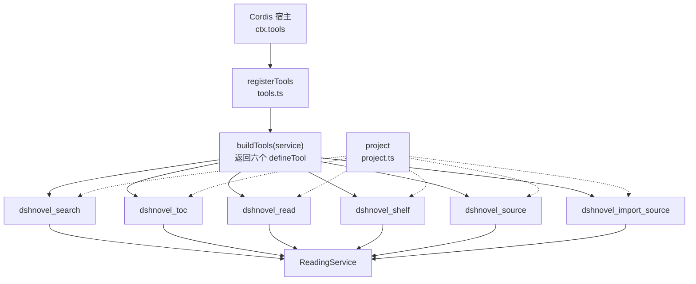
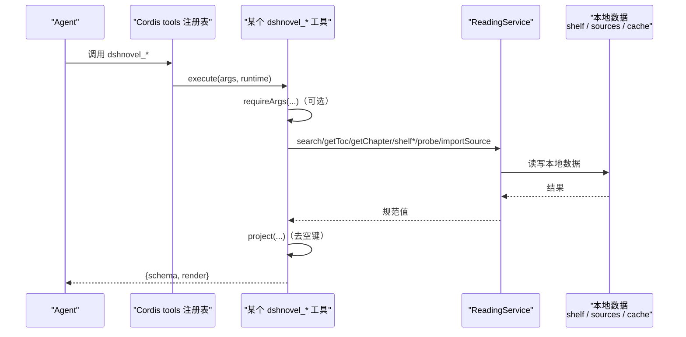
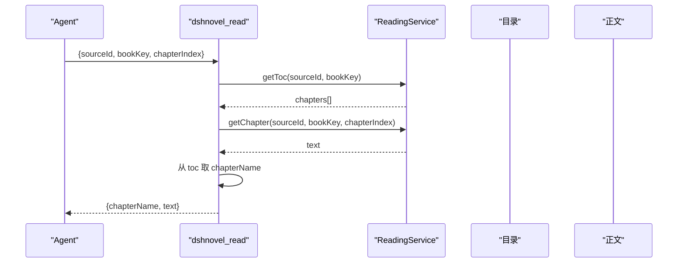
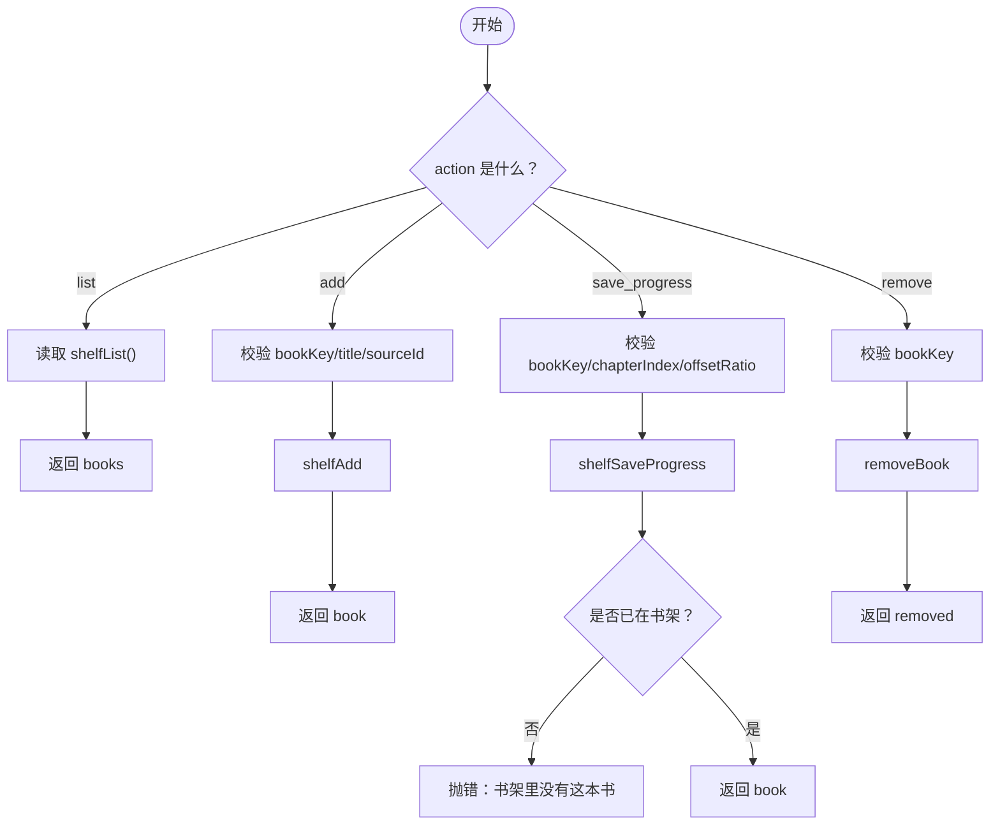
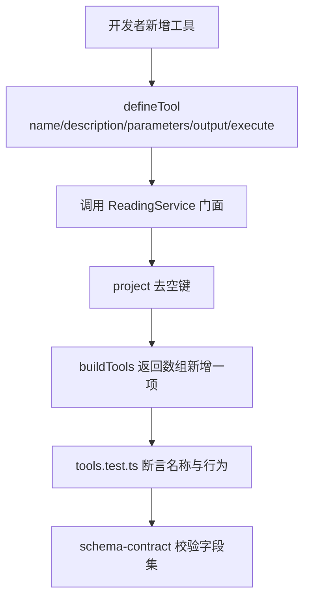

# AI 助手工具

<cite>
**本文引用的文件**   
- [tools.ts](file://src/tools/tools.ts)
- [project.ts](file://src/tools/project.ts)
- [index.ts](file://src/index.ts)
- [reading.ts](file://src/services/reading.ts)
- [0019-tool-surface-vs-wire-contracts.md](file://docs/adr/0019-tool-surface-vs-wire-contracts.md)
- [0020-host-contract-boundaries.md](file://docs/adr/0020-host-contract-boundaries.md)
- [tools.test.ts](file://tests/tools/tools.test.ts)
</cite>

## 目录
1. [简介](#简介)
2. [项目结构](#项目结构)
3. [核心组件](#核心组件)
4. [架构总览](#架构总览)
5. [六个工具详解](#六个工具详解)
6. [依赖关系分析](#依赖关系分析)
7. [性能与扩展性](#性能与扩展性)
8. [故障排查](#故障排查)
9. [安全边界](#安全边界)
10. [扩展指南：新增第七个工具](#扩展指南新增第七个工具)
11. [结论](#结论)

## 简介
本仓库为 DSH 小说插件提供六个面向 Agent 的 `dshnovel_*` 工具，统一通过 Cordis 工具的 `registerTools` 注册表暴露。所有工具共享同一个 `ReadingService` 实例，业务逻辑不直接访问网络、规则或磁盘，而是调用服务门面方法；文本输出由 `render` 投影，规范返回值由 `execute` 产出并通过 `project` 清理空值，以适配 harness 的 lossless JSON 校验。

这六个工具覆盖“找书 → 查目录 → 读章节”的完整阅读链路，以及书架操作和源管理：
- `dshnovel_search`：聚合搜索
- `dshnovel_toc`：目录
- `dshnovel_read`：正文
- `dshnovel_shelf`：书架与进度
- `dshnovel_source`：源管理
- `dshnovel_import_source`：导入 legado 书源 JSON

**本节来源**
- [tools.ts:1-25](file://src/tools/tools.ts#L1-L25)
- [index.ts:170-201](file://src/index.ts#L170-L201)

## 项目结构


**图表来源**
- [tools.ts:1-25](file://src/tools/tools.ts#L1-L25)
- [tools.ts:25-428](file://src/tools/tools.ts#L25-L428)
- [project.ts:1-29](file://src/tools/project.ts#L1-L29)
- [index.ts:170-201](file://src/index.ts#L170-L201)

**本节来源**
- [tools.ts:1-25](file://src/tools/tools.ts#L1-L25)
- [index.ts:170-201](file://src/index.ts#L170-L201)

## 核心组件
- `ReadingService`：唯一业务门面，封装源注册表、书架、缓存、抓取器、任务槽和本地书。工具模块只 `import type { ReadingService }`，不持有实现。
- `buildTools(service)`：构造六个 `defineTool` 定义，每个工具包含 `name`、`description`、`parameters`、`output.schema`、`output.render` 和异步 `execute`。
- `registerTools(ctxLike, service)`：遍历六个工具并调用 `ctxLike.tools.register`，返回聚合 disposer；插件卸载时依次关闭。
- `project(value)`：把 `null`/`undefined` 字段整键省略，保证工具输出通过 harness 的 lossless JSON 校验。
- `requireArgs(action, present, needs)`：在工具层拦截“action 对但缺参数”的情况，抛出含工具名和缺失参数的错误。

**本节来源**
- [tools.ts:1-25](file://src/tools/tools.ts#L1-L25)
- [tools.ts:400-428](file://src/tools/tools.ts#L400-L428)
- [project.ts:1-29](file://src/tools/project.ts#L1-L29)

## 架构总览


**图表来源**
- [tools.ts:25-428](file://src/tools/tools.ts#L25-L428)
- [project.ts:1-29](file://src/tools/project.ts#L1-L29)
- [reading.ts:1-120](file://src/services/reading.ts#L1-L120)

**本节来源**
- [tools.ts:25-428](file://src/tools/tools.ts#L25-L428)
- [reading.ts:1-120](file://src/services/reading.ts#L1-L120)

## 六个工具详解

### dshnovel_search
- **用途**：在已启用的文本书源中聚合搜索书籍，按源分组；单个源失败不影响其他源。
- **参数**
  - `keyword`（必填字符串）：书名或作者关键词。
  - `sourceIds`（可选数组）：限定源 id；省略则搜全部启用的文本源。
- **返回值**
  - `groups`：逐源结果，每项含 `sourceId`、`sourceName`、`status`（verified/broken/unverified）、可选 `statusDetail`、可选 `error`、`hits`。
  - `hits`：书目列表，含 `title`、可选 `author/url/coverUrl/intro/lastChapterName/kind/wordCount`。
- **典型对话**
  - “帮我搜《斗罗大陆》。”
  - “只看源 S 的结果。”
- **错误语义**
  - 参数缺失由 `requireArgs` 抛错。
  - 未知书籍通常表现为某源 `hits` 为空；网络或规则失败记录在 `group.error`，不会中断其他源。
- **render**：汇总组数与命中总数，最多显示每源前五个书名。

**本节来源**
- [tools.ts:25-115](file://src/tools/tools.ts#L25-L115)
- [tools.test.ts:42-66](file://tests/tools/tools.test.ts#L42-L66)

### dshnovel_toc
- **用途**：取书籍目录，给出章名与 0 起的 `chapterIndex`，这是章名到章节下标的唯一映射处。
- **参数**
  - `sourceId`（必填字符串）。
  - `bookKey`（必填字符串）：搜索结果中的详情页 URL。
  - `refresh`（可选布尔）：跳过目录缓存强制重拉。
- **返回值**
  - `sourceId`、`bookKey`、`total`、`chapters`：每项含 `chapterIndex`、`name`、`url`。
- **典型对话**
  - “给我这本书的目录。”
  - “刷新一下目录再列。”
- **错误语义**
  - 越界章节不在这里报，而是在 `dshnovel_read` 调 `service.getToc` 后取值时报 `ChapterNotFoundError`。
- **render**：最多显示前 10 章，规范值仍含全部。

**本节来源**
- [tools.ts:116-165](file://src/tools/tools.ts#L116-L165)
- [tools.test.ts:67-77](file://tests/tools/tools.test.ts#L67-L77)

### dshnovel_read
- **用途**：读取某书第 N 章（0 起）的纯文本；图文书插图转为 `[图片：替代文字]` 占位，不返回图片本身。
- **参数**
  - `sourceId`（必填）。
  - `bookKey`（必填）：来自 `dshnovel_search` 的 `url`。
  - `chapterIndex`（必填整数）：从 `dshnovel_toc` 获取。
- **返回值**
  - `sourceId`、`bookKey`、`chapterIndex`、`chapterName`、`text`。
- **典型对话**
  - “先查目录，然后读第一章。”
  - “跳到第 100 章。”
- **错误语义**
  - 越界章节会抛出 `ChapterNotFoundError`。
  - 若 `bookKey` 不是有效详情页地址，后续服务层查找也会失败。
- **render**：最多截断 2000 字，规范值保留全文。



**图表来源**
- [tools.ts:96-133](file://src/tools/tools.ts#L96-L133)
- [reading.ts:1-120](file://src/services/reading.ts#L1-L120)

**本节来源**
- [tools.ts:96-133](file://src/tools/tools.ts#L96-L133)
- [tools.test.ts:67-72](file://tests/tools/tools.test.ts#L67-L72)

### dshnovel_shelf
- **用途**：书架与阅读进度，支持四种 action。
- **参数与行为**
  - `list`：列出书架条目及进度；无需额外参数。
  - `add`：加书，必填 `bookKey`、`title`、`sourceId`。
  - `save_progress`：保存进度，必填 `bookKey`、`chapterIndex`、`offsetRatio`（0~1）；书必须已在书架。
  - `remove`：移出书架，必填 `bookKey`。
- **返回值**
  - `list`：`books` 数组，每项含 `sourceId`、`bookKey`、`title`、可选元信息、`progress`、`addedAt`。
  - `add`/`save_progress`：`book` 单条回执。
  - `remove`：`removed` 布尔。
- **典型组合**
  - “先把这本书加入书架，读到第 42 章，页内进度一半。”
  - “列出我的书架。”
  - “把《无名书》移出书架。”
- **错误语义**
  - 缺少必填参数抛“缺少参数”错误。
  - `save_progress` 的书不在书架时抛“书架里没有这本书”。
  - `sourceId`、`title` 为空或 `offsetRatio` 非法会抛值域错误。



**图表来源**
- [tools.ts:166-265](file://src/tools/tools.ts#L166-L265)
- [tools.test.ts:100-148](file://tests/tools/tools.test.ts#L100-L148)

**本节来源**
- [tools.ts:166-265](file://src/tools/tools.ts#L166-L265)
- [tools.test.ts:100-148](file://tests/tools/tools.test.ts#L100-L148)

### dshnovel_source
- **用途**：管理书源，包括列出、探针、启用/禁用、删除。
- **参数与行为**
  - `list`：列出全部源，含 `enabled`、`status`、可选 `statusDetail`。
  - `probe`：对单源发真实搜索请求验证可用性，需 `sourceId`。
  - `enable`/`disable`：切换单源启用状态，需 `sourceId`。
  - `remove`：删除单源，需 `sourceId`。
- **返回值**
  - `list`：`sources` 数组。
  - `probe`：`ok`、`status`、`itemCount`、`firstTitle`、`probedAt`、可选 `error`。
  - `enable`/`disable`：`enabled`。
  - `remove`：`removed`。
- **错误语义**
  - 需要 `sourceId` 的 action 缺参抛“缺少参数”。
  - 不存在源时抛“源不存在”。

**本节来源**
- [tools.ts:266-365](file://src/tools/tools.ts#L266-L365)
- [tools.test.ts:149-189](file://tests/tools/tools.test.ts#L149-L189)

### dshnovel_import_source
- **用途**：导入 legado 书源 JSON 文本，可传对象或数组；导入只做规范化与落盘，不探针。
- **参数**
  - `sourceJson`（必填字符串）：legado 书源 JSON。
- **返回值**
  - `outcomes`：逐条结果，含 `ok`、可选 `sourceId`、可选 `dupSkipped`、`missing`、`warnings`。
- **错误语义**
  - JSON 解析失败返回一条 `ok=false`、`missing[0].field='sourceJson'` 的记录。
  - 规范化失败列出缺失字段；成功但重复按址去重时返回 `dupSkipped=true`。
  - 新导入源状态为未验证，需用 `dshnovel_source probe` 验证。

**本节来源**
- [tools.ts:366-428](file://src/tools/tools.ts#L366-L428)
- [tools.test.ts:78-99](file://tests/tools/tools.test.ts#L78-L99)

## 依赖关系分析
```mermaid
classDiagram
  class ToolsCtxLike {
    +tools : { register(t) => () }
  }

  class ToolDefinition {
    +string name
    +string description
    +object parameters
    +object output
    +execute(args)
  }

  class ReadingService {
    +search(keyword, options)
    +getToc(sourceId, bookKey, options?)
    +getChapter(sourceId, bookKey, index)
    +shelfList()
    +shelfAdd(bookKey, meta)
    +shelfSaveProgress(bookKey, chapterIndex, offsetRatio)
    +removeBook(bookKey)
    +listPublicSources()
    +probe(sourceId)
    +setEnabled(id, enabled)
    +hasSource(id)
    +removeSource(id)
    +importSource(raw)
  }

  ToolsCtxLike <.. ToolDefinition : "由宿主提供"
  ToolDefinition --> ReadingService : "execute 调用"
```

**图表来源**
- [tools.ts:1-25](file://src/tools/tools.ts#L1-L25)
- [tools.ts:25-428](file://src/tools/tools.ts#L25-L428)
- [reading.ts:1-120](file://src/services/reading.ts#L1-L120)

**本节来源**
- [tools.ts:1-25](file://src/tools/tools.ts#L1-L25)
- [reading.ts:1-120](file://src/services/reading.ts#L1-L120)

## 性能与扩展性
- 搜索并行度、JS 沙箱预算、缓存大小等默认值集中在组合根与服务构造函数，避免散落的魔法数字。
- 目录与正文页面有最大页数限制，防止超大站点拖垮进程。
- 书架写入带防抖，插件卸载时显式 `flush`，避免刚读到的位置丢失。
- 工具面只做轻量投影与参数门控，复杂逻辑留在 `ReadingService`，有利于测试替换 fetcher、registry 与 shelf。

**本节来源**
- [index.ts:100-201](file://src/index.ts#L100-L201)
- [reading.ts:1-120](file://src/services/reading.ts#L1-L120)

## 故障排查
- **未知书籍**：搜索结果为空或命中数为 0；检查 `keyword` 与 `sourceIds`，确认目标源已启用且状态为 verified。
- **越界章节**：`dshnovel_read` 抛 `ChapterNotFoundError`；先用 `dshnovel_toc` 拿到正确 `chapterIndex`。
- **已取消的搜索任务**：搜索由后台 `SearchJobs` 管理，生命周期交给宿主任务注册表；若 Agent 侧取消任务，应视为任务级失败，而不是书籍不存在。
- **书架操作报错**
  - “缺少参数”：检查 action 对应的必填字段。
  - “书架里没有这本书”：先 `add`，再 `save_progress`。
  - “非空 sourceId/title”“offsetRatio 非法”：检查值域。
- **源管理报错**
  - “源不存在”：用 `list` 核对 `sourceId`。
  - 探针失败：查看 `probe` 返回的 `error.code` 与 `error.message`。

**本节来源**
- [tools.ts:166-265](file://src/tools/tools.ts#L166-L265)
- [tools.ts:266-365](file://src/tools/tools.ts#L266-L365)
- [tools.test.ts:100-189](file://tests/tools/tools.test.ts#L100-L189)

## 安全边界
- **仅访问本机数据**：工具通过 `ReadingService` 访问本地书架、源注册表和缓存；不直接打开任意路径。
- **不执行任意代码**：规则求值经引擎沙箱，工具本身不运行用户脚本；工具只传结构化参数。
- **不直接暴露原始规则**：公开源清单走裁剪后的公共形态；搜索结果不含 `raw`，harness 断言拒绝泄露凭据或原文。
- **名字强约束**：所有工具名必须以 `dshnovel_` 开头；宿主对重名直接抛错，生态命名冲突由前缀隔离。
- **契约分离**：wire 与工具输出口径不同——wire 允许 `null`，工具输出省略空键；类型一致性由运行时 schema 比对与测试钉住。

**本节来源**
- [0019-tool-surface-vs-wire-contracts.md:1-15](file://docs/adr/0019-tool-surface-vs-wire-contracts.md#L1-L15)
- [0020-host-contract-boundaries.md:1-11](file://docs/adr/0020-host-contract-boundaries.md#L1-L11)
- [tools.test.ts:42-66](file://tests/tools/tools.test.ts#L42-L66)
- [project.ts:1-29](file://src/tools/project.ts#L1-L29)

## 扩展指南：新增第七个工具
新增工具时不要绕过 `ReadingService`，也不要手写第二套业务逻辑。

1. **在 `buildTools` 中添加第七个工具**
   - 使用 `defineTool`，设置 `name` 以 `dshnovel_` 开头。
   - 填写 `description`、`parameters`、`output.schema`、`output.render` 和异步 `execute`。
   - 在 `execute` 中调用 `service` 上已有的门面方法；若没有，先在 `ReadingService` 添加。
   - 使用 `project(...)` 处理返回值，确保无 `undefined` 属性值。

2. **更新 `registerTools` 契约**
   - 将新工具加入 `buildTools` 返回数组末尾。
   - 聚合 disposer 已经自动覆盖所有工具，无需改动 `registerTools` 外部逻辑。

3. **更新测试**
   - 在 `tests/tools/tools.test.ts` 中增加对应断言，尤其要覆盖：
     - 工具名集合仍为 6 个以上且全部带 `dshnovel_` 前缀。
     - 参数缺失抛“缺少参数”。
     - 正常返回值不含 `undefined`。
     - 规范值与 wire 或已有 schema 一致。

4. **保持契约同步**
   - 如果返回值与 HTTP wire 对应，优先从 shared wire 派生形状，并通过 `tests/tools/schema-contract.test.ts` 维持字段集一致。
   - 不要手抄两份字段定义；否则 wire 改名不会报红。



**图表来源**
- [tools.ts:25-428](file://src/tools/tools.ts#L25-L428)
- [tools.test.ts:42-66](file://tests/tools/tools.test.ts#L42-L66)

**本节来源**
- [tools.ts:25-428](file://src/tools/tools.ts#L25-L428)
- [tools.test.ts:42-66](file://tests/tools/tools.test.ts#L42-L66)

## 结论
六个 `dshnovel_*` 工具以统一的 `ReadingService` 为唯一业务入口，通过 Cordis tools 注册表暴露给 Agent。它们的安全模型建立在“工具只传参数、服务管规则与数据”的分层之上；名字前缀、lossless JSON 投影、schema 契约与测试共同构成扩展护栏。典型工作流“找书 → 查目录 → 读章节”由 `search`、`toc`、`read` 串联完成，书架操作则由 `shelf` 的 `add/save_progress/remove` 组合实现，源管理由 `source` 与 `import_source` 分工承担。