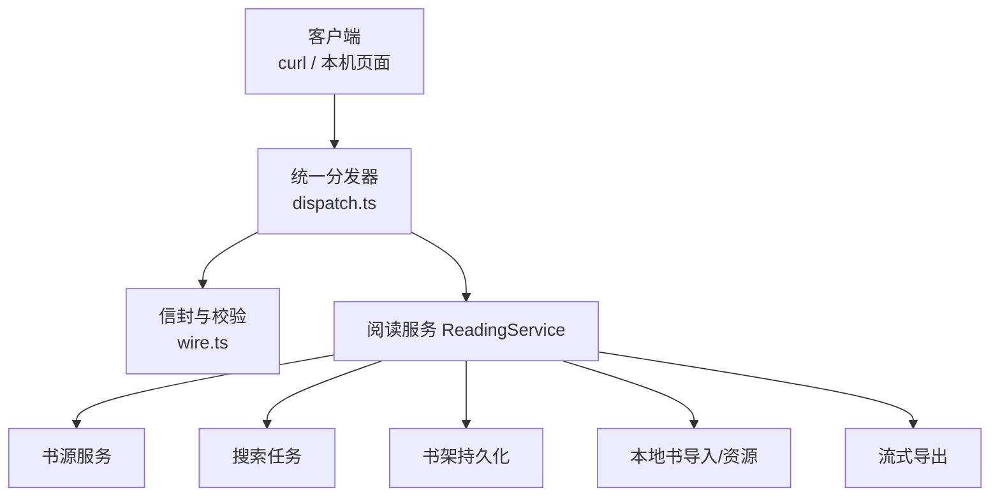
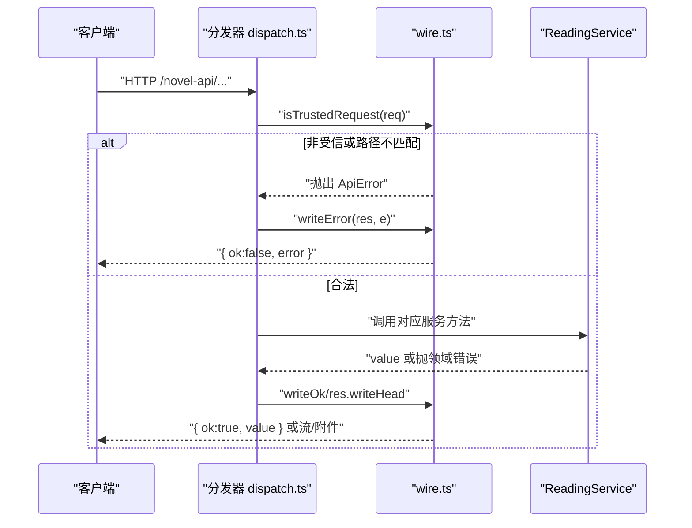
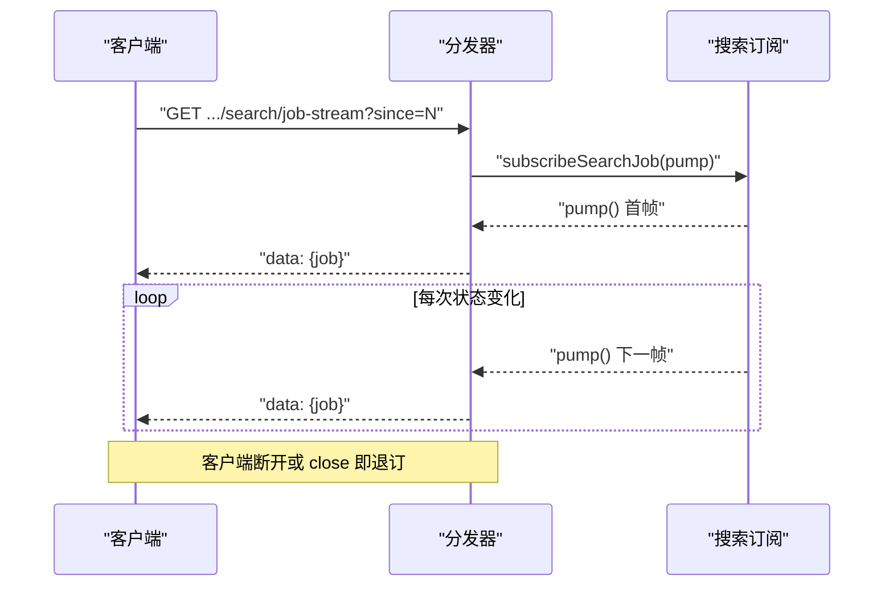
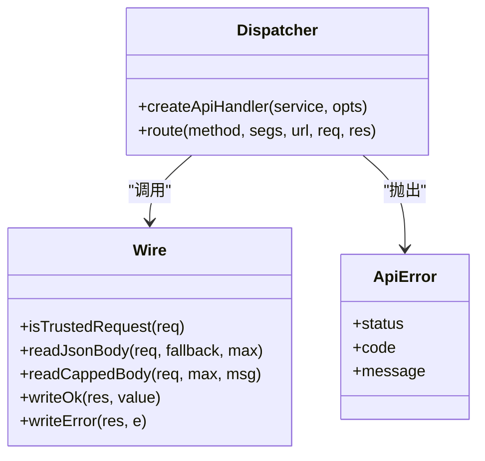

# HTTP API 参考

<cite>
**本文引用的文件**   
- [src/index.ts](file://src/index.ts)
- [src/api/dispatch.ts](file://src/api/dispatch.ts)
- [src/api/wire.ts](file://src/api/wire.ts)
- [tests/tests/api/routes.test.ts](file://tests/tests/api/routes.test.ts)
- [tests/tests/api/dispatch-sources.test.ts](file://tests/tests/api/dispatch-sources.test.ts)
- [tests/tests/api/dispatch-reading.test.ts](file://tests/tests/api/dispatch-reading.test.ts)
- [tests/tests/api/dispatch-export.test.ts](file://tests/tests/api/dispatch-export.test.ts)
- [tests/tests/api/dispatch-local.test.ts](file://tests/tests/api/dispatch-local.test.ts)
</cite>

## 目录
1. [引言](#引言)
2. [项目结构](#项目结构)
3. [核心组件](#核心组件)
4. [架构总览](#架构总览)
5. [详细端点参考](#详细端点参考)
6. [依赖与关系分析](#依赖与关系分析)
7. [性能与背压](#性能与背压)
8. [故障排查](#故障排查)
9. [结论](#结论)

## 引言
本接口文档描述基于 `/novel-api/*` 前缀的 RESTful HTTP API。所有成功响应统一为 JSON 信封 `{ ok: true, value }`，失败响应为 `{ ok: false, error: { code, message, segment? } }`。出于安全考虑，仅允许本机 loopback 访问（`127.0.0.1`、`::1`、IPv4 映射地址）；浏览器跨源请求会被拒绝。

该服务由 Cordis 插件在启动时注册，内部通过一个统一分发器把请求路由到书源、搜索、阅读、书架、导出和本地书等子系统。

## 项目结构
- 插件入口负责：创建 `ReadingService`、挂载 `/novel-api` 前缀路由、注册宿主工具、并在卸载时 flush 书架/源数据。
- 统一分发器按 URL 段匹配功能面，再调用对应服务方法。
- wire 层封装信封写入、JSON body 解析、请求信任校验与错误分类映射。

图表来源
- [src/index.ts:100-201](file://src/index.ts#L100-L201)
- [src/api/dispatch.ts:33-63](file://src/api/dispatch.ts#L33-L63)
- [src/api/wire.ts:35-60](file://src/api/wire.ts#L35-L60)

章节来源
- [src/index.ts:1-201](file://src/index.ts#L1-L201)

## 核心组件
- **统一分发器**：校验受信来源、解析路径段、按 `(a,b,c)` 路由到具体逻辑。
- **信封工具**：`writeOk`、`writeError`、`readJsonBody`、`readCappedBody`、`isTrustedRequest`。
- **错误体系**：路由自检抛 `ApiError(status, code, message)`；领域错误经 `classify` 映射到状态码与错误码。

章节来源
- [src/api/dispatch.ts:33-63](file://src/api/dispatch.ts#L33-L63)
- [src/api/wire.ts:1-135](file://src/api/wire.ts#L1-L135)

## 架构总览

图表来源
- [src/api/dispatch.ts:33-63](file://src/api/dispatch.ts#L33-L63)
- [src/api/wire.ts:92-114](file://src/api/wire.ts#L92-L114)

## 详细端点参考

### 通用约定
- **基础路径**：`/novel-api`
- **成功信封**：`{ ok: true, value }`
- **失败信封**：`{ ok: false, error: { code, message, segment? } }`
- **受信用校验**：仅接受来自 loopback 的请求；若带 `Origin`，必须同源；若带 `Referer`，也必须同源。
- **请求体大小**：JSON body 默认上限 1 MiB；部分接口有独立上限（如导入 32 MiB）。
- **常见 HTTP 状态码**：200 成功；400 请求体/参数非法；403 非受信来源；404 未知路由/资源；405 方法不允许；409 任务互斥；413 负载过大；422 业务校验失败；502/503/500 服务端错误。

章节来源
- [src/api/wire.ts:35-60](file://src/api/wire.ts#L35-L60)
- [src/api/wire.ts:92-135](file://src/api/wire.ts#L92-L135)
- [src/api/dispatch.ts:33-63](file://src/api/dispatch.ts#L33-L63)

---

### 健康检查
- **GET** `/novel-api`

| 项目 | 说明 |
| --- | --- |
| 请求体 | 无 |
| 成功响应 | `{ ok: true, value: { name: "dsh-novel", apiVersion: 1 } }` |
| 失败类型 | 403 非受信来源 |
| curl 示例 | `curl http://127.0.0.1:端口/novel-api` |
| 常见陷阱 | 从非本机 IP 或跨源 Origin 访问会返回 403；不要误以为健康检查需要鉴权。 |

章节来源
- [src/api/dispatch.ts:59-68](file://src/api/dispatch.ts#L59-L68)
- [src/api/wire.ts:35-60](file://src/api/wire.ts#L35-L60)

---

### 书源管理

#### 列出公开书源
- **GET** `/novel-api/sources`

| 项目 | 说明 |
| --- | --- |
| 请求体 | 无 |
| 成功响应 | 书源列表 |
| 失败类型 | 403 |
| curl 示例 | `curl http://127.0.0.1:端口/novel-api/sources` |

章节来源
- [src/api/dispatch.ts:70-80](file://src/api/dispatch.ts#L70-L80)

#### 导入书源（后台任务）
- **POST** `/novel-api/sources/import`

| 项目 | 说明 |
| --- | --- |
| 请求体 | `{ files: [{ name: string, text: string }] }` |
| 成功响应 | 任务回执 |
| 失败类型 | 400 请求体非法；413 超过 32 MiB；403 |
| curl 示例 | `curl -X POST http://127.0.0.1:端口/novel-api/sources/import -H 'Content-Type: application/json' -d '{"files":[{"name":"s.json","text":"..."}]}'` |
| 常见陷阱 | `files` 必须是非空数组，每项必须含字符串字段 `name` 和 `text`。 |

章节来源
- [src/api/dispatch.ts:80-98](file://src/api/dispatch.ts#L80-L98)

#### 查询书源导入任务状态
- **GET** `/novel-api/sources/job-status`

| 项目 | 说明 |
| --- | --- |
| 请求体 | 无 |
| 成功响应 | `{ job: 任务状态对象 }` |
| 失败类型 | 403 |
| curl 示例 | `curl http://127.0.0.1:端口/novel-api/sources/job-status` |
| 语义补充 | 任务结束后结果保留到下一个任务开始；刷新后重新挂载可恢复展示。 |

章节来源
- [src/api/dispatch.ts:98-106](file://src/api/dispatch.ts#L98-L106)

#### 批量探测
- **POST** `/novel-api/sources/batch-probe`

| 项目 | 说明 |
| --- | --- |
| 请求体 | `{ ids: string[] }` |
| 成功响应 | 任务回执 |
| 失败类型 | 400 非空字符串数组；403 |
| curl 示例 | `curl -X POST http://127.0.0.1:端口/novel-api/sources/batch-probe -H 'Content-Type: application/json' -d '{"ids":["id1","id2"]}'` |

章节来源
- [src/api/dispatch.ts:106-114](file://src/api/dispatch.ts#L106-L114)

#### 批量启用/停用
- **POST** `/novel-api/sources/batch-enabled`

| 项目 | 说明 |
| --- | --- |
| 请求体 | `{ ids: string[], enabled: boolean }` |
| 成功响应 | `{ updated: number }` |
| 失败类型 | 400；403 |
| curl 示例 | `curl -X POST http://127.0.0.1:端口/novel-api/sources/batch-enabled -H 'Content-Type: application/json' -d '{"ids":["id1"],"enabled":true}'` |
| 常见陷阱 | 未知 id 静默跳过；重复 id 幂等；一次编辑一次落盘。 |

章节来源
- [src/api/dispatch.ts:126-140](file://src/api/dispatch.ts#L126-L140)

#### 批量删除
- **POST** `/novel-api/sources/batch-delete`

| 项目 | 说明 |
| --- | --- |
| 请求体 | `{ ids: string[] }` |
| 成功响应 | `{ removed: number }` |
| 失败类型 | 400；403 |
| curl 示例 | `curl -X POST http://127.0.0.1:端口/novel-api/sources/batch-delete -H 'Content-Type: application/json' -d '{"ids":["id1","id2"]}'` |

章节来源
- [src/api/dispatch.ts:140-150](file://src/api/dispatch.ts#L140-L150)

#### 单源探测
- **POST** `/novel-api/sources/:id/probe`

| 项目 | 说明 |
| --- | --- |
| 路径参数 | `id`: 书源标识 |
| 请求体 | 无 |
| 成功响应 | 探测结果 |
| 失败类型 | 404 源不存在；403 |
| curl 示例 | `curl -X POST http://127.0.0.1:端口/novel-api/sources/某源/probe` |

章节来源
- [src/api/dispatch.ts:114-120](file://src/api/dispatch.ts#L114-L120)

#### 单源启用/停用
- **POST** `/novel-api/sources/:id/enabled`

| 项目 | 说明 |
| --- | --- |
| 路径参数 | `id`: 书源标识 |
| 请求体 | `{ enabled: boolean }` |
| 成功响应 | `{ enabled: boolean }` |
| 失败类型 | 400；404 源不存在；403 |
| curl 示例 | `curl -X POST http://127.0.0.1:端口/novel-api/sources/某源/enabled -H 'Content-Type: application/json' -d '{"enabled":false}'` |
| 常见陷阱 | 停用表示不参与聚合搜索；试跑/验证不受影响。 |

章节来源
- [src/api/dispatch.ts:120-126](file://src/api/dispatch.ts#L120-L126)

#### 设置登录态
- **POST** `/novel-api/sources/:id/auth`

| 项目 | 说明 |
| --- | --- |
| 路径参数 | `id`: 书源标识 |
| 请求体 | 二选一： 1) `{ runLogin: true }` 2) `{ cookies: Record<string,string>, headers?: Record<string,string> }` |
| 成功响应 | 模式返回 `{ mode:"manual", loginUrl }` 或 `{ auth: true }` |
| 失败类型 | 400 未声明 loginUrl/表单非法；422 脚本未产出 cookie；404 源不存在；403 |
| curl 示例 | `curl -X POST http://127.0.0.1:端口/novel-api/sources/某源/auth -H 'Content-Type: application/json' -d '{"runLogin":true}'` |
| 常见陷阱 | `runLogin=true` 且源支持 JS 登录时，脚本未返回 cookie 会返回 422 LoginFailed；手动模式只给 URL，不会注入 Cookie。 |

章节来源
- [src/api/dispatch.ts:120-126](file://src/api/dispatch.ts#L120-L126)
- [src/api/dispatch.ts:491-530](file://src/api/dispatch.ts#L491-L530)

#### 删除书源
- **DELETE** `/novel-api/sources/:id`

| 项目 | 说明 |
| --- | --- |
| 路径参数 | `id`: 书源标识 |
| 请求体 | 无 |
| 成功响应 | `{ removed: boolean }` |
| 失败类型 | 403 |
| curl 示例 | `curl -X DELETE http://127.0.0.1:端口/novel-api/sources/某源` |

章节来源
- [src/api/dispatch.ts:150-156](file://src/api/dispatch.ts#L150-L156)

---

### 搜索

#### 搜索参与计划
- **GET** `/novel-api/search/plan`

| 项目 | 说明 |
| --- | --- |
| 请求体 | 无 |
| 成功响应 | 参与集计划 |
| 失败类型 | 403 |
| curl 示例 | `curl http://127.0.0.1:端口/novel-api/search/plan` |
| 用途 | 客户端据此分批发起搜索并维护进度。 |

章节来源
- [src/api/dispatch.ts:158-164](file://src/api/dispatch.ts#L158-L164)

#### 提交搜索任务
- **POST** `/novel-api/search/job`

| 项目 | 说明 |
| --- | --- |
| 请求体 | `{ keyword: string, sourceIds?: string[] }` |
| 成功响应 | 任务回执 |
| 失败类型 | 400 缺 keyword 或 sourceIds 非法；403 |
| curl 示例 | `curl -X POST http://127.0.0.1:端口/novel-api/search/job -H 'Content-Type: application/json' -d '{"keyword":"书名"}'` |
| 常见陷阱 | keyword 为空串等同缺失；sourceIds 若提供必须是字符串数组。 |

章节来源
- [src/api/dispatch.ts:164-176](file://src/api/dispatch.ts#L164-L176)

#### 查询搜索任务状态
- **GET** `/novel-api/search/job-status?since=N`

| 项目 | 说明 |
| --- | --- |
| 查询参数 | `since`: 上次收到的游标，正整数有效；缺省或非法回退为 0 |
| 成功响应 | `{ job: 任务快照或 null }` |
| 失败类型 | 403 |
| curl 示例 | `curl "http://127.0.0.1:端口/novel-api/search/job-status?since=123"` |
| since 语义 | 轮询通道以 since 游标兜底；推送不 replay，显式 query 才是真相。 |

章节来源
- [src/api/dispatch.ts:214-220](file://src/api/dispatch.ts#L214-L220)

#### SSE 搜索进度流
- **GET** `/novel-api/search/job-stream?since=N`

| 项目 | 说明 |
| --- | --- |
| 查询参数 | `since`: 同上 |
| 响应头 | `content-type: text/event-stream; charset=utf-8` |
| 消息格式 | `data: <JSON>`，其中 JSON 为 `{ job }` |
| 生命周期 | 首帧发送当前快照；终态关闭流；断线重连需携带已收游标 |
| 失败类型 | 403 |
| curl 示例 | `curl -N "http://127.0.0.1:端口/novel-api/search/job-stream?since=123"` |
| 取消语义 | 停止 ≠ 放弃：本轮立即进终态，不再开新源，已搜分组仍可读 |

图表来源
- [src/api/dispatch.ts:176-214](file://src/api/dispatch.ts#L176-L214)

章节来源
- [src/api/dispatch.ts:176-220](file://src/api/dispatch.ts#L176-L220)

#### 取消搜索任务
- **POST** `/novel-api/search/job-cancel`

| 项目 | 说明 |
| --- | --- |
| 请求体 | 无 |
| 成功响应 | 取消回执 |
| 失败类型 | 403 |
| curl 示例 | `curl -X POST http://127.0.0.1:端口/novel-api/search/job-cancel` |
| 语义 | 停止本轮搜索，已出分组仍可读取。 |

章节来源
- [src/api/dispatch.ts:176-182](file://src/api/dispatch.ts#L176-L182)

#### 同步搜索
- **GET** `/novel-api/search?keyword=...&sourceIds=a,b,...`

| 项目 | 说明 |
| --- | --- |
| 查询参数 | `keyword`（必填）、`sourceIds`（可选逗号分隔） |
| 成功响应 | 搜索结果 |
| 失败类型 | 400 缺 keyword；403 |
| curl 示例 | `curl "http://127.0.0.1:端口/novel-api/search?keyword=书名"` |

章节来源
- [src/api/dispatch.ts:220-228](file://src/api/dispatch.ts#L220-L228)

---

### 阅读

以下端点均使用查询参数：
- `sourceId`：书源标识
- `url`：书目地址

#### 获取书籍详情
- **GET** `/novel-api/book?sourceId=...&url=...`

| 项目 | 说明 |
| --- | --- |
| 成功响应 | 书籍详情 |
| 失败类型 | 400 缺参数；404 书不在源中；403 |
| curl 示例 | `curl "http://127.0.0.1:端口/novel-api/book?sourceId=某源&url=https://..."` |

章节来源
- [src/api/dispatch.ts:228-236](file://src/api/dispatch.ts#L228-L236)

#### 获取目录
- **GET** `/novel-api/toc?sourceId=...&url=...&refresh=1`

| 项目 | 说明 |
| --- | --- |
| 查询参数 | `refresh=1` 强制刷新 |
| 成功响应 | 目录数组 |
| 失败类型 | 400 缺参数；403 |
| curl 示例 | `curl "http://127.0.0.1:端口/novel-api/toc?sourceId=某源&url=...&refresh=1"` |

章节来源
- [src/api/dispatch.ts:236-244](file://src/api/dispatch.ts#L236-L244)

#### 获取导航树
- **GET** `/novel-api/navigation?sourceId=...&url=...`

| 项目 | 说明 |
| --- | --- |
| 成功响应 | 线性 chapters + items 展示树 |
| 失败类型 | 400 缺参数；403 |
| curl 示例 | `curl "http://127.0.0.1:端口/novel-api/navigation?sourceId=某源&url=..."` |

章节来源
- [src/api/dispatch.ts:244-252](file://src/api/dispatch.ts#L244-L252)

#### 获取章节正文
- **GET** `/novel-api/chapter?sourceId=...&url=...&index=N&refresh=1`

| 项目 | 说明 |
| --- | --- |
| 查询参数 | `index`: 非负整数；`refresh=1` 可选 |
| 成功响应 | ChapterContent |
| 失败类型 | 400 缺 index 或非法；403 |
| curl 示例 | `curl "http://127.0.0.1:端口/novel-api/chapter?sourceId=某源&url=...&index=0"` |

章节来源
- [src/api/dispatch.ts:252-262](file://src/api/dispatch.ts#L252-L262)

---

### 书架

#### 列出书架
- **GET** `/novel-api/shelf`

| 项目 | 说明 |
| --- | --- |
| 成功响应 | 书架条目 |
| 失败类型 | 403 |
| curl 示例 | `curl http://127.0.0.1:端口/novel-api/shelf` |

章节来源
- [src/api/dispatch.ts:270-278](file://src/api/dispatch.ts#L270-L278)

#### 加书 / 打补丁 / 更新进度
- **PUT** `/novel-api/shelf/:key`

| 项目 | 说明 |
| --- | --- |
| 路径参数 | `key`: 书架键 |
| 请求体三态 | 1) `{ title: string, ... }` 加书 2) `{ patch: {...} }` 打补丁 3) `{ progress: { chapterIndex: number, offsetRatio: number } }` 更新进度 |
| 成功响应 | 对应操作结果 |
| 失败类型 | 400 请求体非法/不在架；403 |
| curl 示例 | `curl -X PUT http://127.0.0.1:端口/novel-api/shelf/某Key -H 'Content-Type: application/json' -d '{"title":"书名"}'` |
| 常见陷阱 | 不在架时打补丁或写进度返回 400；三者只能选其一。 |

章节来源
- [src/api/dispatch.ts:278-286](file://src/api/dispatch.ts#L278-L286)
- [src/api/dispatch.ts:504-528](file://src/api/dispatch.ts#L504-L528)

#### 删除书架条目
- **DELETE** `/novel-api/shelf/:key`

| 项目 | 说明 |
| --- | --- |
| 路径参数 | `key`: 书架键 |
| 成功响应 | 删除回执 |
| 失败类型 | 403 |
| curl 示例 | `curl -X DELETE http://127.0.0.1:端口/novel-api/shelf/某Key` |
| 备注 | 本地书副本连带删除，防孤儿。 |

章节来源
- [src/api/dispatch.ts:286-294](file://src/api/dispatch.ts#L286-L294)

#### 批量删除书架条目
- **POST** `/novel-api/shelf/batch-delete`

| 项目 | 说明 |
| --- | --- |
| 请求体 | `{ keys: string[] }` |
| 成功响应 | 批量删除回执 |
| 失败类型 | 400；403 |
| curl 示例 | `curl -X POST http://127.0.0.1:端口/novel-api/shelf/batch-delete -H 'Content-Type: application/json' -d '{"keys":["k1","k2"]}'` |

章节来源
- [src/api/dispatch.ts:262-270](file://src/api/dispatch.ts#L262-L270)

---

### 导出

#### 流式 TXT 导出
- **GET** `/novel-api/export?sourceId=...&url=...&title=...&from=N&to=M`

| 项目 | 说明 |
| --- | --- |
| 查询参数 | `sourceId`、`url`（必填）；`title`（缺省“未命名”）；`from`、`to`（1 基含端，缺省全本） |
| 响应类型 | `text/plain; charset=utf-8`，带 `attachment` |
| 额外头 | `x-novel-total-chapters`、`x-novel-range` |
| 失败类型 | 400 缺参数/范围非法；422 目录为空/范围倒置；403 |
| curl 示例 | `curl -o 导出.txt "http://127.0.0.1:端口/novel-api/export?sourceId=某源&url=...&title=书名&from=1&to=10"` |
| 背压处理 | 当 `res.write` 返回 false 时等待 drain；若连接已死则提前退出。 |
| 取消语义 | 客户端断开响应时中止后续章节。 |

章节来源
- [src/api/dispatch.ts:296-376](file://src/api/dispatch.ts#L296-L376)

---

### 本地书

#### 导入本地书
- **POST** `/novel-api/local/import?name=文件名`

| 项目 | 说明 |
| --- | --- |
| 查询参数 | `name`（必填） |
| 请求体 | 原始文件字节流（TXT/EPUB 分流） |
| 成功响应 | 本地导入回执 |
| 失败类型 | 400 缺 name；413 超过 localImportMaxBytes；403 |
| curl 示例 | `curl -X POST "http://127.0.0.1:端口/novel-api/local/import?name=book.epub" --data-binary @book.epub` |
| 常见陷阱 | 文件名是 query 参数，不是请求体字段。 |

章节来源
- [src/api/dispatch.ts:378-396](file://src/api/dispatch.ts#L378-L396)

#### 删除本地书
- **DELETE** `/novel-api/local?id=...`

| 项目 | 说明 |
| --- | --- |
| 查询参数 | `id`（必填） |
| 成功响应 | 删除回执 |
| 失败类型 | 403 |
| curl 示例 | `curl -X DELETE "http://127.0.0.1:端口/novel-api/local?id=本地书id"` |

章节来源
- [src/api/dispatch.ts:420-428](file://src/api/dispatch.ts#L420-L428)

#### 获取补充文档正文
- **GET** `/novel-api/local/document?id=...&documentId=...`

| 项目 | 说明 |
| --- | --- |
| 查询参数 | `id`、`documentId`（均必填） |
| 成功响应 | 文档内容 |
| 失败类型 | 400 缺参数；403 |
| curl 示例 | `curl "http://127.0.0.1:端口/novel-api/local/document?id=bookKey&documentId=doc1"` |

章节来源
- [src/api/dispatch.ts:396-404](file://src/api/dispatch.ts#L396-L404)

#### 获取资源
- **GET** `/novel-api/local/resource?id=...&resourceId=...`

| 项目 | 说明 |
| --- | --- |
| 查询参数 | `id`、`resourceId`（均必填） |
| 响应头 | `content-type`、`content-length`、`x-content-type-options: nosniff`、`cross-origin-resource-policy: same-origin`、`cache-control: private, max-age=3600`；SVG 额外附 CSP |
| 失败类型 | 404 资源不存在；403 |
| curl 示例 | `curl "http://127.0.0.1:端口/novel-api/local/resource?id=bookKey&resourceId=img1"` |
| 常见陷阱 | 资源口只服务 `` 类场景，不提供原文下载。 |

章节来源
- [src/api/dispatch.ts:404-420](file://src/api/dispatch.ts#L404-L420)
- [src/api/dispatch.ts:446-470](file://src/api/dispatch.ts#L446-L470)

#### 获取导入警告
- **GET** `/novel-api/local/warnings?id=...`

| 项目 | 说明 |
| --- | --- |
| 查询参数 | `id`（必填） |
| 成功响应 | 导入说明/警告 |
| 失败类型 | 400 缺参数；403 |
| curl 示例 | `curl "http://127.0.0.1:端口/novel-api/local/warnings?id=bookKey"` |

章节来源
- [src/api/dispatch.ts:404-412](file://src/api/dispatch.ts#L404-L412)

---

## 依赖与关系分析
- 分发器依赖 wire 层的信封与校验函数。
- 所有业务动词最终委托 `ReadingService`；分发器自身不做业务实现。
- 错误分为两类：
  - 路由自检错误：直接构造 `ApiError`，携带 status/code。
  - 领域错误：经 `classify` 映射到 `STATUS_OF` 表。

图表来源
- [src/api/dispatch.ts:33-63](file://src/api/dispatch.ts#L33-L63)
- [src/api/wire.ts:1-135](file://src/api/wire.ts#L1-L135)

章节来源
- [src/api/dispatch.ts:33-63](file://src/api/dispatch.ts#L33-L63)
- [src/api/wire.ts:1-135](file://src/api/wire.ts#L1-L135)

## 性能与背压
- **SSE 推送**：每帧写入后立即检查终态并结束流；客户端断开即退订监听器，避免死连接攒帧。
- **流式导出**：使用 `for await` 生成器消费章节；当 `res.write` 返回 false 时等待 `drain`，同时先检查 `res.destroyed` 防止漏掉断连取消。
- **本地资源流**：将文件流直接 pipe 到响应；对 close/error 事件销毁流，避免 FileHandle 泄漏。
- **代理缓冲**：SSE 头设置 `x-accel-buffering: no`，防止反向代理把即时推送缓存成整批迟到。

章节来源
- [src/api/dispatch.ts:176-214](file://src/api/dispatch.ts#L176-L214)
- [src/api/dispatch.ts:320-376](file://src/api/dispatch.ts#L320-L376)
- [src/api/dispatch.ts:404-420](file://src/api/dispatch.ts#L404-L420)

## 故障排查
- **403 非受信来源**：检查是否从本机访问；浏览器跨源 Origin 必须同源；curl 不带 Origin 即可。
- **400 请求体非法**：确认 JSON 结构、必填字段与类型；注意 `keyword` 不能为空串；`index` 必须是非负整数。
- **405 方法不允许**：核对 HTTP 方法与端点契约；例如 `/sources` 列表只支持 GET，导入走 `/sources/import`。
- **404 未知路由或资源**：确认路径段拼写；本地书删除用 `/local?id=...`，不是路径段。
- **409 任务互斥**：已有同类任务在执行，需等待或取消后再提交。
- **413 负载过大**：JSON body 超 1 MiB，或本地导入超过配置上限。
- **422 业务校验失败**：目录为空、导出范围非法、登录脚本未产出 cookie 等。
- **SSE 断线重连**：带上上次收到的 `since` 游标；注意推送不 replay，必要时用 `job-status` 拉取真相。
- **流式导出中断**：客户端取消后会收到 200 但内容提前结束；服务端会在末尾尝试补写中断标记，但 socket 已死时可能丢弃。

章节来源
- [src/api/wire.ts:35-60](file://src/api/wire.ts#L35-L60)
- [src/api/wire.ts:92-135](file://src/api/wire.ts#L92-L135)
- [src/api/dispatch.ts:320-376](file://src/api/dispatch.ts#L320-L376)
- [src/api/dispatch.ts:491-530](file://src/api/dispatch.ts#L491-L530)

## 结论
该 API 围绕 `/novel-api` 单一前缀组织，通过统一分发器与 wire 层提供一致的信封、校验与安全边界。书源、搜索、阅读、书架、导出和本地书等功能在服务层解耦，路由层专注参数校验、信封包装与错误分类。SSE 与流式导出采用显式的背压与取消语义，适合本机工具与同域前端集成。