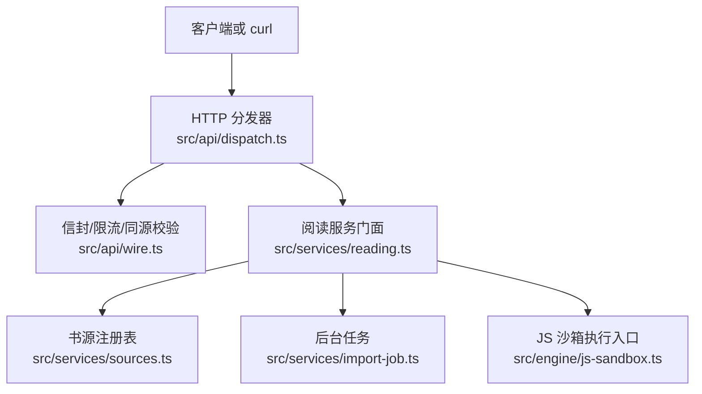
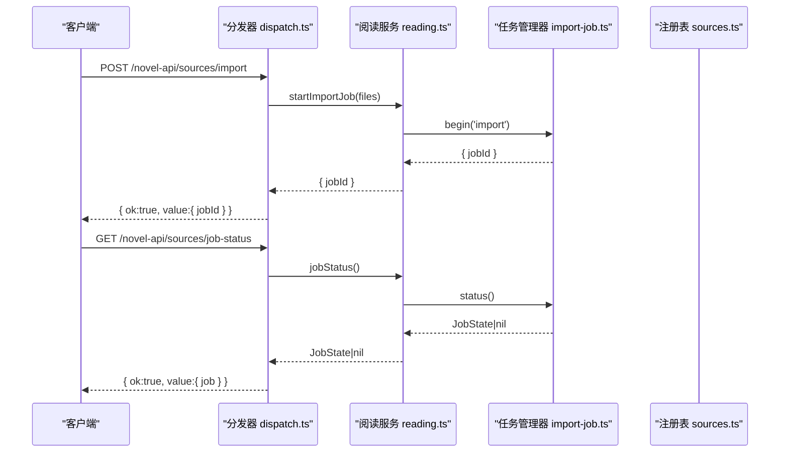
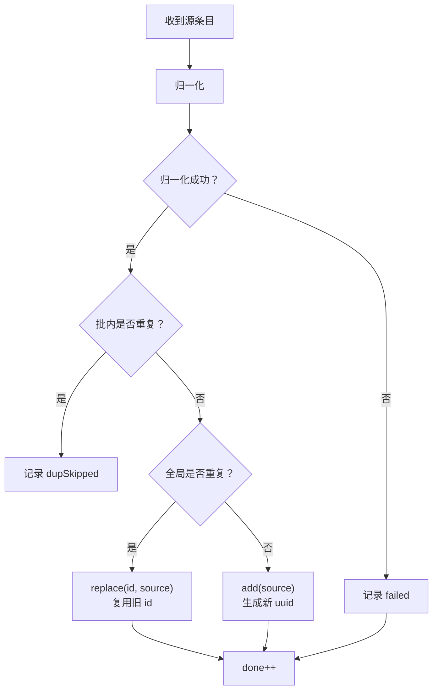
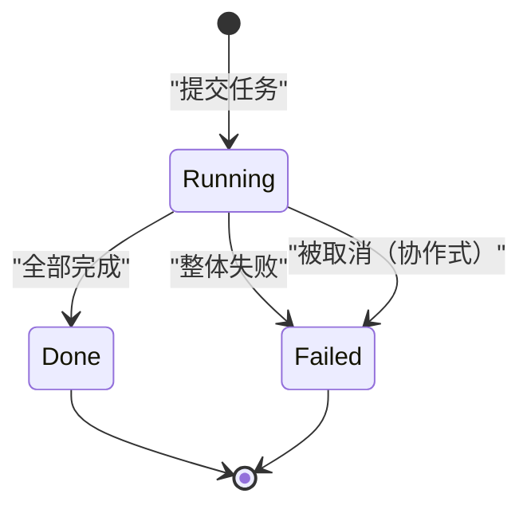
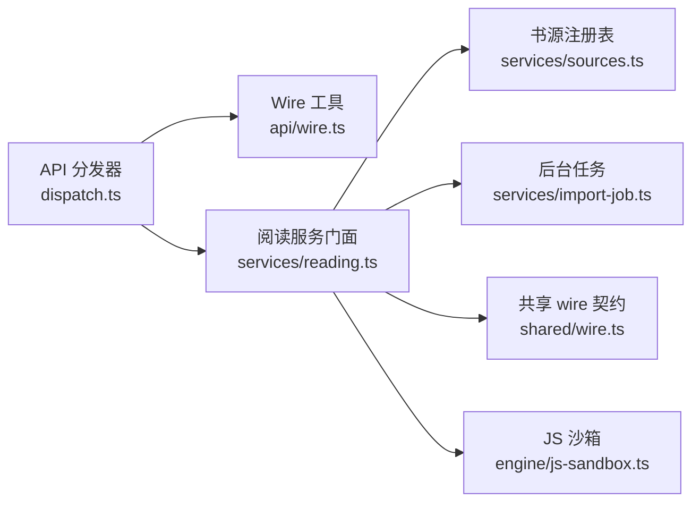
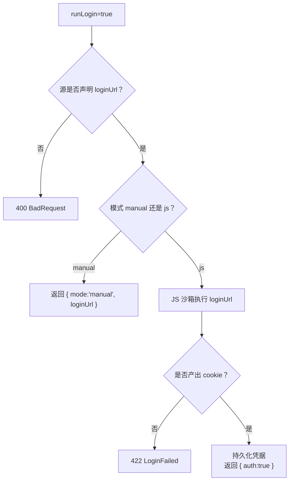

# 书源 API

<cite>
**本文引用的文件**
- [dispatch.ts](file://src/api/dispatch.ts)
- [wire.ts](file://src/api/wire.ts)
- [sources.ts](file://src/services/sources.ts)
- [import-job.ts](file://src/services/import-job.ts)
- [reading.ts](file://src/services/reading.ts)
- [wire.ts（共享契约）](file://src/shared/wire.ts)
- [js-sandbox.ts](file://src/engine/js-sandbox.ts)
- [dispatch-sources.test.ts](file://tests/api/dispatch-sources.test.ts)
</cite>

## 目录
1. [引言](#引言)
2. [项目结构](#项目结构)
3. [核心组件](#核心组件)
4. [架构总览](#架构总览)
5. [端点参考](#端点参考)
6. [同源去重策略](#同源去重策略)
7. [待办收件箱与 JobState 轮询语义](#待办收件箱与-jobstate-轮询语义)
8. [依赖关系分析](#依赖关系分析)
9. [性能注意事项](#性能注意事项)
10. [故障排查指南](#故障排查指南)
11. [结论](#结论)

## 引言
本文档面向调用方，系统性说明“书源管理”相关 HTTP API。所有端点统一以 `/novel-api` 为前缀，由 Node 侧的 `createApiHandler` 路由分发，最终委托 `ReadingService` 与 `SourceRegistry`、`SourceJobs` 等内部服务完成数据加载、持久化、导入任务、批量探针和认证逻辑。成功响应一律采用 `{ ok: true, value }` 信封；失败采用 `{ ok: false, error }` 信封，错误体包含 `code`、`message`，并在引擎类错误中附带段级定位字段。

## 项目结构
书源 API 的 HTTP 层集中在分发器中：它校验来源可信性、解析路径段、做请求体验证，再把业务交给阅读服务。共享类型（`SourcePublic`、`JobState`、`ProbeResult` 等）定义在共享 wire 契约中，供 Node 半与浏览器半共同消费。



**图表来源**
- [dispatch.ts:1-200](file://src/api/dispatch.ts#L1-L200)
- [wire.ts:1-135](file://src/api/wire.ts#L1-L135)
- [reading.ts:223-388](file://src/services/reading.ts#L223-L388)
- [sources.ts:1-294](file://src/services/sources.ts#L1-L294)
- [import-job.ts:1-200](file://src/services/import-job.ts#L1-L200)
- [js-sandbox.ts:1-200](file://src/engine/js-sandbox.ts#L1-L200)

**章节来源**
- [dispatch.ts:1-200](file://src/api/dispatch.ts#L1-L200)
- [wire.ts:1-135](file://src/api/wire.ts#L1-L135)

## 核心组件
- **HTTP 分发器**：负责同源校验、方法白名单、JSON body 上限、路由分派、统一错误信封。
- **阅读服务门面**：对外暴露 `listPublicSources`、`probe`、`setEnabled`、`setEnabledMany`、`removeSources`、`startImportJob`、`startBatchProbeJob`、`jobStatus`、`loginPlan`、`runLogin`、`saveAuth` 等方法。
- **书源注册表**：维护内存中的源列表，提供原子 edit、合并落盘、只读投影 `toPublic`，并剥离 `raw`、`rules`、`auth` 等敏感字段。
- **后台任务管理器**：单任务槽互斥，持有 `JobState`，支持导入与批量探针两种任务，结果保留到下一任务开始。
- **共享 wire 契约**：定义 `SourcePublic`、`JobState`、`ProbeResult`、`JobIssue` 等跨半类型。

**章节来源**
- [sources.ts:1-294](file://src/services/sources.ts#L1-L294)
- [import-job.ts:1-200](file://src/services/import-job.ts#L1-L200)
- [shared/wire.ts:43-118](file://src/shared/wire.ts#L43-L118)

## 架构总览
书源管理的主要流程如下：



**图表来源**
- [dispatch.ts:85-100](file://src/api/dispatch.ts#L85-L100)
- [reading.ts:378-388](file://src/services/reading.ts#L378-L388)
- [import-job.ts:68-136](file://src/services/import-job.ts#L68-L136)

## 端点参考

### 通用约定
- 所有成功响应：`{ ok: true, value: ... }`
- 所有失败响应：`{ ok: false, error: { code, message, segment? } }`
- JSON 信封默认最大 1 MiB；导入正文显式放宽到 32 MiB。
- 所有请求必须通过本地回环进入；跨域浏览器 POST 若携带 `Origin` 且非同源会被拒绝。

#### 同源校验与错误映射要点
- 非回环地址直接拒绝。
- 存在 `Origin` 时要求与 `Host` 同源；缺失 `Origin` 时仍允许本机工具访问。
- 引擎错误按分类映射为 422/502/404/400/503/409/500 等状态码，`ApiError` 自带状态码直通。

**章节来源**
- [wire.ts:1-135](file://src/api/wire.ts#L1-L135)
- [dispatch.ts:1-60](file://src/api/dispatch.ts#L1-L60)

---

### GET `/novel-api/sources`
列出对外可见的书源投影。

- **方法**：GET
- **路径**：`/novel-api/sources`
- **请求体**：无
- **响应体**：`SourcePublic[]`
- **关键字段**：
  - `id`：书源唯一标识
  - `name`：名称
  - `baseUrl`：站点根地址
  - `enabled`：是否参与聚合搜索
  - `groups`：分组数组
  - `type`：内容形态（text/image/audio/file/unknown）
  - `status`：`unverified` | `verified` | `broken`
  - `statusDetail`：可选诊断信息
  - `importedAt`：导入时间戳
  - `lastProbedAt`：可选最近探针时间戳
  - `hasHeader`：是否声明静态头或动态头规则
  - `hasAuth`：是否已保存凭据
  - `authExpired`：凭据是否过期
  - `hasLoginUrl`：是否声明登录页 URL
- **不包含字段**：`raw`、`rules`、`auth` 等凭据与原文。

**curl 示例**
```bash
curl -s http://127.0.0.1:PORT/novel-api/sources | jq .
```

**常见陷阱**
- 新导入源初始状态为 `unverified`，不会自动验证。
- `enabled=false` 仅表示不参与聚合搜索，不影响试跑或验证。

**章节来源**
- [dispatch.ts:70-78](file://src/api/dispatch.ts#L70-L78)
- [sources.ts:201-221](file://src/services/sources.ts#L201-L221)
- [shared/wire.ts:43-78](file://src/shared/wire.ts#L43-L78)

---

### POST `/novel-api/sources/import`
批量导入 legacy JSON 书源文件，返回异步任务 ID。

- **方法**：POST
- **路径**：`/novel-api/sources/import`
- **请求体**：`{ files: [{ name: string, text: string }] }`
- **响应体**：`{ jobId: string }`
- **状态码**：
  - 200：任务已接受
  - 400：files 为空、元素缺 `name`/`text`、JSON 不合法
  - 413：body 超过 32 MiB
  - 409：已有后台任务仍在运行
- **行为**：
  - 逐文件解析 JSON；解析失败写入 `fileErrors`，其他文件继续处理。
  - 每个源条目走归一化与入库去重：新增、替换旧源、跳过重复。
  - 导入完成后状态置为 `unverified`，不自动探针。
  - 结果保存在 `JobState`，后续通过 `job-status` 轮询。

**curl 示例**
```bash
curl -s -X POST http://127.0.0.1:PORT/novel-api/sources/import \
  -H 'Content-Type: application/json' \
  -d '{"files":[{"name":"legacy.json","text":"[...源条目...]"}]}' | jq .
```

**常见陷阱**
- 多源导出包可达数 MB；不要使用默认 1 MiB 信封上限，该端点已放宽到 32 MiB。
- 单个 JSON 内可放多个源条目；非法 JSON 只会记录文件错误，不中断同批其他文件。

**章节来源**
- [dispatch.ts:85-95](file://src/api/dispatch.ts#L85-L95)
- [import-job.ts:126-194](file://src/services/import-job.ts#L126-L194)
- [dispatch-sources.test.ts:20-60](file://tests/api/dispatch-sources.test.ts#L20-L60)

---

### GET `/novel-api/sources/job-status`
轮询导入或批量探针任务进度。

- **方法**：GET
- **路径**：`/novel-api/sources/job-status`
- **请求体**：无
- **响应体**：`{ job: JobState | null }`
- **状态码**：
  - 200：始终成功，值为当前任务或空
  - 409：仅在提交任务时出现；查询端本身不抛
- **轮询语义**：
  - `phase === 'running'`：仍在执行
  - `phase === 'done'`：成功结束
  - `phase === 'failed'`：整体失败
  - 任务结束后结果保留；刷新 UI 或重新挂载设置页仍可恢复展示。
  - 同一时刻只有一个后台任务；另一个任务提交会立即返回 409。

**curl 示例**
```bash
while true; do
  r=$(curl -s http://127.0.0.1:PORT/novel-api/sources/job-status)
  phase=$(echo "$r" | jq -r '.value.job.phase // empty')
  echo "$phase"
  [ "$phase" != "running" ] && break
  sleep 0.5
done
```

**常见陷阱**
- 不要把 `job=null` 理解为“没有历史任务”——首次查询可能确实为空。
- 关闭设置面板后再次打开，只要进程未重启，仍能读到上一次任务的汇总。

**章节来源**
- [dispatch.ts:96-100](file://src/api/dispatch.ts#L96-L100)
- [import-job.ts:68-136](file://src/services/import-job.ts#L68-L136)
- [dispatch-sources.test.ts:14-28](file://tests/api/dispatch-sources.test.ts#L14-L28)

---

### POST `/novel-api/sources/batch-probe`
批量对指定书源发起探针验证。

- **方法**：POST
- **路径**：`/novel-api/sources/batch-probe`
- **请求体**：`{ ids: string[] }`
- **响应体**：`{ jobId: string }`
- **状态码**：
  - 200：批量探针任务已接受
  - 400：缺少 `ids`、不是字符串数组、数组为空
  - 409：已有后台任务仍在运行
- **行为**：
  - 逐个对源执行搜索面探测，更新 `status` 为 `verified` 或 `broken`。
  - 成功计数写入 `counts.ok`；结果可通过 `job-status` 轮询。
  - 未知 id 不会报错，但也不会产生有效探针结果。

**curl 示例**
```bash
curl -s -X POST http://127.0.0.1:PORT/novel-api/sources/batch-probe \
  -H 'Content-Type: application/json' \
  -d '{"ids":["a1b2c3","d4e5f6"]}' | jq .
```

**常见陷阱**
- 如果目标站点慢，探针任务会持续 `running`；此时不要再提交导入或另一轮批量探针。
- 批量探针不保证顺序，UI 应依赖 `done/total` 而非下标。

**章节来源**
- [dispatch.ts:101-106](file://src/api/dispatch.ts#L101-L106)
- [import-job.ts:141-166](file://src/services/import-job.ts#L141-L166)
- [dispatch-sources.test.ts:61-100](file://tests/api/dispatch-sources.test.ts#L61-L100)

---

### POST `/novel-api/sources/batch-enabled`
批量启用或禁用书源。

- **方法**：POST
- **路径**：`/novel-api/sources/batch-enabled`
- **请求体**：`{ ids: string[], enabled: boolean }`
- **响应体**：`{ updated: number }`
- **状态码**：
  - 200：成功
  - 400：`ids` 非字符串数组、为空，或 `enabled` 不是布尔值
- **语义**：
  - 未知 id 静默跳过。
  - 重复 id 幂等。
  - 一次编辑合并落盘，避免 N 次全量重写 `sources.json`。

**curl 示例**
```bash
curl -s -X POST http://127.0.0.1:PORT/novel-api/sources/batch-enabled \
  -H 'Content-Type: application/json' \
  -d '{"ids":["a1b2c3","d4e5f6"],"enabled":false}' | jq .
```

**常见陷阱**
- 停用不代表删除；它只是不再参与聚合搜索。
- 如果传入不存在 id，不会报错，但 `updated` 只计实际变更数量。

**章节来源**
- [dispatch.ts:132-147](file://src/api/dispatch.ts#L132-L147)
- [sources.ts:262-274](file://src/services/sources.ts#L262-L274)
- [dispatch-sources.test.ts:120-143](file://tests/api/dispatch-sources.test.ts#L120-L143)

---

### POST `/novel-api/sources/batch-delete`
批量删除书源。

- **方法**：POST
- **路径**：`/novel-api/sources/batch-delete`
- **请求体**：`{ ids: string[] }`
- **响应体**：`{ removed: number }`
- **状态码**：
  - 200：成功
  - 400：`ids` 非字符串数组、为空
- **语义**：
  - 未知 id 静默跳过。
  - 重复 id 幂等。
  - 一次性删除 + 一次合并写，替代逐条删除的全量重写。

**curl 示例**
```bash
curl -s -X POST http://127.0.0.1:PORT/novel-api/sources/batch-delete \
  -H 'Content-Type: application/json' \
  -d '{"ids":["a1b2c3","fake-id","a1b2c3"]}' | jq .
```

**常见陷阱**
- 删除不可逆；请确认已备份 `sources.json` 或通过 UI 二次确认。
- 返回值是“成功移除的数量”，不等于请求长度。

**章节来源**
- [dispatch.ts:148-156](file://src/api/dispatch.ts#L148-L156)
- [sources.ts:240-253](file://src/services/sources.ts#L240-L253)
- [dispatch-sources.test.ts:144-200](file://tests/api/dispatch-sources.test.ts#L144-L200)

---

### POST `/novel-api/sources/:id/probe`
对单个书源发起探针验证。

- **方法**：POST
- **路径**：`/novel-api/sources/{id}/probe`
- **请求体**：无
- **响应体**：`ProbeResult`
- **关键字段**：
  - `ok`：是否通过
  - `itemCount`：搜索结果数量
  - `firstTitle`：第一个标题或 `null`
  - `error.code`：如 `UnsupportedRuleError`、`JsSandboxError`、`FetchError`、`DecodeError`、`RuleMissing`、`Error`
  - `error.message`：人类可读错误
  - `probedAt`：探针时间戳
- **副作用**：成功后将源状态更新为 `verified` 或 `broken`，并写入 `lastProbedAt`。

**curl 示例**
```bash
curl -s -X POST http://127.0.0.1:PORT/novel-api/sources/a1b2c3/probe | jq .
```

**常见陷阱**
- 探针可能触发真实网络请求，请谨慎用于生产环境。
- 若规则缺失或站点解析失败，`ok=false` 且带 `error`。

**章节来源**
- [dispatch.ts:107-112](file://src/api/dispatch.ts#L107-L112)
- [shared/wire.ts:80-103](file://src/shared/wire.ts#L80-L103)
- [dispatch-sources.test.ts:61-78](file://tests/api/dispatch-sources.test.ts#L61-L78)

---

### POST `/novel-api/sources/:id/enabled`
切换单个书源的启用状态。

- **方法**：POST
- **路径**：`/novel-api/sources/{id}/enabled`
- **请求体**：`{ enabled: boolean }`
- **响应体**：`{ enabled: boolean }`
- **状态码**：
  - 200：成功
  - 400：`enabled` 不是布尔值
  - 404：id 不存在
- **语义**：
  - 停用后不参与聚合搜索。
  - 试跑、验证、详情读取等不依赖该开关。

**curl 示例**
```bash
curl -s -X POST http://127.0.0.1:PORT/novel-api/sources/a1b2c3/enabled \
  -H 'Content-Type: application/json' \
  -d '{"enabled":true}' | jq .
```

**常见陷阱**
- 不要把它当作“删除开关”。
- 未知 id 返回 404，而不是 200 加 `enabled=false`。

**章节来源**
- [dispatch.ts:113-131](file://src/api/dispatch.ts#L113-L131)
- [sources.ts:276-285](file://src/services/sources.ts#L276-L285)
- [dispatch-sources.test.ts:101-119](file://tests/api/dispatch-sources.test.ts#L101-L119)

---

### POST `/novel-api/sources/:id/auth`
处理书源认证：cookie 录入或 loginUrl 脚本执行。

- **方法**：POST
- **路径**：`/novel-api/sources/{id}/auth`
- **请求体两态**：
  1. Cookie 录入：`{ cookies: Record<string,string>, headers?: Record<string,string> }`
  2. 脚本登录：`{ runLogin: true }`
- **响应体**：
  - cookie 录入：`{ auth: true }`
  - 手动登录模式：`{ mode: 'manual', loginUrl: string }`
  - JS 登录成功：`{ auth: true }`
- **状态码**：
  - 200：认证成功或返回手动登录 URL
  - 400：请求体非法、源未声明 `loginUrl`
  - 404：源 id 不存在
  - 422：JS 登录脚本未产出 cookie
- **行为**：
  - 若 `runLogin=true`：
    - 先检查源是否存在；再判断是否声明 `loginUrl`。
    - 若模式为 `manual`，返回 `loginUrl`，让 UI 打开新标签页人工登录。
    - 若模式为 JS，则在沙箱中执行 `loginUrl` 脚本，成功后持久化凭据。
  - 否则把 `cookies`（及可选 `headers`）交给门面保存，并写入 `acquiredAt` 等元数据。

**curl 示例：录入 cookie**
```bash
curl -s -X POST http://127.0.0.1:PORT/novel-api/sources/a1b2c3/auth \
  -H 'Content-Type: application/json' \
  -d '{"cookies":{"token":"SECRET"}}' | jq .
```

**curl 示例：触发脚本登录**
```bash
curl -s -X POST http://127.0.0.1:PORT/novel-api/sources/a1b2c3/auth \
  -H 'Content-Type: application/json' \
  -d '{"runLogin":true}' | jq .
```

**常见陷阱**
- 返回列表形式 `cookies` 会被判为非法对象。
- 如果源没有声明 `loginUrl`，`runLogin=true` 会返回 400。
- JS 登录脚本没有 return cookie 时会返回 422，凭据不会被写入。
- 对外 `SourcePublic` 只显示 `hasAuth` 与 `authExpired`，不会返回真实 cookie。

**章节来源**
- [dispatch.ts:490-527](file://src/api/dispatch.ts#L490-L527)
- [reading.ts:293-376](file://src/services/reading.ts#L293-L376)
- [shared/wire.ts:43-78](file://src/shared/wire.ts#L43-L78)
- [dispatch-sources.test.ts:201-227](file://tests/api/dispatch-sources.test.ts#L201-L227)

---

### DELETE `/novel-api/sources/:id`
删除单个书源。

- **方法**：DELETE
- **路径**：`/novel-api/sources/{id}`
- **请求体**：无
- **响应体**：`{ removed: boolean }`
- **状态码**：
  - 200：成功（无论是否找到，通常视为操作完成）
  - 404：部分实现中未知 id 也可能映射为 NotFound；具体取决于门面返回与错误分类。

**curl 示例**
```bash
curl -s -X DELETE http://127.0.0.1:PORT/novel-api/sources/a1b2c3 | jq .
```

**常见陷阱**
- 与批量删除不同，单删端点不返回“删除了多少个”，而是布尔结果。
- 删除后该源不再出现在 `GET /sources` 列表中。

**章节来源**
- [dispatch.ts:157-163](file://src/api/dispatch.ts#L157-L163)
- [sources.ts:255-260](file://src/services/sources.ts#L255-L260)

---

### 同步 POST `/novel-api/sources`（已废弃）
旧版同步导入路由已被移除。

- **方法**：POST
- **路径**：`/novel-api/sources`
- **响应**：405 MethodNotAllowed，消息指向新的 `/sources/import` 后台任务端点。

**curl 示例**
```bash
curl -s -X POST http://127.0.0.1:PORT/novel-api/sources -d '[]' | jq .
```

**章节来源**
- [dispatch.ts:78-84](file://src/api/dispatch.ts#L78-L84)
- [dispatch-sources.test.ts:110-118](file://tests/api/dispatch-sources.test.ts#L110-L118)

## 同源去重策略
书源导入的去重发生在 `SourceIntake` 与 `SourceRegistry` 协作链中，分为两层：

1. **批内去重**：同一导入批次中，相同地址的前一条优先，后续重复项记为 `dup`。
2. **全局去重**：与现有可用源比较；重复时执行替换，复用原 `id`，并清空其余关联条目。
3. **失败项**：归一化失败记为 `failed`，不影响其他条目。
4. **ID 稳定性**：替换时保持旧 id，使书架、缓存、引用不断裂。



**图表来源**
- [import-job.ts:167-194](file://src/services/import-job.ts#L167-L194)
- [sources.ts:223-253](file://src/services/sources.ts#L223-L253)

**章节来源**
- [import-job.ts:167-194](file://src/services/import-job.ts#L167-L194)
- [sources.ts:223-253](file://src/services/sources.ts#L223-L253)

## 待办收件箱与 JobState 轮询语义

### SourcePublic 中的待办信号
- `status === 'unverified'`：已导入但未验证，适合放入“待验证”收件箱。
- `status === 'broken'`：探针失败，适合放入“异常源”收件箱。
- `hasLoginUrl`：提示 UI 是否需要引导用户执行登录流程。
- `hasAuth`：已有凭据；`authExpired`：凭据可能已过期。

这些字段全部来自 `SourceRegistry.toPublic`，不包含敏感字段。

**章节来源**
- [sources.ts:201-221](file://src/services/sources.ts#L201-L221)
- [shared/wire.ts:43-78](file://src/shared/wire.ts#L43-L78)

### JobState 轮询语义
`JobState` 描述导入或批量探针任务的生命周期：

- `kind`：`import` 或 `batch-probe`
- `phase`：`running` | `done` | `failed`
- `total`：任务总量
- `done`：已完成数量
- `counts`：`ok`、`failed`、`dupSkipped`、`replaced`
- `issues`：最多 200 条明细
- `fileErrors`：导入阶段 JSON 解析失败的原始文件记录
- `startedAt` / `finishedAt`：起止时间戳
- `error`：整体失败原因

轮询终止条件：**只要 `phase !== 'running'`，即认为任务结束**。`done` 与 `failed` 都算终态。



**图表来源**
- [import-job.ts:126-166](file://src/services/import-job.ts#L126-L166)
- [shared/wire.ts:80-118](file://src/shared/wire.ts#L80-L118)

**章节来源**
- [shared/wire.ts:80-118](file://src/shared/wire.ts#L80-L118)
- [import-job.ts:126-166](file://src/services/import-job.ts#L126-L166)

## 依赖关系分析



**图表来源**
- [dispatch.ts:1-163](file://src/api/dispatch.ts#L1-L163)
- [wire.ts:1-135](file://src/api/wire.ts#L1-L135)
- [reading.ts:223-388](file://src/services/reading.ts#L223-L388)
- [sources.ts:1-294](file://src/services/sources.ts#L1-L294)
- [import-job.ts:1-200](file://src/services/import-job.ts#L1-L200)
- [shared/wire.ts:43-118](file://src/shared/wire.ts#L43-L118)
- [js-sandbox.ts:1-200](file://src/engine/js-sandbox.ts#L1-L200)

**章节来源**
- [dispatch.ts:1-163](file://src/api/dispatch.ts#L1-L163)
- [reading.ts:223-388](file://src/services/reading.ts#L223-L388)

## 性能注意事项
- **导入包大小**：导入端点显式放宽到 32 MiB，以容纳 legacy 多源导出包；普通 JSON 信封仍受 1 MiB 限制。
- **批量写入优化**：注册表累计 20 次变更强制落盘，并在 100ms 尾沿防抖窗口合并写，避免每次修改都重写整个 `sources.json`。
- **批量探针并发**：批量探针任务内部有固定并发度，避免同时打爆站点。
- **JobState 明细截断**：`issues` 最多保留 200 条，但 `counts` 不受影响，统计仍然准确。
- **同源防护开销低**：同源校验仅检查 socket 远端地址、`Origin`、`referer`，属于轻量 CPU 操作。

**章节来源**
- [dispatch.ts:85-95](file://src/api/dispatch.ts#L85-L95)
- [sources.ts:28-60](file://src/services/sources.ts#L28-L60)
- [sources.ts:61-120](file://src/services/sources.ts#L61-L120)
- [import-job.ts:17-25](file://src/services/import-job.ts#L17-L25)
- [wire.ts:23-63](file://src/api/wire.ts#L23-L63)

## 故障排查指南

### 403 非受信来源
- 现象：所有 `/novel-api` 请求直接返回 403。
- 原因：请求来自非回环地址，或浏览器跨源 POST 携带了非同源 `Origin`。
- 排查：确认从 `127.0.0.1` 或 `::1` 访问；本机 curl 不需要 `Origin`。

**章节来源**
- [wire.ts:23-41](file://src/api/wire.ts#L23-L41)

### 400 请求体验证失败
- 常见原因：
  - `/sources/import` 的 `files` 为空或缺字段。
  - `/sources/batch-enabled` 的 `ids` 非字符串数组或 `enabled` 非布尔。
  - `/sources/:id/enabled` 的 `enabled` 非布尔。
  - `/sources/:id/auth` 的 `cookies` 不是对象或传成了数组。
- 修复：对照本文“请求体”小节补齐字段类型。

**章节来源**
- [dispatch.ts:85-163](file://src/api/dispatch.ts#L85-L163)
- [dispatch.ts:490-527](file://src/api/dispatch.ts#L490-L527)

### 404 源不存在
- 场景：`/sources/:id/enabled`、`/sources/:id/auth`、`/sources/:id/probe`。
- 注意：鉴权失败与源不存在优先级不同；auth 路由先判断 id 是否存在，再判断 body。

**章节来源**
- [dispatch.ts:113-112](file://src/api/dispatch.ts#L113-L112)
- [dispatch.ts:490-503](file://src/api/dispatch.ts#L490-L503)

### 409 任务冲突
- 场景：已有导入或批量探针任务仍在运行时，再次提交导入。
- 含义：系统只允许一个后台任务；轮询 `job-status` 直到 `phase !== 'running'` 后再提交。

**章节来源**
- [import-job.ts:21-30](file://src/services/import-job.ts#L21-L30)
- [import-job.ts:126-136](file://src/services/import-job.ts#L126-L136)

### 422 规则或登录失败
- 探针失败：`ProbeResult.error.code` 可能为 `JsSandboxError`、`FetchError`、`DecodeError`、`RuleMissing` 等。
- 登录失败：JS 登录脚本没有返回 cookie，返回 `LoginFailed`。

**章节来源**
- [shared/wire.ts:25-41](file://src/shared/wire.ts#L25-L41)
- [dispatch.ts:504-509](file://src/api/dispatch.ts#L504-L509)

### 502/503 外部依赖问题
- 502：抓取或解码失败，通常是站点网络或编码问题。
- 503：服务暂时不可用，例如本地书面相关功能不可用时。

**章节来源**
- [wire.ts:86-118](file://src/api/wire.ts#L86-L118)

## JS 沙箱执行边界
当 `runLogin=true` 且源的模式为 JS 时，`loginUrl` 脚本在 Node 的 `vm` 沙箱中执行。关键边界如下：

- **宿主对象隔离**：用户代码无法直接访问宿主 realm 函数或对象；唯一通道是 `__host_call__`，并由引导脚本包装。
- **全局变量受限**：`result`、`baseUrl`、`source`、`key`、`page`、`header`、`console` 等由主机注入。
- **网络调用限制**：
  - 若存在同步桥，`java.ajax` 和 `java.downloadFile` 可同步返回结果。
  - 若不存在同步桥，则抛出哨兵错误，框架换 worker 重跑；主线程不会阻塞等待网络。
- **构造器限制**：`eval`、`Function` 等构造器在沙箱中被禁用，违反即抛语法错误。
- **错误传播**：宿主错误只取 `.message` 并以 vm realm Error 重抛，防止用户代码逃逸到宿主 realm。
- **未处理 rejection 保护**：进程级监听捕获脚本产生的未处理 rejection，避免探针中 fire-and-forget 异步任务杀死整个进程。



**图表来源**
- [dispatch.ts:490-527](file://src/api/dispatch.ts#L490-L527)
- [js-sandbox.ts:1-200](file://src/engine/js-sandbox.ts#L1-L200)

**章节来源**
- [dispatch.ts:490-527](file://src/api/dispatch.ts#L490-L527)
- [js-sandbox.ts:1-200](file://src/engine/js-sandbox.ts#L1-L200)

## 结论
书源 API 围绕三个核心原则构建：
1. **传输安全**：仅回环来源可信，JSON body 有明确上限，错误统一信封。
2. **数据隐私**：对外视图永远剥离 `raw`、`rules`、`auth`，只暴露布尔位与公开元数据。
3. **异步可靠**：导入与批量探针走单任务槽后台任务，结果保留、轮询简单，失败与取消均保留已入库数据。

调用方应遵循以下最佳实践：
- 先用 `GET /sources` 拿到 `id`，再调用批量接口。
- 导入后轮询 `job-status`，直到 `phase !== 'running'`。
- 对新源执行 `probe` 或 `batch-probe`，根据 `status` 决定纳入搜索集。
- 使用 `enabled` 控制参与聚合搜索，但不要把它当成删除开关。
- 认证优先尝试 `runLogin`；需要手工登录时按 `manual.loginUrl` 引导用户。