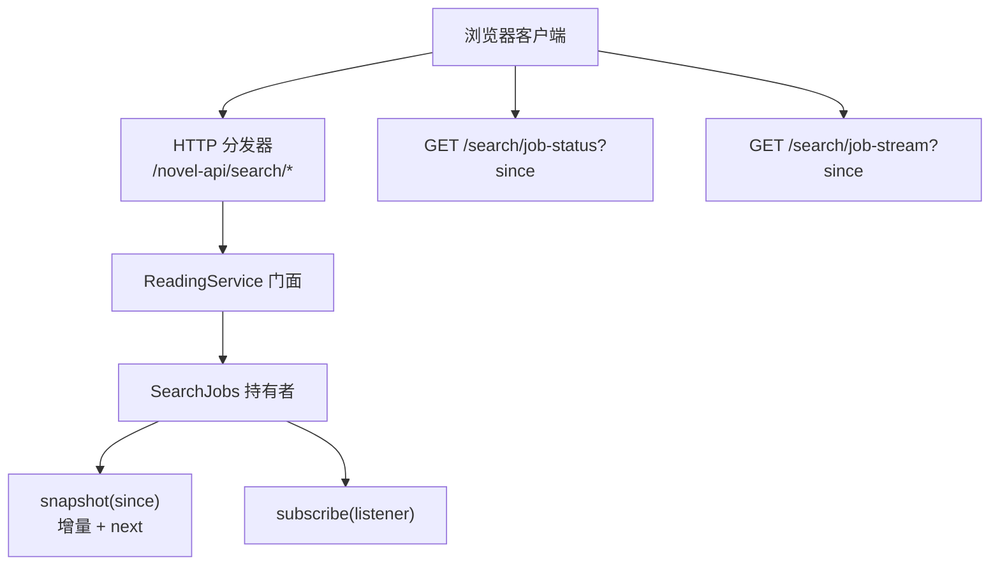
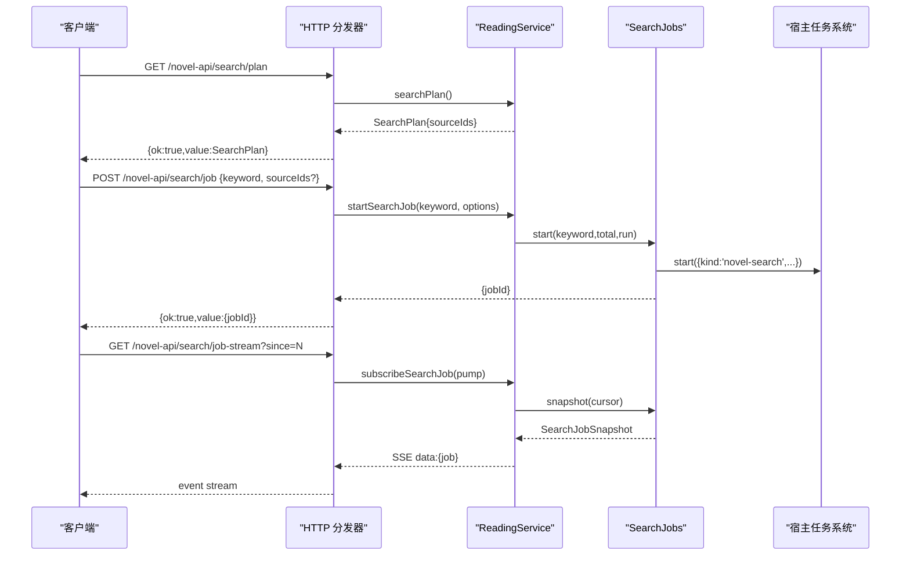
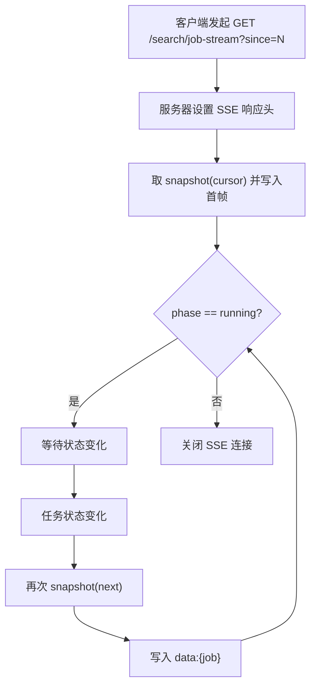
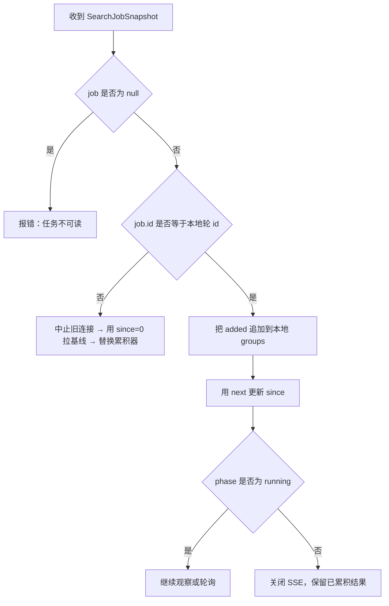
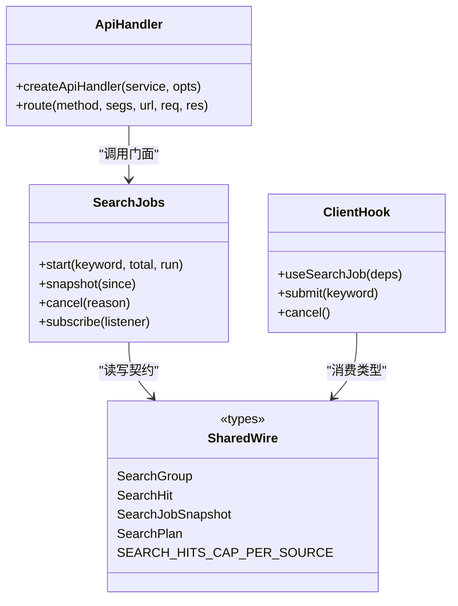

# 搜索 API

<cite>
**本文引用的文件**   
- [dispatch.ts](file://src/api/dispatch.ts)
- [wire.ts（API 层）](file://src/api/wire.ts)
- [search-job.ts（服务端服务层）](file://src/services/search-job.ts)
- [search-job.ts（客户端 Hook）](file://src/client/search-job.ts)
- [wire.ts（共享契约）](file://src/shared/wire.ts)
</cite>

## 目录
1. [引言](#引言)
2. [项目结构](#项目结构)
3. [核心组件](#核心组件)
4. [架构总览](#架构总览)
5. [端点参考](#端点参考)
6. [参与集与过滤规则](#参与集与过滤规则)
7. [SSE 连接、游标与增量推送](#sse-连接游标与增量推送)
8. [结果合并模型](#结果合并模型)
9. [依赖关系分析](#依赖关系分析)
10. [性能与背压](#性能与背压)
11. [故障排查](#故障排查)
12. [结论](#结论)

## 引言
本文面向聚合搜索的 HTTP API，覆盖以下路径：

| 方法 | 路径 | 用途 |
|---|---|---|
| GET | `/novel-api/search/plan` | 计算本次聚合搜索的参与集 `SearchPlan` |
| POST | `/novel-api/search/job` | 提交关键词搜索任务，返回 `JobId` |
| GET | `/novel-api/search/job-status?since=N` | 轮询当前任务的快照 |
| GET | `/novel-api/search/job-stream?since=N` | SSE 增量推送同一份快照 |
| POST | `/novel-api/search/job-cancel` | 取消当前搜索任务 |

所有响应统一走信封格式：成功为 `{ ok: true, value }`，失败为 `{ ok: false, error }`。请求体或查询参数校验失败会返回 400；未受信来源返回 403；未知路由返回 404；并发冲突返回 409；业务错误按分类映射到 400/404/422/502/503/500。

**章节来源**
- [wire.ts（API 层）:1-135](file://src/api/wire.ts#L1-L135)
- [dispatch.ts:1-60](file://src/api/dispatch.ts#L1-L60)

## 项目结构
搜索 API 涉及四层：

1. **HTTP 分发层**：解析 `/novel-api` 前缀，匹配 `search/*` 子路径，校验方法与参数。
2. **服务层**：持有本轮搜索任务、累积 `SearchGroup`、提供快照与订阅。
3. **共享契约**：定义 `SearchGroup`、`SearchHit`、`SearchJobSnapshot`、`SearchPlan` 等跨半类型与常量。
4. **客户端 Hook**：负责提交、SSE 流式消费、断线回退轮询、身份切换与结果合并。



**图示来源**
- [dispatch.ts:120-230](file://src/api/dispatch.ts#L120-L230)
- [search-job.ts（服务端服务层）:1-170](file://src/services/search-job.ts#L1-L170)
- [wire.ts（共享契约）:100-190](file://src/shared/wire.ts#L100-L190)

**章节来源**
- [dispatch.ts:120-230](file://src/api/dispatch.ts#L120-L230)
- [search-job.ts（服务端服务层）:1-170](file://src/services/search-job.ts#L1-L170)
- [wire.ts（共享契约）:100-190](file://src/shared/wire.ts#L100-L190)

## 核心组件
- `createApiHandler`：统一入口，检查可信来源、校验 `/novel-api` 前缀、调用内部 `route`。
- `route`：按段匹配 `search/plan`、`search/job`、`search/job-status`、`search/job-stream`、`search/job-cancel`。
- `SearchJobs`：维护单槽 `Held`，记录 `id`、`keyword`、`total`、`groups`、`phase`、`cancelled`、`finishedAt`、`error`，并提供 `start`、`snapshot`、`cancel`、`subscribe`。
- `useSearchJob`：客户端 Hook，封装提交、SSE 观察、轮询兜底、身份切换与累积器。

关键行为摘要：

| 组件 | 职责 | 重要约束 |
|---|---|---|
| `createApiHandler` | 同源校验、路由前缀、异常统一写信封 | 仅放行 loopback；Origin 存在时必须同源 |
| `route` | 把 HTTP 段映射到 ReadingService 动词 | 方法不允许、未知路由都抛 `ApiError` |
| `SearchJobs.start` | 创建新轮、替换旧轮、登记宿主任务 | 同步启动运行器，避免 emit 丢失 |
| `SearchJobs.snapshot` | 返回 `since` 之后的 `added` 与 `next` | 过期后返回 `null`，不返回空组 |
| `SearchJobs.cancel` | 置位 `cancelled` 并立即终态 | 取消不是失败，已搜命中保留 |
| `useSearchJob.apply` | 合并快照到本地累积器 | 轮身份变化时重基线 |

**章节来源**
- [dispatch.ts:20-60](file://src/api/dispatch.ts#L20-L60)
- [dispatch.ts:120-230](file://src/api/dispatch.ts#L120-L230)
- [search-job.ts（服务端服务层）:1-170](file://src/services/search-job.ts#L1-L170)
- [search-job.ts（客户端 Hook）:1-200](file://src/client/search-job.ts#L1-L200)

## 架构总览
搜索从“计划”到“增量推送”的端到端流程如下：



**图示来源**
- [dispatch.ts:120-230](file://src/api/dispatch.ts#L120-L230)
- [search-job.ts（服务端服务层）:60-170](file://src/services/search-job.ts#L60-L170)

**章节来源**
- [dispatch.ts:120-230](file://src/api/dispatch.ts#L120-L230)
- [search-job.ts（服务端服务层）:60-170](file://src/services/search-job.ts#L60-L170)

## 端点参考

### GET `/novel-api/search/plan`

- **方法**：GET
- **路径**：`/novel-api/search/plan`
- **认证**：需通过同源可信检查；浏览器 Origin 存在时须与 Host 同源。
- **请求体**：无
- **成功响应**：`{ ok: true, value: SearchPlan }`
- **失败响应**：非受信来源 403；未知路由 404；其他异常经分类映射。

`SearchPlan` 字段：

| 字段 | 类型 | 含义 |
|---|---|---|
| `sourceIds` | `string[]` | 本次参与聚合搜索的源 id 列表 |

客户端应使用此列表驱动进度条、分组计数和 UI 渲染，而不是自行推导启停状态。

**章节来源**
- [dispatch.ts:120-135](file://src/api/dispatch.ts#L120-L135)
- [wire.ts（共享契约）:160-170](file://src/shared/wire.ts#L160-L170)

### POST `/novel-api/search/job`

- **方法**：POST
- **路径**：`/novel-api/search/job`
- **Content-Type**：`application/json; charset=utf-8`
- **请求体**：
  - `keyword`：必填字符串，会被 trim；空串返回 400。
  - `sourceIds`：可选 `string[]`，若存在则每项必须是字符串。
- **成功响应**：`{ ok: true, value: { jobId: string } }`
- **失败响应**：
  - 400：缺少 keyword、keyword 为空、sourceIds 类型非法。
  - 403：非受信来源。
  - 404：未知路由。
  - 409：后台任务互斥（由错误分类表映射）。

语义要点：

- 提交后 Node 侧即持有整轮结果；浏览器只消费快照或 SSE。
- 新任务替换旧任务；旧任务若仍在运行会被协作式停止。
- 返回的 `jobId` 是客户端后续 SSE 与轮询的身份锚点。

**章节来源**
- [dispatch.ts:135-160](file://src/api/dispatch.ts#L135-L160)
- [wire.ts（API 层）:60-120](file://src/api/wire.ts#L60-L120)

### GET `/novel-api/search/job-status?since=N`

- **方法**：GET
- **路径**：`/novel-api/search/job-status`
- **查询参数**：
  - `since`：正整数游标；缺省或非法值等价于 0。
- **成功响应**：`{ ok: true, value: { job: SearchJobSnapshot | null } }`
- **失败响应**：403、404、400（参数语义）、业务错误映射。

`SearchJobSnapshot` 关键字段：

| 字段 | 类型 | 含义 |
|---|---|---|
| `id` | `string` | 本轮任务身份 |
| `keyword` | `string` | 触发关键词 |
| `phase` | `'running' \| 'done' \| 'failed'` | 阶段 |
| `cancelled` | `boolean` | 用户主动停止；不等于失败 |
| `total` | `number` | 真实参搜源数 |
| `done` | `number` | 已完成源数 |
| `added` | `SearchGroup[]` | `since` 之后新增的分组 |
| `next` | `number` | 下次应带的游标 |
| `startedAt` | `number` | 开始时间戳 |
| `finishedAt` | `number?` | 结束时间戳 |
| `error` | `string?` | 终态失败原因 |

当任务已结束且超过保留期，或从未提交过，`job` 为 `null`。

**章节来源**
- [dispatch.ts:210-220](file://src/api/dispatch.ts#L210-L220)
- [search-job.ts（服务端服务层）:120-160](file://src/services/search-job.ts#L120-L160)
- [wire.ts（共享契约）:120-190](file://src/shared/wire.ts#L120-L190)

### GET `/novel-api/search/job-stream?since=N`

- **方法**：GET
- **路径**：`/novel-api/search/job-stream`
- **查询参数**：
  - `since`：正整数游标；缺省或非法值等价于 0。
- **响应头**：
  - `content-type: text/event-stream; charset=utf-8`
  - `cache-control: no-cache`
  - `connection: keep-alive`
  - `x-accel-buffering: no`
- **事件体**：每条事件是一个 JSON 字符串，形如 `data: {"job": SearchJobSnapshot | null}`。
- **连接生命周期**：
  - 首帧发送一次快照。
  - 每次任务状态变化补一帧。
  - 当快照 `phase !== 'running'` 时关闭流。
  - 客户端断开或响应销毁时退订监听器。

断线续传规则：

- 客户端保存最后收到的 `next`。
- 重连时以该 `next` 作为新的 `since`。
- SSE 本身不 replay 历史帧；显式轮询才是恢复真相的方式。
- 如果服务端在重连期间换了新一轮，客户端应依据 `job.id` 做基线切换。

**章节来源**
- [dispatch.ts:160-210](file://src/api/dispatch.ts#L160-L210)
- [search-job.ts（服务端服务层）:80-120](file://src/services/search-job.ts#L80-L120)

### POST `/novel-api/search/job-cancel`

- **方法**：POST
- **路径**：`/novel-api/search/job-cancel`
- **请求体**：无
- **成功响应**：`{ ok: true, value: boolean }`
- **失败响应**：403、404、400、业务错误映射。

返回值含义：

- `true`：确实存在一个处于 `running` 的任务并被取消。
- `false`：没有可取消的任务，或任务已结束。

语义重点：

- “停止 ≠ 放弃”。
- 取消后任务进入终态（不再新开源），但已搜集到的分组仍可读。
- 取消不会把已有命中丢弃；UI 不应把 `cancelled` 当作错误红条。

**章节来源**
- [dispatch.ts:160-170](file://src/api/dispatch.ts#L160-L170)
- [search-job.ts（服务端服务层）:140-170](file://src/services/search-job.ts#L140-L170)

## 参与集与过滤规则

### 参与集来源

`/novel-api/search/plan` 返回的 `sourceIds` 是唯一权威来源。客户端不应自行根据 `enabled`、`type` 或 UI 选择重新计算参与集。

### 过滤规则

参与集的计算满足：

1. 源必须处于启用状态：`enabled` 为真。
2. 源的内容形态必须为文本：`type === 'text'`。
3. `unknown` 内容形态不参与聚合搜索，即使探针搜索面可用也不加入参与集。
4. 客户端可通过 `sourceIds` 进一步缩小范围；若不传，则使用服务端计算的完整参与集。

### 每源命中上限

每个源的命中数组最多保留 50 条。这是内存上限与站点搜索面默认首页行为共同决定的截断点。

### 失败源折叠

单个源失败不会导致整轮搜索失败：

- 失败的源以 `SearchGroup.error` 形式记录。
- 该分组仍计入完成序。
- 只有整体任务出错才会使 `SearchJobSnapshot.phase` 成为 `failed`，并附带顶层 `error`。

### `cancelled` 与 `failed` 的区别

| 字段 | 语义 | UI 建议 |
|---|---|---|
| `cancelled` | 用户主动停止 | 保留已搜结果，不显示错误红条 |
| `phase === 'failed'` | 任务执行出现错误 | 显示错误信息，结果可能不完整 |
| `phase === 'done'` | 正常完成 | 正常展示最终结果 |

**章节来源**
- [wire.ts（共享契约）:100-190](file://src/shared/wire.ts#L100-L190)
- [search-job.ts（服务端服务层）:20-60](file://src/services/search-job.ts#L20-L60)
- [dispatch.ts:120-170](file://src/api/dispatch.ts#L120-L170)

## SSE 连接、游标与增量推送

### 连接建立流程



**图示来源**
- [dispatch.ts:160-210](file://src/api/dispatch.ts#L160-L210)

### since 游标断线续传

客户端维护 `since` 游标的正确方式：

1. 首次连接使用 `since=0`。
2. 收到快照后读取 `next`。
3. 断线重连时使用上一帧的 `next`。
4. 如果收到 `job=null`，表示任务不可读，应提示用户并清空界面。
5. 如果 `job.id` 与本地累积轮不同，说明服务端已换轮，应丢弃旧累积、用 `since=0` 拉基线并重开观察。

注意：`next` 来自服务端快照，客户端不应用本地数组长度替代。

### 增量 group 推送格式

每条 SSE 事件的 payload 都是：

```json
{
  "job": {
    "id": "字符串",
    "keyword": "字符串",
    "phase": "running | done | failed",
    "cancelled": 布尔值,
    "total": 数字,
    "done": 数字,
    "added": ["SearchGroup", ...],
    "next": 数字,
    "startedAt": 数字,
    "finishedAt": 数字?,
    "error": "字符串?"
  }
}
```

`added` 中每个 `SearchGroup` 的结构：

| 字段 | 类型 | 含义 |
|---|---|---|
| `sourceId` | `string` | 书源 id |
| `sourceName` | `string` | 书源名称 |
| `status` | `SourceStatus` | 源状态 |
| `statusDetail` | `string?` | 状态详情 |
| `hits` | `SearchHit[]` | 命中数组，最多 50 条 |
| `error` | `{code,message}?` | 该源失败信息 |

`SearchHit` 的字段包括 `title`、`author`、`url`、`coverUrl`、`intro`、`lastChapterName`、`kind`、`wordCount`，其中多数可为 `null`。

**章节来源**
- [dispatch.ts:160-210](file://src/api/dispatch.ts#L160-L210)
- [wire.ts（共享契约）:100-190](file://src/shared/wire.ts#L100-L190)

## 结果合并模型

客户端合并逻辑的核心原则是：**增量追加 + 游标确认 + 身份切换**。



**图示来源**
- [search-job.ts（客户端 Hook）:40-160](file://src/client/search-job.ts#L40-L160)

客户端实现要点：

- 只有一份合并代码同时被 SSE 帧和轮询快照复用。
- 任一时刻只有一条通道推进游标，避免重复累积。
- `apply` 成功后才推进 `since` 到 `next`。
- 身份不一致时先 abort 旧 SSE，再 `since=0` 拉基线。
- 取消后的快照仍应更新 UI，但不标记为错误。
- 轮询间隔为 600ms；SSE 失败或提前结束时自动回落轮询。

**章节来源**
- [search-job.ts（客户端 Hook）:1-200](file://src/client/search-job.ts#L1-L200)

## 依赖关系分析



**图示来源**
- [dispatch.ts:120-230](file://src/api/dispatch.ts#L120-L230)
- [search-job.ts（服务端服务层）:1-170](file://src/services/search-job.ts#L1-L170)
- [wire.ts（共享契约）:100-190](file://src/shared/wire.ts#L100-L190)
- [search-job.ts（客户端 Hook）:1-200](file://src/client/search-job.ts#L1-L200)

**章节来源**
- [dispatch.ts:120-230](file://src/api/dispatch.ts#L120-L230)
- [search-job.ts（服务端服务层）:1-170](file://src/services/search-job.ts#L1-L170)
- [wire.ts（共享契约）:100-190](file://src/shared/wire.ts#L100-L190)
- [search-job.ts（客户端 Hook）:1-200](file://src/client/search-job.ts#L1-L200)

## 性能与背压

### 超时
- SSE 响应头包含 `connection: keep-alive` 和 `x-accel-buffering: no`，目的是让代理不要攒帧，保证增量推送及时。
- 客户端应在连接超时或断线后基于 `since` 重连，而不是无限重试同一条流。
- 轮询兜底间隔为 600ms，适合边搜边出的观感，同时避免频繁请求打满接口。

### 并发限制
- 后端对搜索任务采用单槽策略：新一轮直接替换旧一轮。
- 宿主侧任务配额默认 `maxConcurrentJobsPerOwner` 为 10，但搜索任务与导入/验证任务分槽，UI 的“任何任务在途即禁用”判据通常只管写任务。
- 客户端应避免同时提交多个搜索任务；若发生替换，应以最新 `jobId` 为准。

### 背压
- SSE 是单向推送，服务端根据 `res.writableEnded` 或 `res.destroyed` 判断连接是否存活。
- 客户端不应阻塞事件处理函数；大量命中数据应尽快落库或渲染队列。
- 对于导出等其他流式接口，实现中使用 `drain` 事件处理 Node 背压；搜索 SSE 虽未显式节流 write，但服务端会在连接死亡时清理监听器。

### 内存
- 每源命中上限为 50，防止单源放大结果集。
- 搜索结果保留期为 30 分钟；结束后超过保留期的快照视为不可读。
- 服务端持有整轮结果，因此客户端卸载界面不会丢失任务；重挂载后用 `since=0` 即可重新拉取。

**章节来源**
- [dispatch.ts:160-210](file://src/api/dispatch.ts#L160-L210)
- [search-job.ts（服务端服务层）:1-40](file://src/services/search-job.ts#L1-L40)
- [search-job.ts（服务端服务层）:160-170](file://src/services/search-job.ts#L160-L170)
- [wire.ts（共享契约）:180-190](file://src/shared/wire.ts#L180-L190)
- [search-job.ts（客户端 Hook）:20-40](file://src/client/search-job.ts#L20-L40)

## 故障排查

### 常见问题

| 现象 | 可能原因 | 处理方式 |
|---|---|---|
| 403 非受信来源 | 请求来自非 loopback 地址，或 Origin/Referer 跨源 | 本机 curl 可直接访问；浏览器需同源 |
| 400 缺 keyword | POST body 中 keyword 为空或不存在 | 传入非空字符串 |
| 400 sourceIds 类型非法 | sourceIds 不是字符串数组 | 传入 `string[]` 或直接省略 |
| SSE 早停 | 任务已结束或 phase 不再是 running | 改用 job-status 查看终态 |
| 重连后数据缺失 | 未携带上次 `next` | 使用 `since=next` 重连 |
| 结果突然清零 | 服务端换了新一轮，`job.id` 变化 | 按客户端逻辑重基线 |
| 界面显示失败但结果还在 | `cancelled=true` 而非 `phase='failed'` | 不报红条，保留已搜结果 |
| 任务不可读 | 任务已结束且超过 30 分钟保留期，或服务重启 | 提示用户，允许重新开始搜索 |

### 错误信封

所有错误走统一信封：

```json
{
  "ok": false,
  "error": {
    "code": "错误码",
    "message": "人类可读消息",
    "segment": {
      "facet": "...",
      "segmentIndex": 0,
      "segmentRaw": "..."
    }
  }
}
```

常见 code：

| code | 含义 |
|---|---|
| `BadRequest` | 参数或 body 校验失败 |
| `Forbidden` | 非受信来源 |
| `NotFound` | 未知路由或资源不存在 |
| `MethodNotAllowed` | 方法不匹配 |
| `PayloadTooLarge` | 请求体超限 |
| `JobRunning` | 任务互斥 |
| `Unavailable` | 服务不可用 |
| `InternalError` | 未分类异常 |

**章节来源**
- [wire.ts（API 层）:1-135](file://src/api/wire.ts#L1-L135)
- [search-job.ts（服务端服务层）:120-170](file://src/services/search-job.ts#L120-L170)
- [search-job.ts（客户端 Hook）:60-120](file://src/client/search-job.ts#L60-L120)

## 结论
搜索 API 的设计围绕三个核心约定展开：

1. **参与集唯一主人在服务端**：客户端通过 `search/plan` 获取 `sourceIds`，并按 `enabled ∧ type='text'` 的规则接受结果。
2. **增量快照 + 游标**：`since` 与 `next` 构成可靠断线续传基础；SSE 是加速器，轮询是地基。
3. **取消保留结果**：`cancelled` 与 `failed` 语义分离，取消不会丢弃已搜命中。

客户端实现时应优先消费 SSE，同时保留轮询兜底；合并时严格遵循 `job.id` 身份、`added` 增量和 `next` 游标三要素。生产部署时需注意同源安全、SSE 代理缓冲、任务替换语义以及 30 分钟结果保留期。