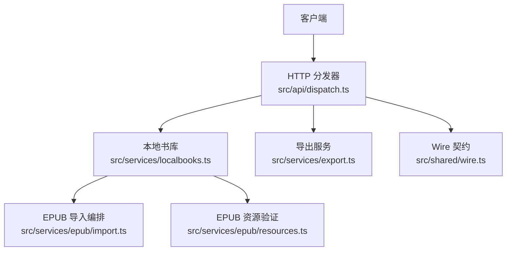
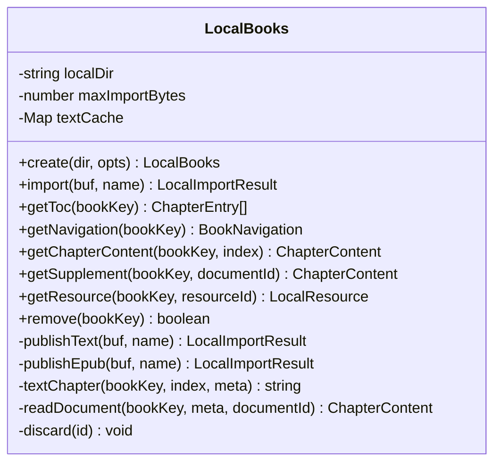
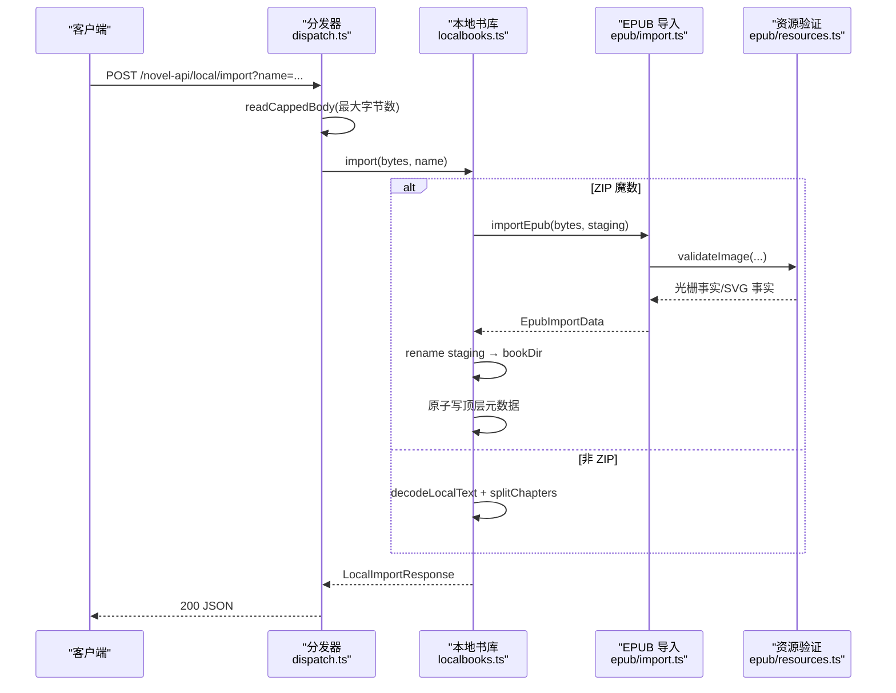
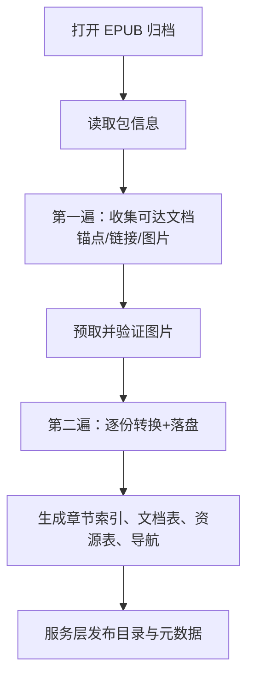
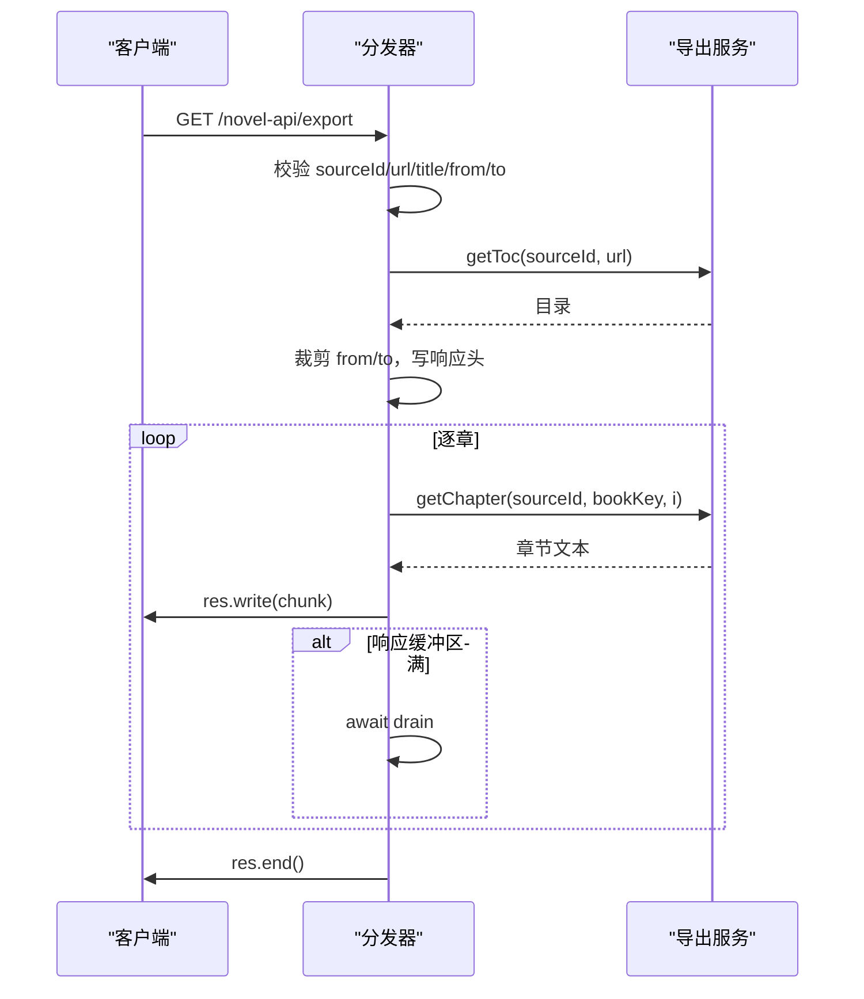
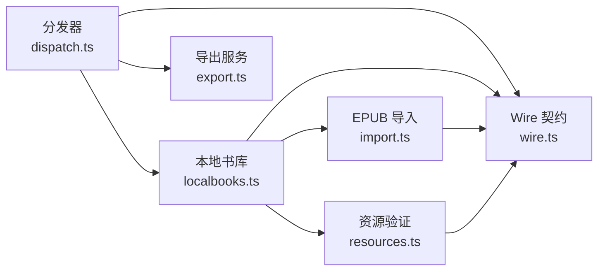

# 本地书与导出 API

<cite>
**本文引用的文件**   
- [dispatch.ts](file://src/api/dispatch.ts)
- [localbooks.ts](file://src/services/localbooks.ts)
- [export.ts](file://src/services/export.ts)
- [import.ts](file://src/services/epub/import.ts)
- [resources.ts](file://src/services/epub/resources.ts)
- [wire.ts](file://src/shared/wire.ts)
- [dispatch-local.test.ts](file://tests/api/dispatch-local.test.ts)
- [dispatch-export.test.ts](file://tests/api/dispatch-export.test.ts)
</cite>

## 目录
1. [引言](#引言)
2. [项目结构](#项目结构)
3. [核心组件](#核心组件)
4. [架构总览](#架构总览)
5. [端点参考](#端点参考)
6. [TXT 编码自动识别与切章](#txt-编码自动识别与切章)
7. [EPUB 两遍导入流水线与存储布局](#epub-两遍导入流水线与存储布局)
8. [流式导出与背压](#流式导出与背压)
9. [依赖关系分析](#依赖关系分析)
10. [常见问题与定位方法](#常见问题与定位方法)
11. [结论](#结论)

## 引言
本文面向需要调用本插件 HTTP 接口的开发者，系统性说明“本地书导入”和“内容导出”相关接口。覆盖：

- `POST /novel-api/local/import`：上传 TXT 或 EPUB，返回 JobId 或 BookKey。
- `DELETE /novel-api/local`：删除本地书及其磁盘产物。
- `GET /novel-api/local/document`：读取 EPUB 补充文档（脚注、附录等）。
- `GET /novel-api/local/resource`：读取 EPUB 插图等资源。
- `GET /novel-api/local/warnings`：查看导入告警。
- `GET /novel-api/export`：流式导出 TXT，支持范围、节流与取消。

这些接口由统一的前缀路由分发器接收请求，再交给阅读门面与具体服务模块处理；本地书同时涉及文本解码、正则切章、EPUB 归档解析、图片验证与 SVG 重建，以及基于 Node.js 的流式响应。

## 项目结构
与本主题直接相关的代码分布在四个层次：

| 层次 | 职责 | 主要文件 |
|---|---|---|
| 路由层 | 校验方法、参数、上限、错误信封，并决定走哪个服务 | `src/api/dispatch.ts` |
| 本地书库 | TXT/EPUB 分流、落盘、元数据发布、章节与资源读取、删除 | `src/services/localbooks.ts` |
| 导出服务 | 串行逐章、节流、失败即停、AbortSignal 取消 | `src/services/export.ts` |
| EPUB 导入层 | 两遍扫描、文档规范化、资源验证、SVG 剥离与包装识别 | `src/services/epub/import.ts`、`src/services/epub/resources.ts` |
| Wire 契约 | 路由常量、参数名、共享类型、本地源标识 | `src/shared/wire.ts` |



**图表来源**
- [dispatch.ts:201-491](file://src/api/dispatch.ts#L201-L491)
- [localbooks.ts:1-120](file://src/services/localbooks.ts#L1-L120)
- [export.ts:1-64](file://src/services/export.ts#L1-L64)
- [import.ts:1-60](file://src/services/epub/import.ts#L1-L60)
- [resources.ts:1-60](file://src/services/epub/resources.ts#L1-L60)
- [wire.ts:1-60](file://src/shared/wire.ts#L1-L60)

**章节来源**
- [dispatch.ts:201-491](file://src/api/dispatch.ts#L201-L491)
- [localbooks.ts:1-120](file://src/services/localbooks.ts#L1-L120)
- [export.ts:1-64](file://src/services/export.ts#L1-L64)
- [import.ts:1-60](file://src/services/epub/import.ts#L1-L60)
- [resources.ts:1-60](file://src/services/epub/resources.ts#L1-L60)
- [wire.ts:1-60](file://src/shared/wire.ts#L1-L60)

## 核心组件

### 本地书库 `LocalBooks`
本地书是“保留源”，其 `sourceId` 在 wire 中固定为 `__local__`，因此本地书的目录、正文、导航和资源都通过该源访问，但不走外部注册表查找。

关键能力：

- 按魔数分流：ZIP 本地头签名 `PK\x03\x04` 走 EPUB，否则走 TXT。
- TXT：BOM/UTF-8/GBK 解码 + 正则切章 + 偏移表持久化。
- EPUB：两遍导入流水线，产出章节索引、文档 JSON、资源表与导航树。
- 原子发布：先在 `.importing` 临时目录构建，再重命名到最终目录，最后原子写顶层元数据。
- 安全读口：资源与文档只接受不透明 ID，路径由服务端构造，拒绝路径穿越。
- 删除清理：一次性清掉已发布目录、构建目录、元数据、备份与原子写残留。



**图表来源**
- [localbooks.ts:1-200](file://src/services/localbooks.ts#L1-L200)
- [localbooks.ts:201-502](file://src/services/localbooks.ts#L201-L502)

**章节来源**
- [localbooks.ts:1-120](file://src/services/localbooks.ts#L1-L120)
- [localbooks.ts:201-502](file://src/services/localbooks.ts#L201-L502)
- [wire.ts:1-60](file://src/shared/wire.ts#L1-L60)

### 导出服务 `exportBook`
导出不是整本一次拉取，而是“串行逐章 + 章间节流 + 失败即停 + AbortSignal 取消”。它假设调用方已经裁剪好范围，自身只做越界保护。

关键行为：

- 首字节输出 UTF-8 BOM，兼容 Windows 记事本。
- 每章输出标题行与正文。
- 默认章间节流 300ms，可通过配置调整。
- 单章抓取失败时写入中断标记并停止后续章节。
- 调用方传入的 `AbortSignal` 用于浏览器取消请求后尽早退出循环。

**章节来源**
- [export.ts:1-64](file://src/services/export.ts#L1-L64)

### EPUB 导入编排
EPUB 导入把包结构、文档规范化、资源验证串起来，并独占 opaque ID 生成与两遍流水线。

关键点：

- 第一遍：顺主序列、导航目标、正文链接收集所有可达文档，建锚点映射、链接列表、图片清单。
- 第二遍：逐份解析、转换、绑定目标、落盘；图片在第一遍与第二遍之间预取并验证。
- 只保留被引用到的资源；未使用的 manifest 条目不需要受支持。
- 远程图片拒绝；SVG 剥离活动内容；PNG CRC 校验失败报错。

**章节来源**
- [import.ts:1-60](file://src/services/epub/import.ts#L1-L60)
- [import.ts:60-200](file://src/services/epub/import.ts#L60-L200)

### EPUB 资源验证
资源层负责图片类型/尺寸验证与受限 SVG 重建，不写盘、不发请求。

关键点：

- 不支持的图片类型直接报错。
- 声明 MIME 与实际魔数不一致报错。
- PNG 逐 chunk CRC 校验；JPEG 走到 EOI；GIF 看 trailer；WebP 核 RIFF 长度。
- EXIF 旋转影响显示宽高。
- 独立 SVG 白名单重建；SVG 单图包装解析为内嵌栅格图。
- 远程图片、损坏图片、超预算像素、加密图片均明确报错。

**章节来源**
- [resources.ts:1-60](file://src/services/epub/resources.ts#L1-L60)
- [resources.ts:60-200](file://src/services/epub/resources.ts#L60-L200)

## 架构总览



**图表来源**
- [dispatch.ts:420-491](file://src/api/dispatch.ts#L420-L491)
- [localbooks.ts:220-300](file://src/services/localbooks.ts#L220-L300)
- [import.ts:120-200](file://src/services/epub/import.ts#L120-L200)
- [resources.ts:100-200](file://src/services/epub/resources.ts#L100-L200)

## 端点参考

### `POST /novel-api/local/import`

| 项目 | 说明 |
|---|---|
| 方法 | `POST` |
| 路径 | `/novel-api/local/import` |
| 查询参数 | `name`：上传文件名，必填，不能为空 |
| 请求体 | 原始文件字节（TXT 或 EPUB） |
| 成功状态码 | `200` |
| 成功响应体 | wire 信封 `{ ok: true, value: LocalImportResponse }` |
| 常见错误 | `400 BadRequest`（缺 `name`、空文件）、`413 PayloadTooLarge`（超过上限） |

#### 行为要点

- 文件大小上限由 `service.localImportMaxBytes` 决定，传输层与服务层使用同一值。
- 上传完成后由阅读门面执行导入、落盘、原子发布与自动上架。
- 返回值中的 `bookKey` 形如 `local:<uuid>`，用于后续本地书读取。
- 对 TXT 与 EPUB 的分流只看文件头魔数，不做“先试 EPUB 失败再回退 TXT”。

#### curl 示例

- 上传 TXT：

```bash
curl --request POST \
  --form 'name="测试册.txt"' \
  --form 'file=@./测试册.txt' \
  http://localhost:PORT/novel-api/local/import
```

- 上传 EPUB：

```bash
curl --request POST \
  --form 'name="小说.epub"' \
  --form 'file=@./小说.epub' \
  http://localhost:PORT/novel-api/local/import
```

- 处理错误：

```bash
curl --fail-with-body --request POST \
  --form 'name=""' \
  --form 'file=@./空文件.txt' \
  http://localhost:PORT/novel-api/local/import
```

**章节来源**
- [dispatch.ts:420-445](file://src/api/dispatch.ts#L420-L445)
- [localbooks.ts:220-300](file://src/services/localbooks.ts#L220-L300)
- [dispatch-local.test.ts:1-85](file://tests/api/dispatch-local.test.ts#L1-L85)

---

### `DELETE /novel-api/local`

| 项目 | 说明 |
|---|---|
| 方法 | `DELETE` |
| 路径 | `/novel-api/local` |
| 查询参数 | `id`：`bookKey`，必填，例如 `local:<uuid>` |
| 成功状态码 | `200` |
| 成功响应体 | wire 信封 `{ ok: true, value: { removed: boolean } }` |
| 常见错误 | `400 BadRequest`（缺 `id`），未知 key 可能返回 `false` 而非错误 |

#### 行为要点

- 删除会清掉本地书的全部磁盘产物：TXT 的两件文件或 EPUB 的整棵目录加顶层元数据。
- 书架删除也会连带触发本地书文件清理，防止孤儿文件。
- 存在性判断以顶层元数据为准；损坏元数据不会让恢复路径崩溃。

#### curl 示例

```bash
curl --request DELETE \
  --data-urlencode 'id=local:your-book-uuid' \
  http://localhost:PORT/novel-api/local
```

**章节来源**
- [dispatch.ts:470-491](file://src/api/dispatch.ts#L470-L491)
- [localbooks.ts:360-440](file://src/services/localbooks.ts#L360-L440)
- [dispatch-local.test.ts:60-85](file://tests/api/dispatch-local.test.ts#L60-L85)

---

### `GET /novel-api/local/document`

| 项目 | 说明 |
|---|---|
| 方法 | `GET` |
| 路径 | `/novel-api/local/document` |
| 查询参数 | `id`：本地书 `bookKey`，必填<br/>`documentId`：补充文档 ID，必填 |
| 成功状态码 | `200` |
| 成功响应体 | wire 信封 `{ ok: true, value: ChapterContent }` |
| 常见错误 | `400 BadRequest`（缺参数）、`404 NotFound`（文档不存在或不是 EPUB）、`500`（产物损坏） |

#### 行为要点

- 仅 EPUB 本地书有补充文档；TXT 返回 `404`。
- 文档 ID 来自导入期生成的不透明 ID，不在 wire 中暴露原始路径。
- 如果元数据说文档存在但读出的内容与 schema 不符，视为服务端存储损坏，抛出 500。

#### curl 示例

```bash
curl --fail-with-body \
  --data-urlencode 'id=local:your-book-uuid' \
  --data-urlencode 'documentId=d0' \
  http://localhost:PORT/novel-api/local/document
```

**章节来源**
- [dispatch.ts:445-470](file://src/api/dispatch.ts#L445-L470)
- [localbooks.ts:320-360](file://src/services/localbooks.ts#L320-L360)
- [localbooks.ts:400-440](file://src/services/localbooks.ts#L400-L440)
- [dispatch-local.test.ts:30-50](file://tests/api/dispatch-local.test.ts#L30-L50)

---

### `GET /novel-api/local/resource`

| 项目 | 说明 |
|---|---|
| 方法 | `GET` |
| 路径 | `/novel-api/local/resource` |
| 查询参数 | `id`：本地书 `bookKey`，必填<br/>`resourceId`：资源不透明 ID，必填 |
| 成功状态码 | `200` |
| 成功响应体 | 原始字节流，MIME 由导入期验证结果决定 |
| 常见错误 | `400 BadRequest`（缺参数）、`404 NotFound`（资源 ID 不存在或文件缺失） |

#### 响应头

| 响应头 | 含义 |
|---|---|
| `content-type` | 导入期验证后的媒体类型 |
| `content-length` | 打开文件后 `stat` 出的真实字节数 |
| `x-content-type-options` | `nosniff`，禁止嗅探 |
| `cross-origin-resource-policy` | `same-origin` |
| `cache-control` | `private, max-age=3600` |
| `content-security-policy` | 仅 SVG 附加：`default-src 'none'; sandbox` |

#### curl 示例

```bash
curl --fail-with-body \
  --data-urlencode 'id=local:your-book-uuid' \
  --data-urlencode 'resourceId=r0' \
  --output ./插图.jpg \
  http://localhost:PORT/novel-api/local/resource
```

**章节来源**
- [dispatch.ts:445-470](file://src/api/dispatch.ts#L445-L470)
- [localbooks.ts:340-360](file://src/services/localbooks.ts#L340-L360)
- [localbooks.ts:440-502](file://src/services/localbooks.ts#L440-L502)

---

### `GET /novel-api/local/warnings`

| 项目 | 说明 |
|---|---|
| 方法 | `GET` |
| 路径 | `/novel-api/local/warnings` |
| 查询参数 | `id`：本地书 `bookKey`，必填 |
| 成功状态码 | `200` |
| 成功响应体 | wire 信封 `{ ok: true, value: LocalImportWarning[] }` |
| 常见错误 | `400 BadRequest`（缺参数）、`404 NotFound`（书不存在） |

#### 行为要点

- TXT 本地书始终返回空数组。
- EPUB 本地书返回导入期收集的警告，例如导航降级、内链降级、SVG 剥离、远程图片拒绝等。
- 该接口适合“导入完成后再按需查看”，避免每次取章重复携带告警。

#### curl 示例

```bash
curl --fail-with-body \
  --data-urlencode 'id=local:your-book-uuid' \
  http://localhost:PORT/novel-api/local/warnings
```

**章节来源**
- [dispatch.ts:445-470](file://src/api/dispatch.ts#L445-L470)
- [localbooks.ts:330-340](file://src/services/localbooks.ts#L330-L340)
- [dispatch-local.test.ts:30-50](file://tests/api/dispatch-local.test.ts#L30-L50)

---

### `GET /novel-api/export`

| 项目 | 说明 |
|---|---|
| 方法 | `GET` |
| 路径 | `/novel-api/export` |
| 必需查询参数 | `sourceId`、`url`、`title` |
| 可选查询参数 | `from`：起始章号（1 基含端）<br/>`to`：结束章号（1 基含端） |
| 成功状态码 | `200` |
| 成功响应体 | 流式 TXT |
| 常见错误 | `400 BadRequest`（参数非法）、`405 MethodNotAllowed`、`422 BadRange`（范围倒置）、`422 EmptyToc`（目录为空）、`502 FetchError`（目录抓取失败） |

#### 响应头

| 响应头 | 含义 |
|---|---|
| `content-type` | `text/plain; charset=utf-8` |
| `content-disposition` | `attachment; filename*=UTF-8''<title>.txt` |
| `x-novel-total-chapters` | 本次导出的章数（不是全书章数） |
| `x-novel-range` | `from-to`，例如 `2-2` |

#### 行为要点

- 首包前抓取目录，计算 `total-chapters` 与范围；目录为空直接返回错误信封，不走流。
- 非整数 `from`/`to` 快速失败。
- 越界会被裁剪到 `[1, toc.length]`；裁剪后仍倒置则返回 `BadRange`。
- 流式输出 UTF-8 BOM 开头。
- 单章抓取失败时继续写出中断标记并结束流。
- 浏览器取消请求时通过 `AbortController` 停止后续章节。

#### curl 示例

- 导出全书：

```bash
curl --request GET \
  --data-urlencode 'sourceId=__local__' \
  --data-urlencode 'url=local:your-book-uuid' \
  --data-urlencode 'title=测试书' \
  --output ./导出.txt \
  http://localhost:PORT/novel-api/export
```

- 导出第 2 章：

```bash
curl --request GET \
  --data-urlencode 'sourceId=__local__' \
  --data-urlencode 'url=local:your-book-uuid' \
  --data-urlencode 'title=测试书' \
  --data-urlencode 'from=2' \
  --data-urlencode 'to=2' \
  --output ./第二章.txt \
  http://localhost:PORT/novel-api/export
```

- 检查范围非法：

```bash
curl --fail-with-body \
  --request GET \
  --data-urlencode 'sourceId=__local__' \
  --data-urlencode 'url=local:your-book-uuid' \
  --data-urlencode 'title=测试书' \
  --data-urlencode 'from=2' \
  --data-urlencode 'to=1' \
  http://localhost:PORT/novel-api/export
```

**章节来源**
- [dispatch.ts:260-360](file://src/api/dispatch.ts#L260-L360)
- [export.ts:1-64](file://src/services/export.ts#L1-L64)
- [dispatch-export.test.ts:1-101](file://tests/api/dispatch-export.test.ts#L1-L101)

## TXT 编码自动识别与切章

### 编码识别顺序

本地 TXT 解码链按以下顺序工作：

1. **UTF-8 BOM**：检测到 `EF BB BF` 后跳过 BOM 并按 UTF-8 解析。
2. **UTF-16 LE/BE**：检测 `FF FE` 或 `FE FF`，分别按小端与大端 UTF-16 解码。
3. **严格 UTF-8**：使用带 `fatal: true` 的 `TextDecoder` 解码；非法字节立即失败。
4. **GBK 回退**：UTF-8 失败后使用 `iconv-lite` 按 GBK 解码。

这意味着：

- 带 BOM 的文件优先走 UTF-8。
- 纯 ASCII 也走 UTF-8 分支。
- GBK 是启发式回退，若误判为 GBK 可能出现乱码，这是设计上的已知取舍。
- 返回结果包含 `encoding`，可用于展示或诊断。

### 正则切章

TXT 切章使用钉死的正则匹配“标题行”，支持：

- “第 X 章/卷/回/节/集/部/篇”
- “X 章/卷/回/节/集/部/篇”
- “序章/楔子/番外/尾声/后记”
- “Chapter N”

切章逻辑：

- 按行扫描。
- 遇到标题行时，上一段结束于当前行首之前。
- 第一个标题行之前的非空内容作为“正文”段。
- 无标题时整本作为“正文”一段。
- 相邻标题行或文末孤标题可能产生退化区间，读取时做边界夹紧。


**图表来源**
- [localbooks.ts:20-60](file://src/services/localbooks.ts#L20-L60)
- [localbooks.ts:60-120](file://src/services/localbooks.ts#L60-L120)

**章节来源**
- [localbooks.ts:20-120](file://src/services/localbooks.ts#L20-L120)

## EPUB 两遍导入流水线与存储布局

### 两遍流水线

EPUB 导入不是简单解压，而是结构化重建：

| 阶段 | 输入 | 输出 |
|---|---|---|
| 第一遍 | EPUB 字节、包信息、spine、导航、正文链接 | 可达文档集合、锚点映射、链接清单、图片清单 |
| 图片预处理 | 已收集的图片 href | 光栅事实或 SVG 事实 |
| 第二遍 | 每份文档 DOM、图片绑定、锚点映射 | 规范化文档 JSON、资源落盘、章节索引 |

两遍的好处：

- 可提前发现远程图片、损坏图片、不支持格式等问题。
- 避免在同步 DOM 遍历中阻塞 I/O。
- 每份文档解析→转换→落盘→释放，不把整本书常驻内存。



**图表来源**
- [import.ts:1-60](file://src/services/epub/import.ts#L1-L60)
- [import.ts:60-200](file://src/services/epub/import.ts#L60-L200)
- [resources.ts:1-60](file://src/services/epub/resources.ts#L1-L60)

### 存储布局

本地 EPUB 书在磁盘上的布局大致如下：

```
local/
├── <uuid>.json                          # 顶层元数据（提交标记）
├── <uuid>/                              # 已发布书籍目录
│   ├── original.epub                    # 上传原文字节
│   ├── documents/                       # 规范化文档 JSON
│   │   ├── d0.json
│   │   └── d1.json
│   └── resources/                       # 已验证资源
│       ├── r0.jpg
│       └── r1.png
└── <uuid>.importing/                    # 构建期临时目录（成功后重命名）
```

| 路径 | 用途 | 说明 |
|---|---|---|
| `<uuid>.json` | 顶层元数据 | EPUB 用 `schemaVersion: 2` 表示已发布；TXT 没有此字段 |
| `<uuid>/original.epub` | 上传原文 | 保留原始字节，便于重解析 |
| `<uuid>/documents/dN.json` | 文档内容 | 图文结构，供 `/local/document` 与正文读取 |
| `<uuid>/resources/rN.*` | 资源文件 | 文件名扩展名来自验证结果，不信任 manifest |
| `<uuid>.importing/` | 构建期目录 | 任何失败都会整体丢弃 |

**章节来源**
- [localbooks.ts:280-340](file://src/services/localbooks.ts#L280-L340)
- [localbooks.ts:440-527](file://src/services/localbooks.ts#L440-L527)
- [import.ts:120-200](file://src/services/epub/import.ts#L120-L200)

## 流式导出与背压

### 响应流程



**图表来源**
- [dispatch.ts:260-360](file://src/api/dispatch.ts#L260-L360)
- [export.ts:1-64](file://src/services/export.ts#L1-L64)

### Content-Type 与传输模式

- `Content-Type`：`text/plain; charset=utf-8`。
- 不使用 JSON 信封；首包就是实际文本。
- 使用 Node.js `res.write` 分块输出，属于流式响应。
- 首部包含 `x-novel-total-chapters` 与 `x-novel-range`，帮助客户端统计进度。
- `content-disposition` 指定下载文件名，使用 RFC 5987 风格的 `filename*`。

### 背压处理

分发器在每章写出后检查 `res.write` 返回值：

- 返回 `false` 表示下游缓冲已满，应等待 `drain`。
- 等待前先检查 `res.destroyed` 或 `res.writableEnded`，因为断连不会触发 `drain`。
- 循环结束后确保 `res.end()`。

这保证了：

- 客户端慢时不会无限堆积内存。
- 客户端取消时尽快退出。
- 服务器侧异常不会二次写入响应头。

### 错误处理

| 场景 | 行为 |
|---|---|
| 目录为空 | 返回 `422 EmptyToc`，非流 |
| `from`/`to` 非整数 | 返回 `400 BadRequest`，非流 |
| 裁剪后仍倒置 | 返回 `422 BadRange`，非流 |
| 目录抓取失败 | 返回 `502 FetchError`，非流 |
| 单章抓取失败 | 已发送 200，写入中断标记后结束流 |
| 浏览器取消 | `AbortController` 终止后续章节 |

**章节来源**
- [dispatch.ts:260-360](file://src/api/dispatch.ts#L260-L360)
- [export.ts:1-64](file://src/services/export.ts#L1-L64)
- [dispatch-export.test.ts:1-101](file://tests/api/dispatch-export.test.ts#L1-L101)

## 依赖关系分析



**图表来源**
- [dispatch.ts:1-60](file://src/api/dispatch.ts#L1-L60)
- [localbooks.ts:1-40](file://src/services/localbooks.ts#L1-L40)
- [export.ts:1-20](file://src/services/export.ts#L1-L20)
- [import.ts:1-40](file://src/services/epub/import.ts#L1-L40)
- [resources.ts:1-40](file://src/services/epub/resources.ts#L1-L40)
- [wire.ts:1-60](file://src/shared/wire.ts#L1-L60)

**章节来源**
- [dispatch.ts:1-60](file://src/api/dispatch.ts#L1-L60)
- [localbooks.ts:1-40](file://src/services/localbooks.ts#L1-L40)
- [export.ts:1-20](file://src/services/export.ts#L1-L20)
- [import.ts:1-40](file://src/services/epub/import.ts#L1-L40)
- [resources.ts:1-40](file://src/services/epub/resources.ts#L1-L40)
- [wire.ts:1-60](file://src/shared/wire.ts#L1-L60)

## 常见问题与定位方法

### 本地书导入返回 400

| 现象 | 可能原因 | 定位方式 |
|---|---|---|
| `POST /novel-api/local/import` 报 400 | 缺 `name` 或文件为空 | 检查查询参数与请求体是否为空 |
| 正文乱码 | GBK 误判或编码本身损坏 | 查看返回的 `encoding`，确认是否为 `gbk` |
| 章节分割不符合预期 | 标题行不匹配钉死正则 | 检查章节标题是否符合“第 X 章/卷/回…”等形态 |

**章节来源**
- [dispatch-local.test.ts:1-85](file://tests/api/dispatch-local.test.ts#L1-L85)
- [localbooks.ts:20-120](file://src/services/localbooks.ts#L20-L120)

### EPUB 导入失败

| 现象 | 可能原因 | 定位方式 |
|---|---|---|
| 不支持的图片类型 | manifest 或实际类型不在 JPEG/PNG/GIF/WebP 白名单 | 查看导入警告或错误消息中的媒体类型 |
| 图片声明与实际内容不一致 | MIME 与魔数不匹配 | 检查图片是否被改名或压缩工具破坏 |
| PNG CRC 校验失败 | 图片 chunk CRC 不对，文件截断或损坏 | 检查 PNG 容器完整性 |
| 远程图片被拒绝 | EPUB 内链接指向外部站点 | 查看导入警告中的外链或远程资源提示 |
| SVG 被剥离 | SVG 包含活动脚本、样式、事件属性等 | 查看 SVG 剥离告警；若 SVG 是唯一内容且不可简化，可能报错 |

**章节来源**
- [resources.ts:1-60](file://src/services/epub/resources.ts#L1-L60)
- [resources.ts:100-200](file://src/services/epub/resources.ts#L100-L200)
- [import.ts:1-60](file://src/services/epub/import.ts#L1-L60)

### 本地资源 404

| 现象 | 可能原因 | 定位方式 |
|---|---|---|
| `/local/resource?id=...&resourceId=r0` 返回 404 | 资源 ID 不存在 | 确认 `resourceId` 来自导入结果或元数据 |
| 文件缺失但 ID 存在 | 磁盘文件被删或损坏 | 检查 `<uuid>/resources/` 下对应文件 |
| TXT 书访问 resource 或 document | TXT 没有文档与资源 | 返回 404 是正常行为 |

**章节来源**
- [dispatch-local.test.ts:30-50](file://tests/api/dispatch-local.test.ts#L30-L50)
- [localbooks.ts:340-360](file://src/services/localbooks.ts#L340-L360)
- [localbooks.ts:400-440](file://src/services/localbooks.ts#L400-L440)

### 导出响应异常

| 现象 | 可能原因 | 定位方式 |
|---|---|---|
| 响应头不含 `x-novel-range` | 不是流式导出，或范围尚未确定 | 检查是否走 `/novel-api/export` |
| 文件只有 BOM 无正文 | 目录为空或抓取失败 | 检查 `EmptyToc` 或 `FetchError` |
| 文件中间出现中断标记 | 某章抓取失败 | 查看错误消息中的章节号与原因 |
| 浏览器取消后仍有连接占用 | 背压或销毁逻辑未触发 | 检查客户端是否主动取消，服务端会尝试 abort |

**章节来源**
- [dispatch-export.test.ts:1-101](file://tests/api/dispatch-export.test.ts#L1-L101)
- [dispatch.ts:260-360](file://src/api/dispatch.ts#L260-L360)
- [export.ts:1-64](file://src/services/export.ts#L1-L64)

## 结论

本地书与导出 API 围绕两个核心展开：

1. **本地书导入**：通过魔数分流 TXT 与 EPUB，TXT 侧重编码探测与正则切章，EPUB 侧重两遍流水线、资源验证与安全重建。
2. **流式导出**：以目录为基础，串行抓取章节，配合节流、范围裁剪与背压处理，输出可直接下载的 TXT。

实现上，路由层只负责传输契约与安全门控，业务语义集中在 `LocalBooks`、`exportBook`、EPUB 导入与资源验证模块。对于集成方而言，最重要的是：

- 上传时提供有效的 `name`。
- 本地书后续操作使用返回的 `bookKey`。
- 资源与文档使用不透明 ID，不要自行拼接路径。
- 导出时根据 `x-novel-total-chapters` 与 `x-novel-range` 管理进度。
- 遇到问题时优先查看错误信封、导入警告与磁盘布局。