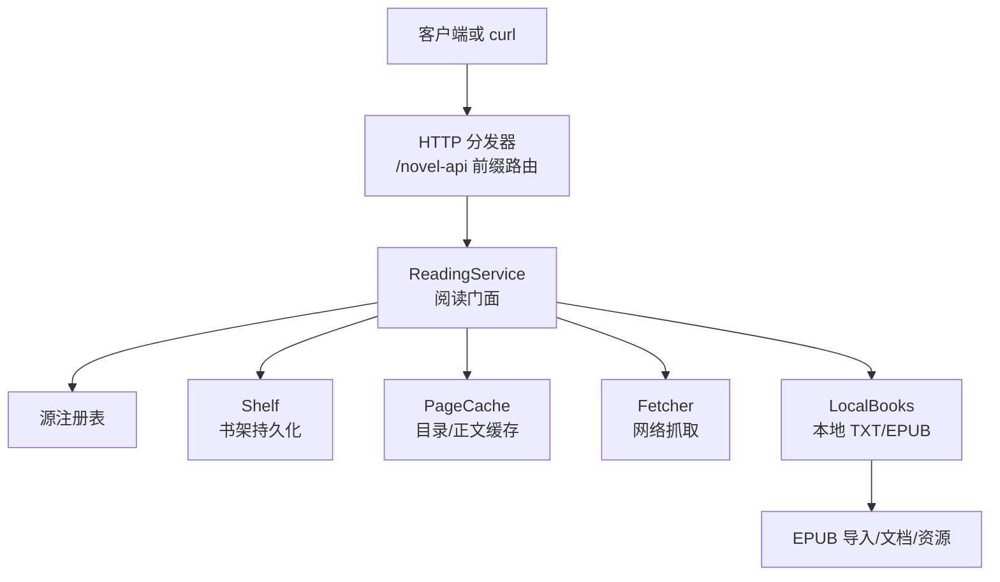
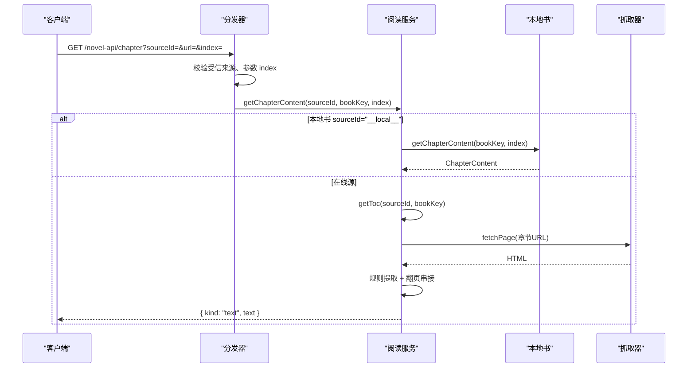
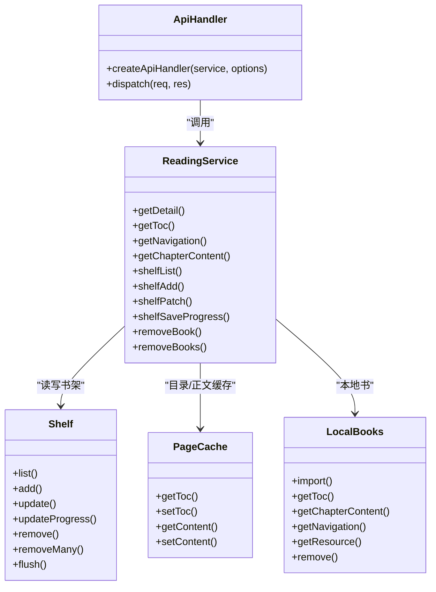

# 阅读与书架 API

<cite>
**本文引用的文件**   
- [src/index.ts](file://src/index.ts)
- [src/api/dispatch.ts](file://src/api/dispatch.ts)
- [src/api/wire.ts](file://src/api/wire.ts)
- [src/shared/wire.ts](file://src/shared/wire.ts)
- [src/services/reading.ts](file://src/services/reading.ts)
- [src/services/chapter-content.ts](file://src/services/chapter-content.ts)
- [src/services/localbooks.ts](file://src/services/localbooks.ts)
</cite>

## 目录
1. [简介](#简介)
2. [项目结构](#项目结构)
3. [核心组件](#核心组件)
4. [架构总览](#架构总览)
5. [详细端点参考](#详细端点参考)
6. [依赖关系分析](#依赖关系分析)
7. [性能与容量特性](#性能与容量特性)
8. [故障排查指南](#故障排查指南)
9. [结论](#结论)

## 简介
本文件是“阅读与书架”相关 HTTP API 的权威参考，覆盖以下端点：

- `GET /novel-api/book`：获取书籍详情（用于拿到 `tocUrl`、章节 URL 等）
- `GET /novel-api/toc`：获取目录映射，返回 `ChapterEntry[]`
- `GET /novel-api/navigation`：获取导航树形结构
- `GET /novel-api/chapter`：获取正文内容
- `GET /novel-api/shelf`：读取书架列表
- `PUT /novel-api/shelf/:key`：添加、更新元数据或保存阅读进度
- `DELETE /novel-api/shelf/:key`：从书架移除；本地书还会删除本地副本
- `POST /novel-api/shelf/batch-delete`：批量删除书架条目

所有响应都采用统一信封：成功为 `{ ok: true, value }`，失败为 `{ ok: false, error: { code, message, segment? } }`。

## 项目结构
`/novel-api` 前缀由 Cordis 插件在运行时注册，请求进入统一分发器后按路径段路由到阅读服务。关键路径如下：



**图表来源**
- [src/index.ts:60-180](file://src/index.ts#L60-L180)
- [src/api/dispatch.ts:35-70](file://src/api/dispatch.ts#L35-L70)
- [src/services/reading.ts:75-160](file://src/services/reading.ts#L75-L160)

**章节来源**
- [src/index.ts:60-180](file://src/index.ts#L60-L180)
- [src/api/dispatch.ts:35-70](file://src/api/dispatch.ts#L35-L70)

## 核心组件
- **分发器**：校验受信来源、解析 `/novel-api` 前缀、把段路由交给内部 `route`。
- **阅读服务**：对外暴露书架、目录、正文、导航、搜索、本地书、导出等动词。
- **共享契约**：定义 `ShelfBook`、`ShelfProgress`、`ChapterEntry`、`BookNavigation`、`ContentNode`、错误信封、路由常量。
- **本地书模块**：处理 TXT 与 EPUB 的导入、目录、正文、资源流与删除。
- **章节文本投影**：将图文节点树转换为纯文本，保证导出、AI、阅读器三出口一致。

**章节来源**
- [src/api/dispatch.ts:35-70](file://src/api/dispatch.ts#L35-L70)
- [src/services/reading.ts:75-160](file://src/services/reading.ts#L75-L160)
- [src/shared/wire.ts:200-497](file://src/shared/wire.ts#L200-L497)
- [src/services/localbooks.ts:1-200](file://src/services/localbooks.ts#L1-L200)
- [src/services/chapter-content.ts:1-182](file://src/services/chapter-content.ts#L1-L182)

## 架构总览
下图展示一次“读取章节”的典型调用链：浏览器或 curl 发起请求 → 分发器校验并解码参数 → 阅读服务查目录 → 在线源抓正文，或本地 EPUB/TXT 读已导入内容。



**图表来源**
- [src/api/dispatch.ts:260-310](file://src/api/dispatch.ts#L260-L310)
- [src/services/reading.ts:650-742](file://src/services/reading.ts#L650-L742)
- [src/services/localbooks.ts:1-200](file://src/services/localbooks.ts#L1-L200)

## 详细端点参考

### 通用安全与信封

- 受信任来源要求请求来自回环地址，且可选的 `Origin`、`Referer` 必须同源。
- 成功响应：`{ ok: true, value: ... }`
- 失败响应：`{ ok: false, error: { code, message, segment? } }`

常见错误码包括：`BadRequest`、`NotFound`、`MethodNotAllowed`、`Forbidden`、`PayloadTooLarge`、`RuleMissing`、`RuleEvalError`、`Unavailable`、`InternalError` 等。

**章节来源**
- [src/api/wire.ts:20-135](file://src/api/wire.ts#L20-L135)
- [src/api/dispatch.ts:35-70](file://src/api/dispatch.ts#L35-L70)

---

### `GET /novel-api/book`

- **用途**：获取书籍详情，包含标题、作者、封面、简介、最新章节名、分类、字数以及 `tocUrl`。
- **查询参数**：
  - `sourceId`：必填。
  - `url`：必填，代表本书的“书地址”。
- **成功响应值类型**：`BookDetail`。
- **分页策略**：无分页；返回单条书籍详情。
- **curl 示例**：

```bash
curl 'http://127.0.0.1:端口/novel-api/book?sourceId=源ID&url=https://某站/书/123'
```

- **差异说明**：
  - 在线书：通过详情页规则解析字段，并计算 `tocUrl`。
  - 本地书：不在本节讨论，因为本地书通常直接走 `/novel-api/local/*` 与书架体系。

**章节来源**
- [src/api/dispatch.ts:240-250](file://src/api/dispatch.ts#L240-L250)
- [src/shared/wire.ts:160-200](file://src/shared/wire.ts#L160-L200)
- [src/services/reading.ts:610-640](file://src/services/reading.ts#L610-L640)

---

### `GET /novel-api/toc`

- **用途**：获取目录映射，返回 `ChapterEntry[]`。
- **查询参数**：
  - `sourceId`：必填。
  - `url`：必填。
  - `refresh=1`：可选；跳过缓存，强制重新抓取目录。
- **成功响应值类型**：`ChapterEntry[]`，每个元素为 `{ name, url }`。
- **name→下标映射**：
  - 数组索引即章号。
  - 第 0 章对应 `index=0`，第 1 章对应 `index=1`，依此类推。
  - 正文接口使用零基整数 `index`，因此“第一章”应传 `0`。
- **分页策略**：目录本身不分页；但服务端会按源的下一页规则抓取多页目录，直到达到上限。
- **curl 示例**：

```bash
curl 'http://127.0.0.1:端口/novel-api/toc?sourceId=源ID&url=https://某站/书/123'
```

- **行为细节**：
  - 在线源：优先取缓存；缺失时抓取详情页或目录页，解析列表规则，支持翻页。
  - 本地书：`sourceId=__local__` 时走本地目录；TXT 由标题行切分，EPUB 由导入期持久化的章节序列提供。

**章节来源**
- [src/api/dispatch.ts:250-260](file://src/api/dispatch.ts#L250-L260)
- [src/shared/wire.ts:150-160](file://src/shared/wire.ts#L150-L160)
- [src/services/reading.ts:640-742](file://src/services/reading.ts#L640-L742)
- [src/services/localbooks.ts:1-200](file://src/services/localbooks.ts#L1-L200)

---

### `GET /novel-api/navigation`

- **用途**：获取导航结构，返回两列：
  - `chapters`：线性目录，与 `GET /novel-api/toc` 口径一致。
  - `items`：展示用树形结构。
- **查询参数**：
  - `sourceId`：必填。
  - `url`：必填。
- **成功响应值类型**：`BookNavigation`。
- **树形结构语义**：
  - 在线书：由线性目录派生平面导航，每章一个叶节点，没有分组层级。
  - EPUB 本地书：使用导入期从原生目录解析出的树；叶条目可指向阅读单元，也可仅作为分组标题。
  - TXT 本地书：由线性目录派生平面导航。
- **curl 示例**：

```bash
curl 'http://127.0.0.1:端口/novel-api/navigation?sourceId=源ID&url=https://某站/书/123'
```

**章节来源**
- [src/api/dispatch.ts:260-270](file://src/api/dispatch.ts#L260-L270)
- [src/shared/wire.ts:300-360](file://src/shared/wire.ts#L300-L360)
- [src/services/reading.ts:660-680](file://src/services/reading.ts#L660-L680)
- [src/services/localbooks.ts:1-200](file://src/services/localbooks.ts#L1-L200)

---

### `GET /novel-api/chapter`

- **用途**：获取正文内容。
- **查询参数**：
  - `sourceId`：必填。
  - `url`：必填。
  - `index`：必填，非负整数，表示章节下标。
  - `refresh=1`：可选；跳过正文缓存，强制重新抓取。
- **成功响应值类型**：`ChapterContent`，两种形态：
  - `{ kind: "text", text }`：纯文本正文，适用于在线书和本地 TXT。
  - `{ kind: "rich", documentId, nodes }`：图文节点树，适用于本地 EPUB。
- **分页策略**：
  - 在线书：正文可能跨多页；服务端通过源的“下一页”规则自动串接，直到达到最大页数上限。
  - 本地书：按已导入章节直接读取，不产生网络分页。
- **全文与分页**：
  - 该接口不是“分页加载正文”的分页接口，而是“按章节下标返回一章”。
  - “一页”指一个章节页面；一个章节可能由多个网页拼接。
- **curl 示例**：

```bash
curl 'http://127.0.0.1:端口/novel-api/chapter?sourceId=源ID&url=https://某站/书/123&index=0'
```

- **本地书差异**：
  - `sourceId=__local__` 且 `url=bookKey` 时，本地 EPUB 返回图文树，本地 TXT 返回纯文本。
  - EPUB 的图文树中图片节点含 `resourceId`，需通过 `/novel-api/local/resource?id=bookKey&resourceId=...` 读取。

**章节来源**
- [src/api/dispatch.ts:270-290](file://src/api/dispatch.ts#L270-L290)
- [src/shared/wire.ts:320-360](file://src/shared/wire.ts#L320-L360)
- [src/services/reading.ts:680-742](file://src/services/reading.ts#L680-L742)
- [src/services/localbooks.ts:1-200](file://src/services/localbooks.ts#L1-L200)

---

### `GET /novel-api/shelf`

- **用途**：读取书架列表。
- **方法**：`GET`。
- **查询参数**：无。
- **成功响应值类型**：`ShelfEntry[]`，其中 `ShelfEntry = ShelfBook & { sourceName: string | null }`。
- **`sourceName` 含义**：
  - 实时根据 `sourceId` 查找源名称。
  - 若源已被删除，则为 `null`。
  - 本地书恒为 `null`。
- **curl 示例**：

```bash
curl 'http://127.0.0.1:端口/novel-api/shelf'
```

**章节来源**
- [src/api/dispatch.ts:300-330](file://src/api/dispatch.ts#L300-L330)
- [src/shared/wire.ts:220-260](file://src/shared/wire.ts#L220-L260)
- [src/services/reading.ts:520-560](file://src/services/reading.ts#L520-L560)

---

### `PUT /novel-api/shelf/:key`

- **用途**：添加书、更新书元数据、保存阅读进度。
- **路径参数**：
  - `:key`：URL 编码后的 `bookKey`。
- **请求体**：三种互斥语义：
  1. **加书**：带 `title`。
     - 同时需要 `sourceId`。
     - 其他元数据字段可选。
  2. **打补丁**：带 `patch` 对象。
     - 只对已在架的书生效；不在架返回 400。
  3. **保存进度**：带 `progress` 对象。
     - 需要 `chapterIndex` 和 `offsetRatio`。
     - 不在架返回 400。
- **`ShelfBook` 字段口径**：
  - 必需：`sourceId`、`bookKey`、`title`、`progress`、`addedAt`。
  - 可选：`author`、`coverUrl`、`intro`、`lastChapterName`、`kind`、`wordCount`、`totalChapters`。
- **`ShelfProgress` 字段口径**：
  - `chapterIndex`：非负整数。
  - `offsetRatio`：有限数，范围 `[0, 1]`。
  - `updatedAt`：服务端写入的时间戳。
- **进度判定**：
  - “读过”的定义是 `chapterIndex > 0` 或 `offsetRatio > 0`。
  - 第 0 章内的偏移也属于进度。
- **curl 示例**：

```bash
# 加书
curl -X PUT \
  --data '{"sourceId":"源ID","title":"书名"}' \
  'http://127.0.0.1:端口/novel-api/shelf/%E4%B9%A6%E7%9A%84bookKey'

# 更新进度
curl -X PUT \
  --data '{"progress":{"chapterIndex":5,"offsetRatio":0.3}}' \
  'http://127.0.0.1:端口/novel-api/shelf/%E4%B9%A6%E7%9A%84bookKey'
```

- **进度持久化行为**：
  - 书架写操作带防抖落盘。
  - 插件卸载时会主动 flush，尽量把最后一次进度落盘。
  - 高频进度写入不会每次同步阻塞请求，但极端情况下仍可能丢窗口内最后一写。

**章节来源**
- [src/api/dispatch.ts:450-520](file://src/api/dispatch.ts#L450-L520)
- [src/shared/wire.ts:220-260](file://src/shared/wire.ts#L220-L260)
- [src/services/reading.ts:540-610](file://src/services/reading.ts#L540-L610)
- [src/index.ts:120-160](file://src/index.ts#L120-L160)

---

### `DELETE /novel-api/shelf/:key`

- **用途**：从书架移除一本书。
- **路径参数**：
  - `:key`：URL 编码后的 `bookKey`。
- **成功响应值**：`{ removed: boolean }`。
- **本地书特殊行为**：
  - 如果 `bookKey` 是本地书键，会连带删除本地副本，防止孤儿文件。
- **curl 示例**：

```bash
curl -X DELETE \
  'http://127.0.0.1:端口/novel-api/shelf/%E4%B9%A6%E7%9A%84bookKey'
```

**章节来源**
- [src/api/dispatch.ts:320-340](file://src/api/dispatch.ts#L320-L340)
- [src/services/reading.ts:580-610](file://src/services/reading.ts#L580-L610)
- [src/services/localbooks.ts:1-200](file://src/services/localbooks.ts#L1-L200)

---

### `POST /novel-api/shelf/batch-delete`

- **用途**：批量删除书架条目。
- **请求体**：
  - `{ keys: string[] }`，其中 `keys` 是 `bookKey` 列表。
- **成功响应值**：`{ removed: number }`，表示实际删除的条目数。
- **行为特点**：
  - 未知键静默跳过。
  - 重复键幂等。
  - 对真实在架的本地书，连带删除本地副本。
- **curl 示例**：

```bash
curl -X POST \
  --data '{"keys":["bookKey1","bookKey2"]}' \
  'http://127.0.0.1:端口/novel-api/shelf/batch-delete'
```

**章节来源**
- [src/api/dispatch.ts:300-320](file://src/api/dispatch.ts#L300-L320)
- [src/services/reading.ts:600-610](file://src/services/reading.ts#L600-L610)

---

### 书架 `bookKey` 生成规则

- **在线书**：`bookKey` 通常就是书的 URL。
- **本地书**：`bookKey` 形态为 `local:<uuid>`，其中 uuid 是严格校验的十六进制标识。
- **校验函数**：`isLocalBookKey` 用于判断是否为本地书键。
- **URL 编码**：
  - 路径中的 `:key` 必须 URL 编码。
  - JSON body 中的 `keys` 不需要二次编码。

**章节来源**
- [src/services/localbooks.ts:20-40](file://src/services/localbooks.ts#L20-L40)
- [src/shared/wire.ts:440-460](file://src/shared/wire.ts#L440-L460)
- [src/api/dispatch.ts:520-530](file://src/api/dispatch.ts#L520-L530)

---

### 本地书与 EPUB 的差异

| 维度 | 本地 TXT | 本地 EPUB | 在线源 |
|---|---|---|---|
| 来源 | 导入文本文件 | 导入 EPUB 归档 | 抓取网站 |
| 目录来源 | 标题行正则切分 | 导入期持久化的章节序列 | 详情页或目录规则 |
| 正文格式 | 纯文本 | 图文节点树 | 纯文本 |
| 资源 | 无独立资源流 | 有插图等资源，需单独请求 | 通过站点 URL 引用 |
| 导航树 | 平面导航 | 原生目录树 | 平面导航 |
| 删除行为 | 删除书架条目 | 删除书架条目 + 本地目录 | 只删书架条目 |

**章节来源**
- [src/services/localbooks.ts:1-200](file://src/services/localbooks.ts#L1-L200)
- [src/services/reading.ts:660-742](file://src/services/reading.ts#L660-L742)
- [src/shared/wire.ts:300-360](file://src/shared/wire.ts#L300-L360)

## 依赖关系分析



**图表来源**
- [src/api/dispatch.ts:35-70](file://src/api/dispatch.ts#L35-L70)
- [src/services/reading.ts:75-160](file://src/services/reading.ts#L75-L160)

**章节来源**
- [src/api/dispatch.ts:35-70](file://src/api/dispatch.ts#L35-L70)
- [src/services/reading.ts:75-160](file://src/services/reading.ts#L75-L160)

## 性能与容量特性

- **目录缓存**：目录结果按源、书地址和规则代际缓存；`refresh=1` 可绕过。
- **正文缓存**：在线正文按规则代际、章节名槽位缓存；空正文会被视为未命中并重抓。
- **目录并发保护**：同书目录请求去重，避免重复抓取。
- **正文翻页上限**：默认最多抓取 50 页正文。
- **目录翻页上限**：默认最多抓取 200 页目录。
- **JSON 请求体上限**：默认 1 MiB。
- **本地导入上限**：默认 50 MB。
- **导出流**：按章节流式输出，支持取消；头信息中包含本次导出的总章数和范围。

**章节来源**
- [src/services/reading.ts:120-160](file://src/services/reading.ts#L120-L160)
- [src/services/reading.ts:640-742](file://src/services/reading.ts#L640-L742)
- [src/api/wire.ts:60-100](file://src/api/wire.ts#L60-L100)
- [src/services/localbooks.ts:160-200](file://src/services/localbooks.ts#L160-L200)

## 故障排查指南

| 现象 | 可能原因 | 排查建议 |
|---|---|---|
| 章节缺失 | 目录中没有对应 `index` | 先调用 `GET /novel-api/toc`，确认 `toc.length`；`index` 必须是小于目录长度的非负整数。 |
| 章节内容为空 | 正文规则零命中 | 检查源的 `ruleContent` 是否匹配；查看错误信息中的规则片段和页面落点。 |
| 目录为空 | 源缺少目录规则 | 检查 `ruleChapterList` 或 `ruleBookList` 与 `ruleChapterName`、`ruleChapterUrl` 是否存在。 |
| EPUB 资源不可用 | 资源 ID 不存在或文件被删除 | 使用 `/novel-api/local/resource?id=bookKey&resourceId=...` 验证；确认本地书目录未被手动清理。 |
| 本地书无法读取 | 本地导入未完成或元数据缺失 | 检查导入回执和告警；确认 `local/<uuid>/` 目录存在。 |
| 书架操作报“书不在架上” | 对不在架的书执行 `patch` 或 `progress` | 先用 `PUT` 带 `title` 加书，再执行补丁或进度保存。 |
| 请求被拒绝 | 非受信来源 | 确认请求来自本机；curl 可直接发，但浏览器跨源请求需同源。 |
| 本地书删除后仍有文件 | 删除发生在异常路径或未触发本地书分支 | 确认 `bookKey` 是 `local:<uuid>`；检查本地目录权限。 |

**章节来源**
- [src/services/reading.ts:680-742](file://src/services/reading.ts#L680-L742)
- [src/services/localbooks.ts:1-200](file://src/services/localbooks.ts#L1-L200)
- [src/api/wire.ts:20-135](file://src/api/wire.ts#L20-L135)

## 结论
阅读与书架 API 以 `/novel-api` 为统一入口，由分发器校验后交给阅读服务。目录、导航、正文、书架和本地书分别由清晰的模块承担：

- `GET /novel-api/book` 提供书籍详情与目录入口。
- `GET /novel-api/toc` 提供线性目录，`index` 从零开始。
- `GET /novel-api/navigation` 提供线性目录与展示树。
- `GET /novel-api/chapter` 返回纯文本或图文正文，在线书支持翻页串接。
- 书架接口负责增删改查，并区分在线书与本地书的行为。
- 本地书与 EPUB 在目录、正文、资源和删除行为上与在线源有明显差异。

理解这些边界后，客户端可以可靠地构建书架、导航、阅读器和导出流程。