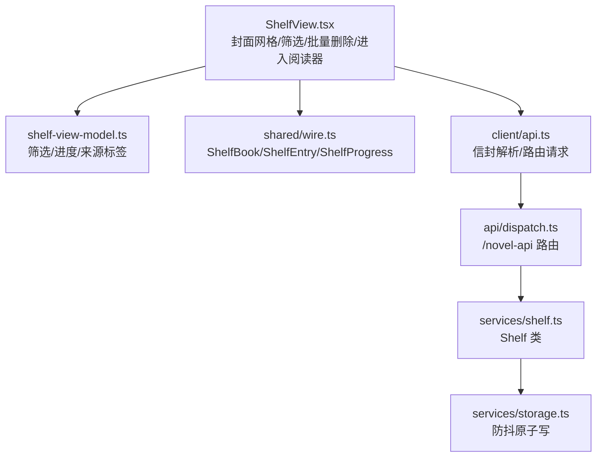
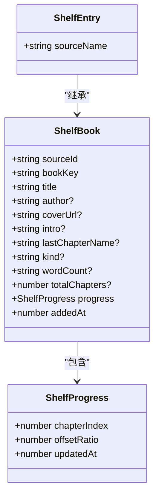
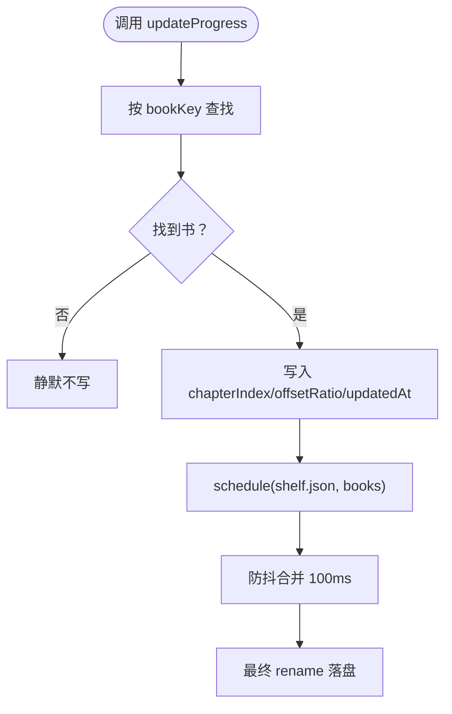
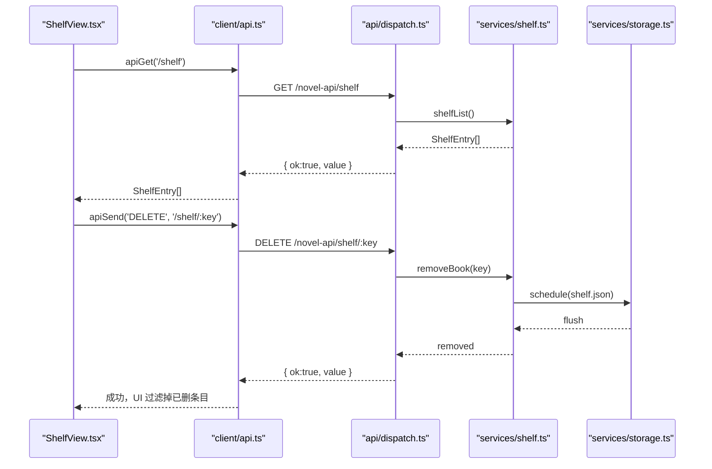
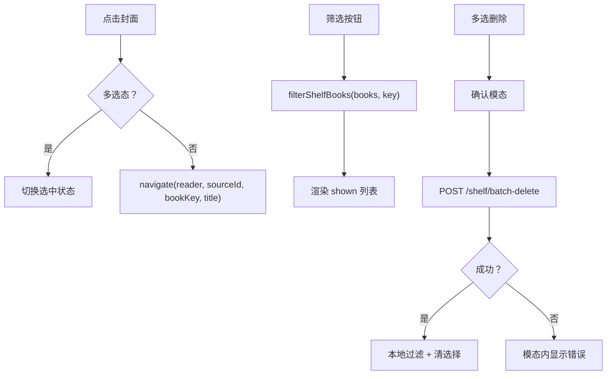
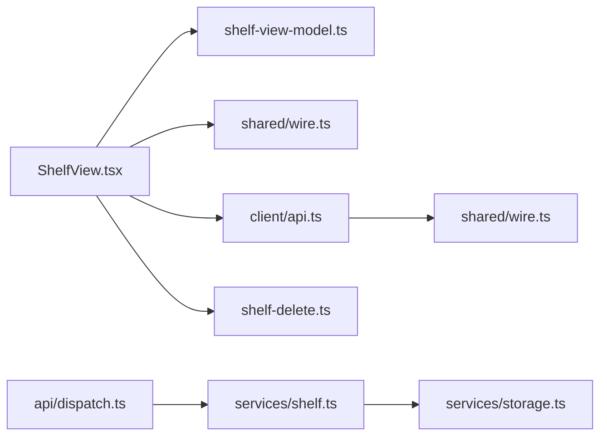

# 书架

<cite>
**本文引用的文件**   
- [ShelfView.tsx](file://src/client/views/ShelfView.tsx)
- [shelf-view-model.ts](file://src/client/shelf-view-model.ts)
- [shelf-delete.ts](file://src/client/shelf-delete.ts)
- [types.ts](file://src/client/views/types.ts)
- [api.ts](file://src/client/api.ts)
- [wire.ts](file://src/shared/wire.ts)
- [dispatch.ts](file://src/api/dispatch.ts)
- [shelf.ts](file://src/services/shelf.ts)
- [storage.ts](file://src/services/storage.ts)
- [shelf.test.ts](file://tests/services/shelf.test.ts)
</cite>

## 目录
1. [引言](#引言)
2. [项目结构](#项目结构)
3. [核心数据模型](#核心数据模型)
4. [服务端书架实现](#服务端书架实现)
5. [架构总览](#架构总览)
6. [详细组件分析](#详细组件分析)
7. [依赖关系分析](#依赖关系分析)
8. [性能特性](#性能特性)
9. [HTTP API 规范](#http-api-规范)
10. [常见问题与排查](#常见问题与排查)
11. [结论](#结论)

## 引言
本文件面向“书架”功能，覆盖从客户端渲染到服务端持久化的完整链路：`ShelfBook`/`ShelfProgress`/`ShelfEntry` 等 wire 契约、`Shelf` 类的增删改查、`ShelfView` 的封面网格与筛选逻辑，以及 GET /shelf、PUT /shelf/:key、DELETE /shelf/:key、POST /shelf/batch-delete 的请求与响应约定。文档同时给出与 wire 契约的对齐说明和常见故障排查建议。

## 项目结构
书架相关代码分布在三层：
- 客户端视图层：`ShelfView.tsx` 负责书架 UI、筛选、批量删除、导入回执与点击阅读器跳转。
- 客户端纯函数层：`shelf-view-model.ts` 提供筛选、进度百分比、来源标签、本地导入文案等无状态派生。
- 服务层与契约层：`services/shelf.ts` 维护 shelf.json；`shared/wire.ts` 定义跨半类型；`api/dispatch.ts` 暴露路由；`services/storage.ts` 提供原子写与防抖落盘。



**图表来源**
- [ShelfView.tsx:1-378](file://src/client/views/ShelfView.tsx#L1-L378)
- [shelf-view-model.ts:1-74](file://src/client/shelf-view-model.ts#L1-L74)
- [wire.ts:170-220](file://src/shared/wire.ts#L170-L220)
- [api.ts:1-111](file://src/client/api.ts#L1-L111)
- [dispatch.ts:260-330](file://src/api/dispatch.ts#L260-L330)
- [shelf.ts:1-122](file://src/services/shelf.ts#L1-L122)
- [storage.ts:1-129](file://src/services/storage.ts#L1-L129)

**章节来源**
- [ShelfView.tsx:1-378](file://src/client/views/ShelfView.tsx#L1-L378)
- [shelf-view-model.ts:1-74](file://src/client/shelf-view-model.ts#L1-L74)
- [wire.ts:170-220](file://src/shared/wire.ts#L170-L220)
- [api.ts:1-111](file://src/client/api.ts#L1-L111)
- [dispatch.ts:260-330](file://src/api/dispatch.ts#L260-L330)
- [shelf.ts:1-122](file://src/services/shelf.ts#L1-L122)
- [storage.ts:1-129](file://src/services/storage.ts#L1-L129)

## 核心数据模型
本节聚焦 wire 契约中的书架类型，这是客户端与服务端共享的唯一真相。

### ShelfProgress：阅读进度
`ShelfProgress` 是书架进度字段，包含三个键：
- `chapterIndex`：已读章索引，0 基。
- `offsetRatio`：当前章内阅读比例。
- `updatedAt`：更新时间戳。

判定一本书是否“在读”的单点是 `hasProgress`：只要 `chapterIndex > 0` 或 `offsetRatio > 0`，即视为有实质阅读进度。该判据同时用于书架卡片“在读/未读”筛选与阅读器存档恢复，避免两侧口径不一致。

### ShelfBook：书架条目
`ShelfBook` 表示书架中一本书的元数据与进度：
- 身份字段：`sourceId`、`bookKey`。
- 书名与辅助信息：`title`、可选 `author`、`coverUrl`、`intro`、`lastChapterName`、`kind`、`wordCount`。
- 全书章数：可选 `totalChapters`，旧数据可能缺失。
- 进度：必填 `progress`（`ShelfProgress`）。
- 入架时间：`addedAt`。

注意：`progress` 与 `addedAt` 不是书目元数据字段，不参与可 patch 的书目字段集。

### ShelfEntry：读取面投影
`ShelfEntry = ShelfBook & { sourceName: string | null }`，是服务端返回给客户端的读取面类型。`sourceName` 由服务端根据 `sourceId` 关联书源名称；若源已被删除或未匹配，则为 `null`。它不可 patch、不落盘，因此不进入 SHELF_META。



**图表来源**
- [wire.ts:170-220](file://src/shared/wire.ts#L170-L220)

**章节来源**
- [wire.ts:170-220](file://src/shared/wire.ts#L170-L220)

## 服务端书架实现
服务端书架由 `Shelf` 类管理，内存镜像为 `ShelfBook[]`，落盘文件为 `{dataDir}/shelf.json`。写入走 `createDebouncedWriter(100)`，高频进度更新会合并为最后一次落盘。

### 核心方法语义
- `add(input)`：若该书不在架则插入；已在架则按 `SHELF_META` 做保值 patch（缺键、`null`、`undefined` 不抹值）。新书构造时进度初始化为 `{ chapterIndex: 0, offsetRatio: 0, updatedAt }`。
- `update(bookKey, patch)`：对已在架的书打补丁；不在架返回 `null`。
- `updateProgress(bookKey, chapterIndex, offsetRatio)`：更新进度并防抖落盘；不在架静默忽略。
- `remove(bookKey)`：调用 `removeMany([bookKey])`，返回是否命中。
- `removeMany(keys)`：一趟扫描删除全部命中项，返回被删条目；未知键跳过、重复键幂等，只调度一次落盘。
- `list()` / `get(key)`：内存查询。
- `flush()`：等待防抖写落地。

这些行为由 `tests/services/shelf.test.ts` 钉住，包括同 key 加书保留 `addedAt`、连续进度更新取最后一次、`totalChapters` 带值才更新、四兄弟字段保值、批量删除返回顺序与去重语义。



**图表来源**
- [shelf.ts:60-100](file://src/services/shelf.ts#L60-L100)
- [storage.ts:70-129](file://src/services/storage.ts#L70-L129)

**章节来源**
- [shelf.ts:1-122](file://src/services/shelf.ts#L1-L122)
- [shelf.test.ts:1-123](file://tests/services/shelf.test.ts#L1-L123)
- [storage.ts:1-129](file://src/services/storage.ts#L1-L129)

## 架构总览
书架请求的典型路径如下：



**图表来源**
- [ShelfView.tsx:240-378](file://src/client/views/ShelfView.tsx#L240-L378)
- [api.ts:60-111](file://src/client/api.ts#L60-L111)
- [dispatch.ts:260-330](file://src/api/dispatch.ts#L260-L330)
- [shelf.ts:1-122](file://src/services/shelf.ts#L1-L122)
- [storage.ts:70-129](file://src/services/storage.ts#L70-L129)

## 详细组件分析

### ShelfView.tsx：封面网格、筛选、批量删除与进入阅读器
`ShelfView` 是 React 组件，承担以下职责：

1. **加载书架**
   - 挂载时调用 `deps.apiGet<ShelfEntry[]>(ROUTES.shelf.path)`。
   - 成功时设置 `books` 并清除加载错误；失败时保留 `loadError`，不会把网络失败伪装成空书架。

2. **搜索入口**
   - 搜索框提交后跳转到搜索页，参数来自 `navigate({ name: 'search', keyword })`。

3. **筛选**
   - 使用 `shelf-view-model.ts` 的 `filterShelfBooks`：
     - “全部”：原样返回。
     - “在读”：`hasProgress(progress)` 为真。
     - “未读”：`hasProgress(progress)` 为假。
     - “本地”：`sourceId === LOCAL_SOURCE_ID`。
   - 多选态下筛选在入场时定格，“全选”只对当前可见条目生效。

4. **封面网格渲染**
   - 每个条目渲染一个 `<button>` 卡片，内容包含封面区、书名、元信息与进度条。
   - 封面优先显示 `coverUrl`；若图片加载失败则记录 `imgFailed[bookKey]` 并降级：
     - 本地书显示“本地”占位。
     - 在线书用首字色块占位，色阶由 `coverTintClass(title)` 决定。

5. **来源色点与源名**
   - 通过 `shelfSourceTag(b)` 计算：
     - 本地书返回 `null`，不出来源 chip。
     - 有可用源名时显示源名，色点由 `sourceTintClass(sourceId)` 分配档位。
     - 源名缺失（如源已删）显示“来源已删除”，并标记为灰调。

6. **在读/未读筛选实现**
   - 基于 `hasProgress`：`chapterIndex > 0 || offsetRatio > 0`。
   - 进度百分比由 `shelfCardMeta` 计算：`(chapterIndex + offsetRatio) / totalChapters * 100`，上限 100%。
   - 未读书的 pct 为 `null`，不渲染进度条，只显示“未开始 · N 章”或“本地”。

7. **批量删除**
   - 点击“选择”进入多选态，卡片变为勾选控件，末位“导入本地书籍”卡隐藏。
   - “全选”仅勾选当前筛选可见的书。
   - 点击“删除所选”打开确认模态，调用 `POST /shelf/batch-delete`，载荷为 `{ keys: [bookKey, ...] }`。
   - 成功时本地过滤掉已删条目、清空选择并退出多选态；失败时在模态内显示错误，允许重试或取消。

8. **点击封面进入阅读器**
   - 非多选态下点击卡片调用 `navigate({ name: 'reader', sourceId, bookKey, title })`。
   - 多选态下点击卡片只切换勾选状态。

9. **导入本地书籍**
   - 隐藏的 file input 接受 `.txt,.epub`，上传走 `apiUpload(LocalImportResponse)`。
   - 有警告时不自动跳阅读器，而是展示导入回执，用户手动点击“开始阅读”。
   - 无警告时直接跳转到阅读器。



**图表来源**
- [ShelfView.tsx:201-378](file://src/client/views/ShelfView.tsx#L201-L378)
- [shelf-view-model.ts:1-74](file://src/client/shelf-view-model.ts#L1-L74)

**章节来源**
- [ShelfView.tsx:1-378](file://src/client/views/ShelfView.tsx#L1-L378)
- [shelf-view-model.ts:1-74](file://src/client/shelf-view-model.ts#L1-L74)
- [shelf-delete.ts:1-37](file://src/client/shelf-delete.ts#L1-L37)

### shelf-view-model.ts：纯函数派生
该模块不含 React，仅提供：
- `SHELF_FILTERS`：全部/在读/未读/本地。
- `filterShelfBooks`：泛型筛选，保持 `ShelfBook` 的来源投影不被擦除。
- `shelfCardMeta`：生成卡片灰色一行文字与进度条百分比。
- `shelfSourceTag`：来源 chip 文本与删除态标志。
- `localImportLabel`、`localImportNote`：本地导入回执格式标签与补充提示。

复杂度方面，筛选是 O(n)，进度与标签是 O(1)。

**章节来源**
- [shelf-view-model.ts:1-74](file://src/client/shelf-view-model.ts#L1-L74)

### shelf-delete.ts：删除确认文案
该模块提供纯函数：
- `deleteBookCopy(title, isLocal)`：单本删除确认与本地副本连删警告。
- `deleteBooksCopy(books)`：批量删除确认，统计其中本地书数量并给出副本连删说明。

文案明确区分“DSH 数据目录中的副本”与“原始文件不受影响”，避免用户误以为删除操作会动自己的原件。

**章节来源**
- [shelf-delete.ts:1-37](file://src/client/shelf-delete.ts#L1-L37)

### 与 wire 契约的对齐
`ShelfView` 消费的类型来自 `src/client/views/types.ts`，该文件只是 re-export 桶，实际定义在 `shared/wire.ts`。对齐要点：
- `ShelfEntry`：包含 `sourceName`，用于来源 chip 显示。
- `ShelfBook`：包含 `progress`、`totalChapters`、`coverUrl` 等封面与进度字段。
- `SearchHit`、`ShelfProgress`、`LocalImportResponse` 等同源类型，确保浏览器端与服务端形状一致。

若修改书架字段，应优先改 `shared/wire.ts` 的 `SHELF_META` 与对应接口，而不是在客户端单独复制一份类型。

**章节来源**
- [types.ts:1-20](file://src/client/views/types.ts#L1-L20)
- [wire.ts:170-220](file://src/shared/wire.ts#L170-L220)

## 依赖关系分析
书架功能的依赖链呈单向流动：
- `ShelfView` 依赖 `shelf-view-model` 的纯函数、`wire` 的类型常量、`api.ts` 的 HTTP 封装、`shelf-delete.ts` 的删除文案。
- `api.ts` 依赖 `shared/wire.ts` 的信封与路由前缀。
- `api/dispatch.ts` 依赖 `services/shelf.ts` 的门面动词与 `api/wire.ts` 的错误映射。
- `services/shelf.ts` 依赖 `services/storage.ts` 的防抖原子写。



**图表来源**
- [ShelfView.tsx:1-378](file://src/client/views/ShelfView.tsx#L1-L378)
- [api.ts:1-111](file://src/client/api.ts#L1-L111)
- [dispatch.ts:260-330](file://src/api/dispatch.ts#L260-L330)
- [shelf.ts:1-122](file://src/services/shelf.ts#L1-L122)
- [storage.ts:1-129](file://src/services/storage.ts#L1-L129)

**章节来源**
- [ShelfView.tsx:1-378](file://src/client/views/ShelfView.tsx#L1-L378)
- [api.ts:1-111](file://src/client/api.ts#L1-L111)
- [dispatch.ts:260-330](file://src/api/dispatch.ts#L260-L330)
- [shelf.ts:1-122](file://src/services/shelf.ts#L1-L122)
- [storage.ts:1-129](file://src/services/storage.ts#L1-L129)

## 性能特性
- 书架筛选与卡片元信息为纯函数，时间复杂度 O(n) 或 O(1)，无额外内存开销。
- 进度更新走 `createDebouncedWriter(100)`，高频保存会合并为最后一次 JSON 写。
- 封面图片使用懒加载，失败后缓存失败状态，避免反复重试。
- 批量删除一次请求处理多个 `bookKey`，减少 N 次全量重写磁盘的风险。

[本节为通用性能说明，不直接分析具体代码片段]

## HTTP API 规范
所有书架路由位于 `/novel-api/shelf` 前缀下，统一信封格式：
- 成功：`{ ok: true, value: T }`
- 失败：`{ ok: false, error: { code, message, segment? } }`

### GET /shelf
- 用途：获取书架列表。
- 响应体：`ShelfEntry[]`。
- 示例响应：
```json
{
  "ok": true,
  "value": [
    {
      "sourceId": "__local__",
      "bookKey": "local:uuid-of-book",
      "title": "本地书示例",
      "coverUrl": null,
      "progress": {
        "chapterIndex": 3,
        "offsetRatio": 0.4,
        "updatedAt": 1700000000000
      },
      "addedAt": 1700000000000,
      "sourceName": null
    },
    {
      "sourceId": "online-source-id",
      "bookKey": "https://example.com/book/1",
      "title": "在线书示例",
      "author": "作者A",
      "coverUrl": "https://example.com/cover.jpg",
      "totalChapters": 200,
      "progress": {
        "chapterIndex": 10,
        "offsetRatio": 0.0,
        "updatedAt": 1700000000000
      },
      "addedAt": 1700000000000,
      "sourceName": "某书源"
    }
  ]
}
```

### PUT /shelf/:key
- 用途：加书、打补丁或更新进度。
- 路径参数：`:key` 为 `bookKey`。
- 请求体三选一：
  1. 加书：`{ title: string, ...optional metadata fields }`
  2. 打补丁：`{ patch: { [field]: string|null|number|null, ... } }`
  3. 更新进度：`{ progress: { chapterIndex: number, offsetRatio: number } }`
- 成功响应：返回更新后的 `ShelfBook`。
- 失败响应：
  - 400：不在架却执行 patch/progress，或 body 不符合三类形态。
  - 400：path 含非法百分号编码。
- 示例：
```json
{
  "ok": true,
  "value": {
    "sourceId": "online-source-id",
    "bookKey": "https://example.com/book/1",
    "title": "在线书示例",
    "totalChapters": 200,
    "progress": {
      "chapterIndex": 10,
      "offsetRatio": 0.0,
      "updatedAt": 1700000000000
    },
    "addedAt": 1700000000000
  }
}
```

### DELETE /shelf/:key
- 用途：移除书架上的书；本地书连带删除 DSH 数据目录中的副本与元数据。
- 路径参数：`:key` 为 `bookKey`。
- 成功响应：
```json
{
  "ok": true,
  "value": {
    "removed": true
  }
}
```
- 失败响应：
```json
{
  "ok": false,
  "error": {
    "code": "NotFound",
    "message": "书不在架上"
  }
}
```

### POST /shelf/batch-delete
- 用途：批量删除多本书。
- 请求体：`{ keys: string[] }`，每项为 `bookKey`。
- 成功响应：
```json
{
  "ok": true,
  "value": {
    "removed": 2
  }
}
```
- 失败响应：
```json
{
  "ok": false,
  "error": {
    "code": "BadRequest",
    "message": "body 需为非空 { keys: string[] }"
  }
}
```

### 错误信封通用格式
```json
{
  "ok": false,
  "error": {
    "code": "BadRequest",
    "message": "具体错误消息"
  }
}
```
带段级定位时附加 `segment`：
```json
{
  "ok": false,
  "error": {
    "code": "RuleEvalError",
    "message": "规则求值失败",
    "segment": {
      "facet": "search",
      "segmentIndex": 0,
      "segmentRaw": "some rule text"
    }
  }
}
```

**章节来源**
- [dispatch.ts:260-330](file://src/api/dispatch.ts#L260-L330)
- [dispatch.ts:460-530](file://src/api/dispatch.ts#L460-L530)
- [wire.ts:300-360](file://src/shared/wire.ts#L300-L360)
- [api.ts:1-111](file://src/client/api.ts#L1-L111)

## 常见问题与排查

### 封面缺失
- 现象：书架卡片显示首字色块或“本地”占位，而非真实封面。
- 原因：
  - `coverUrl` 不存在。
  - 图片加载失败，`imgFailed[bookKey]` 被记录。
  - 本地书没有封面资源时走“本地”占位分支。
- 排查建议：
  - 检查服务端返回的 `ShelfEntry.coverUrl` 是否为字符串。
  - 检查浏览器控制台是否有图片加载失败。
  - 对于本地 EPUB，确认封面资源未被清理。
  - 刷新书架重新拉取最新列表。

**章节来源**
- [ShelfView.tsx:280-378](file://src/client/views/ShelfView.tsx#L280-L378)

### 来源色点不显示
- 现象：卡片左下角没有来源色点与源名。
- 原因：
  - 本地书（`sourceId === LOCAL_SOURCE_ID`）不显示来源 chip。
  - 服务端 join 不到源名，`sourceName` 为 `null`，显示“来源已删除”。
- 排查建议：
  - 确认书是否为本地书。
  - 检查 `ShelfEntry.sourceName` 是否为 `null`。
  - 检查源是否仍存在于书源注册表。

**章节来源**
- [shelf-view-model.ts:40-60](file://src/client/shelf-view-model.ts#L40-L60)
- [wire.ts:200-220](file://src/shared/wire.ts#L200-L220)

### 进度未持久化
- 现象：阅读器关闭后再次打开，进度回到 0 或上次更早位置。
- 原因：
  - 进度更新尚未完成防抖窗口（默认 100ms）。
  - 进程退出时未触发 flush，导致最后一笔进度仍在计时器中。
  - `Shelf.updateProgress` 对不在架的书静默不写。
- 排查建议：
  - 等待短暂时间后再重启进程。
  - 检查插件 dispose 钩子是否调用 `service.flush()`。
  - 确认该书已通过 `shelfAdd` 或 `shelfPut` 加入书架。
  - 查看 `shelf.json` 是否被损坏备份（`.bak`），并检查日志中的 `CorruptJsonError`。

**章节来源**
- [shelf.ts:60-100](file://src/services/shelf.ts#L60-L100)
- [storage.ts:1-129](file://src/services/storage.ts#L1-L129)
- [index.ts:120-180](file://src/index.ts#L120-L180)

### 批量删除后状态不同步
- 现象：批量删除成功后，UI 仍显示部分已删书，或多选状态残留。
- 原因：
  - 批量请求失败时，UI 不会乐观删除，错误留在模态内。
  - 成功时才会过滤 `books` 与 `selected`，并退出多选态。
  - 客户端侧多选状态是现场 state，切 tab 会清零，但若同一界面内多次操作需确保目标键集合正确。
- 排查建议：
  - 检查批量删除请求是否返回 `ok: true`。
  - 检查 `pendingDel.books` 快照是否正确。
  - 检查 `selected` 中是否仍包含已删 `bookKey`。
  - 重新加载书架以同步服务端真相。

**章节来源**
- [ShelfView.tsx:100-200](file://src/client/views/ShelfView.tsx#L100-L200)

## 结论
书架功能以 `shared/wire.ts` 为唯一类型真相，串联客户端视图、服务端门面与磁盘持久化。`ShelfBook` 与 `ShelfProgress` 承载书名、封面、来源、进度等核心信息；`Shelf` 类提供 add/update/remove/updateProgress 等原子语义；`ShelfView` 负责封面网格、来源色点、在读/未读筛选、批量删除与阅读器跳转。HTTP API 以统一信封返回结果，错误路径通过 `code` 与 `message` 暴露。排查时应优先区分客户端渲染问题、wire 类型漂移、服务端返回缺失与服务端持久化失败四类原因。