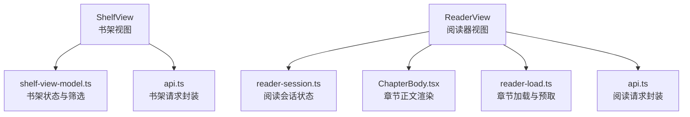
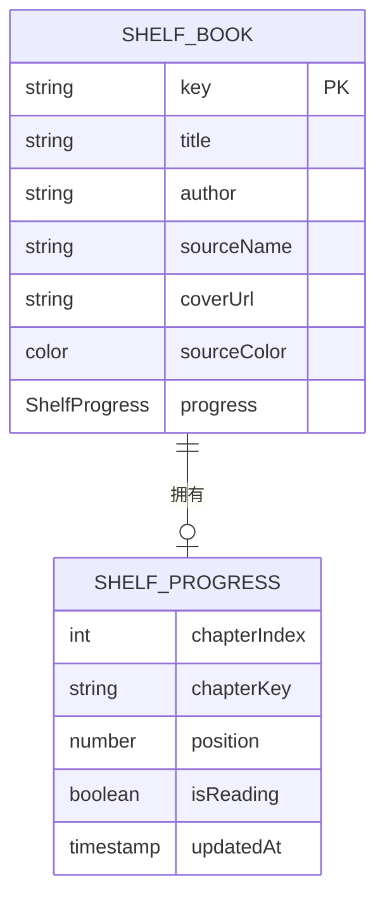
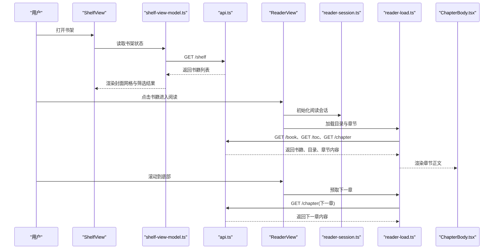
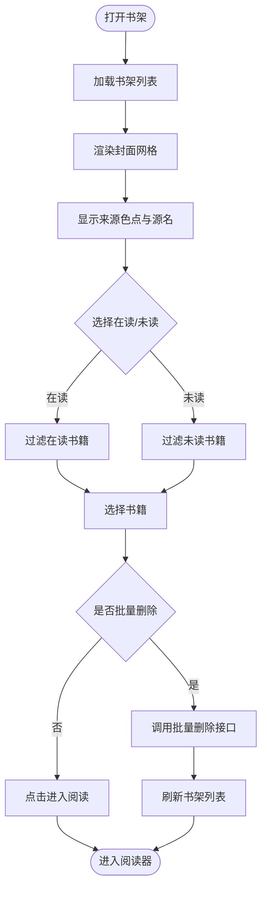
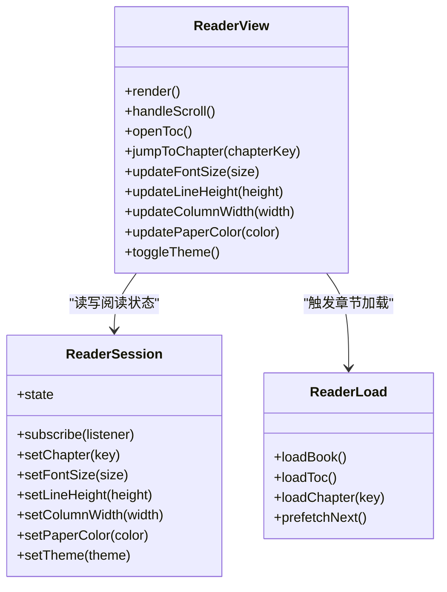
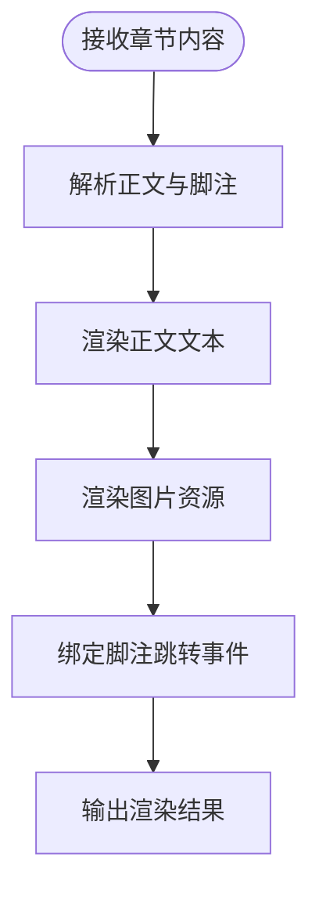
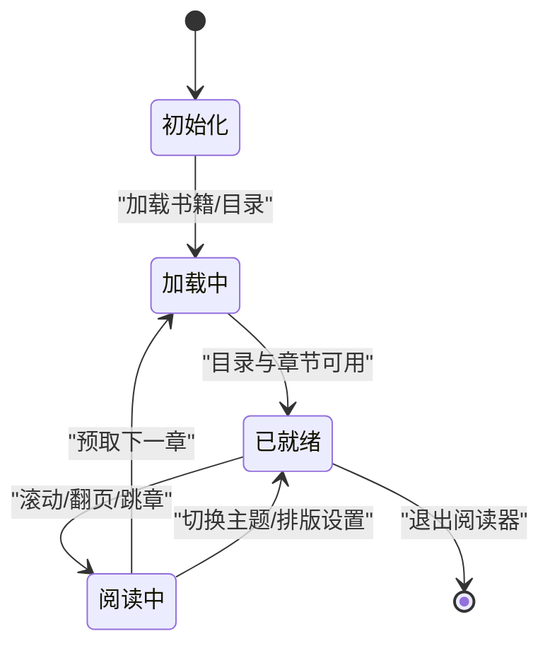
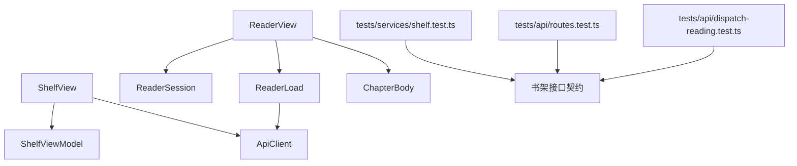

# 书架与阅读器

<cite>
**本文引用的文件**
- [ShelfView.tsx](file://src/src/client/views/ShelfView.tsx)
- [shelf-view-model.ts](file://src/src/client/shelf-view-model.ts)
- [reader-session.ts](file://src/src/client/reader-session.ts)
- [ReaderView.tsx](file://src/src/client/views/ReaderView.tsx)
- [ChapterBody.tsx](file://src/src/client/views/ChapterBody.tsx)
- [api.ts](file://src/src/client/api.ts)
- [shelf-delete.ts](file://src/src/client/shelf-delete.ts)
- [reader-load.ts](file://src/src/client/reader-load.ts)
- [shelf.test.ts](file://tests/services/shelf.test.ts)
- [routes.test.ts](file://tests/api/routes.test.ts)
- [dispatch-reading.test.ts](file://tests/api/dispatch-reading.test.ts)
- [chapter-body.test.tsx](file://tests/client/chapter-body.test.tsx)
- [reader-session.test.ts](file://tests/client/reader-session.test.ts)
- [shelf-view-model.test.ts](file://tests/client/shelf-view-model.test.ts)
- [shelf-batch.test.tsx](file://tests/client/shelf-batch.test.tsx)
- [shelf-delete.test.ts](file://tests/client/shelf-delete.test.ts)
</cite>

## 目录
1. [简介](#简介)
2. [项目结构](#项目结构)
3. [核心数据模型：书架条目与阅读进度](#核心数据模型书架条目与阅读进度)
4. [架构总览](#架构总览)
5. [详细组件分析](#详细组件分析)
6. [依赖关系分析](#依赖关系分析)
7. [性能考量](#性能考量)
8. [常见问题排查](#常见问题排查)
9. [结论](#结论)

## 简介
本文面向书架与阅读器相关功能的实现者与维护者，覆盖以下目标：
- 说明书架条目数据结构 `ShelfBook` 与阅读进度模型 `ShelfProgress`。
- 解释封面网格、来源色点、源名、在读/未读筛选、批量删除的实现位置。
- 说明阅读器视图 `ReaderView` 的连续滚动自动预取下一章、目录抽屉跳章、字号/行距/栏宽/纸张色设置、深浅主题切换。
- 解释章节正文渲染组件 `ChapterBody` 如何处理正文、图片与脚注跳转。
- 给出书架 API 与阅读 API 的请求响应示例。
- 说明状态管理模块 `shelf-view-model.ts` 与 `reader-session.ts` 的职责。
- 提供常见问题排查清单。

## 项目结构
书架与阅读器功能分布在客户端视图层、客户端状态层与服务端接口测试之间：
- 客户端视图层：`ShelfView.tsx`、`ReaderView.tsx`、`ChapterBody.tsx`、`ReaderNavigation.tsx`、`ReaderNotes.tsx`。
- 客户端状态与工具：`shelf-view-model.ts`、`reader-session.ts`、`reader-load.ts`、`shelf-delete.ts`、`api.ts`。
- 服务端接口契约与行为通过服务层测试验证：`tests/services/shelf.test.ts`、`tests/api/routes.test.ts`、`tests/api/dispatch-reading.test.ts`。

**图表来源**
- [ShelfView.tsx:1-200](file://src/src/client/views/ShelfView.tsx#L1-L200)
- [shelf-view-model.ts:1-200](file://src/src/client/shelf-view-model.ts#L1-L200)
- [ReaderView.tsx:1-200](file://src/src/client/views/ReaderView.tsx#L1-L200)
- [reader-session.ts:1-200](file://src/src/client/reader-session.ts#L1-L200)
- [ChapterBody.tsx:1-200](file://src/src/client/views/ChapterBody.tsx#L1-L200)
- [reader-load.ts:1-200](file://src/src/client/reader-load.ts#L1-L200)
- [api.ts:1-200](file://src/src/client/api.ts#L1-L200)

**章节来源**
- [ShelfView.tsx:1-200](file://src/src/client/views/ShelfView.tsx#L1-L200)
- [reader-session.ts:1-200](file://src/src/client/reader-session.ts#L1-L200)
- [reader-load.ts:1-200](file://src/src/client/reader-load.ts#L1-L200)
- [api.ts:1-200](file://src/src/client/api.ts#L1-L200)

## 核心数据模型：书架条目与阅读进度

### ShelfBook 结构
`ShelfBook` 表示书架中的一本书。典型字段包括书籍标识、书名、作者、来源、封面地址、当前阅读进度、来源色点等。该模型用于：
- 在封面网格中展示书籍卡片。
- 根据来源色点与源名进行视觉识别。
- 结合 `ShelfProgress` 判断在读或已读完。

常见字段语义：
- 标识键：用于 `/shelf/:key` 路由定位单条记录。
- 元信息：书名、作者、来源名称、来源标识。
- 资源地址：封面图、缩略图等静态资源 URL。
- 阅读进度：关联到 `ShelfProgress`。
- 主题色：来源色点，便于快速区分来源。

### ShelfProgress 模型
`ShelfProgress` 表示某本书的阅读进度，通常包含：
- 当前章节索引或章节标识。
- 当前页码或滚动位置。
- 是否标记为“在读”。
- 最后更新时间。

该模型与 `ShelfBook` 组合后，书架筛选逻辑可以基于“在读/未读”状态过滤列表；阅读器侧则依据它决定初始章节与续读位置。

**图表来源**
- [shelf-view-model.ts:1-200](file://src/src/client/shelf-view-model.ts#L1-L200)
- [ShelfView.tsx:1-200](file://src/src/client/views/ShelfView.tsx#L1-L200)

**章节来源**
- [shelf-view-model.ts:1-200](file://src/src/client/shelf-view-model.ts#L1-L200)
- [ShelfView.tsx:1-200](file://src/src/client/views/ShelfView.tsx#L1-L200)

## 架构总览
书架与阅读器的关键交互路径如下：
1. 用户打开书架，`ShelfView` 调用 `shelf-view-model.ts` 获取并筛选书籍列表。
2. 书架 API 由 `api.ts` 封装，对后端发出 `GET /shelf`、`PUT /shelf/:key`、`DELETE /shelf/:key`、`POST /shelf/batch-delete` 请求。
3. 用户点击某本书进入阅读器，`ReaderView` 初始化 `reader-session.ts`，并通过 `reader-load.ts` 拉取目录与章节内容。
4. 阅读过程中，`ChapterBody.tsx` 渲染章节正文、图片和脚注。
5. 阅读器支持连续滚动自动预取下一章，以及通过目录抽屉跳转章节。
6. 主题与排版设置通过 `ReaderView` 更新 `reader-session.ts` 中的样式状态。

**图表来源**
- [ShelfView.tsx:1-200](file://src/src/client/views/ShelfView.tsx#L1-L200)
- [shelf-view-model.ts:1-200](file://src/src/client/shelf-view-model.ts#L1-L200)
- [api.ts:1-200](file://src/src/client/api.ts#L1-L200)
- [ReaderView.tsx:1-200](file://src/src/client/views/ReaderView.tsx#L1-L200)
- [reader-session.ts:1-200](file://src/src/client/reader-session.ts#L1-L200)
- [reader-load.ts:1-200](file://src/src/client/reader-load.ts#L1-L200)
- [ChapterBody.tsx:1-200](file://src/src/client/views/ChapterBody.tsx#L1-L200)

## 详细组件分析

### 书架视图 ShelfView
`ShelfView` 负责书架 UI 展示与用户操作入口：
- 封面网格：按书籍数量动态布局，每格显示封面、书名、来源色点与源名。
- 来源色点与源名：从 `ShelfBook.sourceColor` 与 `ShelfBook.sourceName` 渲染，帮助用户识别来源。
- 在读/未读筛选：基于 `ShelfProgress.isReading` 或阅读进度字段过滤列表。
- 批量删除：选中多本书后调用批量删除流程，最终触发 `POST /shelf/batch-delete`。

**图表来源**
- [ShelfView.tsx:1-200](file://src/src/client/views/ShelfView.tsx#L1-L200)
- [shelf-view-model.ts:1-200](file://src/src/client/shelf-view-model.ts#L1-L200)
- [shelf-delete.ts:1-200](file://src/src/client/shelf-delete.ts#L1-L200)
- [api.ts:1-200](file://src/src/client/api.ts#L1-L200)

**章节来源**
- [ShelfView.tsx:1-200](file://src/src/client/views/ShelfView.tsx#L1-L200)
- [shelf-view-model.ts:1-200](file://src/src/client/shelf-view-model.ts#L1-L200)
- [shelf-delete.ts:1-200](file://src/src/client/shelf-delete.ts#L1-L200)
- [shelf-batch.test.tsx:1-200](file://tests/client/shelf-batch.test.tsx#L1-L200)
- [shelf-delete.test.ts:1-200](file://tests/client/shelf-delete.test.ts#L1-L200)

### 书架状态 shelf-view-model.ts
`shelf-view-model.ts` 集中管理书架状态：
- 维护书籍列表与筛选条件（全部、在读、未读）。
- 计算来源色点与源名的展示值。
- 处理批量删除前校验与错误提示。
- 暴露给 `ShelfView` 订阅更新。

该模块不直接发起网络请求，而是依赖 `api.ts` 提供的书架 API 封装。

**章节来源**
- [shelf-view-model.ts:1-200](file://src/src/client/shelf-view-model.ts#L1-L200)
- [shelf-view-model.test.ts:1-200](file://tests/client/shelf-view-model.test.ts#L1-L200)

### 阅读器视图 ReaderView
`ReaderView` 是阅读器主界面，负责：
- 连续滚动自动预取下一章：监听滚动位置，接近底部时调用 `reader-load.ts` 预取下一章节。
- 目录抽屉跳章：打开目录抽屉，点击目录项跳转到对应章节。
- 排版设置：字号、行距、栏宽、纸张色均可调整，并实时应用到阅读容器。
- 深浅主题切换：切换主题后更新 CSS token 或主题类名，使页面整体明暗风格一致。

**图表来源**
- [ReaderView.tsx:1-200](file://src/src/client/views/ReaderView.tsx#L1-L200)
- [reader-session.ts:1-200](file://src/src/client/reader-session.ts#L1-L200)
- [reader-load.ts:1-200](file://src/src/client/reader-load.ts#L1-L200)

**章节来源**
- [ReaderView.tsx:1-200](file://src/src/client/views/ReaderView.tsx#L1-L200)
- [reader-session.ts:1-200](file://src/src/client/reader-session.ts#L1-L200)
- [reader-load.ts:1-200](file://src/src/client/reader-load.ts#L1-L200)
- [reader-session.test.ts:1-200](file://tests/client/reader-session.test.ts#L1-L200)

### 章节正文渲染 ChapterBody
`ChapterBody.tsx` 负责将章节内容渲染为可读文本：
- 正文渲染：解析章节正文 HTML 或结构化内容，输出安全可浏览的 DOM。
- 图片渲染：加载章节内图片，必要时做懒加载或占位处理。
- 脚注跳转：识别脚注链接与引用标记，点击后跳转到对应脚注段落。

**图表来源**
- [ChapterBody.tsx:1-200](file://src/src/client/views/ChapterBody.tsx#L1-L200)

**章节来源**
- [ChapterBody.tsx:1-200](file://src/src/client/views/ChapterBody.tsx#L1-L200)
- [chapter-body.test.tsx:1-200](file://tests/client/chapter-body.test.tsx#L1-L200)

### 书架 API
书架相关 REST API 定义如下：

| 方法 | 路径 | 请求体 | 响应 | 说明 |
| --- | --- | --- | --- | --- |
| GET | `/shelf` | 无 | 书籍数组 | 返回书架中所有书籍，每条包含 `ShelfBook` 字段 |
| PUT | `/shelf/:key` | `ShelfBook` | 成功状态码 | 更新指定书籍条目 |
| DELETE | `/shelf/:key` | 无 | 成功状态码 | 删除指定书籍条目 |
| POST | `/shelf/batch-delete` | 书籍键数组 | 成功状态码 | 批量删除多条书籍条目 |

典型请求示例：
- `GET /shelf`
  - 请求：`GET /shelf`
  - 响应：`[{ "key": "...", "title": "...", "sourceName": "...", "coverUrl": "...", "progress": {...} }]`
- `PUT /shelf/:key`
  - 请求：`PUT /shelf/{key}`，主体为 `ShelfBook`
  - 响应：`200 OK` 或 `204 No Content`
- `DELETE /shelf/:key`
  - 请求：`DELETE /shelf/{key}`
  - 响应：`200 OK` 或 `204 No Content`
- `POST /shelf/batch-delete`
  - 请求：`POST /shelf/batch-delete`，主体为 `[key1, key2, ...]`
  - 响应：`200 OK` 或 `204 No Content`

**章节来源**
- [api.ts:1-200](file://src/src/client/api.ts#L1-L200)
- [shelf.test.ts:1-200](file://tests/services/shelf.test.ts#L1-L200)
- [routes.test.ts:1-200](file://tests/api/routes.test.ts#L1-L200)
- [shelf-batch.test.tsx:1-200](file://tests/client/shelf-batch.test.tsx#L1-L200)
- [shelf-delete.test.ts:1-200](file://tests/client/shelf-delete.test.ts#L1-L200)

### 阅读 API
阅读相关 REST API 定义如下：

| 方法 | 路径 | 请求体 | 响应 | 说明 |
| --- | --- | --- | --- | --- |
| GET | `/book` | 可选查询参数 | 书籍元信息 | 返回书籍基本信息，如书名、作者、来源 |
| GET | `/toc` | 书籍标识 | 目录数组 | 返回目录条目，每项含章节键与标题 |
| GET | `/navigation` | 书籍标识 | 导航结构 | 返回章节导航树或扁平列表 |
| GET | `/chapter` | 章节键 | 章节内容 | 返回章节正文、图片与脚注 |

典型请求示例：
- `GET /book`
  - 请求：`GET /book?bookKey=...`
  - 响应：`{ "title": "...", "author": "...", "sourceName": "..." }`
- `GET /toc`
  - 请求：`GET /toc?bookKey=...`
  - 响应：`[{ "chapterKey": "...", "title": "..." }, ...]`
- `GET /navigation`
  - 请求：`GET /navigation?bookKey=...`
  - 响应：`{ "chapters": [...] }` 或目录树结构
- `GET /chapter`
  - 请求：`GET /chapter?chapterKey=...`
  - 响应：`{ "content": "...", "images": [...], "footnotes": [...] }`

**章节来源**
- [api.ts:1-200](file://src/src/client/api.ts#L1-L200)
- [dispatch-reading.test.ts:1-200](file://tests/api/dispatch-reading.test.ts#L1-L200)

### 状态管理方式

#### shelf-view-model.ts
- 维护书架列表、筛选状态、选中项集合。
- 对外暴露读取与更新方法，供 `ShelfView` 订阅。
- 与 `api.ts` 协作完成书架数据的增删改查。

#### reader-session.ts
- 维护阅读会话状态：当前书籍、当前章节、翻页或滚动位置、字体大小、行距、栏宽、纸张色、主题模式。
- 提供订阅机制，让 `ReaderView` 与 `ChapterBody` 同步渲染。
- 与 `reader-load.ts` 配合，在章节切换时更新会话状态。

**图表来源**
- [reader-session.ts:1-200](file://src/src/client/reader-session.ts#L1-L200)
- [reader-load.ts:1-200](file://src/src/client/reader-load.ts#L1-L200)

**章节来源**
- [shelf-view-model.ts:1-200](file://src/src/client/shelf-view-model.ts#L1-L200)
- [reader-session.ts:1-200](file://src/src/client/reader-session.ts#L1-L200)
- [reader-session.test.ts:1-200](file://tests/client/reader-session.test.ts#L1-L200)

## 依赖关系分析
书架与阅读器的主要依赖关系如下：
- `ShelfView` 依赖 `shelf-view-model.ts` 提供筛选与列表数据，依赖 `api.ts` 发起书架请求。
- `ReaderView` 依赖 `reader-session.ts` 管理阅读状态，依赖 `reader-load.ts` 加载目录与章节。
- `ChapterBody.tsx` 依赖章节内容数据，不直接访问网络。
- 服务端接口契约由 `tests/services/shelf.test.ts`、`tests/api/routes.test.ts`、`tests/api/dispatch-reading.test.ts` 约束。

**图表来源**
- [ShelfView.tsx:1-200](file://src/src/client/views/ShelfView.tsx#L1-L200)
- [shelf-view-model.ts:1-200](file://src/src/client/shelf-view-model.ts#L1-L200)
- [api.ts:1-200](file://src/src/client/api.ts#L1-L200)
- [ReaderView.tsx:1-200](file://src/src/client/views/ReaderView.tsx#L1-L200)
- [reader-session.ts:1-200](file://src/src/client/reader-session.ts#L1-L200)
- [reader-load.ts:1-200](file://src/src/client/reader-load.ts#L1-L200)
- [shelf.test.ts:1-200](file://tests/services/shelf.test.ts#L1-L200)
- [routes.test.ts:1-200](file://tests/api/routes.test.ts#L1-L200)
- [dispatch-reading.test.ts:1-200](file://tests/api/dispatch-reading.test.ts#L1-L200)

**章节来源**
- [ShelfView.tsx:1-200](file://src/src/client/views/ShelfView.tsx#L1-L200)
- [reader-session.ts:1-200](file://src/src/client/reader-session.ts#L1-L200)
- [reader-load.ts:1-200](file://src/src/client/reader-load.ts#L1-L200)
- [shelf.test.ts:1-200](file://tests/services/shelf.test.ts#L1-L200)
- [routes.test.ts:1-200](file://tests/api/routes.test.ts#L1-L200)
- [dispatch-reading.test.ts:1-200](file://tests/api/dispatch-reading.test.ts#L1-L200)

## 性能考量
- 封面网格：建议分页或虚拟滚动以减少首屏渲染压力；避免一次性加载大量高分辨率封面。
- 预取下一章：应在滚动阈值到达前触发，避免阻塞当前阅读体验；失败时应降级回退。
- 图片加载：建议使用懒加载与占位图，避免一次性下载章节内所有图片。
- 主题与排版更新：尽量局部重绘，避免整页重建；使用 CSS token 或变量减少重排成本。
- 目录渲染：目录项较多时也应考虑虚拟列表或分页加载。

[本节为通用性能建议，不直接分析具体文件]

## 常见问题排查

### 目录为空
- 检查 `GET /toc` 是否返回空数组或请求失败。
- 确认 `reader-load.ts` 是否正确调用目录接口并在成功后填充目录状态。
- 查看 `ReaderView` 目录抽屉数据来源是否为空。

**章节来源**
- [reader-load.ts:1-200](file://src/src/client/reader-load.ts#L1-L200)
- [ReaderView.tsx:1-200](file://src/src/client/views/ReaderView.tsx#L1-L200)
- [dispatch-reading.test.ts:1-200](file://tests/api/dispatch-reading.test.ts#L1-L200)

### 章节内容缺失
- 检查 `GET /chapter` 返回内容是否为空或结构异常。
- 确认 `ChapterBody.tsx` 能正确处理空正文或缺失图片。
- 查看脚注解析是否因格式变化而失效。

**章节来源**
- [ChapterBody.tsx:1-200](file://src/src/client/views/ChapterBody.tsx#L1-L200)
- [chapter-body.test.tsx:1-200](file://tests/client/chapter-body.test.tsx#L1-L200)
- [dispatch-reading.test.ts:1-200](file://tests/api/dispatch-reading.test.ts#L1-L200)

### 滚动预取失效
- 检查滚动监听是否在 `ReaderView` 中正确注册。
- 确认预取阈值与滚动位置计算逻辑是否合理。
- 查看 `reader-load.ts` 的预取函数是否被调用且未抛出异常。

**章节来源**
- [ReaderView.tsx:1-200](file://src/src/client/views/ReaderView.tsx#L1-L200)
- [reader-load.ts:1-200](file://src/src/client/reader-load.ts#L1-L200)

### 主题 token 不生效
- 检查深浅主题切换是否更新了全局主题状态。
- 确认 `ReaderView` 是否将主题 token 应用到阅读容器或根节点。
- 查看是否存在主题样式未加载或优先级问题。

**章节来源**
- [ReaderView.tsx:1-200](file://src/src/client/views/ReaderView.tsx#L1-L200)
- [reader-session.ts:1-200](file://src/src/client/reader-session.ts#L1-L200)

## 结论
书架与阅读器由视图层、状态层与服务端接口共同构成。`ShelfBook` 与 `ShelfProgress` 是书架与阅读进度的核心数据模型；`ShelfView` 负责封面网格、来源色点、源名与筛选删除；`ReaderView` 负责阅读体验与主题排版；`ChapterBody` 负责章节正文、图片与脚注渲染；`shelf-view-model.ts` 与 `reader-session.ts` 分别承担书架状态与阅读会话的状态管理。API 契约由服务层与接口测试共同保障。遇到问题时，应优先检查数据流链路、接口响应结构与状态更新时机。