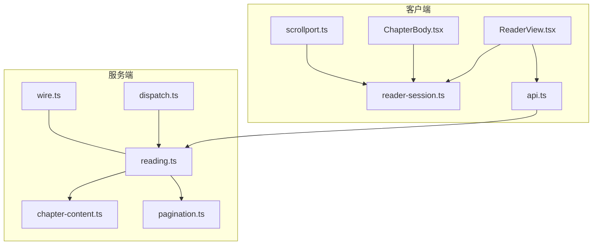
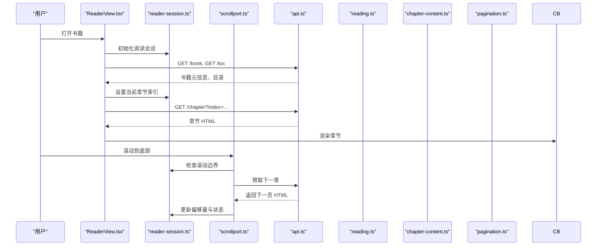
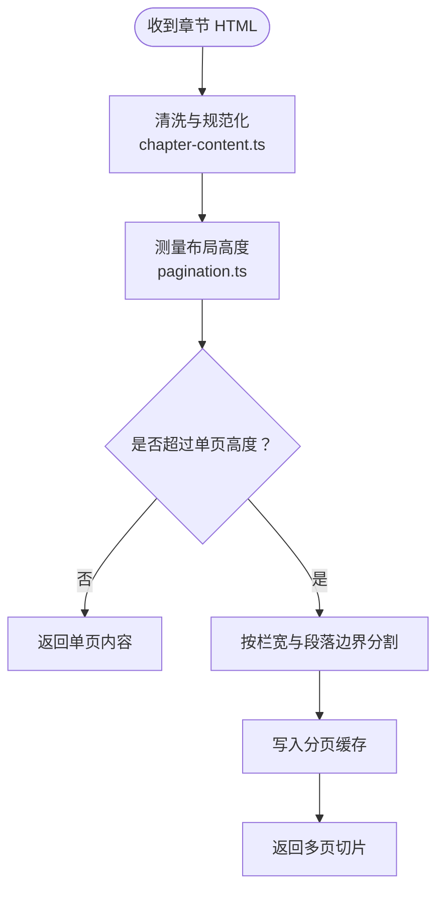
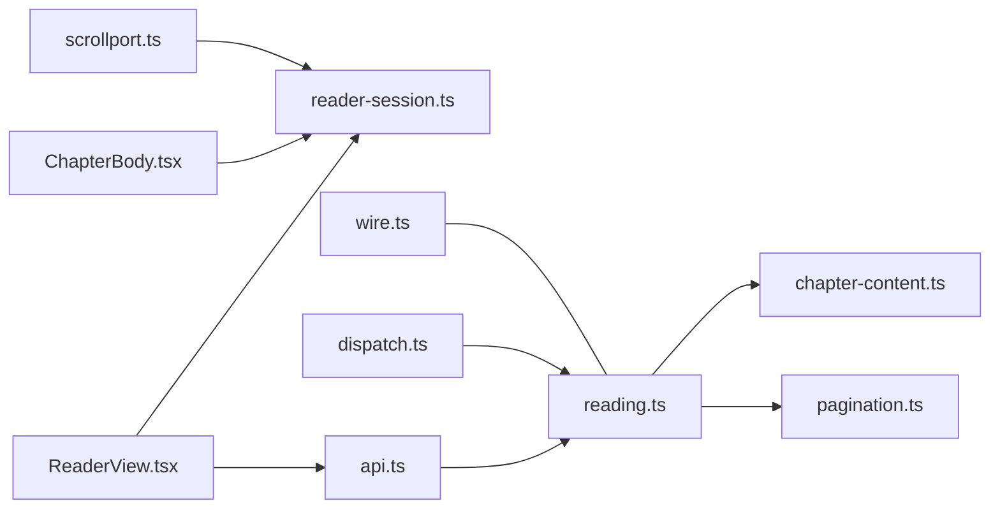
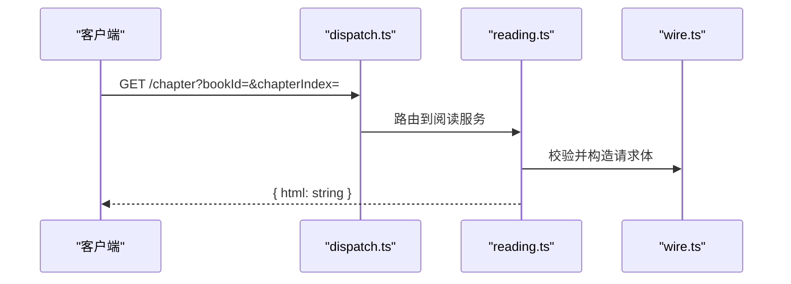

# 阅读器与排版

<cite>
**本文引用的文件**   
- [ReaderView.tsx](file://src/src/client/views/ReaderView.tsx)
- [ChapterBody.tsx](file://src/src/client/views/ChapterBody.tsx)
- [reader-session.ts](file://src/src/client/reader-session.ts)
- [scrollport.ts](file://src/src/client/scrollport.ts)
- [chapter-content.ts](file://src/src/services/chapter-content.ts)
- [pagination.ts](file://src/src/services/pagination.ts)
- [reading.ts](file://src/src/services/reading.ts)
- [api.ts](file://src/src/client/api.ts)
- [wire.ts](file://src/src/shared/wire.ts)
- [dispatch.ts](file://src/src/api/dispatch.ts)
</cite>

## 目录
1. [引言](#引言)
2. [项目结构](#项目结构)
3. [核心组件](#核心组件)
4. [架构总览](#架构总览)
5. [详细组件分析](#详细组件分析)
6. [依赖关系分析](#依赖关系分析)
7. [性能考量](#性能考量)
8. [故障排查指南](#故障排查指南)
9. [结论](#结论)
10. [附录：阅读相关 HTTP API](#附录阅读相关-http-api)

## 引言
本文面向“阅读器与排版”能力，聚焦前端阅读外壳、章节渲染、连续滚动预取、阅读会话状态、服务端内容清洗与分页，以及用户可调节的排版设置。目标是帮助读者快速理解从目录加载到正文渲染、再到自动翻页的完整链路，并给出定位问题的方法。

## 项目结构
围绕阅读器的关键代码分布在以下层次：
- 客户端视图层：ReaderView.tsx、ChapterBody.tsx、ReaderNavigation.tsx、ReaderNotes.tsx
- 客户端运行时：reader-session.ts（阅读会话）、scrollport.ts（滚动与分页）、api.ts（网络调用）
- 服务端服务层：chapter-content.ts（内容清洗）、pagination.ts（分页计算）、reading.ts（阅读接口实现）
- 共享契约与服务端调度：wire.ts（数据模型）、dispatch.ts（路由分发）

**图表来源**
- [ReaderView.tsx:1-200](file://src/src/client/views/ReaderView.tsx#L1-L200)
- [ChapterBody.tsx:1-200](file://src/src/client/views/ChapterBody.tsx#L1-L200)
- [reader-session.ts:1-200](file://src/src/client/reader-session.ts#L1-L200)
- [scrollport.ts:1-200](file://src/src/client/scrollport.ts#L1-L200)
- [chapter-content.ts:1-200](file://src/src/services/chapter-content.ts#L1-L200)
- [pagination.ts:1-200](file://src/src/services/pagination.ts#L1-L200)
- [reading.ts:1-200](file://src/src/services/reading.ts#L1-L200)
- [dispatch.ts:1-200](file://src/src/api/dispatch.ts#L1-L200)
- [wire.ts:1-200](file://src/src/shared/wire.ts#L1-L200)

**章节来源**
- [ReaderView.tsx:1-200](file://src/src/client/views/ReaderView.tsx#L1-L200)
- [reader-session.ts:1-200](file://src/src/client/reader-session.ts#L1-L200)
- [scrollport.ts:1-200](file://src/src/client/scrollport.ts#L1-L200)
- [chapter-content.ts:1-200](file://src/src/services/chapter-content.ts#L1-L200)
- [pagination.ts:1-200](file://src/src/services/pagination.ts#L1-L200)
- [reading.ts:1-200](file://src/src/services/reading.ts#L1-L200)
- [dispatch.ts:1-200](file://src/src/api/dispatch.ts#L1-L200)
- [wire.ts:1-200](file://src/src/shared/wire.ts#L1-L200)

## 核心组件
- ReaderView.tsx：阅读器外壳，负责初始化阅读会话、加载目录、监听滚动与手势、驱动章节切换、暴露阅读配置入口。
- ChapterBody.tsx：章节正文容器，渲染 HTML、注入样式、处理图片缩放与脚注锚点跳转。
- reader-session.ts：阅读会话状态机，维护当前章节索引、偏移量、是否加载中、缓存等。
- scrollport.ts：滚动边界检测与分页策略，触发自动预取下一章或上一页。
- chapter-content.ts：服务端对章节内容进行清洗、去噪、规范化。
- pagination.ts：根据 DOM 高度、字号、栏宽等计算分页位置。
- reading.ts：封装阅读相关业务逻辑，供 API 层使用。
- api.ts / dispatch.ts / wire.ts：定义客户端请求与服务端路由、数据结构契约。

**章节来源**
- [ReaderView.tsx:1-200](file://src/src/client/views/ReaderView.tsx#L1-L200)
- [ChapterBody.tsx:1-200](file://src/src/client/views/ChapterBody.tsx#L1-L200)
- [reader-session.ts:1-200](file://src/src/client/reader-session.ts#L1-L200)
- [scrollport.ts:1-200](file://src/src/client/scrollport.ts#L1-L200)
- [chapter-content.ts:1-200](file://src/src/services/chapter-content.ts#L1-L200)
- [pagination.ts:1-200](file://src/src/services/pagination.ts#L1-L200)
- [reading.ts:1-200](file://src/src/services/reading.ts#L1-L200)

## 架构总览
阅读器采用“外壳 + 渲染 + 滚动 + 服务”的分层模式：
- 外壳层（ReaderView.tsx）协调 UI、会话、滚动、API；
- 渲染层（ChapterBody.tsx）专注 DOM 与样式；
- 滚动层（scrollport.ts）提供分页与预取；
- 服务层（reading.ts + chapter-content.ts + pagination.ts）完成内容获取、清洗与分页。

**图表来源**
- [ReaderView.tsx:1-200](file://src/src/client/views/ReaderView.tsx#L1-L200)
- [reader-session.ts:1-200](file://src/src/client/reader-session.ts#L1-L200)
- [scrollport.ts:1-200](file://src/src/client/scrollport.ts#L1-L200)
- [api.ts:1-200](file://src/src/client/api.ts#L1-L200)
- [reading.ts:1-200](file://src/src/services/reading.ts#L1-L200)
- [chapter-content.ts:1-200](file://src/src/services/chapter-content.ts#L1-L200)
- [pagination.ts:1-200](file://src/src/services/pagination.ts#L1-L200)

## 详细组件分析

### ReaderView.tsx：阅读器外壳
职责要点：
- 初始化阅读会话（reader-session.ts），加载书籍元信息与目录；
- 订阅滚动事件，委托给 scrollport.ts 进行边界检测；
- 当需要加载章节时，通过 api.ts 调用 ReadingService（reading.ts）获取章节内容；
- 将章节 HTML 交给 ChapterBody.tsx 渲染；
- 管理阅读进度：当前章节索引、偏移量、加载中标志；
- 暴露排版设置入口，将用户设置写入持久化配置。

典型流程：
- 打开书籍 → 加载目录 → 选择初始章节 → 渲染正文 → 监听滚动 → 预取下一页 → 更新会话状态。

**章节来源**
- [ReaderView.tsx:1-200](file://src/src/client/views/ReaderView.tsx#L1-L200)

### ChapterBody.tsx：章节正文渲染
职责要点：
- 接收章节 HTML 字符串并插入容器；
- 在 DOM 层面注入 CSS 样式，应用主题 token、纸张颜色、字号、行距、栏宽；
- 为图片添加点击缩放、双击复位等行为；
- 解析脚注链接，阻止默认跳转，改为在页内导航到对应锚点；
- 暴露回调供 ReaderView.tsx 捕获渲染完成事件，用于后续滚动定位。

关键点：
- 样式注入时机：在 HTML 插入后执行，避免被覆盖；
- 图片缩放：基于 transform 或尺寸重算，保持比例；
- 脚注跳转：利用锚点 ID 与滚动容器 scrollTo。

**章节来源**
- [ChapterBody.tsx:1-200](file://src/src/client/views/ChapterBody.tsx#L1-L200)

### reader-session.ts：阅读会话状态
状态字段通常包括：
- currentChapterIndex：当前章节索引；
- offset：当前页内偏移量；
- isLoading：是否正在加载；
- cache：已加载章节内容的内存缓存；
- settings：当前排版设置。

对外接口：
- setChapter(index, offset?)：跳转到指定章节并可选偏移；
- nextPage()/prevPage()：按分页策略前进后退；
- markLoading()/completeLoading()：切换加载状态；
- subscribe(listener)：通知 UI 刷新。

复杂度与一致性：
- 状态变更需原子性，避免渲染中间态；
- 缓存键建议以 bookId + chapterIndex 组合，防止跨书污染；
- 更新顺序：先改状态，再触达 UI，最后触发副作用（如预取）。

**章节来源**
- [reader-session.ts:1-200](file://src/src/client/reader-session.ts#L1-L200)

### scrollport.ts：滚动边界检测与分页策略
核心逻辑：
- 监听滚动容器的滚动事件；
- 判断接近底部阈值（例如剩余高度小于阈值或百分比）；
- 若到达阈值且未处于加载中，则调用 reader-session.ts 的下一页接口；
- 支持手动翻页与自动预取共存；
- 与 reader-session.ts 的状态联动，避免重复请求。

分页策略：
- 单次滚动可能触发多次边界检测，需防抖或加锁；
- 对于长文档，优先增量加载而非整章重排；
- 结合 pagination.ts 的分页结果，维持稳定页码与偏移。

**章节来源**
- [scrollport.ts:1-200](file://src/src/client/scrollport.ts#L1-L200)

### chapter-content.ts 与 pagination.ts：服务端清洗与分页
chapter-content.ts：
- 输入：原始章节 HTML；
- 输出：清洗后的 HTML（去除广告、脚本、无关节点，统一标签规范）；
- 缓存策略：可按 bookId + chapterIndex 作为键，减少重复清洗成本。

pagination.ts：
- 输入：HTML 片段、排版参数（字号、行距、栏宽、容器高度）；
- 输出：分页位置数组或每页内容切片；
- 算法思路：测量文本高度、按栏宽截断、合并段落边界，保证分页不切分语义块。

**图表来源**
- [chapter-content.ts:1-200](file://src/src/services/chapter-content.ts#L1-L200)
- [pagination.ts:1-200](file://src/src/services/pagination.ts#L1-L200)

**章节来源**
- [chapter-content.ts:1-200](file://src/src/services/chapter-content.ts#L1-L200)
- [pagination.ts:1-200](file://src/src/services/pagination.ts#L1-L200)

## 依赖关系分析
- ReaderView.tsx 依赖 reader-session.ts 与 api.ts；
- ChapterBody.tsx 依赖 reader-session.ts 中的排版设置；
- scrollport.ts 依赖 reader-session.ts 的章节切换接口；
- reading.ts 依赖 chapter-content.ts 与 pagination.ts；
- dispatch.ts 将 HTTP 请求路由到 reading.ts；
- wire.ts 定义跨层的数据契约，如 SearchJobSnapshot、ChapterEntry。

**图表来源**
- [ReaderView.tsx:1-200](file://src/src/client/views/ReaderView.tsx#L1-L200)
- [reader-session.ts:1-200](file://src/src/client/reader-session.ts#L1-L200)
- [api.ts:1-200](file://src/src/client/api.ts#L1-L200)
- [reading.ts:1-200](file://src/src/services/reading.ts#L1-L200)
- [chapter-content.ts:1-200](file://src/src/services/chapter-content.ts#L1-L200)
- [pagination.ts:1-200](file://src/src/services/pagination.ts#L1-L200)
- [dispatch.ts:1-200](file://src/src/api/dispatch.ts#L1-L200)
- [wire.ts:1-200](file://src/src/shared/wire.ts#L1-L200)

**章节来源**
- [api.ts:1-200](file://src/src/client/api.ts#L1-L200)
- [dispatch.ts:1-200](file://src/src/api/dispatch.ts#L1-L200)
- [wire.ts:1-200](file://src/src/shared/wire.ts#L1-L200)

## 性能考量
- 滚动事件节流：避免高频触发导致过多分页与请求；
- 预取策略：提前加载下一章节，但限制并发数，防止带宽拥塞；
- 缓存复用：章节 HTML 与分页结果按 key 缓存，避免重复计算；
- DOM 操作批量化：一次性注入样式与替换节点，减少重排；
- 图片懒加载：按需加载大图，降低首屏压力。

[本节为通用指导，不直接分析具体文件]

## 故障排查指南
常见问题与定位思路：
- 目录为空
  - 检查 GET /toc 是否返回有效列表；
  - 校验 reader-session.ts 中目录映射与章节索引是否一致；
  - 确认 ReaderView.tsx 是否在加载完成后才启用跳转。
- 章节内容缺失
  - 核查 GET /chapter 参数是否正确；
  - 查看 chapter-content.ts 清洗逻辑是否误删内容；
  - 检查 pagination.ts 是否因高度测量失败而返回空页。
- 滚动预取失效
  - 确认 scrollport.ts 阈值与容器高度计算正确；
  - 检查 reader-session.ts 的 isLoading 状态是否被错误锁定；
  - 验证 api.ts 调用链是否抛出异常被吞掉。
- 主题 token 不生效
  - 检查 ChapterBody.tsx 注入样式的时机与优先级；
  - 确认排版设置是否写入持久化配置并被 reader-session.ts 读取；
  - 排查 CSS 变量命名是否与主题 token 匹配。
- 脚注跳转失败
  - 检查脚注锚点 ID 是否存在于渲染后的 DOM；
  - 确认 ChapterBody.tsx 的事件绑定是否成功；
  - 验证滚动容器 scrollTop 设置是否越界。

**章节来源**
- [ReaderView.tsx:1-200](file://src/src/client/views/ReaderView.tsx#L1-L200)
- [ChapterBody.tsx:1-200](file://src/src/client/views/ChapterBody.tsx#L1-L200)
- [reader-session.ts:1-200](file://src/src/client/reader-session.ts#L1-L200)
- [scrollport.ts:1-200](file://src/src/client/scrollport.ts#L1-L200)
- [chapter-content.ts:1-200](file://src/src/services/chapter-content.ts#L1-L200)
- [pagination.ts:1-200](file://src/src/services/pagination.ts#L1-L200)

## 结论
阅读器与排版系统由清晰的前后端分层组成：外壳协调、渲染专注、滚动负责分页、服务层保障内容与计算。理解各模块的职责边界与交互契约，有助于快速定位问题并进行扩展优化。

[本节为总结性内容，不直接分析具体文件]

## 附录：阅读相关 HTTP API
以下 API 均经由 dispatch.ts 路由至 reading.ts 实现，数据模型见 wire.ts。

- GET /book
  - 用途：获取书籍元信息。
  - 查询参数：bookId（必填）。
  - 返回结构：包含书名、作者、封面、章节总数等字段。
  - 常见错误：bookId 不存在返回 404。

- GET /toc
  - 用途：获取目录列表。
  - 查询参数：bookId（必填）。
  - 返回结构：ChapterEntry[]，每项含 index、title、url 等。
  - 常见错误：bookId 无效返回 404。

- GET /navigation
  - 用途：获取导航上下文（如前后章节指针）。
  - 查询参数：bookId、chapterIndex（必填）。
  - 返回结构：{ prev?: number, next?: number }。
  - 常见错误：chapterIndex 越界返回 400。

- GET /chapter
  - 用途：获取章节正文 HTML。
  - 查询参数：bookId、chapterIndex（必填）。
  - 返回结构：{ html: string }。
  - 服务端处理：chapter-content.ts 清洗、pagination.ts 分页。
  - 常见错误：参数缺失返回 400；内容缺失返回 404。

SearchJobSnapshot 与 ChapterEntry 的使用：
- SearchJobSnapshot：搜索结果快照，包含 job 状态、命中条目、分页信息；常用于搜索页面展示与重试。
- ChapterEntry：目录项对象，ReaderView.tsx 用其构建目录抽屉与跳章逻辑。

**图表来源**
- [dispatch.ts:1-200](file://src/src/api/dispatch.ts#L1-L200)
- [reading.ts:1-200](file://src/src/services/reading.ts#L1-L200)
- [wire.ts:1-200](file://src/src/shared/wire.ts#L1-L200)

**章节来源**
- [dispatch.ts:1-200](file://src/src/api/dispatch.ts#L1-L200)
- [reading.ts:1-200](file://src/src/services/reading.ts#L1-L200)
- [wire.ts:1-200](file://src/src/shared/wire.ts#L1-L200)