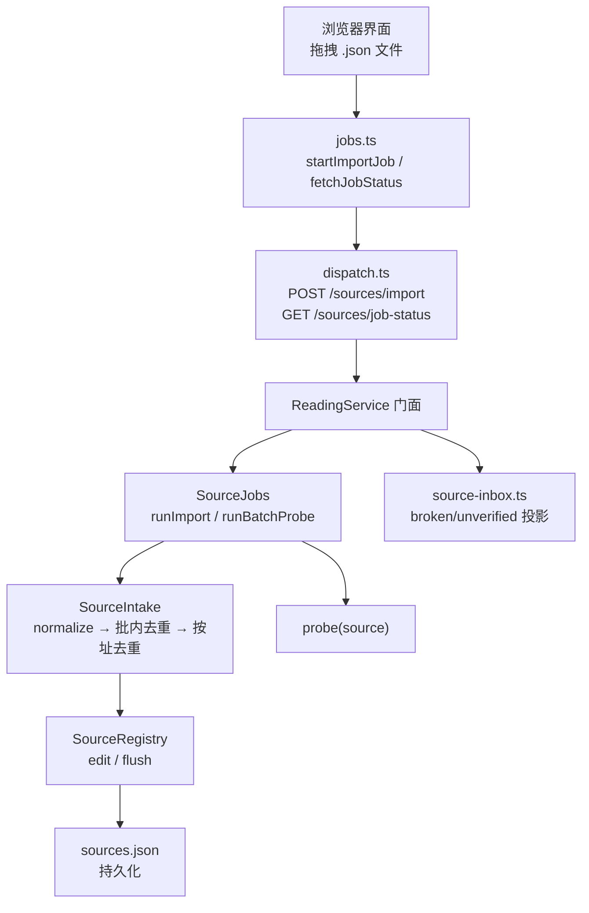
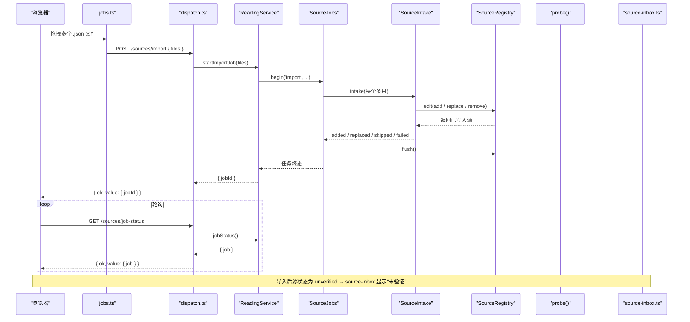
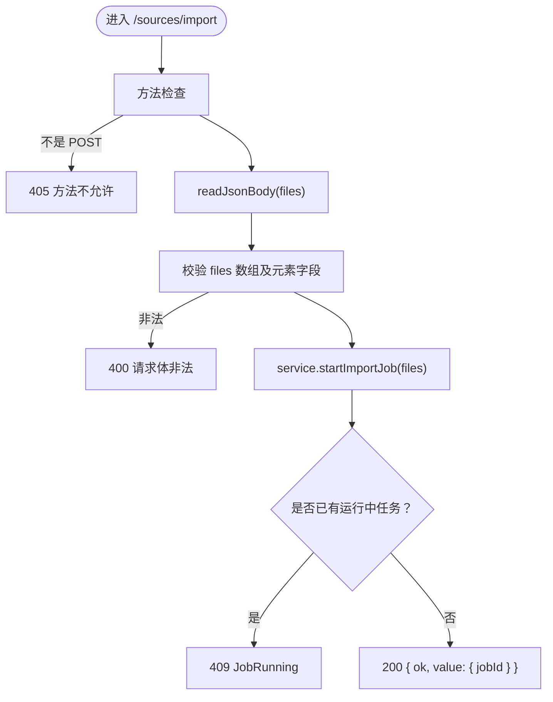
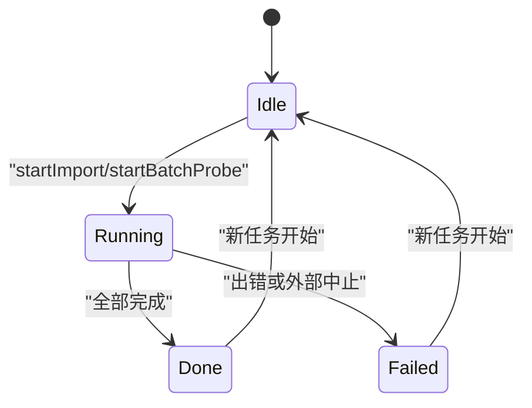
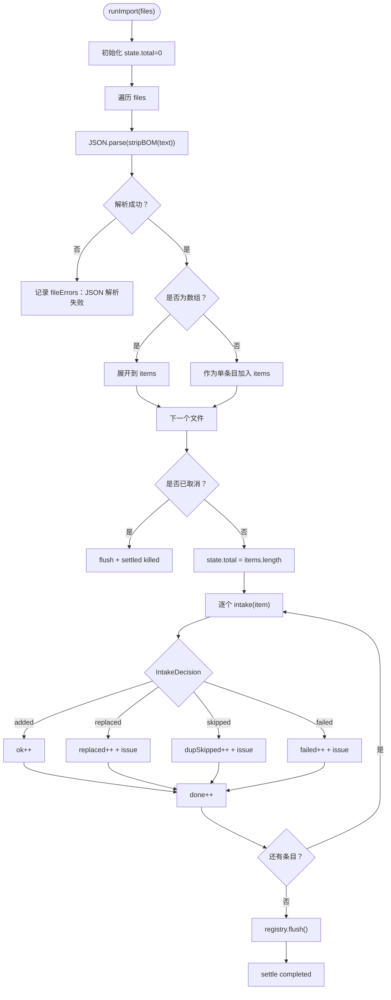
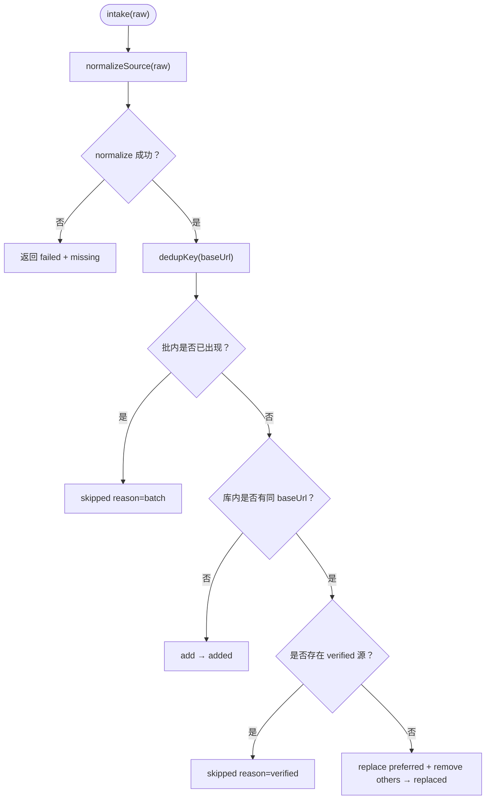
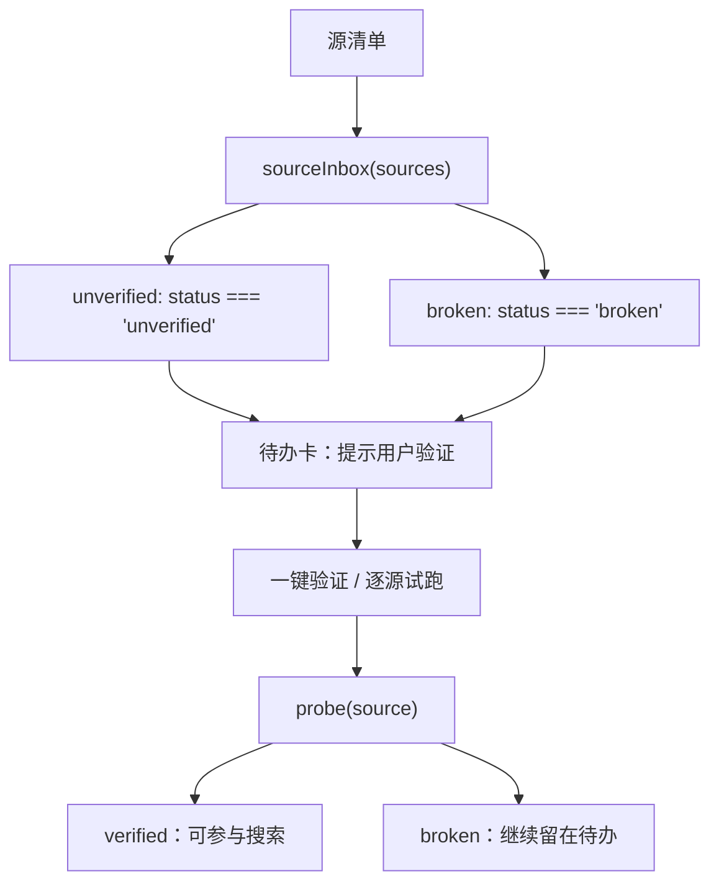
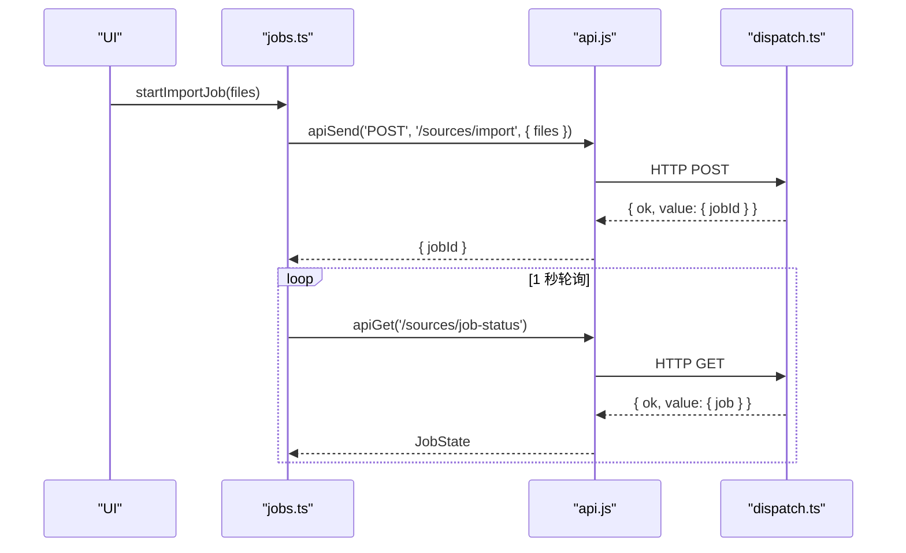
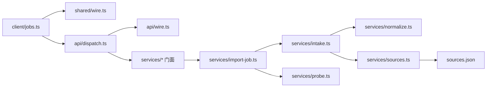

# 书源导入

<cite>
**本文引用的文件**   
- [src/services/import-job.ts](file://src/services/import-job.ts)
- [src/services/intake.ts](file://src/services/intake.ts)
- [src/api/dispatch.ts](file://src/api/dispatch.ts)
- [src/api/wire.ts](file://src/api/wire.ts)
- [src/shared/wire.ts](file://src/shared/wire.ts)
- [src/client/jobs.ts](file://src/client/jobs.ts)
- [src/client/importer.ts](file://src/client/importer.ts)
- [src/client/source-inbox.ts](file://src/client/source-inbox.ts)
- [src/client/source-inbox-ui.ts](file://src/client/source-inbox-ui.ts)
- [tests/services/sources.test.ts](file://tests/services/sources.test.ts)
</cite>

## 目录
1. [引言](#引言)
2. [项目结构](#项目结构)
3. [核心组件](#核心组件)
4. [架构总览](#架构总览)
5. [详细组件分析](#详细组件分析)
6. [依赖关系分析](#依赖关系分析)
7. [性能与并发特性](#性能与并发特性)
8. [故障排查指南](#故障排查指南)
9. [结论](#结论)

## 引言
本节面向“从浏览器拖入多个 .json 文件”这一用户动作，完整说明书源导入的后台任务流程、接口契约、状态机、重复导入覆盖策略，以及导入完成后书架侧为何仍不可见。文档既给出初学者的一次成功路径，也为有经验的开发者标注 `import-job` 内部的关键分支与边界条件。

## 项目结构
导入相关代码分布在四层：
- 浏览器端：发起多文件上传、轮询任务状态、展示待办收件箱。
- API 层：校验请求体并路由到服务门面。
- 服务层：执行导入、去重、落盘、探针验证。
- 共享契约：定义任务状态、错误信封、公开源投影等跨半类型。



**图表来源**
- [src/client/jobs.ts:1-40](file://src/client/jobs.ts#L1-L40)
- [src/api/dispatch.ts:70-120](file://src/api/dispatch.ts#L70-L120)
- [src/services/import-job.ts:1-120](file://src/services/import-job.ts#L1-L120)
- [src/services/intake.ts:1-84](file://src/services/intake.ts#L1-L84)
- [src/client/source-inbox.ts:1-69](file://src/client/source-inbox.ts#L1-L69)

**章节来源**
- [src/client/jobs.ts:1-40](file://src/client/jobs.ts#L1-L40)
- [src/api/dispatch.ts:70-120](file://src/api/dispatch.ts#L70-L120)
- [src/services/import-job.ts:1-120](file://src/services/import-job.ts#L1-L120)

## 核心组件
- `SourceJobs`：后台任务控制器，持有当前任务、宿主登记、取消协作点、计数与明细写入。
- `SourceIntake`：书源入库规则的唯一实现，负责 normalize、批内留首条去重、按 `baseUrl` 去重与替换。
- `dispatch.ts`：`/novel-api/sources/import` 与 `/novel-api/sources/job-status` 的路由入口。
- `jobs.ts`：浏览器端提交导入、轮询任务状态、缓存最近一次导入结果。
- `source-inbox.ts`：把源清单映射为“坏源”和“未验证”两类待办。
- `wire.ts`：统一错误信封、可信请求校验、JSON 读取上限。

**章节来源**
- [src/services/import-job.ts:1-120](file://src/services/import-job.ts#L1-L120)
- [src/services/intake.ts:1-84](file://src/services/intake.ts#L1-L84)
- [src/api/dispatch.ts:70-120](file://src/api/dispatch.ts#L70-L120)
- [src/client/jobs.ts:1-60](file://src/client/jobs.ts#L1-L60)
- [src/client/source-inbox.ts:1-69](file://src/client/source-inbox.ts#L1-L69)
- [src/api/wire.ts:1-135](file://src/api/wire.ts#L1-L135)

## 架构总览
导入是一个异步后台任务：浏览器只负责提交文件和轮询状态；真正的解析、去重、落盘在 Node 服务进程内完成。



**图表来源**
- [src/client/jobs.ts:1-40](file://src/client/jobs.ts#L1-L40)
- [src/api/dispatch.ts:90-120](file://src/api/dispatch.ts#L90-L120)
- [src/services/import-job.ts:80-220](file://src/services/import-job.ts#L80-L220)
- [src/services/intake.ts:30-84](file://src/services/intake.ts#L30-L84)
- [src/client/source-inbox.ts:1-30](file://src/client/source-inbox.ts#L1-L30)

## 详细组件分析

### 接口调用流程：POST /sources/import 与 GET /sources/job-status

#### POST /sources/import
- 路由守卫：仅允许 `POST`，匹配 `/novel-api/sources/import`。
- 请求体验证：
  - body 需为 `{ files: [{ name: string; text: string }, ...] }`。
  - `files` 必须是非空数组。
  - 每个元素必须是非空对象，且包含字符串类型的 `name` 与 `text`。
  - JSON 整体最大 32MB（由该路由传入的字节上限决定）。
- 成功后返回 `{ ok: true, value: { jobId: string } }`。
- 失败时通过 `writeError` 输出统一信封：`{ ok: false, error: { code, message, segment? } }`。

关键行为：
- 如果已有 import 或 batch-probe 任务处于运行中，会抛出 `JobRunningError`，最终被分类为 `job-running`，HTTP 409。
- 请求体非法返回 400。
- 非受信来源返回 403。
- 请求体超过上限返回 413。



**图表来源**
- [src/api/dispatch.ts:90-110](file://src/api/dispatch.ts#L90-L110)
- [src/api/wire.ts:90-135](file://src/api/wire.ts#L90-L135)
- [src/services/import-job.ts:60-100](file://src/services/import-job.ts#L60-L100)

**章节来源**
- [src/api/dispatch.ts:70-120](file://src/api/dispatch.ts#L70-L120)
- [src/api/wire.ts:1-135](file://src/api/wire.ts#L1-L135)
- [src/services/import-job.ts:60-100](file://src/services/import-job.ts#L60-L100)

#### GET /sources/job-status
- 路由守卫：仅允许 `GET`，匹配 `/novel-api/sources/job-status`。
- 返回值：`{ ok: true, value: { job: JobState | null } }`。
- 语义：任务结束后结果保留，直到下一个任务开始；刷新设置页或重新挂载 UI 后可恢复展示。

**章节来源**
- [src/api/dispatch.ts:110-120](file://src/api/dispatch.ts#L110-L120)
- [src/shared/wire.ts:120-160](file://src/shared/wire.ts#L120-L160)

### JobState 生命周期：pending → validating → done/failed

严格来说，当前 wire 契约中 `JobState.phase` 只有三个值：
- `running`
- `done`
- `failed`

而 `kind` 区分任务类型：
- `import`：导入任务。
- `batch-probe`：批量验证任务。

因此，更准确的表达是：



注意：
- 不存在显式 `pending` 或 `validating` 阶段；浏览器端用 `phase === 'running'` 判断“还在跑”。
- 导入任务的 `kind` 是 `import`；批量验证任务的 `kind` 是 `batch-probe`。
- 任务结束后的 `JobState` 会保留在内存中，直到下一个任务覆盖。

**图表来源**
- [src/shared/wire.ts:120-160](file://src/shared/wire.ts#L120-L160)
- [src/services/import-job.ts:80-140](file://src/services/import-job.ts#L80-L140)

**章节来源**
- [src/shared/wire.ts:120-160](file://src/shared/wire.ts#L120-L160)
- [src/services/import-job.ts:80-140](file://src/services/import-job.ts#L80-L140)

### 导入处理逻辑：读取、解析、去重、写入 SourceRegistry

`SourceJobs.runImport` 的核心流程如下：



**图表来源**
- [src/services/import-job.ts:140-220](file://src/services/import-job.ts#L140-L220)

关键点：
- 每个文件的文本先去除 BOM，再 `JSON.parse`。
- 单个文件解析失败不会中断整个导入；失败信息放入 `fileErrors`。
- 文件内容可以是对象，也可以是数组；两者都被展开成待处理条目列表。
- 每条数据交给 `SourceIntake.intake`，后者负责 normalize、去重、落库。
- 导入完成后立即 `registry.flush()`，确保磁盘结果就绪。
- 导入任务本身不执行探针验证；验证归 `batch-probe` 任务。

**章节来源**
- [src/services/import-job.ts:140-220](file://src/services/import-job.ts#L140-L220)

### 按 baseUrl 去重与重复导入覆盖策略

`SourceIntake` 是唯一掌握“如何把一条 legacy JSON 变成注册表源”的地方。其去重规则如下：

1. **批内去重**：同一 `SourceIntake` 实例的生命周期视为一个导入批次。对相同 `baseUrl`（trim 并去掉尾部斜杠），只保留第一个。
2. **库内按址去重**：
   - 如果已存在可用源，优先保留 `status === 'verified'` 的源。
   - 若已有 verified 源，则跳过新导入的同地址源。
   - 若没有可用源，则用新条替换 preferred 源，并清除同键下其余历史条目。
3. **新增**：如果没有同 `baseUrl` 的记录，直接 add。



**图表来源**
- [src/services/intake.ts:1-84](file://src/services/intake.ts#L1-L84)

补充说明：
- `baseUrl` 为空会导致 normalize 失败，从而落入 `failed`。
- 替换操作会复用旧 id，保持书架引用不断；同时把 status 重置为 `unverified`。
- 测试覆盖了 `replace` 后 status 复位、id 复用、原位保序等行为。

**章节来源**
- [src/services/intake.ts:1-84](file://src/services/intake.ts#L1-L84)
- [tests/services/sources.test.ts:120-180](file://tests/services/sources.test.ts#L120-L180)

### 待办收件箱：为什么导入完成后书架侧不可见

导入完成后，源的状态通常是 `unverified`。`source-inbox.ts` 的纯派生函数会把源清单拆分为：
- `broken`：`status === 'broken'`。
- `unverified`：`status === 'unverified'`。

这意味着：
- 刚导入的源不会直接进入“健康可见”集合，而是进入“未验证”待办。
- 用户需要点击“一键验证”或逐源试跑，让探针通过后状态变为 `verified`，才会在常规列表中正常参与搜索与书架发现。
- 如果探针失败，状态变为 `broken`，也会出现在待办的“坏源”卡片中。



**图表来源**
- [src/client/source-inbox.ts:1-30](file://src/client/source-inbox.ts#L1-L30)
- [src/services/import-job.ts:201-256](file://src/services/import-job.ts#L201-L256)

**章节来源**
- [src/client/source-inbox.ts:1-69](file://src/client/source-inbox.ts#L1-L69)
- [src/services/import-job.ts:201-256](file://src/services/import-job.ts#L201-L256)

### 浏览器端调用链：从拖拽到轮询

浏览器端使用 `jobs.ts` 暴露的 `startImportJob` 和 `fetchJobStatus`：
- `startImportJob` 通过 `apiSend` 调用 `ROUTES.sourcesImport.path`。
- `fetchJobStatus` 通过 `apiGet` 调用 `ROUTES.sourcesJobStatus.path`。
- `useJobPolling` 启动 1 秒轮询，并把结果写入模块级 store。
- 如果任务是 `import`，还会缓存到 `lastImportJob`，避免 probe 任务覆盖后丢失导入汇总。



**图表来源**
- [src/client/jobs.ts:1-60](file://src/client/jobs.ts#L1-L60)
- [src/api/dispatch.ts:90-120](file://src/api/dispatch.ts#L90-L120)

**章节来源**
- [src/client/jobs.ts:1-127](file://src/client/jobs.ts#L1-L127)

### 请求体示例与错误字段

#### 成功导入的请求体
POST `/novel-api/sources/import`：
```json
{
  "files": [
    {
      "name": "起点书源.json",
      "text": "[{ \"bookSourceName\": \"起点\", \"bookSourceUrl\": \"https://www.qidian.com\", \"ruleContent\": \"@css:#content@text\" }]"
    },
    {
      "name": "番茄书源.json",
      "text": "{ \"bookSourceName\": \"番茄\", \"bookSourceUrl\": \"https://www.fanqienovel.com\", \"ruleContent\": \"@xpath://div[@class='chapter']/text()\" }"
    }
  ]
}
```

说明：
- `files` 是数组。
- 每个元素必须有 `name` 和 `text`。
- `text` 可以是单个 JSON 对象，也可以是 JSON 数组。
- 服务端会把所有文件内容合并成一个条目序列处理。

#### 校验失败的响应
当请求体不符合 `{ files: [{ name, text }] }` 时，可能返回：
```json
{
  "ok": false,
  "error": {
    "code": "BadRequest",
    "message": "body 需为非空 { files: [{ name, text }] }"
  }
}
```

当已有任务在运行时：
```json
{
  "ok": false,
  "error": {
    "code": "JobRunning",
    "message": "已有任务在运行（导入 0/1）"
  }
}
```

#### 导入过程中的错误字段
`JobState` 包含两类错误信息：
- `issues`：每条源的导入决策明细，例如 `failed`、`dup`、`replaced`。
- `fileErrors`：文件级 JSON 解析失败，形如 `{ file: string; error: string }`。

**章节来源**
- [src/api/dispatch.ts:90-110](file://src/api/dispatch.ts#L90-L110)
- [src/shared/wire.ts:120-160](file://src/shared/wire.ts#L120-L160)
- [src/services/import-job.ts:140-220](file://src/services/import-job.ts#L140-L220)

## 依赖关系分析



耦合特征：
- `dispatch.ts` 不直接实现业务逻辑，只做路由、鉴权、参数校验和门面调用。
- `import-job.ts` 不引入 API 层，避免循环依赖；它通过构造器注入 `SourceRegistry`、`probe`、可选 `host`、`now`、`uuid`。
- `intake.ts` 是入库规则唯一实现，同步 import 与后台导入都复用。
- `wire.ts` 集中错误分类和 HTTP 映射，引擎错误、路由错误、领域错误最终都走这里。

**图表来源**
- [src/client/jobs.ts:1-40](file://src/client/jobs.ts#L1-L40)
- [src/api/dispatch.ts:1-40](file://src/api/dispatch.ts#L1-L40)
- [src/api/wire.ts:1-135](file://src/api/wire.ts#L1-L135)
- [src/services/import-job.ts:1-60](file://src/services/import-job.ts#L1-L60)
- [src/services/intake.ts:1-30](file://src/services/intake.ts#L1-L30)

**章节来源**
- [src/api/dispatch.ts:1-40](file://src/api/dispatch.ts#L1-L40)
- [src/api/wire.ts:1-135](file://src/api/wire.ts#L1-L135)
- [src/services/import-job.ts:1-60](file://src/services/import-job.ts#L1-L60)
- [src/services/intake.ts:1-30](file://src/services/intake.ts#L1-L30)

## 性能与并发特性
- 导入是串行处理每个条目：逐条 `intake`，逐条 `registry.edit`。
- 批量验证使用固定并发数 5，与 search 面保持一致。
- 注册表内部维护合并写与防抖落盘；导入任务只在结束时 `flush` 一次。
- 任务细节最多记录 200 条；超出部分不影响计数。
- 导入任务不持久化，但数据已经落盘，重启后可恢复；任务状态只在内存。

[本节为通用性能说明，不直接分析具体代码行]

## 故障排查指南

### 常见故障与修复建议

| 现象 | 可能原因 | 排查步骤 | 修复建议 |
|---|---|---|---|
| 拖入文件后立刻报错 | JSON 无法解析、`files` 格式非法 | 查看网络面板 `/sources/import` 响应中的 `error.code` 与 `error.message` | 确保 `files` 是非空数组，每个元素有 `name` 和 `text`；确认 `.json` 文本是合法 JSON |
| 导入无结果，但任务已结束 | 所有文件都解析失败 | 查看 `JobState.fileErrors` | 检查 BOM 编码、UTF-8 编码、JSON 语法；必要时先用编辑器打开验证 |
| 导入成功但书架看不到 | 源状态为 `unverified` | 查看 `JobState.counts.ok` 和源列表状态 | 点击“一键验证”或逐源试跑，等待 `status` 变为 `verified` |
| 重复导入同一个源 | `baseUrl` 与已有源相同 | 查看 `JobState.issues` 中是否有 `dup` 或 `replaced` | 如果是 verified 源会被跳过；如果是旧脏源会被替换并清其余同键条目 |
| 某个源报 `failed` | `bookSourceName`、`bookSourceUrl` 或 `ruleContent` 缺失/非法 | 查看对应 `issue.detail` | 补全必填字段；`ruleContent` 至少要有合法字符串或含非空 `content` 的对象 |
| 探针一直失败 | `ruleSearch`、`ruleToc`、`ruleContent` 语法非法 | 查看源状态 `broken` 和 `statusDetail` | 修正规则表达式；使用“逐源试跑”定位具体段 |
| 编码异常导致 type 为 unknown | legacy 数据中 `bookSourceType` 值无法识别 | 查看源 `type` 是否为 `unknown` | 导入后让探针重新判定；存量数据会在 load 时尝试收敛 |

### 初学者一次导入成功的步骤
1. 准备 `.json` 文件：
   - 每个文件可以是单个源对象，也可以是源数组。
   - 至少包含 `bookSourceName`、`bookSourceUrl`、`ruleContent`。
   - 确保 UTF-8 编码，不含非法 BOM。
2. 在书源管理界面拖入多个文件。
3. 观察任务进度：`total`、`done`、`counts.ok`、`counts.failed`、`counts.dupSkipped`、`counts.replaced`。
4. 如果出现“未验证”待办，点击“一键验证”。
5. 验证通过后，源进入健康集合，书架侧即可发现。

### 有经验开发者的关键分支
- `runImport` 的文件循环：`JSON.parse` 失败进入 `fileErrors`，不中断后续文件。
- `intake` 的四种决策：`failed`、`added`、`replaced`、`skipped`。
- `baseUrl` 去重：批内留首条；库内优先保留 verified；否则替换 preferred 并清理其余。
- 取消协作点：`cancelled(state)` 在每个任务子循环前检查，已写入数据不回滚。
- 批量验证：并发 5，源不存在静默跳过，异常记失败但不中断其他源。

**章节来源**
- [src/services/import-job.ts:140-256](file://src/services/import-job.ts#L140-L256)
- [src/services/intake.ts:30-84](file://src/services/intake.ts#L30-L84)
- [src/client/importer.ts:1-54](file://src/client/importer.ts#L1-L54)
- [src/client/source-inbox.ts:1-30](file://src/client/source-inbox.ts#L1-L30)
- [tests/services/sources.test.ts:120-200](file://tests/services/sources.test.ts#L120-L200)

## 结论
书源导入是一个“浏览器提交、服务端后台处理”的任务型接口。用户只需准备好合法的 legacy JSON 并拖入多个文件；真正的工作由 `SourceJobs` 和 `SourceIntake` 完成：解析、normalize、批内去重、按 `baseUrl` 去重、写入 `SourceRegistry`，并在任务结束时落盘。导入完成后源默认处于 `unverified`，因此书架侧不可见；必须通过探针验证才能进入健康集合。

对于初学者，重点在于保证 JSON 合法、必填字段齐全、并完成验证；对于开发者，应关注 `runImport` 的文件循环、`intake` 的去重分支、`JobState` 的生命周期、以及 `fileErrors` 与 `issues` 的区别。