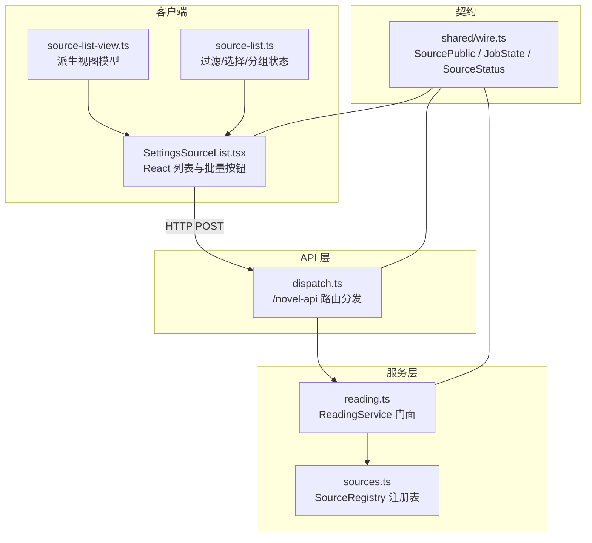
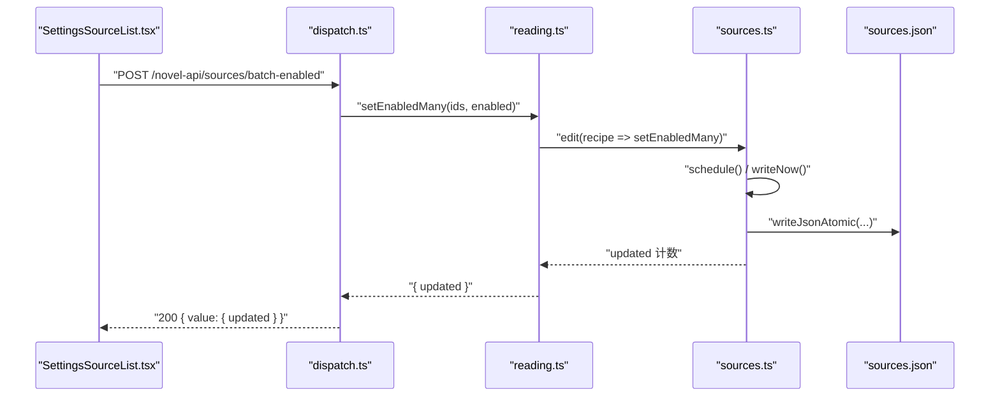
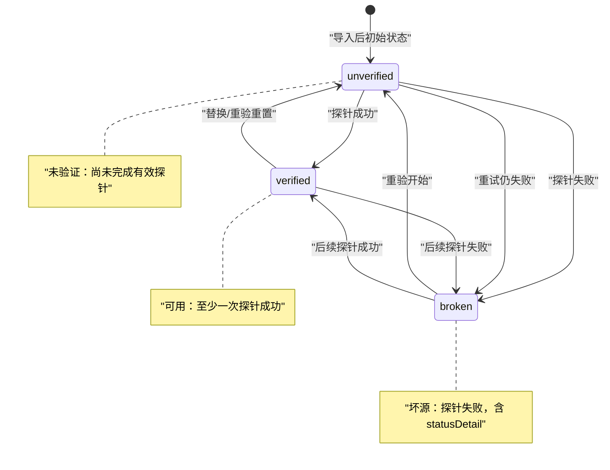
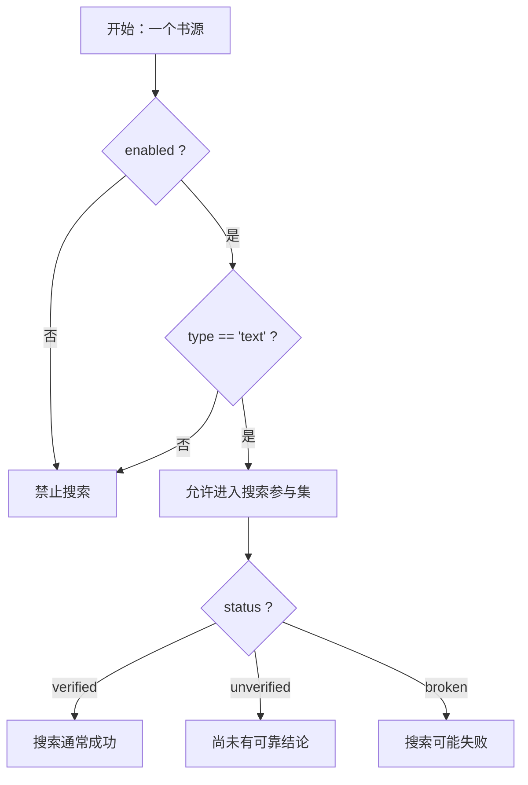
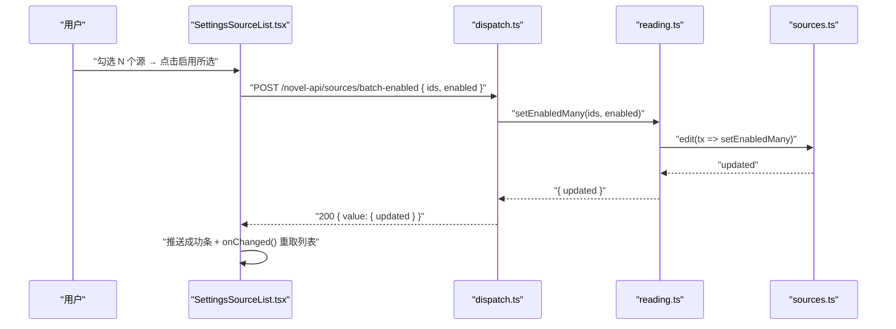
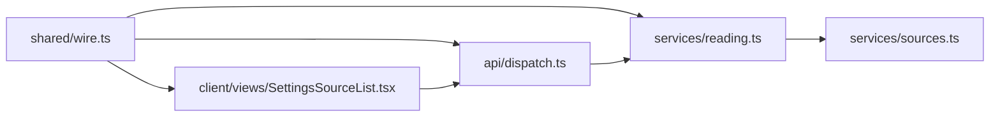

# 书源操作与状态机

<cite>
**本文引用的文件**
- [dispatch.ts](file://src/api/dispatch.ts)
- [wire.ts](file://src/shared/wire.ts)
- [sources.ts](file://src/services/sources.ts)
- [reading.ts](file://src/services/reading.ts)
- [SettingsSourceList.tsx](file://src/client/views/SettingsSourceList.tsx)
- [source-list-view.ts](file://src/client/source-list-view.ts)
- [source-list.ts](file://src/client/source-list.ts)
- [dispatch-sources.test.ts](file://tests/api/dispatch-sources.test.ts)
- [sources.test.ts](file://tests/services/sources.test.ts)
</cite>

## 目录
1. [引言](#引言)
2. [项目结构](#项目结构)
3. [核心组件](#核心组件)
4. [架构总览](#架构总览)
5. [详细组件分析](#详细组件分析)
6. [依赖关系分析](#依赖关系分析)
7. [性能注意事项](#性能注意事项)
8. [故障排查指南](#故障排查指南)
9. [结论](#结论)

## 引言
本文聚焦“书源”在 DSH 小说服务中的对外投影、状态机、UI 批量操作链路，以及 `/novel-api/sources` 相关 API。重点说明：
- 对外类型 `SourcePublic` 的字段口径，以及哪些内部字段绝不出现在 HTTP 响应中。
- 书源状态 `unverified / verified / broken` 与启用标志 `enabled` 的组合约束。
- 设置页“单源启停、删除、重新探测、批量启用/停用、批量删除”如何从 React 组件经 `dispatch.ts` 路由到 `services/sources.ts`。
- 何时禁止搜索、何时允许搜索。
- 完整 API 参考及错误示例。
- 批量 probe 并发上限与 SSE 影响。

## 项目结构
书源能力横跨四层：
- 共享契约层：`shared/wire.ts` 定义对外类型与任务形态。
- 服务门面层：`services/reading.ts` 暴露统一业务入口；`services/sources.ts` 管理书源注册表与落盘。
- API 路由层：`api/dispatch.ts` 将 HTTP 请求分发到门面动词。
- 客户端 UI 层：`client/views/SettingsSourceList.tsx` 渲染列表与批量操作；`client/source-list-view.ts`、`client/source-list.ts` 负责派生视图与过滤/选择状态。



**图表来源**
- [SettingsSourceList.tsx:1-120](file://src/client/views/SettingsSourceList.tsx#L1-L120)
- [source-list-view.ts:1-84](file://src/client/source-list-view.ts#L1-L84)
- [source-list.ts:1-87](file://src/client/source-list.ts#L1-L87)
- [dispatch.ts:1-200](file://src/api/dispatch.ts#L1-L200)
- [reading.ts:1-260](file://src/services/reading.ts#L1-L260)
- [sources.ts:1-200](file://src/services/sources.ts#L1-L200)
- [wire.ts:1-120](file://src/shared/wire.ts#L1-L120)

**章节来源**
- [dispatch.ts:1-200](file://src/api/dispatch.ts#L1-L200)
- [reading.ts:1-260](file://src/services/reading.ts#L1-L260)
- [sources.ts:1-200](file://src/services/sources.ts#L1-L200)
- [wire.ts:1-120](file://src/shared/wire.ts#L1-L120)
- [SettingsSourceList.tsx:1-120](file://src/client/views/SettingsSourceList.tsx#L1-L120)
- [source-list-view.ts:1-84](file://src/client/source-list-view.ts#L1-L84)
- [source-list.ts:1-87](file://src/client/source-list.ts#L1-L87)

## 核心组件
- `SourcePublic`：书源对外投影，不含原始配置、规则或凭据。
- `SourceRegistry`：加载、变更、只读投影与合并落盘。
- `ReadingService`：面向 API/UI/tools 的统一业务门面，封装导入、探针、搜索、书架等。
- `dispatch.ts`：`/novel-api` 前缀下的 HTTP 路由分发器。
- `SettingsSourceList.tsx`：书源设置页面主视图，承载单行操作与批量操作。

**章节来源**
- [wire.ts:1-120](file://src/shared/wire.ts#L1-L120)
- [sources.ts:1-200](file://src/services/sources.ts#L1-L200)
- [reading.ts:1-260](file://src/services/reading.ts#L1-L260)
- [dispatch.ts:1-200](file://src/api/dispatch.ts#L1-L200)
- [SettingsSourceList.tsx:1-120](file://src/client/views/SettingsSourceList.tsx#L1-L120)

## 架构总览
书源数据流自下而上：
1. 持久化 `sources.json` 由 `SourceRegistry.load` 加载，并做存量归一（默认 enabled、type、ruleDetailInit、headerRule、bookUrlPattern、静态头、分类/字数、groups、name 图标剥离）。
2. 对外查询走 `ReadingService.listPublicSources()` → `SourceRegistry.toPublic()`，仅暴露布尔态与公开字段。
3. 写操作统一通过 `edit(recipe)` 原子入口，按阈值或尾沿防抖合并落盘。
4. API 路由只接收校验后的参数，调用门面动词，再返回 wire 契约形状。



**图表来源**
- [SettingsSourceList.tsx:120-220](file://src/client/views/SettingsSourceList.tsx#L120-L220)
- [dispatch.ts:120-190](file://src/api/dispatch.ts#L120-L190)
- [reading.ts:200-260](file://src/services/reading.ts#L200-L260)
- [sources.ts:80-160](file://src/services/sources.ts#L80-L160)

**章节来源**
- [dispatch.ts:100-200](file://src/api/dispatch.ts#L100-L200)
- [reading.ts:180-260](file://src/services/reading.ts#L180-L260)
- [sources.ts:60-160](file://src/services/sources.ts#L60-L160)

## 详细组件分析

### 对外投影 SourcePublic
`SourcePublic` 是跨半契约的唯一真相，用于 GET `/sources` 与 UI 展示。它明确排除三类敏感/内部信息：
- 不返回 `raw`：原始书源 JSON。
- 不返回 `rules`：解析后的规则对象。
- 不返回 `auth`：凭据与登录状态详情。

公开字段口径如下：

| 字段 | 类型 | 用途与约束 |
|---|---|---|
| `id` | `string` | 书源唯一标识，来自持久化记录。 |
| `name` | `string` | 显示名称；加载时可能剥离装饰图标。 |
| `baseUrl` | `string` | 书源根地址。 |
| `enabled` | `boolean` | 是否参与聚合搜索；未显式声明时归一为 `true`。 |
| `groups` | `string[]` | 分组数组；加载时对旧格式迁移拆分。 |
| `type` | `SourceContentKind` | 内容形态，取值来自 `bookSourceType`：`text / image / audio / file / unknown`。非文本源在本插件不参与搜索。 |
| `status` | `SourceStatus` | 探针结果：`unverified / verified / broken`。 |
| `statusDetail` | `string \| undefined` | 探针失败原因；`verified` 时清空。 |
| `importedAt` | `number` | 导入时间戳。 |
| `lastProbedAt` | `number \| undefined` | 最近一次探针时间。 |
| `hasHeader` | `boolean` | 是否声明有效 header 规则。 |
| `hasAuth` | `boolean` | 是否已录入凭据。 |
| `authExpired` | `boolean` | 凭据是否过期。 |
| `hasLoginUrl` | `boolean` | 是否声明 `loginUrl`；UI 据此决定是否提供“去登录”入口。 |

注意：`ruleSearch`、`ruleToc`、`ruleContent`、`loginUrl` 属于内部规则/原始配置范畴，不会出现在 `SourcePublic` 中。它们的作用与约束如下：

| 字段 | 所在形态 | 用途 | 约束 |
|---|---|---|---|
| `ruleSearch` | 内部 `rules` | 搜索结果解析规则。 | 缺失或求值失败会导致搜索面报错，但不会直接决定 `enabled`。 |
| `ruleToc` | 内部 `rules` | 目录页 URL 模板或规则。 | 缺失时回退详情页地址；若仍无法解析目录，会表现为 EmptyToc 类问题。 |
| `ruleContent` | 内部 `rules` | 正文内容提取规则。 | 缺失或求值失败会使详情抓取失败，但不影响“可搜索”。 |
| `loginUrl` | 原始 `raw` 或派生规则 | 登录入口地址。 | 存在即令 `hasLoginUrl=true`；不存在时 UI 不展示登录引导。 |

**章节来源**
- [wire.ts:1-120](file://src/shared/wire.ts#L1-L120)
- [sources.ts:1-60](file://src/services/sources.ts#L1-L60)
- [sources.test.ts:1-120](file://tests/services/sources.test.ts#L1-L120)

### 书源状态机
书源有两个正交维度：
- 探针状态：`unverified → verified / broken`。
- 启用标志：`enabled` 与 `disabled`。



**图表来源**
- [wire.ts:1-120](file://src/shared/wire.ts#L1-L120)
- [sources.test.ts:1-120](file://tests/services/sources.test.ts#L1-L120)
- [dispatch-sources.test.ts:1-120](file://tests/api/dispatch-sources.test.ts#L1-L120)

#### 启用维与状态维的组合语义
- `enabled=false`：**禁用**。不参与聚合搜索，但探针仍可运行；探针结果仍会写入 `status`。
- `enabled=true`：**启用**。可参与聚合搜索，前提是内容形态为 `text`。
- `type='unknown'`：**编码读不懂**。即使 `enabled=true`，也不参与搜索；该形态不打 `broken`，留给下一次探针重新判定。
- `type` 为非文本（如 `image / audio / file`）：本插件当前只支持文本源，因此这类源不参与搜索。

综合判断搜索参与集的逻辑可表述为：
- 必须 `enabled=true`。
- 必须 `type === 'text'`。
- 不需要 `status === 'verified'`；`unverified` 与 `broken` 也可参与搜索，只是搜索本身可能失败并产生组级错误。



**图表来源**
- [wire.ts:1-120](file://src/shared/wire.ts#L1-L120)
- [sources.ts:1-60](file://src/services/sources.ts#L1-L60)
- [reading.ts:1-120](file://src/services/reading.ts#L1-L120)

**章节来源**
- [wire.ts:1-120](file://src/shared/wire.ts#L1-L120)
- [sources.ts:1-60](file://src/services/sources.ts#L1-L60)
- [reading.ts:1-120](file://src/services/reading.ts#L1-L120)

### UI 中的单源与批量操作

#### 单源操作
- **启用/禁用**：点击行内开关，乐观更新本地状态，立即 POST `paramRoutes.sourceEnabled(id)`，成功后刷新源列表；失败则回滚并提示错误。
- **删除**：进入编辑态后触发确认模态，提交 `DELETE /sources/:id`；失败保留模态并全局提示。
- **重新探测**：点击“验证/重验”，调用后台验证任务；在途任务期间批量写口禁用。

#### 批量操作
- **批量启用/停用**：勾选若干源后点击“启用所选”或“停用所选”，POST `ROUTES.sourcesBatchEnabled`，传入 `{ ids, enabled }`；服务端静默跳过未知 id，重复 id 幂等，返回 `updated`。
- **批量删除**：点击“删除所选”，POST `ROUTES.sourcesBatchDelete`，传入 `{ ids }`；未知 id 静默跳过，重复 id 幂等，返回 `removed`。
- **批量验证**：点击“验证所选”，调用 `startSourceVerification(selection, deps)`，走后台任务通道，不走本 helper。



**图表来源**
- [SettingsSourceList.tsx:120-220](file://src/client/views/SettingsSourceList.tsx#L120-L220)
- [dispatch.ts:120-190](file://src/api/dispatch.ts#L120-L190)
- [reading.ts:200-260](file://src/services/reading.ts#L200-L260)

**章节来源**
- [SettingsSourceList.tsx:120-220](file://src/client/views/SettingsSourceList.tsx#L120-L220)
- [source-list-view.ts:1-84](file://src/client/source-list-view.ts#L1-L84)
- [source-list.ts:1-87](file://src/client/source-list.ts#L1-L87)
- [dispatch.ts:100-200](file://src/api/dispatch.ts#L100-L200)
- [reading.ts:200-260](file://src/services/reading.ts#L200-L260)

### API 参考

所有端点以 `/novel-api` 为前缀，由 `createApiHandler` 统一处理可信性、前缀与路径分发。

| 方法 | 路径 | 请求体 | 成功响应 | 错误场景 |
|---|---|---|---|---|
| `GET` | `/novel-api/sources` | 无 | `200 { value: SourcePublic[] }` | 非受信请求 403；未知路由 404。 |
| `POST` | `/novel-api/sources/:id/probe` | 无 | `200 { value: ProbeResult }`，同时更新源状态 | 未知 id 抛出 `SourceNotFoundError` → 404。 |
| `POST` | `/novel-api/sources/batch-probe` | `{ ids: string[] }` | `200 { value: JobState }`，后台执行 | `ids` 为空或非字符串数组 → 400；已有运行中任务 → 409。 |
| `POST` | `/novel-api/sources/:id/enabled` | `{ enabled: boolean }` | `200 { value: { enabled } }` | `enabled` 非布尔 → 400；未知 id → 404。 |
| `POST` | `/novel-api/sources/batch-enabled` | `{ ids: string[], enabled: boolean }` | `200 { value: { updated: number } }` | `ids` 非法或缺失 → 400；`enabled` 非布尔 → 400。 |
| `DELETE` | `/novel-api/sources/:id` | 无 | `200 { value: { removed: boolean } }` | 未知 id 通常返回 false；路由层对删除未使用 404 分支。 |
| `POST` | `/novel-api/sources/batch-delete` | `{ ids: string[] }` | `200 { value: { removed: number } }` | `ids` 为空或非字符串数组 → 400。 |

#### 成功响应示例
- `GET /sources`：
  ```json
  {
    "value": [
      {
        "id": "a1b2c3",
        "name": "某书源",
        "baseUrl": "https://example.com",
        "enabled": true,
        "groups": ["小说"],
        "type": "text",
        "status": "verified",
        "importedAt": 1700000000000,
        "lastProbedAt": 1700000000000,
        "hasHeader": false,
        "hasAuth": false,
        "authExpired": false,
        "hasLoginUrl": false
      }
    ]
  }
  ```
- `POST /sources/:id/enabled`：
  ```json
  {
    "value": {
      "enabled": false
    }
  }
  ```
- `POST /sources/batch-enabled`：
  ```json
  {
    "value": {
      "updated": 3
    }
  }
  ```
- `POST /sources/batch-probe`：
  ```json
  {
    "value": {
      "id": "job-uuid",
      "kind": "batch-probe",
      "phase": "running",
      "total": 5,
      "done": 0,
      "counts": { "ok": 0, "failed": 0, "dupSkipped": 0, "replaced": 0 },
      "issues": [],
      "fileErrors": [],
      "startedAt": 1700000000000
    }
  }
  ```

#### 错误响应示例
- 404 未找到：
  ```json
  {
    "error": {
      "code": "NotFound",
      "message": "源不存在"
    }
  }
  ```
- 400 参数错误：
  ```json
  {
    "error": {
      "code": "BadRequest",
      "message": "body 需为非空 { ids: string[] }"
    }
  }
  ```
- 409 任务冲突：
  ```json
  {
    "error": {
      "code": "JobRunning",
      "message": "已有运行中任务"
    }
  }
  ```
- 405 方法不允许：
  ```json
  {
    "error": {
      "code": "MethodNotAllowed",
      "message": "方法不允许: POST /novel-api/sources（导入走 POST /sources/import）"
    }
  }
  ```

#### 规则校验失败与搜索阶段
- 规则校验失败发生在探针阶段或搜索阶段，而不是启用开关阶段。
- `ProbeResult.error.code` 包含引擎与抓取侧错误分类，例如 `UnsupportedRuleError`、`RuleEvalError`、`JsSandboxError`、`FetchError`、`DecodeError`、`RuleMissing`。
- 单个源规则失败不会阻止其他源搜索；失败信息落在对应 `SearchGroup.error` 中。

**章节来源**
- [dispatch.ts:1-200](file://src/api/dispatch.ts#L1-L200)
- [wire.ts:1-160](file://src/shared/wire.ts#L1-L160)
- [dispatch-sources.test.ts:1-227](file://tests/api/dispatch-sources.test.ts#L1-L227)

## 依赖关系分析
- `dispatch.ts` 依赖 `ReadingService` 作为唯一业务入口，避免路由层手写持久化或规则逻辑。
- `reading.ts` 组合 `SourceRegistry`、`Shelf`、`PageCache`、`Fetcher`、`SourceJobs`、`SearchJobs`、`LocalBooks`。
- `sources.ts` 的 `SourceRegistry` 是唯一持有 `NovelSource[]` 的对象，并通过 `toPublic` 产出 `SourcePublic`。
- `wire.ts` 被 Node 端与浏览器端共同引用，构成构建期纯类型契约。
- UI 层通过 `dispatch.ts` 暴露的路由常量发起请求，不直接构造业务对象。



**图表来源**
- [wire.ts:1-160](file://src/shared/wire.ts#L1-L160)
- [dispatch.ts:1-200](file://src/api/dispatch.ts#L1-L200)
- [reading.ts:1-260](file://src/services/reading.ts#L1-L260)
- [sources.ts:1-200](file://src/services/sources.ts#L1-L200)
- [SettingsSourceList.tsx:1-120](file://src/client/views/SettingsSourceList.tsx#L1-L120)

**章节来源**
- [dispatch.ts:1-200](file://src/api/dispatch.ts#L1-L200)
- [reading.ts:1-260](file://src/services/reading.ts#L1-L260)
- [sources.ts:1-200](file://src/services/sources.ts#L1-L200)
- [wire.ts:1-160](file://src/shared/wire.ts#L1-L160)

## 性能注意事项

### 批量 probe 的并发上限
- 批量验证通过后台任务执行，其探针并发复用阅读面的搜索并发配置。
- 默认并发为 5；构造函数对 `searchParallel` 进行正整数校验，小于 1 直接抛错。
- 因此批量 probe 的实际并发上限等于 `DEFAULT_SEARCH_PARALLEL` 或传入的 `searchParallel`，不应假设它为无限并行。

### 失败源折叠对 SSE 的影响
- 搜索进度通过 SSE 推送；每个源失败只写自身组的 `error`，不拖垮整轮搜索。
- 但大量失败源会增加每帧快照的数据量，因为失败组仍会进入 `added` 增量。
- 客户端应基于 `since` 游标合并增量，而不是每次全量重拉；断线重连也依赖同一游标语义。
- 批量 probe 与搜索共用 fetcher 与超时预算，探针失败过多会放大网络与 JS 沙箱错误数量，但不改变 SSE 的基本收敛机制。

### 其他性能要点
- `SourceRegistry.edit` 采用阈值合并（每 20 次变更强制写一次）与 100ms 尾沿防抖，避免频繁全量重写 `sources.json`。
- 批量启用/停用与批量删除都走单次 `edit`，减少磁盘写次数。
- 批量 probe 是异步任务，UI 应通过 job-status 轮询或任务回调观察进度，不要在同步响应里等待全部源探测结束。

**章节来源**
- [reading.ts:1-120](file://src/services/reading.ts#L1-L120)
- [sources.ts:60-160](file://src/services/sources.ts#L60-L160)
- [dispatch.ts:150-200](file://src/api/dispatch.ts#L150-L200)

## 故障排查指南

| 现象 | 可能原因 | 定位位置 | 处理建议 |
|---|---|---|---|
| `GET /sources` 返回 404 | 请求路径不以 `/novel-api` 开头，或路由未匹配 | `dispatch.ts` | 检查前端请求前缀与路径拼接。 |
| `POST /sources/:id/enabled` 返回 404 | 指定 id 不存在 | `dispatch.ts` 调用 `service.setEnabled`，未知 id 抛出 `SourceNotFoundError` | 先 GET `/sources` 确认 id，或重启服务后重试。 |
| `POST /sources/batch-enabled` 返回 400 | `ids` 为空、非数组或元素非字符串；`enabled` 非布尔 | `dispatch.ts` 参数校验 | 打印实际 body，确保字段名与类型正确。 |
| `POST /sources/batch-probe` 返回 409 | 已有运行中任务 | `dispatch.ts` 与任务槽保护 | 等待现有任务完成后再提交新任务。 |
| 探针结果为 `broken` | 规则求值失败、抓取失败、解码失败、规则缺失 | `probeSource` 与 `ProbeResult.error` | 查看 `statusDetail` 与 `error.code`，修正对应规则。 |
| 搜索能启动但某个源一直失败 | 该源 `status=broken` 或规则不完整 | 搜索分组 `SearchGroup.error` | 单独对该源执行 probe，修复后重新验证。 |
| 启用开关点击后列表未更新 | 前端只更新本地状态但未调用 `onChanged` | `SettingsSourceList.tsx` | 确认成功回调中调用了 `onChanged()` 重新 GET `/sources`。 |
| 批量操作成功但计数异常 | 传入了未知 id 或重复 id | 服务端返回 `updated` / `removed` | 以返回值为准，不要直接用前端选中数推断结果。 |

**章节来源**
- [dispatch.ts:1-200](file://src/api/dispatch.ts#L1-L200)
- [dispatch-sources.test.ts:1-227](file://tests/api/dispatch-sources.test.ts#L1-L227)
- [sources.test.ts:1-200](file://tests/services/sources.test.ts#L1-L200)
- [SettingsSourceList.tsx:120-220](file://src/client/views/SettingsSourceList.tsx#L120-L220)

## 结论
- `SourcePublic` 是书源对外契约的核心：它暴露身份、启用态、分组、内容形态、探针状态与布尔态提示，但绝不泄露 `raw`、`rules`、`auth`。
- 书源状态机以 `unverified → verified / broken` 为主轴，`enabled` 是与之正交的搜索参与开关。
- UI 的单源与批量操作最终都落到 `dispatch.ts` 路由与 `ReadingService` 门面动词；写操作通过 `SourceRegistry.edit` 合并落盘。
- 搜索允许进入参与集的条件是 `enabled=true` 且 `type==='text'`，不要求 `status==='verified'`。
- API 设计以 wire 契约为中心，错误响应统一携带 `code` 与 `message`，便于客户端区分 400、404、405、409 等场景。
- 批量 probe 受搜索并发上限控制，失败源会进入 SSE 增量，客户端应基于游标合并而非全量重拉。