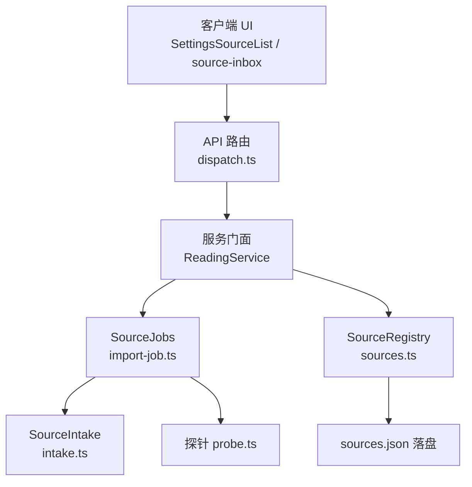
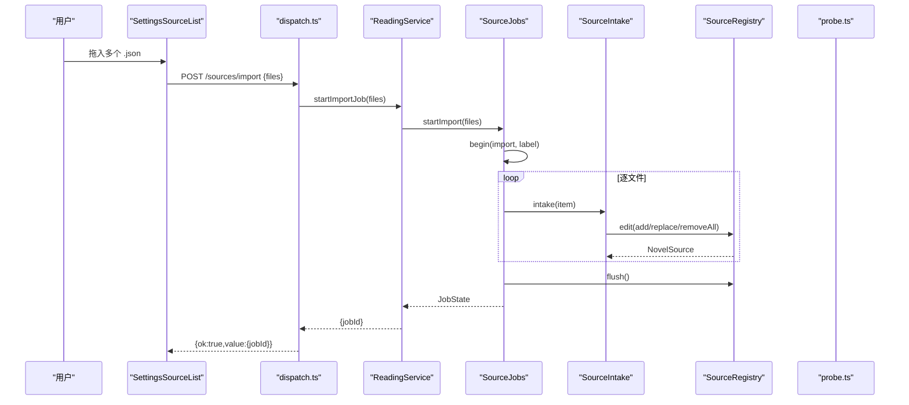
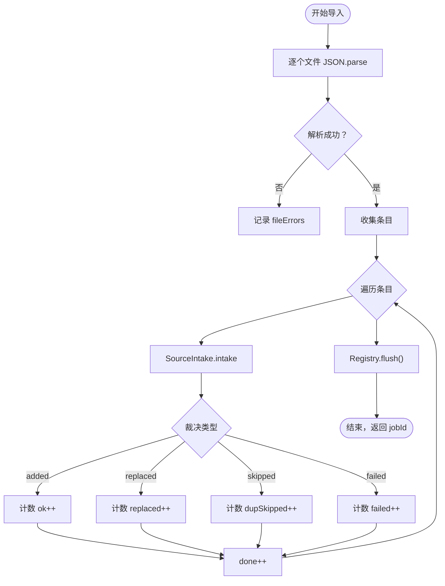
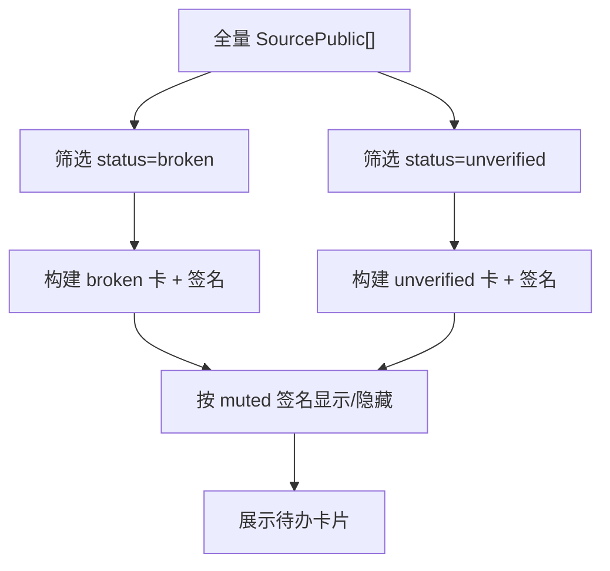
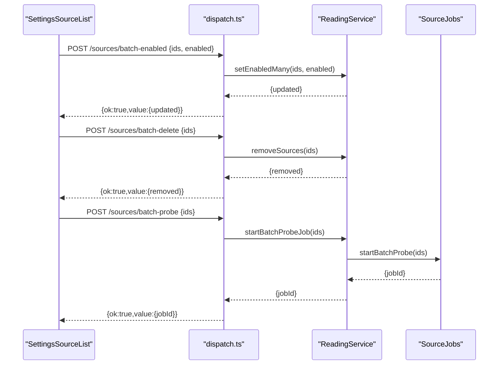
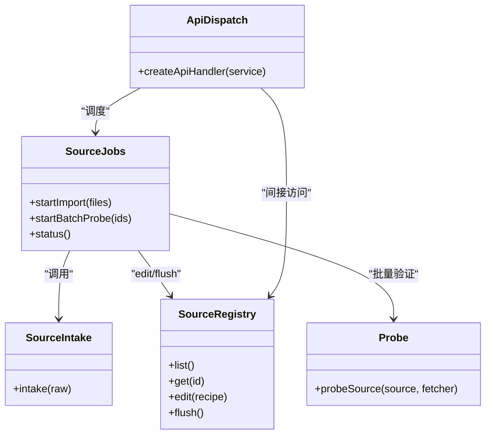

# 书源管理

<cite>
**本文引用的文件**
- [dispatch.ts](file://src/api/dispatch.ts)
- [wire.ts](file://src/api/wire.ts)
- [import-job.ts](file://src/services/import-job.ts)
- [intake.ts](file://src/services/intake.ts)
- [sources.ts](file://src/services/sources.ts)
- [probe.ts](file://src/services/probe.ts)
- [wire.ts（共享契约）](file://src/shared/wire.ts)
- [source-inbox.ts](file://src/client/source-inbox.ts)
- [source-inbox-ui.ts](file://src/client/source-inbox-ui.ts)
- [source-list.ts](file://src/client/source-list.ts)
- [SettingsSourceList.tsx](file://src/client/views/SettingsSourceList.tsx)
</cite>

## 目录
1. [引言](#引言)
2. [项目结构](#项目结构)
3. [核心组件](#核心组件)
4. [架构总览](#架构总览)
5. [详细组件分析](#详细组件分析)
6. [依赖关系分析](#依赖关系分析)
7. [性能与可靠性](#性能与可靠性)
8. [故障诊断指南](#故障诊断指南)
9. [结论](#结论)

## 引言
本节文档聚焦“书源管理”模块，覆盖 legacy JSON 书源的导入流程、后台任务模型、待办收件箱、源列表批量操作、对外投影 SourcePublic、API 调用约定，以及认证扩展点 cookie/loginUrl 的执行时机与安全约束。目标是让读者既能理解数据如何从拖入的 .json 文件进入 SourceRegistry 与 Shelf 可见列表，也能在出现 404、编码错误、JSON 解析失败或规则语法非法时快速定位根因。

## 项目结构
书源管理横跨 API 层、服务层与客户端 UI：
- API 层：`/novel-api/sources/*` 路由分发与统一错误信封。
- 服务层：SourceRegistry（注册表与落盘）、SourceIntake（入库去重）、ImportJobs（导入/批量验证任务）、Probe（搜索面探针）。
- 客户端：SourceInbox（坏源/未验证派生）、SourceList（过滤与选择）、SettingsSourceList（批量启停/删除/验证 UI）。

图表来源
- [dispatch.ts:1-120](file://src/api/dispatch.ts#L1-L120)
- [import-job.ts:1-120](file://src/services/import-job.ts#L1-L120)
- [sources.ts:1-120](file://src/services/sources.ts#L1-L120)
- [intake.ts:1-84](file://src/services/intake.ts#L1-L84)
- [probe.ts:1-71](file://src/services/probe.ts#L1-L71)

章节来源
- [dispatch.ts:1-120](file://src/api/dispatch.ts#L1-L120)
- [import-job.ts:1-120](file://src/services/import-job.ts#L1-L120)
- [sources.ts:1-120](file://src/services/sources.ts#L1-L120)

## 核心组件
- SourceRegistry：加载 sources.json、归一化存量、edit 原子写、合并落盘、公开只读 list/get。
- SourceIntake：normalize → 批内留首条 → baseUrl 去重（同地址保留 verified 优先；否则替换 preferred 并清其余脏条目）。
- SourceJobs：单任务槽，支持 import 与 batch-probe，状态通过宿主 ctx.jobs 暴露给 UI。
- Probe：以 search-face 发起真实搜索请求，按 ruleBookName 等规则判定 verified/broken。
- SourceInbox：纯函数派生 broken/unverified 集合及忽略卡签名。
- SettingsSourceList：批量启用/禁用/删除/重新探测 UI，连接 API 与任务提交口。

章节来源
- [sources.ts:1-200](file://src/services/sources.ts#L1-L200)
- [intake.ts:1-84](file://src/services/intake.ts#L1-L84)
- [import-job.ts:1-200](file://src/services/import-job.ts#L1-L200)
- [probe.ts:1-71](file://src/services/probe.ts#L1-L71)
- [source-inbox.ts:1-69](file://src/client/source-inbox.ts#L1-L69)
- [SettingsSourceList.tsx:1-200](file://src/client/views/SettingsSourceList.tsx#L1-L200)

## 架构总览
legacy JSON 书源导入的整体路径如下：

图表来源
- [dispatch.ts:80-140](file://src/api/dispatch.ts#L80-L140)
- [import-job.ts:60-180](file://src/services/import-job.ts#L60-L180)
- [intake.ts:1-84](file://src/services/intake.ts#L1-L84)
- [sources.ts:120-220](file://src/services/sources.ts#L120-L220)

## 详细组件分析

### Legacy JSON 导入流程
导入入口是 `POST /sources/import`，body 为 `{ files: [{ name, text }] }`。每个文件的 text 被当作 UTF-8 文本进行 JSON.parse；数组展开为多条，对象作为单条。随后交给 SourceIntake.intake：

- normalizeSource：校验 bookSourceType 是否为文本；缺失必填字段记 missing，生成 NormalizeResult。
- 批内去重：同一 baseUrl 在单次 ImportFile 批次中仅保留第一条。
- 库内去重：同 baseUrl 已有 verified 则跳过；否则用新规则替换 preferred，并清理同键其余脏条目。
- 写入 SourceRegistry.edit：add/replace/removeAll 走合并落盘；任务结束前 flush 确保落盘。
- 结果统计：ok/dupSkipped/replaced/failed 计入 JobState.counts；issues/fileErrors 记录明细。

注意：导入阶段不执行网络探针；验证由独立的 batch-probe 任务完成。

图表来源
- [import-job.ts:120-200](file://src/services/import-job.ts#L120-L200)
- [intake.ts:1-84](file://src/services/intake.ts#L1-L84)

章节来源
- [dispatch.ts:80-140](file://src/api/dispatch.ts#L80-L140)
- [import-job.ts:1-200](file://src/services/import-job.ts#L1-L200)
- [intake.ts:1-84](file://src/services/intake.ts#L1-L84)
- [sources.ts:120-220](file://src/services/sources.ts#L120-L220)

### 待办收件箱（source-inbox）
SourceInbox 将全量 SourcePublic 派生为两类任务：
- broken：status === 'broken'，处置动作是批量重验。
- unverified：status === 'unverified'，处置动作是一键验证。

忽略机制基于成员签名：对 id 排序后拼接，相同成员集可复用“已忽略”状态；成员变化后签名变化，卡片复现。忽略记录驻留在客户端 store，不落盘。

图表来源
- [source-inbox.ts:1-69](file://src/client/source-inbox.ts#L1-L69)
- [source-inbox-ui.ts:1-40](file://src/client/source-inbox-ui.ts#L1-L40)

章节来源
- [source-inbox.ts:1-69](file://src/client/source-inbox.ts#L1-L69)
- [source-inbox-ui.ts:1-40](file://src/client/source-inbox-ui.ts#L1-L40)

### 源列表（source-list）与批量操作
SourceList 提供名称/地址/分组过滤、状态过滤（all/verified/broken/unverified/disabled）、分组过滤与多选编辑态。SettingsSourceList 将这些能力组合为 UI 操作：

- 启用/禁用所选：调用 `/sources/batch-enabled`，成功后 onChanged 刷新源列表。
- 删除所选：调用 `/sources/batch-delete`，成功后清空选择并重取列表。
- 验证所选：提交批量验证任务（batch-probe），轮询 job-status。
- 行内启停：乐观更新后失败回滚，必要时二次校准。

图表来源
- [dispatch.ts:140-260](file://src/api/dispatch.ts#L140-L260)
- [SettingsSourceList.tsx:120-200](file://src/client/views/SettingsSourceList.tsx#L120-L200)

章节来源
- [source-list.ts:1-87](file://src/client/source-list.ts#L1-L87)
- [SettingsSourceList.tsx:1-200](file://src/client/views/SettingsSourceList.tsx#L1-L200)
- [dispatch.ts:140-260](file://src/api/dispatch.ts#L140-L260)

### SourcePublic 对外投影
SourcePublic 是服务层向客户端暴露的书源视图，明确不含 raw/rules/auth，避免凭据与原文泄露。关键字段用途：

- id/name/baseUrl/groups：基础标识与分组。
- type：源自 legacy bookSourceType，值包括 text/image/audio/file/unknown；未知表示编码不可识别，不参与参与集。
- status：unverified/verified/broken，反映探针结论。
- hasHeader/hasAuth/authExpired/hasLoginUrl：布尔状态位，供 UI 提示登录态与过期态。
- importedAt/lastProbedAt：时间戳。
- statusDetail：可选细节，用于展示更具体的探针或状态说明。

章节来源
- [wire.ts（共享契约）:1-120](file://src/shared/wire.ts#L1-L120)
- [sources.ts:1-60](file://src/services/sources.ts#L1-L60)

### 搜索相关规则字段
虽然 ruleSearch/ruleToc/ruleContent 不出现在 SourcePublic，它们在内部规则体系中的用途如下：

- ruleSearch：定义聚合搜索模板（ruleBookList、ruleBookName、kind、wordCount 等）；probe 使用 ruleBookName 判定首条书名是否非空，从而得出 verified/broken。
- ruleToc：定义目录 URL 模板（tocUrl），详情嗅探时使用；若缺省会回退详情页地址。
- ruleContent：定义正文内容抽取规则；读取正文时依赖此规则。

这些字段由 normalize 根据 raw 派生并持久化到 rules；存量数据会在 SourceRegistry.load 中做定点收敛。

章节来源
- [probe.ts:1-71](file://src/services/probe.ts#L1-L71)
- [sources.ts:60-180](file://src/services/sources.ts#L60-L180)

### 认证扩展点 cookie/loginUrl 的执行时机与安全约束
- loginUrl：当源声明 loginUrl 时，客户端可通过认证扩展点触发登录流程。其存在性由 hasLoginUrl 暴露给 UI，服务端通过 authRoute 处理认证请求。
- cookie：cookie 属于凭据，存在于内部 NovelSource.auth 中，不落盘到对外返回值；仅在需要访问受限资源时由引擎在服务端安全调用。
- 执行时机：
  - 登录扩展点：由 UI 触发，经 API 路由进入服务层，再调用引擎脚本环境执行 loginUrl 或 cookie 注入逻辑。
  - 会话维持：后续抓取正文/目录时，若站点要求登录态，引擎按配置注入 cookie。
- 安全约束：
  - API 入口受 isTrustedRequest 保护：仅允许 loopback 且同源 Origin/Referer；跨源 POST 即使 content-type 简单也需 preflight，防止 CSRF。
  - 凭据不出网：SourcePublic 不含 auth/raw/rules；日志与错误信息不输出凭据。
  - 脚本执行在沙箱中（js-sandbox），限制外部 I/O 与危险 API。

章节来源
- [wire.ts（共享契约）:60-120](file://src/shared/wire.ts#L60-L120)
- [dispatch.ts:160-220](file://src/api/dispatch.ts#L160-L220)
- [wire.ts:1-80](file://src/api/wire.ts#L1-L80)

## 依赖关系分析

图表来源
- [sources.ts:120-294](file://src/services/sources.ts#L120-L294)
- [intake.ts:1-84](file://src/services/intake.ts#L1-L84)
- [import-job.ts:1-200](file://src/services/import-job.ts#L1-L200)
- [probe.ts:1-71](file://src/services/probe.ts#L1-L71)
- [dispatch.ts:1-200](file://src/api/dispatch.ts#L1-L200)

章节来源
- [dispatch.ts:1-200](file://src/api/dispatch.ts#L1-L200)
- [import-job.ts:1-200](file://src/services/import-job.ts#L1-L200)
- [intake.ts:1-84](file://src/services/intake.ts#L1-L84)
- [sources.ts:120-294](file://src/services/sources.ts#L120-L294)
- [probe.ts:1-71](file://src/services/probe.ts#L1-L71)

## 性能与可靠性
- 导入并发：批量验证默认并发度 PROBE_CONCURRENCY = 5，避免同时发起过多网络请求。
- 去重效率：SourceIntake 维护 byKey Map（O(1) 查重）与 batchKeys Set（批内重复 O(1) 判断）。
- 落盘策略：SourceRegistry 累计 ≥20 次变更强制写一次，并在尾沿 100ms 防抖合并写；flush 等待链尾写完成。
- 任务互斥：单任务槽，重复提交返回 409 JobRunning；取消是协作式，已在入库/验证的结果保留。
- 错误截断：JobState.issues 最多保留 200 条，避免内存膨胀；fileErrors 独立记录每个文件的解析失败。

章节来源
- [import-job.ts:1-120](file://src/services/import-job.ts#L1-L120)
- [sources.ts:1-120](file://src/services/sources.ts#L1-L120)
- [intake.ts:1-84](file://src/services/intake.ts#L1-L84)

## 故障诊断指南

常见错误与排查步骤：

- 404 NotFound
  - 可能原因：路由不存在、源 ID 不存在、非受信来源导致 403 后被分类映射。
  - 检查点：确认请求路径为 `/novel-api/sources/...`；确认源 ID 有效；检查 isTrustedRequest（loopback + 同源 Origin/Referer）。
  - 参考实现：[dispatch.ts:1-120](file://src/api/dispatch.ts#L1-L120)、[wire.ts:80-135](file://src/api/wire.ts#L80-L135)

- 编码错误 DecodeError
  - 可能原因：站点响应字符集与客户端假设不一致，或 gzip/deflate 解码失败。
  - 检查点：查看探针 error.code 是否为 DecodeError；确认站点返回编码头；尝试更换代理或重试。
  - 参考实现：[probe.ts:1-71](file://src/services/probe.ts#L1-L71)、[wire.ts:80-135](file://src/api/wire.ts#L80-L135)

- JSON 解析失败
  - 可能原因：拖入的 .json 不是合法 JSON，或包含 BOM。
  - 检查点：查看 JobState.fileErrors 中对应文件的 error 字段；确认文件可被 JSON.parse 解析。
  - 参考实现：[import-job.ts:140-180](file://src/services/import-job.ts#L140-L180)

- 规则语法非法 RuleEvalError/UnsupportedRuleError
  - 可能原因：ruleBookName/ruleBookList 等规则表达式非法，或规则引擎无法解释。
  - 检查点：查看探针 error.message，定位具体段（ruleBookName/ruleBookList）；修复规则语法后重新验证。
  - 参考实现：[probe.ts:1-71](file://src/services/probe.ts#L1-L71)、[wire.ts:80-135](file://src/api/wire.ts#L80-L135)

- 400 BadRequest
  - 可能原因：请求体格式不正确（例如缺少 fields、类型不符、超过字节上限）。
  - 检查点：核对 body 结构（如 {files:[{name,text}]}/{ids:string[]}），确认未超过 32MB 上限。
  - 参考实现：[dispatch.ts:80-140](file://src/api/dispatch.ts#L80-L140)、[wire.ts:1-80](file://src/api/wire.ts#L1-L80)

- 405 MethodNotAllowed
  - 可能原因：对 /sources 使用了非 GET 方法；导入应走 POST /sources/import。
  - 检查点：确认 HTTP 方法与路径匹配。
  - 参考实现：[dispatch.ts:60-120](file://src/api/dispatch.ts#L60-L120)

- 409 JobRunning
  - 可能原因：已有导入或验证任务在执行中，重复提交。
  - 检查点：轮询 GET /sources/job-status 查看当前任务 phase；等待完成后再提交。
  - 参考实现：[import-job.ts:60-120](file://src/services/import-job.ts#L60-L120)、[dispatch.ts:120-160](file://src/api/dispatch.ts#L120-L160)

## 结论
书源管理模块以 SourceRegistry 为数据中枢，通过 SourceIntake 保证导入去重与幂等，借助 SourceJobs 提供后台任务与进度反馈，并以 SourceInbox 和 SettingsSourceList 形成直观的用户工作流。SourcePublic 严格屏蔽敏感字段，API 层统一错误信封与受信来源校验。对于失败场景，建议先查 JobState.issues/fileErrors 与探针 error，再针对规则语法、站点编码与网络连通性逐项修复。