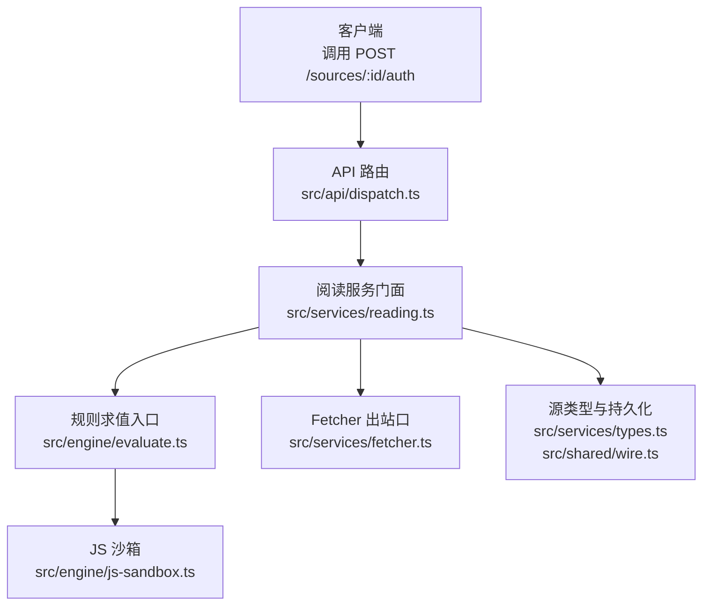
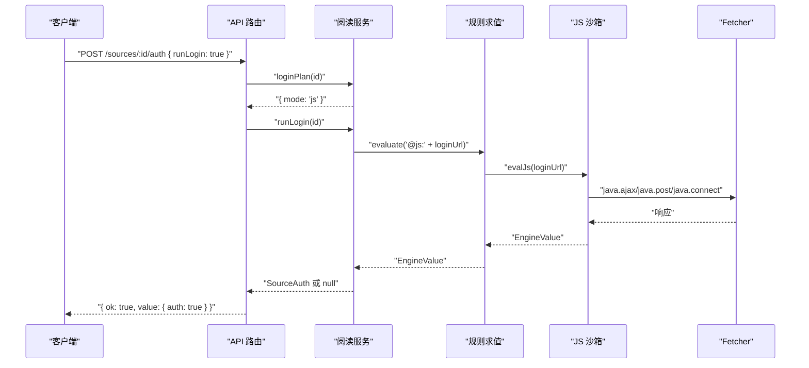
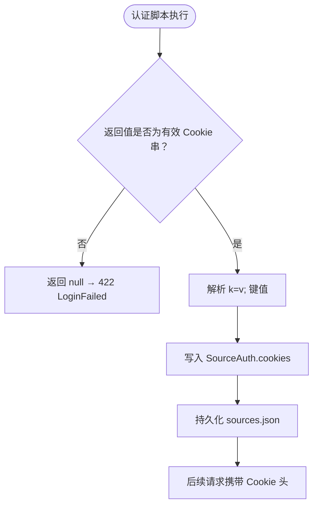
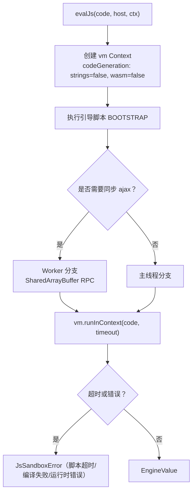

# 认证扩展

<cite>
**本文引用的文件**
- [dispatch.ts](file://src/api/dispatch.ts)
- [reading.ts](file://src/services/reading.ts)
- [wire.ts](file://src/shared/wire.ts)
- [types.ts（服务层）](file://src/services/types.ts)
- [js-sandbox.ts](file://src/engine/js-sandbox.ts)
- [errors.ts（引擎）](file://src/engine/errors.ts)
- [evaluate.ts](file://src/engine/evaluate.ts)
- [fetcher.ts](file://src/services/fetcher.ts)
- [types.ts（引擎）](file://src/engine/types.ts)
- [wire.ts（API）](file://src/api/wire.ts)
- [fetcher.test.ts](file://tests/services/fetcher.test.ts)
- [js-sandbox.test.ts](file://tests/engine/js-sandbox.test.ts)
</cite>

## 目录
1. [引言](#引言)
2. [项目结构中的位置](#项目结构中的位置)
3. [两种认证机制与边界](#两种认证机制与边界)
4. [POST /sources/:id/auth 接口契约](#post-sourcesidauth-接口契约)
5. [执行时机与 Fetcher 行为影响](#执行时机与-fetcher-行为影响)
6. [JS 沙箱安全约束](#js-沙箱安全约束)
7. [错误类型与调试方法](#错误类型与调试方法)
8. [典型用例](#典型用例)
9. [常见问题与排查清单](#常见问题与排查清单)
10. [安全注意事项](#安全注意事项)
11. [结论](#结论)

## 引言
本文件面向书源认证扩展，聚焦以下问题：
- cookie 登录态与 loginUrl 脚本在“源管理”中的职责分工；
- `POST /sources/:id/auth` 的请求体、响应体、执行时机；
- 认证结果如何影响后续网络请求的 Fetcher 行为；
- JS 沙箱的安全边界、超时保护与常见错误；
- 自动登录、设置 Cookie 头、处理二次跳转的最小实践。

## 项目结构中的位置
认证能力横跨 API 路由、阅读服务、引擎沙箱与服务层类型四层：



**图表来源**
- [dispatch.ts:490-521](file://src/api/dispatch.ts#L490-L521)
- [reading.ts:268-297](file://src/services/reading.ts#L268-L297)
- [evaluate.ts:1-40](file://src/engine/evaluate.ts#L1-L40)
- [js-sandbox.ts:603-756](file://src/engine/js-sandbox.ts#L603-L756)
- [fetcher.ts:1-80](file://src/services/fetcher.ts#L1-L80)
- [types.ts（服务层）:1-40](file://src/services/types.ts#L1-L40)
- [wire.ts（共享契约）:33-66](file://src/shared/wire.ts#L33-L66)

**章节来源**
- [dispatch.ts:490-521](file://src/api/dispatch.ts#L490-L521)
- [reading.ts:268-297](file://src/services/reading.ts#L268-L297)
- [fetcher.ts:1-80](file://src/services/fetcher.ts#L1-L80)

## 两种认证机制与边界
系统对“已认证状态”采用同一数据模型，但有两种录入路径：

| 机制 | 入口 | 执行内容 | 写入内容 | 典型用途 |
|---|---|---|---|---|
| Cookie 手动录入 | `POST /sources/:id/auth` 且 body 不含 `runLogin: true` | 不调用脚本 | `auth.cookies`、可选 `auth.headers` | 站点要求前端登录后复制 Cookie |
| loginUrl 自动登录 | `POST /sources/:id/auth` 且 `body.runLogin === true` | 把 `rules.loginUrl` 作为 `@js:` 规则执行 | 从脚本返回值解析 Cookie 后写入 `auth.cookies` | 通过登录页表单或接口完成自动登录 |

关键边界：
- **Cookie 字段不对外暴露**：对外投影只保留 `hasAuth`、`authExpired`、`hasLoginUrl` 等布尔位；凭据仅落盘。
- **loginUrl 形态判别在服务层**：若值是 HTTP/HTTPS URL，返回 `mode: 'manual'`，由 UI 打开新标签并让用户手动填写 Cookie；否则走 JS 沙箱。
- **鉴权脚本不是普通规则**：它通过 `evaluate('@js:' + loginUrl, ...)` 进入引擎求值链，最终落到 js-sandbox。

**章节来源**
- [types.ts（服务层）:10-20](file://src/services/types.ts#L10-L20)
- [wire.ts（共享契约）:45-66](file://src/shared/wire.ts#L45-L66)
- [reading.ts:268-297](file://src/services/reading.ts#L268-L297)
- [dispatch.ts:490-521](file://src/api/dispatch.ts#L490-L521)

## POST /sources/:id/auth 接口契约

### 请求
- 方法：`POST`
- 路径：`/novel-api/sources/:id/auth`
- 内容类型：`application/json; charset=utf-8`
- 可信来源：仅限本地回环地址，且 Origin/Referer 同源或缺省。

#### 模式一：运行登录脚本
请求体：
```json
{
  "runLogin": true
}
```

说明：
- 若源未声明 `rules.loginUrl`，返回 400 `BadRequest`。
- 若 `loginUrl` 是 HTTP/HTTPS URL，返回 `mode: 'manual'` 与 `loginUrl`，由 UI 打开浏览器登录，而不是执行脚本。
- 若 `loginUrl` 是 JavaScript 代码，调用服务层 `runLogin(id)`，在沙箱中执行。

#### 模式二：直接录入 Cookie
请求体：
```json
{
  "cookies": {
    "sid": "abc123"
  },
  "headers": {
    "Referer": "https://example.com/"
  }
}
```

说明：
- `cookies` 必须是对象，不能是数组或 null。
- `headers` 可选，也是对象。
- 成功返回 `{ ok: true, value: { auth: true } }`。

### 响应
成功统一使用信封格式：
```json
{
  "ok": true,
  "value": { ... }
}
```

失败统一使用错误信封：
```json
{
  "ok": false,
  "error": {
    "code": "...",
    "message": "...",
    "segment": { "facet": "...", "segmentIndex": 0, "segmentRaw": "..." }
  }
}
```

### 状态码与语义
| 条件 | 状态码 | 错误码 | 含义 |
|---|---:|---|---|
| 源不存在 | 404 | `NotFound` | 先校验存在性，再报 404 |
| 请求方法错误 | 405 | `MethodNotAllowed` | 非 `POST` |
| body 不是合法 JSON | 400 | `BadRequest` | 超出上限也会 413 |
| 源未声明 `loginUrl` 但调用了 `runLogin` | 400 | `BadRequest` | 该源不支持自动登录 |
| loginUrl 是 JS 脚本但返回值无法产出 Cookie | 422 | `LoginFailed` | 脚本未 return 或为空 |
| 规则/脚本求值异常 | 422 | 通常为 `RuleEvalError` 或 `JsSandboxError` | 带 segment 信息 |
| 网络抓取失败 | 502 | `FetchError` 或 `DecodeError` | 下游 Fetcher 抛出 |
| 其他内部错误 | 500 | `InternalError` | 兜底映射 |

**章节来源**
- [dispatch.ts:490-521](file://src/api/dispatch.ts#L490-L521)
- [wire.ts（API）:14-45](file://src/api/wire.ts#L14-L45)
- [wire.ts（API）:96-135](file://src/api/wire.ts#L96-L135)

## 执行时机与 Fetcher 行为影响

### 执行时机
认证脚本不会在每个页面请求前无条件执行。它的触发点是用户显式发起 `/sources/:id/auth` 并传入 `runLogin: true`。服务层随后：
1. 检查源是否存在；
2. 调用 `loginPlan(id)` 判断是否声明 `loginUrl`；
3. 若是 URL，返回 `mode: 'manual'`，让 UI 自行打开登录页；
4. 若是 JS 代码，调用 `runLogin(id)`，即执行 `evaluate('@js:' + loginUrl, engineContextOf(fetcher, source, ...))`。

因此，“发起网络请求前”和“登录页面加载时”应这样理解：
- **登录页面加载**：如果 `loginUrl` 是 URL，服务端不加载页面，而是把 URL 返回给 UI，由浏览器加载。
- **发起网络请求前**：如果 `loginUrl` 是 JS 脚本，脚本在执行过程中可能发起网络请求（例如提交登录表单），这些请求发生在认证阶段，而非后续正文读取阶段。



**图表来源**
- [dispatch.ts:490-521](file://src/api/dispatch.ts#L490-L521)
- [reading.ts:268-297](file://src/services/reading.ts#L268-L297)
- [evaluate.ts:1-40](file://src/engine/evaluate.ts#L1-L40)
- [js-sandbox.ts:603-756](file://src/engine/js-sandbox.ts#L603-L756)
- [fetcher.ts:1-80](file://src/services/fetcher.ts#L1-L80)

### 返回值如何影响后续 Fetcher 行为
- 当 `runLogin` 返回有效的 `SourceAuth` 时，服务层会将其保存为源的 `auth` 并持久化。
- 后续真实网络请求由 Fetcher 构造请求头，静态 header 与 `auth.cookies` 会被合并成 `Cookie` 头。
- 若脚本没有 return 有效 Cookie，服务端直接拒绝认证流程，不会保存 `auth`。
- 沙箱内通过 `cookie.setCookie(...)` 可修改当前会话 Cookie，但这些 Cookie 需要被 `loginUrl` 脚本最终返回，才会真正写入持久化登录态。



**图表来源**
- [reading.ts:268-297](file://src/services/reading.ts#L268-L297)
- [fetcher.test.ts:139-153](file://tests/services/fetcher.test.ts#L139-L153)

**章节来源**
- [dispatch.ts:490-521](file://src/api/dispatch.ts#L490-L521)
- [reading.ts:268-297](file://src/services/reading.ts#L268-L297)
- [fetcher.test.ts:139-153](file://tests/services/fetcher.test.ts#L139-L153)

## JS 沙箱安全约束

### vm realm 隔离
- 脚本在 Node.js `vm` 上下文中执行，宿主函数和对象不会以原生引用直接交给用户代码。
- 宿主暴露的 `java`、`console` 等全局变量都是 vm realm 包装函数，参数和返回值经过 JSON 序列化往返。
- 引导入口 `__host_call__` 和初始化入口 `__init__` 在引导脚本中被隐藏并锁定，用户代码无法恢复。

### 禁用字符串代码生成
- vm context 配置 `codeGeneration: { strings: false, wasm: false }`。
- `eval`、`Function` 构造器一律抛出 `EvalError`。
- 测试断言了 `typeof require`、`typeof process`、`typeof global` 等逃逸探测结果为字符串 `undefined`，而不是可执行的宿主对象。

### java.* 垫片
- 沙箱暴露 `java.*` 方法集，包括摘要、编码、时间格式化、AES 解密桥、连接与 AJAX 能力等。
- 某些 Android WebView 专属方法不可仿真，会抛出“需要安卓宿主环境”的错误，而不是静默 no-op。
- `cookie.getCookie`、`cookie.setCookie`、`cookie.removeCookie` 提供按源隔离的 Cookie 操作接口。
- 外部依赖如 `Packages.java.lang.String` 也受协议表控制，不是开放的文件系统或进程通道。

### 超时保护
- 同步死循环由 `vm.runInContext` 的 `timeout` 参数熔断。
- 异步总时长由外层 `Promise.race` 硬超时约束；worker 分支还有额外的终止保护。
- 默认 JS 超时为 2000ms，可通过上下文 `jsTimeoutMs` 覆盖；服务层在登录脚本中注入该值。



**图表来源**
- [js-sandbox.ts:603-756](file://src/engine/js-sandbox.ts#L603-L756)
- [js-sandbox.ts:787-956](file://src/engine/js-sandbox.ts#L787-L956)
- [js-sandbox.ts:1227-1228](file://src/engine/js-sandbox.ts#L1227-L1228)

**章节来源**
- [js-sandbox.ts:140-210](file://src/engine/js-sandbox.ts#L140-L210)
- [js-sandbox.ts:603-756](file://src/engine/js-sandbox.ts#L603-L756)
- [js-sandbox.ts:787-956](file://src/engine/js-sandbox.ts#L787-L956)
- [js-sandbox.ts:1227-1228](file://src/engine/js-sandbox.ts#L1227-L1228)
- [js-sandbox.test.ts:54-120](file://tests/engine/js-sandbox.test.ts#L54-L120)
- [types.ts（引擎）:107-117](file://src/engine/types.ts#L107-L117)

## 错误类型与调试方法

### RuleEvalError 与 JsSandboxError 的区别
| 错误类型 | 含义 | 典型来源 | 调试重点 |
|---|---|---|---|
| `RuleEvalError` | 规则求值阶段的领域错误，通常与选择命中数、规则语义有关 | CSS/XPath/JSONPath/模板求值、规则组合逻辑 | 查看 `segmentIndex`、`segmentRaw`、`hits` |
| `JsSandboxError` | JS 脚本层错误，包含脚本原文与行号 | 语法错误、运行时空引用、脚本超时、缺失网络能力、Java 桩不支持 | 查看 `script`、`line`、`message` |

两者都继承自 `EngineError`，并携带 facet、segmentIndex、segmentRaw。`JsSandboxError` 额外携带 `script` 与可选 `line`，适合定位具体脚本行。

### 调试建议
1. 先看 wire 层错误信封中的 `code`：
   - `RuleEvalError`：优先检查规则片段、选择器、正则、模板插值。
   - `JsSandboxError`：优先检查 `loginUrl` 脚本内容、脚本行数、是否缺少 `fetchPost`/`fetch` 等上下文。
2. 如果是超时：
   - 确认 `jsTimeoutMs` 是否过小；
   - 检查脚本是否有同步死循环或异步 Promise 永不 settle；
   - 注意 `DEFAULT_JS_TIMEOUT_MS = 2000ms`，而 Fetcher 默认请求超时为 15000ms，二者不是同一超时。
3. 如果是网络能力缺失：
   - 确认上下文注入了 `fetch` 或 `fetchPost`；
   - 确认脚本使用的 `java.ajax`/`java.post`/`java.connect` 没有被误判为不需要网络能力。
4. 如果是 Cookie 未生效：
   - 确认 `loginUrl` 脚本最终 return 的是可解析的 Cookie 串；
   - 确认手动录入时 `cookies` 是对象而非数组；
   - 确认后续请求头合并逻辑没有因大小写问题产生重复键。

**章节来源**
- [errors.ts:1-38](file://src/engine/errors.ts#L1-L38)
- [js-sandbox.test.ts:200-260](file://tests/engine/js-sandbox.test.ts#L200-L260)
- [js-sandbox.ts:1227-1228](file://src/engine/js-sandbox.ts#L1227-L1228)
- [types.ts（引擎）:107-117](file://src/engine/types.ts#L107-L117)
- [fetcher.ts:20-40](file://src/services/fetcher.ts#L20-L40)

## 典型用例

### 用例一：通过 loginUrl 自动登录站点
适用场景：站点有登录表单或登录接口，脚本提交账号密码后拿到 Cookie。

步骤：
1. 在源定义中填写 `rules.loginUrl` 为 JS 代码；
2. 客户端调用 `POST /sources/:id/auth`，body 为 `{ runLogin: true }`；
3. 服务端判定为 JS 模式，执行 `evaluate('@js:' + loginUrl)`；
4. 脚本内部通过 `java.post` 或 `java.ajax` 提交登录请求；
5. 脚本最终 return Cookie 串；
6. 服务端解析后写入 `auth.cookies`，后续请求自动带上 Cookie。

关键点：
- 脚本应使用 `java.post(url, body, headers)` 或 `java.ajax(url)`；
- 若需要动态头，应放在 `java.post` 第三个参数或 `headerRule`；
- 返回值必须是非空 Cookie 串，否则会 422 `LoginFailed`。

**章节来源**
- [dispatch.ts:490-521](file://src/api/dispatch.ts#L490-L521)
- [reading.ts:268-297](file://src/services/reading.ts#L268-L297)
- [js-sandbox.test.ts:300-360](file://tests/engine/js-sandbox.test.ts#L300-L360)

### 用例二：设置 Cookie 头
适用场景：站点只认 Cookie，不需要复杂登录流程。

方式一：手动录入
- 调用 `POST /sources/:id/auth`，body 为 `{ cookies: { sid: "abc" } }`；
- 成功后后续请求会把 Cookie 拼进请求头。

方式二：脚本设置
- 在 `loginUrl` 脚本中使用 `cookie.setCookie("key", "value")`；
- 仍需脚本最终 return Cookie 串，否则不会持久化。

注意：
- 静态 `header.Cookie` 与 `auth.cookies` 会合并；
- 同名字段以后者为准。

**章节来源**
- [fetcher.test.ts:139-153](file://tests/services/fetcher.test.ts#L139-L153)
- [js-sandbox.test.ts:380-420](file://tests/engine/js-sandbox.test.ts#L380-L420)

### 用例三：处理二次跳转
适用场景：登录接口返回 302，最终落地到目标页面，脚本需要知道最终 URL。

推荐做法：
- 使用 `java.connect(url).url` 获取跟随重定向后的末次请求地址；
- 或使用 `java.connect(url).raw().request().url()`，保证与旧口径一致；
- 不要假设 `connect` 返回的就是最终 HTML，应先判断状态码与 Content-Type。

**章节来源**
- [js-sandbox.test.ts:280-340](file://tests/engine/js-sandbox.test.ts#L280-L340)
- [js-sandbox.ts:192-210](file://src/engine/js-sandbox.ts#L192-L210)

## 常见问题与排查清单

### 问题一：loginUrl 返回非 HTML
现象：
- 脚本期望解析 HTML，但实际返回 JSON、纯文本或错误页；
- 后续规则求值出现 Miss 或乱码。

排查：
1. 先用 `java.connect(url)` 打印响应类型和落地地址；
2. 检查服务端是否返回 2xx；
3. 检查 `Content-Type` 与 charset；
4. 如果返回 JSON，改用 JSONPath 或脚本自行解析；
5. 如果返回错误页，优先查登录态是否正确。

相关实现：
- Fetcher 对非 2xx 抛 `FetchError`；
- 解码链优先取 `Content-Type charset`，其次嗅探 meta，最后兜底 UTF-8。

**章节来源**
- [fetcher.ts:60-120](file://src/services/fetcher.ts#L60-L120)
- [js-sandbox.test.ts:280-340](file://tests/engine/js-sandbox.test.ts#L280-L340)

### 问题二：Cookie 未生效
现象：
- 脚本设置了 Cookie，但后续请求仍被站点拒绝；
- 手动录入 Cookie 后也不生效。

排查清单：
- 是否调用了 `runLogin: true` 且脚本 return 了 Cookie 串；
- 是否直接把 Cookie 写在 `header.Cookie` 而没有走 `auth.cookies`；
- 是否数组传入了 `cookies`（应为对象）；
- 是否静态 header 与 `auth.cookies` 冲突；
- 是否使用了 `cookie.setCookie` 但没有最终 return；
- 是否后续请求被代理或 UA 拦截。

**章节来源**
- [dispatch.ts:490-521](file://src/api/dispatch.ts#L490-L521)
- [fetcher.test.ts:139-153](file://tests/services/fetcher.test.ts#L139-L153)
- [js-sandbox.test.ts:380-420](file://tests/engine/js-sandbox.test.ts#L380-L420)

### 问题三：鉴权脚本抛出异常
现象：
- 返回 422，错误码为 `RuleEvalError` 或 `JsSandboxError`；
- 控制台看不到详细堆栈。

排查清单：
1. 查看 wire 错误信封中的 `segment.segmentRaw`；
2. 若是 `JsSandboxError`，查看 `script` 与 `line`；
3. 区分语法错误与运行时错误；
4. 检查是否访问了未注入的上下文，例如 `fetchPost`；
5. 检查是否使用了不受支持的 Java 桩。

**章节来源**
- [errors.ts:1-38](file://src/engine/errors.ts#L1-L38)
- [js-sandbox.test.ts:200-260](file://tests/engine/js-sandbox.test.ts#L200-L260)
- [wire.ts（API）:96-135](file://src/api/wire.ts#L96-L135)

### 问题四：超时被终止
现象：
- 日志出现“脚本超时”；
- 异步登录请求长时间无响应后被中断。

排查清单：
1. 确认 `jsTimeoutMs` 是否过小；
2. 检查脚本是否有 `while(true){}` 这类同步死循环；
3. 检查是否 `await new Promise(() => {})` 这类永不 settle 的异步；
4. 检查 `java.ajax` 是否触发了 worker 同步桥，导致整体执行变慢；
5. 注意脚本超时与 Fetcher 网络超时的区别。

**章节来源**
- [js-sandbox.test.ts:70-90](file://tests/engine/js-sandbox.test.ts#L70-L90)
- [js-sandbox.ts:622-756](file://src/engine/js-sandbox.ts#L622-L756)
- [js-sandbox.ts:1227-1228](file://src/engine/js-sandbox.ts#L1227-L1228)
- [fetcher.ts:20-40](file://src/services/fetcher.ts#L20-L40)

## 安全注意事项

### 不要依赖外部网络
- 认证脚本可以发起网络请求，但这意味着脚本能访问外部站点；
- 不要把脚本当成完全隔离的纯计算单元；
- 如果站点不可信，应限制脚本的网络能力，或只允许手动录入 Cookie。

### 避免无限循环
- 同步死循环会被 vm timeout 终止，但仍会占用 CPU；
- 异步永不 settle 会被外层 race 超时终止，但同样会阻塞事件循环；
- 不要在脚本中写 `while(true)` 或 `setInterval`。

### 不要在脚本中泄露用户凭据
- `loginUrl` 脚本会作为 `@js:` 规则执行，其源码存在于源实体中；
- 不要将明文密码、密钥直接写入脚本；
- 如需敏感输入，应由 UI 在受控环境中提交，并由后端按最小权限写入 `auth.cookies`。

### 最小可复现 fixture 写法建议
一个最小可用的认证 fixture 应满足：
1. 源声明 `rules.loginUrl`；
2. `loginUrl` 是 JS 代码，不是纯 URL；
3. 脚本使用上下文提供的 `java.post` 或 `java.ajax` 发起登录；
4. 脚本最终 return Cookie 串；
5. 测试断言：
   - 认证成功返回 `{ ok: true, value: { auth: true } }`；
   - 后续请求头中包含 Cookie；
   - 超时、语法错误、非 HTML 响应都有明确错误分类。

参考实现锚点：
- 认证路由：[dispatch.ts:490-521](file://src/api/dispatch.ts#L490-L521)
- 登录执行：[reading.ts:268-297](file://src/services/reading.ts#L268-L297)
- 沙箱超时与错误：[js-sandbox.ts:622-756](file://src/engine/js-sandbox.ts#L622-L756)
- Fetcher 超时与 UA：[fetcher.ts:20-80](file://src/services/fetcher.ts#L20-L80)

## 结论
认证扩展的核心在于两条清晰边界：
- Cookie 是持久化的登录态，可以由用户手动录入，也可以由 `loginUrl` 脚本产出；
- `loginUrl` 是脚本入口，不是页面 URL；只有显式 `runLogin: true` 才会执行。

安全上，脚本运行在 vm realm 中，禁止字符串代码生成，所有宿主能力通过协议表暴露；超时保护既防同步死循环，也防异步卡死。调试时优先看 wire 错误信封、segment 信息和 `JsSandboxError.script`，再结合 Cookie 合并逻辑与 Fetcher 出站行为定位问题。