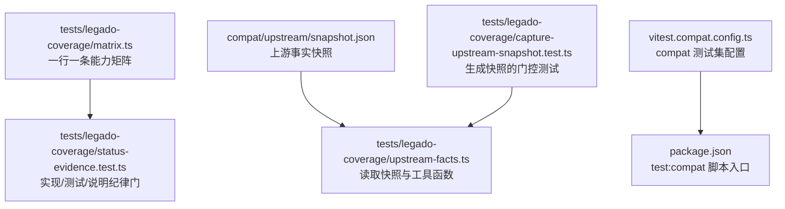
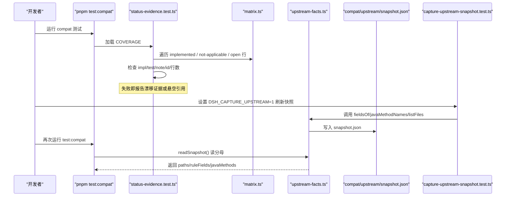
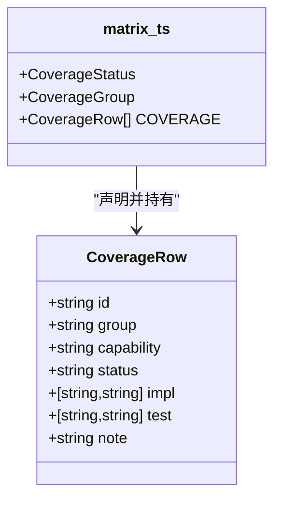
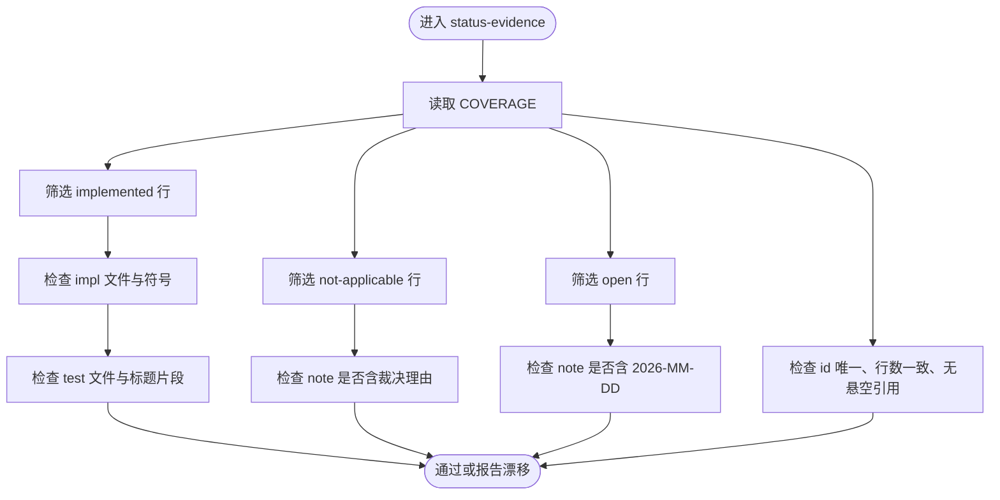
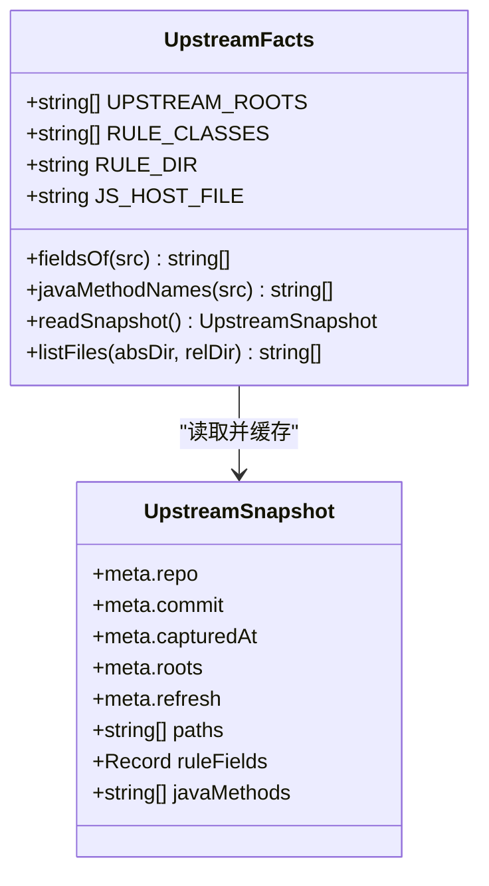
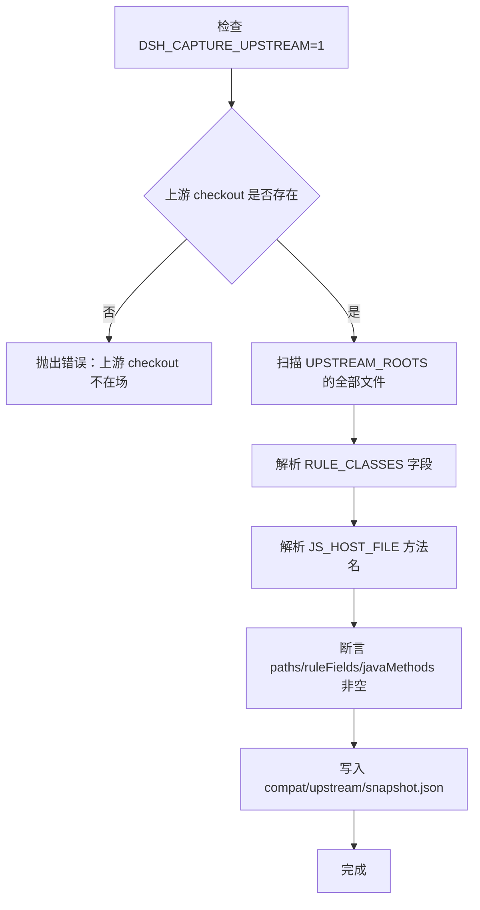
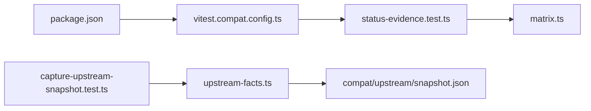
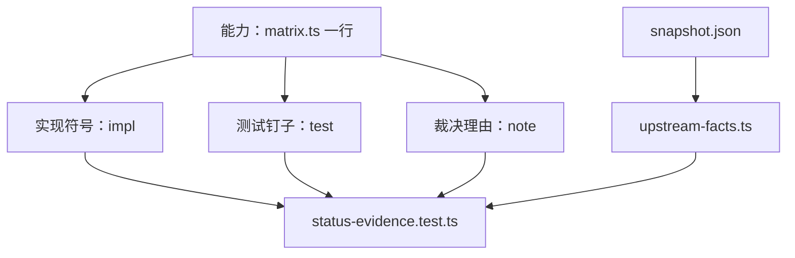
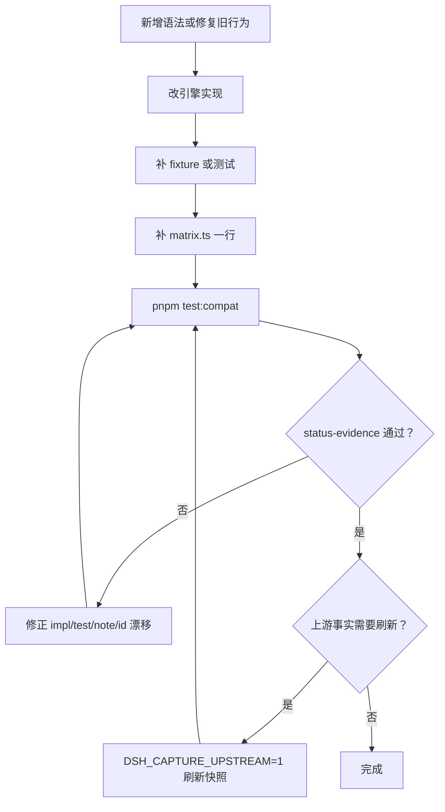
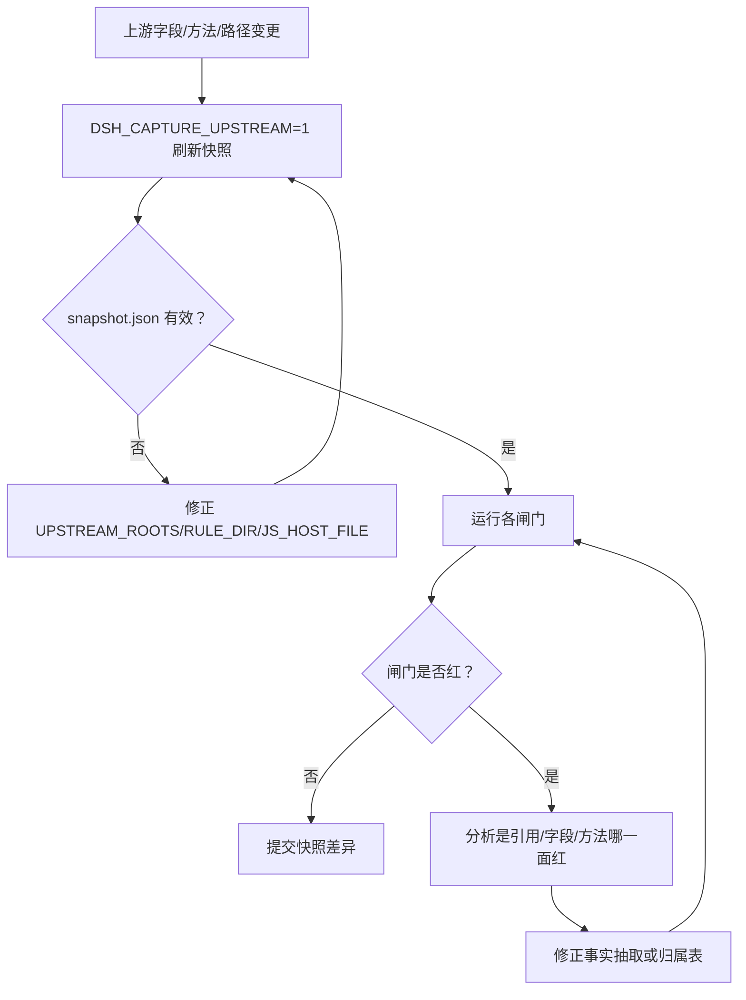

# 兼容性与判据

<cite>
**本文引用的文件**   
- [tests/legado-coverage/matrix.ts](file://tests/legado-coverage/matrix.ts)
- [tests/legado-coverage/status-evidence.test.ts](file://tests/legado-coverage/status-evidence.test.ts)
- [tests/legado-coverage/upstream-facts.ts](file://tests/legado-coverage/upstream-facts.ts)
- [tests/legado-coverage/capture-upstream-snapshot.test.ts](file://tests/legado-coverage/capture-upstream-snapshot.test.ts)
- [vitest.compat.config.ts](file://vitest.compat.config.ts)
- [package.json](file://package.json)
</cite>

## 目录
1. [引言](#引言)
2. [项目结构](#项目结构)
3. [核心组件](#核心组件)
4. [架构总览](#架构总览)
5. [详细组件分析](#详细组件分析)
6. [依赖关系分析](#依赖关系分析)
7. [兼容性矩阵与行为冻结规则](#兼容性矩阵与行为冻结规则)
8. [证据体系](#证据体系)
9. [新增语法与回归验证流程](#新增语法与回归验证流程)
10. [上游变更迁移策略](#上游变更迁移策略)
11. [贡献流程](#贡献流程)
12. [故障排查](#故障排查)
13. [结论](#结论)

## 引言
本仓库的兼容性目标不是“文档里写已支持”，而是把 legacy 语义冻结在一行一条的机器可读矩阵中，并由测试门保证每条裁决都能回查。兼容判据由三件事构成：
- 矩阵表：每行一个能力，状态只能是 `implemented`、`not-applicable`、`open`。
- 证据门：`status-evidence.test.ts` 检查实现符号、用例片段、裁决理由和复核时效戳。
- 上游事实快照：`compat/upstream/snapshot.json` 作为闸门分母，避免开发阶段因外部 checkout 变动导致误红。

## 项目结构
兼容性相关代码集中在 `tests/legado-coverage/`，并配套 `compat/upstream/snapshot.json` 与 `vitest.compat.config.ts`：

**图示来源**
- [tests/legado-coverage/matrix.ts:1-30](file://tests/legado-coverage/matrix.ts#L1-L30)
- [tests/legado-coverage/status-evidence.test.ts:1-20](file://tests/legado-coverage/status-evidence.test.ts#L1-L20)
- [tests/legado-coverage/upstream-facts.ts:1-30](file://tests/legado-coverage/upstream-facts.ts#L1-L30)
- [tests/legado-coverage/capture-upstream-snapshot.test.ts:1-20](file://tests/legado-coverage/capture-upstream-snapshot.test.ts#L1-L20)
- [vitest.compat.config.ts:1-11](file://vitest.compat.config.ts#L1-L11)
- [package.json:53-63](file://package.json#L53-L63)

**章节来源**
- [tests/legado-coverage/matrix.ts:1-30](file://tests/legado-coverage/matrix.ts#L1-L30)
- [vitest.compat.config.ts:1-11](file://vitest.compat.config.ts#L1-L11)
- [package.json:53-63](file://package.json#L53-L63)

## 核心组件
| 组件 | 职责 | 关键断言或输出 |
|---|---|---|
| `matrix.ts` | 定义兼容性矩阵的数据类型与 `COVERAGE` 数组；每个能力一行，状态三选一 | 类型 `CoverageRow`、`CoverageStatus`、`CoverageGroup` |
| `status-evidence.test.ts` | 对 `COVERAGE` 做证据审计：impl/test 存在性、note 理由、日期锚、id 唯一、一行一记录 | 三个 describe 块 |
| `upstream-facts.ts` | 维护上游事实抽取器与快照读取器；模块级缓存一次 pnpm test 内的快照 | `readSnapshot()`、`fieldsOf()`、`javaMethodNames()` |
| `capture-upstream-snapshot.test.ts` | 在 `DSH_CAPTURE_UPSTREAM=1` 时从对面 checkout 拉取事实并写入快照 | 门控 describe |
| `vitest.compat.config.ts` | 限定 compat 测试只跑 `tests/compat/**`，与常规测试互斥 | include 路径 |
| `package.json` | 提供 `pnpm test:compat` 等脚本 | scripts 字段 |

**章节来源**
- [tests/legado-coverage/matrix.ts:1-55](file://tests/legado-coverage/matrix.ts#L1-L55)
- [tests/legado-coverage/status-evidence.test.ts:1-111](file://tests/legado-coverage/status-evidence.test.ts#L1-L111)
- [tests/legado-coverage/upstream-facts.ts:1-104](file://tests/legado-coverage/upstream-facts.ts#L1-L104)
- [tests/legado-coverage/capture-upstream-snapshot.test.ts:1-79](file://tests/legado-coverage/capture-upstream-snapshot.test.ts#L1-L79)
- [vitest.compat.config.ts:1-11](file://vitest.compat.config.ts#L1-L11)
- [package.json:53-63](file://package.json#L53-L63)

## 架构总览
兼容性判据的整体流程如下：

**图示来源**
- [tests/legado-coverage/status-evidence.test.ts:12-111](file://tests/legado-coverage/status-evidence.test.ts#L12-L111)
- [tests/legado-coverage/upstream-facts.ts:60-104](file://tests/legado-coverage/upstream-facts.ts#L60-L104)
- [tests/legado-coverage/capture-upstream-snapshot.test.ts:12-79](file://tests/legado-coverage/capture-upstream-snapshot.test.ts#L12-L79)

## 详细组件分析

### 兼容性矩阵：`tests/legado-coverage/matrix.ts`
矩阵是兼容性状态的单一数据源。它定义了：
- `CoverageStatus`：只能为 `implemented`、`not-applicable`、`open`，没有“未知”。
- `CoverageGroup`：按 A 到 K 分组，便于分组统计与定位。
- `CoverageRow`：包含 `id`、`group`、`capability`、`status`、可选 `impl`、可选 `test`、可选 `note`。
- `COVERAGE`：一行一条能力，所有裁决理由、订正、复核时间都写在同一行的 `note` 中。

重要设计约束：
- `id` 必须稳定且唯一，改名应触发断言失败，防止同一能力被复制成多行。
- `impl` 指向源码文件和必须出现的符号；`test` 指向测试文件和用例标题片段。
- `note` 承载裁决理由与时效戳，而不是指向外部文档。
- 矩阵本身会被其他工具按行读取，因此不能把一个能力拆成多行。

**图示来源**
- [tests/legado-coverage/matrix.ts:15-55](file://tests/legado-coverage/matrix.ts#L15-L55)

**章节来源**
- [tests/legado-coverage/matrix.ts:1-55](file://tests/legado-coverage/matrix.ts#L1-L55)
- [tests/legado-coverage/matrix.ts:300-381](file://tests/legado-coverage/matrix.ts#L300-L381)

### 证据门：`tests/legado-coverage/status-evidence.test.ts`
该测试是矩阵的机器判据，覆盖三类问题：

1. **implemented 行的证据必须现查得到**
   - 每条 `implemented` 都必须有 `impl` 和 `test`。
   - `impl` 的文件必须存在，且符号在剥注释后的源码中可查。
   - `test` 的文件必须存在，且用例标题片段必须存在于测试源码中。

2. **not-applicable 与 open 行的说明纪律**
   - `not-applicable` 必须写明裁决理由，否则视为遗忘。
   - `open` 必须带 `2026-MM-DD` 格式的复核时效戳。
   - 任何包含“N 个源”这类现量读数的 `note`，都必须带日期锚。

3. **矩阵表自身的形状**
   - `id` 必须唯一。
   - 源码中数到的记录行数必须等于 `COVERAGE.length`，禁止折行。
   - `note` 不允许指向上游已删守卫、旧 README、旧 coverage 测试等悬空引用。

**图示来源**
- [tests/legado-coverage/status-evidence.test.ts:12-111](file://tests/legado-coverage/status-evidence.test.ts#L12-L111)

**章节来源**
- [tests/legado-coverage/status-evidence.test.ts:1-111](file://tests/legado-coverage/status-evidence.test.ts#L1-L111)

### 上游事实快照：`tests/legado-coverage/upstream-facts.ts`
这个模块负责维护“对面事实”的仓内快照，而不是运行时依赖外部 checkout：

- `UPSTREAM_ROOTS`：定义主源与测试源根路径。
- `RULE_CLASSES`：定义 7 个规则实体类名。
- `RULE_DIR`：规则实体所在目录。
- `JS_HOST_FILE`：宿主方法定义文件。
- `fieldsOf()`：从 Kotlin data class 中提取字段名。
- `javaMethodNames()`：从宿主文件中提取 Java/Kotlin 暴露的方法名。
- `readSnapshot()`：模块级缓存快照；缺失或分母为空直接抛错，不静默降级。
- `listFiles()`：递归列出源根下全部文件路径，作为引用活性判据的分母。

**图示来源**
- [tests/legado-coverage/upstream-facts.ts:12-104](file://tests/legado-coverage/upstream-facts.ts#L12-L104)

**章节来源**
- [tests/legado-coverage/upstream-facts.ts:1-104](file://tests/legado-coverage/upstream-facts.ts#L1-L104)

### 快照生成器：`tests/legado-coverage/capture-upstream-snapshot.test.ts`
这是一个门控测试，默认跳过，只有环境变量 `DSH_CAPTURE_UPSTREAM=1` 时才执行：

- 从 `DSH_LEGADO_REF` 或默认路径读取上游 checkout。
- 扫描两个源根下的全部文件，构建 `paths`。
- 解析 7 个规则实体类的字段，构建 `ruleFields`。
- 解析宿主文件中的方法名，构建 `javaMethods`。
- 写入 `compat/upstream/snapshot.json`，并附带 meta 信息。
- 断言路径数量、规则实体数量、方法数量不为空，防止产半份快照。

**图示来源**
- [tests/legado-coverage/capture-upstream-snapshot.test.ts:12-79](file://tests/legado-coverage/capture-upstream-snapshot.test.ts#L12-L79)

**章节来源**
- [tests/legado-coverage/capture-upstream-snapshot.test.ts:1-79](file://tests/legado-coverage/capture-upstream-snapshot.test.ts#L1-L79)

## 依赖关系分析
兼容性测试的核心依赖关系如下：

**图示来源**
- [package.json:53-63](file://package.json#L53-L63)
- [vitest.compat.config.ts:1-11](file://vitest.compat.config.ts#L1-L11)
- [tests/legado-coverage/status-evidence.test.ts:1-20](file://tests/legado-coverage/status-evidence.test.ts#L1-L20)
- [tests/legado-coverage/matrix.ts:1-30](file://tests/legado-coverage/matrix.ts#L1-L30)
- [tests/legado-coverage/capture-upstream-snapshot.test.ts:12-25](file://tests/legado-coverage/capture-upstream-snapshot.test.ts#L12-L25)
- [tests/legado-coverage/upstream-facts.ts:60-104](file://tests/legado-coverage/upstream-facts.ts#L60-L104)

**章节来源**
- [package.json:53-63](file://package.json#L53-L63)
- [vitest.compat.config.ts:1-11](file://vitest.compat.config.ts#L1-L11)
- [tests/legado-coverage/status-evidence.test.ts:1-20](file://tests/legado-coverage/status-evidence.test.ts#L1-L20)
- [tests/legado-coverage/upstream-facts.ts:60-104](file://tests/legado-coverage/upstream-facts.ts#L60-L104)

## 兼容性矩阵与行为冻结规则
矩阵的行为冻结规则可以总结为：

| 规则 | 含义 | 违反后果 |
|---|---|---|
| 一行一条记录 | 一个能力对应 `COVERAGE` 中的一行 | 行数不一致，证据门失败 |
| 状态三态 | `implemented`、`not-applicable`、`open` | 类型系统拒绝其他值 |
| implemented 必须可回查 | `impl` 与 `test` 必须真实存在 | 证据门报告漂移 |
| not-applicable 必须有理由 | `note` 长度至少 20 字符 | 证据门报告遗漏裁决理由 |
| open 必须有复核时效戳 | `note` 必须含 `2026-MM-DD` | 证据门报告读数可能被当现状 |
| 裁决理由住 note | 不指向已删文档、旧 README、旧 coverage 测试 | 证据门报告悬空引用 |
| id 唯一 | 同一能力不能重复 | 证据门报告重复 id |

这些规则不是建议，而是由 `status-evidence.test.ts` 强制执行的机器门。

**章节来源**
- [tests/legado-coverage/status-evidence.test.ts:12-111](file://tests/legado-coverage/status-evidence.test.ts#L12-L111)
- [tests/legado-coverage/matrix.ts:1-55](file://tests/legado-coverage/matrix.ts#L1-L55)

## 证据体系
证据体系分为三层：

1. **矩阵层**：`matrix.ts` 中的 `COVERAGE` 是唯一读数口。
2. **实现与测试层**：`impl` 与 `test` 必须在源码中可现查，且 `status-evidence.test.ts` 会剥注释后查找符号。
3. **上游事实层**：`upstream-facts.ts` 与 `capture-upstream-snapshot.test.ts` 共同维护 `compat/upstream/snapshot.json`，作为字段面、方法名面、引用活性面的分母。

**图示来源**
- [tests/legado-coverage/matrix.ts:15-55](file://tests/legado-coverage/matrix.ts#L15-L55)
- [tests/legado-coverage/status-evidence.test.ts:12-111](file://tests/legado-coverage/status-evidence.test.ts#L12-L111)
- [tests/legado-coverage/upstream-facts.ts:60-104](file://tests/legado-coverage/upstream-facts.ts#L60-L104)

**章节来源**
- [tests/legado-coverage/status-evidence.test.ts:1-111](file://tests/legado-coverage/status-evidence.test.ts#L1-L111)
- [tests/legado-coverage/upstream-facts.ts:1-104](file://tests/legado-coverage/upstream-facts.ts#L1-L104)

## 新增语法与回归验证流程
新增语法或修复旧行为时，应按以下顺序操作：

1. **实现引擎逻辑**：修改引擎或相关服务文件。
2. **添加 fixture 或测试**：在 `tests/engine/*` 或 `tests/compat/*` 中添加能钉住行为的用例。
3. **补充矩阵行**：在 `tests/legado-coverage/matrix.ts` 中增加一行，明确 `id`、`capability`、`status`、`impl`、`test` 和 `note`。
4. **运行兼容测试**：执行 `pnpm test:compat`。
5. **确认 `status-evidence` 通过**：确保实现符号可回查、用例标题片段在场、`note` 理由完整、`open` 行带日期锚。
6. **如需上游事实更新**：设置 `DSH_CAPTURE_UPSTREAM=1` 并运行快照生成测试，再重新运行 `pnpm test:compat`。

**图示来源**
- [tests/legado-coverage/matrix.ts:15-55](file://tests/legado-coverage/matrix.ts#L15-L55)
- [tests/legado-coverage/status-evidence.test.ts:12-111](file://tests/legado-coverage/status-evidence.test.ts#L12-L111)
- [tests/legado-coverage/capture-upstream-snapshot.test.ts:12-79](file://tests/legado-coverage/capture-upstream-snapshot.test.ts#L12-L79)
- [package.json:53-63](file://package.json#L53-L63)

**章节来源**
- [tests/legado-coverage/matrix.ts:15-55](file://tests/legado-coverage/matrix.ts#L15-L55)
- [tests/legado-coverage/status-evidence.test.ts:12-111](file://tests/legado-coverage/status-evidence.test.ts#L12-L111)
- [tests/legado-coverage/capture-upstream-snapshot.test.ts:12-79](file://tests/legado-coverage/capture-upstream-snapshot.test.ts#L12-L79)
- [package.json:53-63](file://package.json#L53-L63)

## 上游变更迁移策略
当上游 legado 仓库发生字段改名、实体移动、宿主方法增减时，迁移策略如下：

1. **不要直接改闸门的正则或硬编码事实**：`upstream-facts.ts` 中的抽取逻辑是“单一事实来源”，不应在多个闸门各自重写。
2. **先刷新快照**：设置 `DSH_CAPTURE_UPSTREAM=1`，并确保 `DSH_LEGADO_REF` 指向正确的上游 checkout。
3. **检查快照内容**：确认 `compat/upstream/snapshot.json` 中的 `paths`、`ruleFields`、`javaMethods` 不为空。
4. **运行相关闸门**：包括 `status-evidence.test.ts`、`inventory-coverage.test.ts`、`upstream-fields.test.ts` 等使用快照的测试。
5. **如果闸门变红**：
   - 引用活性门红：可能是上游文件或目录改名，需同步 `UPSTREAM_ROOTS`、`RULE_DIR`、`JS_HOST_FILE`。
   - 字段门面红：可能是规则实体字段改名，需核对 `RULE_CLASSES` 与 `fieldsOf()`。
   - 方法门面红：可能是宿主方法名变化，需核对 `javaMethodNames()` 的正则。
6. **提交前确认**：快照差异进入版本控制，便于审查上游变更的具体影响。

**图示来源**
- [tests/legado-coverage/upstream-facts.ts:12-104](file://tests/legado-coverage/upstream-facts.ts#L12-L104)
- [tests/legado-coverage/capture-upstream-snapshot.test.ts:12-79](file://tests/legado-coverage/capture-upstream-snapshot.test.ts#L12-L79)

**章节来源**
- [tests/legado-coverage/upstream-facts.ts:1-104](file://tests/legado-coverage/upstream-facts.ts#L1-L104)
- [tests/legado-coverage/capture-upstream-snapshot.test.ts:1-79](file://tests/legado-coverage/capture-upstream-snapshot.test.ts#L1-L79)

## 贡献流程
推荐的最小贡献流程如下：

| 步骤 | 动作 | 通过标准 |
|---|---|---|
| 1 | 改引擎 | 引擎测试或 compat fixture 能通过 |
| 2 | 补 matrix 行 | 新增一行，状态正确，`impl`、`test`、`note` 齐全 |
| 3 | 运行 `pnpm test:compat` | 无 `status-evidence` 报错 |
| 4 | 确认 `status-evidence` 通过 | 实现符号可回查、用例标题片段在场、裁决理由完整 |
| 5 | 如涉及上游事实 | 刷新快照并提交 `compat/upstream/snapshot.json` 差异 |
| 6 | 提交 PR | 矩阵行与证据一致，无悬空引用 |

**章节来源**
- [package.json:53-63](file://package.json#L53-L63)
- [tests/legado-coverage/status-evidence.test.ts:12-111](file://tests/legado-coverage/status-evidence.test.ts#L12-L111)
- [tests/legado-coverage/matrix.ts:15-55](file://tests/legado-coverage/matrix.ts#L15-L55)

## 故障排查
常见错误及处理建议：

| 错误现象 | 可能原因 | 处理方法 |
|---|---|---|
| `status-evidence` 报实现符号找不到 | `impl` 指向错误或符号未出现在剥注释后的源码中 | 修正 `impl` 或补齐实现 |
| `status-evidence` 报测试标题片段不存在 | `test` 片段拼写错误或测试未添加 | 修正测试标题或修正 `test` 字段 |
| `status-evidence` 报 `not-applicable` 缺理由 | `note` 为空或过短 | 在本行 `note` 写明裁决理由 |
| `status-evidence` 报 `open` 缺日期锚 | `note` 缺少 `2026-MM-DD` | 补充复核日期 |
| `status-evidence` 报悬空引用 | `note` 指向已删文档或旧 README | 把裁决理由写进 `note`，删除外部指针 |
| `status-evidence` 报行数不一致 | 矩阵行被拆成多行 | 恢复为一行一条记录 |
| `readSnapshot` 抛错 | `compat/upstream/snapshot.json` 缺失或分母为空 | 运行快照生成测试 |
| 快照生成失败 | 上游 checkout 不在 `DSH_LEGADO_REF` 指向路径 | 设置正确上游路径或准备上游仓库 |

**章节来源**
- [tests/legado-coverage/status-evidence.test.ts:12-111](file://tests/legado-coverage/status-evidence.test.ts#L12-L111)
- [tests/legado-coverage/upstream-facts.ts:60-104](file://tests/legado-coverage/upstream-facts.ts#L60-L104)
- [tests/legado-coverage/capture-upstream-snapshot.test.ts:20-79](file://tests/legado-coverage/capture-upstream-snapshot.test.ts#L20-L79)

## 结论
兼容性判据的核心不是文档描述，而是一行一条的矩阵、可回查的证据、以及不依赖外部 checkout 的上游事实快照。贡献者每次改动都应让 `matrix.ts` 更精确，而不是让文档更厚；每次上游变更都应让 `snapshot.json` 更准确，而不是让闸门绕过校验。这样，legacy 语义才能被冻结在机器可审计的状态中。