# 开发者指南

<cite>
**本文引用的文件**
- [package.json](file://package.json)
- [vitest.config.ts](file://vitest.config.ts)
- [vitest.compat.config.ts](file://vitest.compat.config.ts)
- [src/shared/wire.ts](file://src/shared/wire.ts)
- [src/services/reading.ts](file://src/services/reading.ts)
- [tests/api/routes.test.ts](file://tests/api/routes.test.ts)
- [tests/shared/wire-builders.test.ts](file://tests/shared/wire-builders.test.ts)
- [tests/compat/capture.test.ts](file://tests/compat/capture.test.ts)
- [tests/compat/replay.test.ts](file://tests/compat/replay.test.ts)
- [docs/architecture.md](file://docs/architecture.md)
- [docs/adr/README.md](file://docs/adr/README.md)
- [cordis.patch.yml](file://cordis.patch.yml)
</cite>

## 目录
1. [引言](#引言)
2. [项目结构](#项目结构)
3. [核心组件](#核心组件)
4. [架构总览](#架构总览)
5. [详细组件分析](#详细组件分析)
6. [依赖关系分析](#依赖关系分析)
7. [新增书源语法的标准流程](#新增书源语法的标准流程)
8. [调整 wire 契约的同步清单](#调整-wire-契约的同步清单)
9. [宿主版本与 peer 区间维护](#宿主版本与-peer-区间维护)
10. [本地调试命令](#本地调试命令)
11. [PR 提交规范](#pr-提交规范)
12. [ADR 决策记录模板](#adr-决策记录模板)
13. [故障排查](#故障排查)
14. [结论](#结论)

## 引言
本指南面向贡献者，目标是让你用同一套约定、同一份事实源完成书源语法扩展、契约变更、宿主版本升级与兼容回放。仓库的核心设计是：Node 半与浏览器半通过 `src/shared/wire.ts` 对齐；业务入口统一收敛在 `ReadingService`；“矩阵即真相”，所有兼容性判断落在 `tests/legado-coverage/matrix.ts` 的行上；兼容站点行为由 `tests/compat/*` 采集并回放。

本仓库产出两个运行面：
- Node 半：Cordis 插件，提供 `/novel-api` 路由、工具面与规则引擎。
- 浏览器半：宿主前端注入的 UI 视图与可丢弃投影。

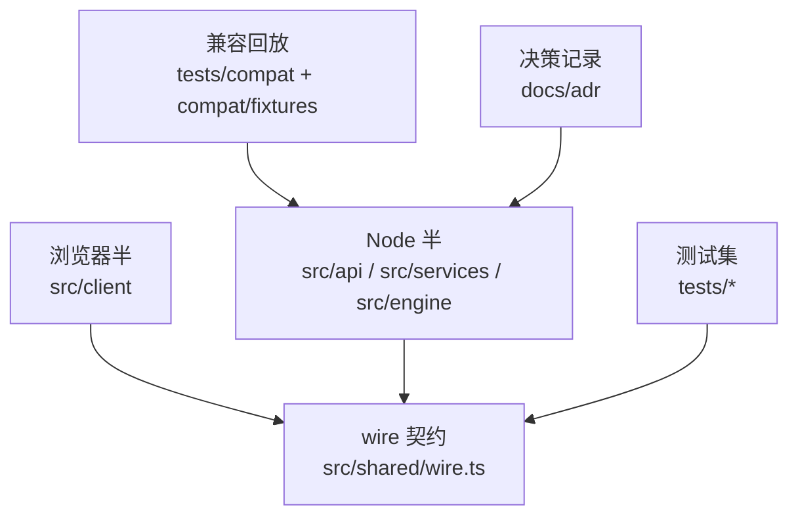

**图表来源**
- [docs/architecture.md:1-115](file://docs/architecture.md#L1-L115)
- [src/shared/wire.ts:1-20](file://src/shared/wire.ts#L1-L20)

**章节来源**
- [docs/architecture.md:1-115](file://docs/architecture.md#L1-L115)

## 项目结构
仓库按职责分层组织，而不是按宿主形态分裂：

| 路径 | 职责 | 贡献者注意 |
| --- | --- | --- |
| `src/` | TS 源码 | 所有实现落在这里 |
| `src/shared/wire.ts` | 跨半 wire 契约 | 值形状、路由名、构造器、枚举的唯一主人 |
| `src/engine/` | 规则解析与求值（纯函数） | 不碰 IO，可离线跑 |
| `src/services/` | 领域门面与部件 | `ReadingService` 是唯一业务入口 |
| `src/api/` | HTTP 分发与信封 | 只负责传输，业务交给门面 |
| `src/client/` | 浏览器视图与状态 | 不能引入 Node 运行时依赖 |
| `tests/` | 测试镜像结构 | 常规测试、API 路由、客户端、服务、兼容回放 |
| `compat/` | 兼容 fixture 与上游快照 | 采集产物，不是临时目录 |
| `docs/adr/` | 决策记录 | 难逆、无上下文会惊讶、曾有替代方案的决定 |
| `cordis.patch.yml` | Cordis 安装补丁 | 向宿主注册插件 id |
| `package.json` | 脚本、peer、dsh 兼容闸 | 宿主版本、发布范围在此维护 |

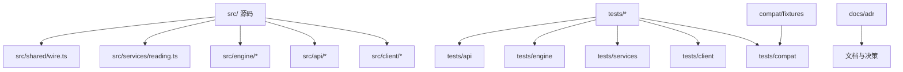

**图表来源**
- [docs/architecture.md:1-115](file://docs/architecture.md#L1-L115)

**章节来源**
- [docs/architecture.md:1-115](file://docs/architecture.md#L1-L115)

## 核心组件
### 单一事实源：`ReadingService`
`ReadingService` 是 HTTP API、AI 工具、UI 三个面的唯一业务入口。它组合注册表、书架、缓存、抓取器、任务槽和本地书模块，对外暴露搜索、详情、目录、正文、书架、导入等动词。所有外部调用方都不应绕过它直接访问内部部件。

关键点：
- 公开类型来自 `shared/wire.ts`，不在服务层复制。
- 聚合搜索并发、JS 沙箱预算等默认值集中在该文件，避免散落字面量。
- 本地书、代理、fetcher 等能力通过构造参数注入，便于测试与宿主装配。

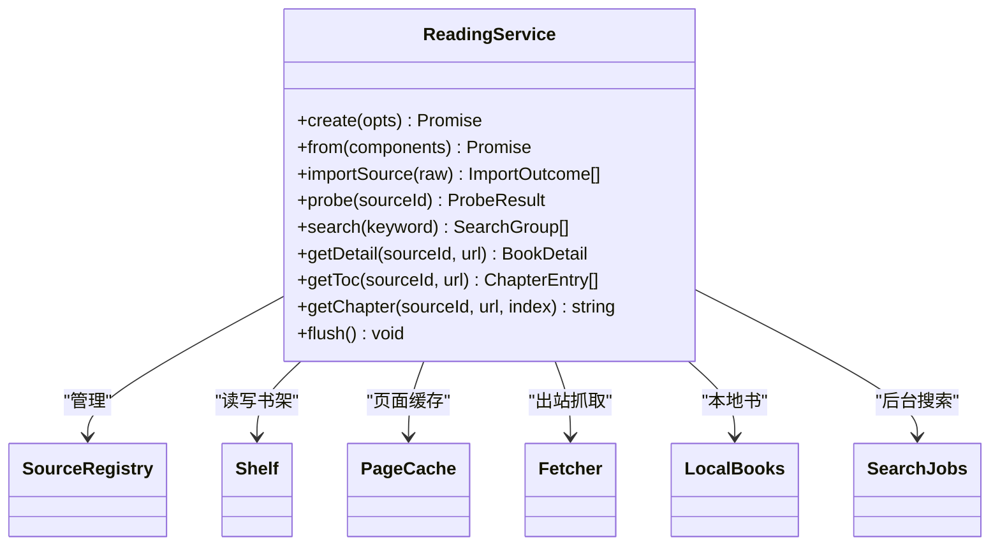

**图表来源**
- [src/services/reading.ts:1-120](file://src/services/reading.ts#L1-L120)

**章节来源**
- [src/services/reading.ts:1-120](file://src/services/reading.ts#L1-L120)
- [docs/architecture.md:1-115](file://docs/architecture.md#L1-L115)

### wire 契约：两半的唯一真相
`src/shared/wire.ts` 定义跨半 JSON 的值形状、路由名、错误信封、查询构造器和常量。它的两条硬约束是：
1. client 纯度门栏禁止 Node 内建或平台模块外的 `@deepseek-ai/*` 值 import。
2. type-only 依赖可在构建期擦除。

它同时承担：
- 书源公开投影、探针结果、任务状态。
- 搜索命中、分组、计划、书籍详情、书架条目。
- 路由表、参数路由构造器、query 编码。
- `LOCAL_SOURCE_ID` 等跨半常量。

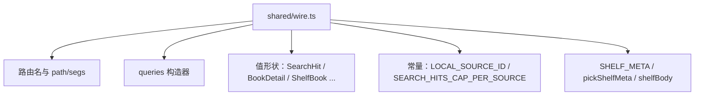

**图表来源**
- [src/shared/wire.ts:1-200](file://src/shared/wire.ts#L1-L200)

**章节来源**
- [src/shared/wire.ts:1-200](file://src/shared/wire.ts#L1-L200)

## 架构总览
系统以 wire 为轴心，将浏览器半与 Node 半解耦。浏览器半只持有视图和可丢弃投影；Node 半承载 Cordis 插件、规则引擎、服务门面和持久化。两者通过 JSON/HTTP 通信，契约变更必须两半同批上线。

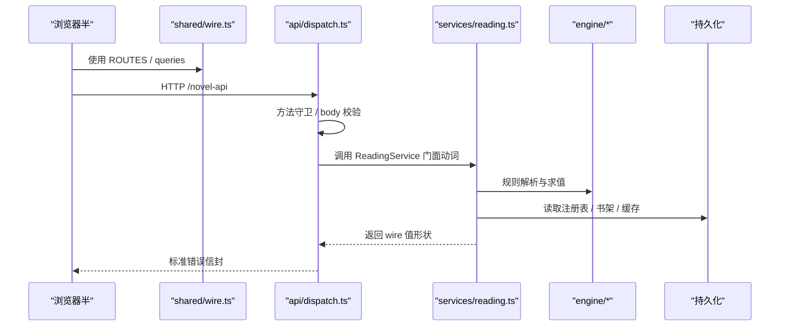

**图表来源**
- [docs/architecture.md:1-115](file://docs/architecture.md#L1-L115)
- [src/shared/wire.ts:1-20](file://src/shared/wire.ts#L1-L20)
- [tests/api/routes.test.ts:1-40](file://tests/api/routes.test.ts#L1-L40)

**章节来源**
- [docs/architecture.md:1-115](file://docs/architecture.md#L1-L115)

## 详细组件分析

### 路由与 dispatch
路由常量集中声明于 `shared/wire.ts`，并由 `tests/api/routes.test.ts` 验证每条路由都能落到真实 dispatch。落点判据不是任意成功码，而是“响应不是未知路由 404”。这能防止重构后只改常量却忘记改 if-链匹配。

要点：
- 静态路由数量与参数路由数量由测试钉死。
- POST-only 子路由用 GET 访问应返回 405。
- 参数路由通过 `paramRoutes.*` 生成，避免手拼段。
- 未知路由仍应 404，区分“已到达路由但业务失败”和“根本未匹配”。

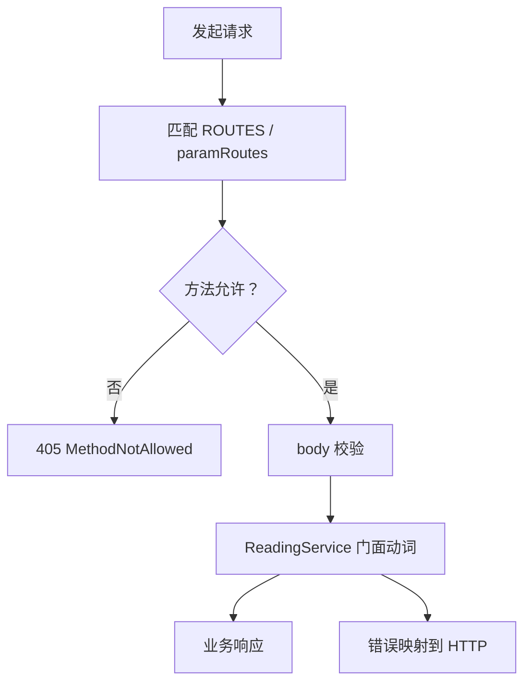

**图表来源**
- [tests/api/routes.test.ts:1-200](file://tests/api/routes.test.ts#L1-L200)

**章节来源**
- [tests/api/routes.test.ts:1-200](file://tests/api/routes.test.ts#L1-L200)

### wire 构造器与 builders
`tests/shared/wire-builders.test.ts` 断言 wire 的构造器语义，包括 query 编码、路径拼接、导航扁平化、书架元数据字段集、`pickShelfMeta` 归一化、`shelfBody` 体构造以及 `paramRoutes.shelfKey` 漂移守卫。它是 builders 与 dispatch 读取语义的镜像。

关键纪律：
- `LOCAL_SOURCE_ID` 是跨半常量的唯一主人。
- `SHELF_META` 是书目元数据字段的唯一主人。
- 任何 client 装配出的 shelf 路径必须能被 `paramRoutes.shelfKey` 还原。
- null 表示键缺席，undefined 不参与序列化，这与 wire 可空口径一致。

**章节来源**
- [tests/shared/wire-builders.test.ts:1-161](file://tests/shared/wire-builders.test.ts#L1-L161)

### 兼容采集与回放
兼容测试分为采集与回放：
- 采集：`tests/compat/capture.test.ts`，需要设置 `COMPAT_CAPTURE=1`，从 `compat/sources/*.json` 读取书源，执行导入、探针、搜索、目录、正文与详情，并将脱敏后的页面写入 `compat/fixtures/<case>/pages` 与 `manifest.json`。
- 回放：`tests/compat/replay.test.ts`，基于已有 fixture 重放全链路，要求分母非空，且每个 case 全部步骤通过。

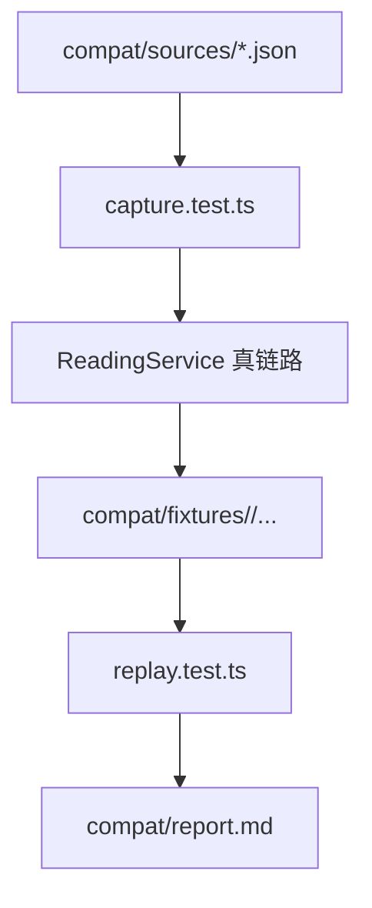

**图表来源**
- [tests/compat/capture.test.ts:1-99](file://tests/compat/capture.test.ts#L1-L99)
- [tests/compat/replay.test.ts:1-33](file://tests/compat/replay.test.ts#L1-L33)

**章节来源**
- [tests/compat/capture.test.ts:1-99](file://tests/compat/capture.test.ts#L1-L99)
- [tests/compat/replay.test.ts:1-33](file://tests/compat/replay.test.ts#L1-L33)

## 依赖关系分析
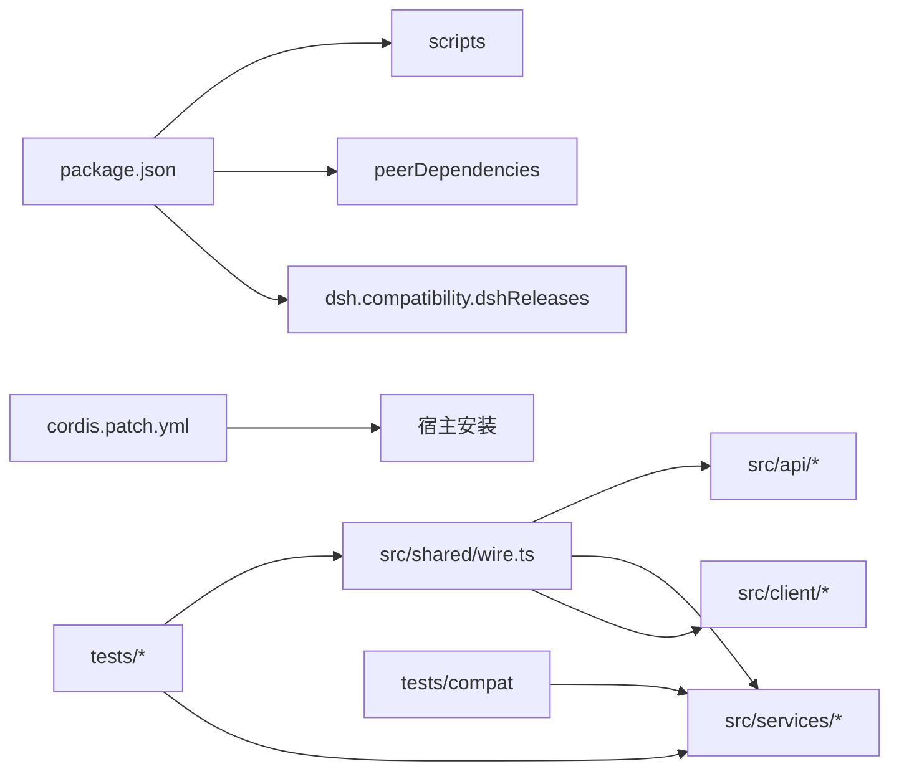

**图表来源**
- [package.json:1-118](file://package.json#L1-L118)
- [src/shared/wire.ts:1-20](file://src/shared/wire.ts#L1-L20)
- [vitest.config.ts:1-11](file://vitest.config.ts#L1-L11)

**章节来源**
- [package.json:1-118](file://package.json#L1-L118)
- [vitest.config.ts:1-11](file://vitest.config.ts#L1-L11)

## 新增书源语法的标准流程
新增书源语法时，不要先改实现再补测试。正确顺序是“fixture → matrix row → 引擎实现 → 跑测试 → 确认 compat 回放”。

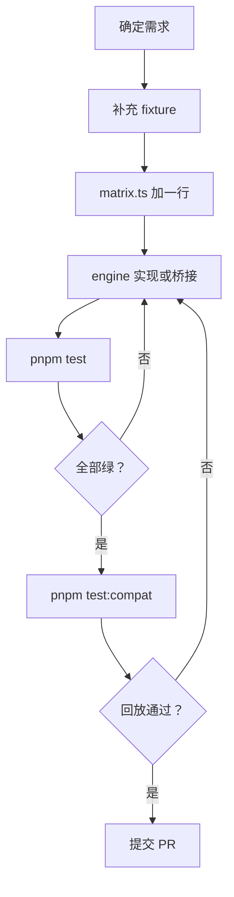

具体步骤：
1. **准备 fixture**：把目标站点的源 JSON、页面或快照放到 `compat/fixtures/<case>`，确保 manifest 与 pages 存在。
2. **更新矩阵**：在 `tests/legado-coverage/matrix.ts` 追加一行，说明该写法属于哪条兼容分母，并在 note 中写明依据与时效戳。
3. **实现引擎或桥接**：优先在纯函数侧实现；如需宿主能力，走 `engine/js-protocol.ts` 协议表。
4. **跑常规测试**：执行 `pnpm test`，覆盖解析、取值、正则行、模板、XPath、JSONPath、变量等用例。
5. **跑兼容回放**：执行 `pnpm test:compat`，确认 `compat/fixtures` 下每个 case 的全链路回放通过。
6. **若需新路由或 wire 字段**：按“调整 wire 契约的同步清单”同步 builders 与 route 测试。

**章节来源**
- [tests/compat/capture.test.ts:1-99](file://tests/compat/capture.test.ts#L1-L99)
- [tests/compat/replay.test.ts:1-33](file://tests/compat/replay.test.ts#L1-L33)
- [docs/architecture.md:1-115](file://docs/architecture.md#L1-L115)

## 调整 wire 契约的同步清单
wire 契约是跨半唯一事实源。修改 `src/shared/wire.ts` 时，必须同步以下位置：

| 需要同步的位置 | 检查项 | 验证方式 |
| --- | --- | --- |
| `src/shared/wire.ts` | 值形状、路由名、常量、构造器 | 类型编译通过 |
| `tests/shared/wire-builders.test.ts` | query 编码、path/segs、SHELF_META、shelfBody | 构造器测试 |
| `tests/api/routes.test.ts` | ROUTES / SEG / paramRoutes 落点 | 路由契约测试 |
| `src/api/*` | dispatch 是否消费新增字段 | 集成测试或手动调端点 |
| `src/client/*` | 浏览器半是否消费新增字段 | 客户端测试或宿主 HMR |
| `src/services/*` | 服务层是否 re-export 或消费 | 类型与行为测试 |
| `compat/fixtures` | 兼容回放是否需要新 fixture | `pnpm test:compat` |

典型风险：
- 新增字段只在 Node 半处理，浏览器半未消费。
- 新增路由只改常量，没改 dispatch 匹配。
- builder 产出的 query 与 dispatch 读取 PARAMS 不同源。
- `LOCAL_SOURCE_ID` 被复制成第二份常量。

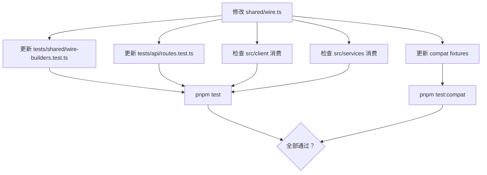

**图表来源**
- [src/shared/wire.ts:1-200](file://src/shared/wire.ts#L1-L200)
- [tests/shared/wire-builders.test.ts:1-161](file://tests/shared/wire-builders.test.ts#L1-L161)
- [tests/api/routes.test.ts:1-200](file://tests/api/routes.test.ts#L1-L200)

**章节来源**
- [src/shared/wire.ts:1-200](file://src/shared/wire.ts#L1-L200)
- [tests/shared/wire-builders.test.ts:1-161](file://tests/shared/wire-builders.test.ts#L1-L161)
- [tests/api/routes.test.ts:1-200](file://tests/api/routes.test.ts#L1-L200)

## 宿主版本与 peer 区间维护
### bump 宿主版本
当宿主发布新版本且本插件需要适配时：
1. 在 `package.json` 的 `dsh.compatibility.dshReleases` 中添加新版本号，标记为 `compatible`。
2. 若宿主 API 或安装机制变化，先写 ADR，再改 `package.json`、`tsdown.config.ts` 或 `cordis.patch.yml`。
3. 运行 `pnpm test` 与 `pnpm test:pack`，确认打包与基础测试不受影响。
4. 如有兼容行为变化，补充或修复 `compat/fixtures` 并跑 `pnpm test:compat`。

### 升级 peer 区间
peer 区间反映宿主生态的可安装范围。升级时注意：
- `@deepseek-ai/dsh-tools` 的 peer 区间是多段并集，用于放行多个 rc/alpha 版本。
- `@deepseek-ai/cordis` 与 `@deepseek-ai/schemastery` 也有独立区间。
- 不要只改 devDependency 而不改 peerDependency，否则 CI 可能装得下，宿主实际环境拒绝。
- 若宿主依赖包对 pnpm 发布冷却闸整 scope 放行，见 `docs/adr/0026`。

### 维护 `cordis.patch.yml`
`cordis.patch.yml` 是宿主安装时的补丁文件，当前内容是将 `@xrn1997/dsh-novel` 插入宿主插件列表。只要插件 id 不变，通常无需改动；只有宿主安装机制或前缀策略变化时才调整。

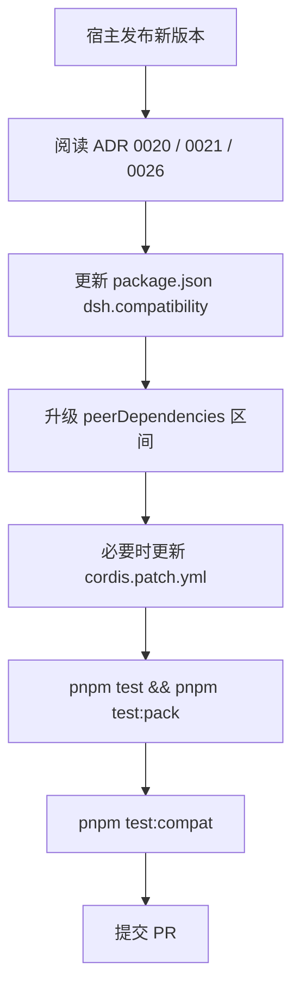

**图表来源**
- [package.json:1-118](file://package.json#L1-L118)
- [cordis.patch.yml:1-3](file://cordis.patch.yml#L1-L3)
- [docs/adr/README.md:1-66](file://docs/adr/README.md#L1-L66)

**章节来源**
- [package.json:1-118](file://package.json#L1-L118)
- [cordis.patch.yml:1-3](file://cordis.patch.yml#L1-L3)
- [docs/adr/README.md:1-66](file://docs/adr/README.md#L1-L66)

## 本地调试命令
| 命令 | 用途 | 注意事项 |
| --- | --- | --- |
| `pnpm build` | 构建 lib 输出 | 生产构建 |
| `pnpm dev` | tsdown watch 开发模式 | 浏览器半靠宿主 HMR，Node 半重启宿主 |
| `pnpm test` | 运行常规 Vitest 测试 | 排除 `tests/compat/**` |
| `pnpm test:watch` | 交互式 watch 模式 | 开发阶段常用 |
| `pnpm test:compat` | 运行兼容回放 | 不触发采集，只回放已有 fixture |
| `pnpm test:pack` | 构建后跑打包测试 | 需要先 build |
| `pnpm typecheck` | TypeScript 类型检查 | 不改类型也要过 |
| `COMPAT_CAPTURE=1 pnpm test:compat` | 重新采集 fixture | 会发起真实网络请求 |

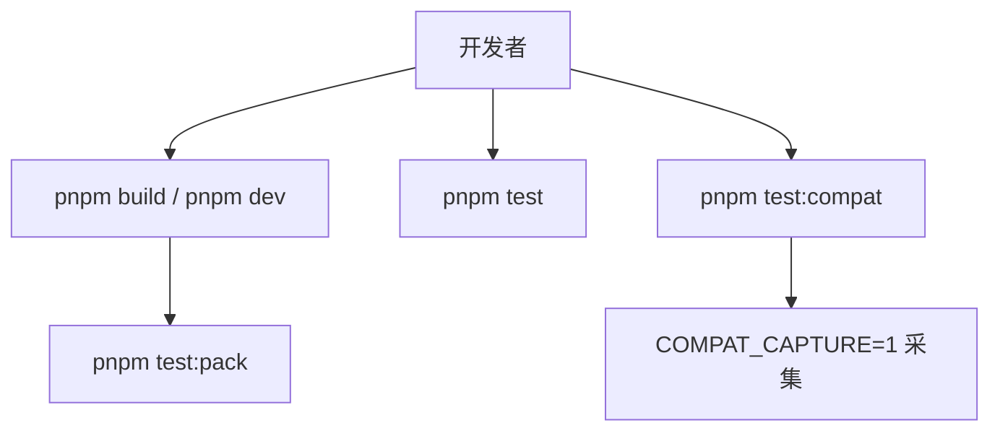

**图表来源**
- [package.json:1-118](file://package.json#L1-L118)
- [vitest.config.ts:1-11](file://vitest.config.ts#L1-L11)
- [vitest.compat.config.ts:1-11](file://vitest.compat.config.ts#L1-L11)

**章节来源**
- [package.json:1-118](file://package.json#L1-L118)
- [vitest.config.ts:1-11](file://vitest.config.ts#L1-L11)
- [vitest.compat.config.ts:1-11](file://vitest.compat.config.ts#L1-L11)

## PR 提交规范
建议每次 PR 聚焦一个事实变更，并按以下顺序自检：

1. **明确事实源**：这条语义的主人在哪里？是否只改了一处？
2. **补充测试**：没有矩阵行的兼容写法先加 matrix row；没有 fixture 的站点行为先加采集。
3. **wire 同步**：改了 wire 就同步 builders 与 route 测试。
4. **类型检查**：`pnpm typecheck` 必须通过。
5. **常规测试**：`pnpm test` 全部通过。
6. **兼容回放**：涉及站点行为或规则语法时，`pnpm test:compat` 通过。
7. **提交信息**：说明改了什么、为什么、对应哪个 ADR 或矩阵行。

不要做的事：
- 不要在 README、architecture、代码注释里抄两份 truth。
- 不要猜测报错原因，先看测试断言、日志和矩阵行。
- 不要把 wire 形状拆成 Node 半与浏览器半两份。
- 不要跳过 compat 回放直接合入站点相关改动。

**章节来源**
- [docs/architecture.md:1-115](file://docs/architecture.md#L1-L115)
- [tests/compat/replay.test.ts:1-33](file://tests/compat/replay.test.ts#L1-L33)

## ADR 决策记录模板
新增 ADR 时遵循仓库现有命名与索引规则：
- 文件名：`docs/adr/NNNN-短标题.md`，编号只追加，不复用旧号。
- 内容聚焦“难逆 + 无上下文会让人惊讶 + 当初有替代方案”。
- 如果推翻旧决策，标 `superseded`，新篇引用旧篇。
- 在 `docs/adr/README.md` 的索引表中追加一行，说明这篇回答的问题。

推荐模板结构：
- **背景**：当时面临的约束与问题。
- **决策**：最终选择是什么。
- **替代方案**：曾被认真考虑但最终否决的方案。
- **后果**：收益、代价、限制。
- **关联**：对应 architecture 章节、matrix 行、wire 字段、host contract 或 PR。
- **生效时间**：何时进入主分支。

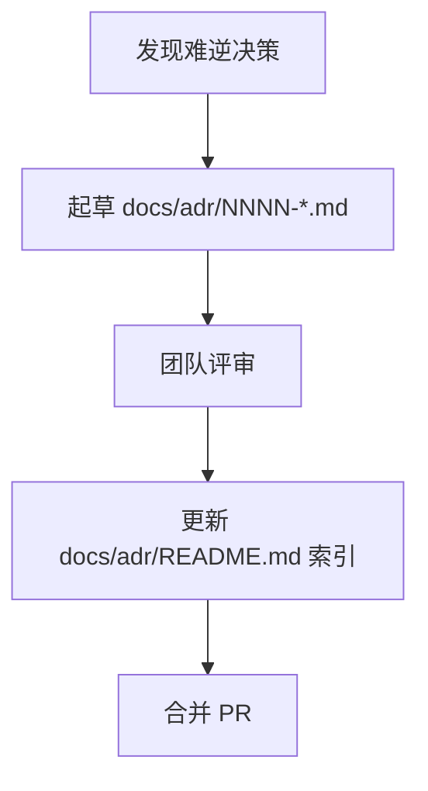

**图表来源**
- [docs/adr/README.md:1-66](file://docs/adr/README.md#L1-L66)

**章节来源**
- [docs/adr/README.md:1-66](file://docs/adr/README.md#L1-L66)

## 故障排查
### 测试红但不清楚原因
- 先看 `pnpm test` 的具体断言失败位置。
- 如果是路由问题，检查 `tests/api/routes.test.ts` 中的落点判据。
- 如果是 wire 字段不一致，检查 `tests/shared/wire-builders.test.ts`。
- 如果是站点行为差异，检查 `tests/legado-coverage/matrix.ts` 是否已有该行。

### 路由报 404 或 405
- 404 可能是未知路由，也可能是业务层面 404（如源不存在）。
- 405 通常是 POST-only 路由用了 GET，或反之。
- 确认 `ROUTES.*` 与 `paramRoutes.*` 与 dispatch 匹配一致。

### compat 回放失败
- 先确认 `compat/fixtures/<case>` 是否存在。
- 检查 manifest 的 keyword 是否与采集一致。
- 若 fixture 缺失，先用 `COMPAT_CAPTURE=1 pnpm test:compat` 重新采集。
- 回放失败时，优先怀疑“采集与回放断的不是同一批”。

### peer 依赖冲突
- 检查 `package.json` 的 `peerDependencies` 与 `devDependencies`。
- 确认 `dsh.compatibility.dshReleases` 是否包含目标宿主版本。
- 若宿主安装失败，检查 `cordis.patch.yml` 与 ADR 0020、0021、0026。

**章节来源**
- [tests/api/routes.test.ts:1-200](file://tests/api/routes.test.ts#L1-L200)
- [tests/shared/wire-builders.test.ts:1-161](file://tests/shared/wire-builders.test.ts#L1-L161)
- [tests/compat/capture.test.ts:1-99](file://tests/compat/capture.test.ts#L1-L99)
- [tests/compat/replay.test.ts:1-33](file://tests/compat/replay.test.ts#L1-L33)
- [package.json:1-118](file://package.json#L1-L118)

## 结论
本仓库的协作核心可以浓缩为几条原则：

- **矩阵即真相**：legado 兼容写法以 `tests/legado-coverage/matrix.ts` 的行为准，不靠口头约定。
- **报错不猜测**：先看测试断言、日志、wire 形状、dispatch 落点，再下结论。
- **单一事实源 ReadingService**：所有业务动词收敛在门面，外部三面共享同一条链路。
- **wire 是唯一契约**：值形状、路由名、构造器、常量都集中在 `src/shared/wire.ts`。
- **测试驱动变更**：fixture → matrix row → 引擎实现 → `pnpm test` → `pnpm test:compat`。
- **契约变更必须同步**：wire 改了，builders 与 route 测试必须跟上。
- **宿主版本谨慎升级**：先读 ADR，再改 peer 区间与 `dsh.compatibility`，最后跑完整测试。
- **决策要写进 ADR**：难逆、反直觉、有替代方案的决定，必须留痕。

遵循这些约定，贡献者可以在不破坏浏览器半与 Node 半契约的前提下，安全扩展书源语法、修复兼容行为，并与宿主生态稳定对接。