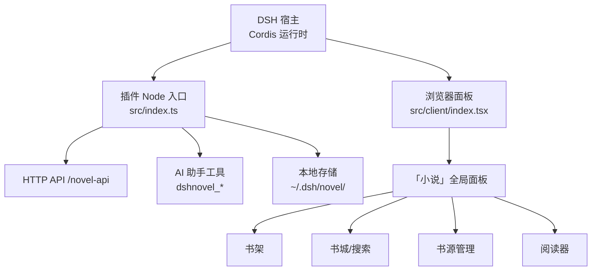
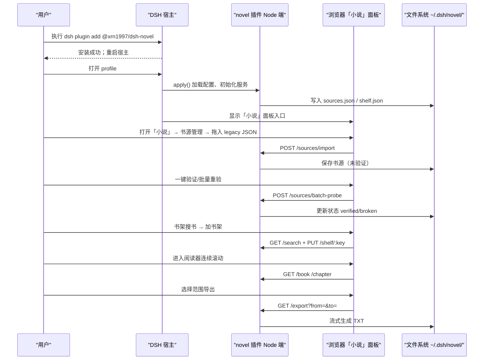
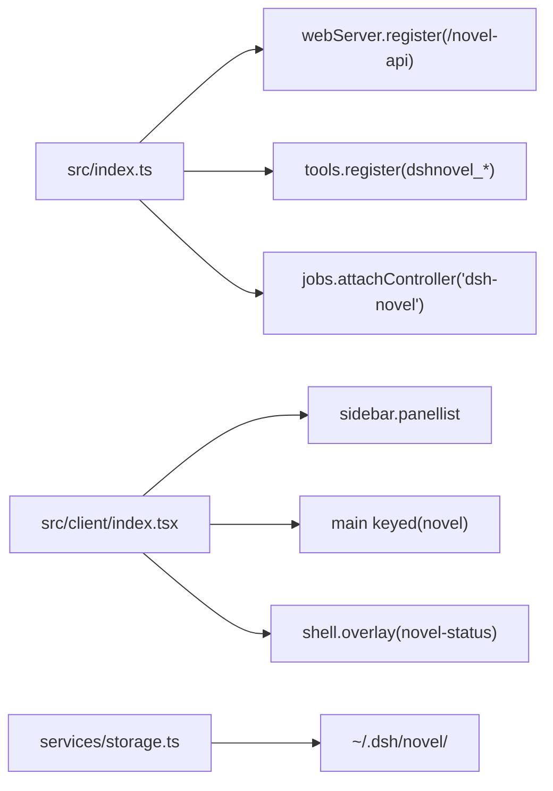

# 快速开始

<cite>
**本文引用的文件**
- [package.json](file://package.json)
- [README.md](file://README.md)
- [src/index.ts](file://src/index.ts)
- [src/client/index.tsx](file://src/client/index.tsx)
- [src/services/storage.ts](file://src/services/storage.ts)
</cite>

## 目录
1. [引言](#引言)
2. [项目结构](#项目结构)
3. [核心组件](#核心组件)
4. [架构总览](#架构总览)
5. [详细步骤：从安装到导出章节](#详细步骤从安装到导出章节)
6. [依赖关系分析](#依赖关系分析)
7. [性能与默认行为](#性能与默认行为)
8. [排查清单](#排查清单)
9. [结论](#结论)

## 引言
本指南面向第一次接触 DSH novel 插件的用户，按操作顺序讲解如何在 DeepSeek Harness（DSH）中安装并启用小说插件、导入 legacy JSON 书源、批量探测、搜索、加书架、连续滚动阅读以及导出章节。文档同时说明关键状态变化、默认数据落盘位置 `~/.dsh/novel/`，并提供最小可复现配置示例。

## 项目结构
DSH novel 插件由 Node 服务端与浏览器面板两半组成：
- Node 侧负责 HTTP API、书源解析、代理、缓存、书架/本地书、后台任务、AI 工具注册。
- 浏览器侧把「小说」注册为全局面板，提供书架、书城、书源管理、阅读器界面。

图表来源
- [src/index.ts:1-200](file://src/index.ts#L1-L200)
- [src/client/index.tsx:1-84](file://src/client/index.tsx#L1-L84)

节内引用
- [src/index.ts:1-200](file://src/index.ts#L1-L200)
- [src/client/index.tsx:1-84](file://src/client/index.tsx#L1-L84)

## 核心组件
- 插件入口与配置校验：声明注入项 `webServer`、`tools`、`jobs`，完成路由 `/novel-api`、AI 工具、后台任务控制器注册。
- 浏览器面板入口：将「小说」注册为侧栏图标与中央面板，id/key 均为 `novel`，并挂载常驻状态层。
- 数据存储：默认根目录 `~/.dsh/novel/`，提供 JSON 原子写、损坏备份、进程内防抖合并写等能力。

节内引用
- [src/index.ts:1-200](file://src/index.ts#L1-L200)
- [src/client/index.tsx:1-84](file://src/client/index.tsx#L1-L84)
- [src/services/storage.ts:1-129](file://src/services/storage.ts#L1-L129)

## 架构总览

图表来源
- [src/index.ts:1-200](file://src/index.ts#L1-L200)
- [src/client/index.tsx:1-84](file://src/client/index.tsx#L1-L84)
- [src/services/storage.ts:1-129](file://src/services/storage.ts#L1-L129)

## 详细步骤：从安装到导出章节

### 步骤一：安装支持 DSH 插件生态的宿主
1. 使用命令在目标 profile 安装插件：
   - `dsh plugin --profile <profile> add @xrn1997/dsh-novel`
2. 重启宿主后，左侧栏出现「小说」面板入口（图标行）。
3. 如果 profile 的 bundles 包含 `@deepseek-ai/dsh-web-app`，则可在中央面板打开书架/书城/书源管理三个 tab；否则只挂 Node 端和六个 AI 工具。

关键状态变化
- 安装完成后宿主加载插件；浏览器侧通过 slots 机制注册「小说」面板。

节内引用
- [README.md:27-53](file://README.md#L27-L53)
- [src/client/index.tsx:1-84](file://src/client/index.tsx#L1-L84)

### 步骤二：在 DSH 中启用 novel 插件
- 若宿主版本与插件 peer 区间不匹配，`dsh plugin add` 会拒绝安装。
- 从源码安装时，首次可能需先批准构建脚本再重试。

节内引用
- [README.md:33-53](file://README.md#L33-L53)
- [package.json:54-77](file://package.json#L54-L77)

### 步骤三：打开「小说」面板
- 点击左侧栏「小说」图标，即可进入书架/书城/书源管理界面。
- 面板 id 与 main 槽 key 均为 `novel`，两个座位必须同批注册。

节内引用
- [src/client/index.tsx:1-84](file://src/client/index.tsx#L1-L84)

### 步骤四：拖入 legacy JSON 书源
- 进入「小说」→「书源管理」tab，选择 `.json` 文件或粘贴 legado 书源 JSON。
- 导入是服务端后台任务，关闭页面不会中断；同址自动去重，坏源/未验证源会被新条替换。
- 初始状态为 **unverified**（未验证），需要后续批量探测。

终端/面板示意
- 书源管理列表新增一条记录，状态列显示“未验证”。

节内引用
- [README.md:55-68](file://README.md#L55-L68)

### 步骤五：执行批量探测
- 在「待办收件箱」中选择未验证或已坏的书源，点击“一键验证”或“批量重验”。
- 后端并发限流（默认并发 5），逐源发起真实请求进行探针。
- 状态推进：
  - unverified → verified（可用）
  - unverified → broken（失败）
  - 任意集合均可发起探测。

关键状态变化
- 书源状态带更新；待办收件箱处理完后自动消解。

节内引用
- [README.md:55-68](file://README.md#L55-L68)
- [src/index.ts:1-200](file://src/index.ts#L1-L200)

### 步骤六：用关键词搜索一本书
- 在「书架」tab 顶部输入书名/作者进行搜索。
- 搜索结果在服务端聚合，进度实时推送（SSE；不可用时回落轮询），可中途停止且保留已搜结果。
- 搜索结果按源分组，单源失败不影响其他源。

搜索任务阶段推进
- plan → running → completed/canceled
- 前端可读取增量快照，切走界面不丢结果。

节内引用
- [README.md:55-68](file://README.md#L55-L68)

### 步骤七：加入书架并开始连续滚动阅读
- 搜索结果中点击封面进入阅读器。
- 阅读器支持连续滚动：滚到底自动预取下一章；可调整字号、行距、栏宽、纸张色、主题。
- 阅读进度自动记住，书架条目附带来源信息。

节内引用
- [README.md:55-68](file://README.md#L55-L68)

### 步骤八：导出章节
- 在阅读器中选择章节范围，点击导出。
- 服务端流式返回 TXT，响应头包含总章节数与范围；连接断开即停止抓取。
- 仅导出文字内容，图片以占位形式输出。

节内引用
- [README.md:96-114](file://README.md#L96-L114)

## 依赖关系分析
- 插件 Node 入口向宿主注入三类能力：webServer、tools、jobs。
- 浏览器面板通过 slots 注入 sidebar.panellist 与 main keyed 槽，并挂载 shell.overlay 常驻状态层。
- 所有读写最终落到 `~/.dsh/novel/`，JSON 使用原子写与损坏备份策略。

图表来源
- [src/index.ts:1-200](file://src/index.ts#L1-L200)
- [src/client/index.tsx:1-84](file://src/client/index.tsx#L1-L84)
- [src/services/storage.ts:1-129](file://src/services/storage.ts#L1-L129)

节内引用
- [src/index.ts:1-200](file://src/index.ts#L1-L200)
- [src/client/index.tsx:1-84](file://src/client/index.tsx#L1-L84)
- [src/services/storage.ts:1-129](file://src/services/storage.ts#L1-L129)

## 性能与默认行为
- 数据默认落盘于 `~/.dsh/novel/`，不会上传云端。
- 目录/正文缓存默认上限 200MB，LRU 淘汰。
- 搜索超时默认 15000ms；JS 沙箱预算默认 15000ms；搜索并发默认 5。
- Windows 上文件 rename 串行化，避免并发 EPERM。

节内引用
- [README.md:116-127](file://README.md#L116-L127)
- [src/services/storage.ts:1-129](file://src/services/storage.ts#L1-L129)

## 排查清单

### Windows 系统代理未生效
- 现象：搜索结果全是“网络错误”，或正文空白。
- 原因：Node 使用 undici 发请求，不会读取系统代理设置。
- 解决：显式配置 `proxyUrl`，如 Clash 常用端口。缺省探测顺序为环境变量 → Windows 系统代理 → 直连。

节内引用
- [README.md:129-138](file://README.md#L129-L138)
- [src/index.ts:1-200](file://src/index.ts#L1-L200)

### bookSourceType 不是 text
- 现象：搜索无结果或报错。
- 原因：当前仅支持文本型书源；图文书在 AI 工具中会以占位输出。
- 建议：确认书源类型，优先使用文本型源头。

节内引用
- [README.md:70-95](file://README.md#L70-L95)

### JS 沙箱超时
- 现象：探针、搜索或正文链路报超时。
- 原因：legado 多请求目录脚本需要秒级预算；默认 15000ms。
- 解决：增大 `jsTimeoutMs`；确认站点签名/ajax 脚本复杂度。

节内引用
- [README.md:80-95](file://README.md#L80-L95)
- [src/index.ts:1-200](file://src/index.ts#L1-L200)

### 浏览器面板未挂载
- 现象：左侧栏没有「小说」图标，或点击无效。
- 原因：
  - profile 缺少 `@deepseek-ai/dsh-web-app` bundle。
  - 浏览器侧双注册（sidebar.panellist 与 main keyed）不同步。
- 解决：确认宿主 bundle 配置；检查插槽注入是否成功。

节内引用
- [README.md:33-53](file://README.md#L33-L53)
- [src/client/index.tsx:1-84](file://src/client/index.tsx#L1-L84)

## 结论
通过以上步骤，你可以在 DSH 中完成从安装、启用、导入 legacy JSON 书源、批量探测、搜索、加书架、连续滚动阅读到导出章节的完整流程。数据始终留在本机 `~/.dsh/novel/`，不受云端影响。遇到网络、代理、沙箱或面板挂载问题时，可对照排查清单逐项定位。