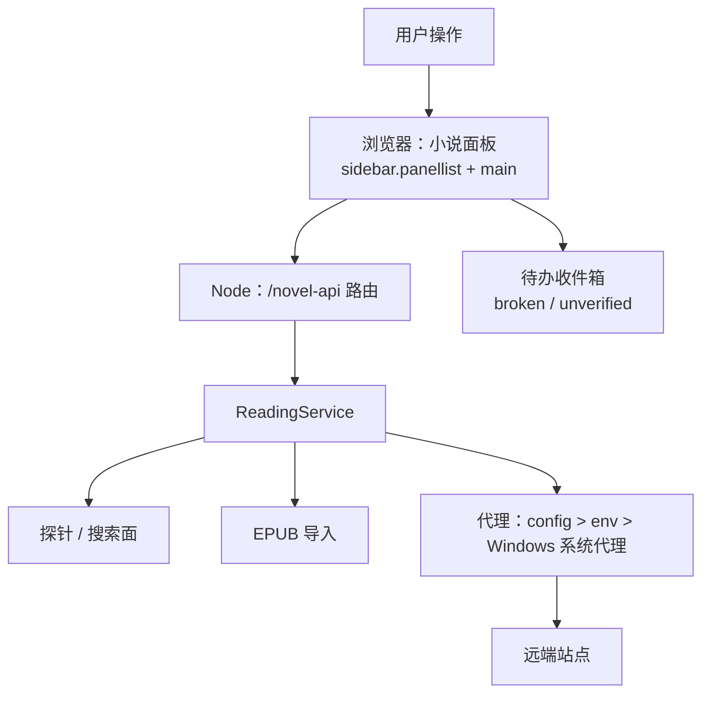
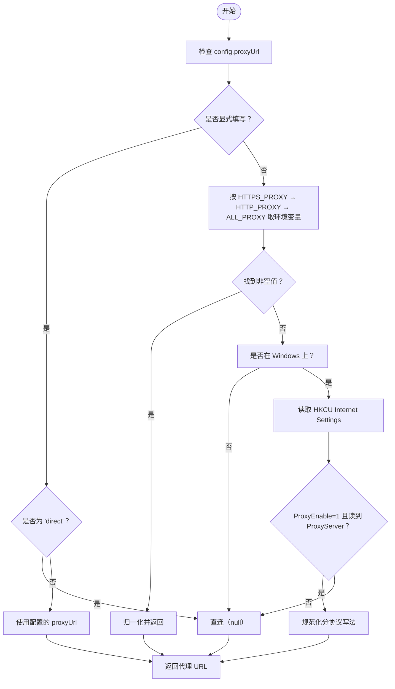
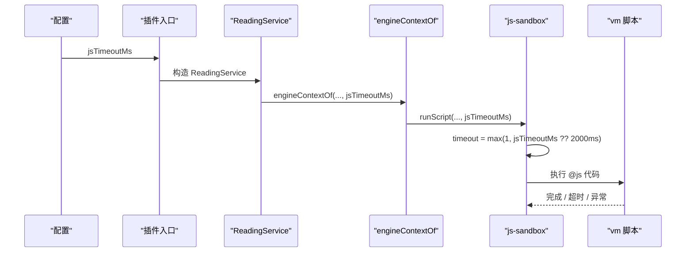
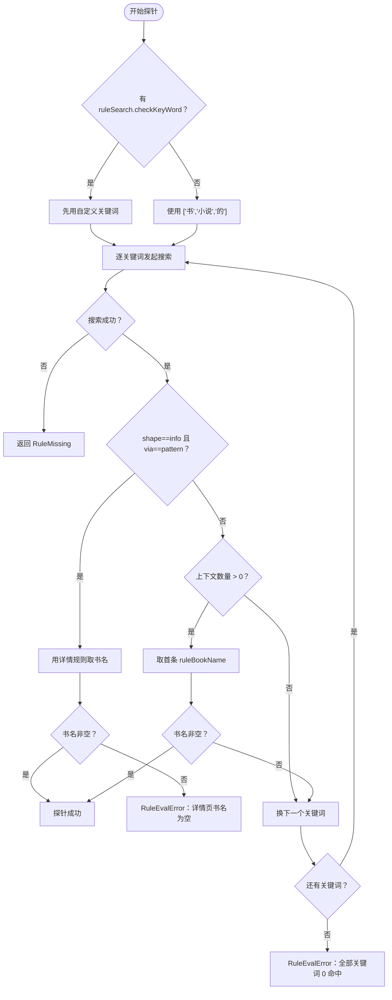
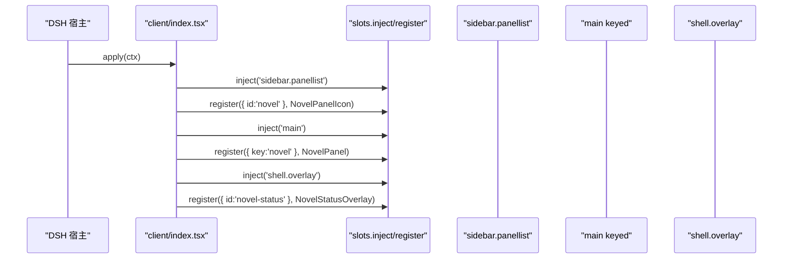
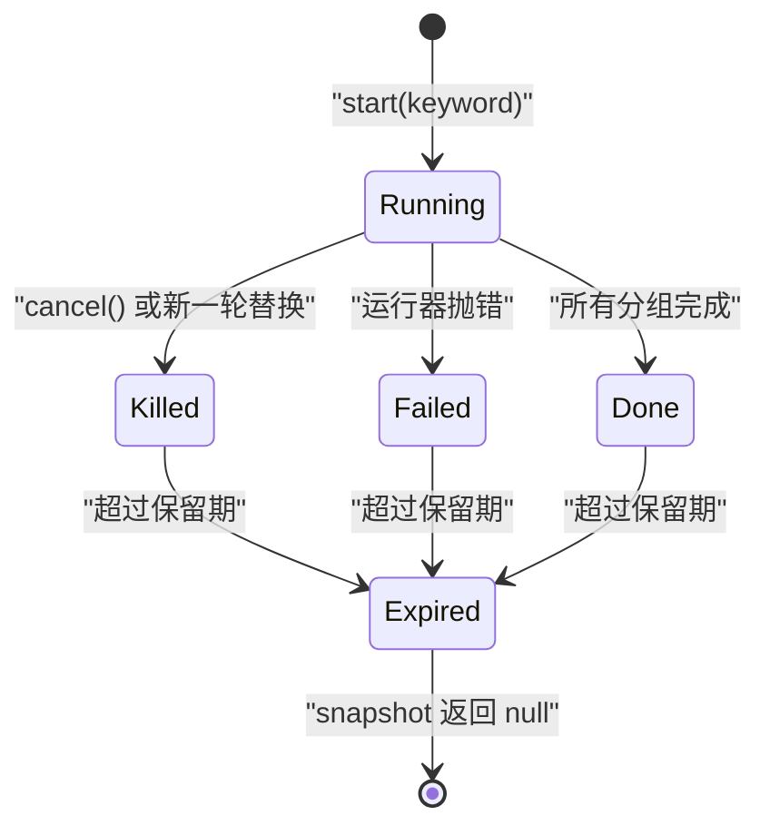
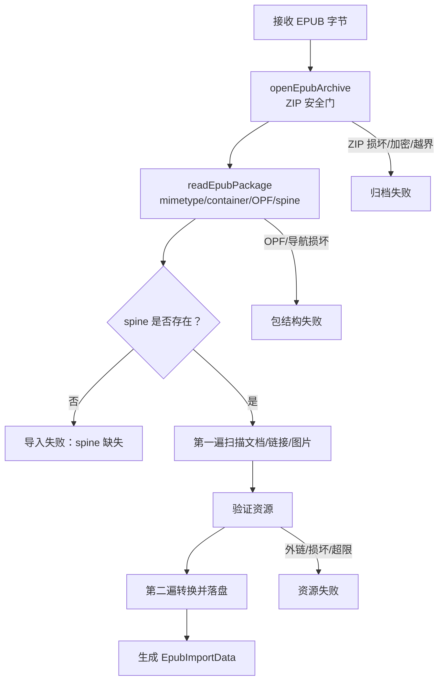

# 故障排查

<cite>
**本文引用的文件**
- [src/index.ts](file://src/index.ts)
- [src/services/proxy.ts](file://src/services/proxy.ts)
- [src/engine/js-sandbox.ts](file://src/engine/js-sandbox.ts)
- [src/engine/types.ts](file://src/engine/types.ts)
- [src/services/bridge.ts](file://src/services/bridge.ts)
- [src/services/probe.ts](file://src/services/probe.ts)
- [src/services/search-job.ts](file://src/services/search-job.ts)
- [src/client/source-inbox.ts](file://src/client/source-inbox.ts)
- [src/client/source-inbox-ui.ts](file://src/client/source-inbox-ui.ts)
- [src/client/views/SettingsSection.tsx](file://src/client/views/SettingsSection.tsx)
- [src/client/index.tsx](file://src/client/index.tsx)
- [src/api/dispatch.ts](file://src/api/dispatch.ts)
- [src/services/errors.ts](file://src/services/errors.ts)
- [src/engine/errors.ts](file://src/engine/errors.ts)
- [src/services/epub/import.ts](file://src/services/epub/import.ts)
- [src/services/epub/archive.ts](file://src/services/epub/archive.ts)
- [src/services/epub/package.ts](file://src/services/epub/package.ts)
- [src/services/epub/resources.ts](file://src/services/epub/resources.ts)
- [src/services/epub/errors.ts](file://src/services/epub/errors.ts)
</cite>

## 目录
1. [使用方式与定位原则](#使用方式与定位原则)
2. [症状一：代理连接失败](#症状一代理连接失败)
3. [症状二：JS 沙箱超时](#症状二js-沙箱超时)
4. [症状三：书源探针失败（RuleEvalError vs FetchError）](#症状三书源探针失败-ruleevalerror-vs-fetcherror)
5. [症状四：浏览器面板未显示](#症状四浏览器面板未显示)
6. [症状五：搜索结果中断（cancelled vs failed、search timeout）](#症状五搜索结果中断-cancelled-vs-failedsearch-timeout)
7. [症状六：EPUB 导入失败](#症状六epub-导入失败)
8. [调试技巧清单](#调试技巧清单)
9. [预防措施](#预防措施)

## 使用方式与定位原则

本插件的 Node 端通过 Cordis 插件机制挂载 `/novel-api`，浏览器半在 DSH 宿主中注册「小说」全局面板。排查时先分清三层：

| 层 | 职责 | 常见症状 | 首选观察点 |
|---|---|---|---|
| Node 服务入口 | 读取配置、选择代理、创建 `ReadingService`、注册 API 路由与工具 | 端口无响应、路由未注册、系统代理不生效 | 启动日志 `[dsh-novel] 出站代理`、重复 apply 警告 |
| 引擎与请求层 | 规则求值、@js 沙箱、fetch 出站、错误分类 | 探针失败、搜索中断、正文抓取失败 | 探针错误码、`FetchError`/`RuleEvalError`、沙箱日志 |
| 浏览器面板 | 侧栏图标 + main keyed slot、待办收件箱、任务状态 | 面板不出现、inbox 不渲染、react/react-dom 未就绪 | DSH 控制台、插槽注入顺序、peer 依赖加载 |



**图示来源**
- [src/client/index.tsx:50-84](file://src/client/index.tsx#L50-L84)
- [src/index.ts:85-201](file://src/index.ts#L85-L201)
- [src/api/dispatch.ts:39-67](file://src/api/dispatch.ts#L39-L67)
- [src/services/proxy.ts:1-76](file://src/services/proxy.ts#L1-L76)

**章节来源**
- [src/index.ts:85-201](file://src/index.ts#L85-L201)
- [src/client/index.tsx:50-84](file://src/client/index.tsx#L50-L84)
- [src/api/dispatch.ts:39-67](file://src/api/dispatch.ts#L39-L67)

## 症状一：代理连接失败

### 症状表现
- 浏览器能打开目标站，但读者插件提示网络错误或返回空内容。
- 直连外网出口被 302 跳转，走本机代理反而拿到真实页面。
- 设置里没写 `proxyUrl`，但某些站点不可用。

### 原因分析
Node 使用的 fetch（undici）不读系统代理；Windows 下必须显式接管 `HKCU\Software\Microsoft\Windows\CurrentVersion\Internet Settings` 中的 `ProxyEnable` 与 `ProxyServer`。取值优先级为：

1. `config.proxyUrl`（显式值或 `'direct'`）
2. `HTTPS_PROXY` / `HTTP_PROXY` / `ALL_PROXY`（大小写不敏感，取首个非空）
3. Windows 系统代理（仅 win32 且 `ProxyEnable=1`）
4. 直连（null）



**图示来源**
- [src/services/proxy.ts:1-76](file://src/services/proxy.ts#L1-L76)
- [src/index.ts:152-170](file://src/index.ts#L152-L170)

### 定位日志
- 启动期会打印：`[dsh-novel] 出站代理: http://...`
- 如果没打印，说明最终代理为 null。
- Windows 下 `reg` 调用失败、`ProxyEnable≠1`、或 `ProxyServer` 解析为空都会回退到直连。

### 修复步骤
1. 确认 `config.proxyUrl`：
   - 需要强制直连时设为 `'direct'`。
   - 需要固定代理时设为完整 URL，如 `http://127.0.0.1:7897`。
2. 若依赖环境变量，确保至少存在 `HTTPS_PROXY` 或 `HTTP_PROXY`。
3. 若依赖 Windows 系统代理：
   - 打开系统代理开关。
   - 确认 `HKCU\Software\Microsoft\Windows\CurrentVersion\Internet Settings` 中 `ProxyEnable` 为 1。
   - 确认 `ProxyServer` 可被正则匹配。
4. 对分协议写法 `http=...;https=...`，优先取 https，再退化 http。
5. 重启 DSH 宿主使插件重新 apply。

### 预防措施
- 不要同时混用系统代理、环境变量和 `config.proxyUrl`，除非你明确知道优先级。
- 对只允许外网出口、不允许本机代理的站点，显式设置 `proxyUrl: 'direct'`。
- 不要把带 scheme 的值写成裸 `host:port`——`normalizeProxyServer` 会补 `http://`，但显式写清更清晰。

**章节来源**
- [src/services/proxy.ts:1-76](file://src/services/proxy.ts#L1-L76)
- [src/index.ts:152-170](file://src/index.ts#L152-L170)

## 症状二：JS 沙箱超时

### 症状表现
- 探针验证报 @js 执行失败。
- 目录/正文面触发 `@js:` 规则后长时间无响应，随后失败。
- 日志中出现未处理 rejection 或进程崩溃。

### 原因分析
@js 代码运行在 Node vm 沙箱中，超时由两个值决定：

| 名称 | 默认值 | 作用 |
|---|---:|---|
| `DEFAULT_JS_TIMEOUT_MS` | 2000 ms | 引擎层回退值 |
| `DEFAULT_JS_BUDGET_MS` | 15000 ms | 服务层默认 js 预算 |
| `config.jsTimeoutMs` | 继承 `DEFAULT_JS_BUDGET_MS` | 用户可覆盖的入口 |

实际流程：

1. `index.ts` 校验 `jsTimeoutMs > 0`，并把默认值传给 `ReadingService`。
2. `ReadingService` 把 `jsTimeoutMs` 透传到 `engineContextOf`。
3. `engineContextOf` 传入 `runScript`。
4. `js-sandbox.ts` 计算 `timeout = Math.max(1, ctx.jsTimeoutMs ?? DEFAULT_JS_TIMEOUT_MS)`。
5. 脚本内自建 fire-and-forget Promise rejection 会被 `ensureUnhandledGuard` 捕获，避免 Node 20+ 直接杀掉 dsh 进程。



**图示来源**
- [src/index.ts:54-99](file://src/index.ts#L54-L99)
- [src/engine/types.ts:65-65](file://src/engine/types.ts#L65-L65)
- [src/engine/js-sandbox.ts:84-84](file://src/engine/js-sandbox.ts#L84-L84)
- [src/engine/js-sandbox.ts:622-622](file://src/engine/js-sandbox.ts#L622-L622)
- [src/services/bridge.ts:123-166](file://src/services/bridge.ts#L123-L166)

### 定位日志
- 沙箱顶层 unhandled rejection 会打印：`[dsh-novel] 沙箱脚本产生未处理的 rejection（已捕获，不影响进程）:`
- 超时会作为引擎错误向上抛出，归类为 `rule-eval`。
- 如果脚本内部做了异步请求但未等待，可能表现为“看起来像卡住”，而不是标准超时。

### 修复步骤
1. 在宿主配置中增大 `jsTimeoutMs`。
2. 如果只是个别复杂源不稳定，先在源级 `bookSourceComment` 或 jsLib 中优化逻辑。
3. 缩小脚本规模：
   - 拆出多次 `java.ajax` 调用的循环。
   - 去掉不必要的日志输出。
   - 避免在 @js 里做重型 JSON 转换或大字符串拼接。
4. 若看到 unhandled rejection，重点查脚本内 fire-and-forget 的 Promise，给它加 catch。

### 预防措施
- 不要长期依赖极小默认值；官方默认已是 15000 ms，适合多请求目录脚本。
- 对频繁触发的 @js 规则，优先优化算法，其次才提高超时。
- 保持 `jsTimeoutMs > 0`，否则加载期配置校验会直接失败。

**章节来源**
- [src/index.ts:54-99](file://src/index.ts#L54-L99)
- [src/engine/types.ts:65-65](file://src/engine/types.ts#L65-L65)
- [src/engine/js-sandbox.ts:84-84](file://src/engine/js-sandbox.ts#L84-L84)
- [src/engine/js-sandbox.ts:622-622](file://src/engine/js-sandbox.ts#L622-L622)
- [src/services/bridge.ts:123-166](file://src/services/bridge.ts#L123-L166)

## 症状三：书源探针失败（RuleEvalError vs FetchError）

### 症状表现
- 书源管理页显示坏源或未验证。
- 单源试跑返回错误。
- 批量重验结果不稳定。

### 原因分析
探针 `probeSource` 会真发一次搜索请求，并按关键词重试：

| 错误类型 | 含义 | 典型原因 |
|---|---|---|
| `RuleMissing` | 缺规则 | 没有 `ruleBookList`、`ruleDetailName` 等必要规则 |
| `RuleEvalError` | 规则求值失败 | 规则命中 0、书名解析为空、详情页标题为空 |
| `FetchError` | 网络/解码失败 | 超时、HTTP 非 2xx、编码无法解码 |

探针逻辑：
1. 优先使用 `ruleSearch.checkKeyWord`，否则用 `['书', '小说', '的']`。
2. 对每个关键词调用搜索面。
3. 如果搜索响应即详情页（`shape === 'info' && via === 'pattern'`），再用详情规则取书名。
4. 如果列表为空或 info 形态，换下一个关键词。
5. 所有关键词都 0 命中则判坏源。
6. 外部异常被包装成探针错误对象，错误码来自 `searchErrorCodeOf`。



**图示来源**
- [src/services/probe.ts:1-71](file://src/services/probe.ts#L1-L71)

### 定位日志
- 探针错误对象包含 `code` 与 `message`。
- `RuleEvalError` 的 message 通常会点名具体规则片段，例如 `ruleBookName` 或 `ruleDetailName`。
- `FetchError` 会携带 `url` 与可选 `status`。
- 书源待办收件箱会把 broken 与 unverified 分成两张卡。

### 修复步骤
1. 如果是 `RuleMissing`：
   - 补全缺失的规则字段。
   - 确认 `ruleBookList`、`ruleBookName`、`ruleDetailName` 等按需存在。
2. 如果是 `RuleEvalError`：
   - 查看 message 中点名的规则片段。
   - 确认规则确实能命中目标 HTML。
   - 如果是详情页模式，确认详情规则能取出书名。
3. 如果是 `FetchError`：
   - 先看 `url` 是否正确。
   - 再看 `status` 是否为 2xx。
   - 结合代理问题排查（见症状一）。
4. 打开书源 inbox，点击「批量重验」或「一键验证」。

### 预防措施
- 不要只靠探针判断源可用：它只验证搜索面。
- 规则要区分“站点屏蔽了通用词”和“源本身坏了”。
- 对详情页模式的源，确认 `ruleDetailName` 能在详情页解析出书名。

**章节来源**
- [src/services/probe.ts:1-71](file://src/services/probe.ts#L1-L71)
- [src/services/errors.ts:1-129](file://src/services/errors.ts#L1-L129)
- [src/engine/errors.ts:1-38](file://src/engine/errors.ts#L1-L38)
- [src/client/source-inbox.ts:1-69](file://src/client/source-inbox.ts#L1-L69)

## 症状四：浏览器面板未显示

### 症状表现
- DSH 侧栏没有「小说」图标。
- 点击后中央面板空白。
- 控制台报错 react/react-dom 找不到。
- 待办收件箱不渲染。

### 原因分析
浏览器半入口声明硬依赖 `slots` 与 `sessions`，并在同一 effect 中同步双注册：

1. `sidebar.panellist`：注册图标组件，id 为 `novel`。
2. `main`：注册 keyed panel，key 为 `novel`。
3. `shell.overlay`：注册常驻任务状态层。

官方契约要求 sidebar 与 main 同批注册；选中一个缺失的 main entry 会抛错。因此必须保证：

- 宿主提供 `slots.inject` 与 `slots.register`。
- react/react-dom 作为 peer 依赖已加载。
- 插件 `apply` 在宿主初始化过程中被执行。



**图示来源**
- [src/client/index.tsx:1-84](file://src/client/index.tsx#L1-L84)

### 定位日志
- 如果 react/react-dom 未就绪，控制台会出现模块解析错误。
- 如果 slots 未注入，`ctx.slots.inject` 会抛 TypeError。
- 如果面板重复启用，Node 端会打印 duplicate apply 警告；浏览器端取决于宿主如何处理重复注册。

### 修复步骤
1. 确认宿主已安装 react 与 react-dom 作为 peer 依赖。
2. 确认 DSH 宿主版本支持 `slots.inject` 与 `slots.register`。
3. 确认「小说」插件已启用且未被重复禁用/启用。
4. 如果侧栏图标出现但主面板空白：
   - 检查 `main` keyed slot 是否注册成功。
   - 检查 `NovelView` 渲染是否抛错。
5. 如果待办收件箱不渲染：
   - 检查 `SettingsSection` 是否加载。
   - 检查 source list 是否加载失败。
   - 检查 inbox muted store 是否吞掉当前签名。

### 预防措施
- 不要在同一个宿主实例中重复启用插件。
- 升级宿主前先确认插件对 slots 契约的依赖。
- 不要把面板逻辑放到延迟 effect 里；sidebar 与 main 必须同步注册。

**章节来源**
- [src/client/index.tsx:1-84](file://src/client/index.tsx#L1-L84)
- [src/client/views/SettingsSection.tsx:1-200](file://src/client/views/SettingsSection.tsx#L1-L200)
- [src/client/source-inbox.ts:1-69](file://src/client/source-inbox.ts#L1-L69)
- [src/client/source-inbox-ui.ts:1-40](file://src/client/source-inbox-ui.ts#L1-L40)

## 症状五：搜索结果中断（cancelled vs failed、search timeout）

### 症状表现
- 聚合搜索中途停止。
- 已经搜出的分组消失。
- 再次搜索后旧结果不再可见。
- 日志显示任务被替换、取消或失败。

### 原因分析
`SearchJobs` 是服务端持有的整轮结果持有者，关键语义如下：

| 状态 | 含义 | UI 表现 |
|---|---|---|
| `running` | 正在搜 | 增量 emit group |
| `done` | 正常完成 | 可翻页直到保留期结束 |
| `failed` | 运行器抛错 | 带 error 文本 |
| `killed` | 被新一轮替换或主动取消 | `cancelled=true`，不是失败 |

重要行为：
- 新提交一轮会替换上一轮：旧轮若仍在 running 则协作式终止。
- `cancel()` 标记 `cancelled=true`，终态为 `killed`，已搜出的分组仍可读。
- 快照保留期由 `SEARCH_JOB_RETENTION_MS` 控制，过期后 `snapshot` 返回 null。
- 搜索超时由 `searchTimeoutMs` 控制，与 `jsTimeoutMs` 是两个独立参数。



**图示来源**
- [src/services/search-job.ts:1-170](file://src/services/search-job.ts#L1-L170)

### 定位日志
- 任务被替换：`任务已被新一轮搜索替换`
- 主动取消：`任务已取消：已取消`
- 失败：error 字段携带运行器抛出的 message。
- 健康检查：`GET /novel-api` 返回 `{ name: 'dsh-novel', apiVersion: 1 }`。

### 修复步骤
1. 区分 cancelled 与 failed：
   - `cancelled=true`：通常是用户点了取消，或新一轮搜索替换了旧轮。
   - `phase=failed`：运行器抛错，可能是某源搜索超时或规则失败。
2. 调整 `searchTimeoutMs`：
   - 如果大量源因网络慢导致中断，适当增大搜索超时。
3. 调整 `jsTimeoutMs`：
   - 如果 @js 搜索模板耗时过长，单独增大 js 预算。
4. 避免频繁切换搜索关键词：
   - 每次新搜索会替换旧结果。
5. 检查搜索参与计划：
   - 确认启用的源数不会让整轮搜索时间过长。

### 预防措施
- 不要把取消当成失败处理；UI 应区分“用户停止”和“系统失败”。
- 保留期不宜过短，否则用户切界面回来就看不到刚搜完的结果。
- 对慢源集中场景，优先提升 `searchTimeoutMs`，再考虑并行度。

**章节来源**
- [src/services/search-job.ts:1-170](file://src/services/search-job.ts#L1-L170)
- [src/api/dispatch.ts:39-200](file://src/api/dispatch.ts#L39-L200)

## 症状六：EPUB 导入失败

### 症状表现
- EPUB 上传后导入失败。
- 提示归档损坏、spine 缺失、外链图片被拒。
- 部分文档解析成功，但整本书导入失败。

### 原因分析
EPUB 导入分四层：

| 层 | 文件 | 职责 | 常见失败 |
|---|---|---|---|
| 归档层 | `archive.ts` | ZIP 安全门、条目预检、流式预算 | 不是可读 ZIP、条目数超限、重名条目、加密条目 |
| 包层 | `package.ts` | mimetype/container.xml/OPF/spine/navigation | 缺 mimetype、缺 container、spine 缺失、导航坏 |
| 导入编排 | `import.ts` | 两遍扫描、文档/资源索引、链接锚点绑定 | spine 缺失、链接指向非 XHTML、锚点失效 |
| 资源层 | `resources.ts` | 图片魔数/MIME/容器结构验证 | PNG/JPEG/GIF/WebP 损坏、像素超限、外链图片被拒 |

关键规则：
- spine 是阅读主序列；只有 spine 线性项计入章号。
- 导航可降级，但声明了导航却读不出 toc 是坏目录。
- spine 中被加密的文档直接拒绝整本。
- 外链图片、损坏图片、超预算图片会让导入失败。
- 所有失败都是 `EpubImportError`，并尽量点名条目或资源路径。



**图示来源**
- [src/services/epub/archive.ts:1-200](file://src/services/epub/archive.ts#L1-L200)
- [src/services/epub/package.ts:1-200](file://src/services/epub/package.ts#L1-L200)
- [src/services/epub/import.ts:1-200](file://src/services/epub/import.ts#L1-L200)
- [src/services/epub/resources.ts:1-200](file://src/services/epub/resources.ts#L1-L200)

### 定位日志
- 归档层：`EPUB 不是可读的 ZIP 归档`、`EPUB 条目数超过上限`、`EPUB 归档内有重名条目`。
- 包层：`EPUB 归档缺 mimetype 条目`、`EPUB 归档缺 META-INF/container.xml`、`EPUB 正文文档被加密`。
- 导入层：`OPF 主序列指向 manifest 里没有的文档`、`指向的不是 XHTML 文档`。
- 资源层：`不支持的图片类型`、`PNG 数据损坏`、`JPEG 数据损坏`、`图片像素超过上限`。

### 修复步骤
1. **损坏归档**：
   - 用 zip 工具检查是否能正常解压。
   - 确认不是 .zip 改名而来，而是合法 EPUB。
   - 检查是否有重名条目。
2. **spine 缺失**：
   - 检查 OPF 中 `<spine>` 是否存在。
   - 确认 spine 中 itemref 指向的 manifest id 存在。
3. **外链图片被拒**：
   - 移除书内外链图片引用。
   - 把图片放入 EPUB 归档并修正 href。
   - 确认图片格式为 JPEG/PNG/GIF/WebP。
4. **图片损坏**：
   - 重新导出或替换图片。
   - 确认 PNG 有 IEND、JPEG 以 EOI 结尾、GIF 有 trailer、WebP 长度正确。
5. **像素超限**：
   - 压缩图片或使用更低分辨率封面。

### 预防措施
- 不要信任元数据；所有预算按实际字节与结构校验。
- 构建 EPUB 时使用合规工具，避免手写 ZIP 结构。
- 避免外链图片；EPUB 应自包含。
- 控制图片像素总数，封面尤其注意 EXIF 旋转后的宽高。

**章节来源**
- [src/services/epub/archive.ts:1-200](file://src/services/epub/archive.ts#L1-L200)
- [src/services/epub/package.ts:1-200](file://src/services/epub/package.ts#L1-L200)
- [src/services/epub/import.ts:1-200](file://src/services/epub/import.ts#L1-L200)
- [src/services/epub/resources.ts:1-200](file://src/services/epub/resources.ts#L1-L200)
- [src/services/epub/errors.ts:1-18](file://src/services/epub/errors.ts#L1-L18)

## 调试技巧清单

### 开启详细日志
- 关注 Node 端控制台：
  - `[dsh-novel] 出站代理: ...`
  - `[dsh-novel] 沙箱脚本产生未处理的 rejection（已捕获，不影响进程）: ...`
  - `[dsh-novel] service init failed（路由/工具未挂载）: ...`
  - `[dsh-novel] route registration failed: ...`
  - `[dsh-novel] tools registration failed: ...`
- 这些日志由 `index.ts` 在插件入口、服务初始化、路由注册、工具注册处输出。

**章节来源**
- [src/index.ts:85-201](file://src/index.ts#L85-L201)

### 使用 curl 打 /novel-api
健康检查接口：

```bash
curl -s http://localhost:<端口>/novel-api
```

期望返回类似：

```json
{ "name": "dsh-novel", "apiVersion": 1 }
```

其他常用接口：
- 列出公开书源：`GET /novel-api/sources`
- 单源探针：`POST /novel-api/sources/{id}/probe`
- 批量探针：`POST /novel-api/sources/batch-probe`
- 提交搜索任务：`POST /novel-api/search/job`
- 取消搜索：`POST /novel-api/search/job/cancel`
- 搜索进度推送：`GET /novel-api/search/job/stream?since=N`

如果健康检查都失败，优先排查：
1. 宿主是否启动了 webserver。
2. 插件是否成功 apply。
3. 是否被重复启用。
4. 是否被防火墙或反向代理拦截。

**章节来源**
- [src/api/dispatch.ts:39-67](file://src/api/dispatch.ts#L39-L67)
- [src/index.ts:180-201](file://src/index.ts#L180-L201)

### 在 DSH 控制台观察 tool 调用
- 工具注册由 `registerTools` 完成。
- 如果工具未出现，检查 `tools registration failed` 日志。
- 工具依赖宿主提供的 `tools` 运行时。
- 如果宿主侧 jobs 控制器未挂载，后台任务会被拒绝。

**章节来源**
- [src/index.ts:180-201](file://src/index.ts#L180-L201)

## 预防措施

1. **代理策略**：
   - 统一选择一种代理来源：环境变量、Windows 系统代理或 `config.proxyUrl`。
   - 对站点差异大的网络环境，显式配置 `proxyUrl`。
   - 测试前先用 curl 验证 `/novel-api`。

2. **JS 沙箱策略**：
   - 默认 15000 ms 通常足够；只有稳定慢源才逐步上调。
   - 优先优化 @js 逻辑，避免无界循环和重型 IO。
   - 对 fire-and-forget 异步任务加 catch，防止 unhandled rejection。

3. **书源规则策略**：
   - 探针失败先区分 RuleMissing、RuleEvalError、FetchError。
   - 规则要能处理 0 命中、详情页模式、空标题。
   - 使用 inbox 的 broken/unverified 卡片跟踪异常源。

4. **面板与宿主策略**：
   - 确保 react/react-dom 作为 peer 依赖就绪。
   - 保证 sidebar.panellist 与 main keyed slot 同批注册。
   - 避免重复启用插件。

5. **EPUB 构建策略**：
   - 使用合规 EPUB 构建工具。
   - 不外链图片，不自写 ZIP。
   - 控制图片像素与格式。
   - 保证 spine、manifest、container.xml 完整。

6. **搜索体验策略**：
   - 合理设置 searchTimeoutMs 与 jsTimeoutMs。
   - 避免频繁替换搜索轮次。
   - 区分 cancelled 与 failed，给用户明确反馈。