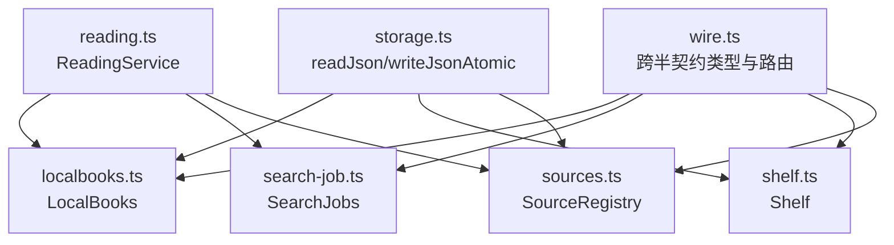
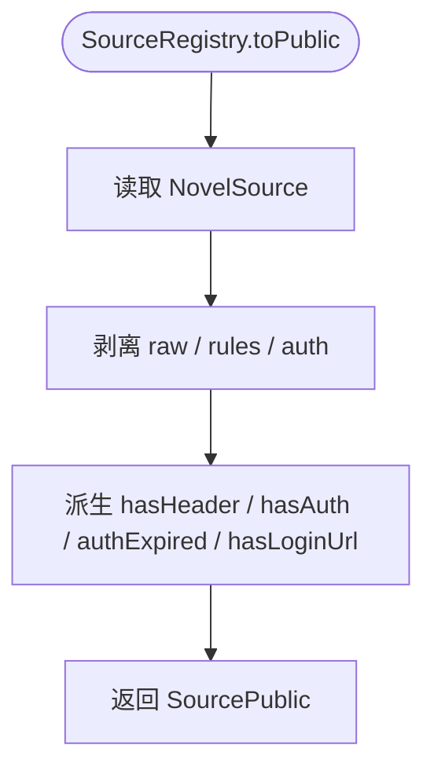
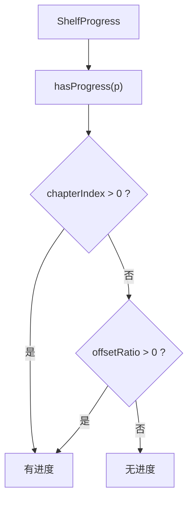
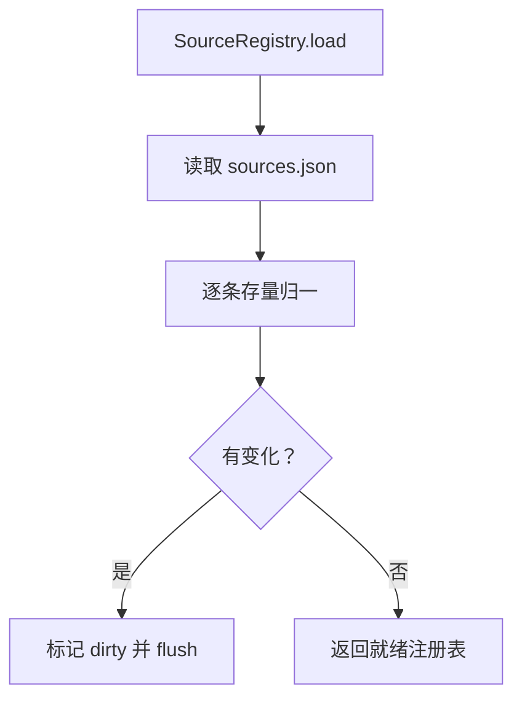

# 数据模型参考

<cite>
**本文引用的文件**   
- [src/shared/wire.ts](file://src/shared/wire.ts)
- [src/services/sources.ts](file://src/services/sources.ts)
- [src/services/shelf.ts](file://src/services/shelf.ts)
- [src/services/search-job.ts](file://src/services/search-job.ts)
- [src/services/localbooks.ts](file://src/services/localbooks.ts)
- [src/services/reading.ts](file://src/services/reading.ts)
- [src/services/storage.ts](file://src/services/storage.ts)
- [tests/shared/wire-builders.test.ts](file://tests/shared/wire-builders.test.ts)
</cite>

## 目录
1. [引言](#引言)
2. [项目结构](#项目结构)
3. [核心数据模型](#核心数据模型)
4. [架构总览](#架构总览)
5. [详细模型分析](#详细模型分析)
6. [依赖与生命周期](#依赖与生命周期)
7. [可空语义与跨半契约](#可空语义与跨半契约)
8. [持久化、迁移与兼容](#持久化迁移与兼容)
9. [测试与构建器建议](#测试与构建器建议)
10. [故障排查](#故障排查)
11. [结论](#结论)

## 引言
本参考文档围绕跨半 wire 契约中的核心数据模型展开，目标是让读者能够逐项理解 SourcePublic、ProbeResult、JobState、SearchJobSnapshot、SearchPlan、BookDetail、ShelfBook、ShelfProgress、ChapterEntry、SearchHit 等类型的字段含义、可选性、枚举取值及业务语义；并解释 | null 与 ?: 在 wire 层的设计差异、这些模型在 SourceRegistry、Shelf、SearchJobs、LocalBooks 中的生命周期与持久化方式，以及数据迁移、向后兼容和测试构建器的使用建议。

## 项目结构
数据模型的“唯一真相”位于共享 wire 契约文件：它既被浏览器端直接内联引用，也被 Node 服务端 re-export 或消费。服务层按领域拆分：书源注册表、书架、搜索任务、本地图书、读取门面与存储抽象。



**图示来源**
- [src/shared/wire.ts:1-120](file://src/shared/wire.ts#L1-L120)
- [src/services/sources.ts:39-137](file://src/services/sources.ts#L39-L137)
- [src/services/shelf.ts:41-41](file://src/services/shelf.ts#L41-L41)
- [src/services/search-job.ts:52-52](file://src/services/search-job.ts#L52-L52)
- [src/services/localbooks.ts:197-210](file://src/services/localbooks.ts#L197-L210)
- [src/services/reading.ts:91-115](file://src/services/reading.ts#L91-L115)
- [src/services/storage.ts:47-47](file://src/services/storage.ts#L47-L47)

**章节来源**
- [src/shared/wire.ts:1-120](file://src/shared/wire.ts#L1-L120)
- [src/services/sources.ts:39-137](file://src/services/sources.ts#L39-L137)
- [src/services/shelf.ts:41-41](file://src/services/shelf.ts#L41-L41)
- [src/services/search-job.ts:52-52](file://src/services/search-job.ts#L52-L52)
- [src/services/localbooks.ts:197-210](file://src/services/localbooks.ts#L197-L210)
- [src/services/reading.ts:91-115](file://src/services/reading.ts#L91-L115)
- [src/services/storage.ts:47-47](file://src/services/storage.ts#L47-L47)

## 核心数据模型
以下模型定义集中在 wire.ts，它们描述的是“跨半值形状”，即 JSON 的字段名、可空性与枚举域。

| 类型 | 关键字段与可选性 | 枚举/取值 | 业务含义 |
|---|---|---|---|
| `SourcePublic` | id、name、baseUrl、enabled、groups、type、status、importedAt、hasHeader、hasAuth、authExpired、hasLoginUrl；statusDetail、lastProbedAt 为可选 | type: text/image/audio/file/unknown；status: unverified/verified/broken | 书源对外投影。不含 raw/rules/auth，用于 UI 展示与状态位；loginUrl 存在性通过 hasLoginUrl 暴露给界面分支。 |
| `ProbeResult` | ok、itemCount、firstTitle、probedAt；error 可选 | ok: boolean；code: ProbeErrorCode | 单次探针结论，包含命中数量、首标题与可选失败原因。 |
| `JobState` | id、kind、phase、total、done、counts、issues、fileErrors、startedAt；finishedAt、error 可选 | kind: import/batch-probe；phase: running/done/failed；issue.kind: failed/warning/dup/replaced | 后台任务槽（内存态）：运行中互斥，结果保留到下一任务开始；issues 截断 200 条。 |
| `SearchJobSnapshot` | id、keyword、phase、cancelled、total、done、added、next、startedAt；finishedAt、error 可选 | phase: running/done/failed | 聚合搜索任务的读面快照；cancelled 表示用户主动停止而非失败；added/next 构成增量游标。 |
| `SearchPlan` | sourceIds: string[] | — | 本轮聚合搜索的真实参与者集合，由服务端计算，客户端据此驱动分批与进度。 |
| `BookDetail` | title、author、coverUrl、intro、lastChapterName、tocUrl、kind、wordCount；全部可为 null | — | 书籍详情；缺失字段是 null，表示“源没有该信息”，不是键缺席。 |
| `ShelfBook` | sourceId、bookKey、title、progress、addedAt；author、coverUrl、intro、lastChapterName、kind、wordCount、totalChapters 可选 | progress.chapterIndex: number；progress.offsetRatio: number；progress.updatedAt: number | 书架条目；元数据部分可缺，但 totalChapters 旧数据可能缺失。 |
| `ShelfProgress` | chapterIndex、offsetRatio、updatedAt | — | 阅读进度：chapterIndex > 0 或 offsetRatio > 0 即视为已读。 |
| `ChapterEntry` | name、url | — | 目录项；用于线性阅读序列与导航派生。 |
| `SearchHit` | title；author、url、coverUrl、intro、lastChapterName、kind、wordCount 可为 null | — | 搜索结果条目；可空字段表示“源未提供该项”，不是解析失败。 |
| `LocalDocument` | 未在 wire.ts 中作为独立类型声明 | — | 实际返回值为 ChapterContent（text 或 rich 树），通过 localDocument 路由取回补充文档正文。 |

**章节来源**
- [src/shared/wire.ts:43-210](file://src/shared/wire.ts#L43-L210)
- [src/shared/wire.ts:200-497](file://src/shared/wire.ts#L200-L497)

## 架构总览
下图把 wire 类型映射到服务层容器与持久化位置：

```mermaid
classDiagram
  class SourceRegistry {
    +load(dir)
    +edit(recipe)
    +flush()
    +toPublic(source)
  }
  class Shelf {
    +add(book)
    +update(key, patch)
    +remove(keys)
  }
  class SearchJobs {
    +submit(plan)
    +status(id, since?)
    +stream(id, since?)
  }
  class LocalBooks {
    +create(dir)
    +import(name)
    +get(documentId)
  }

  SourceRegistry --> "sources.json" : "落盘"
  Shelf --> "shelf.json" : "落盘"
  LocalBooks --> "本地资源目录" : "EPUB/TXT 副本"
  SearchJobs --> "内存任务表" : "不持久化"
```

**图示来源**
- [src/services/sources.ts:39-137](file://src/services/sources.ts#L39-L137)
- [src/services/shelf.ts:41-41](file://src/services/shelf.ts#L41-L41)
- [src/services/search-job.ts:52-52](file://src/services/search-job.ts#L52-L52)
- [src/services/localbooks.ts:197-210](file://src/services/localbooks.ts#L197-L210)

## 详细模型分析

### SourcePublic
- 字段覆盖书源标识、名称、基地址、启用状态、分组、内容形态、探针状态、导入时间、头部与认证标志，以及 loginUrl 是否存在。
- 不包含原始规则、凭据与原文，仅输出对外视图。
- hasLoginUrl 由 rules.loginUrl !== null 推导，供 UI 决定是否走登录流程。



**图示来源**
- [src/services/sources.ts:200-210](file://src/services/sources.ts#L200-L210)

**章节来源**
- [src/shared/wire.ts:43-79](file://src/shared/wire.ts#L43-L79)
- [src/services/sources.ts:200-210](file://src/services/sources.ts#L200-L210)

### ProbeResult
- ok 表达是否通过，itemCount 与 firstTitle 来自搜索面探测。
- error.code 属于 ProbeErrorCode，message 为人类可读细节。
- probedAt 记录探针时间戳。

**章节来源**
- [src/shared/wire.ts:64-79](file://src/shared/wire.ts#L64-L79)

### JobState
- 单任务槽设计：同一时刻只能有一个后台任务；phase 从 running 走到 done 或 failed。
- counts 精确统计 ok/failed/dupSkipped/replaced；issues 最多保留 200 条明细。
- fileErrors 记录文件级错误；finishedAt 与 error 可选，体现任务结束时的附加信息。

**章节来源**
- [src/shared/wire.ts:80-125](file://src/shared/wire.ts#L80-L125)

### SearchJobSnapshot
- phase 与 JobState 共用 running/done/failed 词汇，便于 UI 统一判断“是否还在跑”。
- cancelled 是显式查询字段，区分“用户停止”和“后端失败”。
- added 是按完成序累积的 SearchGroup；next 作为 since 游标，供 SSE 流与增量查询复用。

**章节来源**
- [src/shared/wire.ts:126-183](file://src/shared/wire.ts#L126-L183)

### SearchPlan
- sourceIds 是唯一真实参与集；客户端不再自行推导启停条件，避免 UI 与服务端对“哪些源参搜”产生分歧。

**章节来源**
- [src/shared/wire.ts:155-158](file://src/shared/wire.ts#L155-L158)

### BookDetail
- 所有展示字段都允许 null：null 表示“源未提供”，区别于键缺席。
- kind 与 wordCount 与 SearchHit 同源，详情规则缺失时可回退搜索规则。

**章节来源**
- [src/shared/wire.ts:158-183](file://src/shared/wire.ts#L158-L183)

### ShelfBook 与 ShelfProgress
- ShelfProgress 是 type 别名而非 interface，以避免工具生成 schema 时丢失索引签名。
- hasProgress 是“读过没”的唯一判定点：chapterIndex > 0 或 offsetRatio > 0。
- ShelfBook 的元数字段大多可选，totalChapters 是为进度条补强，旧存档可能缺失。
- ShelfEntry 是读取面扩展：加入 sourceName，源删除后为 null；sourceName 不落盘。



**图示来源**
- [src/shared/wire.ts:184-210](file://src/shared/wire.ts#L184-L210)

**章节来源**
- [src/shared/wire.ts:184-210](file://src/shared/wire.ts#L184-L210)

### ChapterEntry
- 纯 name/url 结构，用于线性目录与 planarNavigation 派生。

**章节来源**
- [src/shared/wire.ts:151-155](file://src/shared/wire.ts#L151-L155)

### SearchHit
- 作者、链接、封面、简介、最新章节、分类、字数均可 null。
- kind 与 wordCount 保持原样字符串，不进行 App 侧格式化；格式化属于展示层。

**章节来源**
- [src/shared/wire.ts:98-125](file://src/shared/wire.ts#L98-L125)

### LocalDocument
- wire.ts 中没有名为 LocalDocument 的类型；localDocument 路由返回 ChapterContent，即文本章或富文本树。
- 富文本树用 ContentNode 六类节点建模，且不带任意 attributes 字典，防止未净化属性进入 DOM。

**章节来源**
- [src/shared/wire.ts:200-497](file://src/shared/wire.ts#L200-L497)

## 依赖与生命周期

### SourceRegistry 与 SourcePublic
- 加载 sources.json，执行存量归一：enabled 缺省 true、type 缺省 text、按 raw 重推 content type、ruleDetailInit、headerRule、bookUrlPattern、静态头、kind/wordCount、groups 拆分、name 图标前缀清理。
- 变更通过 edit recipe 原子提交，内部合并落盘；PERSIST_EVERY=20 次阈值触发立即写，其余 100ms 尾沿防抖。
- toPublic 产出 SourcePublic，剥离敏感字段。

**章节来源**
- [src/services/sources.ts:39-137](file://src/services/sources.ts#L39-L137)
- [src/services/sources.ts:200-294](file://src/services/sources.ts#L200-L294)

### Shelf 与 ShelfBook
- Shelf 使用 shelfBody.addBook/patch/progress 构造请求体，走 pickShelfMeta 做字段取舍与类型判别。
- ShelfBook 的元数据写入只经过 SHELF_META 白名单；新增书目字段只需改这张表。
- ShelfEntry 是读取面投影，sourceName 不可 patch、不落盘。

**章节来源**
- [src/shared/wire.ts:200-297](file://src/shared/wire.ts#L200-L297)
- [src/services/shelf.ts:41-41](file://src/services/shelf.ts#L41-L41)

### SearchJobs 与 SearchJobSnapshot
- SearchJobSnapshot 是读面快照；实际搜索结果在服务端持有，不上 wire。
- added 与 next 组成增量游标；SSE 流首帧为 baseline，断线重连携带 since 补增量。
- SEARCH_HITS_CAP_PER_SOURCE 与 SEARCH_JOB_RETENTION_MS 控制命中上限与结果保留期。

**章节来源**
- [src/shared/wire.ts:126-183](file://src/shared/wire.ts#L126-L183)
- [src/services/search-job.ts:52-52](file://src/services/search-job.ts#L52-L52)

### LocalBooks 与 LocalDocument 返回体
- LocalImportResponse 基于 ShelfBook 扩展 chapterCount/format/encoding/warnings。
- localDocument 路由返回 ChapterContent，可能是纯文本或规范化的富文本树。
- 资源 URL 通过 resourceUrl 构造，确保前端 src 与服务端导出一致。

**章节来源**
- [src/shared/wire.ts:200-497](file://src/shared/wire.ts#L200-L497)
- [src/services/localbooks.ts:197-210](file://src/services/localbooks.ts#L197-L210)

## 可空语义与跨半契约
wire.ts 顶部明确两条口径：
- “wire 上空值字段一律 | null，不写 ?:”，因为 JSON 里 null 是在场的值。
- “时间戳/状态细节这类可能整键缺席的字段保持 ?:”，因为 JSON.stringify 会丢弃 undefined 键。

典型对照：
- SearchHit.title 必填；author、url、coverUrl、intro、lastChapterName、kind、wordCount 为 | null。
- ShelfBook.author、coverUrl、intro、lastChapterName、kind、wordCount、totalChapters 为可选。
- JobState.finishedAt、error 为可选；SearchJobSnapshot.finishedAt、error 为可选。
- ProbeResult.error 为可选。

这一原则保证：
- 浏览器端能区分“字段不存在”和“字段存在但为空”。
- Node 端不会因 JSON.stringify(undefined) 丢键而误判为 null。
- 工具链（lossless-JSON、schema 推断）与 wire 契约保持一致。

**章节来源**
- [src/shared/wire.ts:1-12](file://src/shared/wire.ts#L1-L12)
- [src/shared/wire.ts:98-183](file://src/shared/wire.ts#L98-L183)

## 持久化、迁移与兼容

### 持久化位置
- sources.json：SourceRegistry 维护，带原子写与批写合并。
- shelf.json：Shelf 维护，通过 createDebouncedWriter 去抖写入。
- 本地图书目录：LocalBooks 管理 EPUB/TXT 副本、文档与资源。
- SearchJobs：仅内存态，重启不恢复。

**章节来源**
- [src/services/sources.ts:39-137](file://src/services/sources.ts#L39-L137)
- [src/services/shelf.ts:41-41](file://src/services/shelf.ts#L41-L41)
- [src/services/localbooks.ts:197-210](file://src/services/localbooks.ts#L197-L210)
- [src/services/storage.ts:47-47](file://src/services/storage.ts#L47-L47)

### 迁移策略
- SourceRegistry.load 在启动时扫描存量数据，逐条补齐 enabled、type、groups、name、rules.* 字段；只要发现变化就标记脏并 flush。
- normalize 层提供 SOURCE_KIND_LABEL、rawBookMetaFields、rawHeaderRule 等映射，避免新旧 bookSourceType 与 header 形态造成静默降级。
- ShelfMetaPatch 与 pickShelfMeta 共同实现“未知键或缺失键一律缺席”的安全写入。



**图示来源**
- [src/services/sources.ts:69-137](file://src/services/sources.ts#L69-L137)

**章节来源**
- [src/services/sources.ts:69-137](file://src/services/sources.ts#L69-L137)
- [src/shared/wire.ts:200-297](file://src/shared/wire.ts#L200-L297)

### 向后兼容要点
- 对缺失键一律宽松：可选字段、nullable 字段与 unknown 输入分别由 pickShelfMeta、encodeQuery、route/SEG 守卫。
- 对 null 与 undefined 严格区分：wire 字段可空用 | null，序列化缺键用 ?:。
- 对历史路由与参数名集中管理：ROUTES、SEG、PARAMS、queries 成为双半唯一字面量来源，避免分散拼接导致漂移。

**章节来源**
- [src/shared/wire.ts:200-564](file://src/shared/wire.ts#L200-L564)

## 测试与构建器建议
- wire-builders.test.ts 钉死路由总数与路径构造，任何新增路由必须同步更新断言，否则构建期测试失败。
- 测试构建器应优先使用 queries、shelfBody、resourceUrl 等契约构造器，而不是手写 JSON 或 URL 片段。
- 对可空字段，测试应同时覆盖 null 与 undefined：null 表示 wire 上存在空值，undefined 表示键缺席。
- 对枚举字段，测试应覆盖全部字面量；对 SourceStatus、ProbeErrorCode、JobState.phase/kind 等尤其重要。

**章节来源**
- [tests/shared/wire-builders.test.ts:38-87](file://tests/shared/wire-builders.test.ts#L38-L87)

## 故障排查
- 若 UI 无法区分“停止搜索”与“搜索失败”，检查 SearchJobSnapshot.cancelled 与 error 是否被正确回填。
- 若书架进度始终显示“未读”，确认 ShelfProgress.chapterIndex 与 offsetRatio 是否至少一个大于 0。
- 若本地文档取不到，确认 localDocument 路由传入的 id 是 bookKey，documentId 是补充文档 ID。
- 若 sources.json 损坏，SourceRegistry.load 应响亮失败，不应静默清空；排查 storage.readJson 的异常处理。
- 若新增书目字段不生效，检查是否加入 SHELF_META，并确认 shelfBody.patch/addBook 走 pickShelfMeta。

**章节来源**
- [src/shared/wire.ts:126-183](file://src/shared/wire.ts#L126-L183)
- [src/shared/wire.ts:184-210](file://src/shared/wire.ts#L184-L210)
- [src/shared/wire.ts:200-297](file://src/shared/wire.ts#L200-L297)
- [src/services/storage.ts:47-47](file://src/services/storage.ts#L47-L47)

## 结论
这些数据模型以 wire.ts 为单一权威，贯穿书源、搜索、书架与本地图书四个领域。| null 与 ?: 的分工保证了 JSON 语义清晰：空值在场 vs 键缺席。服务层通过 SourceRegistry 的存量归一、Shelf 的白名单写入、SearchJobs 的内存快照与 LocalBooks 的资源隔离，形成稳定、可迁移、可测试的数据契约。新增模型或字段时，应优先更新 wire.ts 与相关构造器，并让路由与测试构建器同步校验，从而维持跨半契约的一致性。