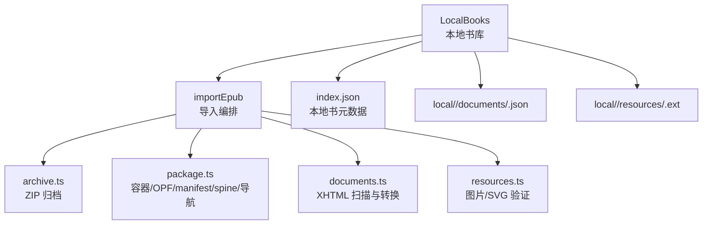
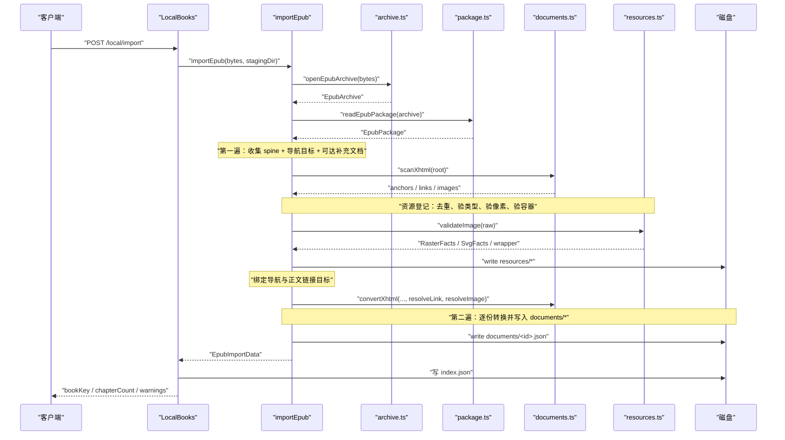
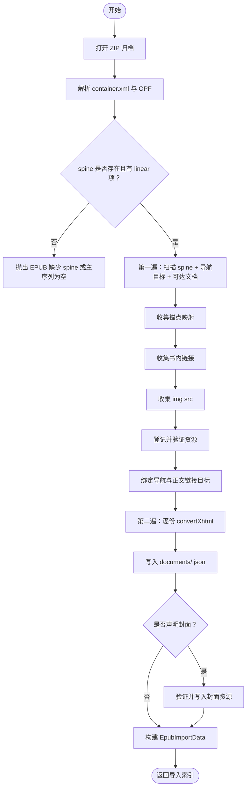
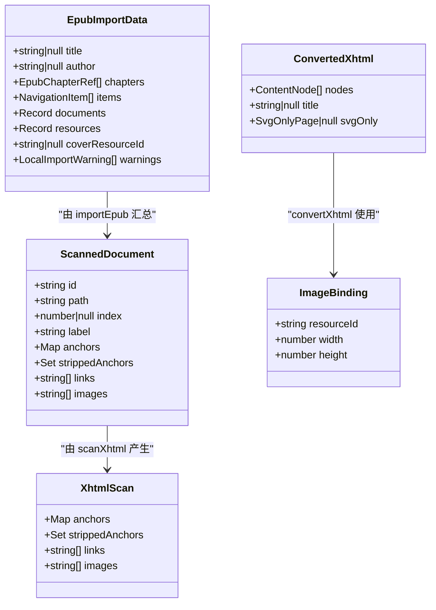
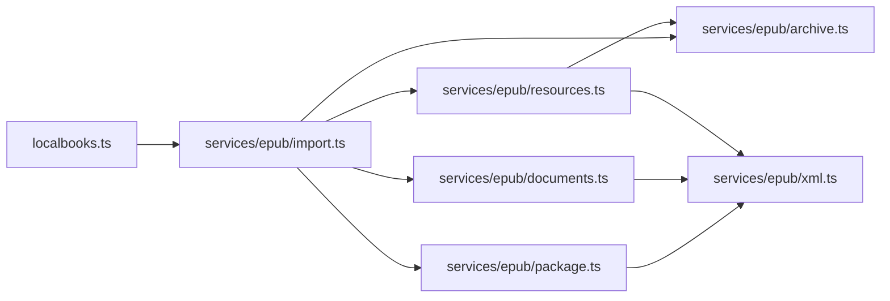

# EPUB 两遍导入

<cite>
**本文引用的文件**   
- [src/services/epub/import.ts](file://src/services/epub/import.ts)
- [src/services/epub/archive.ts](file://src/services/epub/archive.ts)
- [src/services/epub/package.ts](file://src/services/epub/package.ts)
- [src/services/epub/documents.ts](file://src/services/epub/documents.ts)
- [src/services/epub/resources.ts](file://src/services/epub/resources.ts)
- [src/services/localbooks.ts](file://src/services/localbooks.ts)
- [tests/api/dispatch-local.test.ts](file://tests/api/dispatch-local.test.ts)
- [tests/services/epub-import.test.ts](file://tests/services/epub-import.test.ts)
</cite>

## 目录
1. [引言](#引言)
2. [项目结构](#项目结构)
3. [核心组件](#核心组件)
4. [架构总览](#架构总览)
5. [详细组件分析](#详细组件分析)
6. [依赖关系分析](#依赖关系分析)
7. [性能注意事项](#性能注意事项)
8. [API 与使用示例](#api-与使用示例)
9. [故障排查指南](#故障排查指南)
10. [结论](#结论)

## 引言
本技术文档说明仓库中 EPUB 本地书导入的两遍流水线。入口是 `importEpub`，它把一份上传的 EPUB ZIP 字节转换为：

- 按主序列排章的阅读列表；
- 已规范化、无活动内容的 XHTML 文档 JSON；
- 经过类型、尺寸、容器完整性校验的图片与 SVG 资源；
- 指向磁盘上 `documents/` 与 `resources/` 子目录的 `index.json`（即本地书的元数据）。

五个子模块分工明确：

| 模块 | 职责 | 关键约束 |
|---|---|---|
| `archive.ts` | 打开并安全读取 ZIP 归档 | 流式解压、增量 CRC32、中央目录条目预检 |
| `package.ts` | 解析 `META-INF/container.xml`、OPF manifest/spine、导航 | spine 必须存在且至少一个 linear 项 |
| `documents.ts` | 扫描 XHTML、建立锚点映射、转换白名单图文树 | 拒绝脚本/样式、剥离内联 SVG 并告警 |
| `resources.ts` | 验证图片类型/像素/容器、重建独立 SVG | 拒远程图片、拒损坏图、拒不支持的可见图形 |
| `import.ts` | 编排两遍走、写文档与资源、生成索引 | 第二遍逐份转换落盘，不常驻整本 DOM |

EPUB 导入产物进入本地书集合，可通过阅读 API 查目录、章节正文和补充文档；原书插图等资源通过资源接口按 ID 访问。

**小节来源**
- [src/services/epub/import.ts:1-120](file://src/services/epub/import.ts#L1-L120)
- [src/services/localbooks.ts:300-380](file://src/services/localbooks.ts#L300-L380)

## 项目结构
EPUB 相关代码集中在服务层，而不是前端或引擎层：



**图表来源**
- [src/services/localbooks.ts:300-420](file://src/services/localbooks.ts#L300-L420)
- [src/services/epub/import.ts:1-120](file://src/services/epub/import.ts#L1-L120)

**小节来源**
- [src/services/localbooks.ts:1-120](file://src/services/localbooks.ts#L1-L120)
- [src/services/epub/import.ts:1-120](file://src/services/epub/import.ts#L1-L120)

## 核心组件
### 导入编排：`import.ts`
`importEpub(bytes, outputDir, limits)` 是唯一对外暴露的 EPUB 导入函数。它的职责不是发布到书架，也不是读写 HTTP，而是：

1. 打开归档；
2. 读包结构；
3. 第一遍收集所有可读文档、锚点、链接和图片；
4. 登记并验证被引用到的资源；
5. 绑定导航与正文链接目标；
6. 第二遍逐份转换 XHTML、写入 `documents/<id>.json`；
7. 写出封面资源（若声明）；
8. 返回 `EpubImportData`，供 `LocalBooks` 持久化为 `index.json`。

它强制三条口径：

- 章只按 spine 主序列计数；
- 失效目标一律失败；
- 被剥除的活动内容记告警，但可见图形不支持则报错。

**小节来源**
- [src/services/epub/import.ts:1-120](file://src/services/epub/import.ts#L1-L120)
- [src/services/epub/import.ts:201-485](file://src/services/epub/import.ts#L201-L485)

### ZIP 归档：`archive.ts`
`EpubArchive` 是 EPUB 的安全边界。它不对用户上传的 ZIP 直接信任，而是在打开阶段做中央目录预检，在读阶段按实际字节累计预算并核对 CRC32。

关键点：

- 拒绝加密条目、非 store/deflate 压缩方式、符号链接；
- 拒绝 NUL、反斜杠、绝对路径、越界 `..` 的条目名；
- 每个条目的解压大小受 `entryBytes` 限制；
- 整个归档的实际解压总量受 `totalBytes` 限制；
- 任何读取失败都会关闭归档，避免后续读取建立在不可信映射上。

**小节来源**
- [src/services/epub/archive.ts:1-120](file://src/services/epub/archive.ts#L1-L120)
- [src/services/epub/archive.ts:201-317](file://src/services/epub/archive.ts#L201-L317)

### 包结构：`package.ts`
`readEpubPackage` 把安全后的 ZIP 句柄变成可判定的书结构：

- 检查 `mimetype` 是否为 `application/epub+zip`；
- 从 `META-INF/container.xml` 定位 OPF；
- 解析 OPF metadata、manifest、spine；
- spine 必须有至少一个 `linear="yes"` 的主序列项；
- 解析 nav 文档、NCX，或退化到按 spine 合成平面目录；
- 记录封面候选、被加密的资源路径以及包级告警。

它还负责 href 归一化、media-type 归一化，以及“固定版式”“主序列脚本”等包级拒绝。

**小节来源**
- [src/services/epub/package.ts:1-120](file://src/services/epub/package.ts#L1-L120)
- [src/services/epub/package.ts:201-498](file://src/services/epub/package.ts#L201-L498)

### 文档扫描与转换：`documents.ts`
这一层处理 XHTML → 白名单图文树：

- 第一遍 `scanXhtml` 只建锚点映射、链接集合和图片 src 清单；
- 第二遍 `convertXhtml` 才铸节点、绑链接、绑图片；
- 拒绝活动元素、事件属性、style 属性；
- 内联 SVG 剥离并告警；只有它是文档唯一内容时交给编排层裁决；
- 未知元素保留子内容，带 id 的用 span 包裹以留住锚点；
- 没有可显示正文的文档会失败，避免空章节冒充成功。

**小节来源**
- [src/services/epub/documents.ts:1-120](file://src/services/epub/documents.ts#L1-L120)
- [src/services/epub/documents.ts:201-496](file://src/services/epub/documents.ts#L201-L496)

### 资源验证：`resources.ts`
资源层回答“这些字节能不能当作一张图”，不负责书架与写盘：

- 光栅图：判断魔数、媒体类型一致性、宽高、像素上限，再完整校验 PNG chunk CRC、JPEG EOI、GIF trailer、WebP RIFF 长度；
- EXIF 方向 5–8 交换宽高，保证首帧占位正确；
- 独立 SVG：按白名单重建静态文本，拒绝不支持的可见元素与外部引用；
- SVG 单图包装：识别 `<svg>` 里唯一 `<image>`，退回该栅格图的 path，让编排层按真实图片处理；
- 拒绝远程图片、损坏图片、不支持格式、超限像素、缺失宽高。

**小节来源**
- [src/services/epub/resources.ts:1-120](file://src/services/epub/resources.ts#L1-L120)
- [src/services/epub/resources.ts:201-512](file://src/services/epub/resources.ts#L201-L512)

## 架构总览
EPUB 导入采用“两遍走”：



**图表来源**
- [src/services/localbooks.ts:300-420](file://src/services/localbooks.ts#L300-L420)
- [src/services/epub/import.ts:201-485](file://src/services/epub/import.ts#L201-L485)
- [src/services/epub/archive.ts:120-220](file://src/services/epub/archive.ts#L120-L220)
- [src/services/epub/package.ts:120-220](file://src/services/epub/package.ts#L120-L220)
- [src/services/epub/documents.ts:120-240](file://src/services/epub/documents.ts#L120-L240)
- [src/services/epub/resources.ts:120-220](file://src/services/epub/resources.ts#L120-L220)

## 详细组件分析

### 两遍导入流程


**图表来源**
- [src/services/epub/import.ts:201-485](file://src/services/epub/import.ts#L201-L485)
- [src/services/epub/package.ts:320-420](file://src/services/epub/package.ts#L320-L420)

**小节来源**
- [src/services/epub/import.ts:201-485](file://src/services/epub/import.ts#L201-L485)

### 文档扫描与转换类关系


**图表来源**
- [src/services/epub/import.ts:120-200](file://src/services/epub/import.ts#L120-L200)
- [src/services/epub/documents.ts:120-240](file://src/services/epub/documents.ts#L120-L240)

**小节来源**
- [src/services/epub/documents.ts:120-240](file://src/services/epub/documents.ts#L120-L240)
- [src/services/epub/import.ts:120-200](file://src/services/epub/import.ts#L120-L200)

### 资源验证流程


**图表来源**
- [src/services/epub/resources.ts:120-240](file://src/services/epub/resources.ts#L120-L240)
- [src/services/epub/resources.ts:201-320](file://src/services/epub/resources.ts#L201-L320)

**小节来源**
- [src/services/epub/resources.ts:120-320](file://src/services/epub/resources.ts#L120-L320)

## 依赖关系分析


依赖特征：

- `import.ts` 是编排中心，耦合最高；
- `archive.ts` 提供安全 ZIP 句柄和 CRC32 工具；
- `package.ts` 与 `documents.ts`、`resources.ts` 共用 XML 解析预算；
- `localbooks.ts` 只消费 `importEpub` 的结果，不关心 EPUB 语法细节。

**图表来源**
- [src/services/localbooks.ts:1-120](file://src/services/localbooks.ts#L1-L120)
- [src/services/epub/import.ts:1-60](file://src/services/epub/import.ts#L1-L60)

**小节来源**
- [src/services/epub/import.ts:1-60](file://src/services/epub/import.ts#L1-L60)
- [src/services/localbooks.ts:1-120](file://src/services/localbooks.ts#L1-L120)

## 性能注意事项
| 场景 | 实现策略 | 影响 |
|---|---|---|
| 大 ZIP | yauzl 延迟加载中央目录，按流读取条目 | 不一次性解压整本 |
| 超大条目 | `entryBytes` 限制单条目解压字节 | 防止 zip bomb |
| 全库解压 | `totalBytes` 累计实际解压字节 | 512 MiB 默认值保护整体内存 |
| XML 深度爆炸 | `xmlDepth` 与 `xmlNodes` 预算 | 防止递归栈溢出 |
| 重复图片 | 按原始 src 键登记，同一 manifest path 去重 | 减少重复解码与写盘 |
| 图片尺寸 | `image-size` 采样文件头 | 不解码像素，仅读尺寸 |
| 像素上限 | `imagePixels = 宽 × 高` | 防止超大图占用渲染内存 |
| 第二遍逐份转换 | 每份文档解析→转换→写盘→释放 | 不把整本 DOM 常驻内存 |
| 资源 Content-Length | 用落盘后 payload 长度 | SVG 重建后长度可能变化 |

**小节来源**
- [src/services/epub/archive.ts:120-220](file://src/services/epub/archive.ts#L120-L220)
- [src/services/epub/resources.ts:120-220](file://src/services/epub/resources.ts#L120-L220)
- [src/services/epub/import.ts:201-485](file://src/services/epub/import.ts#L201-L485)

## API 与使用示例

### POST /local/import：导入 EPUB
服务端路由在测试中通过 `/novel-api/local/import` 暴露，调用方需要：

- 方法：`POST`；
- URL：`/novel-api/local/import?name=<文件名>`；
- 请求体：EPUB 二进制；
- 成功状态码：`200`；
- 响应体：包含 `sourceId=__local__`、`bookKey=local:<uuid>`、`chapterCount`、`warnings` 等字段。

示例（概念性，不依赖具体 SDK）：

```http
POST /novel-api/local/import?name=example.epub
Content-Type: application/octet-stream
Content-Length: <文件大小>

<EPUB ZIP 字节>
```

成功响应中的关键字段：

| 字段 | 含义 |
|---|---|
| `value.bookKey` | 本地书标识，形如 `local:<uuid>` |
| `value.title` | 书名，优先来自 EPUB 元数据，否则取上传文件名 |
| `value.chapterCount` | 阅读章节数，只按 spine 主序列计数 |
| `value.format` | 对 EPUB 为 `epub` |
| `value.encoding` | EPUB 恒 `null` |
| `value.warnings` | 导入期告警列表 |
| `value.sourceId` | 本地来源 `__local__` |

注意：`POST /local/import` 的语义在本仓库中对应 `/novel-api/local/import`。测试断言了 TXT 导入后书架会出现该条目，且 `bookKey` 以 `local:` 开头。

**小节来源**
- [tests/api/dispatch-local.test.ts:1-85](file://tests/api/dispatch-local.test.ts#L1-L85)
- [src/services/localbooks.ts:300-420](file://src/services/localbooks.ts#L300-L420)

### 返回的 documentId 与 index.json
`importEpub` 返回的 `EpubImportData` 会被 `LocalBooks` 持久化为本地书 `index.json`。其中：

- `documents`：`documentId → { id, file, index, label, path }`；
- `resources`：`resourceId → { id, file, mediaType, bytes, width, height }`；
- `chapters`：按 spine 顺序的 `{ index, documentId, label }`；
- `items`：展示用导航树；
- `warnings`：导入告警；
- `coverResourceId`：封面资源 ID，若无则为 `null`。

例如：

```json
{
  "schemaVersion": 2,
  "format": "epub",
  "title": "示例书",
  "author": "作者",
  "originalName": "example.epub",
  "importedAt": 1700000000000,
  "chapters": [
    { "index": 0, "documentId": "d0", "label": "第一章" },
    { "index": 1, "documentId": "d1", "label": "第二章" }
  ],
  "documents": {
    "d0": { "id": "d0", "file": "documents/d0.json", "index": 0, "label": "第一章", "path": "OEBPS/chapter1.xhtml" },
    "d1": { "id": "d1", "file": "documents/d1.json", "index": 1, "label": "第二章", "path": "OEBPS/chapter2.xhtml" }
  },
  "resources": {
    "r0": { "id": "r0", "file": "resources/r0.jpg", "mediaType": "image/jpeg", "bytes": 12345, "width": 800, "height": 600 }
  },
  "navigation": [
    { "label": "目录", "target": null, "children": [] }
  ],
  "warnings": [],
  "coverResourceId": "r0"
}
```

**小节来源**
- [src/services/epub/import.ts:120-200](file://src/services/epub/import.ts#L120-L200)
- [src/services/localbooks.ts:420-502](file://src/services/localbooks.ts#L420-L502)

### GET /local/resource：读取原书资源
`GET /novel-api/local/resource?id=<bookKey>&resourceId=<resourceId>` 用于访问已导入书籍的原书插图或其他资源。

行为：

- 参数 `id` 是 `local:<uuid>`；
- 参数 `resourceId` 必须是 `index.json` 中 `resources` 表里的键；
- 成功时返回资源的媒体类型、真实字节数和流；
- 找不到资源 ID 或文件缺失时返回 404；
- 参数缺失或方法错误时返回 400/405；
- 响应头中的字节数来自打开文件后的 stat，不是导入期记录的 bytes。

示例：

```http
GET /novel-api/local/resource?id=local%3A<uuid>&resourceId=r0
```

成功响应：

| 头部/字段 | 含义 |
|---|---|
| `Content-Type` | 资源验证后的媒体类型，例如 `image/jpeg` |
| `Content-Length` | 当前磁盘上的真实字节数 |
| 响应体 | 原始图片字节流 |

失败响应：

| 条件 | 状态码 |
|---|---:|
| 缺少 `id` 或 `resourceId` | 400 |
| 方法不是 GET | 405 |
| 资源 ID 不存在 | 404 |
| 资源文件缺失 | 404 |
| 打开成功但 stat 失败 | 500 |

**小节来源**
- [src/services/localbooks.ts:420-502](file://src/services/localbooks.ts#L420-L502)
- [tests/api/dispatch-local.test.ts:1-85](file://tests/api/dispatch-local.test.ts#L1-L85)

### EPUB 与书架的关系
- 导入成功后，本地书自动加入书架；
- `bookKey` 形如 `local:<uuid>`；
- `sourceId` 固定为 `__local__`；
- 目录 API 返回 spine 主序列；
- 章节 API 返回图文面；
- 补充文档可通过文档 ID 读取；
- 警告可通过 `/novel-api/local/warnings` 查看；
- 删除本地书会清理全部落盘产物。

**小节来源**
- [tests/api/dispatch-local.test.ts:1-85](file://tests/api/dispatch-local.test.ts#L1-L85)
- [src/services/localbooks.ts:300-420](file://src/services/localbooks.ts#L300-L420)

## 故障排查指南

### 损坏 ZIP 归档
现象：

- 无法打开 ZIP；
- 中央目录不可信；
- 条目读取失败；
- CRC 不一致。

诊断方法：

- 确认文件确实是 EPUB ZIP；
- 检查 ZIP 是否被截断；
- 检查归档是否包含加密条目；
- 检查是否使用了 store 或 deflate 以外的压缩方式；
- 检查条目名是否含 NUL、反斜杠、绝对路径或越界 `..`。

相关错误信息通常包含“不是可读的 ZIP 归档”“归档中央目录不可信”“条目读取失败”“CRC 校验失败”。

**小节来源**
- [src/services/epub/archive.ts:120-220](file://src/services/epub/archive.ts#L120-L220)
- [src/services/epub/archive.ts:201-317](file://src/services/epub/archive.ts#L201-L317)

### 缺少 spine 或 Package.xml
现象：

- 提示缺少 `META-INF/container.xml`；
- 提示 rootfile 指向的不是 OPF；
- 提示 OPF 里没有 manifest；
- 提示 OPF 里没有 spine；
- 提示 spine 主序列为空。

诊断方法：

- 检查 EPUB 是否符合 OCF 容器规范；
- 检查 `container.xml` 是否指向有效 OPF；
- 检查 OPF 是否有 `manifest` 和 `spine`；
- 检查 spine 中至少有一个 `linear="yes"` 的 itemref；
- 检查 spine 指向的 href 是否真的存在于 ZIP 中。

**小节来源**
- [src/services/epub/package.ts:120-220](file://src/services/epub/package.ts#L120-L220)
- [src/services/epub/package.ts:320-420](file://src/services/epub/package.ts#L320-L420)

### 外链图片被拒
现象：

- 正文中的 `` 导致导入失败；
- 整页内联 SVG 中唯一图片指向书外也失败；
- 封面声明指向书外同样失败。

原因：

- 本插件只加载书内资源；
- 正文链接和图片不允许远程站点；
- 不可跟随的 scheme（javascript、data、file、about 等）只保留文字并记告警；
- 外链本身不会降级成图片，而是直接拒绝。

**小节来源**
- [src/services/epub/import.ts:201-485](file://src/services/epub/import.ts#L201-L485)

### CRC 校验失败
现象：

- 归档层报“CRC 校验失败”；
- 图片层报 PNG chunk CRC 对不上；
- JPEG 没有 EOI；
- GIF 缺 trailer；
- WebP RIFF 长度与实际不符。

诊断方法：

- 归档层 CRC 比对中央目录与流式解压结果；
- PNG 需逐个 chunk 核对 CRC 直到 IEND；
- JPEG 需走到 EOI；
- GIF 末尾必须是分号；
- WebP 的 RIFF 长度必须等于文件长度；
- 这类问题通常是下载中断、传输损坏或人为篡改。

**小节来源**
- [src/services/epub/archive.ts:201-260](file://src/services/epub/archive.ts#L201-L260)
- [src/services/epub/resources.ts:201-320](file://src/services/epub/resources.ts#L201-L320)

### 无有效章节
现象：

- spine 为空；
- 正文文档被完全剥除；
- 内联 SVG 是该文档唯一内容，且内部图片不可用；
- 文档 body 缺失或只剩空白。

诊断方法：

- 检查 spine 是否有 linear 项；
- 检查文档是否真的包含可读正文；
- 如果是整页 SVG 封面，检查其内部图片是否指向书内可用资源；
- 检查是否把活动元素、内联 SVG、样式等内容全部剥除后仍留有正文。

**小节来源**
- [src/services/epub/package.ts:320-420](file://src/services/epub/package.ts#L320-L420)
- [src/services/epub/documents.ts:201-320](file://src/services/epub/documents.ts#L201-L320)
- [src/services/epub/import.ts:201-485](file://src/services/epub/import.ts#L201-L485)

### 其他常见错误
| 错误 | 可能原因 | 处理建议 |
|---|---|---|
| “EPUB 声明固定版式” | 包级或文档级 `pre-paginated` | 改用流式排版 |
| “EPUB 主序列文档声明为 scripted” | spine 中线性文档标记脚本 | 去掉脚本依赖 |
| “资源被加密” | ZIP 或内容被加密 | 先解密再导入 |
| “不支持的图片类型” | manifest 声明或实际格式不在 jpeg/png/gif/webp | 转换图片格式 |
| “SVG 有本插件不支持的可见元素” | foreignObject、use、pattern 等 | 简化 SVG 或使用栅格图 |
| “目标锚点在文档里不存在” | 拼写错误或锚点随被剥离内容消失 | 修复原书锚点或接受降级告警 |
| “文档里有重复锚点” | 同一文档中同名 id/name 多处 | 去重原书锚点 |

**小节来源**
- [src/services/epub/package.ts:320-498](file://src/services/epub/package.ts#L320-L498)
- [src/services/epub/resources.ts:120-240](file://src/services/epub/resources.ts#L120-L240)
- [src/services/epub/documents.ts:120-240](file://src/services/epub/documents.ts#L120-L240)

## 结论
EPUB 两遍导入管线通过严格分层保障安全性与可诊断性：

- `archive.ts` 守护 ZIP 安全；
- `package.ts` 守护包结构；
- `documents.ts` 守护正文内容；
- `resources.ts` 守护图片与 SVG；
- `import.ts` 串联两遍，确保“先清点、再验证、最后落盘”；
- `localbooks.ts` 将导入产物落地、入架、暴露给阅读 API。

这套设计适合大体积 EPUB：yauzl 流式读取、XML 预算控制、图片采样与像素上限、资源去重、逐份转换落盘，使导入过程既稳定又可观测。对于坏书，系统优先给出精确错误消息和告警，而不是静默丢弃内容。