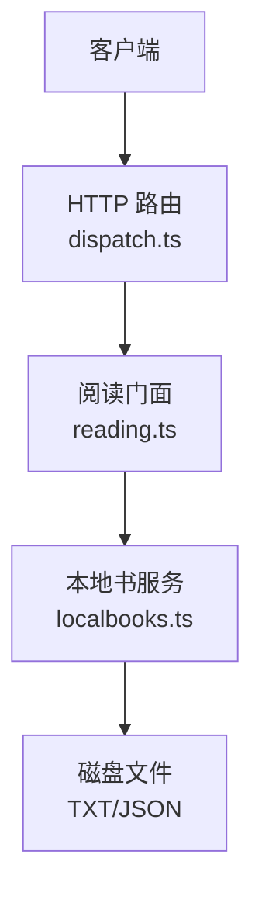
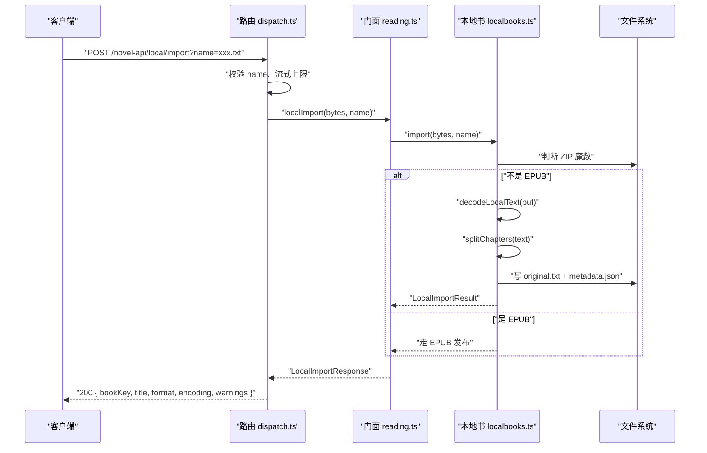
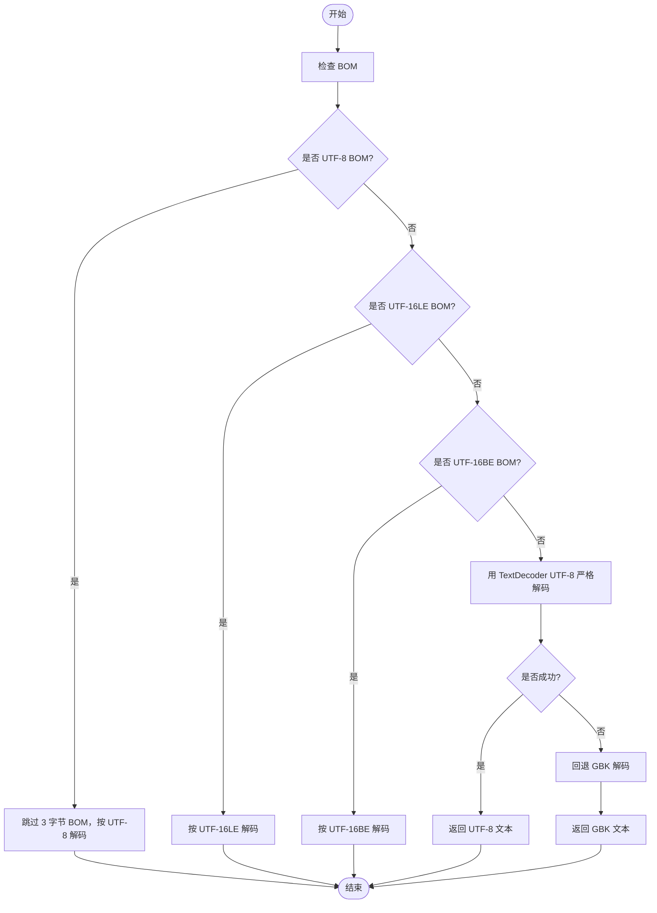
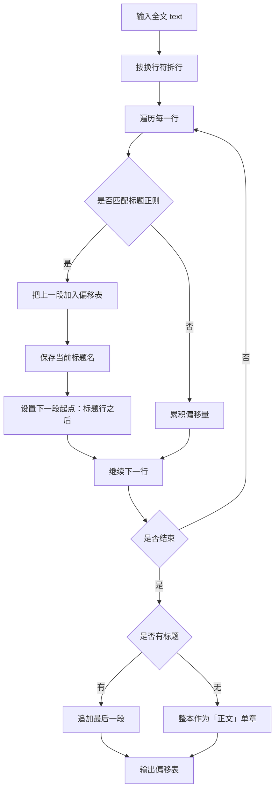
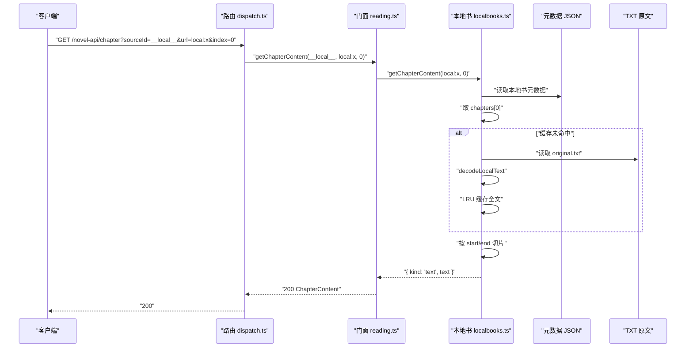

# TXT 导入

<cite>
**本文引用的文件**   
- [src/services/localbooks.ts](file://src/services/localbooks.ts)
- [src/api/dispatch.ts](file://src/api/dispatch.ts)
- [src/services/reading.ts](file://src/services/reading.ts)
- [tests/api/dispatch-local.test.ts](file://tests/api/dispatch-local.test.ts)
</cite>

## 目录
1. [简介](#简介)
2. [项目结构中的相关位置](#项目结构中的相关位置)
3. [核心组件](#核心组件)
4. [架构总览](#架构总览)
5. [详细处理流程](#详细处理流程)
6. [依赖关系分析](#依赖关系分析)
7. [性能注意事项](#性能注意事项)
8. [故障排查指南](#故障排查指南)
9. [结论](#结论)

## 简介
本文说明本地 TXT 书的导入与阅读机制，重点覆盖：
- 编码自动识别顺序：BOM → UTF-8 严格检测 → GBK 回退。
- 章节标题正则如何切分章节，以及偏移表如何生成并用于快速定位章节起始字节。
- 本地书 API `POST /local/import` 的完整请求、响应字段（含本地书 key 与 warnings）。
- TXT 正文读取通过 `GET /local/document` 按文档 ID 获取补充内容；常规章节正文则通过 `/novel-api/chapter` 按章号返回。
- 损坏文件或缺少标题行时的错误行为。
- 大文本文件内存占用、正则匹配开销与超时场景的性能建议。

## 项目结构中的相关位置
- 本地书服务与 TXT 解析逻辑位于 `src/services/localbooks.ts`。
- HTTP 路由分发与本地书接口在 `src/api/dispatch.ts`。
- 阅读门面统一暴露本地导入、删除等动词，并在 `src/services/reading.ts` 中装配 `LocalBooks`。
- 本地书 API 的行为断言集中在 `tests/api/dispatch-local.test.ts`。



**图示来源**
- [src/api/dispatch.ts:351-404](file://src/api/dispatch.ts#L351-L404)
- [src/services/reading.ts:397-443](file://src/services/reading.ts#L397-L443)
- [src/services/localbooks.ts:201-254](file://src/services/localbooks.ts#L201-L254)

**章节来源**
- [src/services/localbooks.ts:1-200](file://src/services/localbooks.ts#L1-L200)
- [src/api/dispatch.ts:340-530](file://src/api/dispatch.ts#L340-L530)
- [src/services/reading.ts:390-460](file://src/services/reading.ts#L390-L460)
- [tests/api/dispatch-local.test.ts:1-85](file://tests/api/dispatch-local.test.ts#L1-L85)

## 核心组件
- `decodeLocalText`：对原始 Buffer 做编码探测，返回解码后的字符串与编码名。
- `splitChapters`：按标题行正则切分全文，返回字符偏移表 `ChapterSpan[]`。
- `LocalBooks.publishText`：TXT 发布入口，写入原文与元数据 JSON。
- `LocalBooks.getChapterContent` / `textChapter`：按章号从偏移表中切片返回章节正文。
- `ReadingService.localImport`：调用 `LocalBooks.import` 后自动入架，并投影为 `LocalImportResponse`。
- `dispatch` 路由：将 `POST /local/import`、`GET /local/document` 等映射到门面方法。

**章节来源**
- [src/services/localbooks.ts:21-44](file://src/services/localbooks.ts#L21-L44)
- [src/services/localbooks.ts:46-77](file://src/services/localbooks.ts#L46-L77)
- [src/services/localbooks.ts:201-254](file://src/services/localbooks.ts#L201-L254)
- [src/services/localbooks.ts:256-309](file://src/services/localbooks.ts#L256-L309)
- [src/services/localbooks.ts:311-349](file://src/services/localbooks.ts#L311-L349)
- [src/services/reading.ts:397-423](file://src/services/reading.ts#L397-L423)
- [src/api/dispatch.ts:351-404](file://src/api/dispatch.ts#L351-L404)

## 架构总览
本地 TXT 导入链路如下：



**图示来源**
- [src/api/dispatch.ts:351-366](file://src/api/dispatch.ts#L351-L366)
- [src/services/reading.ts:397-423](file://src/services/reading.ts#L397-L423)
- [src/services/localbooks.ts:201-254](file://src/services/localbooks.ts#L201-L254)

## 详细处理流程

### 编码自动识别流程
本地 TXT 文件的解码顺序固定为：
1. **优先检测 BOM**：UTF-8 BOM、UTF-16 LE/BE 直接识别并跳过签名。
2. **尝试 UTF-8 严格解码**：使用致命模式 `TextDecoder('utf-8', { fatal: true })`；非法字节会抛错。
3. **回退到 GBK**：UTF-8 失败时交由 GBK 解码器处理。

该策略避免复用通用网络响应解码器，因为后者默认兜底 UTF-8，会导致 GBK 文件乱码。



**图示来源**
- [src/services/localbooks.ts:21-44](file://src/services/localbooks.ts#L21-L44)

**章节来源**
- [src/services/localbooks.ts:21-44](file://src/services/localbooks.ts#L21-L44)

### 章节标题正则与偏移表生成
章节标题采用固定正则，支持常见中文章节命名形态，例如：
- “第 X 章”“第 X 卷”“第 X 回”“第 X 节”“第 X 集”“第 X 部”“第 X 篇”。
- 带单位在前形态，如“章二”。
- 序章、楔子、番外、尾声、后记。
- 英文“Chapter N”。

`splitChapters` 逐行扫描，遇到标题行就切出一个章节区间：
- 第一个标题行之前的非空内容会被作为“正文”段。
- 每个标题对应一个 `ChapterSpan`，包含章节名称、起始字符偏移、结束字符偏移。
- 如果没有标题行匹配，整本书被当作单章，名称为“正文”。

偏移表以**字符偏移**存储，后续读取章节时按字符切片，而不是按字节重新搜索。



**图示来源**
- [src/services/localbooks.ts:46-77](file://src/services/localbooks.ts#L46-L77)

**章节来源**
- [src/services/localbooks.ts:46-77](file://src/services/localbooks.ts#L46-L77)

### 本地书导入 API：`POST /local/import`
#### 请求
- 路径：`/novel-api/local/import`
- 方法：`POST`
- 查询参数：
  - `name`：文件名，必填；服务端据此生成书名并保留原文件名。
- 请求体：原始二进制文件体，由传输层按上限流式读取。

#### 服务端处理要点
- 路由先校验 `name`。
- 使用受限 body 读取，超过配置上限直接返回 413。
- 调用 `ReadingService.localImport(bytes, name)`。
- 门面再调用 `LocalBooks.import(bytes, name)`，内部按文件头魔数分流：
  - 文件头为 ZIP 签名 → EPUB 路径。
  - 否则 → TXT 路径。
- TXT 路径执行：
  1. `decodeLocalText` 解码。
  2. `splitChapters` 生成偏移表。
  3. 写入原文 `.txt` 与元数据 `.json`。
  4. 自动入架。

#### 成功响应
成功时返回 `LocalImportResponse`，关键字段包括：
- `bookKey`：本地书标识，形如 `local:<uuid>`。
- `title`：书名。
- `format`：`txt` 或 `epub`。
- `encoding`：TXT 时为实际使用的编码名；EPUB 为 `null`。
- `warnings`：导入警告数组；TXT 通常为空，EPUB 可能携带导入期警告。
- 其他书架字段：如 `sourceId`、作者、封面、总章数等。

对于 TXT，测试表明：
- `sourceId` 为 `__local__`。
- 导入成功后自动出现在书架列表中。
- `warnings` 为空数组。

**章节来源**
- [src/api/dispatch.ts:351-366](file://src/api/dispatch.ts#L351-L366)
- [src/services/reading.ts:397-423](file://src/services/reading.ts#L397-L423)
- [src/services/localbooks.ts:201-254](file://src/services/localbooks.ts#L201-L254)
- [tests/api/dispatch-local.test.ts:17-36](file://tests/api/dispatch-local.test.ts#L17-L36)

### 章节正文读取：TXT 与文档的区别
需要区分两个概念：
- **章节正文**：TXT 按章节索引读取，API 是 `/novel-api/chapter`，参数为 `index`。
- **补充文档**：`GET /local/document` 只用于 EPUB 的补充文档（脚注、附录等），参数为 `id` 和 `documentId`。

#### 常规章节正文
- 路由 `/novel-api/chapter` 要求 `index` 为非负整数。
- 对于本地书，门面最终调用 `LocalBooks.getChapterContent(bookKey, index)`。
- TXT 实现：
  - 从元数据取 `chapters[index]`。
  - 如果不存在，抛出“没有第 X 章”的错误。
  - 首次访问该书时解码全文，放入最多 3 本的 LRU 缓存。
  - 根据 `start`、`end` 做字符切片，并去除首尾空白。

#### 补充文档接口
- `GET /local/document` 需要 `id` 与 `documentId`。
- 它读取 EPUB 的规范化文档 JSON。
- 对 TXT 调用会返回 404，因为 TXT 没有文档表。



**图示来源**
- [src/services/localbooks.ts:256-309](file://src/services/localbooks.ts#L256-L309)
- [src/services/localbooks.ts:311-349](file://src/services/localbooks.ts#L311-L349)

**章节来源**
- [src/services/localbooks.ts:256-349](file://src/services/localbooks.ts#L256-L349)
- [tests/api/dispatch-local.test.ts:37-49](file://tests/api/dispatch-local.test.ts#L37-L49)

### 损坏文件与缺少标题行的行为
- **空文件**：导入时立即抛出本地导入错误，路由映射为 400。
- **超大文件**：超过 `localImportMaxBytes` 返回 413。
- **无标题行**：`splitChapters` 会把整本书作为一个章节，名称为“正文”，长度为全文长度。
- **相邻标题行或文末孤标题**：偏移表可能出现 `start > end`；读取时会夹紧边界，保证只返回空字符串而非负长度。
- **章节索引越界**：`getChapterContent` 找不到对应章节时抛出“本地书没有第 X 章”的错误，属于 404 类错误。
- **TXT 调用 `/local/document`**：由于没有文档表，返回 404。
- **资源 ID 不存在或资源文件缺失**：也返回 404。
- **产物错位或损坏**：当元数据声称某文档存在但读出的内容与预期不一致时，服务显式抛出错误，表示服务端存储损坏，不走 404 伪装。

**章节来源**
- [src/services/localbooks.ts:46-77](file://src/services/localbooks.ts#L46-L77)
- [src/services/localbooks.ts:201-254](file://src/services/localbooks.ts#L201-L254)
- [src/services/localbooks.ts:256-349](file://src/services/localbooks.ts#L256-L349)
- [tests/api/dispatch-local.test.ts:50-85](file://tests/api/dispatch-local.test.ts#L50-L85)

## 依赖关系分析
```mermaid
classDiagram
    class LocalBooks {
        +import(buf, name)
        +publishText(buf, name)
        +getChapterContent(bookKey, index)
        +textChapter(bookKey, index, meta)
        +getToc(bookKey)
        +getNavigation(bookKey)
        +getSupplement(bookKey, documentId)
        +getResource(bookKey, resourceId)
        +remove(bookKey)
    }

    class ReadingService {
        +localImport(bytes, name)
        +getLocalSupplement(bookKey, documentId)
        +getLocalImportWarnings(bookKey)
        +removeLocalBook(id)
    }

    class Dispatch {
        +createApiHandler(service)
    }

    Dispatch --> ReadingService : "调用门面"
    ReadingService --> LocalBooks : "组合注入"
    LocalBooks --> "文件系统" : "读写 TXT/JSON"
```

**图示来源**
- [src/services/localbooks.ts:201-502](file://src/services/localbooks.ts#L201-L502)
- [src/services/reading.ts:397-443](file://src/services/reading.ts#L397-L443)
- [src/api/dispatch.ts:351-404](file://src/api/dispatch.ts#L351-L404)

**章节来源**
- [src/services/localbooks.ts:201-502](file://src/services/localbooks.ts#L201-L502)
- [src/services/reading.ts:397-443](file://src/services/reading.ts#L397-L443)
- [src/api/dispatch.ts:351-404](file://src/api/dispatch.ts#L351-L404)

## 性能注意事项
### 大文本文件避免一次性加载到内存
- TXT 导入阶段会接收完整 Buffer，因此 `localImportMaxBytes` 同时约束传输层与服务端本地书解析层。
- 默认上限为 50MB，可通过 `ReadingServiceOptions.localImportMaxBytes` 调整。
- 章节正文读取时，TXT 会缓存整本解码后的文本，LRU 最多保留 3 本书。这意味着：
  - 频繁读取不同章节的同本书可避免重复解码。
  - 同时打开多本大型 TXT 会占用较多内存。
- 若导入超大 TXT，应调低上限或使用外部预处理工具拆分。

**章节来源**
- [src/services/localbooks.ts:201-216](file://src/services/localbooks.ts#L201-L216)
- [src/services/localbooks.ts:311-349](file://src/services/localbooks.ts#L311-L349)
- [src/services/reading.ts:105-116](file://src/services/reading.ts#L105-L116)

### 正则匹配开销评估
- `splitChapters` 按换行逐行扫描，并对每行执行一次标题正则匹配。
- 时间复杂度近似为 O(行数)，空间复杂度主要是整本文本与偏移表。
- 标题正则会匹配多种中文数字形态和单位前置形态，匹配成本中等；主要瓶颈仍是全文解码与整本缓存。
- 优化方向：
  - 限制最大文件大小。
  - 避免同时缓存过多大型 TXT。
  - 对极长书籍考虑预处理成更规整的章节结构。

**章节来源**
- [src/services/localbooks.ts:46-77](file://src/services/localbooks.ts#L46-L77)

### 超时与阻塞
- 路由层没有对本地导入单独设置超时；超时主要由宿主进程、反向代理或 Node.js 默认行为决定。
- 大文件导入会在解码、切章、落盘、入架过程中持续占用线程与内存。
- 建议在网关或宿主页设置合理的请求超时，并在 UI 上提示用户超长文件导入较慢。

[本节为一般性指导，不直接分析具体代码片段]

## 故障排查指南

### 编码误判导致乱码
- 现象：GB2312/GBK 文件显示为乱码。
- 原因：UTF-8 严格解码失败后回退到 GBK；若文件实际是 GBK 但字节序列恰好能通过 UTF-8 验证，仍可能被误判为 UTF-8。
- 排查建议：
  - 确认 `encoding` 字段是否为 `gbk` 或 `utf-8`。
  - 用十六进制编辑器查看文件头是否存在 BOM。
  - 对疑似 GBK 文件，先用工具转换为 UTF-8 再上传。
  - 若 BOM 明确存在，应确保上传过程不会截断前 3 字节。

**章节来源**
- [src/services/localbooks.ts:21-44](file://src/services/localbooks.ts#L21-L44)

### 无匹配标题行导致整本为一章
- 现象：导入成功，但目录只有“正文”一章，内容为整本书。
- 原因：`splitChapters` 没有找到任何标题行，于是返回 `[{"name": "正文", "start": 0, "end": 全文长度}]`。
- 排查建议：
  - 检查文件开头是否包含“第 X 章”等标题格式。
  - 检查标题行前后是否有多余空格、全半角冒号差异。
  - 对旧书手动添加标准章节标题后再导入。

**章节来源**
- [src/services/localbooks.ts:46-77](file://src/services/localbooks.ts#L46-L77)

### 超大文件导入超时或拒绝
- 现象：导入时报 413，或长时间无响应后被中断。
- 原因：
  - 超过 `localImportMaxBytes`。
  - 大文件解码、切章、落盘耗时较长。
- 排查建议：
  - 确认 `localImportMaxBytes` 配置。
  - 拆分大 TXT 为多个小文件。
  - 在网关层设置合理超时。
  - 监控导入日志，确认是否卡在解码或落盘阶段。

**章节来源**
- [src/services/localbooks.ts:201-216](file://src/services/localbooks.ts#L201-L216)
- [src/api/dispatch.ts:351-366](file://src/api/dispatch.ts#L351-L366)
- [tests/api/dispatch-local.test.ts:68-71](file://tests/api/dispatch-local.test.ts#L68-L71)

### 读取章节返回 404 或错误
- 现象：调用 `/novel-api/chapter` 或 `/local/document` 返回 404。
- 可能原因：
  - 章节索引超出范围。
  - TXT 调用 `/local/document`，但该接口仅适用于 EPUB 补充文档。
  - 本地书不存在或已删除。
- 排查建议：
  - 先调用目录接口确认章节数量。
  - 确认使用的是 `/novel-api/chapter` 而非 `/local/document`。
  - 检查 `bookKey` 是否正确。

**章节来源**
- [src/services/localbooks.ts:256-309](file://src/services/localbooks.ts#L256-L309)
- [tests/api/dispatch-local.test.ts:50-67](file://tests/api/dispatch-local.test.ts#L50-L67)

### GBK 文件导入与读取
- 测试覆盖了 GBK 编码文件导入，并验证第一章内容可正确读取。
- 成功导入后，`encoding` 应为 `gbk`，后续按相同编码解码读取。

**章节来源**
- [tests/api/dispatch-local.test.ts:40-49](file://tests/api/dispatch-local.test.ts#L40-L49)
- [src/services/localbooks.ts:21-44](file://src/services/localbooks.ts#L21-L44)

## 结论
TXT 本地书导入的核心在于三点：
1. 编码识别顺序必须稳定：BOM 优先，然后 UTF-8 严格检测，最后 GBK 回退。
2. 章节切分基于固定标题正则，并通过字符偏移表提供快速定位，避免每次读取都重新扫描全文。
3. API 层面，`POST /local/import` 负责导入与入架，`GET /local/document` 专用于 EPUB 补充文档；TXT 章节正文应通过 `/novel-api/chapter` 按章号获取。

对于生产环境，建议：
- 控制最大导入大小。
- 规范 TXT 标题格式。
- 谨慎管理多本大型 TXT 的内存占用。
- 对导入失败、编码误判、超大文件、章节越界等场景建立明确的用户提示与日志记录。