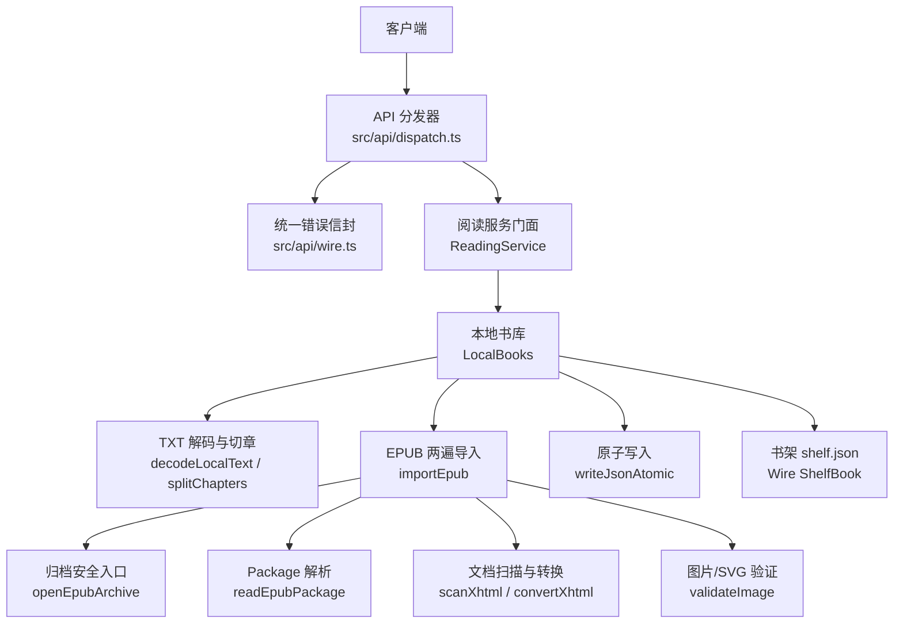
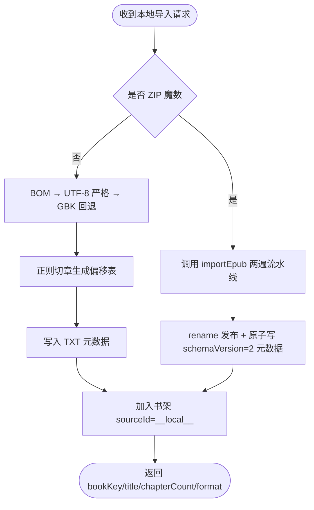
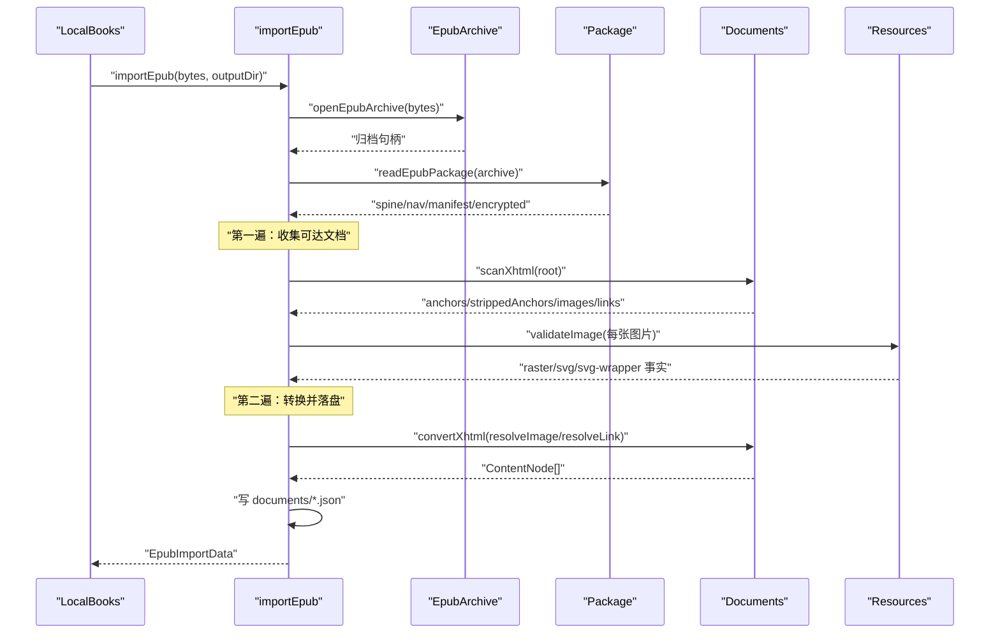
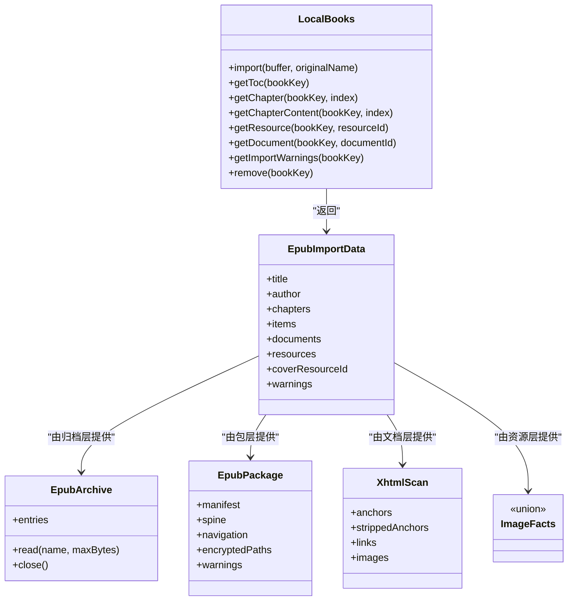
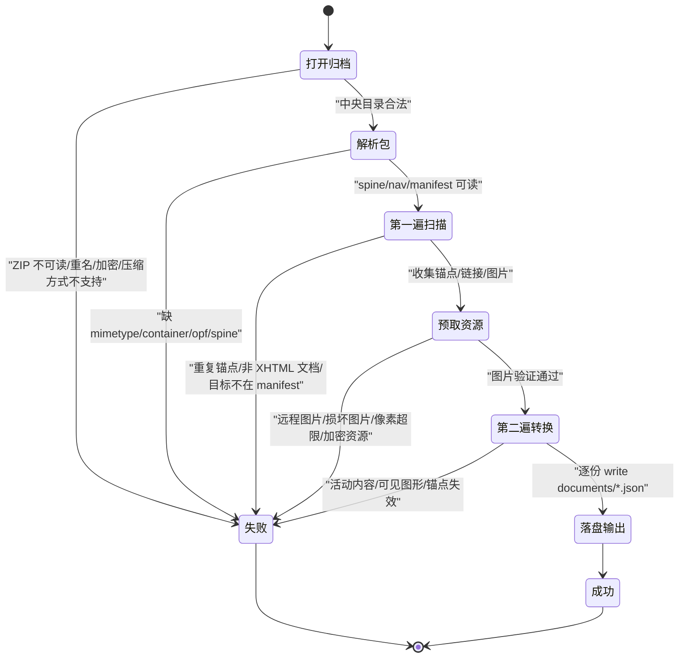
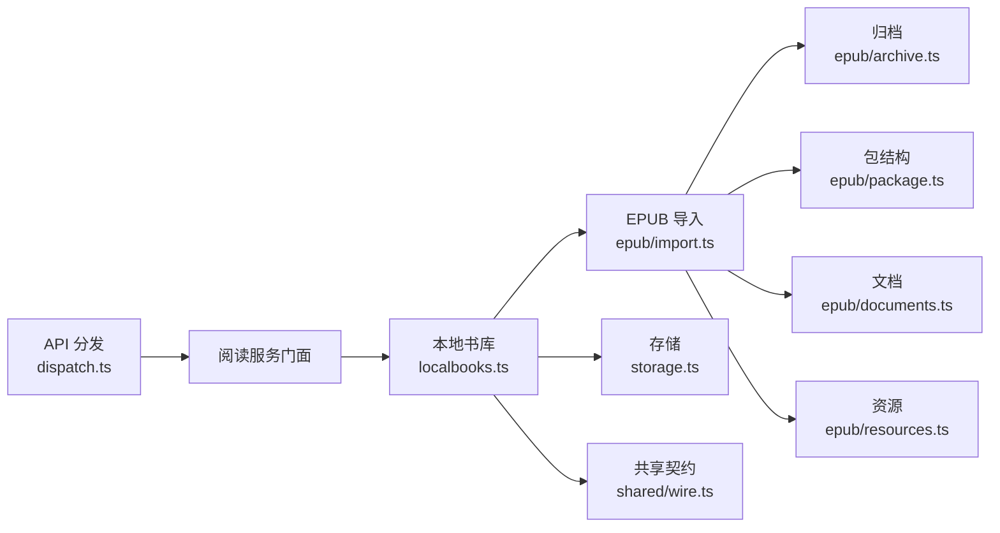

# 本地书导入

<cite>
**本文引用的文件**   
- [dispatch.ts](file://src/api/dispatch.ts)
- [wire.ts](file://src/api/wire.ts)
- [wire.ts](file://src/shared/wire.ts)
- [localbooks.ts](file://src/services/localbooks.ts)
- [import.ts](file://src/services/epub/import.ts)
- [documents.ts](file://src/services/epub/documents.ts)
- [archive.ts](file://src/services/epub/archive.ts)
- [package.ts](file://src/services/epub/package.ts)
- [resources.ts](file://src/services/epub/resources.ts)
- [storage.ts](file://src/services/storage.ts)
- [dispatch-local.test.ts](file://tests/api/dispatch-local.test.ts)
- [epub-import.test.ts](file://tests/services/epub-import.test.ts)
- [localbooks.test.ts](file://tests/services/localbooks.test.ts)
- [epub-warnings.test.ts](file://tests/services/epub-warnings.test.ts)
</cite>

## 目录
1. [引言](#引言)
2. [项目结构](#项目结构)
3. [核心组件](#核心组件)
4. [架构总览](#架构总览)
5. [详细组件分析](#详细组件分析)
6. [依赖关系分析](#依赖关系分析)
7. [性能注意事项](#性能注意事项)
8. [故障排查指南](#故障排查指南)
9. [结论](#结论)

## 引言
本文件面向“本地书导入”这一能力，覆盖两类输入：

- **TXT 文本**：按 BOM → UTF-8 严格探测 → GBK 回退解码，用钉死正则切出章节偏移表，并持久化 `bookKey`、目录与正文读取接口。
- **EPUB 电子书**：两遍走流水线——第一遍通过 yauzl 打开归档、解析 Package（OPF spine + nav/NCX）、扫描文档锚点与资源引用；第二遍绑定资源、规范化正文、落盘 `documents/` + `index.json`，同时生成封面、导航树与告警清单。

本地书以 `sourceId=__local__` 接入书架，既可通过 `/novel-api/toc` 与 `/chapter` 阅读，也可通过 `/novel-api/local/*` 管理导入产物、诊断损坏 EPUB。

## 项目结构
本地书相关代码分布在三层：

| 层 | 主要职责 | 关键文件 |
|---|---|---|
| API 路由层 | 校验请求、流式读体、错误投影到统一信封 | `src/api/dispatch.ts`、`src/api/wire.ts` |
| 服务门面层 | TXT/EPUB 分流、落盘发布、删除、目录与正文读取 | `src/services/localbooks.ts` |
| EPUB 子服务 | 归档安全、包结构、文档规范、资源验证 | `src/services/epub/{archive,package,documents,resources,import}.ts` |
| 存储底层 | 原子写 JSON、临时文件、备份路径 | `src/services/storage.ts` |
| 契约类型 | `LOCAL_SOURCE_ID`、`ShelfBook`、Wire 信封等跨半定义 | `src/shared/wire.ts` |
| 测试 | HTTP 行为、导入编排、警告合并、本地书形态 | `tests/api/dispatch-local.test.ts`、`tests/services/epub-import.test.ts`、`tests/services/localbooks.test.ts`、`tests/services/epub-warnings.test.ts` |

**图表来源**
- [dispatch.ts:1-120](file://src/api/dispatch.ts#L1-L120)
- [wire.ts:1-135](file://src/api/wire.ts#L1-L135)
- [localbooks.ts:1-120](file://src/services/localbooks.ts#L1-L120)
- [import.ts:1-120](file://src/services/epub/import.ts#L1-L120)
- [archive.ts:1-120](file://src/services/epub/archive.ts#L1-L120)
- [package.ts:1-120](file://src/services/epub/package.ts#L1-L120)
- [documents.ts:1-120](file://src/services/epub/documents.ts#L1-L120)
- [resources.ts:1-120](file://src/services/epub/resources.ts#L1-L120)
- [storage.ts:1-129](file://src/services/storage.ts#L1-L129)

**章节来源**
- [dispatch.ts:1-120](file://src/api/dispatch.ts#L1-L120)
- [wire.ts:1-135](file://src/api/wire.ts#L1-L135)
- [localbooks.ts:1-120](file://src/services/localbooks.ts#L1-L120)

## 核心组件

### 本地书库门面 `LocalBooks`
负责三类工作：

1. **格式分流**：只按 ZIP 魔数 `PK\x03\x04` 判断 EPUB；不是 ZIP 才走 TXT 解码链。ZIP 魔数命中后，后续任何失败都作为 EPUB 失败上抛，不再回退 TXT。
2. **落盘与发布**：TXT 写单文件 + 无 `schemaVersion` 的旧元数据；EPUB 先写入 `.importing` 暂存目录，再一次 rename 成最终目录，最后原子写顶层元数据，再由门面入架。
3. **读取与删除**：TXT 返回标题行名称与字符切片；EPUB 返回 `documentId`/`resourceId` 对应资源流；删除时同时清理目录与书架条目。

**图表来源**
- [localbooks.ts:1-200](file://src/services/localbooks.ts#L1-L200)
- [import.ts:1-120](file://src/services/epub/import.ts#L1-L120)

**章节来源**
- [localbooks.ts:1-200](file://src/services/localbooks.ts#L1-L200)

### TXT 解码与切章

#### 编码识别链
解码顺序为：

1. **UTF-8 BOM**：前三个字节 `EF BB BF` 直接剥掉 BOM，记编码为 `utf-8-bom`。
2. **UTF-16LE/BE BOM**：`FF FE` 或 `FE FF` 走 iconv 解码 UTF-16。
3. **UTF-8 严格探测**：使用 `TextDecoder('utf-8', { fatal: true })`；非法字节直接抛错。
4. **GBK 回退**：捕获 UTF-8 严格失败后用 iconv 的 GBK 解码，属于启发式猜测。

该逻辑不复用通用 fetcher 解码器，因为后者兜底 UTF-8，会把 GBK 误判为乱码。

#### 标题行正则与偏移表
标题行采用钉死正则，支持：

- 中文数字和阿拉伯数字：`第X章/卷/回/节/集/部/篇` 与反向形态 `[章卷回节集部篇]X`。
- 固定标题：`序章`、`楔子`、`番外`、`尾声`、`后记`。
- 英文形态：`Chapter N`。
- 分隔符：冒号、全角冒号、点、顿号、空格。

切章返回 `ChapterSpan[]`，每项包含标题原文、起始偏移和结束偏移；若首段在第一个标题之前且非空，会补一个名为“正文”的首段；若无标题，整本成为单章“正文”。

**章节来源**
- [localbooks.ts:1-120](file://src/services/localbooks.ts#L1-L120)
- [localbooks.test.ts:1-120](file://tests/services/localbooks.test.ts#L1-L120)

### EPUB 两遍导入流水线

#### 总体流程
`importEpub(bytes, outputDir, limits)` 是 EPUB 导入的唯一编排入口：

1. 打开归档句柄 `openEpubArchive`。
2. 解析包结构 `readEpubPackage`。
3. 第一遍扫描主序列、导航目标、正文链接，建文档 ID、锚点映射、图片集合。
4. 预取并验证所有被引用图片。
5. 第二遍逐份转换 XHTML，绑定资源与链接，落盘 `documents/<opaque>.json`。
6. 返回 `EpubImportData`：章节、导航、文档索引、资源索引、封面资源 ID、告警。

**图表来源**
- [import.ts:1-200](file://src/services/epub/import.ts#L1-L200)
- [archive.ts:1-120](file://src/services/epub/archive.ts#L1-L120)
- [package.ts:1-200](file://src/services/epub/package.ts#L1-L200)
- [documents.ts:1-200](file://src/services/epub/documents.ts#L1-L200)
- [resources.ts:1-200](file://src/services/epub/resources.ts#L1-L200)

#### 第一遍：归档读取、spine 导航、ID/锚点映射
第一遍的目标不是渲染，而是建立一份稳定、可绑定的索引：

- **归档层**：yauzl 延迟枚举中央目录，对每条目的文件名、重名、加密、压缩方式做预检；合法条目登记后才返回句柄。
- **包层**：从 `mimetype` 和 `META-INF/container.xml` 定位 OPF，解析 manifest、spine、nav/NCX、封面候选、内容加密清单。
- **文档层**：对每个 spine 项与导航目标调用 `scanXhtml`，产出：
  - 原书 id → 不透明锚点 ID 映射。
  - 被剥离子树中的锚点名集合（用于降级而非拒整本）。
  - 所有 `a[href]` 与 `img[src]` 引用。
- **ID 铸造**：`IdMinter` 为文档、节点、锚点、资源分别分配 `d0`/`n0`/`a0`/`r0` 风格 opaque ID，避免把原书 id 或磁盘路径暴露给 wire。

**章节来源**
- [archive.ts:1-200](file://src/services/epub/archive.ts#L1-L200)
- [package.ts:1-200](file://src/services/epub/package.ts#L1-L200)
- [documents.ts:1-200](file://src/services/epub/documents.ts#L1-L200)
- [import.ts:1-200](file://src/services/epub/import.ts#L1-L200)

#### 第二遍：资源绑定、正文转换、落盘输出
第二遍按文档逐个执行：

1. 解析 XHTML。
2. 白名单重建元素树，丢弃 `script/style/iframe/object/embed/form/input/button/select/textarea/canvas` 等活动内容与样式控制。
3. 将独立 SVG 资源净化为静态 SVG 文本；整页唯一内联 SVG 作为封面候选交给编排层裁决。
4. 图片绑定使用已验证的 raster/svg/svg-wrapper 结果。
5. 内部链接解析为 `ReadingTarget`：章节锚点、补充文档锚点、外部链接降级。
6. 输出 `ChapterContent` 到 `outputDir/documents/<opaque>.json`。
7. 构建 `EpubImportData.documents`、`.resources`、`.items`、`.coverResourceId`、`.warnings`。

**章节来源**
- [documents.ts:1-200](file://src/services/epub/documents.ts#L1-L200)
- [resources.ts:1-200](file://src/services/epub/resources.ts#L1-L200)
- [import.ts:120-300](file://src/services/epub/import.ts#L120-L300)

### Package.xml 解析与 spine 主序列
Package 层输出 `EpubPackage`，关键字段包括：

| 字段 | 含义 |
|---|---|
| `title`、`author` | OPF 元数据 |
| `manifest` | id → 路径、媒体类型、properties |
| `spine` | spine 中 `linear=true` 的主序列路径数组 |
| `spineItems` | spine 完整声明，含 `linear=false` 补充文档 |
| `navigation` | nav 或 NCX 解析出的目录树 |
| `navigationSource` | `nav`、`ncx` 或 `spine`（合成） |
| `coverCandidates` | EPUB3 `cover-image` 优先，EPUB2 `meta name=cover` 次之 |
| `encryptedPaths` | 非 spine 的内容加密清单目标 |
| `warnings` | 包级告警，如导航降级、资源加密 |

spine 是阅读单元计数依据；补充文档可以出现在 spine 但 `linear=false`，可被导航或正文链接打开，不计入章节总数。

**章节来源**
- [package.ts:1-200](file://src/services/epub/package.ts#L1-L200)

### 资源处理：远程图片拒绝、SVG 剥离、image-size 采样
资源层 `validateImage` 区分三种结果：

| 结果 | 含义 |
|---|---|
| `RasterFacts` | JPEG/PNG/GIF/WebP，经过魔数、尺寸、容器结构、像素预算校验 |
| `SvgFacts` | 独立 SVG，白名单重建后返回静态 SVG 文本 |
| `SvgWrapperFacts` | `<svg>` 里只包一张书内栅格图，按封面封面写法提取那张图 |

关键规则：

- **拒绝远程图片**：仅接受书内可解析的资源；外链不下载、不回退。
- **拒绝不支持的图片类型**：manifest 声明与实际魔数必须一致，常见别名 `image/jpg` 归一为 `image/jpeg`。
- **拒绝截断图片**：PNG 逐 chunk 核对 CRC 直到 IEND；JPEG 走到 EOI；GIF 检查 trailer；WebP 核对 RIFF 长度。
- **EXIF 旋转折算显示宽高**：JPEG Orientation 5–8 交换宽高，确保阅读器首帧占位正确。
- **像素上限**：宽 × 高 不得超过 `imagePixels`，默认 4000 万像素。
- **SVG 可见图形**：独立 SVG 只保留白名单元素；`foreignObject/use/nested image/pattern` 等可见元素报错，而不是静默删除。
- **正文内联 SVG**：剥离并记录告警；只有它是文档唯一内容时才由编排层判定为封面候选。

**章节来源**
- [resources.ts:1-200](file://src/services/epub/resources.ts#L1-L200)

### 归档流式读取与安全边界
`EpubArchive` 是 EPUB 解析的安全门：

- **延迟解压**：`lazyEntries: true`，中央目录扫描不解压任意条目。
- **中央目录预检**：条目数上限、重复文件名、加密条目、不支持压缩方式全部在 open 阶段拒绝。
- **流式累计预算**：`entryBytes`、`totalBytes`、`xmlBytes`、`imagePixels` 等预算按实际读取字节累计，不按 ZIP 元数据信任。
- **CRC32 校验**：与 buffer-crc32 兼容两种导出形态，供 PNG chunk CRC 复用。
- **关闭语义**：任何读取失败都会关闭归档，关闭操作幂等。

**章节来源**
- [archive.ts:1-200](file://src/services/epub/archive.ts#L1-L200)

## 架构总览

**图表来源**
- [localbooks.ts:1-200](file://src/services/localbooks.ts#L1-L200)
- [import.ts:1-200](file://src/services/epub/import.ts#L1-L200)
- [archive.ts:1-200](file://src/services/epub/archive.ts#L1-L200)
- [package.ts:1-200](file://src/services/epub/package.ts#L1-L200)
- [documents.ts:1-200](file://src/services/epub/documents.ts#L1-L200)
- [resources.ts:1-200](file://src/services/epub/resources.ts#L1-L200)

## 详细组件分析

### TXT 导入实现细节

#### 编码识别
- 检测到 UTF-8 BOM 后跳过前三字节，返回 `encoding=utf-8-bom`。
- UTF-16LE/BE 检测前两个字节，使用 iconv 解码。
- UTF-8 严格模式失败后回退 GBK。
- 该分支不会复用网络请求解码器，避免网络响应头误导本地文件编码。

#### 切章算法
时间复杂度近似 O(n)，其中 n 是行数；空间复杂度取决于全文缓冲与偏移表大小。

切章步骤：

1. 按换行符拆分文本。
2. 对每行去尾回车后匹配标题正则。
3. 若匹配到标题：
   - 上一个标题段的结束位置为本行行首前。
   - 如果这是第一个标题且前面有非空白内容，插入“正文”首段。
   - 更新当前标题与下一段起点。
4. 结尾追加最后一个标题段；若无标题则整本为“正文”。

**章节来源**
- [localbooks.ts:1-120](file://src/services/localbooks.ts#L1-L120)
- [localbooks.test.ts:1-120](file://tests/services/localbooks.test.ts#L1-L120)

### EPUB 导入状态机

**图表来源**
- [import.ts:1-200](file://src/services/epub/import.ts#L1-L200)
- [archive.ts:1-200](file://src/services/epub/archive.ts#L1-L200)
- [package.ts:1-200](file://src/services/epub/package.ts#L1-L200)
- [documents.ts:1-200](file://src/services/epub/documents.ts#L1-L200)
- [resources.ts:1-200](file://src/services/epub/resources.ts#L1-L200)

### API 端点示例

以下示例基于仓库测试与服务层契约，说明本地书导入相关接口。所有响应均包裹在 `{ ok, value }` 或 `{ ok, error }` 信封中。

#### POST `/novel-api/local/import`
用途：上传 TXT 或 EPUB 进行本地导入。

| 项目 | 说明 |
|---|---|
| 方法 | `POST` |
| URL | `/novel-api/local/import?name=<URL 编码的文件名>` |
| Content-Type | `text/plain` 或二进制 |
| Body | TXT 文本或 EPUB 字节 |
| 成功 | `200`，`value` 为本地导入结果，含 `bookKey`、`title`、`chapterCount`、`format`、`encoding`、`warnings` |
| 空文件 | `400`，类目 `local-import` |
| 超过 `localImportMaxBytes` | `413`，类目 `local-too-large` |
| EPUB 解析失败 | `400`，错误类名 `EpubImportError` |
| 书架行为 | 成功后自动加入书架，`sourceId=__local__` |

参考测试：

- [dispatch-local.test.ts:1-85](file://tests/api/dispatch-local.test.ts#L1-L85)

#### DELETE `/novel-api/local`
用途：删除本地书及其文件。

| 项目 | 说明 |
|---|---|
| 方法 | `DELETE` |
| URL | `/novel-api/local?id=<URL 编码的 bookKey>` |
| 成功 | `200`，`value.removed=true` |
| 不存在 | `404` |
| 书架行为 | 删除本地书后书架条目消失；书架侧删除也会连带删文件 |

参考测试：

- [dispatch-local.test.ts:50-85](file://tests/api/dispatch-local.test.ts#L50-L85)

#### GET `/novel-api/local/document`
用途：读取 EPUB 导出的文档 JSON。

| 项目 | 说明 |
|---|---|
| 方法 | `GET` |
| URL | `/novel-api/local/document?id=<bookKey>&documentId=d0` |
| 成功 | `200`，`value` 为 `ChapterContent` |
| 参数缺失 | `400` |
| 文档不存在 | `404` |
| TXT 书 | 始终 `404`，因为 TXT 没有 `documentId` |

参考测试：

- [dispatch-local.test.ts:30-50](file://tests/api/dispatch-local.test.ts#L30-L50)

#### GET `/novel-api/local/resource`
用途：读取 EPUB 导出的图片、SVG 等资源流。

| 项目 | 说明 |
|---|---|
| 方法 | `GET` |
| URL | `/novel-api/local/resource?id=<bookKey>&resourceId=r0` |
| 成功 | `200`，`value.stream` 为 Node Readable |
| 参数缺失 | `400` |
| 资源不存在 | `404` |
| TXT 书 | 始终 `404` |

参考测试：

- [dispatch-local.test.ts:30-50](file://tests/api/dispatch-local.test.ts#L30-L50)

#### GET `/novel-api/local/warnings`
用途：查看本地书导入告警，主要用于诊断损坏 EPUB。

| 项目 | 说明 |
|---|---|
| 方法 | `GET` |
| URL | `/novel-api/local/warnings?id=<bookKey>` |
| 成功 | `200`，`value` 为 `LocalImportWarning[]` |
| 参数缺失 | `400` |
| 书不存在 | `404` |
| TXT 书 | 通常为空数组 |
| EPUB 书 | 可能包含外链、导航降级、资源加密、SVG 剥离、锚点降级等告警 |

参考测试：

- [dispatch-local.test.ts:30-50](file://tests/api/dispatch-local.test.ts#L30-L50)
- [epub-warnings.test.ts:1-65](file://tests/services/epub-warnings.test.ts#L1-L65)

### 本地书与书架的关系

本地书通过 `LOCAL_SOURCE_ID = '__local__'` 接入书架：

- 导入成功后，服务门面会创建 `ShelfBook`，其中 `sourceId=__local__`，`bookKey` 形如 `local:<uuid>`。
- 书架侧 `DELETE /shelf/:bookKey` 会联动删除本地文件，防止孤儿。
- 本地书删除后，书架查询不再包含该书。
- 书架上的 `totalChapters`、`author`、`coverUrl` 等字段来自导入结果；TXT 默认缺少作者、封面、章节总数。

**章节来源**
- [wire.ts:1-200](file://src/shared/wire.ts#L1-L200)
- [dispatch-local.test.ts:1-85](file://tests/api/dispatch-local.test.ts#L1-L85)

## 依赖关系分析

**图表来源**
- [dispatch.ts:1-120](file://src/api/dispatch.ts#L1-L120)
- [localbooks.ts:1-200](file://src/services/localbooks.ts#L1-L200)
- [import.ts:1-200](file://src/services/epub/import.ts#L1-L200)

### 耦合与内聚
- `LocalBooks` 是本地书入口，但只负责分流、落盘、读取、删除；EPUB 语法完全委托 `services/epub/*`。
- `importEpub` 是 EPUB 两遍流水线的唯一编排者，不直接读写书架或 HTTP。
- `EpubArchive` 是安全边界，外部不能绕过中央目录预检直接构造句柄。
- `EpubPackage` 只产出原始路径与片段，不产生跨半形状。
- `XhtmlScan` 与 `ConvertedXhtml` 是文档层的输入输出契约，解耦扫描与转换。
- `ImageFacts` 是资源层的统一返回类型，屏蔽 raster/svg/svg-wrapper 差异。

### 外部依赖
- `yauzl`：EPUB ZIP 归档流式读取。
- `iconv-lite`：UTF-16 与 GBK 解码。
- `buffer-crc32`：PNG chunk CRC 计算。
- `image-size`：光栅图宽高与 EXIF 方向探测。

**章节来源**
- [archive.ts:1-120](file://src/services/epub/archive.ts#L1-L120)
- [resources.ts:1-120](file://src/services/epub/resources.ts#L1-L120)
- [localbooks.ts:1-120](file://src/services/localbooks.ts#L1-L120)

## 性能注意事项

| 场景 | 风险 | 实现策略 | 建议 |
|---|---|---|---|
| 大 ZIP 归档 | 一次性解压耗尽内存 | yauzl `lazyEntries`，中央目录扫描不解压，按需 `readEntry` | 不要假设 ZIP 体积等于解压体积 |
| ZIP Bomb | 元数据小但解压巨大 | `entryBytes` 与 `totalBytes` 按真实字节累计 | 调低 `limits.entryBytes`/`totalBytes` 时注意测试 |
| XML 结构炸弹 | 递归遍历栈溢出 | `xmlDepth`、`xmlNodes` 限制 | 大文档应配合 `xmlBytes` 与 `xmlDepth` |
| 大图 | 像素过大导致浏览器卡顿 | `imagePixels` 默认 4000 万 | 封面或插图可按业务调低 |
| 图片尺寸探测 | 全量解码成本高 | `image-size` 只做轻量采样与头部解析 | 不代替浏览器最终渲染验收 |
| 容器完整性 | 截断图头里有宽高 | PNG/JPEG/GIF/WebP 各自校验容器 | 不要把“能读出宽高”当成“浏览器能显示” |
| 大量外链告警 | 合并日志去重慢 | `EpubWarningLog` 处数无上限，例子最多三条 | 用户面只看少量例证 |
| 并发落盘 | Windows rename 互斥 | `writeFileAtomic` 排队同一文件 | 批量导入时应等待 flush |
| TXT 缓存 | 全文常驻内存 | LRU 最多缓存三本 TXT 全文 | 大本书更应优先 EPUB 结构化导入 |

**章节来源**
- [archive.ts:1-200](file://src/services/epub/archive.ts#L1-L200)
- [resources.ts:1-200](file://src/services/epub/resources.ts#L1-L200)
- [storage.ts:60-129](file://src/services/storage.ts#L60-L129)
- [epub-warnings.test.ts:1-65](file://tests/services/epub-warnings.test.ts#L1-L65)
- [localbooks.test.ts:120-200](file://tests/services/localbooks.test.ts#L120-L200)

## 故障排查指南

### 损坏归档
**现象**：导入失败，提示“不是可读的 ZIP 归档”或“中央目录不可信”。

**可能原因**：

- 文件不是 EPUB。
- ZIP 结构损坏。
- 条目名非法、重名。
- 条目使用了不支持的压缩方式或加密方式。
- 中央目录超出 `entries` 上限。

**排查步骤**：

1. 确认文件确实是 EPUB，而不是 ZIP 改名或损坏副本。
2. 检查 ZIP 是否能被常规工具列出。
3. 查看错误消息中提到的条目编号与路径。
4. 若是加密 EPUB，本插件不提供解密，应视为损坏。

**章节来源**
- [archive.ts:1-200](file://src/services/epub/archive.ts#L1-L200)
- [localbooks.test.ts:200-431](file://tests/services/localbooks.test.ts#L200-L431)

### 缺少 spine
**现象**：EPUB 包解析失败，提示缺少 OPF、spine 或无法确定阅读顺序。

**可能原因**：

- 缺 `mimetype`。
- 缺 `META-INF/container.xml`。
- OPF 缺失 spine。
- spine 指向的 manifest 项不存在。

**排查步骤**：

1. 检查 `mimetype` 是否为 `application/epub+zip`。
2. 检查 `META-INF/container.xml` 是否存在并能定位 OPF。
3. 检查 OPF manifest 与 spine idref。
4. 若只有目录而无 spine，导航可降级合成，但 spine 缺失本身是结构问题。

**章节来源**
- [package.ts:1-200](file://src/services/epub/package.ts#L1-L200)

### 无章标题
**TXT 场景**：

- 若全文没有标题行，切章返回单章“正文”。
- 这不是错误，但读者看不到目录章节。

**EPUB 场景**：

- 章节标签来自 spine 文档的 title；缺标题时回退文档基础名。
- 若导航缺失，可能退化为按 spine 合成的平面目录。

**排查步骤**：

1. TXT：检查是否包含 `第X章`、`Chapter N` 等标题行。
2. EPUB：检查 spine 文档 head 中的 title。
3. EPUB：检查导航文档是否能解析出 toc。

**章节来源**
- [localbooks.ts:1-120](file://src/services/localbooks.ts#L1-L120)
- [import.ts:120-200](file://src/services/epub/import.ts#L120-L200)
- [package.ts:1-200](file://src/services/epub/package.ts#L1-L200)

### 外链图片被拒
**现象**：EPUB 导入失败，指出外链图片、远程资源或受保护资源不可用。

**原因**：

- 本地导入是离线流程，不接受 `http`/`https` 等远程资源。
- 外链可能被视作活动或安全风险。
- 若图片位于被加密清单中，错误原因应为“被加密”，而不是“图片损坏”。

**排查步骤**：

1. 搜索 EPUB 中 `img src` 是否指向外链。
2. 将外链图片下载到书内，并在 manifest 中注册。
3. 若资源确实被加密，需要先用合法工具解密后再导入。
4. 通过 `/novel-api/local/warnings` 查看具体资源路径。

**章节来源**
- [import.ts:1-120](file://src/services/epub/import.ts#L1-L120)
- [package.ts:120-200](file://src/services/epub/package.ts#L120-L200)
- [resources.ts:1-120](file://src/services/epub/resources.ts#L1-L120)
- [epub-warnings.test.ts:1-65](file://tests/services/epub-warnings.test.ts#L1-L65)

### 其他常见问题

| 问题 | 表现 | 处理 |
|---|---|---|
| 空 TXT | `400`，`local-import` | 检查上传是否成功 |
| 超大 TXT | `413`，`PayloadTooLarge` | 减小文件或使用 EPUB |
| 未知 `bookKey` | `404`，`NotFound` | 确认导入成功并拿到 `bookKey` |
| 章节越界 | 抛出明确错误 | 检查 `chapterCount` |
| 相邻标题行 | 中间章节内容为空串 | 正常，不应产生负长度切片 |
| 重复锚点 | EPUB 导入失败 | 修复原书文档，不允许歧义锚点 |
| 内联 SVG 是唯一内容 | 文档被当作封面候选，否则报错 | 检查是否为 EPUB3 推荐封面写法 |
| 桌面系统 rename 冲突 | 并发落盘报 EPERM | 依赖 `writeFileAtomic` 排队，避免自行并发 rename |

**章节来源**
- [dispatch-local.test.ts:1-85](file://tests/api/dispatch-local.test.ts#L1-L85)
- [localbooks.test.ts:1-200](file://tests/services/localbooks.test.ts#L1-L200)
- [epub-import.test.ts:1-200](file://tests/services/epub-import.test.ts#L1-L200)
- [storage.ts:60-129](file://src/services/storage.ts#L60-L129)

## 结论
本地书导入以 `LocalBooks` 为单一门面，按 ZIP 魔数分流 TXT 与 EPUB：

- TXT 依赖稳定的编码识别链与钉死标题正则，适合简单纯文本小说。
- EPUB 通过 yauzl 安全打开、Package 解析 spine、文档层扫描锚点、资源层验证图片，完成两遍流水线后输出 `documents/` 与 `index.json`。
- 本地书以 `__local__` 源接入书架，既能读目录和正文，也能通过 `/local/document`、`/local/resource`、`/local/warnings` 访问导入产物并诊断损坏 EPUB。
- 性能设计上强调流式归档、预算累计、图片采样、原子落盘与告警合并，避免把不受信输入变成内存或结构炸弹。

对于生产环境，建议：

- 使用 EPUB 替代大型 TXT，以获得结构化章节、导航与资源索引。
- 将 `localImportMaxBytes` 与 EPUB `EpubLimits` 对齐，避免“读进来了却拒不解析”。
- 对损坏 EPUB 优先查 `/local/warnings`，而不是盲目重试。
- 对外链图片、加密资源、重复锚点、超大图片保持“宁报错不伪装成功”的口径。