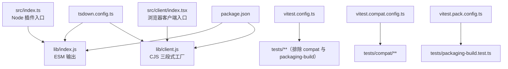
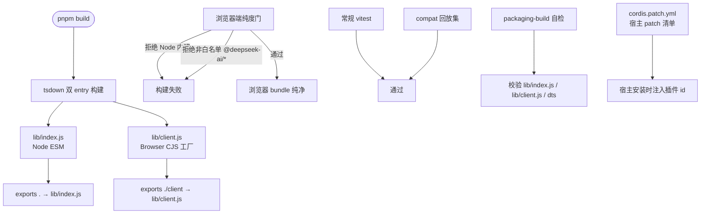
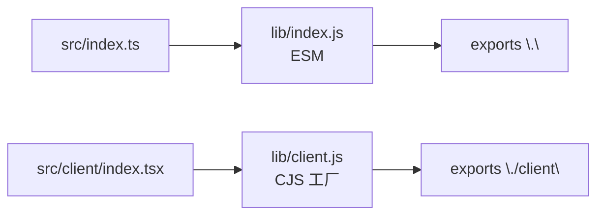
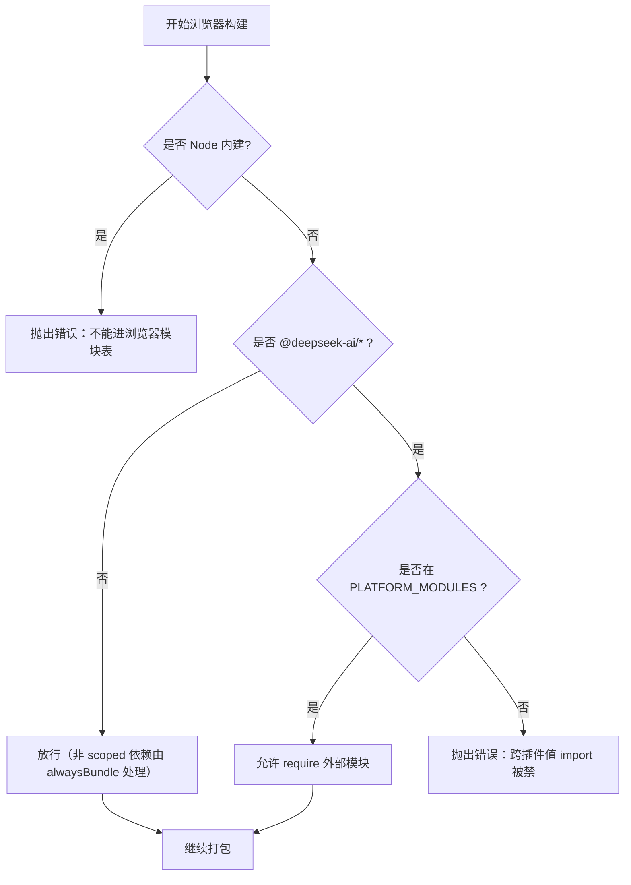
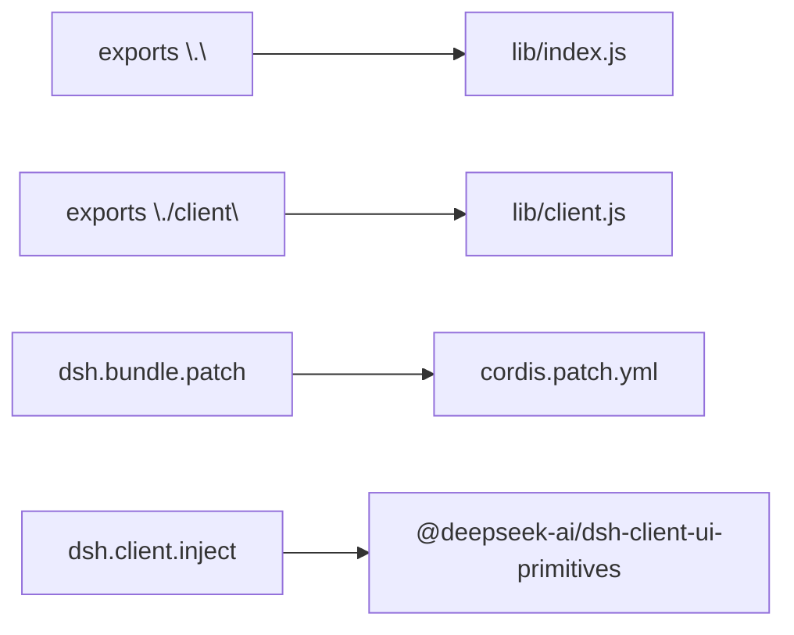
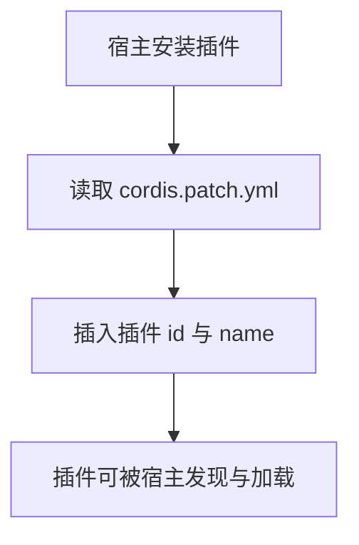
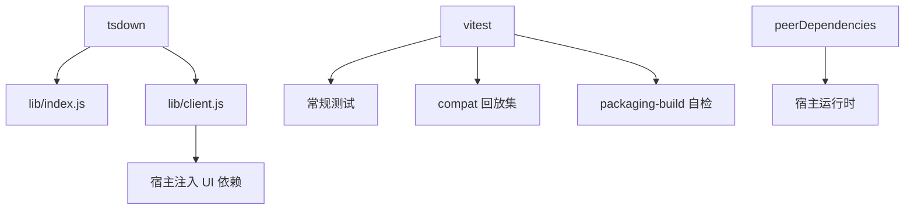

# 构建与部署

<cite>
**本文引用的文件**   
- [tsdown.config.ts](file://tsdown.config.ts)
- [package.json](file://package.json)
- [vitest.config.ts](file://vitest.config.ts)
- [vitest.compat.config.ts](file://vitest.compat.config.ts)
- [vitest.pack.config.ts](file://vitest.pack.config.ts)
- [cordis.patch.yml](file://cordis.patch.yml)
- [tests/packaging-build.test.ts](file://tests/packaging-build.test.ts)
</cite>

## 目录
1. [简介](#简介)
2. [项目结构](#项目结构)
3. [核心组件](#核心组件)
4. [架构总览](#架构总览)
5. [详细组件分析](#详细组件分析)
6. [依赖关系分析](#依赖关系分析)
7. [性能考虑](#性能考虑)
8. [故障排查指南](#故障排查指南)
9. [结论](#结论)

## 简介
本文面向维护者，说明本插件的构建、发布与 CI 门禁。重点包括：
- `tsdown.config.ts` 的双 entry 构建：Node ESM 与 Browser CJS。
- 浏览器端平台模块纯度门与 `PLATFORM_MODULES` 白名单。
- `package.json` 中 `peerDependencies` 版本区间、`exports` 字段、`dsh.bundle.patch` 与 `dsh.client.inject` 发布配置。
- `cordis.patch.yml` 作为宿主 patch 清单的作用。
- 本地构建命令、打包产物说明。
- 升级宿主版本时的同步步骤。
- CI 门禁：常规 vitest、compat 回放集、packaging-build 门控。
- 常见故障排查。

## 项目结构
本项目以 TypeScript 源码为主，通过 tsdown 产出 Node 端与浏览器端两个包入口；测试分为三类：常规 Node 集、compat 回放集、构建产物自检集。

**图示来源**
- [tsdown.config.ts:22-97](file://tsdown.config.ts#L22-L97)
- [package.json:1-118](file://package.json#L1-L118)
- [vitest.config.ts:1-11](file://vitest.config.ts#L1-L11)
- [vitest.compat.config.ts:1-11](file://vitest.compat.config.ts#L1-L11)
- [vitest.pack.config.ts:1-10](file://vitest.pack.config.ts#L1-L10)

**章节来源**
- [tsdown.config.ts:1-97](file://tsdown.config.ts#L1-L97)
- [package.json:1-118](file://package.json#L1-L118)
- [vitest.config.ts:1-11](file://vitest.config.ts#L1-L11)
- [vitest.compat.config.ts:1-11](file://vitest.compat.config.ts#L1-L11)
- [vitest.pack.config.ts:1-10](file://vitest.pack.config.ts#L1-L10)

## 核心组件
- **双 entry 构建器**：tsdown 同时生成 Node ESM 与 Browser CJS。
- **平台模块白名单**：`PLATFORM_MODULES` 决定浏览器 bundle 允许的外部 `require`。
- **浏览器端纯度门**：禁止 Node 内建模块与未列入白名单的 `@deepseek-ai/*` 模块进入浏览器 bundle。
- **发布契约**：`exports` 暴露 `.` 与 `./client`；`dsh.bundle.patch` 指定补丁清单；`dsh.client.inject` 声明注入 UI 依赖。
- **CI 三套测试**：常规集、compat 回放集、packaging-build 产物自检。

**章节来源**
- [tsdown.config.ts:10-97](file://tsdown.config.ts#L10-L97)
- [package.json:20-65](file://package.json#L20-L65)
- [vitest.config.ts:1-11](file://vitest.config.ts#L1-L11)
- [vitest.compat.config.ts:1-11](file://vitest.compat.config.ts#L1-L11)
- [vitest.pack.config.ts:1-10](file://vitest.pack.config.ts#L1-L10)

## 架构总览
下图展示从源码到发布包的构建与测试路径，以及浏览器端模块纯度约束。

**图示来源**
- [tsdown.config.ts:22-97](file://tsdown.config.ts#L22-L97)
- [package.json:20-65](file://package.json#L20-L65)
- [vitest.config.ts:1-11](file://vitest.config.ts#L1-L11)
- [vitest.compat.config.ts:1-11](file://vitest.compat.config.ts#L1-L11)
- [vitest.pack.config.ts:1-10](file://vitest.pack.config.ts#L1-L10)
- [cordis.patch.yml:1-3](file://cordis.patch.yml#L1-L3)
- [tests/packaging-build.test.ts:1-44](file://tests/packaging-build.test.ts#L1-L44)

## 详细组件分析

### 双 entry 构建：Node ESM 与 Browser CJS
- **Node ESM**
  - 入口：`src/index.ts`
  - 目标目录：`lib/index.js`
  - 格式：ESM
  - 平台：node
  - 类型声明：开启，直出 `.d.ts`
  - 依赖策略：`neverBundle` 保留 `@deepseek-ai/*` 为外部依赖；其余 npm 依赖 inline 进 bundle
- **Browser CJS**
  - 入口：`src/client/index.tsx`
  - 目标目录：`lib/client.js`
  - 格式：CJS 单文件
  - 平台：browser
  - Source map：开启
  - 依赖策略：白名单 `PLATFORM_MODULES` 内的模块不 inline，其余全部 inline
  - 浏览器兼容注入：定义 `process.env`、`import.meta.env` 等，避免浏览器环境缺失变量导致运行期错误
  - 导出契约：使用 banner/intro/footer 三段式包装，使宿主 `window.__ModuleLoader__.load` 能加载工厂函数

**图示来源**
- [tsdown.config.ts:22-97](file://tsdown.config.ts#L22-L97)
- [package.json:20-27](file://package.json#L20-L27)

**章节来源**
- [tsdown.config.ts:22-97](file://tsdown.config.ts#L22-L97)
- [package.json:20-27](file://package.json#L20-L27)

### 浏览器端平台模块纯度门与 PLATFORM_MODULES
- `PLATFORM_MODULES` 是官方宿主 web shell 冻结模块表的交集子集，包含 React 相关与 `@deepseek-ai/cordis`、`@deepseek-ai/dsh-client-store`、`-ui-slots`、`-ui-primitives`。
- 构建期 purity 插件会：
  - 拒绝任何 Node 内建模块进入浏览器 bundle。
  - 拒绝不在白名单中的 `@deepseek-ai/*` 模块。
- 运行时层面，浏览器 CJS 只允许对 `PLATFORM_MODULES` 中的模块执行 `require`；其他依赖必须被 inline。
- 测试中有一份独立白名单副本，用于断言最终 bundle 中所有 `require` 都落在允许表内，避免“配置写宽了但测试没发现”。

**图示来源**
- [tsdown.config.ts:10-97](file://tsdown.config.ts#L10-L97)
- [tests/packaging-build.test.ts:20-33](file://tests/packaging-build.test.ts#L20-L33)

**章节来源**
- [tsdown.config.ts:10-20](file://tsdown.config.ts#L10-L20)
- [tsdown.config.ts:60-97](file://tsdown.config.ts#L60-L97)
- [tests/packaging-build.test.ts:20-33](file://tests/packaging-build.test.ts#L20-L33)

### package.json 发布配置
- **exports 字段**
  - `.` 指向 `lib/index.js`，并附带类型声明路径。
  - `./client` 直接指向 `lib/client.js`，供宿主或上层加载浏览器端工厂。
- **files 字段**
  - 仅发布 `lib`、`cordis.patch.yml`、`README.md`、`LICENSE`，控制发布体积。
- **dsh.bundle.patch**
  - 指定 `./cordis.patch.yml`，作为宿主 patch 清单。
- **dsh.client.inject**
  - 声明需要注入的浏览器 UI 依赖，当前为 `@deepseek-ai/dsh-client-ui-primitives`。
  - 同时声明 `platform: "web"`，表示客户端运行于 Web 宿主。

**图示来源**
- [package.json:20-65](file://package.json#L20-L65)

**章节来源**
- [package.json:20-65](file://package.json#L20-L65)

### cordis.patch.yml：宿主 patch 清单
该清单在宿主安装插件时，将插件 id 与 name 插入宿主侧注册表，使宿主能够识别并加载本插件。清单条目包含：
- `id`：插件标识。
- `name`：npm 包名。

**图示来源**
- [cordis.patch.yml:1-3](file://cordis.patch.yml#L1-L3)
- [package.json:45-55](file://package.json#L45-L55)

**章节来源**
- [cordis.patch.yml:1-3](file://cordis.patch.yml#L1-L3)
- [package.json:45-55](file://package.json#L45-L55)

### peerDependencies 版本区间
- `@deepseek-ai/cordis`：`^4.0.2`
- `@deepseek-ai/dsh-tools`：多段区间，覆盖 0.1.x 与 0.2.0-rc.1 的兼容范围，排除不稳定或不再支持的次版本。
- `@deepseek-ai/schemastery`：`^3.18.2`
- `react`、`react-dom`：`^18.3.1`，且标记为 optional，因为浏览器端可由宿主提供。

注意：`peerDependencies` 的版本区间与 `dsh.compatibility.dshReleases` 的宿主快照版本需保持语义一致。若宿主版本更新，应同步检查两者。

**章节来源**
- [package.json:84-118](file://package.json#L84-L118)
- [package.json:56-65](file://package.json#L56-L65)

### 本地构建命令与产物
- **构建**
  - `pnpm build`：执行 tsdown 双 entry 构建。
  - `pnpm dev`：watch 模式开发。
  - `pnpm prepare`：安装后自动构建。
- **测试**
  - `pnpm test`：常规 Node 测试集。
  - `pnpm test:compat`：compat 回放集。
  - `pnpm test:pack`：先构建，再运行 packaging-build 自检。
  - `pnpm typecheck`：类型检查。
- **产物**
  - `lib/index.js`：Node ESM，不含浏览器端 `__ModuleLoader__` 泄漏。
  - `lib/client.js`：浏览器 CJS，三段式工厂包裹，带 sourcemap。
  - `lib/index.d.ts`：Node 端类型声明。
  - 测试断言要求 `lib/index.js` 包含插件身份与 API 前缀，`lib/client.js` 首行 load、footer 收口，且包含面板与状态层注册字符串。

**章节来源**
- [package.json:57-83](file://package.json#L57-L83)
- [tests/packaging-build.test.ts:1-44](file://tests/packaging-build.test.ts#L1-L44)

### 升级宿主版本时的同步步骤
当宿主版本或 `dsh-tools` 行为变化时，应按以下顺序操作：
1. 修改 `peerDependencies` 中相关包版本区间，确保与新宿主兼容。
2. 确认 `dsh.compatibility.dshReleases` 已加入新宿主快照版本。
3. 增加或更新实测用例，验证 Node 端与浏览器端行为。
4. 重新读入 `PLATFORM_MODULES`：
   - 确认宿主 web shell 的 `staticModules()` 新增或移除的模块。
   - 更新 `tsdown.config.ts` 中的 `PLATFORM_MODULES`。
   - 同步更新 `tests/packaging-build.test.ts` 中的独立白名单副本。
5. 执行 `pnpm build` 与 `pnpm test:pack`，确保产物与纯度门通过。
6. 如变更影响宿主 patch，更新 `cordis.patch.yml`。

**章节来源**
- [tsdown.config.ts:10-20](file://tsdown.config.ts#L10-L20)
- [tsdown.config.ts:60-97](file://tsdown.config.ts#L60-L97)
- [package.json:56-83](file://package.json#L56-L83)
- [tests/packaging-build.test.ts:20-33](file://tests/packaging-build.test.ts#L20-L33)

## 依赖关系分析
- **构建依赖**：tsdown 负责双 entry 构建；vitest 负责三类测试。
- **运行依赖**：Node 端依赖 cheerio、undici、yauzl 等；浏览器端依赖由宿主提供或注入。
- **peer 依赖**：宿主生态相关包通过 `peerDependencies` 约束版本，避免与宿主实现脱节。
- **测试依赖**：React Testing Library、jsdom、playwright 等用于 UI 与浏览器场景模拟。

**图示来源**
- [package.json:84-118](file://package.json#L84-L118)
- [vitest.config.ts:1-11](file://vitest.config.ts#L1-L11)
- [vitest.compat.config.ts:1-11](file://vitest.compat.config.ts#L1-L11)
- [vitest.pack.config.ts:1-10](file://vitest.pack.config.ts#L1-L10)

**章节来源**
- [package.json:84-118](file://package.json#L84-L118)
- [vitest.config.ts:1-11](file://vitest.config.ts#L1-L11)
- [vitest.compat.config.ts:1-11](file://vitest.compat.config.ts#L1-L11)
- [vitest.pack.config.ts:1-10](file://vitest.pack.config.ts#L1-L10)

## 性能考虑
- **Node ESM 构建**：`@deepseek-ai/*` 不 inline，减少重复打包体积，依赖宿主或安装环境提供。
- **Browser CJS 构建**：非白名单依赖全量 inline，保证浏览器端自洽；白名单模块保留 `require`，避免冗余代码。
- **Source map**：浏览器端开启 sourcemap，便于调试，但不影响生产体积过大问题，因为单个 CJS 文件已闭合。
- **条件导出**：浏览器端 resolve 条件名称包含 browser/import/require/default，降低 Node 入口误解析风险。

[本节为通用性能建议，不直接分析具体文件]

## 故障排查指南

### 依赖冲突
- **现象**：宿主或开发者环境中安装的 `@deepseek-ai/cordis`、`@deepseek-ai/dsh-tools`、`react`、`react-dom` 版本与 `peerDependencies` 区间不匹配。
- **排查**
  - 检查 `package.json` 的 `peerDependencies` 区间。
  - 核对宿主版本是否在 `dsh.compatibility.dshReleases` 中声明兼容。
  - 使用 pnpm 锁定依赖后重新安装，观察是否存在版本冲突警告。
- **解决**
  - 调整宿主或开发环境的依赖版本，使其落入区间。
  - 如需放宽区间，应评估兼容性后再改，并补充测试。

**章节来源**
- [package.json:84-118](file://package.json#L84-L118)
- [package.json:56-65](file://package.json#L56-L65)

### 浏览器端模块不可用
- **现象**：浏览器端加载时报错，提示某个 `@deepseek-ai/*` 模块无法 require，或 Node 内建模块被引入。
- **排查**
  - 检查是否新增了对未在 `PLATFORM_MODULES` 中声明的 `@deepseek-ai/*` 模块的值导入。
  - 检查浏览器端是否意外引用 Node 内建模块。
  - 查看 `lib/client.js` 中的 `require` 调用，是否与测试中的独立白名单一致。
- **解决**
  - 若模块确属宿主提供，更新 `PLATFORM_MODULES` 并同步测试副本。
  - 若模块不属于宿主提供，改为 inline 依赖或改用浏览器可用实现。
  - 重新构建并运行 `pnpm test:pack`。

**章节来源**
- [tsdown.config.ts:10-20](file://tsdown.config.ts#L10-L20)
- [tsdown.config.ts:60-97](file://tsdown.config.ts#L60-L97)
- [tests/packaging-build.test.ts:20-33](file://tests/packaging-build.test.ts#L20-L33)

### 宿主版本不匹配
- **现象**：插件在新宿主上无法加载，或功能异常。
- **排查**
  - 检查 `dsh.compatibility.dshReleases` 是否包含目标宿主快照版本。
  - 检查 `peerDependencies` 是否覆盖目标宿主的依赖版本。
  - 检查 `cordis.patch.yml` 是否正确注入插件 id。
- **解决**
  - 添加或更新宿主兼容声明。
  - 调整 `peerDependencies` 区间。
  - 修正 patch 清单并重新发布。

**章节来源**
- [package.json:56-65](file://package.json#L56-L65)
- [cordis.patch.yml:1-3](file://cordis.patch.yml#L1-L3)

### 构建产物不正确
- **现象**：`lib/index.js` 缺少插件身份或 API 前缀；`lib/client.js` 没有三段式工厂或 footer 位置不对。
- **排查**
  - 确认已执行 `pnpm build`。
  - 检查 tsdown 配置中 banner/intro/footer 是否被破坏。
  - 运行 `pnpm test:pack`，让自动化断言定位差异。
- **解决**
  - 修复构建配置或入口文件。
  - 重新构建并通过 packaging-build 测试。

**章节来源**
- [tests/packaging-build.test.ts:1-44](file://tests/packaging-build.test.ts#L1-L44)
- [tsdown.config.ts:70-97](file://tsdown.config.ts#L70-L97)

## 结论
本项目的构建与发布围绕 tsdown 双 entry 展开：Node ESM 保持宿主依赖外置，浏览器 CJS 通过白名单与纯度门保证模块纯度。发布契约通过 `exports`、`dsh.bundle.patch` 与 `dsh.client.inject` 明确宿主集成点。CI 通过常规测试、compat 回放与 packaging-build 三重门禁保障稳定性。维护者在升级宿主版本时，应同步修改 peer 区间、补充实测，并严格维护 `PLATFORM_MODULES`，以确保构建期与运行期的一致性。