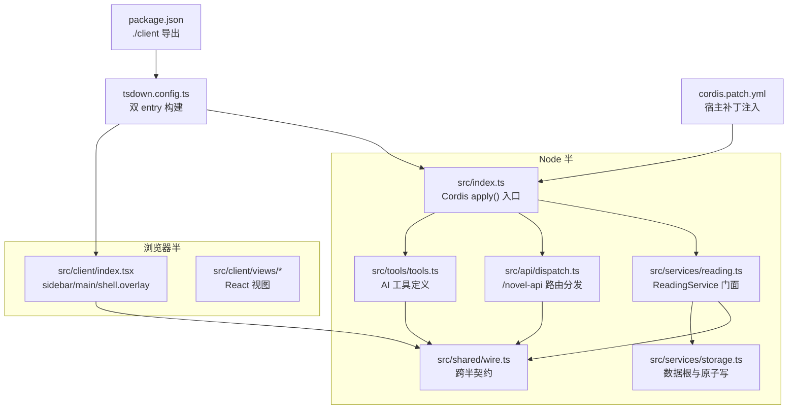
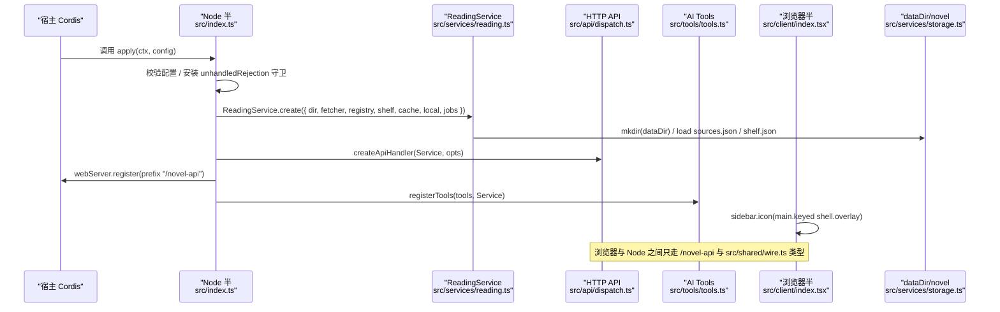
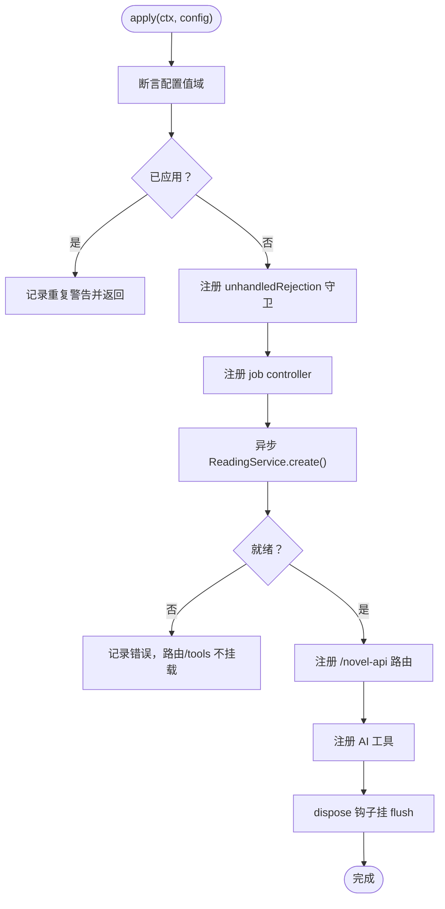
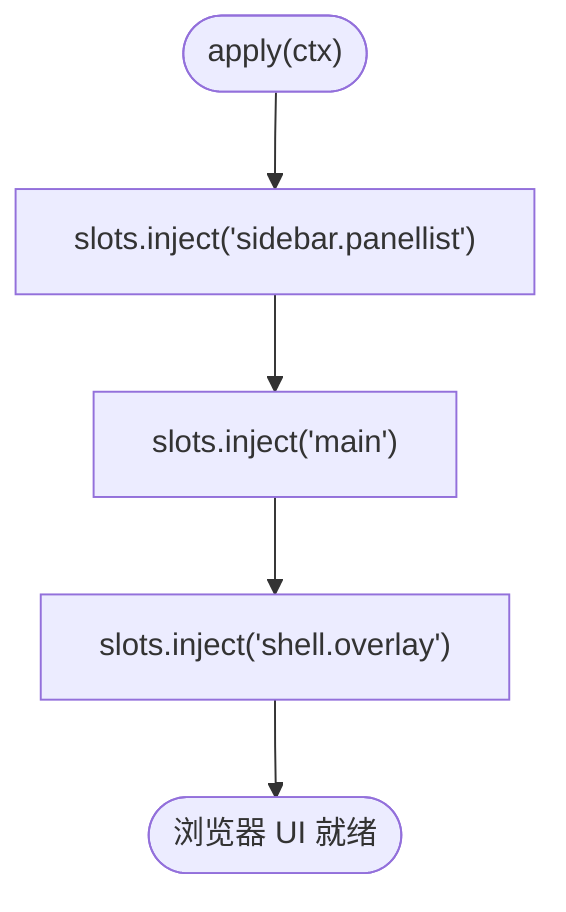
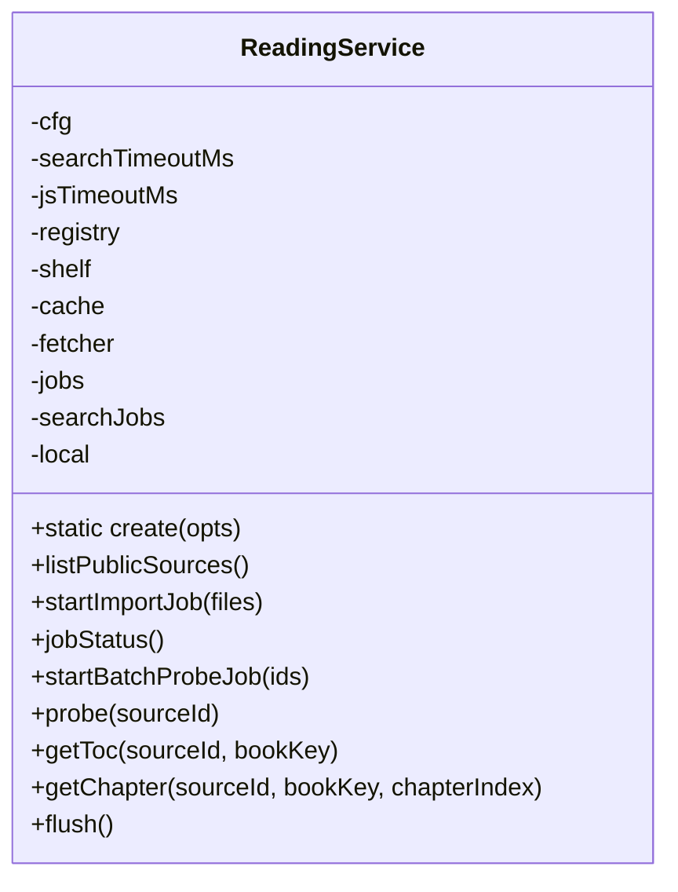
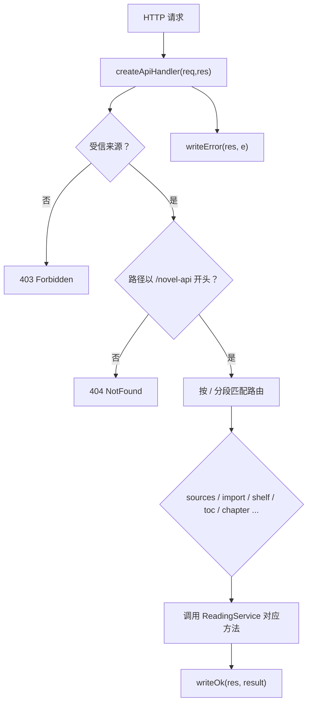
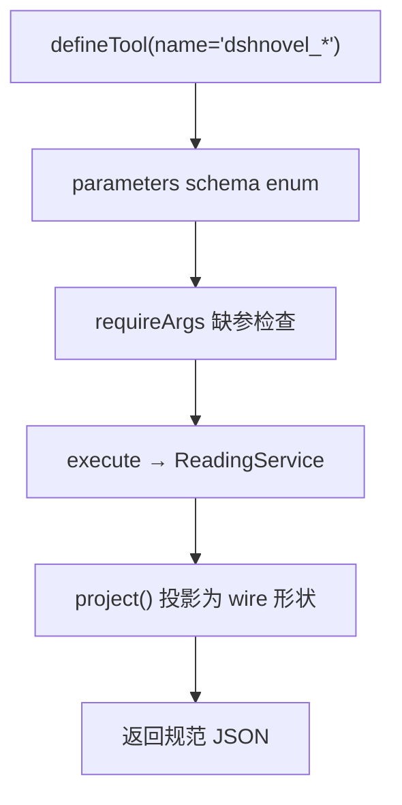
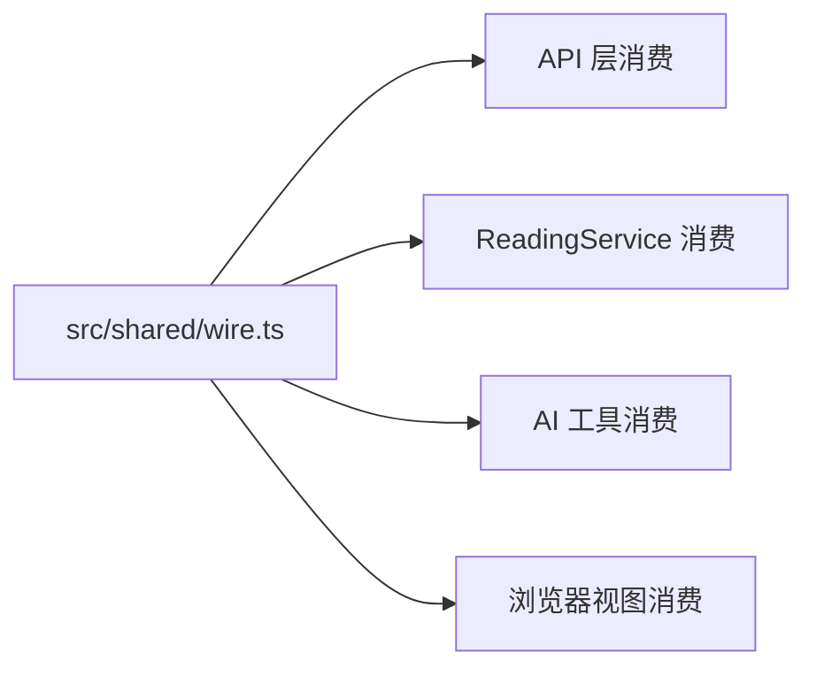
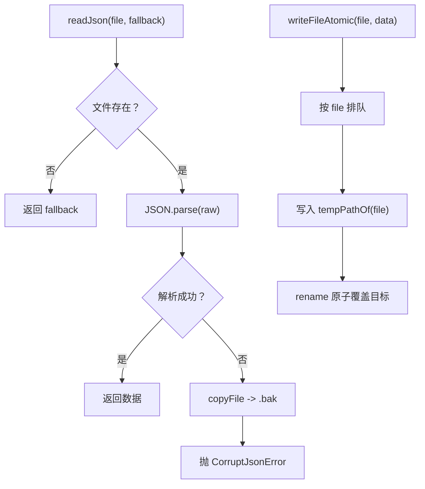
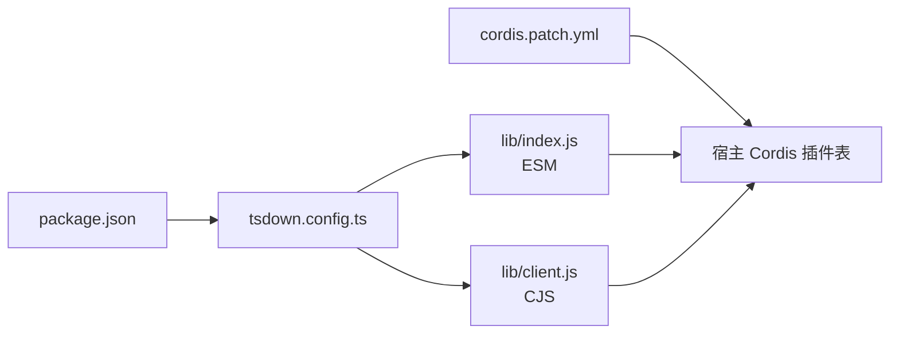

# 架构总览

<cite>
**本文引用的文件**   
- [src/index.ts](file://src/index.ts)
- [src/client/index.tsx](file://src/client/index.tsx)
- [tsdown.config.ts](file://tsdown.config.ts)
- [cordis.patch.yml](file://cordis.patch.yml)
- [package.json](file://package.json)
- [src/shared/wire.ts](file://src/shared/wire.ts)
- [src/services/reading.ts](file://src/services/reading.ts)
- [src/api/dispatch.ts](file://src/api/dispatch.ts)
- [src/tools/tools.ts](file://src/tools/tools.ts)
- [src/services/storage.ts](file://src/services/storage.ts)
- [docs/adr/0001-fail-loud-at-parse-time.md](file://docs/adr/0001-fail-loud-at-parse-time.md)
- [docs/adr/0008-no-speculative-storage.md](file://docs/adr/0008-no-speculative-storage.md)
- [docs/adr/0009-wire-single-owner.md](file://docs/adr/0009-wire-single-owner.md)
- [docs/adr/0020-host-contract-boundaries.md](file://docs/adr/0020-host-contract-boundaries.md)
- [docs/adr/0016-error-two-tier-and-origin-fence.md](file://docs/adr/0016-error-two-tier-and-origin-fence.md)
</cite>

## 目录
1. [简介](#简介)
2. [项目结构](#项目结构)
3. [核心组件](#核心组件)
4. [架构总览](#架构总览)
5. [详细组件分析](#详细组件分析)
6. [依赖关系分析](#依赖关系分析)
7. [性能与可靠性特征](#性能与可靠性特征)
8. [故障排查指南](#故障排查指南)
9. [结论](#结论)
10. [附录：关键设计取舍与 ADR](#附录关键设计取舍与-adr)

## 简介
本插件为 DeepSeek Harness（DSH）提供小说阅读能力：导入 legado 书源、聚合搜索、书架与连续滚动阅读，并通过 HTTP API 与 AI 工具暴露业务。整体按“Node 半 + 浏览器半”拆分：Node 端由 Cordis 插件入口装配服务、HTTP 路由与 AI 工具；浏览器端注册侧栏图标、中央面板与常驻状态层。`ReadingService` 是业务门面，统一服务于三类调用方：HTTP API、tools 与 UI。跨半通信只通过 `src/shared/wire.ts` 定义的 JSON 契约进行。

## 项目结构
仓库以功能域分层组织代码，但对外只暴露两个构建产物：Node ESM 与浏览器 CJS。

**图示来源**
- [src/index.ts:1-201](file://src/index.ts#L1-L201)
- [src/client/index.tsx:1-84](file://src/client/index.tsx#L1-L84)
- [tsdown.config.ts:1-97](file://tsdown.config.ts#L1-L97)
- [package.json:1-118](file://package.json#L1-L118)
- [cordis.patch.yml:1-3](file://cordis.patch.yml#L1-L3)

**章节来源**
- [src/index.ts:1-201](file://src/index.ts#L1-L201)
- [src/client/index.tsx:1-84](file://src/client/index.tsx#L1-L84)
- [tsdown.config.ts:1-97](file://tsdown.config.ts#L1-L97)
- [package.json:1-118](file://package.json#L1-L118)
- [cordis.patch.yml:1-3](file://cordis.patch.yml#L1-L3)

## 核心组件
- **Node 入口**：`src/index.ts` 导出 `name`、`inject`、`Config` 与 `apply(ctx, config)`，负责配置校验、沙箱守卫、宿主任务控制器、异步初始化、dispose flush、HTTP 路由与 tools 注册。
- **浏览器入口**：`src/client/index.tsx` 导出 `apply(ctx)`，同步注入 `sidebar.panellist`、`main` keyed slot 与 `shell.overlay`，并导出 `NovelView`、`NovelStatusOverlay`。
- **业务门面**：`src/services/reading.ts` 的 `ReadingService` 类封装搜索、详情、目录、正文、书架、本地书、批量探测、导入任务等全部业务逻辑，被 API、tools、UI 共享。
- **HTTP API**：`src/api/dispatch.ts` 的 `createApiHandler(service, opts)` 处理 `/novel-api` 前缀路由，做受信来源检查、URL 分段匹配与错误信封。
- **AI 工具**：`src/tools/tools.ts` 用 `defineTool` 注册六个 `dshnovel_*` 工具，参数走 schema enum，执行体调用 `ReadingService`。
- **跨半契约**：`src/shared/wire.ts` 集中定义所有 JSON 值形状、枚举、常量与路由片段，禁止运行时依赖。
- **磁盘持久化**：`src/services/storage.ts` 提供 `novelDir()`、`readJson()`、`writeFileAtomic()` 等低层存储原语，约定 `.tmp/.bak` 原子写与损坏备份。

**章节来源**
- [src/index.ts:1-201](file://src/index.ts#L1-L201)
- [src/client/index.tsx:1-84](file://src/client/index.tsx#L1-L84)
- [src/services/reading.ts:1-120](file://src/services/reading.ts#L1-L120)
- [src/api/dispatch.ts:1-120](file://src/api/dispatch.ts#L1-L120)
- [src/tools/tools.ts:1-120](file://src/tools/tools.ts#L1-L120)
- [src/shared/wire.ts:1-200](file://src/shared/wire.ts#L1-L200)
- [src/services/storage.ts:1-80](file://src/services/storage.ts#L1-L80)

## 架构总览
下图展示 Node 半与浏览器半的分界线、Cordis 装配流程、wire 契约以及 dataDir 落盘路径。

**图示来源**
- [src/index.ts:60-201](file://src/index.ts#L60-L201)
- [src/services/reading.ts:80-120](file://src/services/reading.ts#L80-L120)
- [src/api/dispatch.ts:40-80](file://src/api/dispatch.ts#L40-L80)
- [src/tools/tools.ts:1-60](file://src/tools/tools.ts#L1-L60)
- [src/client/index.tsx:50-84](file://src/client/index.tsx#L50-L84)
- [src/services/storage.ts:1-20](file://src/services/storage.ts#L1-L20)

## 详细组件分析

### Node 半入口：`src/index.ts`
- 作为 Cordis 插件的 `apply(ctx, config)`，声明硬依赖 `['webServer', 'tools', 'jobs']`。
- 使用 schemastery 校验配置字段类型，并在加载期对数值范围做断言，拒绝猜测性夹紧。
- 通过 `ctx.effect` 注册四件事：
  1. `ensureUnhandledGuard()` 常驻 `unhandledRejection` 守卫。
  2. `c.jobs.attachController('dsh-novel')` 让宿主任务注册表接受本插件任务。
  3. 异步 `ready()` 构造 `ReadingService`，失败时吞掉不炸整树，只留日志。
  4. dispose 钩子调用 `service.flush()`，确保书架与源注册表防抖写入最终落地。
- 成功 ready 后注册：
  - `/novel-api` 前缀路由。
  - 六个 AI 工具。
- 卸载时重置 `applied` 标志，支持 cordis 热替换。

**图示来源**
- [src/index.ts:60-201](file://src/index.ts#L60-L201)

**章节来源**
- [src/index.ts:1-201](file://src/index.ts#L1-L201)

### 浏览器半入口：`src/client/index.tsx`
- 声明 `inject = ['slots', 'sessions']`，不直接访问服务端实现。
- 同步注册三个插槽：
  - `sidebar.panellist`：id=`novel`，order=20，label=`小说`，图标为 android-ebook 启动器前景 SVG。
  - `main` keyed：key=`novel`，渲染 `NovelView`，无 Session 绑定。
  - `shell.overlay`：id=`novel-status`，常驻任务状态浮层，切面板与会话不卸载。
- 官方契约要求 sidebar 与 main 同批注册，避免选中缺失 main entry 抛错。

**图示来源**
- [src/client/index.tsx:20-84](file://src/client/index.tsx#L20-L84)

**章节来源**
- [src/client/index.tsx:1-84](file://src/client/index.tsx#L1-L84)

### 业务门面：`ReadingService`
- 构造器私有，公开静态工厂 `ReadingService.create(opts)`，在 Node 组合根装配 `SourceRegistry`、`Shelf`、`PageCache`、`LocalBooks`、Fetcher、`SourceJobs`、`SearchJobs`。
- 方法面向三类消费者：HTTP API、tools、UI，返回值类型从 `src/shared/wire.ts` re-export，不在服务层复制第二份形状。
- 关键默认值 `DEFAULT_SEARCH_PARALLEL`、`DEFAULT_JS_BUDGET_MS` 是本模块唯一主人，组合根再引用它们作为 DEFAULTS。

**图示来源**
- [src/services/reading.ts:80-120](file://src/services/reading.ts#L80-L120)

**章节来源**
- [src/services/reading.ts:1-120](file://src/services/reading.ts#L1-L120)

### HTTP API：`src/api/dispatch.ts`
- 一条 `prefix` 路由承载 `/novel-api`，内部按 URL segment 分发到 sources、import、jobStatus、batch-probe、probe、auth、enabled、shelf、toc、chapter、export、local 等分支。
- 每个分支先 `guard(method, ...)` 校验 HTTP 方法，再用 `readJsonBody`/`requireStringList` 校验请求体。
- 错误统一走 `ApiError` 或 domain 分类错误，最后由外层 try/catch 调 `writeError(res, e)`。

**图示来源**
- [src/api/dispatch.ts:40-120](file://src/api/dispatch.ts#L40-L120)

**章节来源**
- [src/api/dispatch.ts:1-120](file://src/api/dispatch.ts#L1-L120)

### AI 工具：`src/tools/tools.ts`
- 工具名强制 `dshnovel_` 前缀，与宿主生态隔离。
- 采用“少工具 + action 枚举”模型：当前定义六个工具，如搜索、读章、目录、书架操作等。
- 参数校验分两层：schema enum 拦未知 action；`requireArgs` 拦缺参，宁炸不猜。
- 输出统一规范 JSON，render 仅用于文本摘要，不改变真实值。

**图示来源**
- [src/tools/tools.ts:1-120](file://src/tools/tools.ts#L1-L120)

**章节来源**
- [src/tools/tools.ts:1-120](file://src/tools/tools.ts#L1-L120)

### 跨半契约：`src/shared/wire.ts`
- 集中定义书源状态、内容形态、探针结果、后台任务快照、搜索结果、书架条目、书目元数据等所有 JSON 形状。
- 可空语义明确：值字段为空时用 `| null`，可选键用 `?:`；时间戳/状态细节这类可能整键缺席者保持 `?:`。
- 构建约束：文件禁引任何运行时依赖，client 纯度门会把它 inline 进浏览器 bundle；type-only 依赖可保留。
- 常量如 `LOCAL_SOURCE_ID`、`SEARCH_HITS_CAP_PER_SOURCE`、`SEARCH_JOB_RETENTION_MS`、`NOVEL_API_PREFIX` 是跨半唯一主人。

**图示来源**
- [src/shared/wire.ts:1-200](file://src/shared/wire.ts#L1-L200)

**章节来源**
- [src/shared/wire.ts:1-200](file://src/shared/wire.ts#L1-L200)

### 数据目录与磁盘文件
- 数据根 `novelDir()` 位于 `$DSH_HOME/novel`，若未设置则回退 `~/.dsh/novel`。
- 读取 JSON 时：
  - ENOENT → 使用 fallback。
  - 解析失败 → 复制到 `<file>.bak` 并抛出 `CorruptJsonError`，绝不静默归空。
- 写入走 `writeFileAtomic(file, data)`：按文件名串行排队，临时文件命名含 pid+随机段，最终 rename 原子落盘，避免 Windows 并发 rename 报 EPERM。
- 常见文件包括 `sources.json`、`shelf.json`、缓存正文、EPUB/TXT 本地书归档等，均由上层服务通过 storage 原语访问。

**图示来源**
- [src/services/storage.ts:1-80](file://src/services/storage.ts#L1-L80)

**章节来源**
- [src/services/storage.ts:1-80](file://src/services/storage.ts#L1-L80)

## 依赖关系分析
- Node 入口依赖：`@deepseek-ai/cordis`、`@deepseek-ai/schemastery`、`src/api/dispatch.js`、`src/engine/js-sandbox.js`、`src/services/*`、`src/shared/wire.js`、`src/tools/tools.js`。
- 浏览器入口依赖 React 与宿主 slots；不直接依赖 Node 内建。
- 构建产物由 `tsdown.config.ts` 产出：
  - Node ESM：`lib/index.js` + `lib/index.d.ts`。
  - 浏览器 CJS：`lib/client.js`，带三段式 banner/footer 闭合工厂。
- `package.json` 的 `exports` 把 `./client` 指向 `lib/client.js`，`main` 指向 `lib/index.js`。
- `cordis.patch.yml` 插入 id=`dsh-novel`、name=`@xrn1997/dsh-novel`，使宿主能发现该插件包。

**图示来源**
- [package.json:1-118](file://package.json#L1-L118)
- [tsdown.config.ts:1-97](file://tsdown.config.ts#L1-L97)
- [cordis.patch.yml:1-3](file://cordis.patch.yml#L1-L3)

**章节来源**
- [package.json:1-118](file://package.json#L1-L118)
- [tsdown.config.ts:1-97](file://tsdown.config.ts#L1-L97)
- [cordis.patch.yml:1-3](file://cordis.patch.yml#L1-L3)

## 性能与可靠性特征
- **并发搜索**：默认并行度 `DEFAULT_SEARCH_PARALLEL=5`，由 `ReadingService` 控制聚合搜索批；配置校验拒绝 `≤0`，避免 `Promise.all([])` 饿死。
- **脚本预算**：默认 `DEFAULT_JS_BUDGET_MS=15000`，高于引擎 2s 默认，放行多请求目录脚本；仍由沙箱 vm realm 的 unhandled rejection 守卫兜底。
- **缓存容量**：`cacheMaxBytes` 控制 PageCache，默认来自 `DEFAULT_CACHE_MAX_BYTES`，避免磁盘膨胀。
- **导出节流**：`exportDelayMs` 透传给 API handler，控制批量导出节奏。
- **导入上限**：`localImportMaxBytes` 同时限制传输层流式计数与 LocalBooks domain 上限，防止大文件拖垮进程。
- **出站代理**：优先 `config.proxyUrl`，其次环境变量，再次 Windows 系统代理，最后直连；解决 undici 不读系统代理导致的 302/重置问题。
- **磁盘安全**：`.tmp/.bak` 原子写与损坏备份保证一次编辑不会静默清空整个源库或书架。

[本节为通用性能讨论，不直接分析具体代码行]

## 故障排查指南
- **插件重复启用崩溃**：bundles 与插槽双启用时会重复注册 `/novel-api`，宿主对重复 `(kind, path)` 抛错。入口用模块级 `applied` 守卫，dispose 时复位，允许热替换。
- **服务初始化失败**：`ReadingService.create` 异常被 catch 后只记录错误，不阻止 Cordis 启动；此时 `/novel-api` 与 tools 不挂载。
- **数据文件损坏**：`readJson` 遇到解析失败会生成 `.bak` 并抛 `CorruptJsonError`；检查 `dataDir/novel` 下是否有备份文件，恢复后重试。
- **Windows 并发写报错**：EPERM 通常来自并发 rename；storage 层已通过文件级队列收敛，若仍出现，检查是否绕过 `writeFileAtomic` 直接写。
- **AI 工具缺参**：`requireArgs` 会抛出清楚错误，列出缺失参数；不要静默补默认值。
- **跨源请求被拒**：`/novel-api` 要求 Origin/Referer 同源；本机 curl 或 agent 工具若无 Origin/Referer 视为合法；跨源 POST 即使 content-type 简单也会因 Origin 存在而被拒。

**章节来源**
- [src/index.ts:60-201](file://src/index.ts#L60-L201)
- [src/services/storage.ts:20-80](file://src/services/storage.ts#L20-L80)
- [src/api/dispatch.ts:40-120](file://src/api/dispatch.ts#L40-L120)
- [src/tools/tools.ts:1-60](file://src/tools/tools.ts#L1-L60)
- [docs/adr/0016-error-two-tier-and-origin-fence.md:1-10](file://docs/adr/0016-error-two-tier-and-origin-fence.md#L1-L10)

## 结论
DSH Novel 插件以 `ReadingService` 为单一业务门面，通过 `src/shared/wire.ts` 把 Node 半与浏览器半解耦；Node 入口承担组合、装配与生命周期管理，浏览器入口专注宿主插槽契约。构建层以 tsdown 双 entry 产出 ESM 与 CJS，packaging 通过 `cordis.patch.yml` 注入宿主。设计上坚持门面模式、契约居中、矩阵先行、收敛 barrel 与拒绝猜测报错，配合 ADR 系列决策，使错误阶段早、责任边界清、数据落盘安全。

## 附录：关键设计取舍与 ADR

### 解析期响亮失败（fail-loud-at-parse-time）
- 规则语法中白名单之外且构不成选择器的段，一律在 `parseRule` 阶段抛 `UnsupportedRuleError`，附带面、段序与原文。
- 不空结果冒充失败，也不透传到求值期；否则普查与诊断读数失真。
- 与对面差异处：混用 `||`/`&&`/`%%` 在本仓判语义冲突而拒绝，兼容目标是“书源格式写得出的规则”，不是合并语义对齐。

**章节来源**
- [docs/adr/0001-fail-loud-at-parse-time.md:1-9](file://docs/adr/0001-fail-loud-at-parse-time.md#L1-L9)

### 不预先造存储与作用域层（no-speculative-storage）
- 变量表 `ctx.vars` 是单次门面调用内的进程内表；引擎零内部状态，表由调用方持有。
- 不对接 CookieStore、chapter/book 作用域、多级缓存 TTL 等“对面有但本仓没有需求”的能力。
- 桥的所有请求经 `EvalContext` 注入的 fetcher，不在桥内 fetch。

**章节来源**
- [docs/adr/0008-no-speculative-storage.md:1-14](file://docs/adr/0008-no-speculative-storage.md#L1-L14)

### 跨半契约单一主人（wire single owner）
- `/novel-api` 的路由名、值形状、query 参数名、body 构造器、书目字段集全部住 `src/shared/wire.ts`。
- 书目字段集只由 `SHELF_META` + `pickShelfMeta` 管理；来源投影 `sourceName` 不进表，因为它是读取面 join 结果，不可 patch。
- 整轮搜索结果不上 wire，只出带游标的快照；宿主取消/结算不为 wire 加字段。

**章节来源**
- [docs/adr/0009-wire-single-owner.md:1-14](file://docs/adr/0009-wire-single-owner.md#L1-L14)

### 宿主契约边界（host contract boundaries）
- 工具名全部带 `dshnovel_` 前缀；宿主重名直接抛错，前缀是根治方案。
- `peerDependencies` 是宿主的安装闸，区间写窄才不被 `dsh plugin add` 拒绝；semver 预发布规则决定必须逐代显式开口。
- 编译所依与实测声明是两层：devDependency 精确钉版，`dsh.compatibility.dshReleases` 只列真跑过的宿主。
- 宿主类型面用本地窄镜像，不装宿主类型包、不做 `declare module` 增强；版本差异放到运行时暴露。
- 三个宿主服务全硬 inject，缺服务就响亮失败；入口双重启用守卫保护重复注册。

**章节来源**
- [docs/adr/0020-host-contract-boundaries.md:1-11](file://docs/adr/0020-host-contract-boundaries.md#L1-L11)

### 错误两分法与同源 fence
- domain 与引擎错误走分类单点，HTTP 状态码基于错误类型而非中文文案。
- 路由自检错误走 `ApiError`，不进分类学。
- `/novel-api` 只放行 loopback；Origin 在场须与 Host 同源，Referer 在场须与 Host 同源；无 Origin/Referer 放行是给本机工具与 curl 的承诺。

**章节来源**
- [docs/adr/0016-error-two-tier-and-origin-fence.md:1-10](file://docs/adr/0016-error-two-tier-and-origin-fence.md#L1-L10)