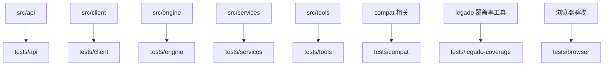
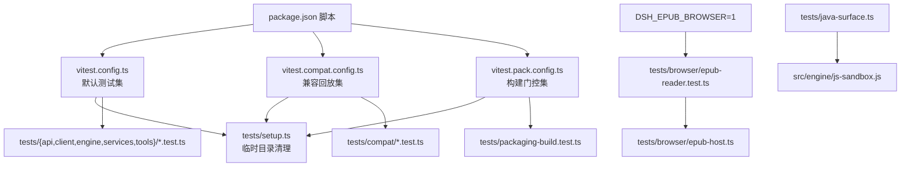
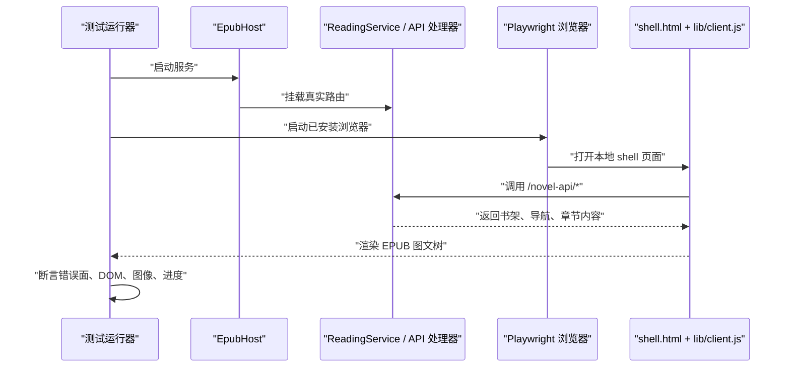
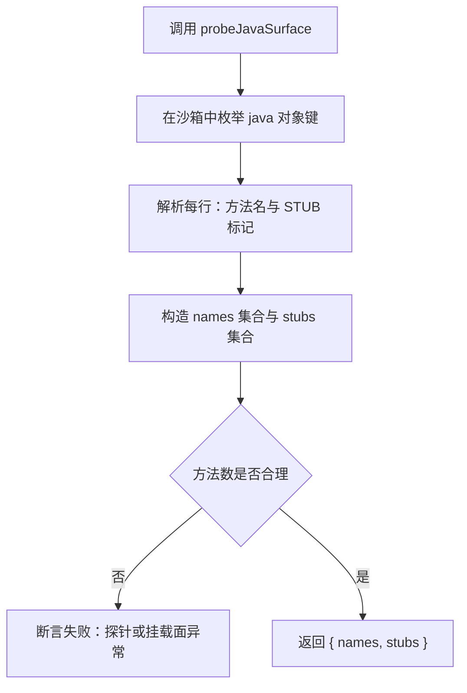
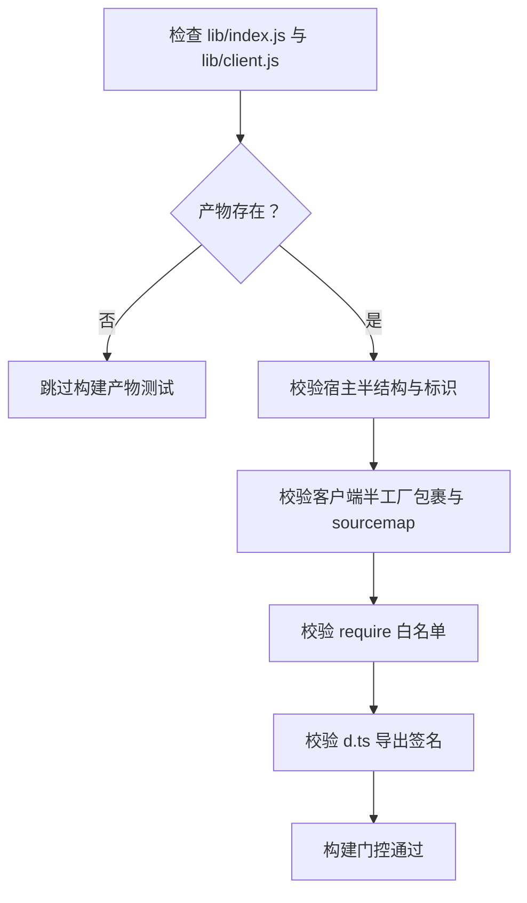
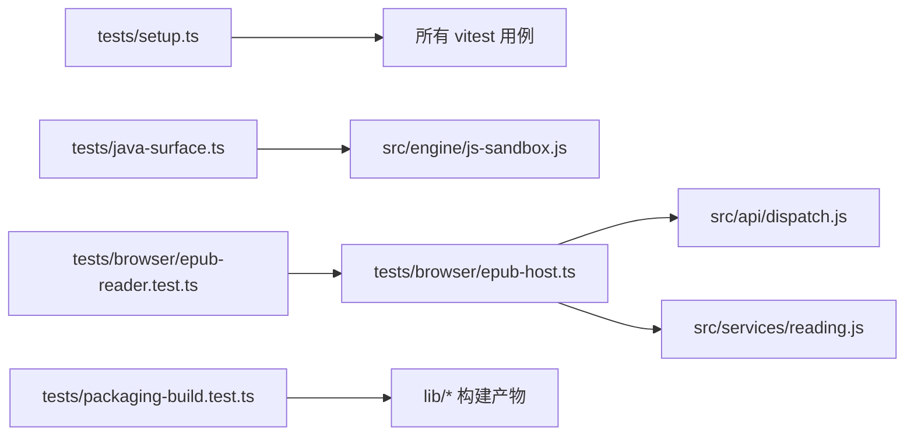

# 测试策略

<cite>
**本文引用的文件**   
- [package.json](file://package.json)
- [vitest.config.ts](file://vitest.config.ts)
- [vitest.compat.config.ts](file://vitest.compat.config.ts)
- [vitest.pack.config.ts](file://vitest.pack.config.ts)
- [tests/setup.ts](file://tests/setup.ts)
- [tests/java-surface.ts](file://tests/java-surface.ts)
- [tests/packaging-build.test.ts](file://tests/packaging-build.test.ts)
- [tests/browser/epub-host.ts](file://tests/browser/epub-host.ts)
- [tests/browser/epub-reader.test.ts](file://tests/browser/epub-reader.test.ts)
- [tests/legado-coverage/capture-upstream-snapshot.test.ts](file://tests/legado-coverage/capture-upstream-snapshot.test.ts)
</cite>

## 目录
1. [引言](#引言)
2. [项目结构与测试分区](#项目结构与测试分区)
3. [核心组件](#核心组件)
4. [架构总览](#架构总览)
5. [详细组件分析](#详细组件分析)
6. [依赖关系分析](#依赖关系分析)
7. [性能与稳定性建议](#性能与稳定性建议)
8. [故障排查指南](#故障排查指南)
9. [结论](#结论)

## 引言
本仓库的测试体系围绕“源码结构镜像 + 多配置分闸”展开：常规单元测试、兼容回放、打包构建门控彼此隔离，避免互相污染。浏览器侧通过 Playwright 对 EPUB 阅读链路做真实环境验收，jsdom 只承担轻量 DOM 模拟；`node:test` 与 `vitest` 并存于不同用例，由各自的入口脚本驱动。Java 桥接面通过沙箱探针集中暴露，约束 Java 方法契约不能靠正则或协议表自证。

## 项目结构与测试分区
测试目录按源码模块镜像组织：

**图表来源**
- [vitest.config.ts:1-11](file://vitest.config.ts#L1-L11)
- [vitest.compat.config.ts:1-11](file://vitest.compat.config.ts#L1-L11)
- [vitest.pack.config.ts:1-10](file://vitest.pack.config.ts#L1-L10)

### 默认测试集
默认 `pnpm test` 使用 `vitest.config.ts`，包含所有 `tests/**/*.test.{ts,tsx}`，但显式排除：
- `tests/compat/**`：兼容回放由独立配置运行。
- `tests/packaging-build.test.ts`：打包产物检查需要先构建，由 `pnpm test:pack` 运行。

环境为 Node，统一在 `tests/setup.ts` 注册生命周期清理。

### 兼容回放集
`vitest.compat.config.ts` 仅包含 `tests/compat/**/*.test.{ts,tsx}`，同样使用 Node 环境与统一 setup。捕获用例自带门控，默认跳过，不会干扰常规集。

### 打包构建门控
`vitest.pack.config.ts` 仅包含 `tests/packaging-build.test.ts`。该测试读取 `lib/index.js`、`lib/client.js`、`lib/index.d.ts` 等构建产物，断言宿主半与客户端半的结构、导出和依赖泄漏情况。

**章节来源**
- [vitest.config.ts:1-11](file://vitest.config.ts#L1-L11)
- [vitest.compat.config.ts:1-11](file://vitest.compat.config.ts#L1-L11)
- [vitest.pack.config.ts:1-10](file://vitest.pack.config.ts#L1-L10)

## 核心组件
- **Vitest 配置层**：三份配置文件定义互斥的测试范围，保证“常规逻辑 / 兼容回放 / 构建门控”三类用例不串跑。
- **全局临时目录清理**：`tests/setup.ts` 在 suite 结束时等待写侧收尾并删除登记目录，失败时输出诊断信息。
- **Playwright EPUB 门控**：`tests/browser/epub-reader.test.ts` 受环境变量控制，仅在本地具备已安装浏览器时执行。
- **Java 表面探针**：`tests/java-surface.ts` 通过沙箱枚举 `java` 对象，产出方法名集合与桩标记集合，作为 Java 桥接面的权威来源。
- **上游快照生成器**：`tests/legado-coverage/capture-upstream-snapshot.test.ts` 是开发期工具，用于从对面仓库抽取事实并写入快照文件。

**章节来源**
- [tests/setup.ts:1-37](file://tests/setup.ts#L1-L37)
- [tests/java-surface.ts:1-34](file://tests/java-surface.ts#L1-L34)
- [tests/packaging-build.test.ts:1-44](file://tests/packaging-build.test.ts#L1-L44)
- [tests/browser/epub-reader.test.ts:1-120](file://tests/browser/epub-reader.test.ts#L1-L120)
- [tests/legado-coverage/capture-upstream-snapshot.test.ts:1-79](file://tests/legado-coverage/capture-upstream-snapshot.test.ts#L1-L79)

## 架构总览
测试命令、配置与用例之间的关系如下：

**图表来源**
- [package.json:56-67](file://package.json#L56-L67)
- [vitest.config.ts:1-11](file://vitest.config.ts#L1-L11)
- [vitest.compat.config.ts:1-11](file://vitest.compat.config.ts#L1-L11)
- [vitest.pack.config.ts:1-10](file://vitest.pack.config.ts#L1-L10)
- [tests/setup.ts:1-37](file://tests/setup.ts#L1-L37)
- [tests/browser/epub-reader.test.ts:1-120](file://tests/browser/epub-reader.test.ts#L1-L120)
- [tests/browser/epub-host.ts:1-60](file://tests/browser/epub-host.ts#L1-L60)
- [tests/java-surface.ts:1-34](file://tests/java-surface.ts#L1-L34)

## 详细组件分析

### Vitest 配置矩阵
| 命令 | 配置 | 包含范围 | 关键排除或行为 |
|---|---|---|---|
| `pnpm test` | `vitest.config.ts` | `tests/**/*.test.{ts,tsx}` | 排除 `tests/compat/**` 与 `tests/packaging-build.test.ts` |
| `pnpm test:compat` | `vitest.compat.config.ts` | `tests/compat/**/*.test.{ts,tsx}` | 仅兼容回放 |
| `pnpm test:pack` | `vitest.pack.config.ts` | `tests/packaging-build.test.ts` | 先执行 `pnpm build` |

默认配置强调“常规集与 compat 回放互斥”，而 packaging-build 被设计为需要预构建的门控用例。

**章节来源**
- [vitest.config.ts:1-11](file://vitest.config.ts#L1-L11)
- [vitest.compat.config.ts:1-11](file://vitest.compat.config.ts#L1-L11)
- [vitest.pack.config.ts:1-10](file://vitest.pack.config.ts#L1-L10)
- [package.json:56-67](file://package.json#L56-L67)

### Playwright EPUB 门控测试
EPUB 浏览器测试不是普通单元测，而是“真服务 + 真构建产物 + 真浏览器”的验收门：
- 通过 `DSH_EPUB_BROWSER=1` 开启。
- 底座 `tests/browser/epub-host.ts` 启动真实 HTTP 服务，注入确定性假书源，禁止真实网络出站。
- 页面加载 `lib/client.js`，因此缺构建产物会直接失败。
- 使用 Playwright 打开已安装的 Edge/Chrome，不下载浏览器二进制。
- 每个用例拥有独立服务、独立数据根与独立浏览器上下文。

**图表来源**
- [tests/browser/epub-reader.test.ts:1-120](file://tests/browser/epub-reader.test.ts#L1-L120)
- [tests/browser/epub-host.ts:1-60](file://tests/browser/epub-host.ts#L1-L60)

**章节来源**
- [tests/browser/epub-reader.test.ts:1-120](file://tests/browser/epub-reader.test.ts#L1-L120)
- [tests/browser/epub-host.ts:1-60](file://tests/browser/epub-host.ts#L1-L60)

### jsdom 与 Node/Vitest 混合方式
- 常规测试运行在 Node 环境中，使用 `vitest` 提供 `describe`、`it`、`expect` 等接口。
- UI 相关逻辑放在 `tests/client`，多数通过 React Testing Library 配合 jsdom 模拟 DOM。
- 真正需要浏览器布局、图片解码、滚动容器、下载行为的场景交给 Playwright 浏览器测试，不再用 jsdom 硬模拟。
- 这种分层避免把 UI 稳定性绑到 jsdom 实现细节上，也避免让所有测试都启动真实浏览器。

**章节来源**
- [vitest.config.ts:1-11](file://vitest.config.ts#L1-L11)
- [tests/browser/epub-reader.test.ts:1-60](file://tests/browser/epub-reader.test.ts#L1-L60)

### Java 桥接方法约束
`tests/java-surface.ts` 的核心职责是“唯一权威问法”：
- 通过引擎沙箱执行一段 JavaScript，遍历 `java` 对象的键。
- 区分桩方法与真实方法，返回名称集合与桩标记集合。
- 断言方法数量大于阈值，防止探针退化。
- 注释明确说明：协议表和 BOOTSTRAP 都是第二份抄本，容易漂移；只有沙箱对象才是运行时真实挂载面。

**图表来源**
- [tests/java-surface.ts:1-34](file://tests/java-surface.ts#L1-L34)

**章节来源**
- [tests/java-surface.ts:1-34](file://tests/java-surface.ts#L1-L34)

### 构建产物门控
`tests/packaging-build.test.ts` 负责验证 `pnpm build` 产出的可读性：
- 若 `lib/index.js` 或 `lib/client.js` 不存在，整个 describe 跳过。
- 断言宿主半包含插件身份、API 前缀，且不含内部调试符号。
- 断言客户端半具备工厂包裹、sourcemap footer 位置正确、面板注册存在。
- 断言 client bundle 中的 `require` 白名单，防止非允许依赖泄漏。
- 断言类型声明包含关键导出签名。

**图表来源**
- [tests/packaging-build.test.ts:1-44](file://tests/packaging-build.test.ts#L1-L44)

**章节来源**
- [tests/packaging-build.test.ts:1-44](file://tests/packaging-build.test.ts#L1-L44)

### 上游快照生成工具
`tests/legado-coverage/capture-upstream-snapshot.test.ts` 是面向开发者的快照刷新工具：
- 受 `DSH_CAPTURE_UPSTREAM=1` 门控。
- 要求本地存在上游 checkout 路径。
- 扫描路径、规则字段、Java 方法名，写入 `compat/upstream/snapshot.json`。
- 断言路径、类、方法数量不为空，避免生成无效分母。

**章节来源**
- [tests/legado-coverage/capture-upstream-snapshot.test.ts:1-79](file://tests/legado-coverage/capture-upstream-snapshot.test.ts#L1-L79)

## 依赖关系分析
测试之间的耦合主要发生在“共享基础设施”层面，而不是用例之间：

**图表来源**
- [tests/setup.ts:1-37](file://tests/setup.ts#L1-L37)
- [tests/java-surface.ts:1-34](file://tests/java-surface.ts#L1-L34)
- [tests/browser/epub-reader.test.ts:1-120](file://tests/browser/epub-reader.test.ts#L1-L120)
- [tests/browser/epub-host.ts:1-60](file://tests/browser/epub-host.ts#L1-L60)
- [tests/packaging-build.test.ts:1-44](file://tests/packaging-build.test.ts#L1-L44)

当前设计保持了较好的内聚性：
- 配置层决定用例分组。
- 浏览器测试依赖真实构建产物，但不反向依赖其他测试。
- Java 探针依赖引擎沙箱，但不依赖业务服务。
- 打包测试只读产物，不导入源码，避免绕过 tsdown 构建过程。

潜在风险在于：
- 如果 `tests/setup.ts` 的临时目录清理出现竞态，可能影响后续用例。
- Playwright 测试依赖本地浏览器，环境差异较大。
- Java 表面探针结果依赖沙箱挂载实现，变更时需同步更新断言门槛。

**章节来源**
- [tests/setup.ts:1-37](file://tests/setup.ts#L1-L37)
- [tests/browser/epub-host.ts:1-60](file://tests/browser/epub-host.ts#L1-L60)
- [tests/java-surface.ts:1-34](file://tests/java-surface.ts#L1-L34)

## 性能与稳定性建议
### 通用原则
- **避免真实网络**：所有外部站点应替换为固定 fixture 或内存响应。EPUB 浏览器测试通过注入 fetch 实现，拒绝未知 URL 并记录未触网事实。
- **固定 fixture**：书源、章节、EPUB 样本、书架状态应复用同一份数据，避免每次随机生成导致断言漂移。
- **固定随机种子**：任何涉及排序、采样、ID 生成的逻辑都应可复现；不要依赖系统时间或进程 ID 作为输入。
- **减少真实 I/O**：磁盘操作尽量集中在 fixture 加载阶段，测试体只做断言。
- **限制浏览器测试范围**：浏览器测试成本高，只在必要时开启，并用最小视口和最少章节覆盖关键时序。

### 针对各分区的具体建议
- **单元测试**：保持纯函数风格，优先断言返回值与副作用边界。
- **服务层测试**：通过依赖注入替换网络、存储、缓存。
- **兼容回放**：记录与回放必须成对，新增矩阵行必须配套断言，否则回退到旧快照没有意义。
- **Java 桥接**：新增方法后同时更新探针断言或统计阈值，避免“协议表绿但沙箱挂”。
- **构建门控**：新增 bundle 依赖时同步更新白名单，不要让测试变成配置的复读机。

[本节为通用指导，不直接分析具体代码文件]

## 故障排查指南
### 临时目录残留
现象：测试结束后仍有临时目录。
排查步骤：
1. 查看 `tests/setup.ts` 输出的清理日志。
2. 确认测试是否持有异步写任务未在 suite 结束前释放。
3. 检查是否有自定义 writer 忘记登记目录。

**章节来源**
- [tests/setup.ts:1-37](file://tests/setup.ts#L1-L37)

### 浏览器测试无法启动
现象：运行 EPUB 浏览器测试时报找不到浏览器。
原因：
- 未设置 `DSH_EPUB_BROWSER=1`。
- 本机未安装 Edge/Chrome。
- `DSH_BROWSER_EXECUTABLE` 指向不可执行文件。
- 仓库规则禁止下载浏览器二进制。

处理：
- 设置 `DSH_EPUB_BROWSER=1`。
- 安装 Edge 或 Chrome，或通过 `DSH_BROWSER_EXECUTABLE` 指定路径。
- 确保 Playwright 能访问已安装的可执行文件。

**章节来源**
- [tests/browser/epub-reader.test.ts:1-60](file://tests/browser/epub-reader.test.ts#L1-L60)
- [tests/browser/epub-host.ts:1-120](file://tests/browser/epub-host.ts#L1-L120)

### 构建门控失败
现象：`pnpm test:pack` 报告产物缺失或结构不符。
处理：
- 先执行 `pnpm build`。
- 检查 tsdown 配置是否改动。
- 若新增 client 依赖，同步更新 `tests/packaging-build.test.ts` 的 require 白名单。

**章节来源**
- [tests/packaging-build.test.ts:1-44](file://tests/packaging-build.test.ts#L1-L44)

### Java 表面探针失败
现象：`probeJavaSurface` 报方法数不足。
原因：
- 沙箱挂载逻辑变化。
- 桩方法新增或移除。
- 探针枚举逻辑与实际挂载面不一致。

处理：
- 检查引擎沙箱中 `java` 对象的实际挂载。
- 更新探针断言阈值或桩标记判断逻辑。
- 确保协议表、BOOTSTRAP 桩清单与沙箱事实保持一致。

**章节来源**
- [tests/java-surface.ts:1-34](file://tests/java-surface.ts#L1-L34)

## 结论
本项目的测试策略以“配置分区 + 源码镜像 + 分层验证”为核心：常规逻辑用 vitest 快速回归，兼容回放单独运行，构建产物由独立门控校验；UI 与 EPUB 的真实时序交给 Playwright，jsdom 只承担轻量 DOM 模拟。Java 桥接面通过沙箱探针收敛断言口径，避免多份抄本漂移。新增测试时应遵循“单元测试放 services 对应位置、UI 测试放 client、兼容矩阵行必配断言”的规范，并始终优先考虑确定性、可复现性和无真实网络。