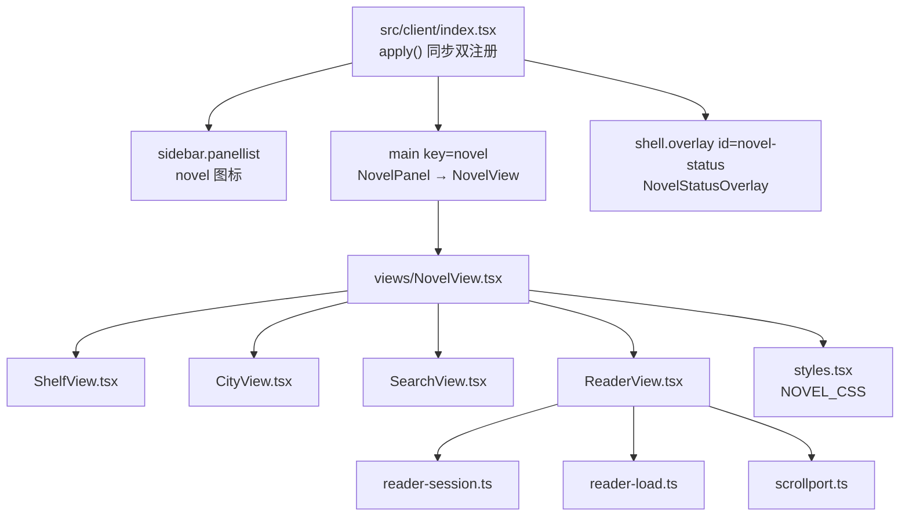
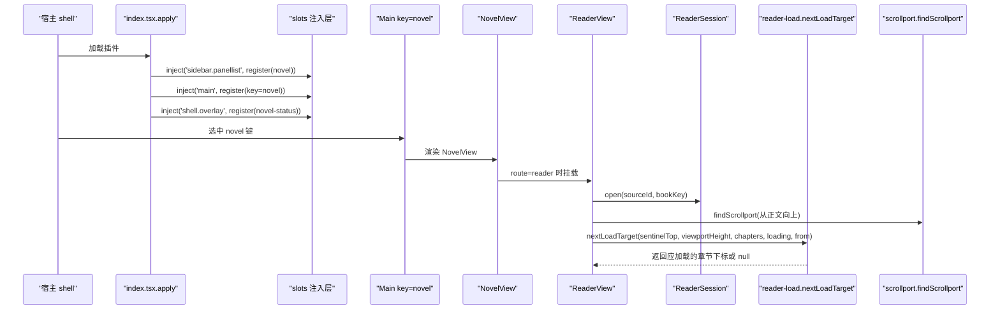
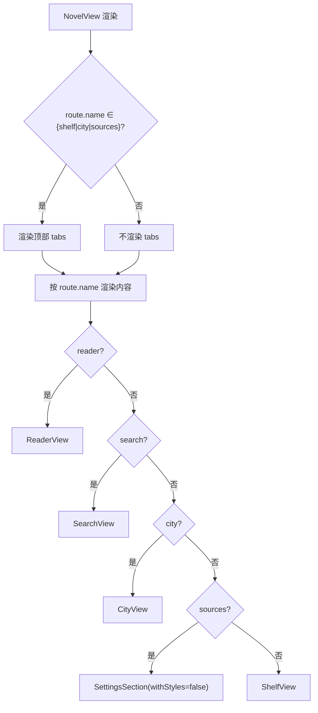
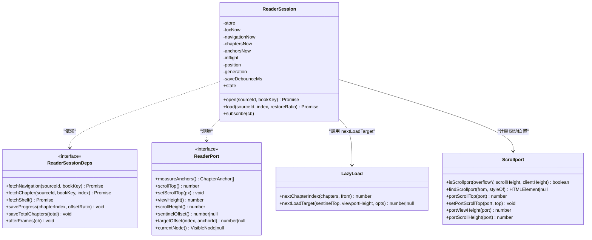
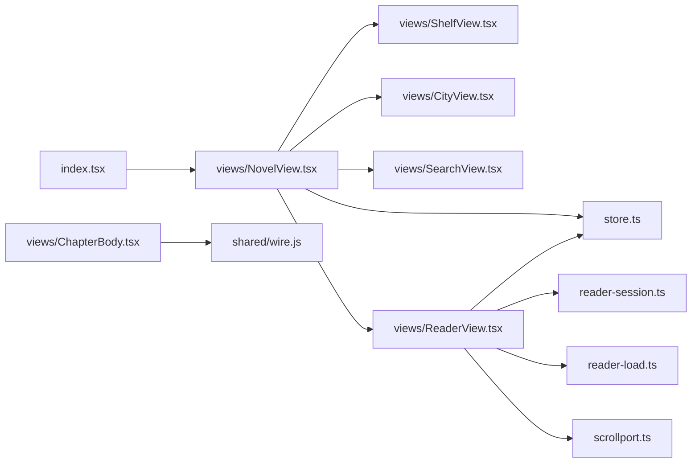

# 浏览器 UI 架构

<cite>
**本文引用的文件**   
- [src/client/index.tsx](file://src/client/index.tsx)
- [src/client/store.ts](file://src/client/store.ts)
- [src/client/styles.tsx](file://src/client/styles.tsx)
- [src/client/reader-session.ts](file://src/client/reader-session.ts)
- [src/client/reader-load.ts](file://src/client/reader-load.ts)
- [src/client/scrollport.ts](file://src/client/scrollport.ts)
- [src/client/views/NovelView.tsx](file://src/client/views/NovelView.tsx)
- [src/client/views/CityView.tsx](file://src/client/views/CityView.tsx)
- [src/client/views/ShelfView.tsx](file://src/client/views/ShelfView.tsx)
- [src/client/views/ReaderView.tsx](file://src/client/views/ReaderView.tsx)
- [src/client/views/SearchView.tsx](file://src/client/views/SearchView.tsx)
- [src/client/views/ChapterBody.tsx](file://src/client/views/ChapterBody.tsx)
</cite>

## 目录
1. [引言](#引言)
2. [项目结构](#项目结构)
3. [核心组件](#核心组件)
4. [架构总览](#架构总览)
5. [详细组件分析](#详细组件分析)
6. [依赖关系分析](#依赖关系分析)
7. [性能考量](#性能考量)
8. [故障排查指南](#故障排查指南)
9. [结论](#结论)

## 引言
本文面向浏览器端 React UI，聚焦“小说”全局面板：宿主侧栏图标、中央 keyed 槽与 shell.overlay 常驻状态层的同步注册；视图层从 NovelView 分发到 CityView（书城占位）、ShelfView（书架）、SearchView（搜索）、ReaderView（阅读器）及其子组件 ChapterBody（正文）。同时说明模块级 store、阅读会话、懒加载与滚动容器探测之间的协作，并给出主题 token、深浅切换、响应式布局、组件接口与性能优化建议。

## 项目结构
浏览器端入口位于 `src/client/index.tsx`，通过宿主 slots 机制把“小说”挂入三个位置：
- sidebar.panellist：侧栏图标行
- main key=novel：中央面板内容
- shell.overlay id=novel-status：任务状态常驻浮层

视图按 routeStore 的 Route 类型在 NovelView 内分派。阅读相关能力集中在 reader-session.ts、reader-load.ts、scrollport.ts 三件套中。样式集中由 styles.tsx 注入。

**图表来源**
- [src/client/index.tsx:1-84](file://src/client/index.tsx#L1-L84)
- [src/client/views/NovelView.tsx:1-60](file://src/client/views/NovelView.tsx#L1-L60)
- [src/client/views/ReaderView.tsx:1-200](file://src/client/views/ReaderView.tsx#L1-L200)

**章节来源**
- [src/client/index.tsx:1-84](file://src/client/index.tsx#L1-L84)
- [src/client/views/NovelView.tsx:1-60](file://src/client/views/NovelView.tsx#L1-L60)

## 核心组件
- NovelView：tab 容器，持有顶部导航与内容区，按 routeStore 渲染 ShelfView / CityView / SettingsSection / SearchView / ReaderView。
- CityView：书城未上线占位视图，IA 上与其他 tab 并列。
- ShelfView：书架列表、筛选、批量删除、本地导入、跳转搜索与阅读器。
- SearchView：后台搜索任务轮询、分组命中、加架与直接阅读。
- ReaderView：阅读器控制器（设置、导出、导入说明、目录/笔记面板），协调 ReaderSession。
- ChapterBody：正文白名单渲染器，文本段落与图文章节统一呈现，链接走 onNavigate。

**章节来源**
- [src/client/views/NovelView.tsx:1-60](file://src/client/views/NovelView.tsx#L1-L60)
- [src/client/views/CityView.tsx:1-16](file://src/client/views/CityView.tsx#L1-L16)
- [src/client/views/ShelfView.tsx:1-200](file://src/client/views/ShelfView.tsx#L1-L200)
- [src/client/views/SearchView.tsx:1-200](file://src/client/views/SearchView.tsx#L1-L200)
- [src/client/views/ReaderView.tsx:1-200](file://src/client/views/ReaderView.tsx#L1-L200)
- [src/client/views/ChapterBody.tsx:1-193](file://src/client/views/ChapterBody.tsx#L1-L193)

## 架构总览
“小说”插件以 apply(ctx) 为半入口，通过 ctx.effect + slots.inject 同步完成三项注册，避免“选中 main 却缺对应 entry”的宿主抛错。视图树自顶向下由 NovelView 管理路由；阅读流程由 ReaderView 启动 ReaderSession，后者负责目录恢复、逐章加载、预取、锚点定位与进度防抖落盘；懒加载决策来自 reader-load.ts；滚动容器探测来自 scrollport.ts。

**图表来源**
- [src/client/index.tsx:45-84](file://src/client/index.tsx#L45-L84)
- [src/client/views/NovelView.tsx:30-60](file://src/client/views/NovelView.tsx#L30-L60)
- [src/client/reader-load.ts:1-50](file://src/client/reader-load.ts#L1-L50)
- [src/client/scrollport.ts:1-68](file://src/client/scrollport.ts#L1-L68)

## 详细组件分析

### 入口与面板注册（src/client/index.tsx）
apply 中用 ctx.effect 包裹三次 slots.inject，分别注册：
- sidebar.panellist：id=novel，order=20，label=“小说”，图标组件 NovelPanelIcon
- main：key=novel，占用者 NovelPanel（内部渲染 NovelView）
- shell.overlay：id=novel-status，order=100，label=“小说任务状态”，占用者 NovelStatusOverlay

契约要点：
- 两个座位必须同批注册；官方契约规定选中缺失的 main entry 会抛错。
- shell.overlay 是 root 作用域 list，默认 click-through；条目自行收回 pointer-events。
- NovelPanelIcon 使用 android-ebook 字形，viewBox=0 0 1025 1025，fill=currentColor。

**章节来源**
- [src/client/index.tsx:1-84](file://src/client/index.tsx#L1-L84)

### 路由与视图分发（src/client/views/NovelView.tsx）
Route 枚举五分支：shelf、city、sources、reader、search。NovelView 仅对 shelf/city/sources 显示顶部 tabs；reader/search 各自有返回导航，不改变顶部 tab。content 区根据 route.name 分发到具体视图。SettingsSection 在 sources tab 显式 withStyles=false，防止重复注入 NOVEL_CSS。

**图表来源**
- [src/client/views/NovelView.tsx:1-60](file://src/client/views/NovelView.tsx#L1-L60)

**章节来源**
- [src/client/views/NovelView.tsx:1-60](file://src/client/views/NovelView.tsx#L1-L60)

### 书城占位（src/client/views/CityView.tsx）
当前为诚实占位空态，IA 已预留，后续上线只需填充该分支。

**章节来源**
- [src/client/views/CityView.tsx:1-16](file://src/client/views/CityView.tsx#L1-L16)

### 书架（src/client/views/ShelfView.tsx）
职责：
- 读取书架列表，失败不伪装为空架。
- 关键词搜索跳转到 SearchView。
- 筛选簇与多选批量删除（POST batch-delete）。
- 本地 TXT/EPUB 导入回执就地展示，带警告时不自动进阅读器。
- 卡片元信息、封面首字色块委托给 shelf-view-model 与 util。

典型 props：
- deps?: ClientCoreDeps（测试可注入假实现）

典型事件与副作用：
- 点击卡片进入阅读器
- 点击删除触发确认模态
- 提交搜索表单跳转搜索页
- 选择模式切换、全选/清空/批量删除

**章节来源**
- [src/client/views/ShelfView.tsx:1-200](file://src/client/views/ShelfView.tsx#L1-L200)

### 搜索（src/client/views/SearchView.tsx）
职责：
- 提交一轮后台搜索任务，按游标轮询增量渲染。
- 结果按源分组，失败组折叠一行 details。
- 命中行支持“阅读”和“加书架”两个动作。
- 首次 mount 消费 route.keyword 后立刻清理，避免重挂载重复提交。

典型 props：
- deps?: ClientCoreDeps

典型事件：
- 输入框回车或点击“搜索”提交
- “停止搜索”取消本轮
- 命中行点击“阅读”或“＋ 加书架”

**章节来源**
- [src/client/views/SearchView.tsx:1-200](file://src/client/views/SearchView.tsx#L1-L200)

### 阅读器与正文（src/client/views/ReaderView.tsx 与 src/client/views/ChapterBody.tsx）
ReaderView 提供：
- PrefsPanel：字号、行距、栏宽、纸张色、控制器深色开关。
- ExportPanel：导出范围校验与运行状态。
- ImportNotesPanel：EPUB 有损导入持久告警重看入口。
- 与 ReaderSession 协作，驱动目录、章节、进度、定位。

ChapterBody 提供：
- 文本章节按换行切段渲染。
- 图文章节按白名单映射节点，链接转 button 并通过 onNavigate 上报目标。
- 插图用可信宽高比占位，失败时显示可见提示。

ReaderView 与 ChapterBody 的典型交互：
- ReaderView 将 ReadingTarget 与 LinkRole 传给 ChapterBody.onNavigate。
- 上层根据 role 决定跳转到目录项、注释或返回原处。

**章节来源**
- [src/client/views/ReaderView.tsx:1-200](file://src/client/views/ReaderView.tsx#L1-L200)
- [src/client/views/ChapterBody.tsx:1-193](file://src/client/views/ChapterBody.tsx#L1-L193)

### 模块级状态（src/client/store.ts）
- createStore/useStore：基于 useSyncExternalStore 的轻量 store，renderToString 友好。
- routeStore：保存 Route，navigate(route) 切换视图。
- prefsStore：持久化阅读偏好（fontSize、lineHeight、measure、paperColor、darkController），写入 localStorage。

注意：业务数据不进 store，每次挂载经 api 拉取，组件内 useState 持有现场状态。

**章节来源**
- [src/client/store.ts:1-66](file://src/client/store.ts#L1-L66)

### 阅读会话、懒加载与滚动容器（reader-session.ts、reader-load.ts、scrollport.ts）
ReaderSession：
- 唯一持有“目录→存档恢复→逐章加载→预取→进度落盘”时序。
- RESTORE_SLOT 预约在途槽，防止恢复被预取抢占。
- position={chapterIndex, offsetRatio} 是唯一真相，saveProgress 防抖 2s。
- 维护 inflight、generation、returnStack 等窗口状态，避免陈旧闭包与跨代污染。

reader-load.ts：
- nextChapterIndex：从视口所在章往后找第一个未载章。
- nextLoadTarget：若已有在途则去重；当未载边界哨兵进入“视口底+N屏”时返回待加载章。

scrollport.ts：
- isScrollport：overflow-y 允许且 scrollHeight > clientHeight+1。
- findScrollport：从正文向上查找真正滚动的祖先，找不到视为文档自身滚动。
- portScrollTop/portViewHeight/portScrollHeight 等适配 window 或容器。

**图表来源**
- [src/client/reader-session.ts:1-200](file://src/client/reader-session.ts#L1-L200)
- [src/client/reader-load.ts:1-50](file://src/client/reader-load.ts#L1-L50)
- [src/client/scrollport.ts:1-68](file://src/client/scrollport.ts#L1-L68)

**章节来源**
- [src/client/reader-session.ts:1-200](file://src/client/reader-session.ts#L1-L200)
- [src/client/reader-load.ts:1-50](file://src/client/reader-load.ts#L1-L50)
- [src/client/scrollport.ts:1-68](file://src/client/scrollport.ts#L1-L68)

## 依赖关系分析
- index.tsx 依赖 views/NovelView 与 NovelStatusOverlay，并通过宿主 slots 暴露三个座位。
- NovelView 依赖 store.routeStore 与四个视图组件。
- ReaderView 依赖 reader-session、reader-load、scrollport、store.prefsStore。
- ShelfView 与 SearchView 依赖 shared/wire 路由与 API 调度。
- ChapterBody 依赖 shared/wire.resourceUrl 与视图 types。

**图表来源**
- [src/client/index.tsx:1-84](file://src/client/index.tsx#L1-L84)
- [src/client/views/NovelView.tsx:1-60](file://src/client/views/NovelView.tsx#L1-L60)
- [src/client/views/ReaderView.tsx:1-200](file://src/client/views/ReaderView.tsx#L1-L200)

**章节来源**
- [src/client/index.tsx:1-84](file://src/client/index.tsx#L1-L84)
- [src/client/views/NovelView.tsx:1-60](file://src/client/views/NovelView.tsx#L1-L60)
- [src/client/views/ReaderView.tsx:1-200](file://src/client/views/ReaderView.tsx#L1-L200)

## 性能考量
- 虚拟滚动：当前书架、搜索结果与阅读器正文均采用按需加载策略，未实现完整虚拟滚动。
- 按需加载章节：ReaderSession 单在途槽 + reader-load.nextLoadTarget 预取余量（PRELOAD_SCREENS=2），避免滚动风暴与远跳预取错位。
- SSE 增量更新：仓库未发现客户端 SSE 增量更新逻辑；搜索采用后台任务轮询增量渲染。
- 滚动容器解耦：scrollport.findScrollport 使进度与定位不绑定具体容器，迁移宿主链不影响锚点计算。
- 样式注入：NOVEL_CSS 作为模板字符串注入，HMR 整体替换，避免多次重复注入导致 DOM 体积膨胀。

[本节为通用性能讨论，不直接分析具体代码片段]

## 故障排查指南

### 组件未渲染
- 检查 index.tsx 是否已完成 sidebar.panellist 与 main key=novel 的双注册；任一缺失都会导致宿主选中抛错或无内容。
- 检查 NovelView 的 route.name 是否正确分发到目标视图。
- 检查 SettingsSection 在 sources tab 是否传入 withStyles=false，避免重复注入样式。

**章节来源**
- [src/client/index.tsx:45-84](file://src/client/index.tsx#L45-L84)
- [src/client/views/NovelView.tsx:30-60](file://src/client/views/NovelView.tsx#L30-L60)

### 样式 token 缺失
- 所有 var(--novel-*) 引用必须在 .novel-root 或 [data-novel-scope] 下有定义；token 守卫会在测试中拦截未定义引用。
- 避免写死白色叠层或状态色 hex；主题深浅由宿主 dsw-alias-* 语义 token 控制。
- novel-dark 类会覆盖控制器层 token，需同步覆盖派生色（brand-soft/tint-line/ring/skeleton）。

**章节来源**
- [src/client/styles.tsx:1-200](file://src/client/styles.tsx#L1-L200)

### 滚动错位
- 若阅读器滚不动或正文裁在首屏，检查 .novel-main 的 overflow 链是否被放开；规则要求视图区自己滚动。
- 定位异常时核对 scrollport.findScrollport 是否找到正确容器；找不到时回退到文档滚动。
- 检查 sentinelOffset/targetOffset 返回值是否为 null，null 表示不可定位，不应落位。

**章节来源**
- [src/client/scrollport.ts:1-68](file://src/client/scrollport.ts#L1-L68)
- [src/client/reader-session.ts:1-200](file://src/client/reader-session.ts#L1-L200)

### 面板未挂载
- shell.overlay 的 id=novel-status 需在 apply 中注册；否则 NovelStatusOverlay 不会出现在宿主 overlay 层。
- 条目指针事件：overlay 默认 click-through，条目必须自行设置 pointer-events:auto 才能交互。
- 控制器面板 z-index：工具栏 > 遮罩 > 面板，若面板不可点，优先检查 CTRL_Z.toolbar/mask/panel 顺序。

**章节来源**
- [src/client/index.tsx:45-84](file://src/client/index.tsx#L45-L84)
- [src/client/views/ReaderView.tsx:1-200](file://src/client/views/ReaderView.tsx#L1-L200)

## 结论
“小说”浏览器 UI 以 index.tsx 的同步双注册为起点，NovelView 作为路由容器统一管理书架、书城、书源管理与阅读器；reader-session.ts 承担阅读时序唯一真相，reader-load.ts 提供懒加载决策，scrollport.ts 解耦滚动容器身份。styles.tsx 通过设计 token 与 novel-dark 实现深浅主题与响应式布局。未来若引入虚拟滚动或 SSE 增量更新，应在 ReaderSession 与 ReaderView 之间新增稳定接口，保持章节载荷形态与滚动探测解耦。