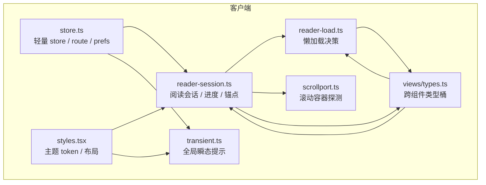
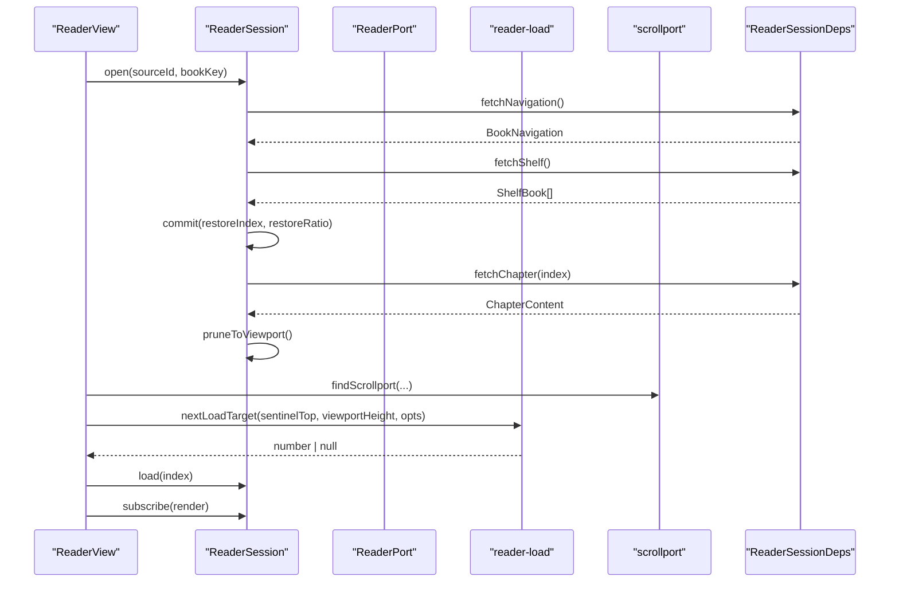
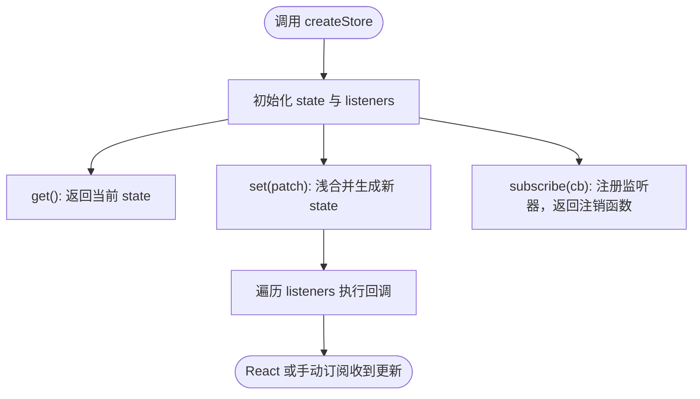
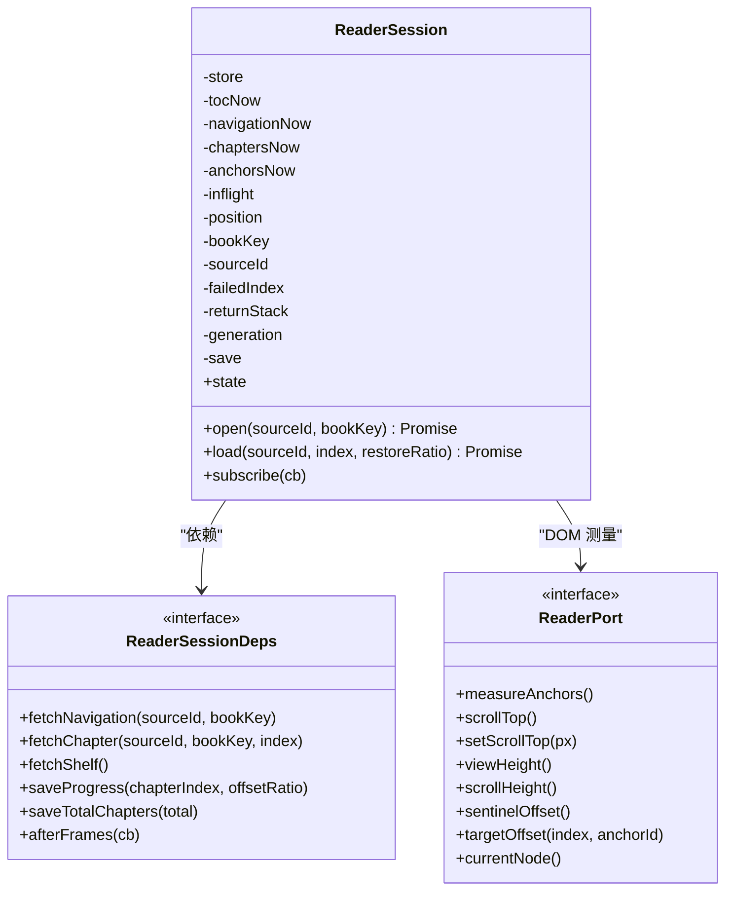
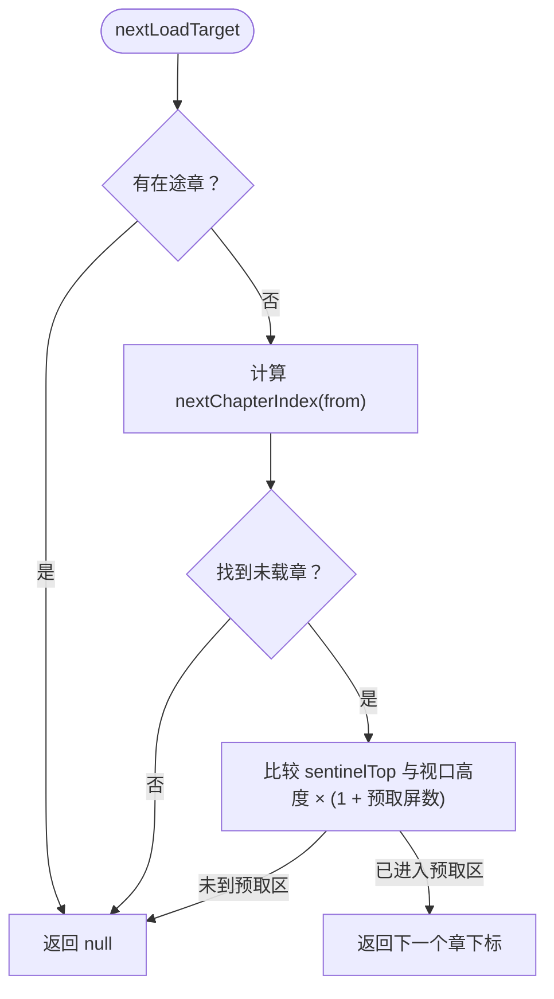
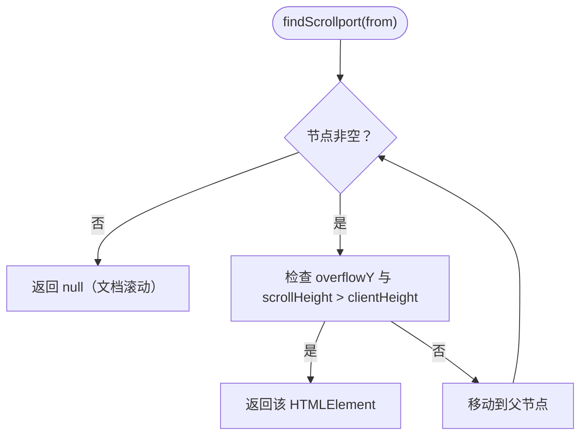
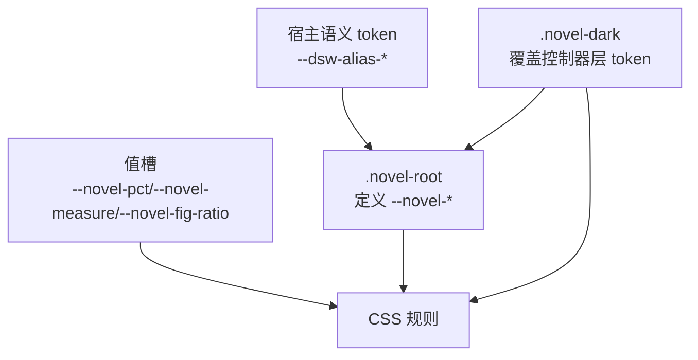
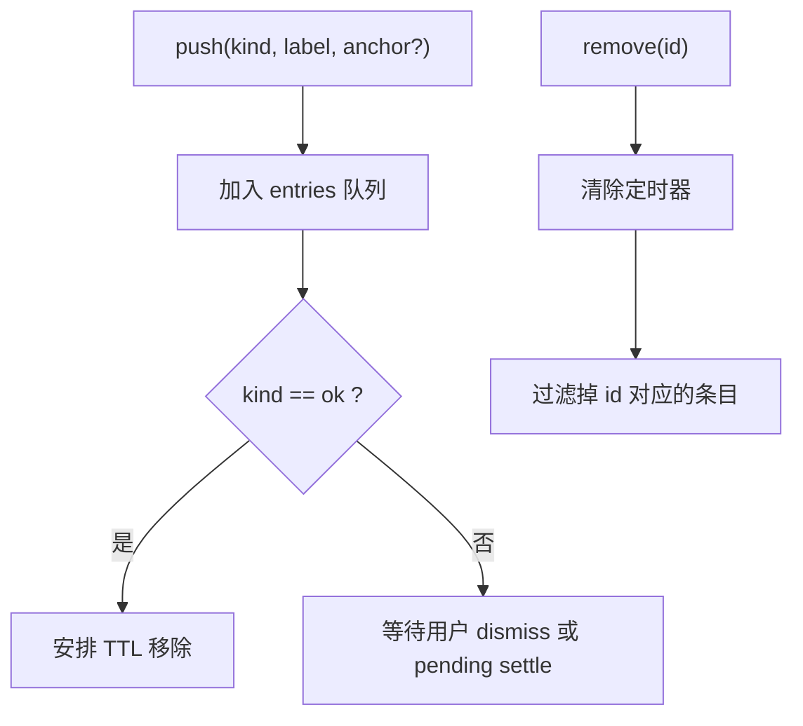
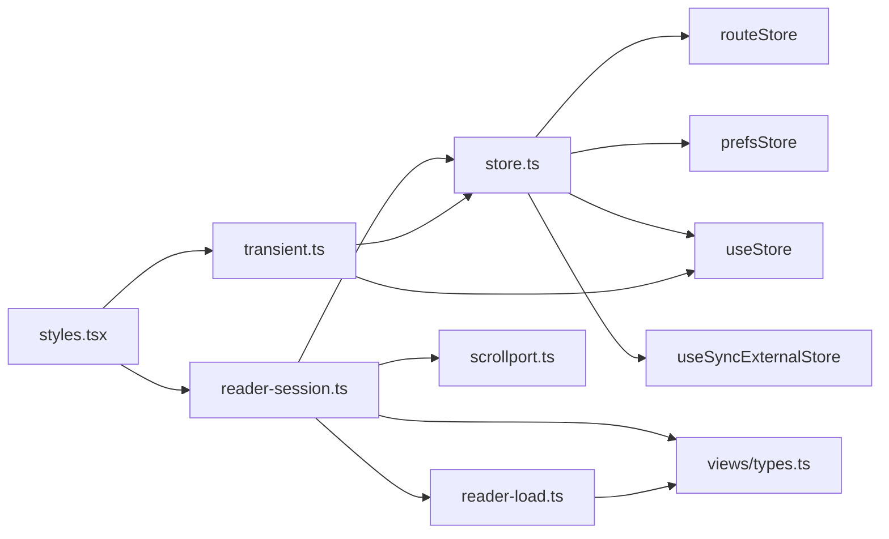

# 状态与样式

<cite>
**本文引用的文件**   
- [store.ts](file://src/client/store.ts)
- [reader-session.ts](file://src/client/reader-session.ts)
- [reader-load.ts](file://src/client/reader-load.ts)
- [scrollport.ts](file://src/client/scrollport.ts)
- [styles.tsx](file://src/client/styles.tsx)
- [types.ts](file://src/client/views/types.ts)
- [transient.ts](file://src/client/transient.ts)
</cite>

## 目录
1. [引言](#引言)
2. [项目结构](#项目结构)
3. [核心组件](#核心组件)
4. [架构总览](#架构总览)
5. [详细组件分析](#详细组件分析)
6. [依赖关系分析](#依赖关系分析)
7. [性能考虑](#性能考虑)
8. [故障排查指南](#故障排查指南)
9. [结论](#结论)
10. [附录：修改示例](#附录修改示例)

## 引言
本文面向浏览器端阅读器的状态管理与样式系统，聚焦以下目标：
- 解释 `store.ts` 中模块级 store（`routeStore`、`prefsStore`、`ReaderSession` 内部 store）的数据流、订阅机制与生命周期。
- 说明 `reader-session.ts` 如何持久化阅读进度、`reader-load.ts` 如何决策异步加载章节、`scrollport.ts` 如何实现连续滚动与自动预取下一章。
- 描述 `styles.tsx` 的主题 token 体系、深浅主题切换逻辑、CSS 变量命名约定与响应式布局规则。
- 说明 `views/types.ts` 的 TS 类型如何约束跨组件数据，以及 `transient.ts` 如何处理一次性 UI 提示。
- 提供修改主题 token、新增 route、扩展 `jobSurface` 字段的代码路径示例。
- 讨论虚拟滚动、SSE 增量更新、避免重渲染整棵树等性能策略。
- 给出 session 丢失、滚动位置回跳、主题 token 未生效、store 状态不同步等问题的排查思路。

## 项目结构
本次文档涉及的文件集中在客户端层：

**图示来源**
- [store.ts:1-66](file://src/client/store.ts#L1-L66)
- [reader-session.ts:1-120](file://src/client/reader-session.ts#L1-L120)
- [reader-load.ts:1-50](file://src/client/reader-load.ts#L1-L50)
- [scrollport.ts:1-68](file://src/client/scrollport.ts#L1-L68)
- [styles.tsx:1-200](file://src/client/styles.tsx#L1-L200)
- [types.ts:1-20](file://src/client/views/types.ts#L1-L20)
- [transient.ts:1-89](file://src/client/transient.ts#L1-L89)

**章节来源**
- [store.ts:1-66](file://src/client/store.ts#L1-L66)
- [reader-session.ts:1-120](file://src/client/reader-session.ts#L1-L120)
- [reader-load.ts:1-50](file://src/client/reader-load.ts#L1-L50)
- [scrollport.ts:1-68](file://src/client/scrollport.ts#L1-L68)
- [styles.tsx:1-200](file://src/client/styles.tsx#L1-L200)
- [types.ts:1-20](file://src/client/views/types.ts#L1-L20)
- [transient.ts:1-89](file://src/client/transient.ts#L1-L89)

## 核心组件
本节概览各模块的职责边界与协作关系。

| 模块 | 职责 | 关键概念 | 主要消费者 |
|---|---|---|---|
| `store.ts` | 提供轻量 store、路由 store、阅读偏好 store | `createStore`、`useStore`、`routeStore`、`prefsStore` | 视图、会话、提示层 |
| `reader-session.ts` | 阅读会话：目录加载、存档恢复、章节加载、定位、进度落盘 | `ReaderSession`、`ReaderPort`、`ReaderSessionState` | ReaderView、ReaderNavigation、ReaderNotes |
| `reader-load.ts` | 懒加载决策：根据哨兵与视口计算下一个应加载章节 | `nextChapterIndex`、`nextLoadTarget` | ReaderSession |
| `scrollport.ts` | 滚动容器探测与坐标换算 | `findScrollport`、`portScrollTop`、`portViewHeight` | ReaderSession、ReaderView |
| `styles.tsx` | 主题 token、布局、控件样式 | `.novel-root`、`.novel-dark`、`--novel-*` | 所有小说视图 |
| `views/types.ts` | 跨组件类型桶 | 从 `shared/wire.js` 再导出 | ReaderSession、Loader、视图 |
| `transient.ts` | 全局一次性的 UI 提示队列 | `pushOk`、`pushError`、`pushPending` | 书架、搜索、设置等界面 |

**章节来源**
- [store.ts:1-66](file://src/client/store.ts#L1-L66)
- [reader-session.ts:1-120](file://src/client/reader-session.ts#L1-L120)
- [reader-load.ts:1-50](file://src/client/reader-load.ts#L1-L50)
- [scrollport.ts:1-68](file://src/client/scrollport.ts#L1-L68)
- [styles.tsx:1-200](file://src/client/styles.tsx#L1-L200)
- [types.ts:1-20](file://src/client/views/types.ts#L1-L20)
- [transient.ts:1-89](file://src/client/transient.ts#L1-L89)

## 架构总览
阅读器是“命令式协调 + React 视图”的组合：
- `ReaderSession` 持有章节表、目录、导航树、当前章节、待定位目标、返回栈等运行时状态。
- `ReaderSession` 通过 `ReaderPort` 与 DOM 解耦；视图负责实现测量、滚动、锚点采集。
- `ReaderSession` 使用 `createStore` 暴露 `state` 和 `subscribe`，React 用 `useSyncExternalStore` 驱动最小更新。
- 加载由 `reader-load.ts` 的纯函数决定；滚动由 `scrollport.ts` 统一探测真实滚动容器。
- 主题 token 在 `styles.tsx` 集中声明，宿主提供语义 alias，插件只读局部 `--novel-*`。

**图示来源**
- [reader-session.ts:1-120](file://src/client/reader-session.ts#L1-L120)
- [reader-load.ts:1-50](file://src/client/reader-load.ts#L1-L50)
- [scrollport.ts:1-68](file://src/client/scrollport.ts#L1-L68)

## 详细组件分析

### 模块级 store：`store.ts`
`store.ts` 提供一套极简外部 store：
- `createStore<T>(initial)` 返回 `{ get, set, subscribe }`。
- `set(patch)` 以浅合并生成新对象，并通知所有监听者。
- `useStore(store)` 基于 React 的 `useSyncExternalStore` 订阅 store，支持 SSR 快照。
- `routeStore` 管理当前视图路由：书架、书城、书源管理、阅读器、搜索。
- `prefsStore` 管理阅读偏好：字号、行高、正文列宽、纸张色、深色控制器开关；读写 `localStorage`。

**图示来源**
- [store.ts:1-66](file://src/client/store.ts#L1-L66)

**章节来源**
- [store.ts:1-66](file://src/client/store.ts#L1-L66)

### 阅读会话：`reader-session.ts`
`ReaderSession` 是阅读进度的时序唯一持有者，负责：
- 打开书籍：拉取目录、展示树、书架存档，进入恢复流程。
- 加载章节：单在途槽去重，成功时清理错误、修剪可见窗口。
- 定位与跳转：将 `pendingJump` 落到锚点，并在双帧后 settle。
- 进度持久化：防抖保存 `chapterIndex` 与 `offsetRatio`，失败记录 `failedIndex` 供重试。
- 会话代际：换书或销毁时作废旧异步续作，防止陈旧闭包写错状态。

关键状态字段包括：
- `toc`：线性目录。
- `navigation`：展示树，用于抽屉高亮与跳转。
- `chapters`：已载正文数组，空洞表示未载。
- `loadingIdx`：在途章节下标。
- `error`：最近错误信息。
- `pendingJump`：待定位目标。
- `currentChapter`：当前章（仅跨章写入）。
- `returnDepth`、`returnStack`：正文链接返回栈。

**图示来源**
- [reader-session.ts:1-120](file://src/client/reader-session.ts#L1-L120)

**章节来源**
- [reader-session.ts:1-120](file://src/client/reader-session.ts#L1-L120)

### 懒加载决策：`reader-load.ts`
`reader-load.ts` 是纯函数，只回答“下一步该加载哪一章”：
- `nextChapterIndex(chapters, from)`：从视口所在章往后找第一个未载章；若视口章本身未载，则优先加载它。
- `nextLoadTarget(sentinelTop, viewportHeight, opts)`：如果已有在途章，直接返回 null；否则查下一个候选，并用哨兵阈值判断是否已进入预取区。

预取余量固定为两屏，不依赖容器 scrollTop 或 scrollHeight，而是依赖“未载边界哨兵相对视口顶的距离”，从而兼容各种滚动容器形态。

**图示来源**
- [reader-load.ts:1-50](file://src/client/reader-load.ts#L1-L50)

**章节来源**
- [reader-load.ts:1-50](file://src/client/reader-load.ts#L1-L50)

### 滚动容器探测：`scrollport.ts`
`scrollport.ts` 解决“谁在滚”的问题：
- `isScrollport` 判定元素是否真正可滚：overflow 允许且内容超出可视区域。
- `findScrollport` 从指定元素向上查找第一个真正滚动容器；找不到则返回 null，表示文档自身在滚。
- 提供 `portScrollTop`、`setPortScrollTop`、`portViewHeight`、`portScrollHeight`、`portViewTop`、`contentOriginTop` 等工具，把滚动坐标换算到统一口径。

这使 ReaderSession 不必硬编码滚动容器身份，也便于测试注入假实现。

**图示来源**
- [scrollport.ts:1-68](file://src/client/scrollport.ts#L1-L68)

**章节来源**
- [scrollport.ts:1-68](file://src/client/scrollport.ts#L1-L68)

### 主题与样式：`styles.tsx`
`styles.tsx` 是插件的主题 token 与布局中心：
- 颜色与层级来自宿主语义 token（如 `--dsw-alias-bg-base`），插件只引用 `--novel-*` 局部变量。
- 深浅主题通过宿主提供的 `data-ds-dark-theme` 与插件内 `.novel-dark` 共同控制；`.novel-dark` 显式覆盖控制器层 token，避免暗面板配亮工具栏。
- 值槽如 `--novel-pct`、`--novel-measure`、`--novel-fig-ratio` 在 token 层声明默认值，再由行内写入实际值。
- 布局方面，`.novel-root` 定高并隐藏溢出，`.novel-main` 作为正文滚动容器；同时隐藏宿主默认 composer，避免遮挡。
- 响应式规则遵循“先 token，后像素”的原则：间距、字号、圆角、阴影、层级、动效都走命名标度。

**图示来源**
- [styles.tsx:1-200](file://src/client/styles.tsx#L1-L200)

**章节来源**
- [styles.tsx:1-200](file://src/client/styles.tsx#L1-L200)

### 跨组件类型：`views/types.ts`
`views/types.ts` 不重复定义业务形状，而是重新导出 `shared/wire.js` 的类型：
- 枚举与状态：`SourceStatus`、`SourceContentKind`、`ProbeErrorCode`。
- 书源面：`SourcePublic`、`ProbeResult`、`JobState`、`JobIssue`。
- 阅读面：`SearchHit`、`SearchGroup`、`ChapterEntry`、`BookDetail`。
- 书架面：`ShelfProgress`、`ShelfBook`、`ShelfEntry`。
- EPUB 本地导入：`ChapterContent`、`ContentNode`、`ContentTag`、`LinkRole`、`ReadingTarget`、`NavigationItem`、`BookNavigation`、`LocalImportWarning`、`LocalImportResponse`。
- 信封：`ApiEnvelope`、`ApiErrorBody`。

这样 Node 与浏览器共享同一份契约，类型漂移即编译错误。

**章节来源**
- [types.ts:1-20](file://src/client/views/types.ts#L1-L20)

### 一次性 UI 提示：`transient.ts`
`transient.ts` 提供全局瞬态提示队列：
- 条目类型：进行中 `pending`、成功 `ok`、错误 `error`。
- `pushOk`：成功条 TTL 自动退场。
- `pushError`：错误条需手动 dismiss，可带 CSS 选择器 `anchor`。
- `pushPending`：返回幂等的结算函数，成功移除，失败转错误。
- `useTransientFlag`：为列表逐条订阅布尔 selector，避免全量重渲染。
- 模块级 store 保证提示跨组件共享；测试提供 `resetTransient` 清空定时器与队列。

**图示来源**
- [transient.ts:1-89](file://src/client/transient.ts#L1-L89)

**章节来源**
- [transient.ts:1-89](file://src/client/transient.ts#L1-L89)

## 依赖关系分析

**图示来源**
- [store.ts:1-66](file://src/client/store.ts#L1-L66)
- [reader-session.ts:1-120](file://src/client/reader-session.ts#L1-L120)
- [reader-load.ts:1-50](file://src/client/reader-load.ts#L1-L50)
- [scrollport.ts:1-68](file://src/client/scrollport.ts#L1-L68)
- [styles.tsx:1-200](file://src/client/styles.tsx#L1-L200)
- [types.ts:1-20](file://src/client/views/types.ts#L1-L20)
- [transient.ts:1-89](file://src/client/transient.ts#L1-L89)

**章节来源**
- [store.ts:1-66](file://src/client/store.ts#L1-L66)
- [reader-session.ts:1-120](file://src/client/reader-session.ts#L1-L120)
- [reader-load.ts:1-50](file://src/client/reader-load.ts#L1-L50)
- [scrollport.ts:1-68](file://src/client/scrollport.ts#L1-L68)
- [styles.tsx:1-200](file://src/client/styles.tsx#L1-L200)
- [types.ts:1-20](file://src/client/views/types.ts#L1-L20)
- [transient.ts:1-89](file://src/client/transient.ts#L1-L89)

## 性能考虑
本节讨论三个常见优化方向，并结合现有实现说明注意事项。

| 主题 | 现状与建议 |
|---|---|
| 虚拟滚动 | 当前章节表按“未载 = null”懒加载，未载章节不进 DOM；但完整章节数组仍可能很大。建议对超长书引入虚拟窗口：只维护可见范围附近的章节缓存，结合 `scrollport.ts` 的 `portScrollHeight` 与 `portViewHeight` 计算可视区间，避免持有整书内存。 |
| SSE 增量更新 | 当前进度落盘由 `debounce` 触发；若接入 SSE，应避免每行变化都写 localStorage。建议：SSE 推送只更新内存中的 `chaptersNow` 与 `position`，批量 flush；或将进度改为服务端聚合，浏览器只消费差异。 |
| 避免整树重渲染 | `useSyncExternalStore` 配合 `createStore` 已能减少不必要渲染；列表类 UI 应使用 `useTransientFlag` 这类细粒度 selector。对 ReaderSession 也可考虑拆分多个小 store，让视图只订阅所需字段。 |

[本节为通用性能指导，不直接分析具体代码片段]

## 故障排查指南

### 阅读会话丢失
**现象**：打开书籍后目录为空、章节为空，或退出后再进回到第一章。

**可能原因**：
- `open` 的恢复流程被预取抢占，RESTORE_SLOT 预约失效。
- 书架接口失败，会话降级从头开始。
- 会话代际不一致：换书或销毁后旧异步续作仍在运行。

**排查步骤**：
1. 确认 `fetchNavigation` 与 `fetchShelf` 是否正常返回。
2. 检查 `ReaderSession.open` 是否抛出错误并被 `error` 捕获。
3. 检查 `inflight` 与 `RESTORE_SLOT` 是否在恢复阶段被其他加载抢占。
4. 确认换书时 `generation` 递增，迟到续作被丢弃。

**相关实现**
- [reader-session.ts:1-120](file://src/client/reader-session.ts#L1-L120)

### 滚动位置回跳
**现象**：调整字号、行高或章节加载后，阅读位置突然跳到首屏或顶部。

**可能原因**：
- `pendingJump` 未在双帧后 settle。
- `ReaderPort.targetOffset` 返回 null，导致目标不可定位。
- 滚动容器探测错误，`portScrollTop` 与 `portScrollHeight` 口径不一致。

**排查步骤**：
1. 检查 `pruneToViewport` 是否被执行。
2. 检查 `portViewHeight`、`portScrollHeight`、`portScrollTop` 是否与真实滚动容器一致。
3. 检查 `scrollport.ts` 是否找到 `.novel-main` 或其他真正滚动容器。
4. 检查锚点测量 `measureAnchors` 是否返回有效节点。

**相关实现**
- [reader-session.ts:1-120](file://src/client/reader-session.ts#L1-L120)
- [scrollport.ts:1-68](file://src/client/scrollport.ts#L1-L68)

### 主题 token 未生效
**现象**：自定义品牌色、背景色、文本色没有应用到界面。

**可能原因**：
- 引用了不存在的宿主 token，CSS 静默 fallback 到硬编码值。
- 使用了本层不存在的 `--novel-*` 变量，token 守卫会判为未定义。
- `.novel-dark` 覆盖了部分 token，但派生色没有同步覆盖。

**排查步骤**：
1. 确认宿主 theme 提供了对应 `--dsw-alias-*` 语义 token。
2. 检查 `styles.tsx` 中 token 自足守卫是否报错。
3. 确认 `--novel-brand`、`--novel-text`、`--novel-layer-*` 等关键变量有值。
4. 检查 `.novel-dark` 是否覆盖派生色 `--novel-brand-soft`、`--novel-brand-line` 等。

**相关实现**
- [styles.tsx:1-200](file://src/client/styles.tsx#L1-L200)

### store 状态不同步
**现象**：UI 显示旧路由、旧偏好或旧提示。

**可能原因**：
- 组件没有正确订阅 store。
- 使用 `useStore` 但未提供 SSR 快照。
- 多个地方各自维护一份状态副本。

**排查步骤**：
1. 确认组件使用 `useStore(routeStore)` 或 `useStore(prefsStore)`。
2. 确认 `set` 调用后触发了 listener。
3. 确认没有手写复制一份 state 然后独立修改。
4. 对 transient 提示，确认使用 `useTransient()` 或 `useTransientFlag`。

**相关实现**
- [store.ts:1-66](file://src/client/store.ts#L1-L66)
- [transient.ts:1-89](file://src/client/transient.ts#L1-L89)

## 结论
本项目采用轻量外部 store 驱动 React，并通过 `ReaderSession` 把阅读状态从视图抽离成可测的命令式协调层。加载决策、滚动探测、主题 token 均保持清晰边界：纯函数负责算法，DOM 操作通过接口注入，样式通过 token 解耦宿主主题。扩展时应优先修改 token、类型与 store patch，而不是散写硬编码值。

[本节为总结性内容，不直接分析具体代码片段]

## 附录：修改示例

### 修改主题 token
目标：把品牌色从蓝色改为紫色。

**步骤**：
1. 在 `styles.tsx` 中找到 `--novel-brand` 及其派生变量。
2. 替换宿主 alias 或 fallback 值。
3. 若启用 `.novel-dark`，同步覆盖暗态下的品牌色与派生色。
4. 运行 token 自足守卫，确保没有引用未定义的 `--novel-*`。

**参考路径**
- [styles.tsx:1-200](file://src/client/styles.tsx#L1-L200)

### 新增 route
目标：在顶部 tab 增加一个“发现”路由。

**步骤**：
1. 在 `store.ts` 的 `Route` 联合类型中加入 `{ name: 'discover' }`。
2. 在视图层增加对应分支渲染。
3. 在导航按钮中调用 `navigate({ name: 'discover' })`。
4. 注意 reader 与 search 是沉浸流，不应混入顶层 tab。

**参考路径**
- [store.ts:25-45](file://src/client/store.ts#L25-L45)

### 扩展 jobSurface 字段
目标：给任务状态增加一个新字段。

**步骤**：
1. 因为 `views/types.ts` 只是再导出桶，应在 `shared/wire.js` 中扩展类型定义。
2. 不要在本文件新增第二份类型，以免 Node 与浏览器不一致。
3. 在 `reader-session.ts` 或相关服务中消费新字段。
4. 若有 UI 展示，补充 transient 或状态条文案。

**参考路径**
- [types.ts:1-20](file://src/client/views/types.ts#L1-L20)
- [transient.ts:1-89](file://src/client/transient.ts#L1-L89)