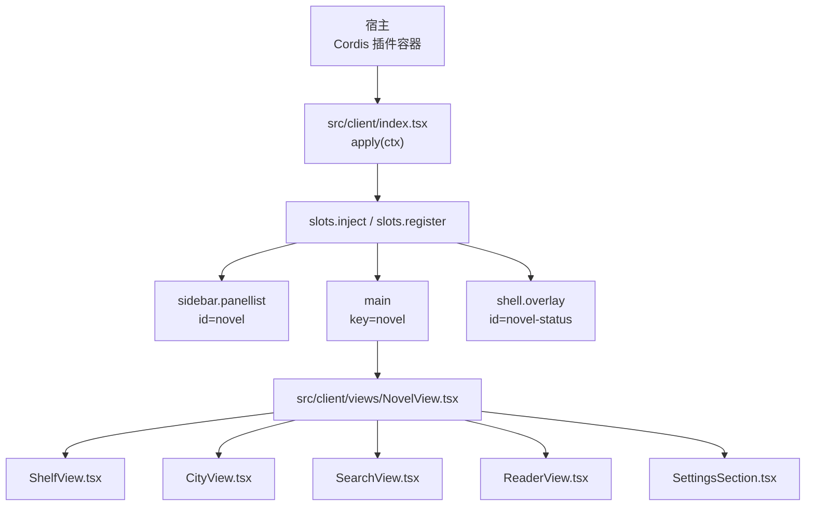
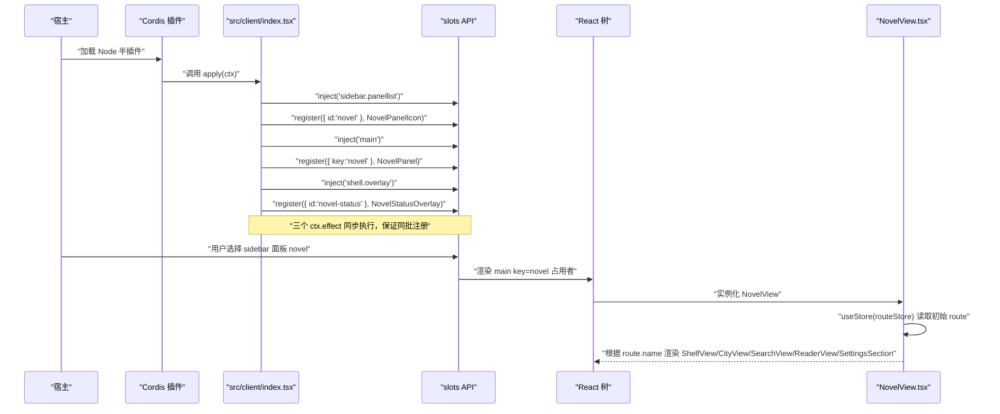
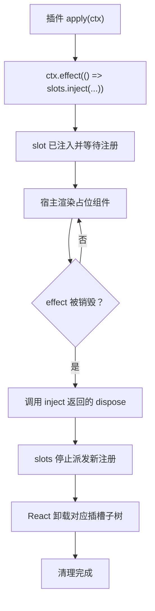
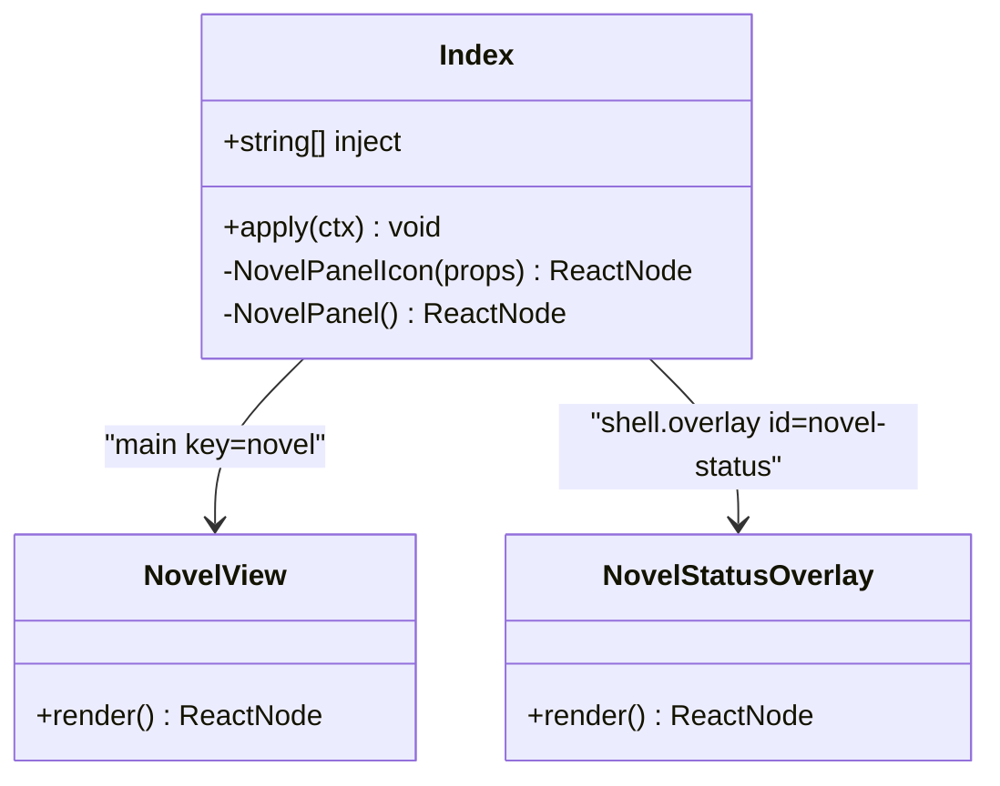
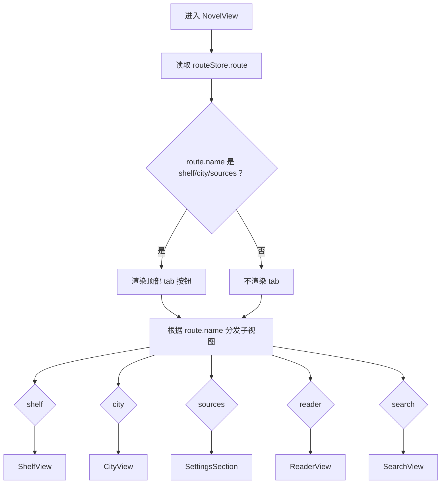
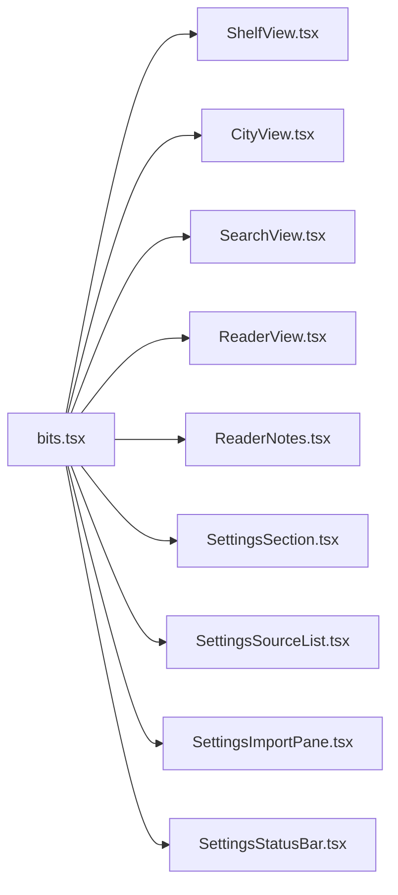
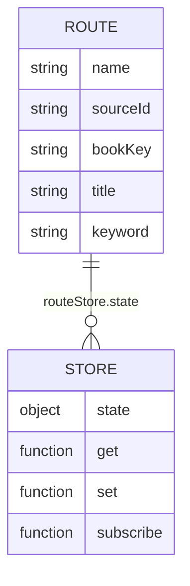
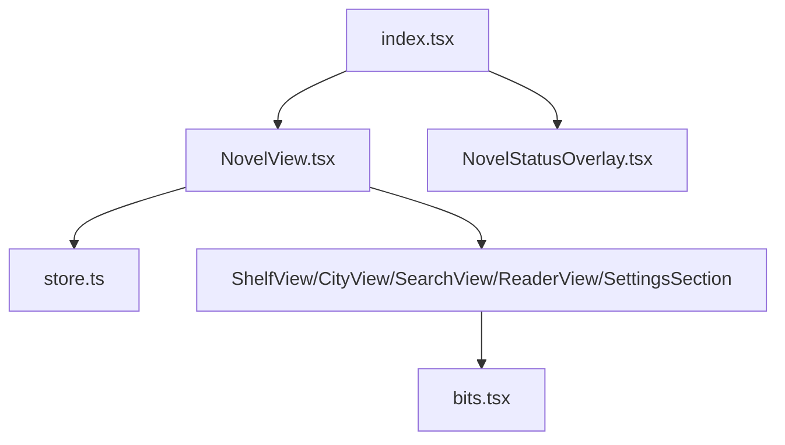
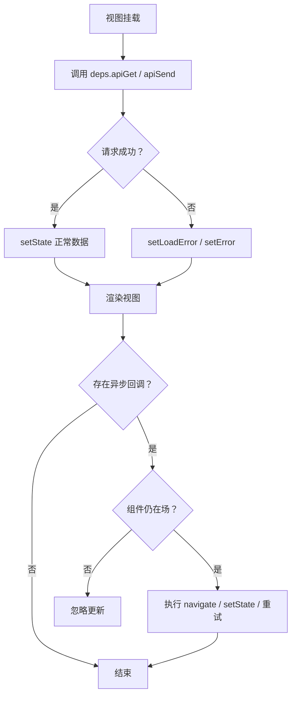

# 组件层次与入口

<cite>
**本文引用的文件**
- [src/client/index.tsx](file://src/client/index.tsx)
- [src/client/store.ts](file://src/client/store.ts)
- [src/client/views/NovelView.tsx](file://src/client/views/NovelView.tsx)
- [src/client/views/bits.tsx](file://src/client/views/bits.tsx)
- [src/client/views/ShelfView.tsx](file://src/client/views/ShelfView.tsx)
- [src/client/views/CityView.tsx](file://src/client/views/CityView.tsx)
- [src/client/views/SearchView.tsx](file://src/client/views/SearchView.tsx)
- [src/client/views/SettingsSection.tsx](file://src/client/views/SettingsSection.tsx)
- [src/client/views/ReaderView.tsx](file://src/client/views/ReaderView.tsx)
- [src/client/views/ReaderNotes.tsx](file://src/client/views/ReaderNotes.tsx)
- [src/client/views/SettingsSourceList.tsx](file://src/client/views/SettingsSourceList.tsx)
- [src/client/views/SettingsImportPane.tsx](file://src/client/views/SettingsImportPane.tsx)
- [src/client/views/SettingsStatusBar.tsx](file://src/client/views/SettingsStatusBar.tsx)
</cite>

## 目录
1. [引言](#引言)
2. [项目结构](#项目结构)
3. [核心组件](#核心组件)
4. [架构总览](#架构总览)
5. [详细组件分析](#详细组件分析)
6. [依赖关系分析](#依赖关系分析)
7. [性能考量](#性能考量)
8. [故障排查](#故障排查)
9. [结论](#结论)

## 引言
本文面向浏览器端“小说”插件的 UI 入口与组件层次，聚焦以下问题：
- `src/client/index.tsx` 如何同步注册侧栏图标、中央面板槽与常驻状态层。
- Cordis 插槽注入的生命周期与 `dispose` 清理语义。
- `NovelView` 作为 tab 容器的职责及按 `routeStore` 切换子视图的规则。
- `bits.tsx` 中通用 UI 片段被哪些视图复用。
- 从宿主启动到 `NovelView` 渲染的时序图。
- 在插件中扩展新面板或覆盖现有 slot 的实践方式。
- 错误处理与性能注意事项。

## 项目结构
浏览器端属于“双半形态”中的浏览器半，由宿主的模块装载器以 CJS 闭包工厂形式加载；Node 半是 Cordis 插件，负责路由与服务门面，浏览器端只承载视图与可丢弃投影。

**图示来源**
- [src/client/index.tsx:57-84](file://src/client/index.tsx#L57-L84)
- [src/client/views/NovelView.tsx:1-60](file://src/client/views/NovelView.tsx#L1-L60)

本节关注的是浏览器端 UI 装配边界：`index.tsx` 只负责把“小说”挂进宿主的全局面板与 overlay，不持有业务数据；业务数据通过服务端的 `/novel-api` 拉取，视图内用轻量 store 管理现场。

**章节来源**
- [docs/architecture.md:1-40](file://docs/architecture.md#L1-L40)

## 核心组件
- **入口装配器**：`src/client/index.tsx` 导出 `inject = ['slots', 'sessions']`，并在 `apply(ctx)` 内同步完成三处插槽注册。
- **tab 容器**：`src/client/views/NovelView.tsx` 渲染顶部 tab（书架、书城、书源管理），并根据当前 `routeStore.route.name` 分发到具体子视图。
- **轻量路由与存储**：`src/client/store.ts` 提供 `createStore`、`useStore`、`routeStore` 和 `prefsStore`，路由对象为无 URL 绑定的内存状态。
- **通用 UI 片段**：`src/client/views/bits.tsx` 暴露状态徽标、空态、错误横幅、进度条、运行卡等共享组件。

**章节来源**
- [src/client/index.tsx:1-84](file://src/client/index.tsx#L1-L84)
- [src/client/views/NovelView.tsx:1-60](file://src/client/views/NovelView.tsx#L1-L60)
- [src/client/store.ts:1-66](file://src/client/store.ts#L1-L66)
- [src/client/views/bits.tsx:1-145](file://src/client/views/bits.tsx#L1-L145)

## 架构总览
### 宿主启动到 `NovelView` 渲染的时序

**图示来源**
- [src/client/index.tsx:57-84](file://src/client/index.tsx#L57-L84)
- [src/client/views/NovelView.tsx:24-60](file://src/client/views/NovelView.tsx#L24-L60)
- [src/client/store.ts:35-42](file://src/client/store.ts#L35-L42)

### 插槽生命周期与 dispose 清理
`ctx.effect` 返回一个清理函数；Cordis 会在对应 effect 失效时调用它。对本插件而言，主要清理点是 `slots.inject` 返回的函数——它取消本次注入，使该 slot 不再向后续注册回调派发。

**图示来源**
- [src/client/index.tsx:60-84](file://src/client/index.tsx#L60-L84)

**章节来源**
- [src/client/index.tsx:57-84](file://src/client/index.tsx#L57-L84)

## 详细组件分析

### 入口与插槽注册：`src/client/index.tsx`
- `inject = ['slots', 'sessions']` 声明宿主提供的能力；浏览器半不读运行时配置，也不直接持有 API base。
- 三个 `ctx.effect` 分别注册：
  - `sidebar.panellist`：id 为 `novel`，order 为 20，label 为“小说”。
  - `main`：key 为 `novel`，占用者为 `NovelPanel`，内部仅渲染 `NovelView`。
  - `shell.overlay`：id 为 `novel-status`，order 为 100，label 为“小说任务状态”，用于常驻任务读数。
- 官方契约强调：选中缺失的 `main` entry 会抛错，因此 `sidebar.panellist` 与 `main` 必须同批注册，避免半注册窗口。
- 常驻 overlay 与 sidebar/main/rightbar 并列，切面板或切会话不会卸载它；overlay 默认 click-through，浮层条目自行决定是否接收指针事件。

**图示来源**
- [src/client/index.tsx:1-84](file://src/client/index.tsx#L1-L84)

**章节来源**
- [src/client/index.tsx:1-84](file://src/client/index.tsx#L1-L84)

### 视图容器：`src/client/views/NovelView.tsx`
`NovelView` 是“小说”全局面板的根组件，职责包括：
- 注入一次样式层 token（`<NovelStyles />`）。
- 渲染顶部 tab 导航，包含“书架”“书城”“书源管理”。
- 根据 `routeStore.route.name` 分派五个分支：
  - `shelf`：书架。
  - `city`：书城（目前为空态占位）。
  - `sources`：书源管理。
  - `reader`：阅读器，携带 `sourceId`、`bookKey`、`title`。
  - `search`：聚合搜索。
- 布局采用 flex 列，视图区 `flex:1` 且可滚动；顶部 tab 只在 shelf/city/sources 三个“列表型 tab”下显示，沉浸内容 reader/search 自带返回导航，不随行。

**图示来源**
- [src/client/views/NovelView.tsx:1-60](file://src/client/views/NovelView.tsx#L1-L60)
- [src/client/store.ts:35-42](file://src/client/store.ts#L35-L42)

**章节来源**
- [src/client/views/NovelView.tsx:1-60](file://src/client/views/NovelView.tsx#L1-L60)
- [src/client/store.ts:35-42](file://src/client/store.ts#L35-L42)

### 通用 UI 片段复用关系：`src/client/views/bits.tsx`
`bits.tsx` 提供跨视图复用的 UI 片段，颜色与 token 统一来自样式层，避免硬编码主题值。

| 导出项 | 用途 | 主要复用方 |
|---|---|---|
| `StatusBadge` | 源状态徽标（可用/不可用/未验证） | `SettingsSection`、`SearchView`、`SettingsSourceList` |
| `SearchIcon` | 放大镜图标 | `ShelfView`、`SearchView` |
| `ErrorBanner` | 带段级定位的错误横幅 | `ReaderView`、`ReaderNotes`、`SettingsSection`、`SettingsImportPane` |
| `EmptyState` | 标题+提示+动作的空态 | `CityView`、`ShelfView`、`SearchView` |
| `ProgressBar` | 基于 CSS 变量的进度条 | `ShelfView`、`SearchView`、`SettingsStatusBar` |
| `RunCard` | 后台任务运行卡外壳 | `SettingsImportPane`、`SettingsSourceList` |
| `WarningList` | 导入告警清单 | `ShelfView`、`ReaderView` |
| `jobPct` / `searchPct` | 进度百分比计算 | `SettingsStatusBar`、`SearchView`、`SettingsSourceList`、`SettingsImportPane` |

**图示来源**
- [src/client/views/bits.tsx:1-145](file://src/client/views/bits.tsx#L1-L145)
- [src/client/views/ShelfView.tsx:1-200](file://src/client/views/ShelfView.tsx#L1-L200)
- [src/client/views/CityView.tsx:1-20](file://src/client/views/CityView.tsx#L1-L20)
- [src/client/views/SearchView.tsx:1-190](file://src/client/views/SearchView.tsx#L1-L190)
- [src/client/views/ReaderView.tsx:1-200](file://src/client/views/ReaderView.tsx#L1-L200)
- [src/client/views/ReaderNotes.tsx:1-130](file://src/client/views/ReaderNotes.tsx#L1-L130)
- [src/client/views/SettingsSection.tsx:1-120](file://src/client/views/SettingsSection.tsx#L1-L120)
- [src/client/views/SettingsSourceList.tsx:1-20](file://src/client/views/SettingsSourceList.tsx#L1-L20)
- [src/client/views/SettingsImportPane.tsx:1-20](file://src/client/views/SettingsImportPane.tsx#L1-L20)
- [src/client/views/SettingsStatusBar.tsx:1-60](file://src/client/views/SettingsStatusBar.tsx#L1-L60)

**章节来源**
- [src/client/views/bits.tsx:1-145](file://src/client/views/bits.tsx#L1-L145)

### 路由与视图切换：`src/client/store.ts`
`store.ts` 实现了一个轻量外部 store：
- `createStore(initial)` 返回 `{ get, set, subscribe }`，`subscribe` 返回取消订阅函数。
- `useStore(store)` 包装 `useSyncExternalStore`，支持 SSR 快照。
- 路由类型限定为五类：`shelf`、`city`、`sources`、`reader`、`search`。
- `routeStore` 初始值为 `{ name: 'shelf' }`，`navigate(route)` 是唯一修改入口。
- 阅读偏好 `prefsStore` 持久到 `localStorage`，但业务数据不进 store，而是每次挂载后通过 api 拉取。

**图示来源**
- [src/client/store.ts:1-66](file://src/client/store.ts#L1-L66)

**章节来源**
- [src/client/store.ts:1-66](file://src/client/store.ts#L1-L66)

### 子视图职责概览
- **ShelfView**：书架网格、搜索框、筛选、多选删除、本地书籍导入回执展示。
- **CityView**：书城 tab 占位，使用 `EmptyState` 表达尚未上线的状态。
- **SearchView**：聚合搜索输入、结果列表、进度条、状态徽标，失败与空结果使用 `EmptyState`。
- **ReaderView**：阅读器正文与错误展示，复用 `ErrorBanner`、`WarningList`。
- **SettingsSection**：书源管理 tab，组合待办收件箱、任务槽、源列表、导入弹层，复用 `StatusBadge`、`ErrorBanner`。

**章节来源**
- [src/client/views/ShelfView.tsx:1-200](file://src/client/views/ShelfView.tsx#L1-L200)
- [src/client/views/CityView.tsx:1-20](file://src/client/views/CityView.tsx#L1-L20)
- [src/client/views/SearchView.tsx:1-190](file://src/client/views/SearchView.tsx#L1-L190)
- [src/client/views/ReaderView.tsx:1-200](file://src/client/views/ReaderView.tsx#L1-L200)
- [src/client/views/SettingsSection.tsx:1-120](file://src/client/views/SettingsSection.tsx#L1-L120)

## 依赖关系分析
- `index.tsx` 依赖 `NovelView` 与 `NovelStatusOverlay`，并通过 Cordis 的 `slots` 能力与宿主解耦。
- `NovelView` 依赖 `store.ts` 的路由与 `styles.tsx` 的样式层。
- 各子视图依赖 `bits.tsx` 的共享 UI 片段，形成“组件→共享片段”的单向依赖。
- 业务数据通过 `deps.apiGet` / `deps.apiSend` 走服务端 wire，不在浏览器 store 中长期持有。

**图示来源**
- [src/client/index.tsx:1-84](file://src/client/index.tsx#L1-L84)
- [src/client/views/NovelView.tsx:1-60](file://src/client/views/NovelView.tsx#L1-L60)
- [src/client/store.ts:1-66](file://src/client/store.ts#L1-L66)
- [src/client/views/bits.tsx:1-145](file://src/client/views/bits.tsx#L1-L145)

**章节来源**
- [src/client/index.tsx:1-84](file://src/client/index.tsx#L1-L84)
- [src/client/views/NovelView.tsx:1-60](file://src/client/views/NovelView.tsx#L1-L60)
- [src/client/store.ts:1-66](file://src/client/store.ts#L1-L66)
- [src/client/views/bits.tsx:1-145](file://src/client/views/bits.tsx#L1-L145)

## 性能考量
- **按需加载视图**：`NovelView` 根据 `route.name` 渲染单一子视图，而不是同时挂载全部视图树；reader 与 search 是沉浸式页面，各自维护返回导航，避免顶层 tab 随行造成多余交互。
- **避免重复创建 React 树**：`routeStore` 是模块级 store，切换 tab 时重新渲染当前视图，但路由状态本身不随组件卸载丢失；这比 URL 路由更适合“切走即卸载、回来恢复现场”的小说视图场景。
- **CSS 注入防重**：`SettingsSection` 暴露 `withStyles` 参数，当由 `NovelView` 渲染时传 `false`，防止同一棵树里两份 NOVEL_CSS。
- **进度条合成优化**：`ProgressBar` 使用 CSS 变量 `--novel-pct` 驱动 `transform: scaleX()`，避免频繁 width 变化导致逐帧重排。
- **任务与界面分离**：后台任务轮询集中在常驻状态层，各视图只读镜像，避免多个视图各自轮询造成重复请求。

[本节为通用性能建议，不直接分析特定代码行]

## 故障排查

### 常见问题与原因
1. **slot 未挂载**
   - 现象：点击侧栏“小说”后中央面板无内容，或宿主报错选中了缺失的 main entry。
   - 原因：`sidebar.panellist` 与 `main` 没有同批注册，或 `apply` 尚未执行。
   - 检查点：确认 `apply(ctx)` 内同时调用 `slots.inject('sidebar.panellist')` 与 `slots.inject('main')`，且 `ctx.effect` 未被提前销毁。

2. **React 渲染异常**
   - 现象：子视图加载失败，出现空白或错误横幅。
   - 原因：网络请求失败、服务端返回非预期形状、组件内部字段缺失。
   - 检查点：`ShelfView`、`SettingsSection` 等视图会把网络错误写入本地 state 并渲染错误提示；优先确认 api 响应与 `shared/wire.js` 的 ROUTES 是否匹配。

3. **dispose 后仍访问 store**
   - 现象：组件卸载后异步回调继续更新状态，触发 React warning。
   - 原因：`routeStore.set` 是模块级全局操作，不受单个组件卸载影响；异步回调需要在回调内判断组件是否仍在场。
   - 检查点：参考 `ShelfView` 中使用 `aliveRef` 拦截卸载后的跳转逻辑；对其他异步回调也应以类似方式增加存活判断。

4. **重复样式或 token 污染**
   - 现象：样式重复、主题不一致或 CSS 体积异常增大。
   - 原因：多处注入 `NovelStyles`，或 bits 组件直接使用 hex 而非 token。
   - 检查点：确保 `SettingsSection` 由 `NovelView` 渲染时传入 `withStyles={false}`；所有颜色应通过 `--novel-*` 局部 token。

### 错误处理流程图

**图示来源**
- [src/client/views/ShelfView.tsx:1-200](file://src/client/views/ShelfView.tsx#L1-L200)
- [src/client/store.ts:1-66](file://src/client/store.ts#L1-L66)

**章节来源**
- [src/client/index.tsx:57-84](file://src/client/index.tsx#L57-L84)
- [src/client/views/ShelfView.tsx:1-200](file://src/client/views/ShelfView.tsx#L1-L200)
- [src/client/store.ts:1-66](file://src/client/store.ts#L1-L66)

## 结论
`src/client/index.tsx` 是浏览器端“小说”插件的 UI 装配入口，通过 Cordis 的 `slots.inject` 与 `slots.register` 同步注册侧栏图标、中央面板与常驻状态层；`NovelView` 作为 tab 容器，将用户意图映射到 `routeStore`，再按需渲染书架、书城、书源管理、阅读器与搜索视图。`bits.tsx` 集中了跨视图复用的通用 UI 片段，配合样式层 token 保证视觉一致性。

扩展新面板或覆盖现有 slot 的核心原则是：
- 在 `apply(ctx)` 内使用 `ctx.effect` 调用 `slots.inject(slotName)`，并在其回调中调用 `slots.register(options, component)`。
- 保持 side-effect 同步注册，避免半注册状态。
- 若需要清理副作用，应在 effect 内保存 `dispose` 返回值，并在组件卸载或 effect 销毁时调用。
- 新增视图应通过 `routeStore` 与 `navigate` 切换，而不是直接操作 DOM；业务数据通过 api 拉取，避免把真实状态放入轻量 store。
- 复用 `bits.tsx` 中的共享组件，避免重复样式与主题漂移。

[本节为总结性内容，不直接分析特定代码行]