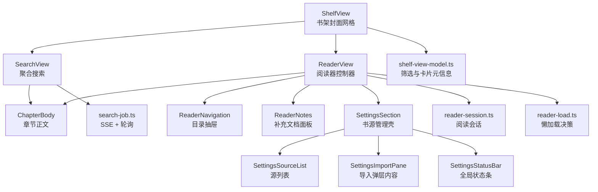
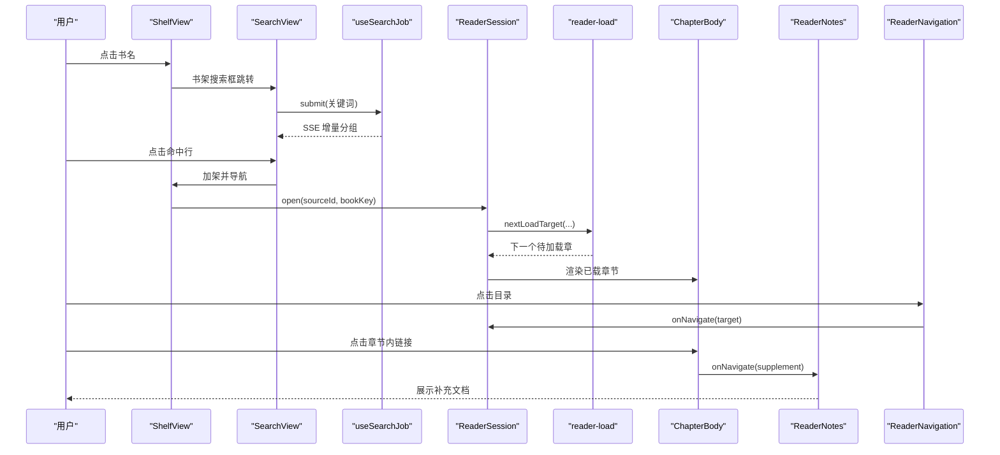
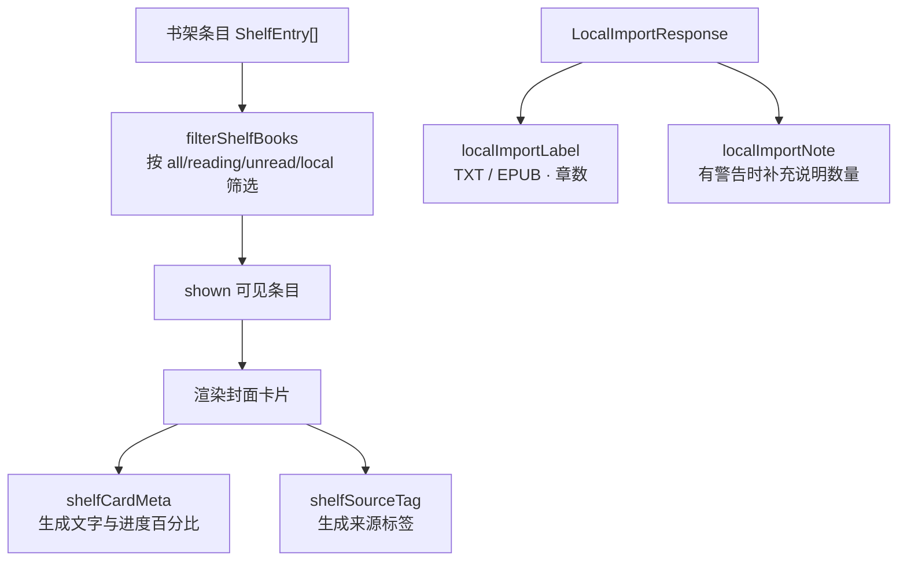
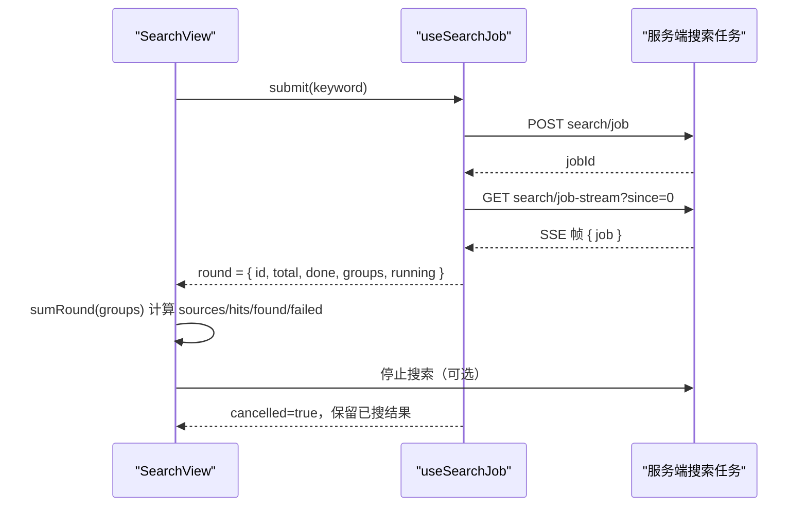
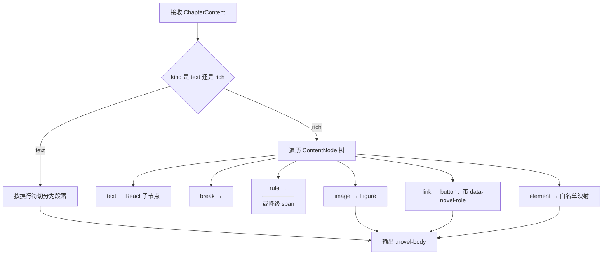
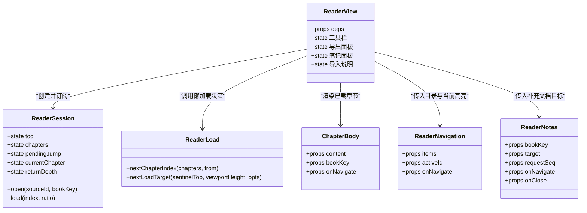
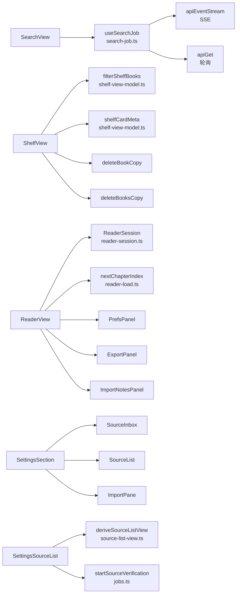

# 视图组件参考

<cite>
**本文引用的文件**   
- [CityView.tsx](file://src/client/views/CityView.tsx)
- [ShelfView.tsx](file://src/client/views/ShelfView.tsx)
- [ReaderView.tsx](file://src/client/views/ReaderView.tsx)
- [SearchView.tsx](file://src/client/views/SearchView.tsx)
- [ChapterBody.tsx](file://src/client/views/ChapterBody.tsx)
- [ReaderNavigation.tsx](file://src/client/views/ReaderNavigation.tsx)
- [ReaderNotes.tsx](file://src/client/views/ReaderNotes.tsx)
- [SettingsSection.tsx](file://src/client/views/SettingsSection.tsx)
- [SettingsSourceList.tsx](file://src/client/views/SettingsSourceList.tsx)
- [SettingsStatusBar.tsx](file://src/client/views/SettingsStatusBar.tsx)
- [SettingsImportPane.tsx](file://src/client/views/SettingsImportPane.tsx)
- [search-job.ts](file://src/client/search-job.ts)
- [shelf-view-model.ts](file://src/client/shelf-view-model.ts)
- [reader-session.ts](file://src/client/reader-session.ts)
- [reader-load.ts](file://src/client/reader-load.ts)
- [prefs-ui.ts](file://src/client/prefs-ui.ts)
- [types.ts](file://src/client/views/types.ts)
- [search-job-round-identity.test.tsx](file://tests/client/search-job-round-identity.test.tsx)
- [shelf-batch.test.tsx](file://tests/client/shelf-batch.test.tsx)
- [reader-load.test.ts](file://tests/client/reader-load.test.ts)
</cite>

## 目录

1. [引言](#引言)
2. [项目结构](#项目结构)
3. [核心组件总览](#核心组件总览)
4. [架构总览](#架构总览)
5. [详细组件参考](#详细组件参考)
6. [依赖关系分析](#依赖关系分析)
7. [性能与响应式行为](#性能与响应式行为)
8. [主题、字号与纸张色定制](#主题字号与纸张色定制)
9. [最小可运行示例](#最小可运行示例)
10. [故障排查指南](#故障排查指南)
11. [结论](#结论)

## 引言

本参考文档聚焦客户端小说阅读界面中的九个视图组件：书城聚合搜索 `SearchView`、书架封面网格 `ShelfView`、阅读器 `ReaderView`、章节正文 `ChapterBody`、目录抽屉 `ReaderNavigation`、笔记面板 `ReaderNotes`，以及设置区 `SettingsSection`、`SettingsSourceList`、`SettingsStatusBar`、`SettingsImportPane`。

这些组件共同构成“书架 → 搜索 → 阅读器 → 设置”的主路径：  
- `ShelfView` 是本地书与已加架书籍的入口；  
- `SearchView` 发起后台搜索任务并按增量结果分组展示；  
- `ReaderView` 管理阅读会话、加载章节、保存进度并承载目录、笔记与导出面板；  
- `ChapterBody` 是安全渲染 EPUB 白名单正文的唯一实现；  
- `ReaderNavigation` 和 `ReaderNotes` 是阅读器浮层内的数据驱动子树；  
- `SettingsSection` 及其子组件负责书源管理与导入。

## 项目结构

视图组件集中在 `src/client/views`，业务状态机与数据流逻辑分布在同级的 `search-job.ts`、`shelf-view-model.ts`、`reader-session.ts`、`reader-load.ts`、`prefs-ui.ts` 等文件中。类型定义统一从 `shared/wire.js` 再导出到 `views/types.ts`，保证服务端契约变化在编译期报错。



**图表来源**  
- [ShelfView.tsx:1-200](file://src/client/views/ShelfView.tsx#L1-L200)
- [SearchView.tsx:1-200](file://src/client/views/SearchView.tsx#L1-L200)
- [ReaderView.tsx:1-200](file://src/client/views/ReaderView.tsx#L1-L200)
- [ChapterBody.tsx:1-193](file://src/client/views/ChapterBody.tsx#L1-L193)
- [ReaderNavigation.tsx:1-79](file://src/client/views/ReaderNavigation.tsx#L1-L79)
- [ReaderNotes.tsx:1-128](file://src/client/views/ReaderNotes.tsx#L1-L128)
- [SettingsSection.tsx:1-200](file://src/client/views/SettingsSection.tsx#L1-L200)
- [SettingsSourceList.tsx:1-200](file://src/client/views/SettingsSourceList.tsx#L1-L200)
- [SettingsStatusBar.tsx:1-65](file://src/client/views/SettingsStatusBar.tsx#L1-L65)
- [SettingsImportPane.tsx:1-200](file://src/client/views/SettingsImportPane.tsx#L1-L200)

**章节来源**  
- [types.ts:1-20](file://src/client/views/types.ts#L1-L20)

## 核心组件总览

| 组件 | 主要职责 | 关键 props | 内部 state | 外部协作 |
|---|---|---|---|---|
| `CityView` | 书城占位空态 | 无 | 无 | 仅渲染 `EmptyState` |
| `ShelfView` | 书架加载、筛选、多选批量删除、本地书导入 | `deps` | 书表、关键词、筛选、图片失败集、导入回执、多选态、删除模态 | `apiGet` / `apiSend`、`navigate`、`shelf-view-model` |
| `SearchView` | 提交搜索任务、显示 SSE 增量分组 | `deps` | 关键词、恢复填充标记 | `useSearchJob`、`navigate`、`bits` |
| `ChapterBody` | 安全渲染章节正文 | `content`、`bookKey`、`onNavigate` | 图片失败标志 | 通过 `onNavigate` 向上汇报跳转 |
| `ReaderNavigation` | 渲染目录树 | `items`、`activeId`、`onNavigate` | 无 | 由阅读器提供当前高亮条目 |
| `ReaderNotes` | 脚注 / 附录补充文档 | `bookKey`、`target`、`requestSeq`、`deps`、`onNavigate`、`onClose` | 栈、请求阶段、nonce、请求序号、在场闸 | `apiGet`、`ChapterBody` |
| `ReaderView` | 阅读器主控制器 | `deps` | 工具栏可见性、导出面板、笔记面板、导入说明面板、当前章、返回栈 | `ReaderSession`、`ChapterBody`、`ReaderNavigation`、`ReaderNotes` |
| `SettingsSection` | 书源管理 tab 壳 | `deps`、`withStyles` | 子视图、源表、导入弹层开关 | `jobs`、`source-inbox`、`SettingsSourceList`、`SettingsImportPane` |
| `SettingsSourceList` | 源列表过滤、分页、批量启停、批量删除 | `sources`、`job`、`onChanged`、`onProbe`、`onImport`、`loadError`、`deps` | 分页限制、删除模态、删除忙标志 | `source-list-view`、`jobs` |
| `SettingsStatusBar` | 全局错误、任务、保存中、成功提示 | `job`、`stale`、`onOpen` | 无（消费瞬态层） | `useTransient` |
| `SettingsImportPane` | 拖放 / 粘贴导入书源 JSON | `job`、`refresh`、`unverifiedCount`、`onVerifyUnverified`、`onSubmitted`、`deps` | 拖拽态、提交态、预检结果、大文本提示、详情开关 | `importer`、`jobs` |

**章节来源**  
- [CityView.tsx:1-16](file://src/client/views/CityView.tsx#L1-L16)
- [ShelfView.tsx:1-200](file://src/client/views/ShelfView.tsx#L1-L200)
- [SearchView.tsx:1-200](file://src/client/views/SearchView.tsx#L1-L200)
- [ChapterBody.tsx:1-193](file://src/client/views/ChapterBody.tsx#L1-L193)
- [ReaderNavigation.tsx:1-79](file://src/client/views/ReaderNavigation.tsx#L1-L79)
- [ReaderNotes.tsx:1-128](file://src/client/views/ReaderNotes.tsx#L1-L128)
- [ReaderView.tsx:1-200](file://src/client/views/ReaderView.tsx#L1-L200)
- [SettingsSection.tsx:1-200](file://src/client/views/SettingsSection.tsx#L1-L200)
- [SettingsSourceList.tsx:1-200](file://src/client/views/SettingsSourceList.tsx#L1-L200)
- [SettingsStatusBar.tsx:1-65](file://src/client/views/SettingsStatusBar.tsx#L1-L65)
- [SettingsImportPane.tsx:1-200](file://src/client/views/SettingsImportPane.tsx#L1-L200)

## 架构总览



**图表来源**  
- [SearchView.tsx:1-200](file://src/client/views/SearchView.tsx#L1-L200)
- [search-job.ts:1-200](file://src/client/search-job.ts#L1-L200)
- [ReaderView.tsx:1-200](file://src/client/views/ReaderView.tsx#L1-L200)
- [reader-session.ts:1-200](file://src/client/reader-session.ts#L1-L200)
- [reader-load.ts:1-50](file://src/client/reader-load.ts#L1-L50)
- [ChapterBody.tsx:1-193](file://src/client/views/ChapterBody.tsx#L1-L193)
- [ReaderNavigation.tsx:1-79](file://src/client/views/ReaderNavigation.tsx#L1-L79)
- [ReaderNotes.tsx:1-128](file://src/client/views/ReaderNotes.tsx#L1-L128)

## 详细组件参考

### CityView：书城聚合搜索占位视图

`CityView` 是当前未上线的书城 tab 占位实现。它不模拟可点入口，而是直接渲染空态，提示用户转向书架搜索或书源管理。

| 维度 | 说明 |
|---|---|
| props | 无 |
| 内部 state | 无 |
| 用户交互 | 无；页面只展示标题与提示 |
| 调用关系 | 渲染 `EmptyState`，无网络请求，无路由跳转 |

**章节来源**  
- [CityView.tsx:1-16](file://src/client/views/CityView.tsx#L1-L16)

### ShelfView：书架封面网格

`ShelfView` 是书架 tab 的主要视图，承担五项职责：加载书架、按关键词跳转聚合搜索、按阅读状态和本地来源筛选、多选批量删除、导入本地 TXT / EPUB。

#### Props

| 属性 | 类型 | 默认值 | 含义 |
|---|---|---:|---|
| `deps` | `ClientCoreDeps` | `prodCoreDeps` | 注入的 API、导航、错误上报能力；测试可替换 |

#### 内部 state

| state | 类型 | 作用 |
|---|---|---|
| `books` | `ShelfEntry[] \| null` | 服务器书架数据；`null` 表示加载中 |
| `loadError` | `string \| null` | 书架加载失败的错误消息 |
| `keyword` | `string` | 书架搜索框输入 |
| `filter` | `ShelfFilterKey` | 筛选键：全部、在读、未读、本地 |
| `imgFailed` | `Record<string, boolean>` | 封面加载失败映射 |
| `importError` | `string \| null` | 导入失败错误 |
| `imported` | `LocalImportResponse \| null` | 有持久警告时的导入回执 |
| `pendingDel` | `{ books; batch } \| null` | 删除确认模态目标 |
| `delError` | `string \| null` | 删除错误 |
| `delBusy` | `boolean` | 删除提交防重 |
| `selectMode` | `boolean` | 多选模式 |
| `selected` | `string[]` | 多选选中键集合 |

#### 用户交互

| 交互 | 行为 |
|---|---|
| 输入关键词并提交 | 跳转到搜索页，携带关键词 |
| 点击筛选 | 切换 `all` / `reading` / `unread` / `local` |
| 点击卡片进入多选 | 切换勾选，不跳转阅读器 |
| 全选 | 选择当前筛选下所有可见条目 |
| 删除所选 | 打开二次确认模态，成功后一次 `POST shelf/batch-delete` |
| 单本书删除 | 打开二次确认模态，成功后走 `DELETE shelf/:key` |
| 点击导入引导卡 | 触发隐藏 file input，上传后直进阅读器或服务端回执 |
| 关闭导入说明面板 | 由外层控制，面板不自裁 |

#### 与 `shelf-view-model.ts` 的关系

`ShelfView` 把纯函数计算委托给 `shelf-view-model.ts`：



**图表来源**  
- [ShelfView.tsx:1-200](file://src/client/views/ShelfView.tsx#L1-L200)
- [shelf-view-model.ts:1-74](file://src/client/shelf-view-model.ts#L1-L74)

**章节来源**  
- [ShelfView.tsx:1-200](file://src/client/views/ShelfView.tsx#L1-L200)
- [shelf-view-model.ts:1-74](file://src/client/shelf-view-model.ts#L1-L74)
- [shelf-batch.test.tsx:1-200](file://tests/client/shelf-batch.test.tsx#L1-L200)

### SearchView：搜索任务

`SearchView` 不再自行维护轮询循环，而是通过 `useSearchJob` hook 发起后台搜索任务，并消费其 SSE 增量推送与快照轮询结果。

#### Props

| 属性 | 类型 | 默认值 | 含义 |
|---|---|---:|---|
| `deps` | `ClientCoreDeps` | `prodCoreDeps` | API、事件流、错误上报 |

#### 内部 state

| state | 类型 | 作用 |
|---|---|---|
| `keyword` | `string` | 当前搜索输入 |
| `consumed` | `ref<string \| null>` | 防止挂载重复提交 |
| `filled` | `ref<boolean>` | 恢复轮次时回填输入框 |

#### 搜索流程



**图表来源**  
- [SearchView.tsx:1-200](file://src/client/views/SearchView.tsx#L1-L200)
- [search-job.ts:1-200](file://src/client/search-job.ts#L1-L200)

**章节来源**  
- [SearchView.tsx:1-200](file://src/client/views/SearchView.tsx#L1-L200)
- [search-job.ts:1-200](file://src/client/search-job.ts#L1-L200)
- [search-job-round-identity.test.tsx:1-134](file://tests/client/search-job-round-identity.test.tsx#L1-L134)

### ChapterBody：章节正文

`ChapterBody` 是 EPUB 白名单树的唯一呈现实现，也是注释面板复用渲染器的地方。它的核心原则是：**没有 HTML 注入入口、属性逐个明确赋值、链接不是 `<a>`**。

#### Props

| 属性 | 类型 | 含义 |
|---|---|---|
| `content` | `ChapterContent` | 文字段数组或图文节点树 |
| `bookKey` | `string` | 用于构造 DOM id 和资源 URL |
| `onNavigate` | `(target, role) => void` | 内部跳转回调 |

#### 内部 state

| state | 类型 | 作用 |
|---|---|---|
| `failed` | `boolean` | 单个插图加载失败 |

#### 渲染策略



**图表来源**  
- [ChapterBody.tsx:1-193](file://src/client/views/ChapterBody.tsx#L1-L193)

**章节来源**  
- [ChapterBody.tsx:1-193](file://src/client/views/ChapterBody.tsx#L1-L193)

### ReaderNavigation：目录抽屉

`ReaderNavigation` 只负责把目录数据渲染成嵌套列表，不负责浮层几何与关闭逻辑。

#### Props

| 属性 | 类型 | 含义 |
|---|---|---|
| `items` | `NavigationItem[]` | 目录树节点 |
| `activeId` | `string \| null` | 当前高亮节点 id |
| `onNavigate` | `(target) => void` | 点击叶项触发跳转 |

#### 内部 state

无。

#### 行为规则

- 深度靠嵌套列表表达，不写像素缩进；
- `target` 为 `null` 的卷标题渲染为不可点组头；
- 至多一条 `aria-current="true"`，由 DFS 首个命中决定；
- React key 使用下标而非条目 id，避免重复 id 导致条目丢失。

**章节来源**  
- [ReaderNavigation.tsx:1-79](file://src/client/views/ReaderNavigation.tsx#L1-L79)

### ReaderNotes：补充文档面板

`ReaderNotes` 是脚注、附录等补充文档的可读面板，复用 `ChapterBody` 渲染正文，但保持与主阅读会话解耦。

#### Props

| 属性 | 类型 | 含义 |
|---|---|---|
| `bookKey` | `string` | 书籍身份 |
| `target` | `SupplementTarget` | 补充文档目标 |
| `requestSeq` | `number` | 外层每次重新指向都递增 |
| `deps` | `ReaderDeps` | API 与错误上报 |
| `onNavigate` | `(target, role) => void` | 主序列跳转交给外层 |
| `onClose` | `() => void` | 关闭面板 |

#### 内部 state

| state | 类型 | 作用 |
|---|---|---|
| `stack` | `SupplementTarget[]` | 补充文档浏览栈 |
| `state.phase` | `'loading' \| 'ready' \| 'error'` | 请求阶段 |
| `state.error` | `{ code?, message }` | 错误载荷 |
| `nonce` | `number` | 重试触发器 |
| `bodyRef` | `DOM ref` | 滚动落位容器 |
| `alive` | `ref<boolean>` | 卸载后丢弃副作用 |
| `seq` | `ref<number>` | 请求序号，避免旧响应覆盖新内容 |

#### 行为要点

- 不碰主阅读进度；
- 补充→补充在面板内继续跟踪；
- 主序列目标转交 `onNavigate`；
- 外层通过 `requestSeq` 重置内部栈；
- 锚点定位只在面板身体内滚动，不影响主滚动容器。

**章节来源**  
- [ReaderNotes.tsx:1-128](file://src/client/views/ReaderNotes.tsx#L1-L128)

### ReaderView：阅读器主控制器

`ReaderView` 是阅读器的外壳与控制器，承载：

- 阅读偏好面板；
- 导出范围面板；
- 导入说明面板；
- 目录抽屉；
- 笔记面板；
- 正文滚动与章节加载协调。

#### Props

| 属性 | 类型 | 默认值 | 含义 |
|---|---|---:|---|
| `deps` | `ReaderDeps` | `prodReaderDeps` | 注入的网络、存储、路由、偏好等依赖 |

#### 内部 state

| state | 类型 | 作用 |
|---|---|---|
| 工具栏可见性 | `boolean` | 控制顶部工具栏 |
| 导出面板可见性 | `boolean` | 控制导出范围对话框 |
| 笔记面板可见性 | `boolean` | 控制补充文档面板 |
| 导入说明面板 | `LocalImportWarning[] \| null` | EPUB 有损导入告警 |
| 当前章节 | `number` | 阅读器当前章 |
| 返回栈深度 | `number` | 正文链接返回层级 |

#### 阅读器与 `reader-session.ts`、`reader-load.ts` 的关系



**图表来源**  
- [ReaderView.tsx:1-200](file://src/client/views/ReaderView.tsx#L1-L200)
- [reader-session.ts:1-200](file://src/client/reader-session.ts#L1-L200)
- [reader-load.ts:1-50](file://src/client/reader-load.ts#L1-L50)
- [ChapterBody.tsx:1-193](file://src/client/views/ChapterBody.tsx#L1-L193)
- [ReaderNavigation.tsx:1-79](file://src/client/views/ReaderNavigation.tsx#L1-L79)
- [ReaderNotes.tsx:1-128](file://src/client/views/ReaderNotes.tsx#L1-L128)

**章节来源**  
- [ReaderView.tsx:1-200](file://src/client/views/ReaderView.tsx#L1-L200)
- [reader-session.ts:1-200](file://src/client/reader-session.ts#L1-L200)
- [reader-load.ts:1-50](file://src/client/reader-load.ts#L1-L50)

### SettingsSection：书源管理区壳

`SettingsSection` 是书源管理 tab 的调度台，组织待办收件箱、任务槽、源列表和导入弹层。

#### Props

| 属性 | 类型 | 默认值 | 含义 |
|---|---|---:|---|
| `deps` | `SettingsDeps` | `prodDeps` | API、任务、错误上报 |
| `withStyles` | `boolean` | `true` | 是否自带样式注入 |

#### 内部 state

| state | 类型 | 作用 |
|---|---|---|
| `sub` | `{ name: 'list' } \| { name: 'probe'; sourceId }` | 子视图 |
| `sources` | `SourcePublic[] \| null` | 源清单 |
| `loadError` | `string \| null` | 源列表加载错误 |
| `importOpen` | `boolean` | 导入弹层开关 |
| `reloadedJob` | `string \| null` | 去重已刷新任务 id |

#### 行为

- 挂载时拉取源列表；
- 任务终态后刷新源列表；
- 常驻状态层点击可打开导入弹层或滚动到任务卡；
- 待办集合派生自 `source-inbox`；
- 验证动作统一走 `startSourceVerification`。

**章节来源**  
- [SettingsSection.tsx:1-200](file://src/client/views/SettingsSection.tsx#L1-L200)

### SettingsSourceList：源列表

`SettingsSourceList` 是书源管理的资产清单，包含头部状态带、过滤、编辑态批量操作、六列表格与前端分页。

#### Props

| 属性 | 类型 | 默认值 | 含义 |
|---|---|---:|---|
| `sources` | `SourcePublic[] \| null` | — | 源数据 |
| `job` | `JobState \| null` | — | 当前探针任务 |
| `onChanged` | `() => void` | — | 成功后重新读取源列表 |
| `onProbe` | `(id) => void` | — | 打开试跑子视图 |
| `onImport` | `() => void` | — | 打开导入弹层 |
| `loadError` | `string \| null` | `null` | 上层错误 |
| `deps` | `SettingsDeps` | `prodDeps` | 依赖 |

#### 内部 state

| state | 类型 | 作用 |
|---|---|---|
| `limit` | `number` | 前端分页限制 |
| `pending` | `{ ids; title; opener } \| null` | 批量删除模态 |
| `delBusy` | `boolean` | 删除提交防重 |

#### 批量操作

- 批量启停：`POST sources/batch-enabled`；
- 批量删除：`POST sources/batch-delete`；
- 验证所选：走 `startSourceVerification`；
- 行内启停：乐观更新，失败回滚并挂锚点。

**章节来源**  
- [SettingsSourceList.tsx:1-200](file://src/client/views/SettingsSourceList.tsx#L1-L200)

### SettingsStatusBar：全局状态条

`SettingsStatusBar` 是全局状态条的呈现端，负责错误、运行任务、保存中、成功通知的统一展示。

#### Props

| 属性 | 类型 | 含义 |
|---|---|---|
| `job` | `JobState \| null` | 当前任务 |
| `stale` | `boolean` | 连接异常时的陈旧状态提示 |
| `onOpen` | `() => void` | 点击任务泳道跳转对应区块 |

#### 行为

- 错误置顶且 sticky；
- 任务泳道保留 `data-novel-job-status`；
- 空闲时无占用；
- 任务进度复用 `ProgressBar` 与 `jobPct`。

**章节来源**  
- [SettingsStatusBar.tsx:1-65](file://src/client/views/SettingsStatusBar.tsx#L1-L65)

### SettingsImportPane：导入弹层内容

`SettingsImportPane` 是导入书源 JSON 的现场组件，支持拖放、文件选择、粘贴校验与后端任务提交。

#### Props

| 属性 | 类型 | 含义 |
|---|---|---|
| `job` | `JobState \| null` | 全局任务镜像 |
| `refresh` | `() => void` | 立即拉一轮任务状态 |
| `unverifiedCount` | `number` | 未验证源数量 |
| `onVerifyUnverified` | `() => void` | 去验证未验证源 |
| `onSubmitted` | `() => void` | 提交成功关闭弹层 |
| `deps` | `SettingsDeps` | 依赖 |

#### 内部 state

| state | 类型 | 作用 |
|---|---|---|
| `dragging` | `boolean` | 拖拽高亮 |
| `submitting` | `boolean` | 提交防重 |
| `check` | `{ ok; total; bad } \| null` | JSON 预检结果 |
| `bigPaste` | `boolean` | 大文本粘贴提示 |
| `showDetail` | `boolean` | 导入明细展开 |

#### 行为

- 文件直通读取原文并提交，不经过 textarea；
- 粘贴内容经 `validateSourceJson` 预检；
- 导入完成后回流待办收件箱；
- 运行卡与完成汇总在弹层内呈现。

**章节来源**  
- [SettingsImportPane.tsx:1-200](file://src/client/views/SettingsImportPane.tsx#L1-L200)

## 依赖关系分析



**图表来源**  
- [SearchView.tsx:1-200](file://src/client/views/SearchView.tsx#L1-L200)
- [search-job.ts:1-200](file://src/client/search-job.ts#L1-L200)
- [ShelfView.tsx:1-200](file://src/client/views/ShelfView.tsx#L1-L200)
- [shelf-view-model.ts:1-74](file://src/client/shelf-view-model.ts#L1-L74)
- [ReaderView.tsx:1-200](file://src/client/views/ReaderView.tsx#L1-L200)
- [reader-session.ts:1-200](file://src/client/reader-session.ts#L1-L200)
- [reader-load.ts:1-50](file://src/client/reader-load.ts#L1-L50)
- [SettingsSection.tsx:1-200](file://src/client/views/SettingsSection.tsx#L1-L200)
- [SettingsSourceList.tsx:1-200](file://src/client/views/SettingsSourceList.tsx#L1-L200)
- [SettingsImportPane.tsx:1-200](file://src/client/views/SettingsImportPane.tsx#L1-L200)

**章节来源**  
- [search-job.ts:1-200](file://src/client/search-job.ts#L1-L200)
- [shelf-view-model.ts:1-74](file://src/client/shelf-view-model.ts#L1-L74)
- [reader-session.ts:1-200](file://src/client/reader-session.ts#L1-L200)
- [reader-load.ts:1-50](file://src/client/reader-load.ts#L1-L50)

## 性能与响应式行为

### 搜索结果刷新

`useSearchJob` 采用两条通道：

1. **SSE 增量推送**：`GET search/job-stream?since=`；
2. **快照轮询兜底**：`GET search/job-status?since=`，周期 600ms；

当轮次身份变化时，旧累积被丢弃，从 `since=0` 重新拉基线，避免新旧轮混排。

**章节来源**  
- [search-job.ts:1-200](file://src/client/search-job.ts#L1-L200)
- [search-job-round-identity.test.tsx:1-134](file://tests/client/search-job-round-identity.test.tsx#L1-L134)

### 书架批量操作

- 多选是现场 state，不写入 store；
- “全选”基于当前筛选下的可见条目；
- 批量删除一次 `POST shelf/batch-delete`，不是循环 DELETE；
- 失败留在模态内，不吞掉错误；
- 单删仍走 `DELETE shelf/:key`，两条入口不串。

**章节来源**  
- [ShelfView.tsx:1-200](file://src/client/views/ShelfView.tsx#L1-L200)
- [shelf-batch.test.tsx:1-200](file://tests/client/shelf-batch.test.tsx#L1-L200)

### 阅读器滚动与加载

`reader-load.ts` 的懒加载决策不使用容器的 `scrollTop` / `scrollHeight`，因为阅读器容器可能永不滚动或被占位块撑高。改用：

- 未载边界哨兵相对视口顶的距离；
- 预取余量 `PRELOAD_SCREENS = 2`；
- 单在途槽去重滚动风暴；
- `nextChapterIndex` 找视口所在章之后第一个未载章。

**章节来源**  
- [reader-load.ts:1-50](file://src/client/reader-load.ts#L1-L50)
- [reader-load.test.ts:1-58](file://tests/client/reader-load.test.ts#L1-L58)

### 阅读器进度保存

`ReaderSession` 对进度保存使用防抖，默认 2 秒；切换书或退出时会取消并强制 flush。位置是唯一真相，滚动测量、目录选中、存档恢复都只是修正它。

**章节来源**  
- [reader-session.ts:1-200](file://src/client/reader-session.ts#L1-L200)

## 主题、字号与纸张色定制

### 字号

阅读器偏好面板提供固定字号档位：

| 字号 | 用途 |
|---|---|
| 12px | 极小屏或极高密度屏幕 |
| 14px | 小屏手机 |
| 16px | 默认舒适区间 |
| 18px | 中等阅读设备 |
| 20px | 偏大字偏好 |
| 22px | 较大字体偏好 |
| 24px | 大字体偏好 |
| 26px | 超大字体偏好 |
| 28px | 最大预设字号 |

这些值来自 `FONT_STEPS`，由 `PrefsPanel` 以步长增减。

**章节来源**  
- [prefs-ui.ts:1-17](file://src/client/prefs-ui.ts#L1-L17)
- [ReaderView.tsx:1-200](file://src/client/views/ReaderView.tsx#L1-L200)

### 行距

预设行距包括 1.4、1.6、1.8、2.0，分别对应紧凑、标准、宽松、大屏舒适区间。

**章节来源**  
- [prefs-ui.ts:1-17](file://src/client/prefs-ui.ts#L1-L17)
- [ReaderView.tsx:1-200](file://src/client/views/ReaderView.tsx#L1-L200)

### 栏宽

栏宽以 `em` 为单位，中文一行约 28–44 字：

| 档位 | em | 标签 |
|---|---:|---|
| 窄 | 28 | 适合竖屏密集阅读 |
| 中 | 32 | 中等宽度 |
| 标准 | 36 | 默认舒适上沿 |
| 宽 | 44 | 一屏更多字 |

**章节来源**  
- [prefs-ui.ts:1-17](file://src/client/prefs-ui.ts#L1-L17)
- [ReaderView.tsx:1-200](file://src/client/views/ReaderView.tsx#L1-L200)

### 纸张色

正文纸张色预设：

| 名称 | 颜色 |
|---|---|
| 米黄 | `#f7f3e8` |
| 纯白 | `#ffffff` |
| 淡绿 | `#e8f0e8` |
| 淡粉 | `#f0e8e8` |

此外提供原生颜色选择器，允许自定义纸张色。正文层字色由 `paperInk` 根据纸张色算出，因此主题 token 的正文颜色不应硬编码在 `ChapterBody`。

**章节来源**  
- [prefs-ui.ts:1-17](file://src/client/prefs-ui.ts#L1-L17)
- [ReaderView.tsx:1-200](file://src/client/views/ReaderView.tsx#L1-L200)
- [ChapterBody.tsx:1-193](file://src/client/views/ChapterBody.tsx#L1-L193)

## 最小可运行示例

以下示例给出每个组件的最小集成方式。实际运行时仍需宿主提供依赖、路由、样式和 wire 服务。

### CityView

```tsx
import { CityView } from './client/views/CityView.js'

function App() {
  return <CityView />
}
```

无需 props，不会发起网络请求。

**章节来源**  
- [CityView.tsx:1-16](file://src/client/views/CityView.tsx#L1-L16)

### ShelfView

```tsx
import { ShelfView } from './client/views/ShelfView.js'

function App() {
  return <ShelfView />
}
```

默认使用生产依赖；测试场景应传入 `deps`，其中至少提供 `apiGet`、`apiSend`、`navigate`。

**章节来源**  
- [ShelfView.tsx:1-200](file://src/client/views/ShelfView.tsx#L1-L200)

### SearchView

```tsx
import { SearchView } from './client/views/SearchView.js'

function App() {
  return <SearchView />
}
```

首次挂载会从路由恢复关键词；用户提交后进入后台搜索任务。

**章节来源**  
- [SearchView.tsx:1-200](file://src/client/views/SearchView.tsx#L1-L200)
- [search-job.ts:1-200](file://src/client/search-job.ts#L1-L200)

### ChapterBody

```tsx
import { ChapterBody } from './client/views/ChapterBody.js'

function Page({ content }) {
  return (
    <ChapterBody
      content={content}
      bookKey="example-book-key"
      onNavigate={(target, role) => console.log('跳转', target, role)}
    />
  )
}
```

`content` 可以是文字章节或 EPUB 图文节点树。

**章节来源**  
- [ChapterBody.tsx:1-193](file://src/client/views/ChapterBody.tsx#L1-L193)

### ReaderNavigation

```tsx
import { ReaderNavigation } from './client/views/ReaderNavigation.js'

function Drawer({ items, activeId, onNavigate }) {
  return (
    <ReaderNavigation
      items={items}
      activeId={activeId}
      onNavigate={onNavigate}
    />
  )
}
```

`items` 为空时不渲染任何内容。

**章节来源**  
- [ReaderNavigation.tsx:1-79](file://src/client/views/ReaderNavigation.tsx#L1-L79)

### ReaderNotes

```tsx
import { ReaderNotes } from './client/views/ReaderNotes.js'

function Overlay({ bookKey, target, requestSeq, onClose, onNavigate }) {
  return (
    <ReaderNotes
      bookKey={bookKey}
      target={target}
      requestSeq={requestSeq}
      onNavigate={onNavigate}
      onClose={onClose}
    />
  )
}
```

需要额外注入 `deps`，否则无法读取补充文档。

**章节来源**  
- [ReaderNotes.tsx:1-128](file://src/client/views/ReaderNotes.tsx#L1-L128)

### SettingsSection

```tsx
import { SettingsSection } from './client/views/SettingsSection.js'

function SettingsPage() {
  return <SettingsSection />
}
```

如果宿主已在根注入样式，可传 `withStyles={false}`。

**章节来源**  
- [SettingsSection.tsx:1-200](file://src/client/views/SettingsSection.tsx#L1-L200)

### SettingsSourceList

```tsx
import { SettingsSourceList } from './client/views/SettingsSourceList.js'

function SourceListPage({ sources, job, onChanged, onProbe, onImport, loadError }) {
  return (
    <SettingsSourceList
      sources={sources}
      job={job}
      onChanged={onChanged}
      onProbe={onProbe}
      onImport={onImport}
      loadError={loadError}
    />
  )
}
```

**章节来源**  
- [SettingsSourceList.tsx:1-200](file://src/client/views/SettingsSourceList.tsx#L1-L200)

### SettingsStatusBar

```tsx
import { SettingsStatusBar } from './client/views/SettingsStatusBar.js'

function StatusBar({ job, stale, onOpen }) {
  return (
    <SettingsStatusBar
      job={job}
      stale={stale}
      onOpen={onOpen}
    />
  )
}
```

**章节来源**  
- [SettingsStatusBar.tsx:1-65](file://src/client/views/SettingsStatusBar.tsx#L1-L65)

### SettingsImportPane

```tsx
import { SettingsImportPane } from './client/views/SettingsImportPane.js'

function ImportOverlay({ job, refresh, unverifiedCount, onVerifyUnverified, onSubmitted }) {
  return (
    <SettingsImportPane
      job={job}
      refresh={refresh}
      unverifiedCount={unverifiedCount}
      onVerifyUnverified={onVerifyUnverified}
      onSubmitted={onSubmitted}
    />
  )
}
```

**章节来源**  
- [SettingsImportPane.tsx:1-200](file://src/client/views/SettingsImportPane.tsx#L1-L200)

## 故障排查指南

### 搜索结果不刷新

**可能原因**

1. 组件卸载后仍在等待 SSE 帧或轮询结果；
2. 另一观察者提交了新一轮，旧游标读到新轮切片；
3. 关键词为空或未摘除 route keyword 导致重挂载重复提交；
4. 服务端任务不可读或结果已过保留期。

**排查步骤**

- 检查 `round` 是否为 `null`；
- 检查 `error` 是否出现“后台搜索任务已不可读”；
- 检查 `useSearchJob` 是否收到换轮信号；
- 检查是否从 `since=0` 重新拉基线；
- 检查路由关键词是否只消费一次。

**相关代码路径**

- [search-job.ts:1-200](file://src/client/search-job.ts#L1-L200)
- [SearchView.tsx:1-200](file://src/client/views/SearchView.tsx#L1-L200)
- [search-job-round-identity.test.tsx:1-134](file://tests/client/search-job-round-identity.test.tsx#L1-L134)

### 书架条目缺失

**可能原因**

1. 书架加载失败被误渲染为空架；
2. 本地书导入后自动跳进阅读器，吞掉导入说明；
3. 批量删除失败但 UI 已乐观清理；
4. 筛选字段导致条目不可见。

**排查步骤**

- 检查 `loadError` 是否非空；
- 检查 `imported.warnings.length` 是否大于零；
- 检查批量删除是否停留在模态内；
- 检查当前 `filter` 是否为 `local` / `reading` / `unread`。

**相关代码路径**

- [ShelfView.tsx:1-200](file://src/client/views/ShelfView.tsx#L1-L200)
- [shelf-view-model.ts:1-74](file://src/client/shelf-view-model.ts#L1-L74)
- [shelf-batch.test.tsx:1-200](file://tests/client/shelf-batch.test.tsx#L1-L200)

### 阅读器滚动错位

**可能原因**

1. 使用容器 `scrollTop` / `scrollHeight` 判断预取边界；
2. 滚动容器 `clientHeight == scrollHeight`；
3. 占位块把 `scrollHeight` 撑成整书高度；
4. 目录发布后存档章尚未恢复，预取抢占在途槽；
5. 多次滚动风暴同时触发加载。

**排查步骤**

- 检查是否使用 `nextLoadTarget`；
- 检查哨兵是否进入“视口底 + 2 屏”；
- 检查 `inflight` 在途槽；
- 检查 `RESTORE_SLOT` 预约；
- 检查 `afterFrames` 双帧落位。

**相关代码路径**

- [reader-load.ts:1-50](file://src/client/reader-load.ts#L1-L50)
- [reader-session.ts:1-200](file://src/client/reader-session.ts#L1-L200)
- [reader-load.test.ts:1-58](file://tests/client/reader-load.test.ts#L1-L58)

### 设置面板未显示

**可能原因**

1. 宿主未在 shell.overlay 中挂载 `GlobalStatusBar`；
2. 任务状态轮询实例不在当前视图内；
3. 源列表加载失败，待办收件箱不渲染；
4. 导入弹层被 `importOpen` 关闭；
5. `withStyles=false` 时未由宿主注入 NOVEL_CSS。

**排查步骤**

- 检查 `SettingsStatusBar` 是否接收 `job`；
- 检查 `SettingsSection` 是否渲染 `SourceList`；
- 检查 `loadError` 是否阻止待办收件箱；
- 检查 `importOpen` 状态；
- 检查样式注入是否重复或缺失。

**相关代码路径**

- [SettingsStatusBar.tsx:1-65](file://src/client/views/SettingsStatusBar.tsx#L1-L65)
- [SettingsSection.tsx:1-200](file://src/client/views/SettingsSection.tsx#L1-L200)
- [SettingsSourceList.tsx:1-200](file://src/client/views/SettingsSourceList.tsx#L1-L200)
- [SettingsImportPane.tsx:1-200](file://src/client/views/SettingsImportPane.tsx#L1-L200)

## 结论

这组视图组件围绕“数据驱动呈现、命令式协调分离、外部依赖注入、失败半场不静默”的原则构建：

- `SearchView` 通过 `useSearchJob` 将 SSE 与轮询统一为 `round` 视图态；
- `ShelfView` 把筛选、进度、来源标签等纯逻辑委托给 `shelf-view-model`；
- `ReaderView` 通过 `ReaderSession` 集中处理目录、存档、加载、定位与进度落盘；
- `ChapterBody` 坚持白名单渲染与安全跳转；
- `ReaderNavigation` 和 `ReaderNotes` 各自专注数据结构与补充文档；
- `SettingsSection` 系列组件把书源管理拆成待办、列表、导入与全局状态四块。

扩展新视图时，建议沿用相同模式：视图只持有现场 state，业务算法放入纯函数，网络与存储通过 `deps` 注入，错误与成功都有显式反馈。