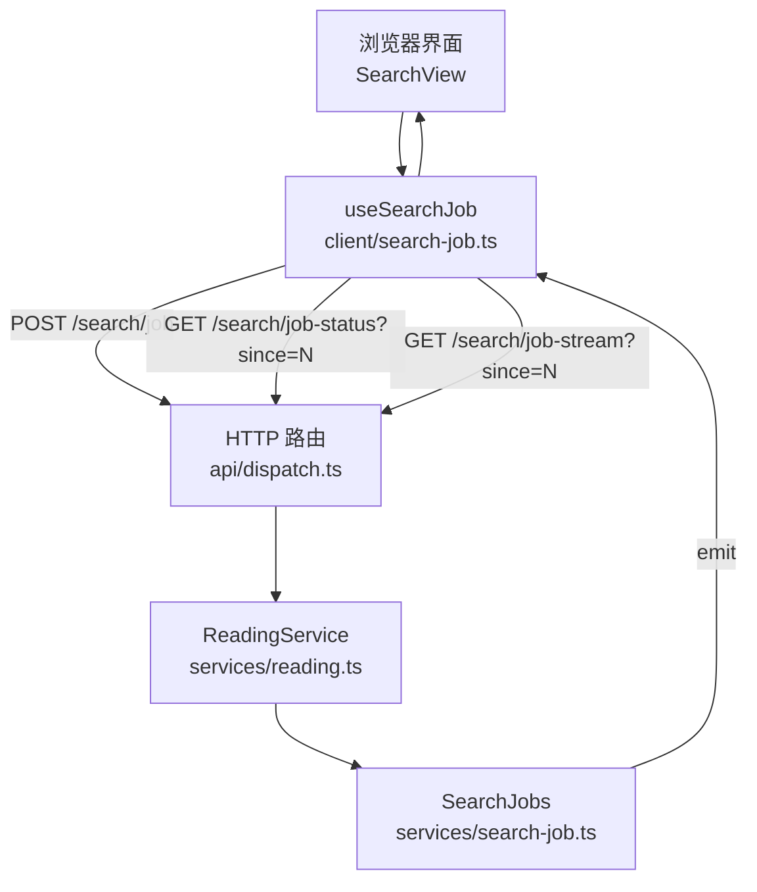
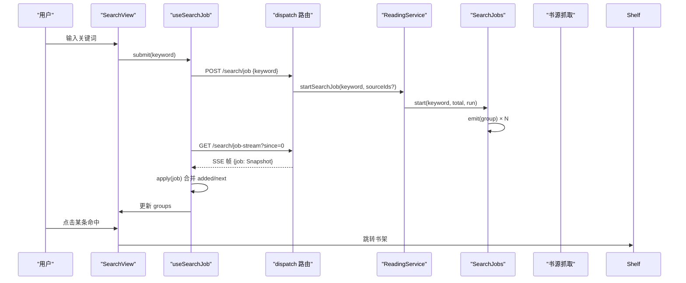
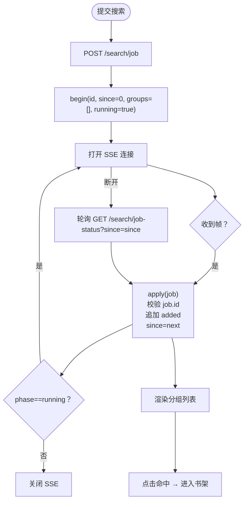
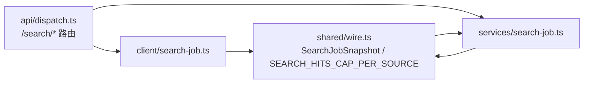

# 聚合搜索

<cite>
**本文引用的文件**
- [src/services/search-job.ts](file://src/services/search-job.ts)
- [src/client/search-job.ts](file://src/client/search-job.ts)
- [src/shared/wire.ts](file://src/shared/wire.ts)
- [src/api/dispatch.ts](file://src/api/dispatch.ts)
- [tests/services/search-job.test.ts](file://tests/services/search-job.test.ts)
- [tests/client/search-job-round-identity.test.tsx](file://tests/client/search-job-round-identity.test.tsx)
</cite>

## 目录
1. [引言](#引言)
2. [项目结构](#项目结构)
3. [核心组件](#核心组件)
4. [架构总览](#架构总览)
5. [详细组件分析](#详细组件分析)
6. [依赖关系分析](#依赖关系分析)
7. [性能与扩展性](#性能与扩展性)
8. [客户端 API 示例](#客户端-api-示例)
9. [故障排查](#故障排查)
10. [结论](#结论)

## 引言
聚合搜索把多个“文本型且已启用”的书源并行抓取，按源分组后以增量方式推送给浏览器前端。用户侧的完整流程是：输入关键词 → 查看逐源分组 → 点击搜索结果中的书名进入书架。实现侧的关键路径是：服务端计算参与集、并发抓取各源、分组合并、通过 SSE 或轮询把 `SearchGroup`/`SearchHit` 增量推送到客户端；客户端用游标 `since`/`next` 累积结果，并在任务身份切换时自动换轮恢复基线。

## 项目结构
与聚合搜索直接相关的代码分布在四个位置：
- 服务层持有整轮结果与游标：`src/services/search-job.ts`
- 客户端 React Hook 负责提交、SSE 与轮询：`src/client/search-job.ts`
- 跨半契约（类型、常量、路由名）：`src/shared/wire.ts`
- HTTP 路由分发（含 `/search/job-stream`）：`src/api/dispatch.ts`



**图表来源**
- [src/client/search-job.ts:1-120](file://src/client/search-job.ts#L1-L120)
- [src/api/dispatch.ts:130-200](file://src/api/dispatch.ts#L130-L200)
- [src/services/search-job.ts:1-170](file://src/services/search-job.ts#L1-L170)

**章节来源**
- [src/services/search-job.ts:1-170](file://src/services/search-job.ts#L1-L170)
- [src/client/search-job.ts:1-200](file://src/client/search-job.ts#L1-L200)
- [src/api/dispatch.ts:130-200](file://src/api/dispatch.ts#L130-L200)
- [src/shared/wire.ts:120-200](file://src/shared/wire.ts#L120-L200)

## 核心组件
- **SearchJobs（服务端）**：持有当前一轮搜索的 `groups`、`phase`、`cancelled`、`finishedAt`、`error` 等内部状态，并通过 `subscribe` 通知观察者；对外提供 `start()`、`snapshot(since)`、`cancel()`。
- **useSearchJob（客户端）**：提交一轮搜索后同时维护两条通道——SSE 长连接作为加速器、每 600ms 一次的快照轮询作为地基；用 `since`/`next` 游标累积 `SearchGroup`，遇到 `job.id` 变化则换轮重读基线。
- **wire 契约**：定义 `SearchJobSnapshot`、`SearchGroup`、`SearchHit`、`SEARCH_HITS_CAP_PER_SOURCE=50`、`SEARCH_JOB_RETENTION_MS=30 分钟`、`SearchPlan` 等跨半类型。
- **dispatch 路由**：暴露 `GET /search/plan`、`POST /search/job`、`POST /search/job-cancel`、`GET /search/job-status?since=`、`GET /search/job-stream?since=`。

**章节来源**
- [src/services/search-job.ts:1-170](file://src/services/search-job.ts#L1-L170)
- [src/client/search-job.ts:1-200](file://src/client/search-job.ts#L1-L200)
- [src/shared/wire.ts:120-200](file://src/shared/wire.ts#L120-L200)
- [src/api/dispatch.ts:130-200](file://src/api/dispatch.ts#L130-L200)

## 架构总览
聚合搜索采用“服务端持有 + 客户端消费”的分离设计：浏览器组件切走不再丢结果，Node 半保留整轮结果和游标，客户端只拉增量。



**图表来源**
- [src/client/search-job.ts:120-200](file://src/client/search-job.ts#L120-L200)
- [src/api/dispatch.ts:130-200](file://src/api/dispatch.ts#L130-L200)
- [src/services/search-job.ts:60-140](file://src/services/search-job.ts#L60-L140)

## 详细组件分析

### 服务端搜索任务：SearchJobs
`SearchJobs` 的核心职责是“在 Node 半持有整轮结果”，并把“谁先搜完谁先可见”的完成序交给客户端游标。

```mermaid
classDiagram
  class SearchJobs {
    -current : Held | null
    -listeners : Set~()~
    +start(keyword, total, run) { jobId }
    +snapshot(since) SearchJobSnapshot | null
    +cancel(reason) boolean
    +subscribe(listener) () => void
    -end(h, status, detail, error) void
    -capHits(group) SearchGroup
  }

  class Held {
    +id : string
    +keyword : string
    +total : number
    +startedAt : number
    +groups : SearchGroup[]
    +phase : running | done | failed
    +cancelled : boolean
    +finishedAt : number
    +error : string
    +settle(outcome) void
  }

  SearchJobs --> Held : "持有当前轮"
```

关键行为：
- `start()` 会替换上一轮：若旧轮仍在运行，则以“已被新一轮搜索替换”结束它；新轮立即 `notify()`，让观察者清零并跟随新 ID。
- `emit` 被包装为 `capHits`，对每个 `SearchGroup.hits` 截断到上限。
- `snapshot(since)` 返回 `added = groups.slice(Math.max(0, Math.min(since, length)))` 与 `next = groups.length`；结束后超过保留期返回 `null`。
- `cancel()` 标记 `cancelled=true`，终态为 `failed`，但已 emit 的分组仍可读。
- `subscribe()` 只发信号不发数据，每条 SSE 连接自行调用 `snapshot(cursor)` 取增量。

**章节来源**
- [src/services/search-job.ts:1-170](file://src/services/search-job.ts#L1-L170)

#### SearchJobSnapshot 字段说明
| 字段 | 含义 | 客户端使用方式 |
|---|---|---|
| `id` | 本轮唯一身份 | 用于判断是否换轮；不同则丢弃旧累积、从 `since=0` 恢复 |
| `keyword` | 本次搜索词 | 展示当前任务标题 |
| `phase` | `running`/`done`/`failed` | 决定 UI 是否显示“还在跑” |
| `cancelled` | 用户主动停止 | 为真时不报红条，但仍允许翻出已搜出的分组 |
| `total` | 真实参搜源数 | 进度条分子；由 `searchPlan` 决定 |
| `done` | 已交付组数 | 等于 `next`，表示“完成序” |
| `added` | `since` 之后的新增分组 | 追加到本地 `groups` |
| `next` | 下次应带的 `since` | 覆盖本地游标 |
| `startedAt` | 开始时间戳 | 可选展示 |
| `finishedAt` | 结束时间戳 | 终态才出现 |
| `error` | 终态错误消息 | 非取消失败时展示 |

**章节来源**
- [src/shared/wire.ts:120-200](file://src/shared/wire.ts#L120-L200)
- [src/services/search-job.ts:100-170](file://src/services/search-job.ts#L100-L170)

### 客户端搜索任务：useSearchJob
客户端同时维护两条投递通道：

1. **SSE 流**：`GET /search/job-stream?since=N`，首帧即带 `since` 的同一份快照；收到帧后调用 `apply()` 合并 `added` 并更新 `since=next`。
2. **轮询兜底**：每 600ms 一次 `GET /search/job-status?since=N`；连不上或断开时自动回落到轮询。



**图表来源**
- [src/client/search-job.ts:1-200](file://src/client/search-job.ts#L1-L200)

关键点：
- `apply()` 中若 `job === null`，说明任务不可读（服务重启或超过保留期），转为错误状态并停止推进。
- 若 `job.id !== acc.id`，触发 `rebaseline()`：先中止旧 SSE 连接，再以 `since=0` 显式读取当前槽完整基线，整体替换累积器。
- 取消操作只影响“继续搜索”：已发出的分组保留，错误文案不显示，因为 `cancelled=true` 不是失败语义。

**章节来源**
- [src/client/search-job.ts:1-200](file://src/client/search-job.ts#L1-L200)

### 路由与协议
服务端通过 `createApiHandler` 统一处理 `/novel-api/*`，搜索相关路由如下：

| 方法 | 路径 | 作用 | 请求体 | 响应要点 |
|---|---|---|---|---|
| GET | `/novel-api/search/plan` | 获取参与集 | 无 | `{ value: { sourceIds } }` |
| POST | `/novel-api/search/job` | 提交一轮搜索 | `{ keyword, sourceIds? }` | `{ ok, value: { jobId } }` |
| POST | `/novel-api/search/job-cancel` | 取消当前轮 | 无 | `{ ok, value: ... }` |
| GET | `/novel-api/search/job-status?since=N` | 快照轮询 | URL 参数 `since` | `{ ok, value: { job: SearchJobSnapshot | null } }` |
| GET | `/novel-api/search/job-stream?since=N` | SSE 增量推送 | URL 参数 `since` | `text/event-stream`，帧体 `{ job: SearchJobSnapshot | null }` |

SSE 实现中，首帧就是带 `since` 的快照，之后每次 `SearchJobs.subscribe` 回调都补一帧；终态时关闭连接。

**章节来源**
- [src/api/dispatch.ts:130-200](file://src/api/dispatch.ts#L130-L200)
- [src/shared/wire.ts:120-200](file://src/shared/wire.ts#L120-L200)

### 搜索计划与参与集
参与集在服务端计算，客户端不得自行推导“哪些源要搜”。契约中 `SearchPlan.sourceIds` 是“本次聚合搜索的真实参与者”；客户端分批、进度条都应基于此值。

实际业务规则可总结为：
- 仅包含 `enabled` 为真的源。
- 仅包含内容形态为 `type='text'` 的源；音频、图片、文件、未知编码均不参与。
- 未验证或探针失败的源仍可参与搜索面，但分组可能带 `statusDetail` 或 `error`。

**章节来源**
- [src/shared/wire.ts:1-120](file://src/shared/wire.ts#L1-L120)
- [src/api/dispatch.ts:160-180](file://src/api/dispatch.ts#L160-L180)

## 依赖关系分析



**图表来源**
- [src/shared/wire.ts:120-200](file://src/shared/wire.ts#L120-L200)
- [src/services/search-job.ts:1-30](file://src/services/search-job.ts#L1-L30)
- [src/api/dispatch.ts:130-200](file://src/api/dispatch.ts#L130-L200)
- [src/client/search-job.ts:1-30](file://src/client/search-job.ts#L1-L30)

耦合特点：
- `SearchJobs` 与 `useSearchJob` 之间没有直接 import，只通过 wire 契约和 HTTP/SSE 协议耦合。
- `dispatch` 是单一入口，避免多处手写 JSON 响应。
- 测试分别覆盖服务层状态机与客户端轮次身份，保证两端契约稳定。

**章节来源**
- [src/shared/wire.ts:120-200](file://src/shared/wire.ts#L120-L200)
- [src/services/search-job.ts:1-170](file://src/services/search-job.ts#L1-L170)
- [src/client/search-job.ts:1-200](file://src/client/search-job.ts#L1-L200)
- [src/api/dispatch.ts:130-200](file://src/api/dispatch.ts#L130-L200)

## 性能与扩展性

### 并发度控制
- 默认并发度由 `DEFAULT_SEARCH_PARALLEL=5` 给出，`ReadingService` 构造时会校验必须为正整数。
- 该值是“批循环并发”的唯一主人，避免各处散落硬编码数字。

优化建议：
- 根据网络质量调整 `searchParallel`：慢网环境降低并发可减少超时与队列积压。
- 不要把并发与“每源命中上限”混为一谈：前者控制同时抓取的源数，后者限制内存。

**章节来源**
- [src/services/reading.ts:50-110](file://src/services/reading.ts#L50-L110)

### 取消信号传播
- `shouldStop` 是协作式取消：运行器每次取条目时检查，已在途的请求不会撤回，避免重复抓取。
- `cancel()` 立即置位 `cancelled=true` 并结束为终态，后续 `shouldStop()` 返回真，运行器自然收手。
- 宿主侧登记的任务也同步结算为 `killed`，生命周期一致。

注意：取消 ≠ 失败。UI 上不应把取消当作红色错误；只有非取消的终态错误才报红条。

**章节来源**
- [src/services/search-job.ts:60-140](file://src/services/search-job.ts#L60-L140)
- [src/client/search-job.ts:140-200](file://src/client/search-job.ts#L140-L200)

### SSE 背压
- SSE 连接保持 keep-alive，服务端只发“状态变了”的信号，具体增量由客户端自己查 `snapshot(cursor)`。
- 客户端在终态时主动 abort SSE 连接，避免空闲长连接占用资源。
- 轮询间隔 600ms，既能感知“边搜边出”，又不至于把 `/novel-api` 打成刷屏。

潜在问题：
- 如果客户端处理帧很慢，SSE 缓冲区可能增长。可在 `apiEventStream` 层加背压：暂停解析直到下游消费完成。
- 若上游站点极慢，优先靠 `searchParallel` 限流，而不是无限扩大并发。

**章节来源**
- [src/client/search-job.ts:1-120](file://src/client/search-job.ts#L1-L120)
- [src/api/dispatch.ts:170-200](file://src/api/dispatch.ts#L170-L200)

### 每源命中上限与失败折叠
- 每源命中上限为 `SEARCH_HITS_CAP_PER_SOURCE=50`，由 `capHits` 在服务端截断，防止单源结果过大。
- 单个源失败只写进该源的 `SearchGroup.error`，不会拖垮整批；其他源正常分组仍会推送。
- “失败源折叠”体现在 UI 层：通常将带 `error` 的分组折叠或降级展示，但数据本身仍在 `added` 中。

**章节来源**
- [src/services/search-job.ts:30-60](file://src/services/search-job.ts#L30-L60)
- [src/shared/wire.ts:120-160](file://src/shared/wire.ts#L120-L160)

### cancelled vs failed
| 场景 | phase | cancelled | error | UI 语义 |
|---|---|---|---|---|
| 正常完成 | `done` | false | 无 | 绿色/完成 |
| 用户取消 | `failed` | true | 包含“已取消” | 保留结果，不报红条 |
| 运行异常 | `failed` | false | 异常信息 | 报红条，提示失败 |
| 被新一轮替换 | 旧轮 | 无关 | 包含“被新一轮搜索替换” | 旧轮不可读 |

**章节来源**
- [src/services/search-job.ts:60-140](file://src/services/search-job.ts#L60-L140)
- [tests/services/search-job.test.ts:80-182](file://tests/services/search-job.test.ts#L80-L182)

## 客户端 API 示例

以下示例面向 curl 与 JavaScript，假设后端地址为 `http://localhost:3000`，接口前缀为 `/novel-api`。

### 1. 提交搜索
```bash
curl -X POST http://localhost:3000/novel-api/search/job \
  -H "Content-Type: application/json" \
  -d '{"keyword":"斗罗"}'
```
期望返回：
```json
{
  "ok": true,
  "value": {
    "jobId": "a1b2c3..."
  }
}
```

JavaScript：
```js
const res = await fetch('/novel-api/search/job', {
  method: 'POST',
  headers: { 'Content-Type': 'application/json' },
  body: JSON.stringify({ keyword: '斗罗' }),
});
const { ok, value } = await res.json();
if (!ok) throw new Error(value.error.message);
return value.jobId;
```

**章节来源**
- [src/api/dispatch.ts:160-180](file://src/api/dispatch.ts#L160-L180)
- [src/client/search-job.ts:160-200](file://src/client/search-job.ts#L160-L200)

### 2. 查询任务状态
```bash
curl "http://localhost:3000/novel-api/search/job-status?since=0"
```
期望返回：
```json
{
  "ok": true,
  "value": {
    "job": {
      "id": "...",
      "keyword": "斗罗",
      "phase": "running",
      "cancelled": false,
      "total": 12,
      "done": 5,
      "added": [...],
      "next": 5,
      "startedAt": 1725000000000
    }
  }
}
```

JavaScript：
```js
async function pollStatus(since = 0) {
  const url = `/novel-api/search/job-status?since=${since}`;
  const res = await fetch(url);
  const { ok, value } = await res.json();
  if (!ok) throw new Error(value.error.message);
  return value.job; // 可能是 null
}
```

**章节来源**
- [src/api/dispatch.ts:180-190](file://src/api/dispatch.ts#L180-L190)
- [src/shared/wire.ts:140-170](file://src/shared/wire.ts#L140-L170)

### 3. 订阅 SSE 增量
```bash
curl -N "http://localhost:3000/novel-api/search/job-stream?since=0"
```
期望输出多条事件，每条事件体形如：
```json
{"job":{"id":"...","phase":"running","added":[...],"next":6}}
```

JavaScript：
```js
function connectStream(since = 0) {
  const url = `/novel-api/search/job-stream?since=${since}`;
  const controller = new AbortController();

  async function watch() {
    try {
      const res = await fetch(url, { signal: controller.signal });
      const reader = res.body.getReader();
      const decoder = new TextDecoder();
      let buffer = '';

      while (true) {
        const { value, done } = await reader.read();
        if (done) break;
        buffer += decoder.decode(value, { stream: true });
        const lines = buffer.split('\n');
        buffer = lines.pop() ?? '';

        for (const line of lines) {
          if (line.startsWith('data:')) {
            const json = line.slice(5).trim();
            const parsed = JSON.parse(json);
            const job = parsed.job;
            if (!job) continue;
            // 应用 job.added 与 job.next
            console.log(job);
          }
        }
      }
    } catch (err) {
      console.warn('SSE 断开，改用轮询');
    }
  }

  watch();
  return controller.abort.bind(controller);
}
```

**章节来源**
- [src/api/dispatch.ts:190-200](file://src/api/dispatch.ts#L190-L200)
- [src/client/search-job.ts:100-160](file://src/client/search-job.ts#L100-L160)

### 4. 取消搜索
```bash
curl -X POST http://localhost:3000/novel-api/search/job-cancel
```
期望返回成功信封，且下一次快照的 `phase` 变为 `failed`、`cancelled` 为 `true`。

JavaScript：
```js
await fetch('/novel-api/search/job-cancel', { method: 'POST' });
```

**章节来源**
- [src/api/dispatch.ts:180-190](file://src/api/dispatch.ts#L180-L190)
- [src/services/search-job.ts:120-170](file://src/services/search-job.ts#L120-L170)

## 故障排查

### 网络超时
现象：部分源长时间无响应，整体进度卡住。  
定位步骤：
1. 查看对应 `SearchGroup.error` 是否包含 fetch/decode 相关错误。
2. 确认 `searchTimeoutMs` 与引擎 JS 预算是否合理。
3. 降低 `searchParallel`，避免同时压垮多个远端站点。

建议：
- 对慢站单独调大超时，不要全局放大；可通过上层重试策略替代盲目提高并发。
- 结合日志区分“站点 5xx”“DNS 失败”“超时”三类，以便分类告警。

**章节来源**
- [src/services/search-job.ts:1-30](file://src/services/search-job.ts#L1-L30)
- [src/services/reading.ts:50-110](file://src/services/reading.ts#L50-L110)

### 源返回空数组
现象：某个源有分组但没有命中。  
说明：这是正常情况。空数组不等于失败；失败会出现在 `group.error`，而空数组只是 `hits=[]`。  
排查：
- 检查书源搜索规则是否能匹配到条目。
- 先用 `/search/plan` 确认该源是否进入参与集。

**章节来源**
- [src/shared/wire.ts:120-160](file://src/shared/wire.ts#L120-L160)

### 搜索结果重复
可能原因：
1. 客户端误把 SSE 帧和轮询回包同时追加到 `groups`。
   - 正确做法：任一时刻只推进一条通道；SSE 可用、轮询就只做保活；SSE 断了再开轮询。
2. 客户端忘记用 `job.next` 覆盖 `since`，导致重复拉取。
3. 多页分页未去重：某些书源会把同一本书拆成多页，需要在上层按 `url` 或 `bookKey` 去重。

修复建议：
- 客户端 `apply()` 只追加 `job.added`，并以 `job.next` 为准。
- 对 `SearchHit.url` 做去重映射，尤其当同站多分页命中同一书时。
- 测试用例 `tests/client/search-job-round-identity.test.tsx` 覆盖了“旧 since 读到新任务”的场景，可作为回归基准。

**章节来源**
- [src/client/search-job.ts:1-120](file://src/client/search-job.ts#L1-L120)
- [tests/client/search-job-round-identity.test.tsx:1-134](file://tests/client/search-job-round-identity.test.tsx#L1-L134)

### 任务消失或结果为 null
现象：`GET /search/job-status?since=N` 返回 `job: null`。  
含义：任务已结束且超过保留期，或服务重启后旧任务被清理。  
处理：
- 客户端应显示“后台搜索任务已不可读”，而不是伪装“搜了没命中”。
- 如果是刷新页面后丢失，应重新提交一轮新的搜索。

**章节来源**
- [src/services/search-job.ts:100-130](file://src/services/search-job.ts#L100-L130)
- [src/client/search-job.ts:60-120](file://src/client/search-job.ts#L60-L120)
- [src/shared/wire.ts:160-170](file://src/shared/wire.ts#L160-L170)

## 结论
聚合搜索通过“服务端持有 + 游标增量 + SSE/轮询双通道”实现了稳定、可恢复、可中断的跨源搜索体验。核心保障点包括：
- 参与集由服务端统一计算，客户端只消费。
- 每源命中上限固定为 50，保护内存。
- 取消与失败严格区分，避免 UI 语义混淆。
- 客户端以 `job.id` 守护轮次边界，换轮时从 `since=0` 恢复基线。
- SSE 加速、轮询兜底，兼顾实时性与可靠性。

对于生产部署，建议重点监控：并发度、超时率、SSE 连接存活时间、每源失败比例，以及客户端因换轮触发的基线重读次数。