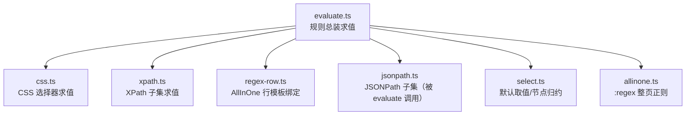
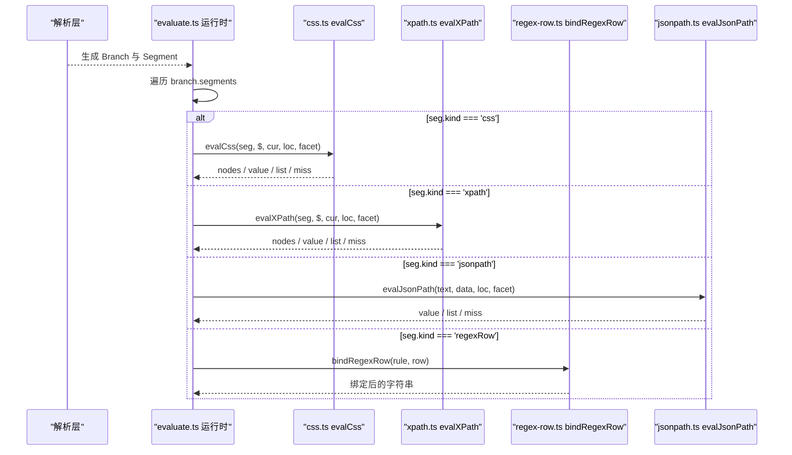
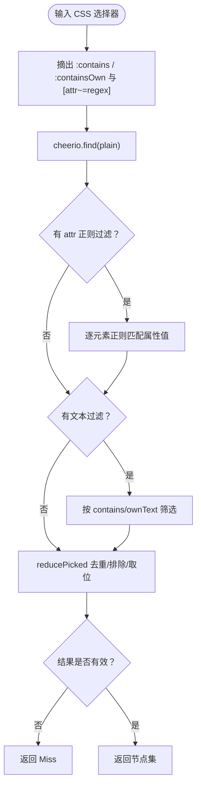
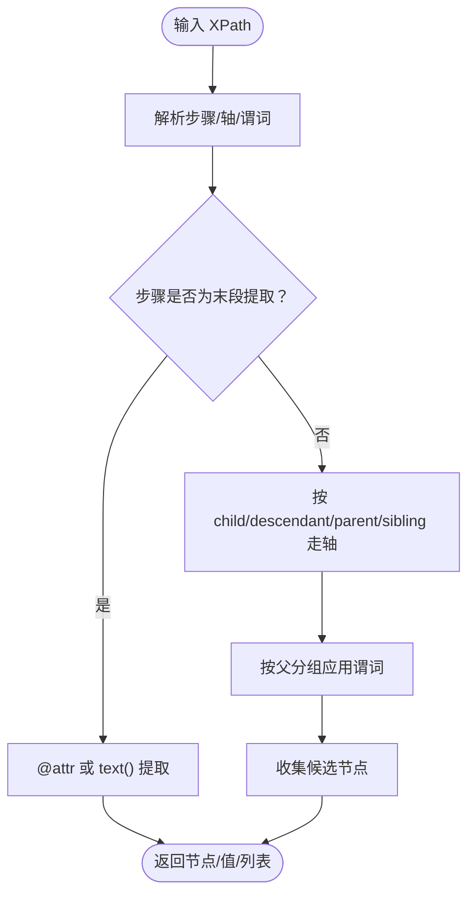
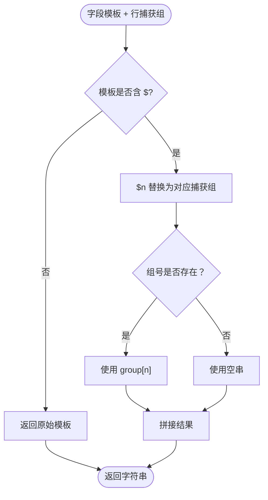
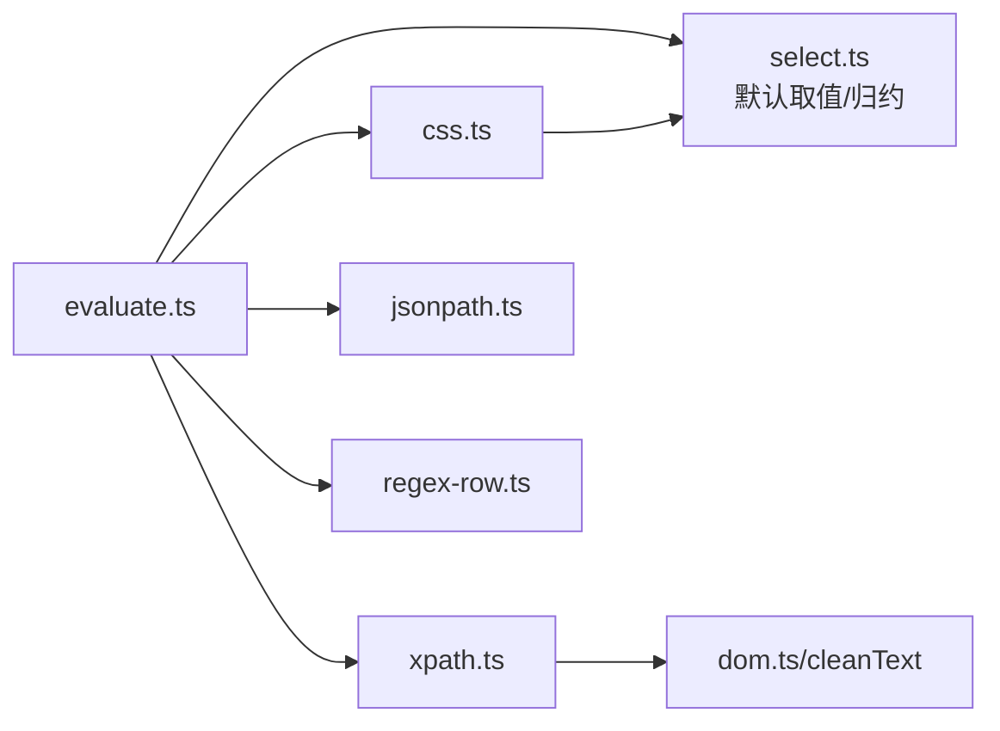

# CSS / XPath / JSONPath 子集

<cite>
**本文引用的文件**   
- [css.ts](file://src/engine/css.ts)
- [xpath.ts](file://src/engine/xpath.ts)
- [regex-row.ts](file://src/engine/regex-row.ts)
- [evaluate.ts](file://src/engine/evaluate.ts)
- [matrix.ts](file://tests/legado-coverage/matrix.ts)
</cite>

## 目录
1. [引言](#引言)
2. [项目结构](#项目结构)
3. [核心组件](#核心组件)
4. [架构总览](#架构总览)
5. [详细组件分析](#详细组件分析)
6. [兼容性矩阵与能力对照](#兼容性矩阵与能力对照)
7. [依赖关系分析](#依赖关系分析)
8. [性能建议](#性能建议)
9. [兼容性测试指引](#兼容性测试指引)
10. [故障排查](#故障排查)
11. [结论](#结论)

## 引言
本文面向“选择器与查询子集”这一主题，逐项说明以下能力的实现范围与边界：

- **CSS 选择器**（`src/engine/css.ts`）
- **XPath 表达式**（`src/engine/xpath.ts`）
- **正则行切分**（`src/engine/regex-row.ts`）
- **JSONPath 子集**（由 `evaluate.ts` 内联调度，实际解析与求值位于 `jsonpath.ts`）

这些能力都来自 legacy 书源语法，是 Facet 树中的 Leaf Facet。解析阶段把它们识别为规则段，运行阶段统一在 `evaluate.ts` 中按分支逐段求值、组合、反序并应用净化尾。

文档同时以 `tests/legado-coverage/matrix.ts` 作为事实来源，列出已实现、部分实现和缺失能力，并用 matrix 行的 `note` 字段解释裁决理由。

## 项目结构
与本主题直接相关的源码集中在 `src/engine/` 下：

**图示来源**
- [evaluate.ts:1-20](file://src/engine/evaluate.ts#L1-L20)
- [evaluate.ts:333-383](file://src/engine/evaluate.ts#L333-L383)
- [css.ts:1-20](file://src/engine/css.ts#L1-L20)
- [xpath.ts:1-20](file://src/engine/xpath.ts#L1-L20)
- [regex-row.ts:1-10](file://src/engine/regex-row.ts#L1-L10)

**章节来源**
- [evaluate.ts:1-20](file://src/engine/evaluate.ts#L1-L20)
- [css.ts:1-20](file://src/engine/css.ts#L1-L20)
- [xpath.ts:1-20](file://src/engine/xpath.ts#L1-L20)
- [regex-row.ts:1-10](file://src/engine/regex-row.ts#L1-L10)

## 核心组件
| 组件 | 职责 | 关键入口 | 主要输出 |
|---|---|---|---|
| CSS 选择器 | 把 jsoup 兼容的文本伪类与属性正则匹配从标准选择器中剥离，再用 cheerio 选择 + 逐元素过滤 | `evalCss` | 节点集、值、列表或 Miss |
| XPath 子集 | 在 domhandler 树上走有限轴、谓词与函数白名单，支持末段取属性/文本 | `evalXPath` | 节点集、单值、列表或 Miss |
| 正则行切分 | 把 AllInOne 扫描出的行组号 `$n` 绑定到字段模板 | `bindRegexRow` | 绑定后的字符串 |
| JSONPath 子集 | 对 JSON 数据执行 `$/.name/[n]/[*]` 等有限路径；由 evaluate 根据上游类型决定直接求值还是链式求值 | `evaluate.ts` 中分发到 `evalJsonPath` | 值、列表或 Miss |

**章节来源**
- [css.ts:21-122](file://src/engine/css.ts#L21-L122)
- [xpath.ts:21-70](file://src/engine/xpath.ts#L21-L70)
- [regex-row.ts:1-26](file://src/engine/regex-row.ts#L1-L26)
- [evaluate.ts:333-383](file://src/engine/evaluate.ts#L333-L383)

## 架构总览
legacy 规则先被解析成 ParsedRule，再进入 `ruleGen` → `branchGen`。每个分支是一段 Leaf Facet 序列，包括 `css`、`xpath`、`jsonpath`、`allinone`、`js`、`put`、`literal`、`regexRow` 等。本节聚焦前三者。

**图示来源**
- [evaluate.ts:140-215](file://src/engine/evaluate.ts#L140-L215)
- [evaluate.ts:333-383](file://src/engine/evaluate.ts#L333-L383)
- [css.ts:96-122](file://src/engine/css.ts#L96-L122)
- [xpath.ts:21-70](file://src/engine/xpath.ts#L21-L70)
- [regex-row.ts:18-26](file://src/engine/regex-row.ts#L18-L26)

## 详细组件分析

### CSS 选择器
#### 支持范围
- 显式形态：`@css:` 强制使用 CSS。
- 隐式回落：未知词含选择器特征字符时回落到 CSS。
- 排除与位置：`!` 排除与索引取位通过 `reducePicked` 统一处理。
- jsoup 文本伪类：`:contains(文本)` 与 `:containsOwn(文本)`，字面包含、忽略大小写。
- jsoup 属性正则：`[attr~=regex]`，按正则匹配而非标准 CSS 的词表包含。
- 选择器缓存：同一选择器文本只解析一次，避免重复摘除谓词。

#### 最小可用示例
- 取书名：用 `.book-title` 选择标题元素。
- 正文正文块：用 `.content` 选择内容容器。
- 正则属性：用 `a[href~=/read/\d+]` 匹配阅读链接。
- 自身文本：用 `p:containsOwn(正文)` 匹配仅直接文本包含目标的内容段落。

#### 行为要点
- 选择器非法抛出 `RuleEvalError`，命中数为 0。
- `:contains(...)` 参数为空也抛错，不静默全命中。
- `[attr~=regex]` 的正则非法同样抛错。
- 零命中、排除后为空、位置越界统一返回 Miss。

**图示来源**
- [css.ts:21-95](file://src/engine/css.ts#L21-L95)
- [css.ts:96-122](file://src/engine/css.ts#L96-L122)

**章节来源**
- [css.ts:21-122](file://src/engine/css.ts#L21-L122)
- [matrix.ts:74-76](file://tests/legado-coverage/matrix.ts#L74-L76)

### XPath 子集
#### 支持范围
- 路径：`//`、`.//`、`/`。
- 节点测试：元素名、`*`、`text()`、末段 `@attr`。
- 轴：`child`（默认）、`parent(..)`、`following-sibling`、`preceding-sibling`。
- 谓词：位置数字、`@attr='v'`、`text()='v'`、`contains(...)`、`starts-with(...)`、`not(...)`、`position()` 比较、子元素存在、相对路径存在性、`and`/`or`。
- 末段提取：`@attr` 返回属性值集合；`text()` 返回文本节点集合。
- 白名单外轴与函数解析期抛 `UnsupportedRuleError`。

#### 最小可用示例
- 取正文块：`//div[@class='content']`。
- 取章节标题：`//h2/text()`。
- 取前一个兄弟：`./following-sibling::h3[1]`。
- 取前一个兄弟（逆向）：`./preceding-sibling::h3[last()]`。
- 条件选择：`//li[a/@href]` 表示“有链接的 li”。

#### 行为要点
- 直接在 domhandler 节点树上求值，避免 HTML→XML 重解析错位。
- `preceding-sibling` 按逆文档序编号，符合 XPath 1.0。
- 谓词按父分组，语义等价于每父节点独立计数。
- 非空节点集即真，用于相对路径存在性谓词。

**图示来源**
- [xpath.ts:21-70](file://src/engine/xpath.ts#L21-L70)
- [xpath.ts:201-260](file://src/engine/xpath.ts#L201-L260)
- [xpath.ts:300-422](file://src/engine/xpath.ts#L300-L422)

**章节来源**
- [xpath.ts:21-70](file://src/engine/xpath.ts#L21-L70)
- [xpath.ts:201-422](file://src/engine/xpath.ts#L201-L422)
- [matrix.ts:77-81](file://tests/legado-coverage/matrix.ts#L77-L81)

### 正则行切分
#### 支持范围
- AllInOne 整页正则扫描后，每条支文本带一组捕获组。
- 字段规则中的 `$n` 从该行捕获组取值。
- `$0` 可取整段匹配；越界组返回空串。
- 组号 token 限制为 1 至 2 位数字。

#### 最小可用示例
- 章节标题模板：`$2$3` 表示第 2 组拼接第 3 组。
- URL 模板：`https://example.com/$1` 表示第 1 组作为章节标识。
- 整段兜底：当某行没有足够捕获组时，字段拼接不会炸，而是使用空串继续拼接。

**图示来源**
- [regex-row.ts:1-26](file://src/engine/regex-row.ts#L1-L26)

**章节来源**
- [regex-row.ts:1-26](file://src/engine/regex-row.ts#L1-L26)
- [matrix.ts:48-51](file://tests/legado-coverage/matrix.ts#L48-L51)

### JSONPath 子集
#### 支持范围
- 路径片段：`$`、`.`、`.name`、`..name`、`[n]`、`[a:b]`、`[*]`、`.*/`、`.[*]`。
- 负数索引：从尾部倒数。
- 中链求值：上游值是对象或数组时，继续按 JSONPath 求值；节点集或正则结果不可按 JSON 求值，抛错。

#### 最小可用示例
- 顶层字段：`$.title`。
- 嵌套数组项：`$.items[0].name`。
- 切片：`$.items[0:3]`。
- 通配：`$.items[*].id`。

#### 行为要点
- `evaluate.ts` 中根据上游类型决定是否直接求值 JSONPath。
- 中链逐项求值全部未命中时返回 Miss。
- 上游不是可 JSON 求值的类型时抛 `RuleEvalError`。

**章节来源**
- [evaluate.ts:333-383](file://src/engine/evaluate.ts#L333-L383)
- [matrix.ts:81](file://tests/legado-coverage/matrix.ts#L81)

## 兼容性矩阵与能力对照
以下对照以 `tests/legado-coverage/matrix.ts` 为依据。

| 能力类别 | 能力 | 状态 | 依据 | 说明 |
|---|---|---|---|---|
| CSS | `@css:` 强制 CSS | 已实现 | matrix `a-css-explicit` | 包含 `!` 排除 |
| CSS | 未知词隐式回落 CSS | 已实现 | matrix `a-css-implicit` | 选择器特征字符触发 |
| CSS | jsoup 属性正则 `[attr~=regex]` | 已实现 | matrix `a-css-attr-regex` | 标准 CSS 是词表包含，jsoup 是正则匹配；本仓实现按正则逐元素筛 |
| XPath | XPath 子集 | 已实现 | matrix `a-xpath-subset` | 元素、`text()`、`@attr`、有限轴与函数白名单 |
| XPath | 谓词内相对路径存在性 | 已实现 | matrix `a-xpath-path-exists-predicate` | `li[.//a]`、`[a/@href]` 按节点集非空即真 |
| XPath | 其余轴与函数 | 不适用 | matrix `a-xpath-other-axes` | ancestor/descendant-or-self/namespace 与 count/sum 等解析期抛错 |
| JSONPath | 基本路径子集 | 已实现 | matrix `a-json-path-subset` | `$/.name/..name/[n]/[a:b]/[*]/.*/.[*]`，负数从尾数 |
| JSONPath | 过滤器与脚本表达式 | 部分实现/待排 | matrix `a-json-path-filter` | 现库普查未发现真实需求，仍标记为 open |
| AllInOne | 行模板 `$n` 绑定 | 已实现 | matrix `a-allinone-group-zero` | `$0` 整段、越界组空串、1~2 位组号 |

**章节来源**
- [matrix.ts:48-51](file://tests/legado-coverage/matrix.ts#L48-L51)
- [matrix.ts:74-81](file://tests/legado-coverage/matrix.ts#L74-L81)

## 依赖关系分析
Leaf Facet 的选择器能力在运行时并不互相耦合，但共同依赖 evaluate 的上下文：

**图示来源**
- [evaluate.ts:1-20](file://src/engine/evaluate.ts#L1-L20)
- [css.ts:1-10](file://src/engine/css.ts#L1-L10)
- [xpath.ts:1-10](file://src/engine/xpath.ts#L1-L10)

**章节来源**
- [evaluate.ts:1-20](file://src/engine/evaluate.ts#L1-L20)
- [css.ts:1-10](file://src/engine/css.ts#L1-L10)
- [xpath.ts:1-10](file://src/engine/xpath.ts#L1-L10)

## 性能建议
1. **优先结构化选择器**：XPath 与 CSS 在 DOM 上定位，比全文正则更可控。
2. **避免深层嵌套**：`//` 后代轴会遍历整个子树；能用 `/` 子步或具体祖先时尽量缩小作用域。
3. **减少全文扫描**：AllInOne 正则适合整页二维匹配场景，但不该用来替代局部选择器。
4. **复用选择器解析**：CSS 选择器已按原文缓存解析结果，避免重复拆出伪类和属性正则。
5. **注意谓词分组**：XPath 谓词按父分组计算，复杂谓词会增加每父节点的过滤成本。
6. **JSONPath 上游类型明确**：只有对象/数组才走 JSONPath；节点集或正则结果应先用 CSS/XPath 转为值或节点。

[本节为通用性能指导，不直接分析具体代码行]

## 兼容性测试指引
新增或回归能力时，应按以下流程维护 matrix 与 fixture：

1. **新增能力必须补 matrix 行**
   - 若已实现：填写 `status: implemented`，给出 `impl` 指向源码符号。
   - 若环境不适用：填写 `status: not-applicable`，并在 `note` 写明裁决理由。
   - 若仍欠账：填写 `status: open`，写明缺什么、卡在谁手上，并带复核日期。

2. **新增能力必须补 fixture 或测试**
   - 实现类能力：添加测试用例，并把 `test` 指向测试文件与标题片段。
   - 回归旧语法：以 matrix 行作为判据，不能只改注释。

3. **回归旧语法时的判定顺序**
   - 先看 matrix 行状态。
   - 再看 `impl` 与 `test` 是否仍能定位到源码与测试。
   - 最后看 `note` 中的真机证据与日期戳。

4. **CSS 回归重点**
   - `[attr~=regex]` 必须是正则语义。
   - `:contains` 与 `:containsOwn` 必须保持字面包含、忽略大小写。
   - 空参数与非法正则必须抛错，不能静默零命中。

5. **XPath 回归重点**
   - 白名单外轴与函数必须解析期抛错。
   - `preceding-sibling` 的位置编号必须按逆文档序。
   - 谓词内相对路径存在性必须按节点集非空即真。

6. **JSONPath 回归重点**
   - 基本路径子集必须覆盖负数索引、切片与通配。
   - 中链求值必须区分对象/数组与不可 JSON 求值的上游。

**章节来源**
- [matrix.ts:1-30](file://tests/legado-coverage/matrix.ts#L1-L30)
- [matrix.ts:48-81](file://tests/legado-coverage/matrix.ts#L48-L81)

## 故障排查
| 现象 | 可能原因 | 排查方向 |
|---|---|---|
| CSS 选择器零命中 | `[attr~=regex]` 被当标准 CSS 词表匹配 | 检查是否依赖 jsoup 正则语义 |
| CSS 选择器报解析错误 | 选择器非法或 `:contains(...)` 参数为空 | 查看 RuleEvalError 消息中的选择器原文 |
| XPath 报不支持 | 使用了白名单外的轴或函数 | 对照 matrix `a-xpath-other-axes` |
| XPath 谓词内 `//` 报错 | 谓词内绝对路径从文档根起步，当前只有上下文节点 | 改用相对路径存在性 |
| JSONPath 报上游类型错误 | 上游是节点集或正则结果 | 先用 CSS/XPath 转成值或节点 |
| AllInOne 字段模板不生效 | `$n` 不在当前行捕获组范围内 | 检查行模板与捕获组数量 |

**章节来源**
- [css.ts:21-95](file://src/engine/css.ts#L21-L95)
- [xpath.ts:201-260](file://src/engine/xpath.ts#L201-L260)
- [evaluate.ts:333-383](file://src/engine/evaluate.ts#L333-L383)
- [regex-row.ts:1-26](file://src/engine/regex-row.ts#L1-L26)

## 结论
CSS、XPath、正则行切分与 JSONPath 子集都是 legacy 规则体系中的 Leaf Facet。它们在 `evaluate.ts` 中被统一识别、统一求值、统一组合。矩阵行提供稳定的能力口径：已实现能力以源码与测试锚定，不适用能力以裁决理由收尾，开放能力以欠账描述推进。

实际使用中应优先使用结构化选择器，避免用正则做全文扫描；遇到旧语法回归时，应以 matrix 行为判据，而不是凭直觉修改实现。

[本节为总结性内容，不直接分析具体代码行]