# JS 沙箱与安全

<cite>
**本文引用的文件**   
- [src/engine/js-sandbox.ts](file://src/engine/js-sandbox.ts)
- [src/engine/allinone.ts](file://src/engine/allinone.ts)
- [src/engine/evaluate.ts](file://src/engine/evaluate.ts)
- [src/engine/errors.ts](file://src/engine/errors.ts)
- [src/engine/index.ts](file://src/engine/index.ts)
- [src/engine/js-utils.ts](file://src/engine/js-utils.ts)
- [src/services/fetcher.ts](file://src/services/fetcher.ts)
- [tests/engine/js-sandbox.test.ts](file://tests/engine/js-sandbox.test.ts)
- [tests/engine/js-bindings.test.ts](file://tests/engine/js-bindings.test.ts)
- [tests/engine/evaluate-sync-loop.test.ts](file://tests/engine/evaluate-sync-loop.test.ts)
</cite>

## 目录
1. [引言](#引言)
2. [项目结构中的安全边界](#项目结构中的安全边界)
3. [核心组件](#核心组件)
4. [架构总览](#架构总览)
5. [详细组件分析](#详细组件分析)
6. [依赖关系分析](#依赖关系分析)
7. [性能与超时调优](#性能与超时调优)
8. [故障排查指南](#故障排查指南)
9. [结论](#结论)

## 引言
本专题聚焦 JS 沙箱模块，解释在 Node.js 环境中如何以 VM2 风格隔离运行用户提供的 `bookSourceScript`，如何禁用动态代码执行、如何通过受限的 Java 垫片暴露必要的 Java API，以及如何把脚本错误与规则求值错误、网络请求错误区分开。文档同时说明 `jsTimeoutMs` 的作用域、调优风险和安全最佳实践，并解释 how allinone.ts 中的 JS 片段在规则求值中被注入且仍保持受控。

## 项目结构中的安全边界
JS 沙箱位于引擎层，围绕“规则求值”这一信任边界展开：
- `src/engine/js-sandbox.ts`：构建 VM2 风格 sandbox，封装受限全局、拦截危险构造、导出 java.* 方法。
- `src/engine/allinone.ts`：生成并注入供模板和规则使用的 JS 片段。
- `src/engine/evaluate.ts`：统一调度解析、选择器、替换、正则、变量与 JS 片段的求值。
- `src/engine/errors.ts`：定义 `JsSandboxError` 及与规则错误、网络错误的分类。
- `src/services/fetcher.ts`：负责网络请求，不应被用户脚本直接调用；对外暴露通过服务层过滤后的能力。
- 测试用例覆盖 sandbox 安全性、Java 绑定、同步循环等场景。

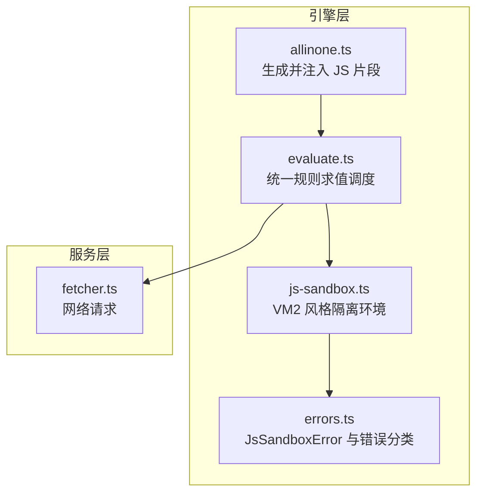

**图示来源**
- [src/engine/allinone.ts:1-200](file://src/engine/allinone.ts#L1-L200)
- [src/engine/evaluate.ts:1-200](file://src/engine/evaluate.ts#L1-L200)
- [src/engine/js-sandbox.ts:1-200](file://src/engine/js-sandbox.ts#L1-L200)
- [src/engine/errors.ts:1-200](file://src/engine/errors.ts#L1-L200)
- [src/services/fetcher.ts:1-200](file://src/services/fetcher.ts#L1-L200)

**章节来源**
- [src/engine/js-sandbox.ts:1-200](file://src/engine/js-sandbox.ts#L1-L200)
- [src/engine/allinone.ts:1-200](file://src/engine/allinone.ts#L1-L200)
- [src/engine/evaluate.ts:1-200](file://src/engine/evaluate.ts#L1-L200)
- [src/engine/errors.ts:1-200](file://src/engine/errors.ts#L1-L200)
- [src/services/fetcher.ts:1-200](file://src/services/fetcher.ts#L1-L200)

## 核心组件
- **JS 沙箱**：提供受限全局对象、拦截 `eval`/`new Function`/字符串到函数、限制原型链访问与危险属性，并仅暴露白名单 Java API。
- **规则求值器**：将模板、CSS/XPath 选择器、替换规则、变量与 JS 片段组合求值，并将结果传回上层。
- **错误体系**：区分脚本运行时异常、规则语法或求值失败、以及网络层错误。
- **注入机制**：allinone.ts 生成一段受控 JS 片段，在 evaluate.ts 中作为可信上下文注入，而非直接拼接任意用户代码。

**章节来源**
- [src/engine/js-sandbox.ts:1-200](file://src/engine/js-sandbox.ts#L1-L200)
- [src/engine/evaluate.ts:1-200](file://src/engine/evaluate.ts#L1-L200)
- [src/engine/errors.ts:1-200](file://src/engine/errors.ts#L1-L200)
- [src/engine/allinone.ts:1-200](file://src/engine/allinone.ts#L1-L200)

## 架构总览
下图展示一次带 JS 片段的规则求值从入口到沙箱、再到服务层的调用链。

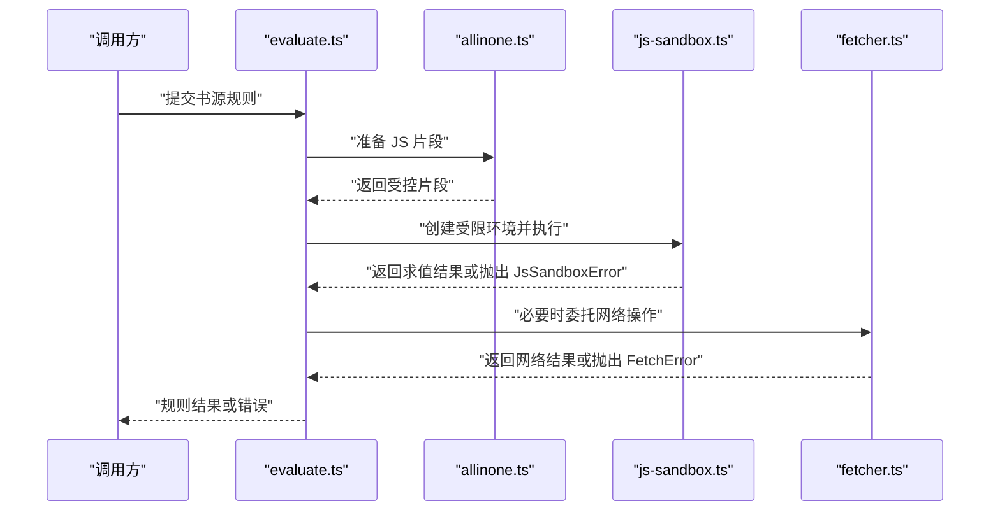

**图示来源**
- [src/engine/evaluate.ts:1-200](file://src/engine/evaluate.ts#L1-L200)
- [src/engine/allinone.ts:1-200](file://src/engine/allinone.ts#L1-L200)
- [src/engine/js-sandbox.ts:1-200](file://src/engine/js-sandbox.ts#L1-L200)
- [src/services/fetcher.ts:1-200](file://src/services/fetcher.ts#L1-L200)

## 详细组件分析

### VM2 风格沙箱隔离机制
- **隔离目标**：阻止用户脚本访问宿主敏感能力，例如文件系统、进程、网络直连、任意原型链遍历、反射式类加载等。
- **实现要点**：
  - 使用 VM2 风格的 sandbox 包装顶层作用域，仅暴露白名单全局与方法。
  - 拦截 `eval`、`Function`、`setTimeout`/`setInterval` 的字符串形式、`require`、`process`、`globalThis` 危险路径。
  - 对对象属性访问进行代理或白名单校验，拒绝读取未授权属性。
  - 将 Java API 通过 `java.*` 命名空间暴露为受限方法集，避免直接暴露 JVM 反射能力。

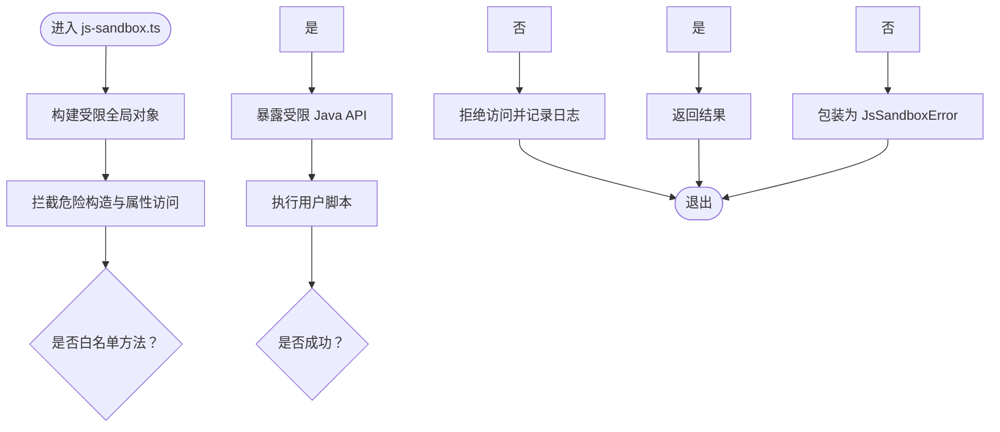

**图示来源**
- [src/engine/js-sandbox.ts:1-200](file://src/engine/js-sandbox.ts#L1-L200)

**章节来源**
- [src/engine/js-sandbox.ts:1-200](file://src/engine/js-sandbox.ts#L1-L200)

### 禁止 eval、new Function 与字符串代码生成
- 策略上应禁用所有能从字符串动态生成可执行代码的路径，包括 `eval`、`new Function`、`setTimeout(..., str)`、`setInterval(..., str)`、`Function.prototype.call` 用于绕过、以及通过原型链反射构造函数的途径。
- 对于需要字符串处理的地方，应在沙箱内只提供安全的字符串工具方法，而不是允许执行任意字符串。
- 若确实需要模板渲染，应由 allinone.ts 注入预编译好的函数，而非由用户传入字符串。

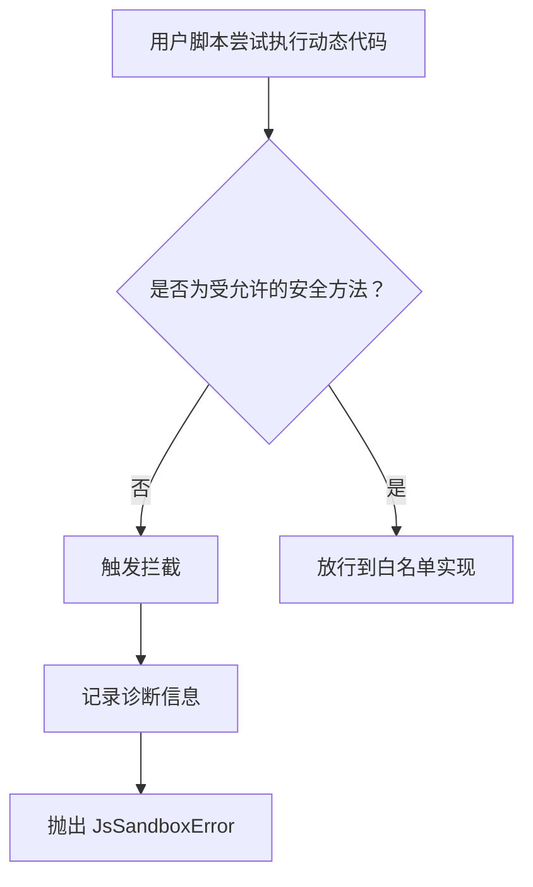

**图示来源**
- [src/engine/js-sandbox.ts:1-200](file://src/engine/js-sandbox.ts#L1-L200)

**章节来源**
- [src/engine/js-sandbox.ts:1-200](file://src/engine/js-sandbox.ts#L1-L200)

### java.* 垫片与受限 Java API
- 设计原则：不暴露完整 Java 反射，只暴露业务需要的有限方法，例如数据转换、编码、时间、哈希等。
- 暴露方式：通过 `java.*` 命名空间下的方法名映射到具体实现，并在调用前做参数校验、长度限制、类型检查。
- 防御点：
  - 拒绝传入过大输入或无限递归数据结构。
  - 拒绝通过 `java.lang.Class.forName` 等方式加载任意类。
  - 所有 I/O、网络、线程操作必须经服务层白名单。

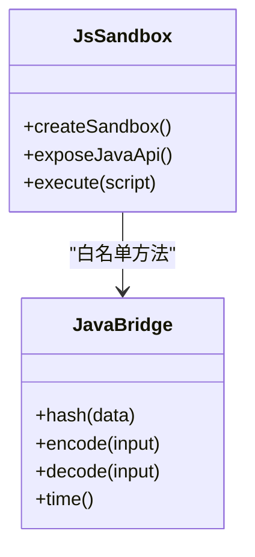

**图示来源**
- [src/engine/js-sandbox.ts:1-200](file://src/engine/js-sandbox.ts#L1-L200)

**章节来源**
- [src/engine/js-sandbox.ts:1-200](file://src/engine/js-sandbox.ts#L1-L200)

### JsSandboxError 的错误分类、诊断信息与日志
- `JsSandboxError` 用于包裹用户脚本在沙箱中抛出的异常，包括语法错误、运行时异常、越权访问、超时等。
- 诊断信息应包含：
  - 错误类别：如“动态代码执行被拦截”“未授权属性访问”“脚本超时”。
  - 上下文来源：来自哪条规则、哪个字段、哪次求值。
  - 堆栈摘要：保留必要堆栈但不泄露内部实现细节。
  - 输入指纹：对原始输入做不可逆摘要，便于追踪问题而不泄露明文。
- 日志输出建议分级：
  - 警告：拦截行为、可疑模式。
  - 错误：实际失败与资源泄漏风险。
  - 调试：仅在开发环境启用，包含更详细上下文。

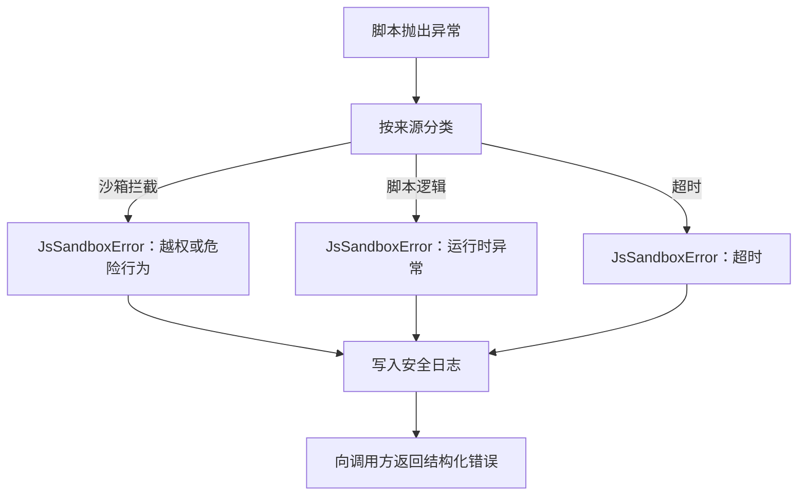

**图示来源**
- [src/engine/errors.ts:1-200](file://src/engine/errors.ts#L1-L200)
- [src/engine/js-sandbox.ts:1-200](file://src/engine/js-sandbox.ts#L1-L200)

**章节来源**
- [src/engine/errors.ts:1-200](file://src/engine/errors.ts#L1-L200)
- [src/engine/js-sandbox.ts:1-200](file://src/engine/js-sandbox.ts#L1-L200)

### 与 RuleEvalError、FetchError 的区别
- **RuleEvalError**：表示规则本身的解析、匹配、选择、替换等求值失败，属于规则逻辑错误。
- **JsSandboxError**：表示用户脚本在受限环境中运行出错，可能涉及安全拦截、动态代码、越权访问或脚本自身异常。
- **FetchError**：表示网络请求失败，属于服务层错误，与脚本执行语义无关。
- 三者应分别捕获、分类、上报，以便运维与开发者定位问题来源。

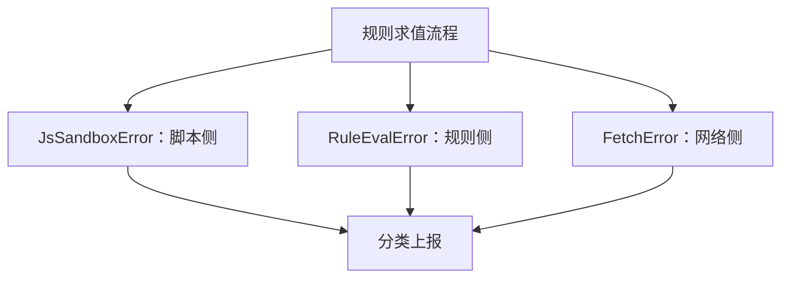

**图示来源**
- [src/engine/errors.ts:1-200](file://src/engine/errors.ts#L1-L200)
- [src/engine/evaluate.ts:1-200](file://src/engine/evaluate.ts#L1-L200)
- [src/services/fetcher.ts:1-200](file://src/services/fetcher.ts#L1-L200)

**章节来源**
- [src/engine/errors.ts:1-200](file://src/engine/errors.ts#L1-L200)
- [src/engine/evaluate.ts:1-200](file://src/engine/evaluate.ts#L1-L200)
- [src/services/fetcher.ts:1-200](file://src/services/fetcher.ts#L1-L200)

### allinone.ts 中 JS 片段的安全注入
- allinone.ts 负责生成一段“可信”的 JS 片段，这些片段由系统维护，不包含任意用户输入。
- evaluate.ts 在准备规则求值上下文时，将该片段注入到 sandbox 中，使模板和规则可以调用受控函数。
- 关键安全约束：
  - 片段本身不得拼接用户输入。
  - 用户输入只能作为参数传递，并由服务端在服务层再次校验。
  - 片段不能直接调用底层网络、文件、进程接口，如需相关能力必须走白名单服务。

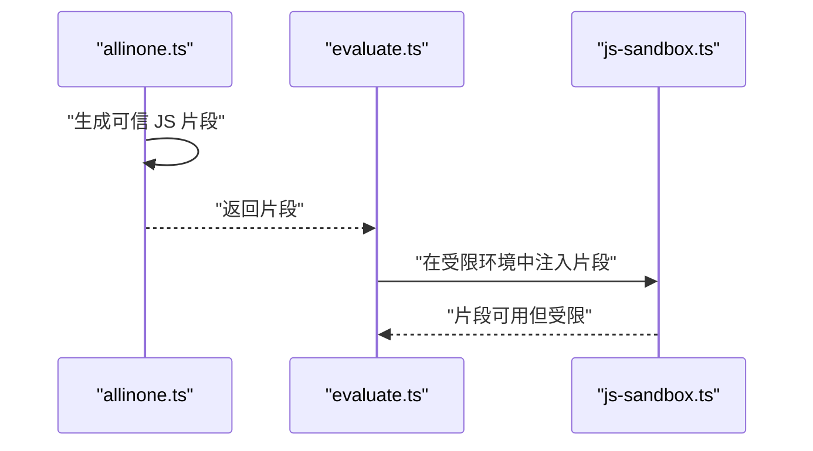

**图示来源**
- [src/engine/allinone.ts:1-200](file://src/engine/allinone.ts#L1-L200)
- [src/engine/evaluate.ts:1-200](file://src/engine/evaluate.ts#L1-L200)
- [src/engine/js-sandbox.ts:1-200](file://src/engine/js-sandbox.ts#L1-L200)

**章节来源**
- [src/engine/allinone.ts:1-200](file://src/engine/allinone.ts#L1-L200)
- [src/engine/evaluate.ts:1-200](file://src/engine/evaluate.ts#L1-L200)

### 外部输入必须先经沙箱再参与 DOM/网络操作
- 用户提供的文本、URL、正则、模板等外部输入，应先经过沙箱内的白名单方法处理，再由引擎层统一发起 DOM 解析或网络请求。
- 严禁让用户脚本直接调用浏览器或 Node 原生网络接口。
- 对长输入、复杂正则、深层嵌套结构应加长度、深度、复杂度限制。

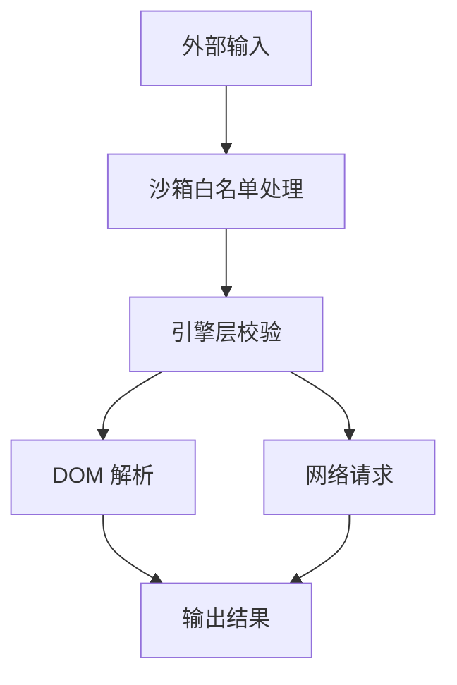

**图示来源**
- [src/engine/js-sandbox.ts:1-200](file://src/engine/js-sandbox.ts#L1-L200)
- [src/engine/evaluate.ts:1-200](file://src/engine/evaluate.ts#L1-L200)
- [src/services/fetcher.ts:1-200](file://src/services/fetcher.ts#L1-L200)

**章节来源**
- [src/engine/js-sandbox.ts:1-200](file://src/engine/js-sandbox.ts#L1-L200)
- [src/engine/evaluate.ts:1-200](file://src/engine/evaluate.ts#L1-L200)
- [src/services/fetcher.ts:1-200](file://src/services/fetcher.ts#L1-L200)

## 依赖关系分析
- `evaluate.ts` 依赖 `allinone.ts` 提供可信片段，并依赖 `js-sandbox.ts` 执行用户脚本。
- `js-sandbox.ts` 依赖错误模块输出 `JsSandboxError`，并可能间接依赖 `java.*` 垫片。
- `fetcher.ts` 独立于用户脚本，由服务层控制网络行为。
- 测试覆盖 sandbox 安全性、Java 绑定、同步循环等边界情况。

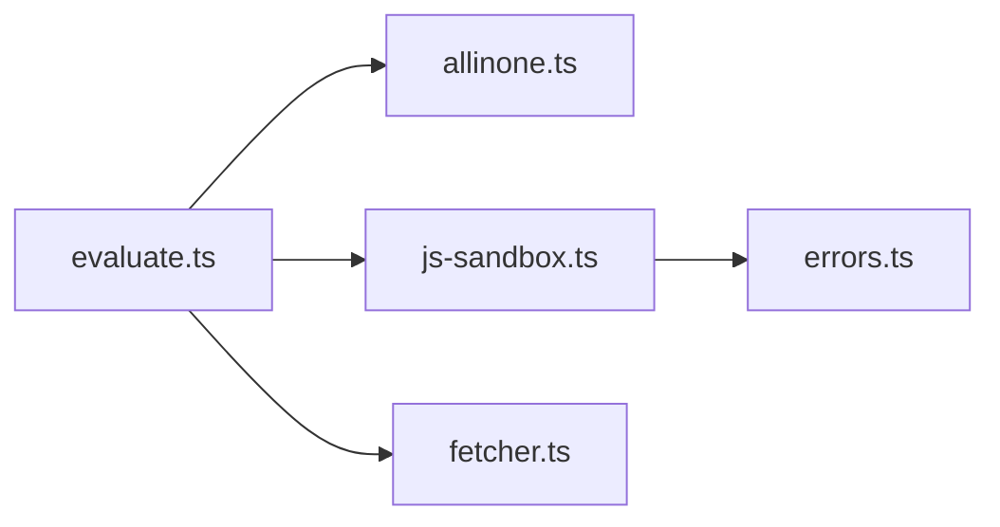

**图示来源**
- [src/engine/evaluate.ts:1-200](file://src/engine/evaluate.ts#L1-L200)
- [src/engine/allinone.ts:1-200](file://src/engine/allinone.ts#L1-L200)
- [src/engine/js-sandbox.ts:1-200](file://src/engine/js-sandbox.ts#L1-L200)
- [src/engine/errors.ts:1-200](file://src/engine/errors.ts#L1-L200)
- [src/services/fetcher.ts:1-200](file://src/services/fetcher.ts#L1-L200)

**章节来源**
- [src/engine/evaluate.ts:1-200](file://src/engine/evaluate.ts#L1-L200)
- [src/engine/allinone.ts:1-200](file://src/engine/allinone.ts#L1-L200)
- [src/engine/js-sandbox.ts:1-200](file://src/engine/js-sandbox.ts#L1-L200)
- [src/engine/errors.ts:1-200](file://src/engine/errors.ts#L1-L200)
- [src/services/fetcher.ts:1-200](file://src/services/fetcher.ts#L1-L200)

## 性能与超时调优
- `jsTimeoutMs` 是用户脚本执行的超时阈值，用于防止恶意脚本长期占用单线程。
- 过短的风险：
  - 正常脚本因网络、DOM 解析、复杂正则或大数据量处理而超时。
  - 用户体验下降，规则频繁失败。
- 过长的风险：
  - 恶意脚本可长时间阻塞事件循环或工作线程。
  - 资源耗尽，影响其他请求。
- 调优建议：
  - 根据典型书源规模设置基线值，并通过压测观察 P95/P99 耗时。
  - 对含网络、正则、大文档的规则单独评估，必要时拆分任务或使用异步白名单。
  - 配合 CPU 时间统计、内存上限、递归深度限制一起配置。
  - 对超时错误集中监控，识别“合理慢”与“恶意卡死”两类模式。

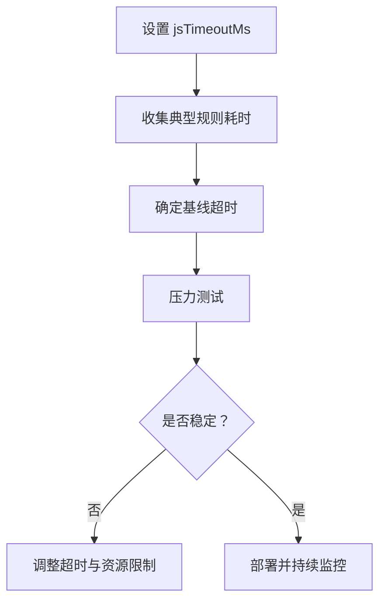

**图示来源**
- [src/engine/evaluate.ts:1-200](file://src/engine/evaluate.ts#L1-L200)
- [src/engine/js-sandbox.ts:1-200](file://src/engine/js-sandbox.ts#L1-L200)

**章节来源**
- [src/engine/evaluate.ts:1-200](file://src/engine/evaluate.ts#L1-L200)
- [src/engine/js-sandbox.ts:1-200](file://src/engine/js-sandbox.ts#L1-L200)

## 故障排查指南
- **常见症状**
  - 规则偶尔失败：可能是 `jsTimeoutMs` 偏小或输入过大。
  - 动态代码报错：说明触发了 eval/new Function 拦截。
  - 无法访问 Java API：说明方法不在白名单或参数校验失败。
  - 网络请求失败：优先查看 `FetchError`，而非误判为脚本错误。
- **定位步骤**
  1. 确认错误类型：`JsSandboxError`、`RuleEvalError`、`FetchError`。
  2. 查看诊断信息中的规则来源、字段、输入摘要。
  3. 检查是否使用了非白名单方法或尝试访问受限属性。
  4. 对疑似恶意脚本，启用更详细日志并隔离复现。
  5. 调整 `jsTimeoutMs` 和输入大小限制后回归验证。
- **参考测试**
  - sandbox 安全性测试
  - Java 绑定测试
  - 同步循环与超时测试

**章节来源**
- [tests/engine/js-sandbox.test.ts:1-200](file://tests/engine/js-sandbox.test.ts#L1-L200)
- [tests/engine/js-bindings.test.ts:1-200](file://tests/engine/js-bindings.test.ts#L1-L200)
- [tests/engine/evaluate-sync-loop.test.ts:1-200](file://tests/engine/evaluate-sync-loop.test.ts#L1-L200)

## 结论
JS 沙箱是本系统的核心信任边界之一。通过 VM2 风格隔离、严格禁用动态代码执行、受限暴露 Java API、明确错误分类与日志、以及谨慎配置 `jsTimeoutMs`，可以在保障书源灵活性的同时降低恶意脚本风险。所有外部输入必须先经沙箱与服务层校验，再进入 DOM 或网络操作；可信片段由 allinone.ts 生成并注入，绝不拼接用户输入。实践中应以白名单、长度/深度/递归限制、超时与资源配额共同构成纵深防御。