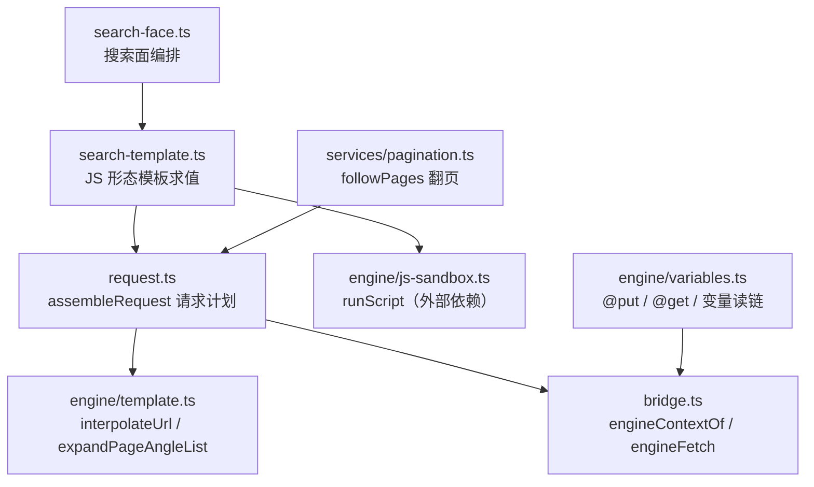
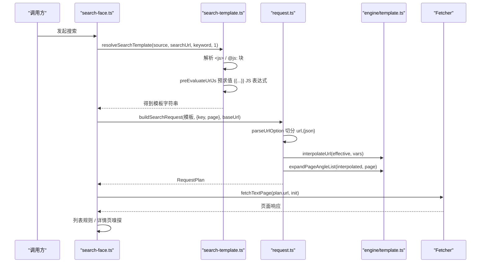
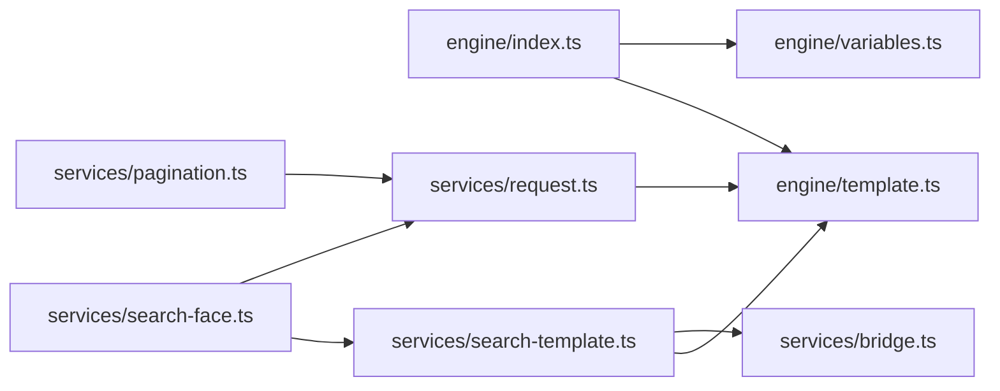

# URL 模板与变量

<cite>
**本文引用的文件**   
- [src/engine/template.ts](file://src/engine/template.ts)
- [src/engine/variables.ts](file://src/engine/variables.ts)
- [src/engine/index.ts](file://src/engine/index.ts)
- [src/services/search-template.ts](file://src/services/search-template.ts)
- [src/services/request.ts](file://src/services/request.ts)
- [src/services/pagination.ts](file://src/services/pagination.ts)
- [src/services/search-face.ts](file://src/services/search-face.ts)
- [src/services/bridge.ts](file://src/services/bridge.ts)
- [tests/engine/template.test.ts](file://tests/engine/template.test.ts)
- [tests/engine/tocurl-interpolation.test.ts](file://tests/engine/tocurl-interpolation.test.ts)
- [tests/engine/variables.test.ts](file://tests/engine/variables.test.ts)
</cite>

## 目录

1. [引言](#引言)
2. [项目结构定位](#项目结构定位)
3. [核心组件](#核心组件)
4. [架构总览](#架构总览)
5. [详细组件分析](#详细组件分析)
6. [依赖关系分析](#依赖关系分析)
7. [性能考虑](#性能考虑)
8. [故障排查指南](#故障排查指南)
9. [结论](#结论)

## 引言

URL 模板与变量子系统负责把书源声明的搜索地址、目录地址、下一页地址等模板字符串，转换成真正可被网络层抓取的绝对 URL。它处理三类关键问题：

1. **插值语法**：对 `{{...}}` 形式的变量占位进行求值与编码。
2. **变量来源与作用域**：区分宿主注入变量、书源全局变量、搜索上下文变量以及规则执行过程中通过 `@put` / `@get` 累积的变量。
3. **调用顺序**：先完成 JS 形态和 `{{...}}` 模板展开，再把结果交给请求组装器，最后由 Fetcher 发起网络请求。

本文件聚焦以下目标：

- 解释 `interpolateUrl` 如何解析 `{{key}}`、`{{key||default}}` 等形态。
- 解释 `expandPageAngleList` 如何处理 `<a,b,c>` 分页列表。
- 解释 `isPlaceholderExpr` 为什么不能只看词法，还要查变量表。
- 解释 `evalPut` / `evalGetVar` / `getScopedVar` / `getRuleVar` 如何维护变量作用域。
- 给出 `bookSourceUrl='https://example.com'` 时 `/{{host}}/{{page}}` 的实际展开路径。
- 说明未定义变量、编码错误、分页越界等常见陷阱。
- 提供调试手段与性能建议。

## 项目结构定位

URL 模板与变量相关代码分布在两个层次：

| 层次 | 文件 | 职责 |
|---|---|---|
| 引擎层 | `src/engine/template.ts` | URL 插值、占位判定、页码角列表展开 |
| 引擎层 | `src/engine/variables.ts` | `@put` / `@get`、变量读链、JSONPath 取值、内建伪变量 |
| 引擎层 | `src/engine/index.ts` | 对外暴露 `interpolateUrl`、`isPlaceholderExpr`、`expandPageAngleList` |
| 服务层 | `src/services/search-template.ts` | 搜索 URL 模板中 `<js>` / `@js:` 的预求值与 `{{...}}` 预处理 |
| 服务层 | `src/services/request.ts` | URL + 选项切分、`assembleRequest` 请求计划构建、相对 URL 绝对化 |
| 服务层 | `src/services/search-face.ts` | 搜索面编排：模板 → 请求计划 → 抓取 → 规则求值 |
| 服务层 | `src/services/pagination.ts` | 翻页跟进：next 规则驱动的多页抓取循环 |
| 服务层 | `src/services/bridge.ts` | 脚本上下文拼装：baseUrl、source、vars、book、chapter、fetch 等 |

**图表来源**
- [src/services/search-face.ts:70-105](file://src/services/search-face.ts#L70-L105)
- [src/services/search-template.ts:36-60](file://src/services/search-template.ts#L36-L60)
- [src/services/request.ts:130-185](file://src/services/request.ts#L130-L185)
- [src/engine/template.ts:1-61](file://src/engine/template.ts#L1-L61)
- [src/engine/variables.ts:1-197](file://src/engine/variables.ts#L1-L197)
- [src/services/pagination.ts:1-86](file://src/services/pagination.ts#L1-L86)

**章节来源**
- [src/engine/template.ts:1-61](file://src/engine/template.ts#L1-L61)
- [src/engine/variables.ts:1-197](file://src/engine/variables.ts#L1-L197)
- [src/services/search-template.ts:1-136](file://src/services/search-template.ts#L1-L136)
- [src/services/request.ts:1-226](file://src/services/request.ts#L1-L226)
- [src/services/search-face.ts:1-145](file://src/services/search-face.ts#L1-L145)
- [src/services/pagination.ts:1-86](file://src/services/pagination.ts#L1-L86)

## 核心组件

### 1. URL 模板插值：`interpolateUrl`

`interpolateUrl(template, vars)` 是 URL 模板的核心插值函数。它的行为如下：

1. 使用正则匹配所有 `{{...}}` 片段。
2. 对每个片段内部按 `splitVarExpr` 拆出变量名和兜底值。
3. 如果内部不是“占位形态”，原样保留该片段。
4. 如果是占位且 `vars` 中有对应键，则取该值并做 URI 编码。
5. 如果是占位但无对应键且有兜底值，则用兜底值。
6. 如果是占位但既无值也无兜底值，则保留原始 `{{...}}` 文本。

关键点：

- **值是 UTF-8 编码后的 URI 段**：中文、空格、特殊字符会被转义。
- **原型链成员名不会被当作变量**：`toString`、`constructor`、`__proto__` 等不会从 `Object.prototype` 读取。
- **未知变量保留原文**：这既是安全特性，也是诊断线索——开发者看到模板中的 `{{key}}` 仍留在最终 URL 中，就知道该变量未传入。

测试用例覆盖了基础替换、兜底、未知变量、URI 编码、原型链成员名保护等场景。

**章节来源**
- [src/engine/template.ts:8-35](file://src/engine/template.ts#L8-L35)
- [tests/engine/template.test.ts:4-31](file://tests/engine/template.test.ts#L4-L31)

### 2. 占位判定：`isPlaceholderExpr`

`isPlaceholderExpr(inner, vars)` 回答的问题是：“这个 `{{...}}` 内容是不是一个待替换的变量占位？”

判据有两层：

1. **词法层面**：必须是标识符形态；带 `||` 兜底的形态也算。
2. **语义层面**：变量名必须在 `vars` 中，或者表达式带有兜底值。

这条语义判定很重要。如果只按词法判断，那么书源级 jsLib 定义的全局变量（例如 `host`）在模板里也会被当成占位，从而被原样编码为 `%7B%7Bhost%7D%7D` 发送出去，导致 404。因此，只有确认变量存在于当前 `vars`，或明确写了兜底值，才走插值分支。

**章节来源**
- [src/engine/template.ts:37-53](file://src/engine/template.ts#L37-L53)
- [tests/engine/template.test.ts:33-52](file://tests/engine/template.test.ts#L33-L52)

### 3. 页码角列表：`expandPageAngleList`

有些书源用 `<a,b,c>` 这种形态表示分页片段。`expandPageAngleList(url, page)` 的行为如下：

| 输入条件 | 行为 |
|---|---|
| `page` 为 `null` 或 `undefined` | 不修改 URL，尖括号原样保留 |
| `page` 小于项数 | 取第 `page` 项（从 1 开始） |
| `page` 大于等于项数 | 取最后一项，即“到底” |
| 选中项为空串 | 对应尖括号段被替换为空串 |
| 多个相同尖括号匹配 | 全部替换 |
| 项两侧有空白 | 先 trim |

典型示例：

- `/<,page/2/>?s=k`，`page=1` → `/?s=k`
- `/<,p2,p3/>`，`page=2` → `/p2`
- `/<,p2,p3/>`，`page=9` → `/p3/`
- `/<,p2/>`，`page=null` → 原样不动

**章节来源**
- [src/engine/template.ts:55-61](file://src/engine/template.ts#L55-L61)
- [tests/engine/template.test.ts:54-63](file://tests/engine/template.test.ts#L54-L63)

### 4. 变量存储与读取：`@put` / `@get`

`@put` 和 `@get` 是规则层面的变量机制。`ctx.vars` 由调用方持有，跨规则共享。

`@put` 的值语义：

| 值形态 | 行为 |
|---|---|
| 以 `$.` 开头 | JSONPath 取值 |
| 以 `@json:` 开头 | 剥前缀后走 JSONPath |
| 包含规则记号 | 作为子规则求值 |
| 裸值 | 对当前 JSON 条目做键访问；键不存在则字面存 |
| 双引号包裹的字面量 | 直接字面存，不走键访问 |
| 列表型 JSONPath 结果 | 换行拼接成字符串 |
| Miss | 不落盘 |
| 非法 pairs 形态 | 抛出 `UnsupportedRuleError` |

`@get` 的读取顺序：

1. 先检查内建伪变量 `bookName`、`title`。
2. 再查 `ctx.vars`。
3. 再查 `sourceVar(name)`，即书源级全局变量。
4. 任一阶段为空串则继续下找。
5. 全空返回 `miss`，detail 中包含变量名。

**章节来源**
- [src/engine/variables.ts:1-197](file://src/engine/variables.ts#L1-L197)
- [tests/engine/variables.test.ts:1-196](file://tests/engine/variables.test.ts#L1-L196)

### 5. 变量作用域

变量来源分为四类：

| 来源 | 变量示例 | 注入位置 | 说明 |
|---|---|---|---|
| 宿主注入 | `bookName`、`title` | `getRuleVar` | 仅当宿主提供 `book` / `chapter` 对象时生效 |
| 书源声明 | `host`、`baseUrl`、`source` | `engineContextOf` / `sourceVar` | 来自书源实体与沙箱上下文 |
| 搜索上下文 | `key`、`page` | `preEvaluateUrlJs` / `scriptOf` | 搜索关键词与页码 |
| 规则运行时 | 任意 `@put` 写入的键 | `ctx.vars` | 跨规则共享，如书目 id、标题、正文片段 |

特别注意：

- `bookName` 优先于同名的 `ctx.vars.bookName`。
- `title` 优先于同名的 `ctx.vars.title`。
- 原型链成员名（`toString`、`constructor`、`__proto__`）不算变量。
- 空串被视为“没有值”，会继续查找下一层。

**章节来源**
- [src/engine/variables.ts:143-197](file://src/engine/variables.ts#L143-L197)
- [src/services/bridge.ts:120-199](file://src/services/bridge.ts#L120-L199)
- [tests/engine/variables.test.ts:156-196](file://tests/engine/variables.test.ts#L156-L196)

## 架构总览

URL 插值与规则求值的整体调用顺序如下：

**图表来源**
- [src/services/search-face.ts:70-105](file://src/services/search-face.ts#L70-L105)
- [src/services/search-template.ts:36-60](file://src/services/search-template.ts#L36-L60)
- [src/services/request.ts:130-185](file://src/services/request.ts#L130-L185)
- [src/engine/template.ts:8-61](file://src/engine/template.ts#L8-L61)

实际流程可以概括为：

1. **JS 形态模板求值**：若 `searchUrl` 是 `<js>` 或 `@js:`，先在沙箱中求值。
2. **`{{...}}` JS 表达式预求值**：非占位的表达式进入沙箱求值，占位原样保留。
3. **URL 选项切分**：将 `url,{json}` 切分成 URL 部分和选项。
4. **模板插值**：`interpolateUrl` 对 `{{key}}`、`{{key||default}}` 求值并编码。
5. **页码角列表展开**：`expandPageAngleList` 处理 `<a,b,c>`。
6. **相对 URL 绝对化**：按 `baseUrl` 转为绝对地址。
7. **Fetcher 发起请求**。

**章节来源**
- [src/services/search-face.ts:70-105](file://src/services/search-face.ts#L70-L105)
- [src/services/search-template.ts:36-60](file://src/services/search-template.ts#L36-L60)
- [src/services/request.ts:130-185](file://src/services/request.ts#L130-L185)

## 详细组件分析

### URL 模板插值与 XPath 前缀优先级

有一个重要历史问题：以 `/` 开头且包含 `{{...}}` 的 URL 模板，此前可能被 XPath 分支抢先截获，导致插值步报 “XPath 步骤不支持”。修复后，插值优先于前缀判定。

这意味着：

- `http://api.wzyjxf.com/novel/{{$.novelId}}/chapters` 会先插值，再按 URL 处理。
- `/novel/{{$.novelId}}/chapters` 会先插值，再生成相对路径。
- `{{$.novelId}}` 纯插值形态也会正确求值。
- `{$.bookId}` 这类单花括号内嵌形态同样被视为插值，而不是 XPath。

**章节来源**
- [tests/engine/tocurl-interpolation.test.ts:4-28](file://tests/engine/tocurl-interpolation.test.ts#L4-L28)

### 搜索模板中的 JS 表达式与占位共存

`preEvaluateUrlJs` 会把模板中的 `{{...}}` 分成两类：

1. **占位形态**：标识符且在 `vars` 中，或带 `||` 兜底。这部分原样保留，交给后续 `interpolateUrl` 统一编码。
2. **JS 表达式**：其他形态，进入沙箱求值。

例如：

- `{{java.encodeURI(key)}}` → JS 表达式
- `{{page*2}}` → JS 表达式
- `{{host}}` → 占位判定取决于 `vars` 中是否有 `host`
- `{{key||home}}` → 占位，兜底值为 `home`

**章节来源**
- [src/services/search-template.ts:18-35](file://src/services/search-template.ts#L18-L35)
- [src/engine/template.ts:37-53](file://src/engine/template.ts#L37-L53)

### 请求组装与 POST 表单编码

`assembleRequest` 是请求计划构造的唯一入口。它负责：

- 切分 URL 与选项。
- 首页裁页码逻辑：当模板以 `/{{page}}` 结尾且 `page=1` 时，Native 源会去掉末尾页码段。
- 插值 URL。
- 展开 `<a,b,c>`。
- 绝对化相对 URL。
- 确定 HTTP 方法：GET / POST / HEAD。
- 插值 POST body。
- 按声明 charset 对非 UTF-8 表单体重编码。
- 补默认 `Content-Type: application/x-www-form-urlencoded`。

**章节来源**
- [src/services/request.ts:130-185](file://src/services/request.ts#L130-L185)

### 翻页与下一页 URL

翻页由 `pagination.ts` 的 `followPages` 驱动。它：

- 从起始 URL 开始抓取。
- 用 next 规则求值候选下一页。
- 对候选 URL 去重、绝对化、丢空。
- 防环：已见 URL 不再重复抓取。
- 判到底五态：end、zero-new、loop、cap、chapter-boundary。
- 多候选下一页时不递归翻页，因为一页已经列出同章各分页。

注意：翻页本身不直接处理 `{{...}}` 模板；模板展开发生在 URL 生成阶段，而翻页阶段处理的是已经展开过的 URL。

**章节来源**
- [src/services/pagination.ts:1-86](file://src/services/pagination.ts#L1-L86)

## 依赖关系分析

**图表来源**
- [src/engine/index.ts:1-17](file://src/engine/index.ts#L1-L17)
- [src/services/search-face.ts:1-20](file://src/services/search-face.ts#L1-L20)
- [src/services/search-template.ts:1-20](file://src/services/search-template.ts#L1-L20)
- [src/services/request.ts:1-10](file://src/services/request.ts#L1-L10)
- [src/services/pagination.ts:1-10](file://src/services/pagination.ts#L1-L10)

依赖方向清晰：

- 服务层依赖引擎层，但不反向。
- `engine/index.ts` 收窄公开 API，避免泄漏内部模块。
- `template.ts` 与 `grammar.ts` 共用 `splitVarExpr`，保证 `{{...}}` 的 `||` 拆分口径一致。
- `request.ts` 与 `js-protocol.ts` 共用 `URL_OPTION_SPLIT`，避免 URL 选项切分漂移。

**章节来源**
- [src/engine/index.ts:1-17](file://src/engine/index.ts#L1-L17)
- [src/engine/template.ts:1-10](file://src/engine/template.ts#L1-L10)
- [src/services/request.ts:1-10](file://src/services/request.ts#L1-L10)

## 性能考虑

### 1. 避免在 URL 模板中执行复杂表达式

`{{...}}` 中的 JS 表达式会进入沙箱求值。复杂表达式会增加：

- 沙箱初始化开销。
- 表达式解析与执行时间。
- 超时风险。

建议在 URL 模板中只做简单变量替换；复杂计算应放在书源脚本或字段规则中。

### 2. 占位判定不应只看词法

`isPlaceholderExpr` 需要查 `vars`。如果误把 jsLib 全局变量当成占位，不仅会失败，还会增加不必要的模板处理成本。

### 3. 避免在 URL 模板中写大型 JSON 或长字符串

URL 模板最终会成为 HTTP 请求地址。过长 URL 可能触发服务器限制、代理限制或缓存策略异常。

### 4. 分页角列表适合少量页码

`<a,b,c>` 会在每轮匹配中 split、trim、replace。对于极大量分页项，应改用显式页码变量。

### 5. POST body 编码只在必要时重编码

UTF-8 别名和已识别的 UTF-8 编码会跳过 iconv 重编码；非 ASCII 段才逐字节转义。不要对 JSON/XML 体使用表单编码语义。

[本节为通用性能建议，不直接分析具体源码行]

## 故障排查指南

### 1. 未定义变量

现象：最终 URL 中仍保留 `{{key}}`。

原因：

- 变量名拼写错误。
- 变量未在 `vars` 中传入。
- 变量在 JS 表达式中计算失败，返回空值。
- 变量位于原型链上，被安全守卫拒绝。

排查步骤：

1. 检查模板中 `{{key}}` 是否仍出现在最终 URL。
2. 检查搜索上下文中是否传入了 `key`。
3. 检查是否使用了 `key||default` 兜底。
4. 检查是否误把原型链成员名当变量。

参考实现：

- [src/engine/template.ts:8-35](file://src/engine/template.ts#L8-L35)
- [tests/engine/template.test.ts:14-20](file://tests/engine/template.test.ts#L14-L20)

### 2. 编码问题

现象：中文、空格、特殊字符变成 `%E4%B8%AD%E6%96%87` 或出现二次编码。

原因：

- `interpolateUrl` 对变量值调用 `encodeURIComponent`。
- POST body 在非 UTF-8 charset 下会按声明编码重编码。
- 已编码的百分号序列与未编码非 ASCII 字符混在一起时容易出错。

排查步骤：

1. 确认 URL 段是否期望编码。
2. 确认 POST body 是否表单格式。
3. 确认声明的 charset 是否与站点一致。
4. 检查是否存在双重编码。

参考实现：

- [src/engine/template.ts:14-22](file://src/engine/template.ts#L14-L22)
- [src/services/request.ts:93-129](file://src/services/request.ts#L93-L129)

### 3. 分页变量越界

现象：`<a,b,c>` 始终取到最后一页，或 `page=1` 时整段消失。

原因：

- `page` 超过列表项数时，取末项。
- 首项为空串时，对应尖括号段被替换为空串。
- `page` 为 null 或 undefined 时，尖括号原样保留。

排查步骤：

1. 确认 `page` 是否为数字。
2. 确认 `<a,b,c>` 首项是否为空串。
3. 确认翻页逻辑是否传入了正确的 `page`。

参考实现：

- [src/engine/template.ts:55-61](file://src/engine/template.ts#L55-L61)
- [tests/engine/template.test.ts:54-63](file://tests/engine/template.test.ts#L54-L63)

### 4. `host` 等书源全局变量被原样发送

现象：URL 中出现 `%7B%7Bhost%7D%7D`。

原因：

- `host` 不在当前 `vars` 中。
- `isPlaceholderExpr` 只对 `vars` 中的标识符判定为占位。
- 书源级 jsLib 全局应由沙箱上下文提供，而不是由模板插值直接替换。

排查步骤：

1. 检查搜索模板的 JS 上下文是否注入了 `host`。
2. 检查是否在模板侧错误地依赖 `interpolateUrl` 处理书源全局。
3. 确认 `host` 是否应通过 `engineContextOf` 注入。

参考实现：

- [src/engine/template.ts:37-53](file://src/engine/template.ts#L37-L53)
- [src/services/search-template.ts:108-136](file://src/services/search-template.ts#L108-L136)

### 5. 调试模板展开结果

推荐方式：

1. **查看最终 URL**：在 `assembleRequest` 之前记录 `effective`，之后记录 `interpolated` 和最终 `url`。
2. **打印模板与 vars**：对比 `interpolateUrl` 输入输出。
3. **分离 JS 形态与 `{{...}}` 形态**：先用 `resolveSearchTemplate` 得到纯模板，再单独测试插值。
4. **最小化模板**：把 `{{host}}/{{page}}` 拆成两段，分别验证 host 和 page。
5. **检查 XPath 前缀干扰**：确认以 `/` 开头的模板没有被误判为 XPath。

参考测试：

- [tests/engine/tocurl-interpolation.test.ts:4-28](file://tests/engine/tocurl-interpolation.test.ts#L4-L28)
- [tests/engine/template.test.ts:4-63](file://tests/engine/template.test.ts#L4-L63)

## 结论

URL 模板与变量子系统由三个层次协作完成：

1. **引擎层**提供稳定的插值、占位判定、页码角列表展开与变量读写能力。
2. **服务层**负责把书源、搜索上下文、宿主上下文拼装成正确的变量表，并按顺序执行 JS 模板求值、URL 插值、请求组装与网络抓取。
3. **测试层**用矩阵式回归钉死边界行为：未知变量保留原文、原型链成员名隔离、分页越界取末项、POST charset 编码、XPath 前缀优先级等。

对于书源作者与维护者，最重要的实践原则是：

- URL 模板保持简单：优先使用 `{{key}}`、`{{key||default}}`、`<a,b,c>`。
- 复杂计算放入书源脚本，而不是 URL 模板。
- 显式传入 `key`、`page`、`host` 等必要变量。
- 对中文、空格、特殊字符信任 `encodeURIComponent`，不要手动提前编码。
- 对分页越界行为保持预期：不到项数取指定项，超项取末项。
- 对未定义变量保持警惕：模板中残留 `{{...}}` 就是最直接的诊断信号。