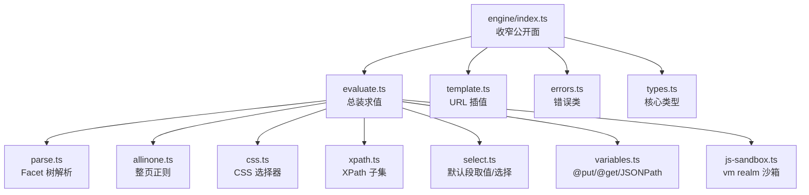
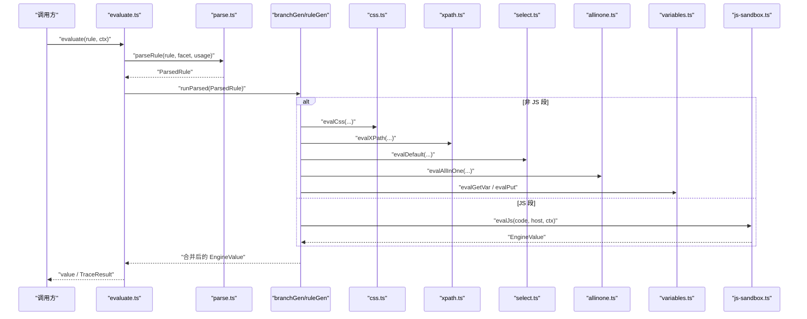
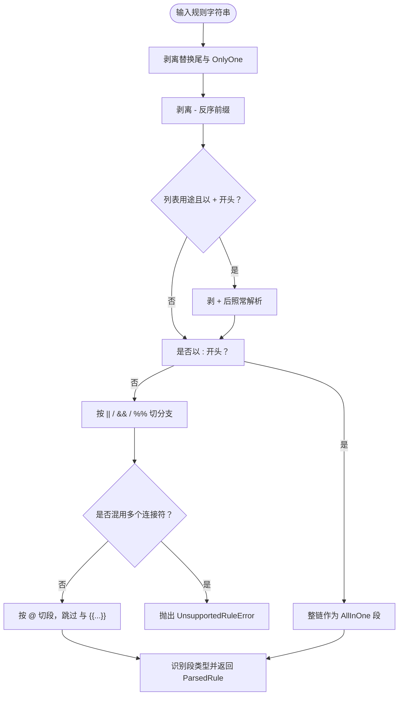
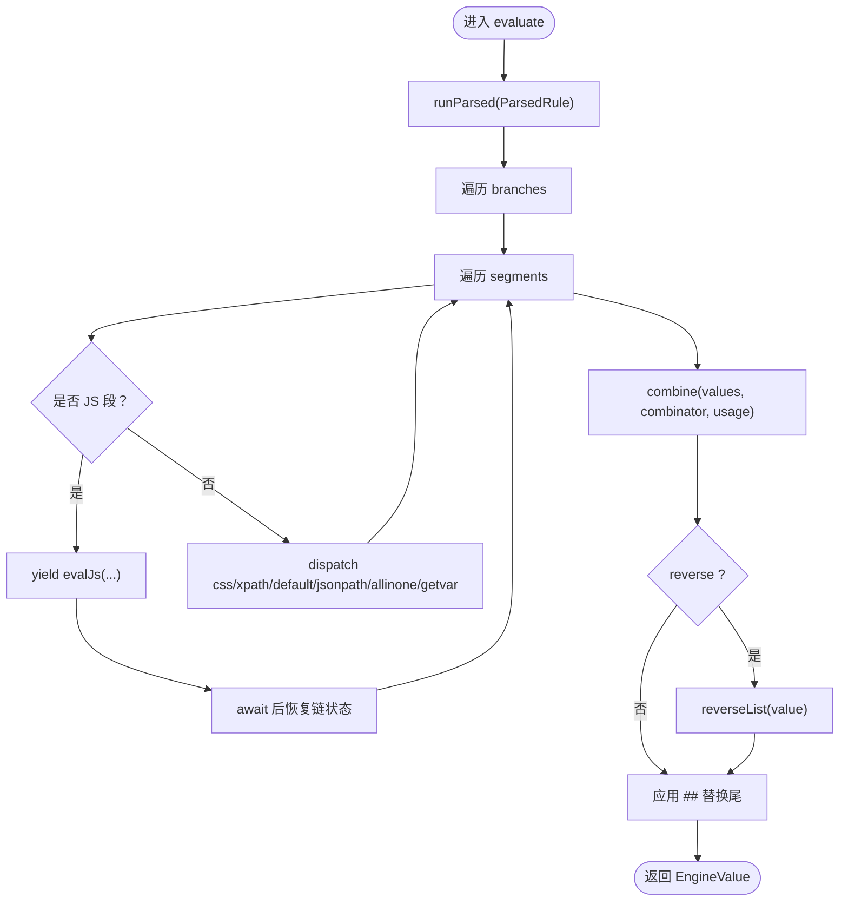
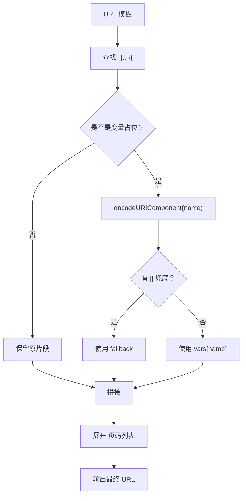
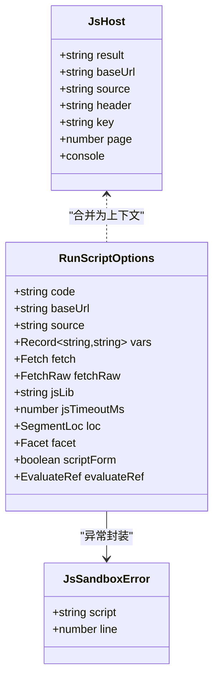
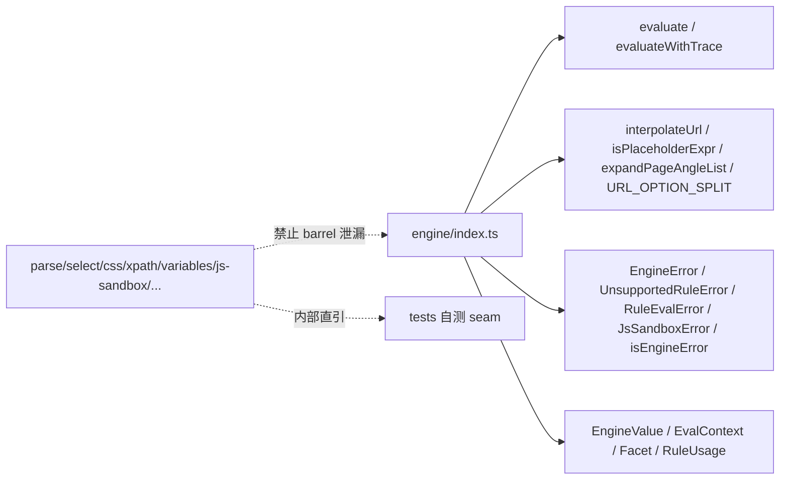

# 规则引擎

<cite>
**本文引用的文件**   
- [src/engine/parse.ts](file://src/engine/parse.ts)
- [src/engine/evaluate.ts](file://src/engine/evaluate.ts)
- [src/engine/allinone.ts](file://src/engine/allinone.ts)
- [src/engine/css.ts](file://src/engine/css.ts)
- [src/engine/xpath.ts](file://src/engine/xpath.ts)
- [src/engine/select.ts](file://src/engine/select.ts)
- [src/engine/template.ts](file://src/engine/template.ts)
- [src/engine/variables.ts](file://src/engine/variables.ts)
- [src/engine/js-sandbox.ts](file://src/engine/js-sandbox.ts)
- [src/engine/errors.ts](file://src/engine/errors.ts)
- [src/engine/index.ts](file://src/engine/index.ts)
- [tests/legado-coverage/matrix.ts](file://tests/legado-coverage/matrix.ts)
</cite>

## 目录
1. [引言](#引言)
2. [项目结构](#项目结构)
3. [核心组件](#核心组件)
4. [架构总览](#架构总览)
5. [详细组件分析](#详细组件分析)
6. [依赖关系分析](#依赖关系分析)
7. [性能建议](#性能建议)
8. [故障诊断与错误分类](#故障诊断与错误分类)
9. [兼容性对照](#兼容性对照)
10. [结论](#结论)
11. [附录：规则样例](#附录规则样例)

## 引言
legado 规则引擎负责把书源中声明的规则解析为 Facet 树，并在 HTML、JSON、XPath、CSS、正则、模板和 JS 沙箱上求值。其设计围绕三条原则展开：

- **报错而不是猜测（fail-loud at parse time）**：语法混用、未知段类型、非法选择器或正则等，在解析期或求值早期就抛出结构化错误，不静默降级。
- **收窄 barrel 暴露面**：对外只暴露 `evaluate`/`evaluateWithTrace`、URL 插值函数、错误类与判别、以及核心类型；内部模块（parse/select/css/xpath/variables 等）不得通过 barrel 外泄。
- **禁止内部模块外泄**：服务层、工具层与插件入口应通过 `engine/index.ts` 的公开接口消费引擎能力，避免直接 import 内部实现路径。

这些原则贯穿解析、求值、JS 沙箱与错误分类各层。

## 项目结构
规则引擎位于 `src/engine`，采用“按职责分文件 + 窄 barrel”的结构：

**图示来源**
- [src/engine/index.ts:1-17](file://src/engine/index.ts#L1-L17)
- [src/engine/evaluate.ts:1-200](file://src/engine/evaluate.ts#L1-L200)
- [src/engine/parse.ts:1-200](file://src/engine/parse.ts#L1-L200)

**章节来源**
- [src/engine/index.ts:1-17](file://src/engine/index.ts#L1-L17)

## 核心组件
| 组件 | 职责 | 关键行为 |
|---|---|---|
| 解析器 | 把字符串规则转为 `ParsedRule` Facet 树 | 剥离替换尾、反序前缀、AllInOne、分支组合符、段识别；混用连接符抛错 |
| 求值器 | 按分支/段顺序执行，合并结果、反序、应用替换尾 | 支持 Miss 透传、组合符语义、trace 收集 |
| AllInOne | 对整页文本全局扫描正则 | 二维匹配、零长度保护、行内标志、非法正则报 `RuleEvalError` |
| CSS 选择器 | 在候选节点集中筛选元素 | jsoup 兼容 `[attr~=regex]`、`:contains`/`:containsOwn`、选择失败变 Miss |
| XPath 子集 | 在 domhandler 树上求值 | 限定轴/谓词/测试；未知轴或步骤报 `UnsupportedRuleError` |
| 默认段 | class/id/tag/child/children 及 text/href/src 等取值 | 位置后缀、排除、越界统一走 `reducePicked` |
| 模板系统 | URL 与规则串中的 `{{…}}` 展开 | URL 编码、占位判定、尖括号页码列表、变量读链 |
| JS 沙箱 | 在 vm realm 执行用户脚本 | 禁用代码生成、java.* 垫片、超时控制、unhandledRejection 防护 |
| 错误体系 | EngineError 子类 + facet/segment 定位 | UnsupportedRuleError、RuleEvalError、JsSandboxError |

**章节来源**
- [src/engine/parse.ts:1-200](file://src/engine/parse.ts#L1-L200)
- [src/engine/evaluate.ts:1-200](file://src/engine/evaluate.ts#L1-L200)
- [src/engine/allinone.ts:1-59](file://src/engine/allinone.ts#L1-L59)
- [src/engine/css.ts:1-122](file://src/engine/css.ts#L1-L122)
- [src/engine/xpath.ts:1-200](file://src/engine/xpath.ts#L1-L200)
- [src/engine/select.ts:1-200](file://src/engine/select.ts#L1-L200)
- [src/engine/template.ts:1-61](file://src/engine/template.ts#L1-L61)
- [src/engine/variables.ts:1-197](file://src/engine/variables.ts#L1-L197)
- [src/engine/js-sandbox.ts:1-200](file://src/engine/js-sandbox.ts#L1-L200)
- [src/engine/errors.ts:1-38](file://src/engine/errors.ts#L1-L38)

## 架构总览
规则从字符串到最终值的典型流程如下：

**图示来源**
- [src/engine/evaluate.ts:1-200](file://src/engine/evaluate.ts#L1-L200)
- [src/engine/evaluate.ts:201-508](file://src/engine/evaluate.ts#L201-L508)
- [src/engine/parse.ts:1-200](file://src/engine/parse.ts#L1-L200)
- [src/engine/css.ts:1-122](file://src/engine/css.ts#L1-L122)
- [src/engine/xpath.ts:1-200](file://src/engine/xpath.ts#L1-L200)
- [src/engine/select.ts:1-200](file://src/engine/select.ts#L1-L200)
- [src/engine/allinone.ts:1-59](file://src/engine/allinone.ts#L1-L59)
- [src/engine/variables.ts:1-197](file://src/engine/variables.ts#L1-L197)
- [src/engine/js-sandbox.ts:1-200](file://src/engine/js-sandbox.ts#L1-L200)

## 详细组件分析

### Facet 树解析（parse.ts）
解析是纯词法流水线，不涉及 IO。它按固定次序处理：

1. 剥离 `##` 替换尾与 `###` OnlyOne。
2. 剥离链首 `-` 反序前缀；列表用途下再剥离 `+`。
3. 若剩余以 `:` 开头，整体视为 AllInOne 段。
4. 按 `||`/`&&`/`%%` 切分支，并检测同一条规则混用多个连接符——立即抛 `UnsupportedRuleError`。
5. 按 `@` 切段；XPath 主导形态保留谓词内的 `@`；JS 区域 `<js>`/`@js:` 与 `{{…}}` 模板区整体跳过，避免误判。
6. 段识别阶段确认 JS 形态、AllInOne、XPath、CSS、默认段等；未知模式由白名单 + 隐式 CSS 回落共同约束，未命中时留待求值阶段，但无选择器特征的未知词仍会在解析期拒绝。

**图示来源**
- [src/engine/parse.ts:1-200](file://src/engine/parse.ts#L1-L200)

**章节来源**
- [src/engine/parse.ts:1-200](file://src/engine/parse.ts#L1-L200)

### 组合符求值（evaluate.ts）
组合符定义分支间如何合并：

| 符号 | 解析名 | 语义 |
|---|---|---|
| `||` | `first` | 熔断回退：左侧为空 List 则继续右侧 |
| `&&` | `and` | 串联合并；列表用途下合并节点集 |
| `%%` | `zip` | 交叉合并，驱动长度由首个参与分支决定 |

求值过程：

- `evaluate` 接受字符串或已解析规则。
- `runParsed` 通过 generator 驱动 `ruleGen` → `branchGen`。
- 每个分支逐段求值；JS 段 yield 出 `evalJs` 调用，异步驱动器 await 后喂回。
- 分支结果交给 `combine` 按 `combinator` 与 `usage` 合并。
- 合并后按 `reverse` 反转，最后应用 `##` 替换尾。

**图示来源**
- [src/engine/evaluate.ts:1-200](file://src/engine/evaluate.ts#L1-L200)
- [src/engine/evaluate.ts:201-508](file://src/engine/evaluate.ts#L201-L508)

**章节来源**
- [src/engine/evaluate.ts:1-200](file://src/engine/evaluate.ts#L1-L200)
- [src/engine/evaluate.ts:201-508](file://src/engine/evaluate.ts#L201-L508)

### AllInOne
AllInOne 是对整页文本进行全局正则扫描：

- 自动补 `g` 标志；已有 `g` 不重复。
- 支持 Java 行内标志 `(?s)`/`(?i)`/`(?si)`，转成 JS flags。
- 每行产物为 `[group0, group1, ..., groupN]`；未参与组落空串。
- 零匹配返回空 List；非法正则报 `RuleEvalError`。
- 零长度匹配强制 `lastIndex++`，防止死循环。

**章节来源**
- [src/engine/allinone.ts:1-59](file://src/engine/allinone.ts#L1-L59)

### JSONPath 子集
JSONPath 并非完整实现，而是服务于三类场景：

1. 规则中 `$.` 或 `@json:` 的值。
2. 模板字面段中的 `{$.path}`。
3. 当 `ctx.json` 缺失且 `ctx.html` 是合法 JSON 对象时的回退数据源。

`resolveJsonData` 明确区分：

- `ctx.json` 存在时直接使用。
- `ctx.html` 以 `{` 或 `[` 开头时才尝试 `JSON.parse`。
- 非对象 JSON 不伪装成对象；非法 JSON 保持 undefined，让 JSONPath 如实 Miss。

**章节来源**
- [src/engine/variables.ts:1-197](file://src/engine/variables.ts#L1-L197)
- [src/engine/evaluate.ts:201-508](file://src/engine/evaluate.ts#L201-L508)

### XPath 选择器
XPath 是受控子集，直接在 domhandler 节点树上求值，避免 HTML→XML 重解析导致的节点错位。

支持范围：

| 类别 | 支持情况 |
|---|---|
| 路径 | `//`、`.//`、`/` |
| 节点测试 | 元素名、`*`、`text()`、末段 `@attr` |
| 轴 | child、parent(`..`)、following-sibling、preceding-sibling |
| 谓词 | 位置数字、`@attr='v'`、`text()='v'`、`contains`、`starts-with`、`not`、`position()` 比较、存在性、`and`/`or` |
| 不支持 | 其他轴如 ancestor、count/sum 等函数、中段属性步 |

未知轴或未知步骤会抛 `UnsupportedRuleError`；解析失败包装为 `RuleEvalError`。

**章节来源**
- [src/engine/xpath.ts:1-200](file://src/engine/xpath.ts#L1-L200)

### CSS 选择器
CSS 选择器基于 cheerio/nwsapi/css-select，但做了 legacy 兼容修复：

- `[attr~=regex]`：不是标准 CSS 的词表包含，而是 jsoup 的正则匹配。求值前摘除谓词，改写为 `[attr]`，再逐元素正则过滤。
- `:contains(文本)`/`:containsOwn(文本)`：cheerio 原生不支持 `:containsOwn`，且大小写行为不同；引擎在求值前摘除伪类，自己完成忽略大小写的文本包含判断。
- 选择器非法、空参数、正则非法都抛 `RuleEvalError`，不静默零命中。
- 选择失败（零命中、排除后为空、位置越界）统一走 `reducePicked`，产出 Miss。

**章节来源**
- [src/engine/css.ts:1-122](file://src/engine/css.ts#L1-L122)
- [src/engine/select.ts:1-200](file://src/engine/select.ts#L1-L200)

### 模板系统与 URL 插值（template.ts、variables.ts）
模板系统承担两类任务：

1. **URL 插值**：`interpolateUrl` 将 `{{name}}` 替换为 URL 编码后的值；若标识符不在 vars 中且无 `||` 兜底，则原样保留，不盲目编码。
2. **页码角列表**：`expandPageAngleList` 处理 `<a,b,c>` 形态，`page` 为 null 时不动原文；越界取末项。
3. **规则串模板**：`interpolateTemplate` 在字面段与 JS 段代码文本中统一展开 `{{expr}}`、`{$.path}`、`{{规则}}`、`@js:`；任一插值 Miss 整段 Miss，避免构造残缺 URL。
4. **变量读取**：`getRuleVar`/`getScopedVar` 先查内建伪变量 `bookName`/`title`，再查 `ctx.vars`、`sourceVar`；`@get:` 未定义键返回 Miss。

**图示来源**
- [src/engine/template.ts:1-61](file://src/engine/template.ts#L1-L61)

**章节来源**
- [src/engine/template.ts:1-61](file://src/engine/template.ts#L1-L61)
- [src/engine/variables.ts:1-197](file://src/engine/variables.ts#L1-L197)
- [src/engine/evaluate.ts:201-508](file://src/engine/evaluate.ts#L201-L508)

### JS 沙箱隔离
JS 沙箱是安全边界，核心机制如下：

| 安全措施 | 说明 |
|---|---|
| vm realm | 用户脚本运行在独立 realm，宿主对象不直接泄露 |
| 禁用代码生成 | `codeGeneration:{strings:false}` 使 `eval`/`Function` 构造器抛出 EvalError |
| java.* 垫片 | 通过 `__host_call__` 唯一登记点调用协议方法，参数/返回值 JSON 序列化 |
| 超时控制 | 支持 `jsTimeoutMs`，超时或异常包装为 `JsSandboxError` |
| unhandledRejection 防护 | 进程级 guard 捕获脚本 fire-and-forget rejection，避免主进程崩溃 |
| 同步 ajax 哨兵 | 没有 worker 同步桥时，`java.ajax`/`downloadFile`/`connect` 抛哨兵，由运行时换 worker 重试 |

**图示来源**
- [src/engine/js-sandbox.ts:1-200](file://src/engine/js-sandbox.ts#L1-L200)
- [src/engine/errors.ts:1-38](file://src/engine/errors.ts#L1-L38)

**章节来源**
- [src/engine/js-sandbox.ts:1-200](file://src/engine/js-sandbox.ts#L1-L200)
- [src/engine/errors.ts:1-38](file://src/engine/errors.ts#L1-L38)

## 依赖关系分析
engine/barrel 是服务层与外部消费的单一门面：

barrel 注释明确指出：此前 `export *` 把内部细节全部泄漏为对外承诺，现在只显式导出必要 API；内部模块可通过深路径被测试引用，但不是公开契约。

**图示来源**
- [src/engine/index.ts:1-17](file://src/engine/index.ts#L1-L17)

**章节来源**
- [src/engine/index.ts:1-17](file://src/engine/index.ts#L1-L17)

## 性能建议
根据源码实现与文档注释，可总结以下实践：

1. **减少深层 CSS 选择器**  
   CSS 选择器会委托给 cheerio/nwsapi/css-select，复杂嵌套会增加 DOM 查询成本；优先使用稳定的 class/id/tag 组合，避免过深的后代选择器。

2. **限制 JS 脚本长度**  
   JS 段会经过模板插值、宿主注入、vm realm 初始化与可能的 worker 换道；过长脚本增加解析与执行开销，也更容易触发超时。

3. **合理设置 `jsTimeoutMs`**  
   沙箱支持超时控制；对网络请求较多的脚本可适当放宽，但对纯本地计算应保守设置，避免单条规则拖慢整个页面解析。

4. **复用 AllInOne 而非多次全页扫描**  
   AllInOne 对整页文本扫描一次产出二维行；字段提取尽量在同一 AllInOne 内完成，避免多条规则各自扫全文。

5. **优先 JSONPath 直接取值**  
   对 JSON API 源，优先使用 `ctx.json` 或能回退解析的 `ctx.html`，配合 `$.` 路径，比 DOM 选择更轻量。

6. **注意 CSS 缓存边界**  
   CSS 选择器的谓词摘除结果按选择器文本缓存，但未设上限；大量动态生成选择器时应控制规则变化粒度。

[本节为通用性能指导，不直接分析具体文件]

## 故障诊断与错误分类
引擎错误分为三层：

| 错误类 | 含义 | 典型触发点 |
|---|---|---|
| `UnsupportedRuleError` | 语法或能力不被支持 | 混用连接符、未知段、XPath 未知轴、子规则含 JS 的同步路径 |
| `RuleEvalError` | 求值阶段业务错误 | 非法正则、非法 CSS/XPath、上游类型不匹配、选择失败 |
| `JsSandboxError` | JS 沙箱异常 | 脚本语法错误、运行时异常、超时、宿主调用失败 |
| `EngineError` | 基类 | 携带 `facet`、`segmentIndex`、`segmentRaw` 等定位信息 |

所有错误消息都会带上 facet 与片段定位，便于 UI 与服务层诊断。`isEngineError` 提供统一判别。

**章节来源**
- [src/engine/errors.ts:1-38](file://src/engine/errors.ts#L1-L38)
- [src/engine/parse.ts:1-200](file://src/engine/parse.ts#L1-L200)
- [src/engine/css.ts:1-122](file://src/engine/css.ts#L1-L122)
- [src/engine/allinone.ts:1-59](file://src/engine/allinone.ts#L1-L59)
- [src/engine/evaluate.ts:201-508](file://src/engine/evaluate.ts#L201-L508)

## 兼容性对照
legado 兼容性矩阵位于 `tests/legado-coverage/matrix.ts`，它是“彻底兼容 legado”目标的机器守卫数据表。每一行必须属于三态之一：

- `implemented`：已实现，指向实现符号与测试标题。
- `not-applicable`：环境不适用或对面即 dead。
- `open`：已知欠账或待拍板，需带复核时间戳。

当前仓库中该矩阵覆盖的规则语法包括：

| 能力 | 状态 | 说明 |
|---|---|---|
| `||` 熔断回退 | implemented | 空 List 继续向右 |
| `&&` 串联合并 | implemented | 列表用途合并节点集 |
| `%%` 交叉合并 | implemented | 驱动长度为首个参与分支 |
| 同链混用连接符 | implemented | 本仓解析期拒绝，与上游分歧 |
| 链首 `-` 反序 | implemented | 反向结果 |
| 列表规则 `+` 前缀 | implemented | 列表入口剥除后照常求值 |
| `:regex` AllInOne | implemented | 二维 matches，不含多阶段递归 |
| AllInOne `$n` 绑定 | implemented | group 0 供字段规则，$1..n 作条目 |
| AllInOne 行内标志 | implemented | `(?s)/(?i)` |
| AllInOne 必须在分支首位 | implemented | 中链非法 |
| `##` 净化尾 | implemented | 全量替换 |
| `###` OnlyOne | implemented | 先截取首个匹配再替换 |
| `##` 后接 JS 块 | open | 上游语义为字面文本，推荐维持现状 |
| CSS `[attr~=regex]` | implemented | jsoup 正则语义修复 |

其他 URL、书源字段、搜索、目录、正文、JS 宿主面等能力也在同一矩阵中逐项钉住实现、测试或缺口。

**章节来源**
- [tests/legado-coverage/matrix.ts:1-55](file://tests/legado-coverage/matrix.ts#L1-L55)

## 结论
legado 规则引擎以“解析期报错、求值期透明、沙箱强隔离”为核心。Facet 树解析严格拆分组合符与段边界；求值器以 generator 统一驱动同步与异步路径；CSS 与 XPath 走受控子集并显式拒绝未知能力；模板系统在 URL 与规则串中保持一致的 `{{…}}` 语义；JS 沙箱通过 vm realm、禁用代码生成、java.* 协议桥与超时控制构成安全边界；错误体系提供 facet 与片段定位；barrel 收窄对外承诺，把内部实现留在测试 seam 内。

对于规则作者而言，最稳妥的实践是：用明确的 CSS/XPath 选择稳定结构，用 AllInOne 做批量正则提取，用 JSONPath 处理结构化数据，用 JS 沙箱处理复杂逻辑，同时严格控制脚本长度与超时阈值。

## 附录：规则样例
以下为常见抽取任务的规则思路说明（不直接给出代码内容，仅描述形态与对应组件）：

| 目标 | 推荐规则形态 | 涉及组件 |
|---|---|---|
| 从 HTML 抽取书名 | 默认段取值：例如在标题元素上使用 tag/class/id，再取 text 或 content | select.ts、evaluate.ts |
| 从 HTML 抽取作者 | 默认段或 CSS 段：定位作者容器后取 ownText/text | select.ts、css.ts |
| 抽取目录 URL | URL 插值：使用 `{{baseUrl}}`/`{{chapter.title}}` 等占位，必要时结合 `<a,b,c>` 页码列表 | template.ts、evaluate.ts |
| 抽取章节正文 | CSS 或 XPath 定位正文容器，再取 html/content；复杂站点可用 JS 段清洗 | css.ts、xpath.ts、js-sandbox.ts |
| 批量章节提取 | AllInOne 正则扫描整页，字段规则 `$1/$2` 绑定组号 | allinone.ts、regex-row.ts |
| 跨规则共享变量 | `@put:` 写入 `ctx.vars`，后续 `@get:` 读取 | variables.ts |

**章节来源**
- [src/engine/select.ts:1-200](file://src/engine/select.ts#L1-L200)
- [src/engine/css.ts:1-122](file://src/engine/css.ts#L1-L122)
- [src/engine/xpath.ts:1-200](file://src/engine/xpath.ts#L1-L200)
- [src/engine/allinone.ts:1-59](file://src/engine/allinone.ts#L1-L59)
- [src/engine/template.ts:1-61](file://src/engine/template.ts#L1-L61)
- [src/engine/variables.ts:1-197](file://src/engine/variables.ts#L1-L197)