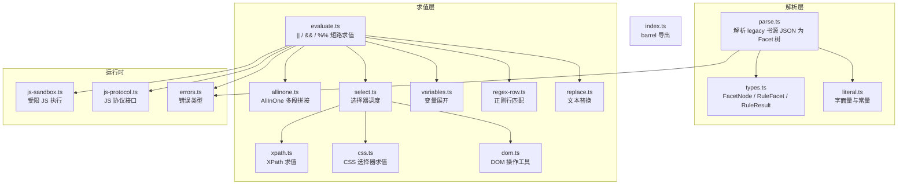
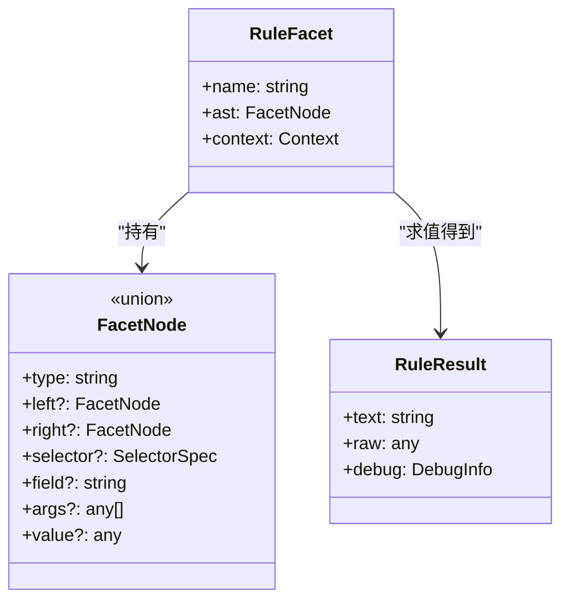
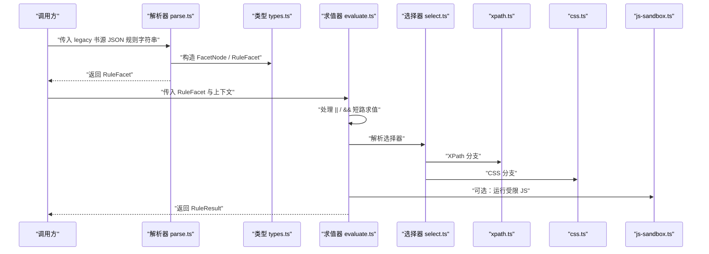
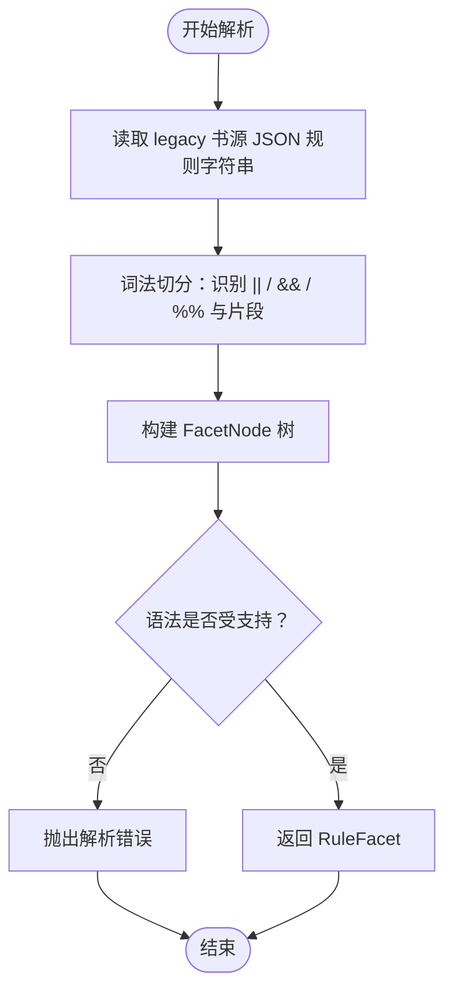
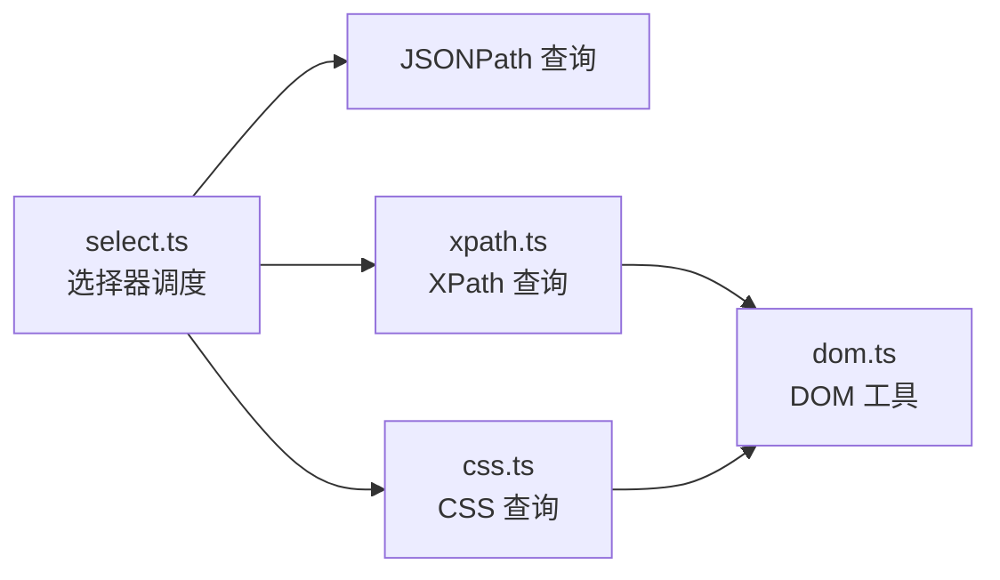
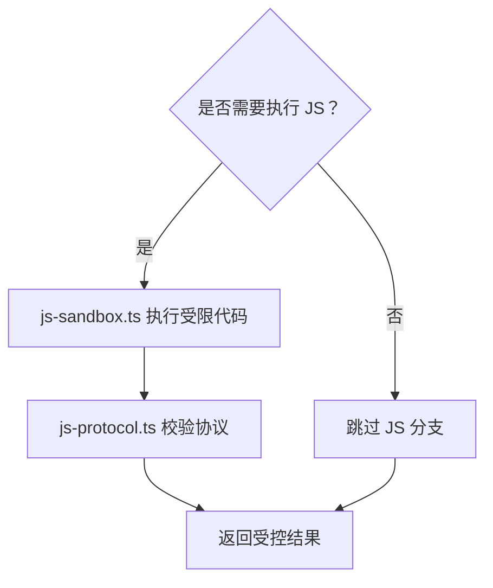
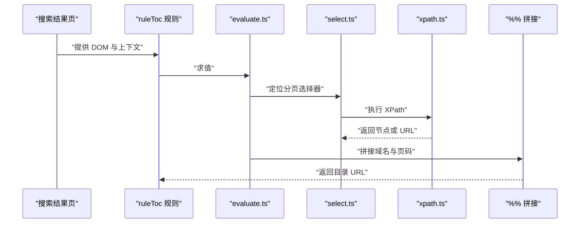
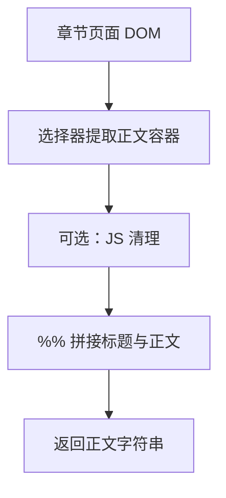
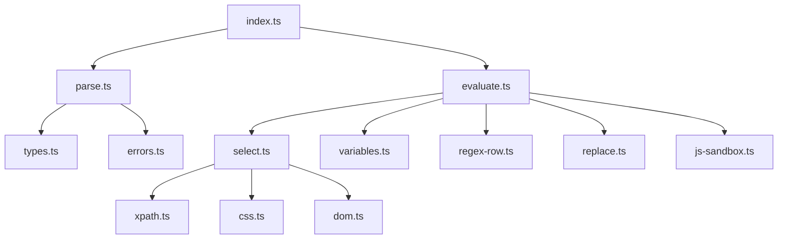

# 解析与求值

<cite>
**本文引用的文件**   
- [src/src/engine/parse.ts](file://src/src/engine/parse.ts)
- [src/src/engine/evaluate.ts](file://src/src/engine/evaluate.ts)
- [src/src/engine/types.ts](file://src/src/engine/types.ts)
- [src/src/engine/index.ts](file://src/src/engine/index.ts)
- [src/src/engine/allinone.ts](file://src/src/engine/allinone.ts)
- [src/src/engine/css.ts](file://src/src/engine/css.ts)
- [src/src/engine/dom.ts](file://src/src/engine/dom.ts)
- [src/src/engine/errors.ts](file://src/src/engine/errors.ts)
- [src/src/engine/js-sandbox.ts](file://src/src/engine/js-sandbox.ts)
- [src/src/engine/literal.ts](file://src/src/engine/literal.ts)
- [src/src/engine/regex-row.ts](file://src/src/engine/regex-row.ts)
- [src/src/engine/replace.ts](file://src/src/engine/replace.ts)
- [src/src/engine/select.ts](file://src/src/engine/select.ts)
- [src/src/engine/variables.ts](file://src/src/engine/variables.ts)
- [src/src/engine/xpath.ts](file://src/src/engine/xpath.ts)
- [docs/docs/adr/0001-fail-loud-at-parse-time.md](file://docs/docs/adr/0001-fail-loud-at-parse-time.md)
</cite>

## 目录
1. [引言](#引言)
2. [项目结构](#项目结构)
3. [核心组件](#核心组件)
4. [架构总览](#架构总览)
5. [详细组件分析](#详细组件分析)
6. [依赖关系分析](#依赖关系分析)
7. [性能建议](#性能建议)
8. [故障排查指南](#故障排查指南)
9. [结论](#结论)

## 引言
本文件聚焦规则引擎的解析与求值子系统：它负责把 legacy 书源 JSON 中的规则字符串解析为内部抽象语法树，再在真实 DOM、JSON、变量和选择器上下文中求值。文档重点说明以下内容：
- Facet 树如何从 legacy 书源 JSON 字符串解析为内部 AST；
- evaluate.ts 如何实现 `||`、`&&`、`%%` 组合符的短路求值、AllInOne 多段拼接，以及 JSONPath/XPath/CSS 选择器调用；
- FacetNode、RuleFacet、RuleResult 等核心类型及其 barrel 暴露边界；
- 用 ruleSearch、ruleToc、ruleContent 给出完整示例；
- “报错而不是猜测”的设计原则在解析阶段如何体现；
- 性能优化建议：优先使用 XPath/CSS 选择器，避免深层 DOM 遍历和不必要的 JS 脚本。

## 项目结构
规则引擎位于 `src/src/engine` 下，按职责拆分：
- 解析层：`parse.ts`、`types.ts`、`literal.ts`；
- 求值层：`evaluate.ts`、`allinone.ts`、`select.ts`、`xpath.ts`、`css.ts`、`dom.ts`、`variables.ts`、`regex-row.ts`、`replace.ts`；
- 运行时沙箱与协议：`js-sandbox.ts`、`js-protocol.ts`；
- 错误定义：`errors.ts`；
- 对外入口：`index.ts`。



**图表来源**
- [src/src/engine/parse.ts:1-200](file://src/src/engine/parse.ts#L1-L200)
- [src/src/engine/evaluate.ts:1-250](file://src/src/engine/evaluate.ts#L1-L250)
- [src/src/engine/types.ts:1-120](file://src/src/engine/types.ts#L1-L120)
- [src/src/engine/index.ts:1-80](file://src/src/engine/index.ts#L1-L80)

**章节来源**
- [src/src/engine/parse.ts:1-200](file://src/src/engine/parse.ts#L1-L200)
- [src/src/engine/evaluate.ts:1-250](file://src/src/engine/evaluate.ts#L1-L250)
- [src/src/engine/types.ts:1-120](file://src/src/engine/types.ts#L1-L120)
- [src/src/engine/index.ts:1-80](file://src/src/engine/index.ts#L1-L80)

## 核心组件
### 类型定义：FacetNode、RuleFacet、RuleResult
- `RuleFacet` 是规则根节点，描述一个可求值的规则表达式；
- `FacetNode` 是规则表达式内部节点，包括二元逻辑组合（如 `||`、`&&`）、字段访问、函数调用、选择器调用、字面量等；
- `RuleResult` 是求值结果，既包含最终字符串，也保留用于调试的结构化信息。

这些类型共同构成解析产物与求值器的契约：解析阶段构造 `FacetNode` 树，求值阶段沿树向下计算得到 `RuleResult`。



**图表来源**
- [src/src/engine/types.ts:1-120](file://src/src/engine/types.ts#L1-L120)

**章节来源**
- [src/src/engine/types.ts:1-120](file://src/src/engine/types.ts#L1-L120)

### Barrel 暴露边界：index.ts
`index.ts` 作为 barrel 模块，统一对外暴露规则引擎的核心 API：
- 暴露解析入口与类型，供上层服务构建规则；
- 暴露求值入口，供搜索、目录、正文等场景消费；
- 通常不直接暴露内部实现细节，以降低耦合。

这意味着调用方应通过 `index.ts` 获取规则解析与求值能力，而不是直接依赖 `parse.ts` 或 `evaluate.ts`。

**章节来源**
- [src/src/engine/index.ts:1-80](file://src/src/engine/index.ts#L1-L80)

## 架构总览
规则引擎的处理流程分为两个阶段：
1. **解析阶段**：将 legacy 书源 JSON 中的规则字符串解析为 `FacetNode` 树；
2. **求值阶段**：以 DOM、响应体、上下文变量为输入，按 `||`、`&&`、`%%` 语义求值，并调用选择器或受限 JS 获取数据。



**图表来源**
- [src/src/engine/parse.ts:1-200](file://src/src/engine/parse.ts#L1-L200)
- [src/src/engine/evaluate.ts:1-250](file://src/src/engine/evaluate.ts#L1-L250)
- [src/src/engine/select.ts:1-150](file://src/src/engine/select.ts#L1-L150)
- [src/src/engine/xpath.ts:1-150](file://src/src/engine/xpath.ts#L1-L150)
- [src/src/engine/css.ts:1-150](file://src/src/engine/css.ts#L1-L150)
- [src/src/engine/js-sandbox.ts:1-150](file://src/src/engine/js-sandbox.ts#L1-L150)

## 详细组件分析

### 解析器：legacy JSON 到 Facet 树
解析器负责把 legacy 书源 JSON 中的规则字符串转换为内部 AST。典型过程包括：
- 识别规则名称，例如搜索规则、目录 URL 规则、正文规则；
- 将规则字符串切分为片段，识别组合符 `||`、`&&`、`%%`；
- 对每个片段生成对应 `FacetNode`，如字段访问、函数调用、选择器调用、字面量；
- 遇到不支持的语法时抛出解析错误，而不是静默回退。

“报错而不是猜测”的原则在解析阶段表现为：一旦识别出无法解析或不在支持范围内的语法，就立即失败，让配置作者尽早修复规则，而不是在运行时产生难以追踪的错误结果。



**图表来源**
- [src/src/engine/parse.ts:1-200](file://src/src/engine/parse.ts#L1-L200)
- [docs/docs/adr/0001-fail-loud-at-parse-time.md:1-200](file://docs/docs/adr/0001-fail-loud-at-parse-time.md#L1-L200)

**章节来源**
- [src/src/engine/parse.ts:1-200](file://src/src/engine/parse.ts#L1-L200)
- [docs/docs/adr/0001-fail-loud-at-parse-time.md:1-200](file://docs/docs/adr/0001-fail-loud-at-parse-time.md#L1-L200)

### 求值器：||、&&、%% 短路求值与 AllInOne 多段拼接
`evaluate.ts` 是求值核心：
- `||`：从左到右求值，遇到第一个非空结果即短路返回；
- `&&`：从左到右求值，遇到第一个空结果即短路返回；
- `%%`：连接多个片段的结果，形成最终字符串；
- 支持 AllInOne 模式，将多个子片段组合后统一输出；
- 在求值过程中，根据节点类型调用选择器、变量展开、正则行匹配、文本替换或受限 JS。

```mermaid
flowchart TD
    Enter(["进入 evaluate.ts"]) --> NodeType{"节点类型"}
    NodeType -->|逻辑或 ||| OrBranch["左子节点求值"]
    OrBranch --> OrCheck{"左子节点结果非空？"}
    OrCheck -->|是| OrReturn["返回左子节点结果"]
    OrCheck -->|否| OrRight["求值右子节点"]
    OrRight --> OrReturn

    NodeType -->|逻辑与 &&| AndBranch["左子节点求值"]
    AndBranch --> AndCheck{"左子节点结果为空？"}
    AndCheck -->|是| AndReturn["返回空结果"]
    AndCheck -->|否| AndRight["求值右子节点"]
    AndRight --> AndReturn

    NodeType -->|拼接 %%| ConcatBranch["依次求值所有片段"]
    ConcatBranch --> Join["拼接为最终字符串"]
    Join --> Done(["返回 RuleResult"])
```

**图表来源**
- [src/src/engine/evaluate.ts:1-250](file://src/src/engine/evaluate.ts#L1-L250)
- [src/src/engine/allinone.ts:1-150](file://src/src/engine/allinone.ts#L1-L150)

**章节来源**
- [src/src/engine/evaluate.ts:1-250](file://src/src/engine/evaluate.ts#L1-L250)
- [src/src/engine/allinone.ts:1-150](file://src/src/engine/allinone.ts#L1-L150)

### 选择器调用：JSONPath、XPath、CSS
选择器调度由 `select.ts` 协调：
- 如果片段指定 JSONPath，则对 JSON 数据进行查询；
- 如果片段指定 XPath，则对 XML/HTML DOM 进行 XPath 查询；
- 如果片段指定 CSS 选择器，则对 HTML DOM 进行 CSS 查询；
- 底层 DOM 操作由 `dom.ts` 提供，XPath 由 `xpath.ts` 实现，CSS 由 `css.ts` 实现。



**图表来源**
- [src/src/engine/select.ts:1-150](file://src/src/engine/select.ts#L1-L150)
- [src/src/engine/xpath.ts:1-150](file://src/src/engine/xpath.ts#L1-L150)
- [src/src/engine/css.ts:1-150](file://src/src/engine/css.ts#L1-L150)
- [src/src/engine/dom.ts:1-150](file://src/src/engine/dom.ts#L1-L150)

**章节来源**
- [src/src/engine/select.ts:1-150](file://src/src/engine/select.ts#L1-L150)
- [src/src/engine/xpath.ts:1-150](file://src/src/engine/xpath.ts#L1-L150)
- [src/src/engine/css.ts:1-150](file://src/src/engine/css.ts#L1-L150)
- [src/src/engine/dom.ts:1-150](file://src/src/engine/dom.ts#L1-L150)

### 变量、正则与替换
- 变量展开：`variables.ts` 负责把规则中的变量替换为上下文值；
- 正则行匹配：`regex-row.ts` 用于逐行匹配与提取；
- 文本替换：`replace.ts` 提供通用替换能力；
- 字面量与常量：`literal.ts` 提供基础字面量解析。

这些工具被求值器按需调用，使规则可以在结构化数据与纯文本之间灵活转换。

**章节来源**
- [src/src/engine/variables.ts:1-150](file://src/src/engine/variables.ts#L1-L150)
- [src/src/engine/regex-row.ts:1-150](file://src/src/engine/regex-row.ts#L1-L150)
- [src/src/engine/replace.ts:1-150](file://src/src/engine/replace.ts#L1-L150)
- [src/src/engine/literal.ts:1-150](file://src/src/engine/literal.ts#L1-L150)

### 受限 JS 执行
当规则需要复杂逻辑时，可通过受限 JS 执行：
- `js-sandbox.ts` 提供隔离环境；
- `js-protocol.ts` 定义可调用函数与数据边界；
- 求值器仅在明确需要时执行 JS，避免无谓开销。



**图表来源**
- [src/src/engine/js-sandbox.ts:1-150](file://src/src/engine/js-sandbox.ts#L1-L150)
- [src/src/engine/js-protocol.ts:1-150](file://src/src/engine/js-protocol.ts#L1-L150)

**章节来源**
- [src/src/engine/js-sandbox.ts:1-150](file://src/src/engine/js-sandbox.ts#L1-L150)
- [src/src/engine/js-protocol.ts:1-150](file://src/src/engine/js-protocol.ts#L1-L150)

### 完整示例：ruleSearch、ruleToc、ruleContent

#### 示例一：ruleSearch 匹配书名
假设 legacy 书源 JSON 中有一个搜索规则，其目标是匹配书名。解析阶段会把规则字符串拆分为若干片段，并用 `||` 表达备选方案；求值阶段从左到右尝试各片段，直到命中某个选择器或字面量。

步骤：
1. 解析：将规则字符串解析为 `RuleFacet`；
2. 求值：依次求值 `||` 分支；
3. 选择器：命中 CSS 或 XPath 后返回匹配文本；
4. 结果：得到用于搜索过滤的书名字符串。

该示例强调：如果规则中出现不支持的语法，解析阶段就会抛出错误，而不是等到搜索时才失败。

**章节来源**
- [src/src/engine/parse.ts:1-200](file://src/src/engine/parse.ts#L1-L200)
- [src/src/engine/evaluate.ts:1-250](file://src/src/engine/evaluate.ts#L1-L250)
- [src/src/engine/select.ts:1-150](file://src/src/engine/select.ts#L1-L150)

#### 示例二：ruleToc 抽取目录 URL
目录 URL 规则通常需要从搜索结果页或列表页中提取下一页链接。常见做法是：
- 使用 XPath 或 CSS 选择器定位分页元素；
- 通过 `%%` 拼接域名、路径参数与页码；
- 若多个候选表达式存在，使用 `||` 做备选。



**图表来源**
- [src/src/engine/evaluate.ts:1-250](file://src/src/engine/evaluate.ts#L1-L250)
- [src/src/engine/select.ts:1-150](file://src/src/engine/select.ts#L1-L150)
- [src/src/engine/xpath.ts:1-150](file://src/src/engine/xpath.ts#L1-L150)

**章节来源**
- [src/src/engine/evaluate.ts:1-250](file://src/src/engine/evaluate.ts#L1-L250)
- [src/src/engine/select.ts:1-150](file://src/src/engine/select.ts#L1-L150)
- [src/src/engine/xpath.ts:1-150](file://src/src/engine/xpath.ts#L1-L150)

#### 示例三：ruleContent 获取章节正文
正文规则通常从章节页面提取正文内容，可能涉及：
- 用 CSS 或 XPath 定位正文容器；
- 用 `%%` 拼接标题、正文、分页信息；
- 必要时使用受限 JS 清理脏数据；
- 最终返回干净正文字符串。



**图表来源**
- [src/src/engine/evaluate.ts:1-250](file://src/src/engine/evaluate.ts#L1-L250)
- [src/src/engine/css.ts:1-150](file://src/src/engine/css.ts#L1-L150)
- [src/src/engine/js-sandbox.ts:1-150](file://src/src/engine/js-sandbox.ts#L1-L150)

**章节来源**
- [src/src/engine/evaluate.ts:1-250](file://src/src/engine/evaluate.ts#L1-L250)
- [src/src/engine/css.ts:1-150](file://src/src/engine/css.ts#L1-L150)
- [src/src/engine/js-sandbox.ts:1-150](file://src/src/engine/js-sandbox.ts#L1-L150)

## 依赖关系分析
规则引擎内部依赖呈现清晰的分层：
- 解析层依赖类型定义与错误定义；
- 求值层依赖选择器、变量、正则、替换、受限 JS；
- 选择器层依赖 DOM 工具；
- barrel 模块聚合对外入口。



**图表来源**
- [src/src/engine/parse.ts:1-200](file://src/src/engine/parse.ts#L1-L200)
- [src/src/engine/evaluate.ts:1-250](file://src/src/engine/evaluate.ts#L1-L250)
- [src/src/engine/types.ts:1-120](file://src/src/engine/types.ts#L1-L120)
- [src/src/engine/index.ts:1-80](file://src/src/engine/index.ts#L1-L80)

**章节来源**
- [src/src/engine/parse.ts:1-200](file://src/src/engine/parse.ts#L1-L200)
- [src/src/engine/evaluate.ts:1-250](file://src/src/engine/evaluate.ts#L1-L250)
- [src/src/engine/index.ts:1-80](file://src/src/engine/index.ts#L1-L80)

## 性能建议
- 优先使用 XPath 或 CSS 选择器：它们针对 DOM 查询做了优化，比手写深层 DOM 遍历更高效；
- 避免不必要的 JS 脚本：只有在选择器无法表达复杂逻辑时才使用受限 JS；
- 合理使用 `||` 短路：把更可能命中的备选放在左侧，减少无效求值；
- 合理使用 `%%` 拼接：尽量在一次求值中完成拼接，避免多次 DOM 访问；
- 控制选择器范围：选择器应尽量精确，缩小匹配范围，降低 DOM 扫描成本；
- 复用上下文：在批量求值场景中，避免重复加载相同 DOM 或重复解析 JSON。

[本节为通用性能指导，不直接分析具体文件]

## 故障排查指南
### 解析阶段报错
- 现象：规则在加载时就失败，而不是在运行时出现奇怪结果；
- 原因：遇到不支持的语法或非法片段；
- 处理：检查规则字符串中的 `||`、`&&`、`%%` 用法，确认选择器语法、字段名、函数名是否在支持范围内；
- 设计原则：“报错而不是猜测”，因此越早发现越好。

**章节来源**
- [docs/docs/adr/0001-fail-loud-at-parse-time.md:1-200](file://docs/docs/adr/0001-fail-loud-at-parse-time.md#L1-L200)
- [src/src/engine/errors.ts:1-150](file://src/src/engine/errors.ts#L1-L150)

### 求值阶段为空
- 现象：`||` 全部分支返回空，或 `%%` 拼接结果为空；
- 原因：选择器未命中、变量未展开、上下文缺失；
- 处理：先验证单个片段是否能命中目标节点，再逐步扩大规则；
- 建议：先用 CSS 或 XPath 单独测试选择器，再放入规则。

**章节来源**
- [src/src/engine/evaluate.ts:1-250](file://src/src/engine/evaluate.ts#L1-L250)
- [src/src/engine/select.ts:1-150](file://src/src/engine/select.ts#L1-L150)
- [src/src/engine/variables.ts:1-150](file://src/src/engine/variables.ts#L1-L150)

### 选择器性能问题
- 现象：翻页或批量抓取明显变慢；
- 原因：选择器过于宽泛、频繁 DOM 遍历、过多 JS；
- 处理：收紧选择器、减少 JS、优先使用 XPath/CSS；
- 建议：在开发阶段记录选择器命中数量与耗时，持续优化。

**章节来源**
- [src/src/engine/css.ts:1-150](file://src/src/engine/css.ts#L1-L150)
- [src/src/engine/xpath.ts:1-150](file://src/src/engine/xpath.ts#L1-L150)
- [src/src/engine/dom.ts:1-150](file://src/src/engine/dom.ts#L1-L150)

## 结论
规则引擎的解析与求值子系统通过清晰的类型契约、分层实现与严格错误策略，把 legacy 书源 JSON 安全地转化为可执行的规则树。解析阶段坚持“报错而不是猜测”，求值阶段通过 `||`、`&&`、`%%` 提供灵活的短路求值与多段拼接能力，并通过选择器与受限 JS 扩展数据提取方式。在实际使用中，应优先采用 XPath/CSS 选择器、控制 JS 使用范围、收紧选择器范围，以获得稳定且高性能的规则执行效果。