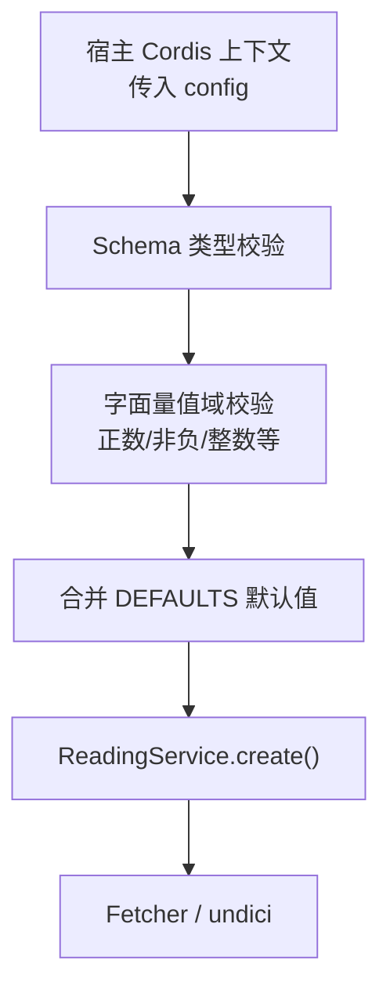
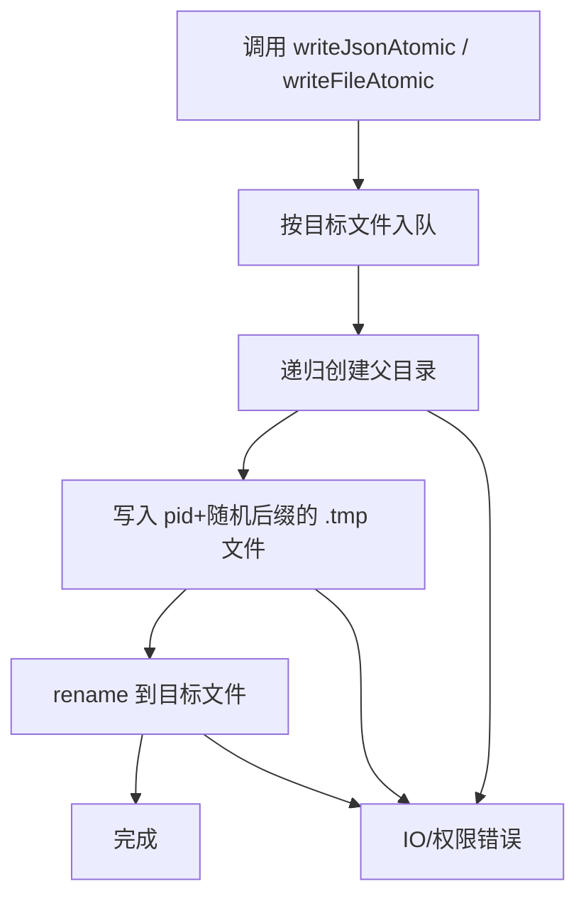
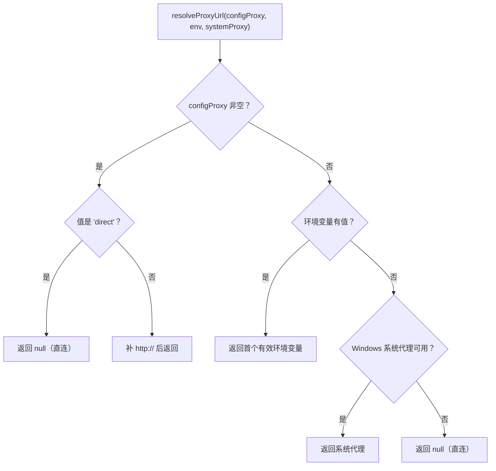

# 配置参考

<cite>
**本文引用的文件**   
- [src/index.ts](file://src/index.ts)
- [src/services/proxy.ts](file://src/services/proxy.ts)
- [src/services/storage.ts](file://src/services/storage.ts)
- [tests/services/proxy.test.ts](file://tests/services/proxy.test.ts)
- [tests/services/storage.test.ts](file://tests/services/storage.test.ts)
- [src/services/fetcher.ts](file://src/services/fetcher.ts)
- [src/services/reading.ts](file://src/services/reading.ts)
- [tests/services/defaults.test.ts](file://tests/services/defaults.test.ts)
</cite>

## 目录

1. [简介](#简介)
2. [配置入口与加载顺序](#配置入口与加载顺序)
3. [字段总览](#字段总览)
4. [核心字段逐项说明](#核心字段逐项说明)
5. [数据目录初始化与持久化结构](#数据目录初始化与持久化结构)
6. [代理解析优先级与调试](#代理解析优先级与调试)
7. [错误场景与排查](#错误场景与排查)
8. [测试与验证方法](#测试与验证方法)
9. [运维建议](#运维建议)
10. [结论](#结论)

## 简介

本配置参考面向 DSH（DeepSeek Harness）中的 `@xrn1997/dsh-novel` 插件，聚焦 `NovelConfig` 的运行时行为。重点覆盖：

- `dataDir`：小说数据根目录；
- `searchTimeoutMs`：搜索请求超时；
- `jsTimeoutMs`：JS 沙箱预算；
- `proxyUrl`：出站代理；
- 由宿主 `ctx.getConfig()` 注入、经 schema 校验并合并默认值的其他配置项；
- Windows 系统代理、环境变量与直连的解析优先级；
- `storage.ts` 如何初始化 `novelDir` 及持久化目录结构；
- 无效 URL、权限不足、路径不存在等错误的处理方式；
- 面向运维与高级用户的排障建议。

## 配置入口与加载顺序

`NovelConfig` 在插件入口中声明，并通过 schemastery 定义类型约束；实际值由宿主 Cordis 上下文传入后，先做字面量域校验，再合并各服务层的默认常量。

**图示来源**
- [src/index.ts:60-110](file://src/index.ts#L60-L110)
- [src/index.ts:112-175](file://src/index.ts#L112-L175)
- [src/services/reading.ts:45-65](file://src/services/reading.ts#L45-L65)

### 加载阶段的行为

| 阶段 | 行为 | 失败后果 |
|---|---|---|
| Schema 校验 | 检查字段是否为声明的类型（字符串或数字） | 加载期抛出异常，属于“响亮失败” |
| 值域校验 | 检查正数、非负数、整数范围 | 抛出带字段名的错误信息 |
| 默认值合并 | 未显式配置的字段回退到各模块导出的常量 | 不改变用户显式配置 |
| 服务创建 | 把最终配置传给 `ReadingService.create()` | 初始化失败时记录日志，但不炸掉整棵插件树 |

**章节来源**
- [src/index.ts:60-110](file://src/index.ts#L60-L110)
- [src/index.ts:112-175](file://src/index.ts#L112-L175)

## 字段总览

以下字段均出现在 `NovelConfig` 接口与 schema 中。除 `dataDir`、`searchTimeoutMs`、`jsTimeoutMs`、`proxyUrl` 外，其余字段同样由宿主配置注入并经同一套校验流程。

| 字段 | 类型 | 是否必填 | 默认值来源 | 校验规则 | 典型用途 |
|---|---:|---:|---|---|---|
| `dataDir` | `string` | 否 | 未提供时由 `novelDir()` 计算 | 无数值校验；目录可用性由 I/O 层暴露 | 指定小说书架、缓存、源注册表存放位置 |
| `searchTimeoutMs` | `number` | 否 | `DEFAULT_TIMEOUT_MS`（15000ms） | 必须大于 0 | 控制搜索链路的网络请求超时 |
| `searchParallel` | `number` | 否 | `DEFAULT_SEARCH_PARALLEL`（5） | 必须是 ≥ 1 的整数 | 控制多源搜索并发度 |
| `jsTimeoutMs` | `number` | 否 | `DEFAULT_JS_BUDGET_MS`（15000ms） | 必须大于 0 | JS 沙箱同步与异步总预算 |
| `cacheMaxBytes` | `number` | 否 | `DEFAULT_CACHE_MAX_BYTES`（200MB） | 必须 ≥ 0 | 内容缓存最大字节数 |
| `exportDelayMs` | `number` | 否 | `DEFAULT_EXPORT_DELAY_MS`（300ms） | 必须 ≥ 0 | 导出任务防抖延迟 |
| `localImportMaxBytes` | `number` | 否 | `DEFAULT_MAX_IMPORT_BYTES`（50MB） | 必须 > 0 | 本地 TXT/EPUB 导入上限 |
| `proxyUrl` | `string` | 否 | 由 `resolveProxyUrl()` 解析；`null` 表示直连 | 字符串需非空；值为 `'direct'` 表示强制直连 | 控制 Node fetch 出站代理 |

**章节来源**
- [src/index.ts:60-90](file://src/index.ts#L60-L90)
- [src/index.ts:92-110](file://src/index.ts#L92-L110)
- [tests/services/defaults.test.ts:21-26](file://tests/services/defaults.test.ts#L21-L26)

## 核心字段逐项说明

### dataDir

- **类型**：`string`
- **默认值**：未提供时由 `novelDir()` 返回 `$DSH_HOME/novel`；若未设置 `DSH_HOME`，则默认为 `~/.dsh/novel`
- **校验行为**：该字段本身不做路径存在性校验；首次写入 JSON、缓存或临时文件时才触发文件系统操作
- **环境变量映射**：`DSH_HOME` 影响默认数据根目录
- **典型用例**
  - 容器环境：将 `DSH_HOME` 指向 `/data/dsh`，使数据落在可挂载卷中
  - 多实例隔离：不同用户或 profile 使用不同 `DSH_HOME`
  - 开发调试：显式设置 `dataDir` 到一个临时目录，便于清理

**章节来源**
- [src/services/storage.ts:5-11](file://src/services/storage.ts#L5-L11)
- [src/index.ts:120-135](file://src/index.ts#L120-L135)

### searchTimeoutMs

- **类型**：`number`
- **默认值**：`DEFAULT_TIMEOUT_MS`，即 15000 毫秒
- **校验行为**：必须为正数；0 或负数会在加载期被拒绝
- **环境变量映射**：无直接环境变量映射；通过宿主配置注入
- **典型用例**
  - 正常网络：保持默认
  - 慢速源或跨国站点：适当调大
  - 压测或 CI：适当调小以快速失败

**章节来源**
- [src/index.ts:76-82](file://src/index.ts#L76-L82)
- [src/index.ts:92-110](file://src/index.ts#L92-L110)
- [src/services/fetcher.ts:42-45](file://src/services/fetcher.ts#L42-L45)
- [tests/services/defaults.test.ts:21-22](file://tests/services/defaults.test.ts#L21-L22)

### jsTimeoutMs

- **类型**：`number`
- **默认值**：`DEFAULT_JS_BUDGET_MS`，即 15000 毫秒
- **校验行为**：必须为正数；0 或负数会被拒绝
- **环境变量映射**：无直接环境变量映射；通过宿主配置注入
- **典型用例**
  - 普通书源：保持默认
  - 需要多次 `java.ajax`、MD5 签名或复杂正则的书源：保留 15s 或略增
  - 明确知道脚本会卡死：缩小该值以便快速定位

**章节来源**
- [src/index.ts:68-82](file://src/index.ts#L68-L82)
- [src/index.ts:92-110](file://src/index.ts#L92-L110)
- [src/services/reading.ts:45-55](file://src/services/reading.ts#L45-L55)
- [tests/services/defaults.test.ts:22-23](file://tests/services/defaults.test.ts#L22-L23)

### proxyUrl

- **类型**：`string`
- **默认值**：由 `resolveProxyUrl()` 决定，可能为：
  - 显式代理地址；
  - `null`，表示直连。
- **校验行为**
  - 空字符串或不传：进入环境变量 → 系统代理 → 直连 流程；
  - 值为 `'direct'`：强制直连，忽略环境变量与系统代理；
  - 其他字符串：视为代理地址，未带 scheme 时自动补 `http://`。
- **环境变量映射**：间接相关——当 `proxyUrl` 为空时，会读取 `HTTPS_PROXY`、`HTTP_PROXY`、`ALL_PROXY` 及其小写形式
- **典型用例**
  - 浏览器能访问但读者打不开：设置 `HTTPS_PROXY=http://127.0.0.1:7897`
  - 只希望走系统代理：留空，让 Windows 系统代理生效
  - 绕过系统代理：设为 `'direct'`

**章节来源**
- [src/index.ts:68-75](file://src/index.ts#L68-L75)
- [src/index.ts:120-145](file://src/index.ts#L120-L145)
- [src/services/proxy.ts:1-25](file://src/services/proxy.ts#L1-L25)
- [src/services/proxy.ts:27-58](file://src/services/proxy.ts#L27-L58)

## 数据目录初始化与持久化结构

### novelDir 的计算逻辑

`novelDir()` 按如下顺序确定数据根目录：

1. 从 `env.DSH_HOME` 取 home；
2. 若未设置，使用操作系统提供的 `os.homedir()` 拼接 `.dsh`；
3. 最后拼接 `novel`。

因此：

| 环境变量 | 结果目录形态 |
|---|---|
| 未设置 `DSH_HOME` | `~/.dsh/novel` |
| 设置为 `/data/dsh` | `/data/dsh/novel` |
| 设置为 `D:/dh` | `D:/dh/novel` |

**章节来源**
- [src/services/storage.ts:5-11](file://src/services/storage.ts#L5-L11)
- [tests/services/storage.test.ts:11-18](file://tests/services/storage.test.ts#L11-L18)

### 持久化目录与文件约定

`storage.ts` 是持久化写入的唯一低层路径。它负责：

- 原子写：先写 `.tmp`，再 `rename` 到目标文件；
- 损坏备份：JSON 解析失败时复制到 `<file>.bak`；
- 进程内写串行化：按目标文件名排队，避免 Windows 上并发 `rename` 报 EPERM；
- 防抖写：高频更新（如书架位置）合并为最后一次落盘；
- 退出 flush：插件卸载时尝试把防抖队列中的最后一条写入落地。

**图示来源**
- [src/services/storage.ts:58-90](file://src/services/storage.ts#L58-L90)

### 关键命名约定

| 名称 | 含义 |
|---|---|
| `<file>.<pid>.<random>.tmp` | 原子写临时文件 |
| `<file>.bak` | JSON 解析失败后的备份 |
| `novel/sources.json` | 源注册表（示例） |
| `novel/shelf.json` | 书架状态（示例） |
| `novel/page-cache/*` | 正文缓存（示例） |

这些命名集中在 `storage.ts`，不是各处硬编码猜测，避免一处改名导致清理逻辑误判。

**章节来源**
- [src/services/storage.ts:13-56](file://src/services/storage.ts#L13-L56)
- [src/services/storage.ts:58-129](file://src/services/storage.ts#L58-L129)
- [tests/services/storage.test.ts:20-114](file://tests/services/storage.test.ts#L20-L114)

## 代理解析优先级与调试

### 优先级规则

代理取值遵循严格优先级：

1. 配置显式 `proxyUrl`；
2. 环境变量 `HTTPS_PROXY` / `https_proxy` / `HTTP_PROXY` / `http_proxy` / `ALL_PROXY` / `all_proxy`；
3. Windows 系统代理；
4. 直连（`null`）。

**图示来源**
- [src/services/proxy.ts:27-58](file://src/services/proxy.ts#L27-L58)
- [src/services/proxy.ts:60-76](file://src/services/proxy.ts#L60-L76)

### 环境变量匹配顺序

`proxyFromEnv()` 按固定顺序扫描：

1. `HTTPS_PROXY`
2. `https_proxy`
3. `HTTP_PROXY`
4. `http_proxy`
5. `ALL_PROXY`
6. `all_proxy`

首个非空值胜出，并统一补上 `http://` scheme（除非已带 scheme）。

**章节来源**
- [src/services/proxy.ts:34-41](file://src/services/proxy.ts#L34-L41)
- [tests/services/proxy.test.ts:16-26](file://tests/services/proxy.test.ts#L16-L26)

### Windows 系统代理读取

仅当 `process.platform === 'win32'` 时读取注册表：

- 键路径：`HKCU\Software\Microsoft\Windows\CurrentVersion\Internet Settings`
- 要求 `ProxyEnable=1`
- 从 `ProxyServer` 值解析协议串；
- 分协议形态优先取 `https=`，退化取 `http=`；
- 解析失败、非 Windows、或读不到注册表时返回 `null`。

**章节来源**
- [src/services/proxy.ts:60-76](file://src/services/proxy.ts#L60-L76)

### 调试建议

1. **打印已解析代理**  
   插件启动时会输出类似 `[dsh-novel] 出站代理: ...` 的日志。如果看不到，说明代理解析结果为 `null`，即直连。

2. **验证优先级**  
   同时设置 `config.proxyUrl`、环境变量和 Windows 系统代理，确认只有最高优先级生效。

3. **强制直连**  
   若怀疑系统代理被意外接管，设置 `proxyUrl: 'direct'`。

4. **验证代理地址格式**  
   - `127.0.0.1:7897` 会被补成 `http://127.0.0.1:7897`；
   - `socks5://...` 原样交给 undici；
   - `ftp://...` 不会被视为有效协议段。

**章节来源**
- [src/index.ts:120-145](file://src/index.ts#L120-L145)
- [src/services/proxy.ts:1-25](file://src/services/proxy.ts#L1-L25)
- [tests/services/proxy.test.ts:1-45](file://tests/services/proxy.test.ts#L1-L45)

## 错误场景与排查

### 无效 URL

这里要区分两类 URL：

| 场景 | 行为 |
|---|---|
| `proxyUrl` 为空字符串 | 不视为有效代理，继续下一级解析 |
| `proxyUrl` 为非空字符串 | 视为代理地址；未带 scheme 自动补 `http://` |
| `proxyUrl` 为 `'direct'` | 强制直连 |
| 书源 URL 模板含非法选项 JSON | 控制台警告，URL 仍按切分后的部分发出 |
| 站点返回 302、403、404 | 通常表现为“网络错误”或“正文零命中”，应结合代理与 UA 排查 |

**章节来源**
- [src/services/proxy.ts:27-58](file://src/services/proxy.ts#L27-L58)
- [src/services/request.ts:18-35](file://src/services/request.ts#L18-L35)
- [src/services/request.ts:47-85](file://src/services/request.ts#L47-L85)

### 权限不足

`writeFileAtomic` 在写入前会递归创建父目录，但后续 `writeFile`、`rename` 仍可能因权限失败。常见表现：

- 进程启动后路由可注册，但书架或源列表无法保存；
- 日志中出现 I/O 或权限错误；
- Windows 上并发写出现 EPERM（已由进程内队列缓解，但仍需保证用户对目标目录有写权限）。

排查要点：

- 确认当前用户对 `novelDir()` 返回目录有读写权限；
- 检查是否有安全软件拦截 `.tmp` 或 `.bak` 文件；
- 不要在共享只读目录下运行 dsh-novel。

**章节来源**
- [src/services/storage.ts:58-90](file://src/services/storage.ts#L58-L90)
- [tests/services/storage.test.ts:47-66](file://tests/services/storage.test.ts#L47-L66)

### 路径不存在

- `readJson` 对 ENOENT 返回 fallback，这是首启时的正常情况；
- `writeFileAtomic` 会自动创建父目录；
- 真正的问题通常是“目录存在但不可写”，而不是“目录不存在”。

**章节来源**
- [src/services/storage.ts:33-56](file://src/services/storage.ts#L33-L56)
- [src/services/storage.ts:58-90](file://src/services/storage.ts#L58-L90)

### JSON 损坏

若 `sources.json` 等文件损坏：

- 原始文件不会被删除；
- 副本保存到 `<file>.bak`；
- 抛出 `CorruptJsonError`；
- 不会静默降级为空结果，防止用户数据被覆盖。

**章节来源**
- [src/services/storage.ts:23-31](file://src/services/storage.ts#L23-L31)
- [src/services/storage.ts:33-56](file://src/services/storage.ts#L33-L56)
- [tests/services/storage.test.ts:26-45](file://tests/services/storage.test.ts#L26-L45)

## 测试与验证方法

### 验证代理优先级

可通过单元测试断言覆盖三级优先级：

- 配置代理优先于环境变量；
- 环境变量优先于系统代理；
- 三者都缺省时返回 `null`；
- `proxyUrl: 'direct'` 覆盖所有上游来源。

**章节来源**
- [tests/services/proxy.test.ts:1-45](file://tests/services/proxy.test.ts#L1-L45)

### 验证数据目录

- `DSH_HOME` 存在时，`novelDir()` 应返回 `$DSH_HOME/novel`；
- 未设置 `DSH_HOME` 时，应返回以 `novel` 结尾的路径；
- 原子写完成后不应残留 `.tmp`；
- 并发写同一文件应以最后一次为准；
- 防抖 writer 的 `flush` 应等待全部挂起写完成。

**章节来源**
- [tests/services/storage.test.ts:11-114](file://tests/services/storage.test.ts#L11-L114)

### 验证默认值

默认值断言覆盖了搜索超时、JS 预算、搜索并行度、缓存大小、导出延迟和本地导入上限，确保配置文件看到的默认值与服务层实际默认值一致。

**章节来源**
- [tests/services/defaults.test.ts:21-26](file://tests/services/defaults.test.ts#L21-L26)

## 运维建议

1. **始终检查启动日志中的出站代理**  
   如果日志中没有打印代理地址，说明最终解析为直连。此时浏览器能打开而读者不能打开，往往就是 Windows 系统代理未被 undici 读取造成的。

2. **容器或服务器部署优先使用环境变量**  
   推荐设置 `HTTPS_PROXY`，避免依赖 Windows 注册表。

3. **不要把 `dataDir` 放在只读文件系统**  
   书架、源注册表、缓存和临时文件都需要写入。

4. **遇到“正文零命中”优先查代理**  
   某些站点对直连出口返回 302 或拦截响应；走本机代理反而返回真实页面。

5. **JSON 损坏时不要直接删库重建**  
   先看 `<file>.bak` 是否完整，再决定是否恢复。

6. **调整超时时注意 JS 沙箱预算**  
   搜索超时和 JS 沙箱预算是两个维度：网络慢可调 `searchTimeoutMs`；脚本逻辑慢可调 `jsTimeoutMs`。

7. **批量导入或高并发抓取时关注磁盘权限**  
   虽然已有进程内写串行化和防抖，但底层仍是真实 I/O，权限不足仍会失败。

## 结论

`NovelConfig` 的核心职责是把宿主配置转化为稳定的运行时参数：`dataDir` 决定数据归属，`searchTimeoutMs` 与 `jsTimeoutMs` 分别控制网络和脚本预算，`proxyUrl` 解决 Node fetch 不读系统代理的问题。配合 `storage.ts` 的原子写、损坏备份和防抖机制，插件在持久化层面提供了比简单 JSON 读写更强的容错能力。

对于运维人员而言，最值得关注的两个入口点是：

- 启动日志中的 `出站代理`；
- `novelDir()` 返回的数据目录是否存在且可写。

只要这两处正确，大多数“能搜不能看”“能看不能存”的问题都能定位到代理策略或磁盘权限。