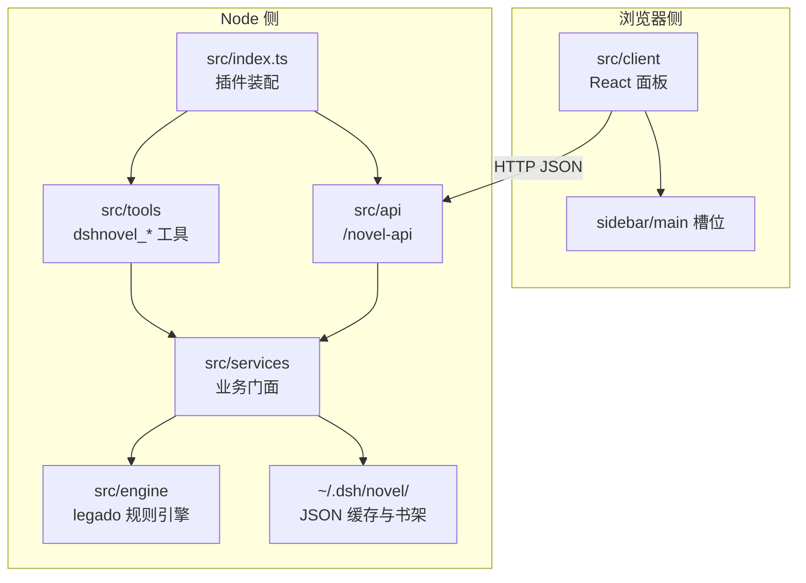
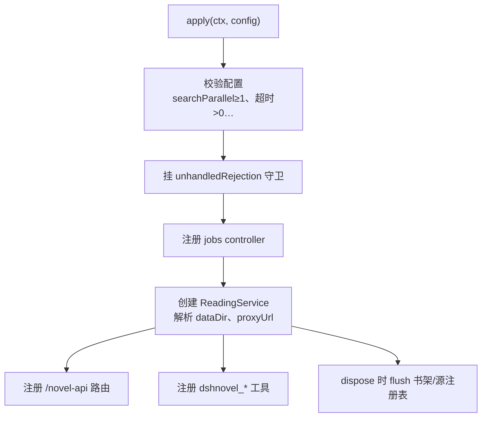
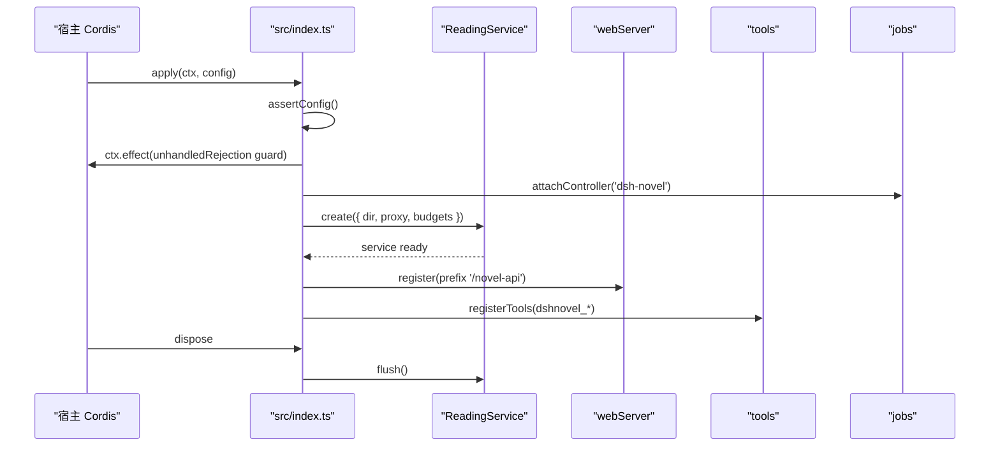
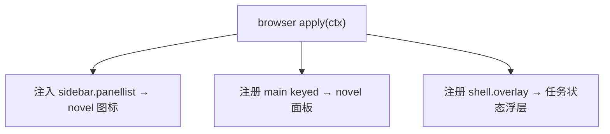
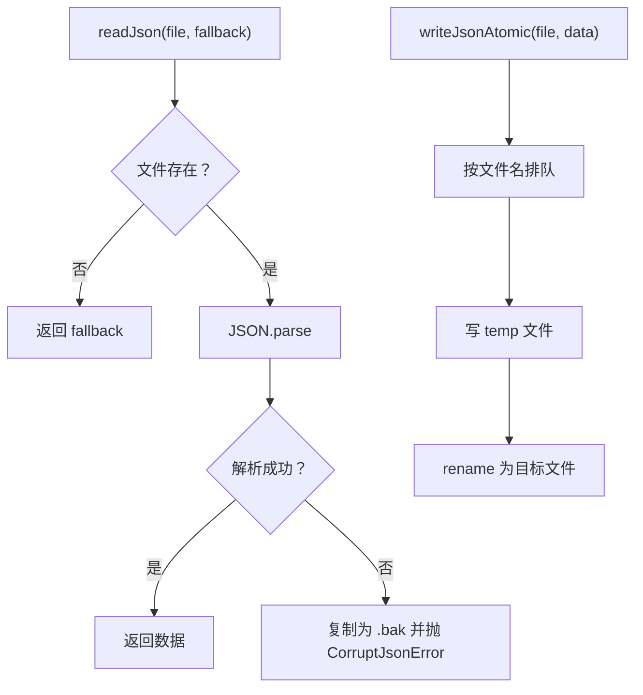
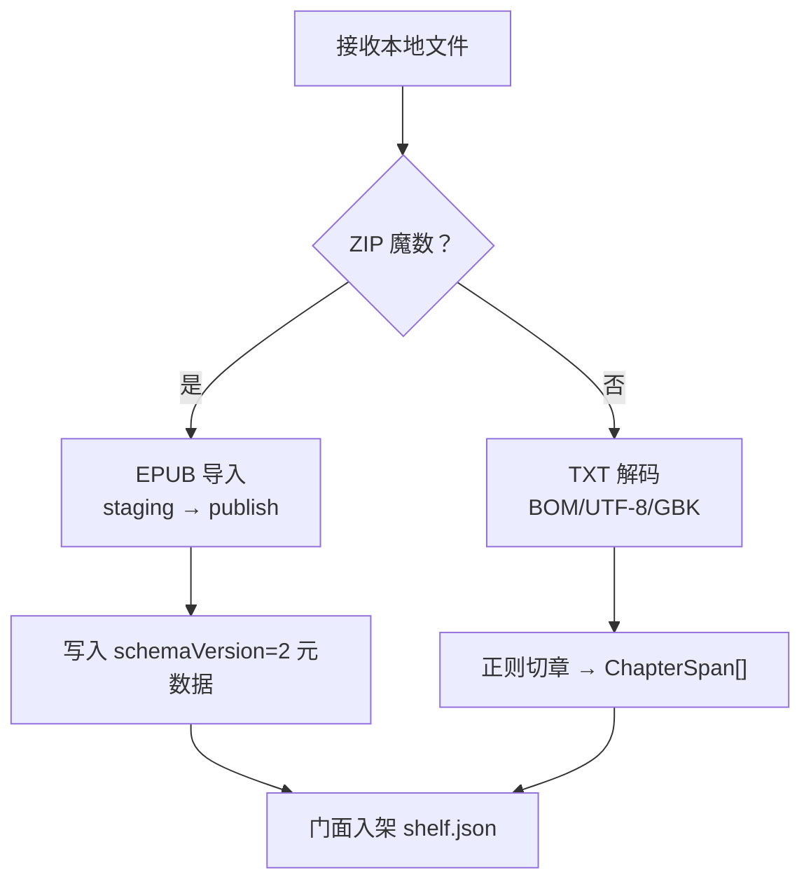

# 项目总览与快速开始

<cite>
**本文引用的文件**   
- [src/index.ts](file://src/index.ts)
- [cordis.patch.yml](file://cordis.patch.yml)
- [package.json](file://package.json)
- [docs/architecture.md](file://docs/architecture.md)
- [src/client/index.tsx](file://src/client/index.tsx)
- [src/services/storage.ts](file://src/services/storage.ts)
- [src/tools/tools.ts](file://src/tools/tools.ts)
- [src/services/localbooks.ts](file://src/services/localbooks.ts)
</cite>

## 目录
1. [简介](#简介)
2. [项目结构](#项目结构)
3. [核心能力](#核心能力)
4. [架构总览](#架构总览)
5. [快速开始：从安装到首次搜书](#快速开始从安装到首次搜书)
6. [关键组件分析](#关键组件分析)
7. [依赖与边界](#依赖与边界)
8. [性能与数据落盘](#性能与数据落盘)
9. [常见问题排查](#常见问题排查)
10. [结论](#结论)

## 简介
DSH Novel 是 DeepSeek Harness（DSH）/ Cordis 生态中的小说插件，把 legado 书源声明式子集重现在 Node + JS 沙箱中，提供“书源管理、聚合搜索、书架与阅读器、本地 TXT/EPUB 导入、六个 AI 助手工具、本机持久化”的全栈体验。它通过三个宿主接入点协作：webServer（暴露 `/novel-api`）、tools（注册 `dshnovel_*` agent 工具）、sidebar/main slot（在浏览器侧注入“小说”全局面板）。

## 项目结构
仓库同时产出两半代码，由同一份契约对齐：
- 浏览器半：React 视图与可丢弃状态，注册 sidebar 图标和 main 面板。
- Node 半：Cordis 插件入口，装配 ReadingService、注册 API 路由与 agent 工具。
- shared/wire.ts 持有两半共用的值形状与路由前缀。

**图示来源**
- [src/index.ts:1-200](file://src/index.ts#L1-L200)
- [docs/architecture.md:1-115](file://docs/architecture.md#L1-L115)

**章节来源**
- [docs/architecture.md:1-115](file://docs/architecture.md#L1-L115)
- [package.json:1-118](file://package.json#L1-L118)

## 核心能力
| 能力 | 说明 | 主要实现位置 |
|---|---|---|
| legado 书源导入与管理 | 解析 legacy JSON 书源，校验并写入源注册表 | services/sources.ts、services/intake.ts |
| 聚合搜索 | 多源并行搜索，逐源分组返回结果 | services/search-job.ts、services/search-face.ts |
| 书架与阅读器 | 加书、进度、目录、正文加载、连续滚动阅读 | services/reading.ts、client/* |
| 本地 TXT/EPUB 导入 | 自动解码 TXT、解压 EPUB，构建目录与资源索引 | services/localbooks.ts、services/epub/* |
| 六个 dshnovel_* AI 助手工具 | search、read、toc、shelf、export、local | src/tools/tools.ts |
| 本机持久化 | 源清单、书架、进度、页面缓存、本地书副本 | ~/.dsh/novel/，atomic write |

**章节来源**
- [src/tools/tools.ts:1-200](file://src/tools/tools.ts#L1-L200)
- [src/services/localbooks.ts:1-200](file://src/services/localbooks.ts#L1-L200)
- [docs/architecture.md:65-115](file://docs/architecture.md#L65-L115)

## 架构总览
DSH Novel 的 Node 半采用分层设计：engine 负责纯函数规则求值，services 作为 domain 门面封装抓取、书源、书架、缓存和本地书，api 与 tools 是两个平行的投影面，共享同一条服务链路。index.ts 是组合根，负责配置校验、ReadingService 初始化、三条 effect 注册（路由、工具、任务控制器），以及 dispose 时的 flush。

**图示来源**
- [src/index.ts:1-200](file://src/index.ts#L1-L200)

**章节来源**
- [src/index.ts:1-200](file://src/index.ts#L1-L200)
- [docs/architecture.md:20-64](file://docs/architecture.md#L20-L64)

## 快速开始：从安装到首次搜书
以下是最小成功路径，适用于普通用户：

1. **安装 DSH 宿主**  
   使用支持 cordis.patch.yml 的 DSH 版本（包内 compatibility 标注了已验证的发行号）。

2. **启用本插件**  
   将 `@xrn1997/dsh-novel` 加入宿主 profile；`cordis.patch.yml` 会插入 id 为 `dsh-novel` 的插件项。

3. **打开“小说”面板**  
   宿主侧栏出现“小说”图标，点击后进入 main keyed 槽的 NovelView。

4. **拖入 legacy JSON 书源**  
   在“设置/书源”区域拖入 legado 导出的 source.json 或单个源文件。

5. **点击探测**  
   对目标源执行探针，验证其搜索、目录与正文解析是否可用。

6. **搜索并阅读**  
   输入关键词进行聚合搜索，选择书籍后查看目录并进入阅读器。

若只想用 AI 助手，可在对话环境中调用 `dshnovel_search`、`dshnovel_toc`、`dshnovel_read`、`dshnovel_shelf` 等工具，bookKey 一律取搜索结果中的 url 字段。

**章节来源**
- [cordis.patch.yml:1-3](file://cordis.patch.yml#L1-L3)
- [package.json:47-66](file://package.json#L47-L66)
- [src/client/index.tsx:1-84](file://src/client/index.tsx#L1-L84)
- [src/tools/tools.ts:1-200](file://src/tools/tools.ts#L1-L200)

## 关键组件分析

### 插件装配入口：src/index.ts
- 导出 `name`、`inject = ['webServer','tools','jobs']`，表示必须等待这三个宿主能力就绪。
- 定义 `NovelConfig` 与 schemastery Schema，并对数值型配置做范围断言，避免 `searchParallel ≤ 0` 导致聚合搜索循环永不终止。
- 启动流程：
  - 挂 `ensureUnhandledGuard()` 守护 JS 沙箱中 fire-and-forget Promise rejection。
  - 向宿主 `jobs` 注册 controller，使后台任务准入闸放行。
  - 构造 `ReadingService`，传入 dataDir、代理、并发与预算参数。
  - 注册 `/novel-api` prefix 路由。
  - 注册 `dshnovel_*` 工具。
  - dispose 时 flush 防抖写队列，防止宿主重启丢失最后一条书架/进度。

**图示来源**
- [src/index.ts:1-200](file://src/index.ts#L1-L200)

**章节来源**
- [src/index.ts:1-200](file://src/index.ts#L1-L200)

### 浏览器侧面板：src/client/index.tsx
- 通过 `slots.inject('sidebar.panellist', ...)` 注册侧栏图标，id 为 `novel`。
- 通过 `slots.register({ key: 'novel' }, NovelPanel)` 注册 main keyed 槽占用者。
- 同时注册 `shell.overlay` 用于跨面板显示任务状态。
- 注释明确“两个座位必须同批注册”，否则宿主选中缺失的 main entry 会抛错。

**图示来源**
- [src/client/index.tsx:1-84](file://src/client/index.tsx#L1-L84)

**章节来源**
- [src/client/index.tsx:1-84](file://src/client/index.tsx#L1-L84)

### 持久化与原子写：src/services/storage.ts
- 默认数据根为 `$DSH_HOME/novel`，未设置 $DSH_HOME 时为 `~/.dsh/novel`。
- 所有 JSON 读走 `readJson`：不存在返回 fallback，损坏则备份为 `.bak` 并抛出 `CorruptJsonError`。
- 所有写走 `writeFileAtomic` / `writeJsonAtomic`：按文件名排队 rename，避免 Windows EPERM。
- `createDebouncedWriter` 合并短时间内的连续写，flush 等齐全部落地，供书架与源注册表使用。

**图示来源**
- [src/services/storage.ts:1-129](file://src/services/storage.ts#L1-L129)

**章节来源**
- [src/services/storage.ts:1-129](file://src/services/storage.ts#L1-L129)

### AI 助手工具：src/tools/tools.ts
- 六个工具统一以 `dshnovel_` 前缀注册，避免与生态其他插件重名。
- 工具数量少、action 枚举约束，弱模型更容易识别。
- 主要工具语义：
  - `dshnovel_search`：聚合搜索，返回逐源分组书目。
  - `dshnovel_read`：读取指定章序的正文纯文本。
  - `dshnovel_toc`：返回目录映射（章名→chapterIndex）。
  - `dshnovel_shelf`：list/add/save_progress/remove 书架操作。
  - `dshnovel_export`、`dshnovel_local`：导出与本地书相关能力。
- 所有 execute 调用 ReadingService 门面，render 仅做人类可读投影，规范 JSON 值保留完整字段。

**章节来源**
- [src/tools/tools.ts:1-200](file://src/tools/tools.ts#L1-L200)

### 本地 TXT/EPUB 导入：src/services/localbooks.ts
- 分流只看魔数：ZIP 本地头签名走 EPUB，否则走 TXT 解码链（BOM → UTF-8 严格 → GBK 回退）。
- 顶层元数据是提交标记：EPUB 先在 staging 目录构建，再一次 rename 发布。
- 失败只碰本次 UUID 的路径，不删除 `local/` 外内容。
- TXT 通过标题行正则切章，生成字符偏移表；EPUB 复用 import 层的文档与资源索引。
- 默认最大导入体积 50MB，传输层与服务层共享该常量。

**图示来源**
- [src/services/localbooks.ts:1-200](file://src/services/localbooks.ts#L1-L200)

**章节来源**
- [src/services/localbooks.ts:1-200](file://src/services/localbooks.ts#L1-L200)

## 依赖与边界
- 运行时依赖集中在 Node 半：undici 出站 HTTP、cheerio DOM 解析、iconv-lite 编码转换、yauzl 解压 EPUB。
- 浏览器半是 React + TypeScript 单文件闭包工厂，依赖由宿主冻结的平台模块表解答，不向外带运行时依赖。
- 宿主接入三件套：
  - webServer：prefix 路由 `/novel-api`。
  - tools：agent 工具注册。
  - sidebar/main slot：全局面板“小说”。
- 兼容信息写在 package.json 的 `dsh.compatibility.dshReleases`，当前标注 0.1.5-rc.1、0.1.7-rc.1、0.1.7-rc.2、0.2.0-rc.2 为 compatible。

**章节来源**
- [package.json:1-118](file://package.json#L1-L118)
- [docs/architecture.md:1-64](file://docs/architecture.md#L1-L64)

## 性能与数据落盘
- 搜索并发与 JS 沙箱预算可从配置覆盖，默认值在各服务模块中声明，组合根只做 coalesce。
- 聚合搜索要求 `searchParallel ≥ 1`，非法值会在加载期直接报错，避免静默卡死。
- 数据写采用原子 rename + 进程内按文件排队的串行化，避免并发 rename 导致的 EPERM。
- 书架与源注册表使用防抖写器，默认窗口 100ms；插件 dispose 时 flush，保证退出前最后一次进度落盘。
- 缓存有效性基于指纹命名，因此“没有清缓存按钮”是设计取舍而非遗漏。

**章节来源**
- [src/index.ts:1-200](file://src/index.ts#L1-L200)
- [src/services/storage.ts:1-129](file://src/services/storage.ts#L1-L129)
- [docs/architecture.md:90-115](file://docs/architecture.md#L90-L115)

## 常见问题排查
| 现象 | 可能原因 | 处理建议 |
|---|---|---|
| 宿主提示插件不兼容 | DSH 版本不在兼容列表 | 升级或降级宿主至 package.json 中标注的 compatible 版本 |
| 面板未显示 | 侧栏/main 双注册未生效，或宿主未加载 client | 确认 cordis.patch.yml 已生效、宿主已重新加载插件 |
| 搜书无结果或站点直连失败 | 出站代理未生效 | 检查 config.proxyUrl、环境变量与系统代理，日志会打印实际代理地址 |
| 搜索卡住 | searchTimeoutMs 过小或 searchParallel 配置异常 | 确保超时为正整数、parallel≥1；必要时调大 jsTimeoutMs |
| 书架进度刚读完就丢失 | 进程被强杀，防抖窗口尚未 flush | 正常退出宿主可 flush；强杀场景无法恢复未落盘条目 |
| 本地书导入乱码 | TXT 非 UTF-8 且 BOM 不可识别 | 插件回退 GBK，但误判仍可能乱码；优先保存为 UTF-8 |
| 本地书导入报过大 | 超过 localImportMaxBytes（默认 50MB） | 拆分文件或提高上限，注意磁盘空间与解析时间 |

**章节来源**
- [package.json:47-66](file://package.json#L47-L66)
- [src/index.ts:1-200](file://src/index.ts#L1-L200)
- [src/services/localbooks.ts:1-200](file://src/services/localbooks.ts#L1-L200)

## 结论
DSH Novel 是一个面向 DSH/Cordis 生态的小说宿主插件：它在 Node 半运行 legado 规则引擎与业务门面，在浏览器半提供 React 小说面板，并通过 webServer、tools、sidebar/main slot 与宿主解耦集成。对用户而言，最小路径是“安装宿主 → 打开小说面板 → 拖入 legacy JSON → 探测 → 搜索 → 阅读”；对开发者而言，入口是 `src/index.ts` 与 `cordis.patch.yml`，核心数据落盘在 `~/.dsh/novel/`，浏览器半与 Node 半通过 shared wire 契约通信。常见卡点多集中在宿主版本、代理配置与面板注册阶段，按上述表格逐项核对通常即可定位。